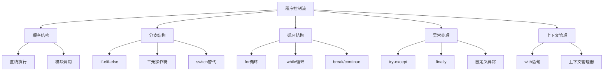

# 1.7 控制流与代码组织

## 🎯 核心理念

控制流是程序的"逻辑骨架"，代码组织是架构的"设计美学"。掌握这些技能，就是掌握了编写可维护代码的艺术。

### 📊 控制流设计层次图



## 🎨 高级分支策略

### 🎯 Guard Clauses模式

```python
# ❌ 传统嵌套分支 - 难以阅读
def process_user_data(user_data):
    if user_data is not None:
        if user_data.get('age') is not None:
            if user_data['age'] >= 18:
                if user_data.get('email') is not None:
                    if '@' in user_data['email']:
                        return f"Processing user {user_data.get('name', 'Unknown')}"
    return "Invalid user data"

# ✅ Guard Clauses模式 - 早期返回
def process_user_data_improved(user_data):
    # Guard clause: 快速退出条件
    if user_data is None:
        return "Invalid user data"
    
    if user_data.get('age') is None:
        return "Missing age"
    
    if user_data['age'] < 18:
        return "User must be 18 or older"
    
    if not user_data.get('email'):
        return "Missing email"
    
    if '@' not in user_data['email']:
        return "Invalid email format"
    
    # 主逻辑简单明了
    username = user_data.get('name', 'Unknown')
    return f"Processing user {username}"
```

### 🔄 Match-Case模式 (Python 3.10+)

```python
def handle_request_smart(request_type: str):
    """使用match-case处理请求类型"""
    match request_type.lower():
        case 'get':
            return handle_get_request()
        case 'post':
            return handle_post_request()
        case 'put':
            return handle_put_request()
        case 'delete':
            return handle_delete_request()
        case _:  # 默认情况
            raise ValueError(f"Unknown request type: {request_type}")

# ✅ 复杂的模式匹配
def categorize_score(score: int) -> str:
    match score:
        case n if n >= 90:
            return "优秀"
        case n if n >= 80:
            return "良好"
        case n if n >= 70:
            return "中等"
        case n if n >= 60:
            return "及格"
        case _:
            return "不及格"
```

## 🚀 循环优化模式

### 📊 迭代性能优化

```python
from itertools import chain, islice, cycle
from collections import deque

# ✅ 高效的数据迭代
def optimized_data_processing():
    """演示高效的循环和迭代技术"""
    
    # 1. enumerate - 获取索引和值
    items = ['apple', 'banana', 'cherry']
    for i, item in enumerate(items, 1):
        print(f"{i}. {item}")
    
    # 2. zip - 并行迭代多个序列
    names = ['Alice', 'Bob', 'Charlie']
    ages = [25, 30, 35]
    for name, age in zip(names, ages):
        print(f"{name} is {age} years old")
    
    # 3. itertools链式操作
    list1 = [1, 2, 3]
    list2 = [4, 5, 6]
    list3 = [7, 8, 9]
    
    # 链式合并
    combined = list(chain(list1, list2, list3))
    print(f"Combined: {combined}")
    
    # 切片操作 - 内存友好
    large_data = range(1000000)
    first_100 = list(islice(large_data, 100))
    
    # 循环迭代器
    counter = cycle(['A', 'B', 'C'])
    labels = [next(counter) for _ in range(6)]
    print(f"Cycle labels: {labels}")  # ['A', 'B', 'C', 'A', 'B', 'C']

optimized_data_processing()
```

### 🎪 生成器与懒惰求值

```python
def number_generator(start, stop):
    """生成器 - 懒惰计算"""
    current = start
    while current < stop:
        yield current * 2  # 只计算需要的值
        current += 1

def process_large_dataset(generator):
    """处理大批量数据的内存高效方法"""
    processed_count = 0
    for number in generator:
        # 处理数据
        result = number ** 2 + 1
        processed_count += 1
        
        # 只输出前10个结果示例
        if processed_count <= 10:
            print(f"Processed: {number} -> {result}")
    
    return processed_count

# 使用生成器处理大数据
large_numbers = number_generator(1, 1000000)
count = process_large_dataset(large_numbers)
print(f"Total processed: {count}")
```

## 🛡️ 异常处理策略

### 🎯 Specific Exception Handling

```python
import logging
from typing import Union

logger = logging.getLogger(__name__)

def robust_file_processor(filename: str) -> Union[str, None]:
    """健壮的文件处理示例"""
    try:
        with open(filename, 'r', encoding='utf-8') as file:
            content = file.read()
            logger.info(f"Successfully read file: {filename}")
            return content
            
    except FileNotFoundError:
        logger.error(f"File not found: {filename}")
        return None
        
    except PermissionError:
        logger.error(f"Permission denied: {filename}")
        return None
        
    except UnicodeDecodeError as e:
        logger.error(f"Encoding error in {filename}: {e}")
        return None
        
    except Exception as e:
        logger.error(f"Unexpected error processing {filename}: {e}")
        return None
    finally:
        logger.info(f"Finished processing {filename}")

# ✅ 异常链和上下文保护
class DataProcessor:
    def __init__(self, source: str):
        self.source = source
    
    def __enter__(self):
        print(f"Starting data processing from {self.source}")
        return self
    
    def __exit__(self, exc_type, exc_val, exc_tb):
        if exc_type is not None:
            print(f"Error during processing: {exc_val}")
            # 可以选择抑制异常或重新抛出
        print(f"Finished processing from {self.source}")
        return False  # 不抑制异常

# 使用上下文管理器
with DataProcessor("database") as processor:
    pass  # 处理逻辑
```

## 🔧 代码组织模式

### 🏗️ 模块化设计原则

```python
# calculator/modules.py
"""
模块组织示例 - 单一职责原则
"""

# ✅ 基础计算模块
class BasicCalculator:
    @staticmethod
    def add(a: float, b: float) -> float:
        return a + b
    
    @staticmethod
    def subtract(a: float, b: float) -> float:
        return a - b
    
    @staticmethod
    def multiply(a: float, b: float) -> float:
        return a * b
    
    @staticmethod
    def divide(a: float, b: float) -> float:
        if b == 0:
            raise ValueError("Division by zero")
        return a / b

# ✅ 高级计算模块
class AdvancedCalculator:
    @staticmethod
    def power(base: float, exponent: float) -> float:
        return base ** exponent
    
    @staticmethod
    def factorial(n: int) -> int:
        if n < 0:
            raise ValueError("Factorial not defined for negative numbers")
        if n == 0:
            return 1
        return n * AdvancedCalculator.factorial(n - 1)
    
    @staticmethod
    def fibonacci(n: int) -> int:
        if n < 0:
            raise ValueError("Fibonacci not defined for negative numbers")
        if n <= 1:
            return n
        return AdvancedCalculator.fibonacci(n - 1) + AdvancedCalculator.fibonacci(n - 2)

# ✅ 主计算器类 - 组合模式
class Calculator:
    def __init__(self):
        self.basic = BasicCalculator()
        self.advanced = AdvancedCalculator()
    
    def calculate(self, operation: str, *args) -> float:
        """统一的计算接口"""
        operations = {
            'add': self.basic.add,
            'subtract': self.basic.subtract,
            'multiply': self.basic.multiply,
            'divide': self.basic.divide,
            'power': self.advanced.power,
            'factorial': self.advanced.factorial,
            'fibonacci': self.advanced.fibonacci
        }
        
        if operation not in operations:
            raise ValueError(f"Unknown operation: {operation}")
        
        return operations[operation](*args)
```

### 📋 配置管理组织

```python
# config/manager.py
import json
from typing import Dict, Any
from pathlib import Path

class ConfigManager:
    """配置管理的最佳实践"""
    
    def __init__(self, config_path: str = "config.json"):
        self.config_path = Path(config_path)
        self.config: Dict[str, Any] = {}
        self.load_defaults()
    
    def load_defaults(self):
        """加载默认配置"""
        self.config = {
            "app": {
                "name": "MyApp",
                "version": "1.0.0",
                "debug": False
            },
            "database": {
                "host": "localhost",
                "port": 5432,
                "username": "default",
                "password": ""
            },
            "logging": {
                "level": "INFO",
                "file": "app.log"
            }
        }
    
    def load_from_file(self):
        """从文件加载配置"""
        if self.config_path.exists():
            with open(self.config_path, 'r') as f:
                file_config = json.load(f)
                self.config.update(file_config)
    
    def get(self, key_path: str, default=None):
        """获取配置值（支持点号路径）"""
        keys = key_path.split('.')
        value = self.config
        
        for key in keys:
            if isinstance(value, dict) and key in value:
                value = VALUE[key]
            else:
                return default
        
        return value
    
    def set(self, key_path: str, value: Any):
        """设置配置值"""
        keys = key_path.split('.')
        config = self.config
        
        # 导航到目标位置
        for key in keys[:-1]:
            if key not in config:
                config[key] = {}
            config = config[key]
        
        # 设置值
        config[keys[-1]] = value
```

## 🧪 控制流实践练习

### 📝 练习1：程序流程设计

**任务**：设计一个用户注册系统，包含完整的控制流

```python
class UserRegistrationSystem:
    # 需求：
    # 1. 输入验证（邮箱、密码强度）
    # 2. 重复用户检查
    # 3. 异常处理
    # 4. 日志记录
    # 5. 事务回滚
    
    def register_user(self, email: str, password: str, user_info: dict):
        # 你的实现...
        pass
```

### 🎯 练习2：异常处理策略

**任务**：实现一个文件批处理系统，包含多层异常处理

```python
class BatchFileProcessor:
    # 需求：
    # 1. 批量文件处理
    # 2. 单个文件错误不影响整体
    # 3. 错误恢复和重试策略
    # 4. 进度报告
    # 5. 资源清理
    
    def process_files(self, file_list: list) -> dict:
        # 你的实现...
        pass
```

## 🔗 知识连接

- **语法基础**：[[1.5 语法基础框架]] - 控制结构的基础实现
- **数据类型**：[[1.6 数据类型深度解析]] - 数据类型在控制流中的应用
- **函数设计**：[[1.8 函数设计原则]] - 函数式的控制流设计
- **面向对象**：[[2.1 面向对象编程精要]] - 类中的控制流组织

## 💡 费曼检验

**向团队成员解释：什么是良好的程序控制流设计？如何编写既高效又易维护的控制流代码？**

核心要点：
1. **清晰性原则**：代码逻辑应该像人类思维一样清晰
2. **失败安全**：程序应该优雅地处理各种异常情况
3. **性能考虑**：选择合适的控制结构来优化性能
4. **可测试性**：设计易于测试的控制流逻辑

---

📚 **扩展阅读**：
- [[⚡ 快速概念辞典]] - "控制流"、"异常处理"等术语
- [[🗺️ Python学习全景图]] - 整体学习架构

🎯 **下个目标**：学习[[1.8 函数设计原则]]中的高级函数设计技巧
