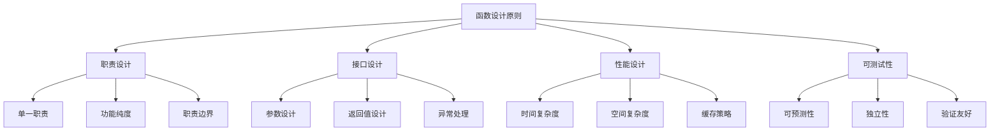

# 1.8 函数设计原则

## 🎯 核心理念

函数设计是Python编程的"艺术与科学"。遵循"单一职责原则"和"开放封闭原则"，才能写出既优雅又强大的函数。

### 🏗️ 函数设计架构



## 📋 函数设计六大原则

### 🎯 1. 单一职责原则 (SRP)

```python
# ❌ 违反SRP的函数 - 做太多事情
def process_user_data(data):
    # 验证数据
    if not data.get('email'):
        return "Invalid email"
    if not data.get('name'):
        return "Invalid name"
    
    # 格式化数据
    formatted_data = {
        'email': data['email'].lower().strip(),
        'name': data['name'].strip().title(),
        'created_at': datetime.now()
    }
    
    # 数据库操作
    try:
        db.save_user(formatted_data)
    except Exception as e:
        return f"Database error: {e}"
    
    # 发送邮件
    send_welcome_email(formatted_data['email'])
    
    return "Success"

# ✅ 符合SRP的函数拆分
def validate_user_data(data):
    """职责1: 数据验证"""
    errors = []
    if not data.get('email'):
        errors.append("Invalid email")
    if not data.get('name'):
        errors.append("Invalid name")
    return errors

def format_user_data(data):
    """职责2: 数据格式化"""
    return {
        'email': data['email'].lower().strip(),
        'name': data['name'].strip().title(),
        'created_at': datetime.now()
    }

def save_user_data(formatted_data):
    """职责3: 数据持久化"""
    try:
        db.save_user(formatted_data)
        return True, None
    except Exception as e:
        return False, f"Database error: {e}"

def process_user_registration(data):
    """职责4: 协调各个组件"""
    errors = validate_user_data(data)
    if errors:
        return {"success": False, "errors": errors}
    
    formatted_data = format_user_data(data)
    success, error = save_user_data(formatted_data)
    
    if success:
        send_welcome_email(formatted_data['email'])
        return {"success": True}
    else:
        return {"success": False, "error": error}
```

### 🔧 2. 参数设计最佳实践

```python
from typing import Union, Optional, Callable
from functools import wraps
import time

def design_perfect_functions():
    """展示完美的函数参数设计"""
    
    # ✅ 类型提示 + 默认值 + 文档
    def calculate_discount(
        price: float,
        discount_rate: float = 0.1,
        *,
        currency: str = "USD",
        apply_tax: bool = True
    ) -> tuple[float, float]:
        """
        计算折扣价格
        
        Args:
            price: 原价
            discount_rate: 折扣率 (默认10%)
            currency: 货币类型 (关键字参数)
            apply_tax: 是否应用税费
            
        Returns:
            tuple: (折扣后价格, 税费金额)
        
        Raises:
            ValueError: 当价格或折扣率为负数时
        """
        if price < 0 or discount_rate < 0:
            raise ValueError("Price and discount rate must be non-negative")
        
        discounted_price = price * (1 - discount_rate)
        tax_amount = 0.1 * discounted_price if apply_tax else 0
        
        return discounted_price + tax_amount, tax_amount
    
    # ✅ 可变参数的精妙使用
    def process_files(*file_paths: str, 
                     processor: Optional[Callable] = None,
                     **options) -> dict:
        """处理多个文件的通用函数"""
        results = {"processed": [], "failed": []}
        
        for file_path in file_paths:
            try:
                if processor:
                    result = processor(file_path, **options)
                    results["processed"].append(result)
                else:
                    results["processed"].append(f"Processing {file_path}")
            except Exception as e:
                results["failed"].append((file_path, str(e)))
        
        return results

# 实例化验证
design_perfect_functions()
```

### ⚡ 3. 性能优化设计

```python
from functools import lru_cache, wraps
import time

# ✅ 缓存装饰器实现
def memoized_cache(func):
    """自定义缓存装饰器"""
    cache = {}
    
    @wraps(func)
    def wrapper(*args, **kwargs):
        # 创建缓存键
        key = str(args) + str(sorted(kwargs.items()))
        
        if key in cache:
            print(f"Cache hit for {func.__name__}")
            return cache[key]
        
        print(f"Computing {func.__name__}")
        result = func(*args, **kwargs)
        cache[key] = result
        return result
    
    wrapper.cache_clear = lambda: cache.clear()
    wrapper.cache_info = lambda: f"Cache size: {len(cache)}"
    
    return wrapper

# ✅ 内置lru_cache的使用
@lru_cache(maxsize=128)
def fibonacci_recursive(n: int) -> int:
    """使用LRU缓存优化的斐波那契函数"""
    if n < 2:
        return n
    return fibonacci_recursive(n - 1) + fibonacci_recursive(n - 2)

# ✅ 循环优化版本
def fibonacci_iterative(n: int) -> int:
    """迭代版本的斐波那契函数"""
    if n < 2:
        return n
    
    a, b = 0, 1
    for _ in range(2, n + 1):
        a, b = b, a + b
    
    return b

# ✅ 性能比较
def performance_comparison():
    """性能对比测试"""
    test_cases = [10, 20, 30]
    
    for n in test_cases:
        # 测试递归 + 缓存版本
        start = time.time()
        result_cache = fibonacci_recursive(n)
        time_cache = time.time() - start
        
        # 测试迭代版本
        start = time.time()
        result_iter = fibonacci_iterative(n)
        time_iter = time.time() - start
        
        print(f"n={n}: Cache={time_cache:.6f}s, Iter={time_iter:.6f}s")
        print(f"Results match: {result_cache == result_iter}")

performance_comparison()
```

### 🧪 4. 函数式编程应用

```python
from typing import List, Callable, TypeVar
from functools import reduce, partial
import operator

def functional_programming_patterns():
    """函数式编程模式的应用"""
    
    # ✅ 高阶函数设计
    T = TypeVar('T')
    
    def pipeline(*functions: Callable[[T], T]) -> Callable:
        """函数管道设计"""
        def composed_func(data: T) -> T:
            return reduce(lambda x, func: func(x), functions, data)
        return composed_func
    
    # 数据处理管道
    processing_pipeline = pipeline(
        lambda x: x.strip(),           # 去除空白
        lambda x: x.lower(),          # 转小写
        lambda x: x.replace('_', ' '), # 替换下划线
        lambda x: x.title()           # 标题格式
    )
    
    result = processing_pipeline("hello_world_functional")
    print(f"Pipeline result: {result}")
    
    # ✅ 闭包和柯里化
    def create_multiplier(factor: int):
        """工厂函数 - 创建专用乘法器"""
        def multiply(number: int) -> int:
            return number * factor
        return multiply
    
    multiply_by_2 = create_multiplier(2)
    multiply_by_5 = create_multiplier(5)
    
    print(f"2 * 7 = {multiply_by_2(7)}")
    print(f"5 * 7 = {multiply_by_5(7)}")
    
    # ✅ 函数组合
    def compose(f: Callable, g: Callable) -> Callable:
        """函数组合"""
        return lambda x: f(g(x))
    
    add_one = lambda x: x + 1
    square = lambda x: x * x
    
    square_then_add_one = compose(add_one, square)
    print(f"(3² + 1) = {square_then_add_one(3)}")

functional_programming_patterns()
```

### 🛡️ 5. 错误处理设计

```python
from typing import Tuple, Optional, Union
from enum import Enum

class ResultCode(Enum):
    """结果状态码枚举"""
    SUCCESS = "success"
    VALIDATION_ERROR = "validation_error"
    PROCESSING_ERROR = "processing_error"
    UNKNOWN_ERROR = "unknown_error"

class FunctionResult:
    """函数执行结果封装"""
    def __init__(self, 
                 success: bool, 
                 result=None, 
                 error: Optional[str] = None,
                 code: ResultCode = ResultCode.SUCCESS):
        self.success = success
        self.result = result
        
        self.error = error
        self.code = code
    
    def __str__(self):
        status = "SUCCESS" if self.success else f"FAILED ({self.code.value})"
        return f"FunctionResult[{status}]: {self.result or self.error}"

def robust_data_processor(data: dict) -> FunctionResult:
    """健壮的数据处理函数"""
    try:
        # 数据验证
        errors = validate_data(data)
        if errors:
            return FunctionResult(
                False, 
                errors, 
                code=ResultCode.VALIDATION_ERROR
            )
        
        # 数据处理
        processed_data = process_data(data)
        
        # 结果验证
        if not processed_data:
            return FunctionResult(
                False, 
                "Processing produced no results",
                code=ResultCode.PROCESSING_ERROR
            )
        
        return FunctionResult(True, processed_data)
        
    except ValueError as e:
        return FunctionResult(
            False, 
            str(e), 
            code=ResultCode.VALIDATION_ERROR
        )
    except Exception as e:
        return FunctionResult(
            False, 
            f"Unexpected error: {str(e)}", 
            code=ResultCode.UNKNOWN_ERROR
        )

def validate_data(data: dict) -> List[str]:
    """数据验证函数"""
    errors = []
    if not isinstance(data, dict):
        errors.append("Data must be a dictionary")
    elif not data.get('required_field'):
        errors.append("Missing required_field")
    return errors

def process_data(data: dict) -> Optional[dict]:
    """数据处理函数"""
    # 模拟数据处理逻辑
    return {"processed": True, "original": data}

# ✅ 使用Result模式的错误处理
def error_handling_example():
    """错误处理示例"""
    test_data = {"required_field": "test_value"}
    result = robust_data_processor(test_data)
    
    print(f"Processing result: {result}")
    
    if result.success:
        print(f"Data processed: {result.result}")
    else:
        print(f"Error occurred: {result.error} ({result.code.value})")

error_handling_example()
```

### 🔬 6. 监控和调试设计

```python
import logging
import time
from functools import wraps

# ✅ 高级功能装饰器设计
def performance_monitor(func):
    """性能监控装饰器"""
    @wraps(func)
    def wrapper(*args, **kwargs):
        start_time = time.time()
        start_memory = __import__('psutil').Process().memory_info().rss
        
        try:
            result = func(*args, **kwargs)
            execution_time = time.time() - start_time
            end_memory = __import__('psutil').Process().memory_info().rss
            
            print(f"🚀 {func.__name__} executed in {execution_time:.4f}s")
            print(f"💾 Memory used: {(end_memory - start_memory) / 1024:.2f}KB")
            
            return result
            
        except Exception as e:
            execution_time = time.time() - start_time
            print(f"❌ {func.__name__} failed after {execution_time:.4f}s: {e}")
            raise
    
    return wrapper

def retry_on_failure(max_retries: int = 3, delay: float = 1.0):
    """重试装饰器"""
    def decorator(func):
        @wraps(func)
        def wrapper(*args, **kwargs):
            last_exception = None
            
            for attempt in range(max_retries + 1):
                try:
                    return func(*args, **kwargs)
                except Exception as e:
                    last_exception = e
                    if attempt < max_retries:
                        print(f"🔄 Retrying {func.__name__} (attempt {attempt + 1}/{max_retries + 1})")
                        time.sleep(delay * (2 ** attempt))  # 指数退避
                    else:
                        print(f"💥 {func.__name__} failed after {max_retries + 1} attempts")
            
            raise last_exception
        
        return wrapper
    return decorator

@performance_monitor
@retry_on_failure(max_retries=2)
def expensive_computation(n: int) -> int:
    """昂贵的计算函数"""
    time.sleep(0.1)  # 模拟耗时操作
    if n % 3 == 0:  # 模拟偶发失败
        raise ValueError(f"Random failure for {n}")
    return n ** 2

# 测试监控功能
for i in range(1, 6):
    try:
        result = expensive_computation(i)
        print(f"✅ Result: {result}")
    except Exception as e:
        print(f"❌ Failed: {e}")
```

## 🧪 函数设计实战练习

### 📝 练习1：RESTful API函数设计

**任务**：设计一个符合REST标准的用户管理API函数

```python
from typing import Dict, Any, Optional
from dataclasses import dataclass

@dataclass
class APIResponse:
    status_code: int
    data: Optional[Dict[str, Any]] = None
    message: Optional[str] = None
    error: Optional[str] = None

def user_api_handler(
    method: str,
    user_id: Optional[str] = None,
    user_data: Optional[Dict[str, Any]] = None
) -> APIResponse:
    """
    用户管理API处理函数
    
    需求：
    1. 支持GET/POST/PUT/DELETE方法
    2. 参数验证
    3. 错误处理
    4. 状态码返回
    5. 日志记录
    
    Args:
        method: HTTP方法
        user_id: 用户ID（GET/PUT/DELETE需要）
        user_data: 用户数据（POST/PUT需要）
    
    Returns:
        APIResponse: API响应对象
    """
    # 你的实现...
    pass
```

### 🎯 练习2：函数性能优化

**任务**：优化一个计算密集型函数

```python
def optimize_computation():
    """
    任务：优化以下函数的性能
    
    要求：
    1. 减少重复计算
    2. 改善算法复杂度
    3. 添加缓存机制
    4. 并行处理支持
    5. 考虑内存使用
    """
    
    def slow_function(data: List[int]) -> List[int]:
        """需要优化的慢函数"""
        results = []
        for i in data:
            # 模拟复杂计算
            result = sum(j**2 for j in range(i))
            results.append(result)
        return results
    
    # 你的优化实现...
    pass
```

## 🔗 知识连接

- **控制流**：[[1.7 控制流与代码组织]] - 函数内的控制流设计
- **面向对象**：[[2.1 面向对象编程精要]] - 方法与函数的设计差异
- **函数式编程**：[[2.3 函数式编程]] - 纯函数与高阶函数
- **错误处理**：[[3.3.1 异常处理最佳实践]] - 函数中的异常策略

## 💡 费曼检验

**向同事解释：什么是好的函数设计？如何设计既高效又易维护的函数？**

核心要点：
1. **单一职责**：一个函数只做一件事情，但要做好
2. **可预测性**：相同的输入总能得到相同的输出
3. **错误友善**：优雅地处理错误，而不是让程序崩溃
4. **性能意识**：在正确性和可读性的基础上追求性能

---

📚 **扩展阅读**：
- [[⚡ 快速概念辞典]] - "函数"、"参数"、"返回值"等术语
- [[🗺️ Python学习全景图]] - 整体学习架构

🎯 **下个目标**：开始学习[[2.1 面向对象编程精要]]中的OOP核心概念
