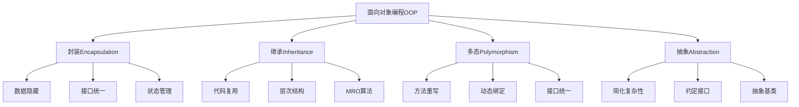

# 2.1 面向对象编程精要

## 🎯 核心理念

面向对象编程（OOP）是Python的"结构化思维艺术"。它将现实世界的概念转化为代码中的类与对象，体现了"万物皆对象"的设计哲学。

### 🏗️ OOP四大支柱架构



## 🎨 核心类设计模式

### 💡 类和对象的本质区别

```python
# ✅ 类的设计 - 模板和蓝图
class BankAccount:
    """银行账户类 - 展示OOP核心概念"""
    
    # 类变量 - 所有实例共享
    BANK_NAME = "Python Bank"
    ACCOUNT_COUNTER = 0
    
    def __init__(self, owner: str, initial_balance: float = 0.0):
        """初始化方法 - 构造函数"""
        self.owner = owner  # 实例变量
        self._balance = initial_balance  # 私有属性（单下划线约定）
        self.__account_number = None  # 公有属性
        BankAccount.ACCOUNT_COUNTER += 1
    
    @property
    def balance(self) -> float:
        """属性访问器 - 封装体现"""
        return self._balance
    
    @balance.setter
    def balance(self, value: float):
        """属性设置器 - 数据验证"""
        if value < 0:
            raise ValueError("Balance cannot be negative")
        self._balance = value
    
    def deposit(self, amount: float) -> bool:
        """存款方法"""
        if amount <= 0:
            raise ValueError("Deposit amount must be positive")
        self._balance += amount
        return True
    
    def withdraw(self, amount: float) -> bool:
        """取款方法"""
        if amount <= 0:
            raise ValueError("Withdrawal amount must be positive")
        if amount > self._balance:
            raise ValueError("Insufficient funds")
        self._balance -= amount
        return True
    
    @classmethod
    def create_premium_account(cls, owner: str):
        """类方法 - 替代构造函数"""
        account = cls(owner)
        account._balance = 1000.0  # 赠送1000元
        return account
    
    @staticmethod
    def validate_account_number(number: str) -> bool:
        """静态方法 - 工具函数"""
        return len(number) == 10 and number.isdigit()
    
    def __str__(self) -> str:
        """字符串表示"""
        return f"Account({self.owner}, Balance: ${self._balance:.2f})"
    
    def __repr__(self) -> str:
        """程序员表示"""
        return f"BankAccount('{self.owner}', {self._balance})"

# 对象实例化 - 蓝图变为现实
account1 = BankAccount("Alice", 500.0)
account2 = BankAccount.create_premium_account("Bob")

print(f"账户1: {account1}")
print(f"银行总数: {BankAccount.ACCOUNT_COUNTER}")
```

### 🔗 继承关系设计

```python
from abc import ABC, abstractmethod
from enum import Enum

class AccountType(Enum):
    """账户类型枚举"""
    SAVINGS = "savings"
    CHECKING = "checking"
    BUSINESS = "business"

class Account(ABC):
    """抽象基类 - 定义接口契约"""
    
    def __init__(self, owner: str):
        self.owner = owner
        self._balance = 0.0
        self.transactions = []
    
    @property
    @abstractmethod
    def interest_rate(self) -> float:
        """抽象属性 - 子类必须实现"""
        pass
    
    @abstractmethod
    def calculate_fees(self) -> float:
        """抽象方法 - 子类必须实现"""
        pass
    
    def add_transaction(self, description: str, amount: float):
        """通用方法 - 所有子类共享"""
        self.transactions.append({
            'description': description,
            'amount': amount,
            'timestamp': __import__('datetime').datetime.now()
        })

class SavingsAccount(Account):
    """储蓄账户 - 具体实现"""
    
    @property
    def interest_rate(self) -> float:
        return 0.02  # 2%年利率
    
    def calculate_fees(self) -> float:
        # 储蓄账户无手续费
        return 0.0
    
    def add_interest(self):
        """储蓄账户特有方法"""
        interest = self._balance * self.interest_rate / 12
        self._balance += interest
        self.add_transaction(f"Interest payment", interest)

class CheckingAccount(Account):
    """支票账户 - 具体实现"""
    
    def __init__(self, owner: str, monthly_fee: float = 10.0):
        super().__init__(owner)
        self.monthly_fee = monthly_fee
    
    @property
    def interest_rate(self) -> float:
        return 0.0  # 支票账户无利息
    
    def calculate_fees(self) -> float:
        return self.monthly_fee
    
    def deduct_monthly_fee(self):
        """支票账户特有方法"""
        fee = self.calculate_fees()
        self._balance -= fee
        self.add_transaction(f"Monthly fee", -fee)

# ✅ 多态体现
accounts: list[Account] = [
    SavingsAccount("Alice"),
    CheckingAccount("Bob", 5.0),
    SavingsAccount("Charlie")
]

for account in accounts:
    print(f"{account.owner}: Interest rate {account.interest_rate:.1%}")
    print(f"  Monthly fees: ${account.calculate_fees():.2f}")
```

### 🎪 高级OOP模式

```python
from typing import Protocol, runtime_checkable
from dataclasses import dataclass

# ✅ 现代Python - Protocol接口
@runtime_checkable
class PaymentProcessor(Protocol):
    """支付处理器协议 - 现代接口定义"""
    
    def process_payment(self, amount: float) -> bool:
        """处理支付"""
        ...
    
    def refund_payment(self, amount: float) -> bool:
        """处理退款"""
        ...

# ✅ 适配器模式
class CreditCardProcessor:
    """信用卡支付处理器"""
    
    def process_payment(self, amount: float) -> bool:
        print(f"Processing ${amount} via credit card")
        return True
    
    def refund_payment(self, amount: float) -> bool:
        print(f"Refunding ${amount} via credit card")
        return True

class PayPalProcessor:
    """PayPal支付处理器"""
    
    def process_payment(self, amount: float) -> bool:
        print(f"Processing ${amount} via PayPal")
        return True
    
    def refund_payment(self, amount: float) -> bool:
        print(f"Refunding ${amount} via PayPal")
        return True

# ✅ 工厂模式
@dataclass
class PaymentConfig:
    processor_type: str
    api_key: str = ""
    sandbox_mode: bool = False

class PaymentFactory:
    """支付处理器工厂"""
    
    @staticmethod
    def create_processor(config: PaymentConfig) -> PaymentProcessor:
        """创建支付处理器"""
        processors = {
            "credit_card": CreditCardProcessor,
            "paypal": PayPalProcessor
        }
        
        processor_class = processors.get(config.processor_type)
        if not processor_class:
            raise ValueError(f"Unknown processor type: {config.processor_type}")
        
        return processor_class()

# ✅ 策略模式
class PaymentService:
    """支付服务 - 策略模式应用"""
    
    def __init__(self, processor: PaymentProcessor):
        self.processor = processor
    
    def pay(self, amount: float) -> bool:
        """执行支付"""
        if amount <= 0:
            raise ValueError("Payment amount must be positive")
        
        return self.processor.process_payment(amount)
    
    def refund(self, amount: float) -> bool:
        """执行退款"""
        if amount <= 0:
            raise ValueError("Refund amount must be positive")
        
        return self.processor.refund_payment(amount)

# 使用示例
config1 = PaymentConfig("credit_card", api_key="sk_test_123")
config2 = PaymentConfig("paypal", api_key="pp_test_456", sandbox_mode=True)

processor1 = PaymentFactory.create_processor(config1)
processor2 = PaymentFactory.create_processor(config2)

service1 = PaymentService(processor1)
service2 = PaymentService(processor2)

service1.pay(100.50)
service2.pay(75.25)
```

### 🔮 元类编程入门

```python
class SingletonMeta(type):
    """单例元类"""
    _instances = {}
    
    def __call__(cls, *args, **kwargs):
        if cls not in cls._instances:
            cls._instances[cls] = super().__call__(*args, **kwargs)
        return cls._instances[cls]

class DatabaseConnection(metaclass=SingletonMeta):
    """单例数据库连接"""
    
    def __init__(self):
        print("Creating database connection...")
        self.connection_id = id(self)

# 确保只创建一个实例
db1 = DatabaseConnection()
db2 = DatabaseConnection()
print(f"Same instance: {db1 is db2}")
```

## 🧪 OOP设计练习

### 📝 练习1：设计电商系统

**任务**：设计一个简单的电商系统类图

```python
# 需求分析：
# 1. Product类（商品）
# 2. Customer类（顾客）
# 3. Order类（订单）
# 4. Payment类（支付）
# 5. Shipping类（配送）

from abc import ABC, abstractmethod
from enum import Enum
from typing import List, Optional

class OrderStatus(Enum):
    PENDING = "pending"
    CONFIRMED = "confirmed"
    SHIPPED = "shipped"
    DELIVERED = "delivered"
    CANCELLED = "cancelled"

class Product:
    # 商品类的实现...
    pass

class Customer:
    # 顾客类的实现...
    pass

class Order:
    # 订单类的实现...
    pass

# 要求：
# 1. 使用继承和组合
# 2. 实现多态
# 3. 考虑状态变化
# 4. 异常处理
```

### 🎯 练习2：设计缓存系统

**任务**：实现多种缓存策略

```python
from abc import ABC, abstractmethod
from typing import Any, Optional
import time

class CacheStrategy(ABC):
    @abstractmethod
    def get(self, key: str) -> Optional[Any]:
        pass
    
    @abstractmethod
    def set(self, key: str, value: Any) -> None:
        pass

class LRUCache(CacheStrategy):
    # LRU缓存实现...
    pass

class TTLCache(CacheStrategy):
    # TTL缓存实现...
    pass

class CacheManager:
    # 缓存管理器实现...
    pass
```

## 🔗 知识连接

- **函数设计**：[[1.8 函数设计原则]] - 方法与函数的设计区别
- **类与对象**：[[2.1.1 类与对象本质]] - 深层次理解OOP原理
- **继承机制**：[[2.1.2 继承与MRO算法]] - Python继承的底层实现
- **设计模式**：[[2.1.3 设计模式在Python中的应用]] - OOP在实践中的应用

## 💡 费曼检验

**向新同事解释：什么是面向对象编程？为什么说Python的OOP是"万物皆对象"的体现？**

核心要点：
1. **抽象思维**：OOP让我们用现实世界的概念来思考编程
2. **代码复用**：继承和组合让我们复用代码而不重复写
3. **封装安全**：数据隐藏让对象更安全可靠
4. **扩展灵活**：多态让系统易于扩展新功能

---

📚 **扩展阅读**：
- [[⚡ 快速概念辞典]] - "类"、"对象"、"继承"等术语
- [[🗺️ Python学习全景图]] - 整体学习架构

🎯 **下个目标**：深入学习[[2.1.1 类与对象本质]]中Python的底层对象模型
