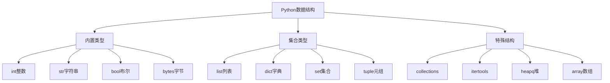

# 2.2 数据结构与算法

## 🎯 核心理念

数据结构是程序的"骨架"，算法是程序的"灵魂"。Python提供了丰富而优雅的数据结构，配合高效的算法，能解决90%的编程问题。

### 🏗️ Python数据结构层次



## 🔍 核心数据结构性能分析

### 📊 时间复杂度对比

| 操作 | list | dict/set | collections.deque | 说明 |
|------|------|----------|-------------------|------|
| **查找** | O(n) | O(1) | O(n) | dict/set最快 |
| **插入** | O(1)/O(n) | O(1) | O(1) | 末尾插入vs指定位置 |
| **删除** | O(n)/O(1) | O(1) | O(1) | 末尾删除vs指定元素 |
| **排序** | O(n log n) | N/A | O(n) | deque不支持排序 |

### 🚀 高级数据结构应用

```python
from collections import deque, Counter, defaultdict
from heapq import heappush, heappop, nlargest
from itertools import combinations, permutations, chain

class AdvancedDataStructures:
    """高级数据结构应用示例"""
    
    @staticmethod
    def deque_examples():
        """双端队列的高级应用"""
        # 滑动窗口最大值
        def sliding_window_max(nums, k):
            dq = deque()
            result = []
            
            for i, num in enumerate(nums):
                # 移除窗口外的元素
                while dq and dq[0] <= i - k:
                    dq.popleft()
                
                # 移除比当前元素小的元素
                while dq and nums[dq[-1]] < num:
                    dq.pop()
                
                dq.append(i)
                
                # 窗口形成后记录最大值
                if i >= k - 1:
                    result.append(nums[dq[0]])
            
            return result
        
        # 测试滑动窗口
        nums = [1, 3, -1, -3, 5, 3, 6, 7]
        k = 3
        result = sliding_window_max(nums, k)
        print(f"滑动窗口最大值: {result}")
        
        # 队列实现
        queue = deque()
        queue.append(1)
        queue.append(2)
        queue.append(3)
        
        while queue:
            print(f"出队: {queue.popleft()}")
    
    @staticmethod
    def heap_examples():
        """堆的高级应用"""
        # 堆排序实现
        def heap_sort(arr):
            heap = []
            # 建立最小堆
            for item in arr:
                heappush(heap, item)
            
            # 逐个弹出最小值
            sorted_arr = []
            while heap:
                sorted_arr.append(heappop(heap))
            
            return sorted_arr
        
        # Top K 问题
        def find_top_k(nums, k):
            return nlargest(k, nums)
        
        # 测试堆操作
        data = [3, 1, 4, 1, 5, 9, 2, 6]
    print("排序:", heap_sort(data))
    print("Top 3:", find_top_k(data, 3))

AdvancedDataStructures.deque_examples()
AdvancedDataStructures.heap_examples()
```

### 🎯 算法模式实现

```python
class AlgorithmPatterns:
    """常见算法模式的Python实现"""
    
    @staticmethod
    def two_pointers_pattern():
        """双指针算法模式"""
        
        def find_pair_sum(nums, target):
            """两数之和问题"""
            left, right = 0, len(nums) - 1
            
            while left < right:
                current_sum = nums[left] + nums[right]
                
                if current_sum == target:
                    return [left, right]
                elif current_sum < target:
                    left += 1
                else:
                    right -= 1
            
            return []
        
        def remove_duplicates(nums):
            """移除重复元素"""
            if not nums:
                return 0
            
            slow = 0
            for fast in range(1, len(nums)):
                if nums[fast] != nums[slow]:
                    slow += 1
                    nums[slow] = nums[fast]
            
            return slow + 1
        
        # 测试双指针算法
        nums = [1, 2, 3, 4, 5, 6]
        print(f"两数之和结果: {find_pair_sum(nums, 10)}")
        
        sorted_nums = [1, 1, 2, 2, 3, 3]
        length = remove_duplicates(sorted_nums)
        print(f"去重后长度: {length}, 数组前{length}个: {sorted_nums[:length]}")
    
    @staticmethod
    def dfs_pattern():
        """深度优先搜索模式"""
        
        def dfs_graph(graph, start, visited=None):
            """图的DFS遍历"""
            if visited is None:
                visited = set()
            
            visited.add(start)
            print(f"访问节点: {start}")
            
            for neighbor in graph.get(start, []):
                if neighbor not in visited:
                    dfs_graph(graph, neighbor, visited)
            
            return visited
        
        def dfs_tree_preorder(root):
            """树的前序遍历"""
            if not root:
                return []
            
            result = [root.val]
            result.extend(dfs_tree_preorder(root.left))
            result.extend(dfs_tree_preorder(root.right))
            
            return result
        
        # 测试DFS
        graph = {
            'A': ['B', 'C'],
            'B': ['A', 'D', 'E'],
            'C': ['A', 'F'],
            'D': ['B'],
            'E': ['B', 'F'],
            'F': ['C', 'E']
        }
        print("图DFS遍历:")
        dfs_graph(graph, 'A')

AlgorithmPatterns.two_pointers_pattern()
AlgorithmPatterns.dfs_pattern()
```

## 🧪 算法优化实践

### 📝 练习1：设计LRU缓存

**任务**：实现一个高效的LRU缓存系统

```python
from collections import OrderedDict

class LRUCache:
    """LRU缓存实现"""
    
    def __init__(self, capacity: int):
        self.capacity = capacity
        self.cache = OrderedDict()
    
    def get(self, key: int) -> int:
        if key in self.cache:
            # 移动到末尾（最近使用）
            self.cache.move_to_end(key)
            return self.cache[key]
        return -1
    
    def put(self, key: int) -> None:
        if key in self.cache:
            # 更新现有key
            self.cache.move_to_end(key)
        else:
            if len(self.cache) >= self.capacity:
                # 删除最久未使用的
                self.cache.popitem(last=False)
            self.cache[key] = value

# 测试LRU缓存
cache = LRUCache(2)
cache.put(1, "a")
cache.put(2, "b")
cache.put(3, "c")
print(cache.get(2))
```

### 🎯 练习2：实现并查集

**任务**：实现并查集数据结构

```python
class UnionFind:
    """并查集实现"""
    
    def __init__(self, n):
        self.parent = list(range(n))
        self.rank = [0] * n
    
    def find(self, x):
        if self.parent[x] != x:
            self.parent[x] = self.find(self.parent[x])
        return self.parent[x]
    
    def union(self, x, y):
        px, py = self.find(x), self.find(y)
        if px == py:
            return
        
        if self.rank[px] < self.rank[py]:
            px, py = py, px
        
        self.parent[py] = px
        if self.rank[px] == self.rank[py]:
            self.rank[px] += 1
```

## 🔗 知识连接

- **数据类型**：[[1.6 数据类型深度解析]] - 基础数据类型的深度理解
- **底层实现**：[[2.2.1 内置数据结构的底层实现]] - 数据结构的内部机制
- **算法分析**：[[2.2.3 算法复杂度分析方法]] - 性能分析技巧

## 💡 费曼检验

**向面试官解释：为什么Python的list在末尾插入是O(1)，但在中间插入是O(n)？**

核心要点：
1. **动态数组**：list底层是动态数组，末尾有预留空间
2. **内存移动**：中间插入需要移动后续元素
3. **容量策略**：动态扩容策略影响插入性能
4. **实际考虑**：Python的实现优化了常见操作

---

📚 **扩展阅读**：
- [[⚡ 快速概念辞典]] - "数据结构"、"算法"等术语
- [[🗺️ Python学习全景图]] - 整体学习架构

🎯 **下个目标**：学习[[2.3 函数式编程]]中的函数式编程范式
