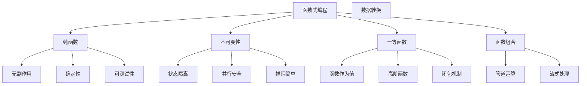

# 2.3 函数式编程

## 🎯 核心理念

函数式编程是Python的"纯真与优雅"范式。它让我们用数学的眼光看编程，每个函数都是一个表达式，代码变得更简洁、更安全、更可预测。

### 🌟 函数式编程核心原则



## 🎨 核心函数式工具

### 💡 高阶函数应用

```python
# ✅ 高阶函数的Python实现
class FunctionalExamples:
    """函数式编程示例集"""
    
    @staticmethod
    def map_filter_reduce_demo():
        """map/filter/reduce的现代用法"""
        numbers = range(1, 11)
        
        # ✅ 传统方式 - 多重循环
        traditional_result = []
        for num in numbers:
            if num % 2 == 0:
                squared = num ** 2
                traditional_result.append(squared)
        
        # ✅ 函数式方式 - 管道化
        functional_result = list(
            map(
                lambda x: x ** 2,
                filter(lambda x: x % 2 == 0, numbers)
            )
        )
        
        # ✅ 现代Python - 生成器表达式
        generator_result = [x ** 2 for x in numbers if x % 2 == 0]
        
        print(f"传统方式: {traditional_result}")
        print(f"函数式: {functional_result}")
        print(f"生成器: {list(generator_result)}")
        
        # ✅ reduce的使用
        from functools import reduce
        sum_result = reduce(lambda x, y: x + y, functional_result)
        print(f"Reduce求和: {sum_result}")
    
    @staticmethod
    def closure_examples():
        """闭包的高级应用"""
        
        # ✅ 缓存装饰器
        def memoize(func):
            """记忆化装饰器 - 纯函数缓存"""
            cache = {}
            def wrapper(*args):
                if args not in cache:
                    cache[args] = func(*args)
                return cache[args]
            return wrapper
        
        @memoize
        def fibonacci(n):
            if n < 2:
                return n
            return fibonacci(n-1) + fibonacci(n-2)
        
        # 测试缓存效果
        import time
        start = time.time()
        result = fibonacci(10)
        end = time.time()
        print(f"Fibonacci(10) = {result}, 用时: {end-start:.4f}秒")
        
        # ✅ 配置生成器
        def create_config(environment):
            """闭包返回配置函数"""
            configs = {
                'dev': {'debug': True, 'log_level': 'DEBUG'},
                'prod': {'debug': False, 'log_level': 'WARNING'},
                'test': {'debug': True, 'log_level': 'INFO'}
            }
            
            def get_config(key):
                return configs[environment].get(key, None)
            
            def set_config(key, value):
                configs[environment][key] = value
                return get_config
            
            get_config.set_config = set_config
            return get_config
        
        # 使用配置闭包
        dev_config = create_config('dev')
        print(f"Dev debug模式: {dev_config('debug')}")
        
        dev_config.set_config('new_feature', True)
        print(f"Dev新功能: {dev_config('new_feature')}")

FunctionalExamples.map_filter_reduce_demo()
FunctionalExamples.closure_examples()
```

### 🔧 函数式数据处理

```python
from functools import partial, reduce
from operator import add, mul
import json

class FunctionalDataProcessing:
    """函数式数据处理实战"""
    
    @staticmethod
    def pipeline_processing():
        """管道式数据处理"""
        
        # 数据源
        raw_data = [
            {"name": "Alice", "age": 25, "salary": 50000},
            {"name": "Bob", "age": 30, "salary": 70000},
            {"name": "Charlie", "age": 35, "salary": 80000},
            {"name": "Diana", "age": 28, "salary": 60000},
        ]
        
        # ✅ 管道式数据转换
        def create_pipeline(*functions):
            """创建处理管道"""
            def pipeline(data):
                return reduce(lambda result, func: func(result), functions, data)
            return pipeline
        
        # 处理函数
        def filter_young_employees(data):
            return [emp for emp in data if emp['age'] < 35]
        
        def calculate_tax_adjusted_salary(data):
            return [
                {**emp, 'after_tax': emp['salary'] * 0.8}
                for emp in data
            ]
        
        def sort_by_salary(data):
            return sorted(data, key=lambda x: x['salary'], reverse=True)
        
        # 构建管道
        processing_pipeline = create_pipeline(
            filter_young_employees,
            calculate_tax_adjusted_salary,
            sort_by_salary
        )
        
        # 执行管道
        result = processing_pipeline(raw_data)
        print("管道处理结果:")
        for emp in result:
            print(f"  {emp['name']}: {emp['salary']} -> {emp['after_tax']}")
    
    @staticmethod
    def functional_error_handling():
        """函数式错误处理"""
        from typing import Union, Callable
        
        # ✅ Maybe模式实现
        class Maybe:
            """Maybe类型 - 函数式错误处理"""
            
            def __init__(self, value=None, error=None):
                self.value = value
                self.error = error
                self.is_error = error is not None
            
            @classmethod
            def just(cls, value):
                return cls(value=value)
            
            @classmethod
            def nothing(cls, error):
                return cls(error=error)
            
            def map(self, func: Callable):
                """函数映射"""
                if self.is_error:
                    return self
                try:
                    return Maybe.just(func(self.value))
                except Exception as e:
                    return Maybe.nothing(str(e))
            
            def flatmap(self, func: Callable):
                """平展映射"""
                if self.is_error:
                    return self
                try:
                    result = func(self.value)
                    return result if isinstance(result, Maybe) else Maybe.just(result)
                except Exception as e:
                    return Maybe.nothing(str(e))
            
            def get_or_default(self, default):
                """获取值或默认值"""
                return self.value if not self.is_error else default
            
            def __repr__(self):
                if self.is_error:
                    return f"Nothing({self.error})"
                return f"Just({self.value})"
        
        # ✅ 使用Maybe处理可能的错误
        def parse_age(data):
            """解析年龄"""
            try:
                return Maybe.just(int(data))
            except ValueError as e:
                return Maybe.nothing(f"Invalid age: {data}")
        
        def is_adult(age):
            """检查是否成年"""
            return age >= 18
        
        def get_category(age):
            """获取年龄分类"""
            if age < 25:
                return "young"
            elif age < 65:
                logger return "adult"
            else:
                return "senior"
        
        # 测试Maybe模式
        test_ages = ["25", "abc", "30", "17", "70"]
        
        results = [
            parse_age(age)
            .map(lambda x: (x, is_adult(x)))  # 变换为元组
            .map(lambda x: (x[0], x[1], get_category(x[0])))  # 添加分类
            for age in test_ages
        ]
        
        print("Maybe模式结果:")
        for result in results:
            if result.is_error:
                print(f"  错误: {result.error}")
            else:
                age, adult, category = result.value
                print(f"  年龄: {age}, 成年: {adult}, 分类: {category}")

FunctionalDataProcessing.pipeline_processing()
FunctionalDataProcessing.functional_error_handling()
```

### 🌊 流式处理模式

```python
class StreamProcessing:
    """流式处理模式实现"""
    
    @staticmethod
    def generator_streaming():
        """生成器流式处理"""
        
        def data_stream(file_path):
            """文件流读取"""
            with open(file_path, 'r') as f:
                for line in f:
                    yield line.strip()
        
        def transform_stream(data_stream, transform_func):
            """流变换"""
            for item in data_stream:
                try:
                    yield transform_func(item)
                except Exception as e:
                    print(f"Transform error: {e}")
        
        def filter_stream(data_stream, filter_func):
            """流过滤"""
            for item in data_stream:
                if filter_func(item):
                    yield item
        
        def accumulate_stream(data_stream, acc_func):
            """流累积"""
            accumulator = None
            for item in data_stream:
                accumulator = acc_func(accumulator, item)
                yield item, accumulator
        
        # ✅ 流式CSV处理示例
        def process_csv_stream():
            """流式CSV处理"""
            
            # 模拟CSV数据流
            csv_data = [
        "Alice,25,Engineer,50000",
        "Bob,30,Manager,70000",
        "Charlie,abc,Designer,60000",  # 错误数据
        "Diana,28,Developer,55000"
    ]
    
    def parse_csv_line(line):
        """解析CSV行"""
        parts = line.split(',')
        if len(parts) != 4:
            raise ValueError(f"Invalid CSV line: {line}")
        
        return {
            'name': parts[0],
            'age': int(parts[1]),
            'role': parts[2],
            'salary': int(parts[3])
        }
    
    def filter_engineers(person):
        """过滤工程师"""
        return person['role'] in ['Engineer', 'Developer']
    
    def calculate_new_salary(person):
        """计算新薪资"""
        person['new_salary'] = person['salary'] * 1.1
        return person
    
    # 创建流式处理管道
    stream = csv_data
    
    # 变换：解析 -> 过滤 -> 计算
    processed = transform_stream(
        filter_stream(
            transform_stream(stream, parse_csv_line),
            filter_engineers
        ),
        calculate_new_salary
    )
    
    results = list(processed)
    print("流式处理结果:")
    for person in results:
        print(f"  {person['name']}: {person['salary']} -> {person['new_salary']:.0f}")

StreamProcessing.generator_streaming()
```

## 🧪 函数式编程练习

### 📝 练习1：构建数据转换管道

**任务**：使用函数式编程重构数据处理逻辑

```python
# 需求：将原始数据转换为报告格式
raw_data = [1, 2, 3, 4, 5, 6, 7, 8, 9, 10]

# 要求：
# 1. 筛选偶数
# 2. 计算平方
# 3. 过滤大于20的数
# 4. 计算总和
# 5. 使用函数式方法

def functional_pipeline(data):
    # 你的实现...
    pass

# 测试你的实现
result = functional_pipeline(raw_data)
print(f"管道结果: {result}")
```

### 🎯 练习2：实现函数式缓存

**任务**：用闭包实现高效的函数缓存

```python
def create_cache():
    """创建缓存系统"""
    # 你的实现...
    pass

# 测试不同参数的缓存
fibonacci = create_cache()
print(fibonacci(10))
print(fibonacci(10))  # 应该从缓存获取
```

## 🔗 知识连接

- **函数设计**：[[1.8 函数设计原则]] - 函数设计基础
- **数据处理**：[[2.2 数据结构与算法]] - 数据结构的函数式应用
- **并发编程**：[[3.3 并发编程]] - 函数式的并发模型

## 💡 费曼检验

**向团队成员解释：为什么函数式编程的代码更容易测试和维护？**

核心要点：
1. **纯函数特性**：相同输入总是产生相同输出
2. **无副作用**：不会意外改变外部状态
3. **函数组合**：复杂逻辑由简单函数组合而成
4. **可预测性**：数据流向清晰，易于调试

---

📚 **扩展阅读**：
- [[⚡ 快速概念辞典]] - "函数式"、"闭包"等术语
- [[🗺️ Python学习全景图]] - 整体学习架构

🎯 **下个目标**：学习[[3.1 内存管理]]中的Python内存机制
