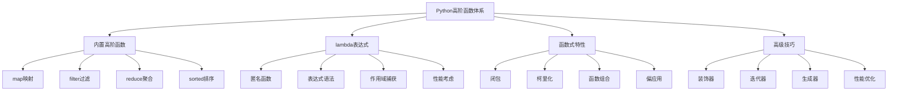

# 2.3.1 高阶函数与lambda

## 🎯 核心理念

高阶函数是Python函数式编程的"精髓"。它不仅能接受函数作为参数，还能返回函数作为结果。配合lambda表达式，我们能够写出更简洁、更具表达力的代码。掌握高阶函数，就是掌握函数式编程的核心范式。

### 🚀 高阶函数技术体系



## 🚀 高阶函数核心技术

### 💡 map、filter、reduce应用

```python
from functools import reduce, partial, wraps
from typing import Callable, List, Dict, Any, Iterator, Tuple
import itertools
import operator
from collections import deque, defaultdict
import time

class HigherOrderFunctionMastery:
    """高阶函数精通技术"""
    
    @staticmethod
    def built_in_higher_order_functions():
        """内置高阶函数应用"""
        
        print("🔧 内置高阶函数:")
        
        # ✅ map函数应用
        def map_examples():
            """map函数示例"""
            
            # 基础map应用
            numbers = [1, 2, 3, 4, 5]
            squared = list(map(lambda x: x ** 2, numbers))
            print(f"平方数: {squared}")
            
            # 多序列map
            names = ['Alice', 'Bob', 'Charlie']
            ages = [25, 30, 35]
            info = list(map(lambda name, age: f"{name} is {age} years old", names, ages))
            print(f"信息: {info}")
            
            # 复杂数据转换
            students = [
                {'name': 'Alice', 'grades': [85, 90, 88]},
                {'name': 'Bob', 'grades': [92, 87, 94]},
                {'name': 'Charlie', 'grades': [78, 86, 91]}
            ]
            
            averages = list(map(
                lambda student: {
                    'name': student['name'],
                    'average': sum(student['grades']) / len(student['grades'])
                },
                students
            ))
            print(f"平均分: {averages}")
            
            # 函数式字符串处理
            sentences = ["hello WORLD", "PYTHON IS GREAT", "fUnCtIonAl PrOgRaMmInG"]
            
            processed = list(map(
                lambda text: ' '.join(word.capitalize() for word in text.split()),
                sentences
            ))
            print(f"格式化的句子: {processed}")
        
        # ✅ filter函数应用
        def filter_examples():
            """filter函数示例"""
            
            # 基础过滤
            numbers = list(range(1, 21))
            evens = list(filter(lambda x: x % 2 == 0, numbers))
            print(f"偶数: {evens}")
            
            # 条件过滤
            words = ['hello', 'world', 'python', 'functional', 'programming', 'lambda']
            long_words = list(filter(lambda word: len(word) > 5, words))
            print(f"词汇长度>5: {long_words}")
            
            # 复杂条件过滤
            products = [
                {'name': 'laptop', 'price': 999, 'category': 'electronics'},
                {'name': 'book', 'price': 25, 'category': 'education'},
                {'name': 'phone', 'price': 699, 'category': 'electronics'},
                {'name': 'pen', 'price': 2, 'category': 'office'},
                {'name': 'tablet', 'price': 399, 'category': 'electronics'}
            ]
            
            # 过滤电子产品和贵商品
            expensive_electronics = list(filter(
                lambda product: (
                    product['category'] == 'electronics' and 
                    product['price'] > 500
                ),
                products
            ))
            print(f"昂贵的电子产品: {expensive_electronics}")
            
            # None值过滤
            mixed = [1, None, 'hello', None, 42, '', 0]
            truthy_values = list(filter(None, mixed))
            print(f"真值: {truthy_values}")
        
        # ✅ reduce函数应用
        def reduce_examples():
            """reduce函数示例"""
            
            # 基础聚合
            numbers = [1, 2, 3, 4, 5]
            sum_result = reduce(lambda x, y: x + y, numbers)
            print(f"求和: {sum_result}")
            
            # 最大最小值
            values = [45, 78, 23, 91, 15, 67, 88, 30]
            maximum = reduce(lambda x, y: x if x > y else y, values)
            minimum = reduce(lambda x, y: x if x < y else y, values)
            print(f"最大值: {maximum}, 最小值: {minimum}")
            
            # 字符串聚合
            words = ['Hello', ' ', 'World', '!', ' Python']
            sentence = reduce(lambda x, y: x + y, words)
            print(f"连接结果: {sentence}")
            
            # 复杂对象聚合
            employees = [
                {'name': 'Alice', 'salary': 50000, 'department': 'IT'},
                {'name': 'Bob', 'salary': 60000, 'department': 'IT'},
                {'name': 'Charlie', 'salary': 45000, 'department': 'HR'},
                {'name': 'Diana', 'salary': 55000, 'department': 'IT'}
            ]
            
            # 计算IT部门薪资总和
            it_total = reduce(
                lambda total, emp: total + emp['salary'] if emp['department'] == 'IT' else total,
                employees,
                0
            )
            print(f"IT部门薪资总和: {it_total}")
            
            # 构建字典
            employee_dict = reduce(
                lambda acc, emp: {**acc, emp['name']: emp['salary']},
                employees,
                {}
            )
            print(f"员工字典: {employee_dict}")
        
        # 运行示例
        map_examples()
        print("\n" + "="*60)
        filter_examples()
        print("\n" + "="*60)
        reduce_examples()
    
    @staticmethod
    def advanced_higher_order_patterns():
        """高级高阶函数模式"""
        
        print("\n🎯 高级高阶函数模式:")
        
        # ✅ 函数组合
        def function_composition():
            """函数组合"""
            
            def add_one(x):
                return x + 1
            
            def multiply_two(x):
                return x * 2
            
            def square(x):
                return x ** 2
            
            # 手动组合
            def compose(*functions):
                """函数组合器"""
                def composed(x):
                    result = x
                    for func in reversed(functions):
                        result = func(result)
                    return result
                return composed
            
            # 组合函数
            complex_operation = compose(square, multiply_two, add_one)
            result = complex_operation(3)  # (3 + 1) * 2 ** 2 = 64
            print(f"组合结果: {result}")
        
        # ✅ 柯里化
        def currying_examples():
            """柯里化示例"""
            
            def curry_add(x):
                """加法柯里化"""
                def add_y(y):
                    return x + y
                return add_y
            
            # 创建加法5的函数
            add_five = curry_add(5)
            result = add_five(10)  # 15
            print(f"柯里化加法: {result}")
            
            # 通用柯里化函数
            def curry(func):
                """通用柯里化器"""
                def curried(*args):
                    if len(args) >= func.__code__.co_argcount:
                        return func(*args)
                    return lambda *more_args: curried(*(args + more_args))
                return curried
            
            # 使用柯里化
            @curry
            def multiply_three_numbers(x, y, z):
                return x * y * z
            
            multiply_by_2_3 = multiply_three_numbers(2)(3)
            result = multiply_by_2_3(4)  # 2 * 3 * 4 = 24
            print(f"柯里化乘法: {result}")
        
        # ✅ 偏应用函数
        def partial_application_examples():
            """偏应用示例"""
            
            def power(base, exponent):
                return base ** exponent
            
            # 创建平方函数
            square = partial(power, exponent=2)
            print(f"平方 5: {square(5)}")
            
            # 创建立方函数
            cube = partial(power, exponent=3)
            print(f"立方 3: {cube(3)}")
            
            # 多个参数的偏应用
            def format_string(name, age, city):
                return f"{name}, {age} years old, from {city}"
            
            # 固定姓名
            format_alice = partial(format_string, "Alice")
            # 固定年龄
            format_with_age = partial(format_alice, 25)
            result = format_with_age("Beijing")
            print(f"偏应用字符串: {result}")
        
        # ✅ 函数式管道
        def functional_pipeline():
            """函数式管道"""
            
            # 数据处理管道
            data = [1, 2, 3, 4, 5, 6, 7, 8, 9, 10]
            
            # 构建管道: 加1 -> 平方 -> 取偶数 -> 求和
            pipeline_result = reduce(
                lambda acc, x: x + acc,
                filter(
                    lambda x: x % 2 == 0,
                    map(
                        lambda x: x ** 2,
                        map(lambda x: x + 1, data)
                    )
                ),
                0
            )
            print(f"管道处理结果: {pipeline_result}")
            
            # 更清晰的管道实现
            def pipe(data, *functions):
                """管道执行器"""
                result = data
                for func in functions:
                    result = func(result)
                return result
            
            # 定义管道函数
            def step1_add_one(lst):
                return list(map(lambda x: x + 1, lst))
            
            def step2_square(lst):
                return list(map(lambda x: x ** 2, lst))
            
            def step3_filter_even(lst):
                return list(filter(lambda x: x % 2 == 0, lst))
            
            def step4_sum(lst):
                return sum(lst)
            
            # 执行管道
            result = pipe(
                data,
                step1_add_one,
                step2_square,
                step3_filter_even,
                step4_sum
            )
            print(f"管道结果: {result}")
        
        # 运行高级模式示例
        function_composition()
        print("\n" + "="*60)
        currying_examples()
        print("\n" + "="*60)
        partial_application_examples()
        print("\n" + "="*60)
        functional_pipeline()

# 运行所有示例
if __name__ == "__main__":
    print("🚀 Python高阶函数与lambda:")
    
    HigherOrderFunctionMastery.built_in_higher_order_functions()
    HigherOrderFunctionMastery.advanced_higher_order_patterns()

## 🧪 高阶函数最佳实践

### 📝 实践1：函数式编程库

**任务**：创建函数式编程工具库

```python
# ✅ 函数式编程工具库
class FunctionalTools:
    """函数式编程工具库"""
    
    @staticmethod
    def pipeline(data, *transforms):
        """创建数据处理管道"""
        result = data
        for transform in transforms:
            result = transform(result)
        return result
    
    @staticmethod
    def compose(*functions):
        """函数组合"""
        def composed(x):
            result = x
            for func in reversed(functions):
                result = func(result)
            return result
        return composed

# 使用示例
def add_one(x):
    return x + 1

def multiply_by_two(x):
    return x * 2

def square(x):
    return x ** 2

# 组合函数
complex_op = FunctionalTools.compose(square, multiply_by_two, add_one)
result = complex_op(3)  # ((3 + 1) * 2)^2 = 64
```

## 🔗 知识连接

- **函数设计**：[[1.8 函数设计原则]] - 函数设计基础
- **函数式编程**：[[2.3 函数式编程]] - 函数式范式
- **生成器**：[[2.2.2 迭代器与生成器机制]] - 惰性计算
- **装饰器**：[[2.1.4 装饰器模式深度实现]] - 函数增强

## 💡 费曼检验

**解释：什么是高阶函数？lambda表达式的优势和局限是什么？如何在项目中合理使用函数式编程？**

核心要点：
1. **高阶函数概念**：接受函数作为参数或返回函数的函数，是函数式编程的基础
2. **lambda优势**：简洁、匿名、适合简单操作；局限：只能包含表达式、难以调试、性能有时不如专用函数
3. **合理使用**：在数据处理管道、配置管理、事件驱动架构中发挥最大价值；避免过度使用导致代码可读性下降

---

🎯 **下个目标**：学习[[2.3.2 闭包与詞法作用域]]中的闭包机制
