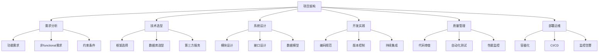

# 2.4 项目管理与工程实践

## 🎯 核心理念

优秀的Python项目不仅仅是代码累积，更是系统性工程实践的体现。本模块整合了现代软件项目管理的核心要素，从项目规划到部署运维的全生命周期管理。

## 🚀 项目架构设计

### 💡 架构思维导图



## 🛠️ 项目实践技术

### 💡 项目结构与模板

```python
import os
from typing import Dict, List, Optional
import json
from pathlib import Path

class ProjectStructureMastery:
    """项目管理精通技术"""
    
    @staticmethod
    def create_project_structure():
        """标准项目结构"""
        
        project_structure = {
            "my_project/": {
                "README.md": "项目说明文档",
                "requirements.txt": "Python依赖",
                "pyproject.toml": "项目配置文件",
                ".gitignore": "Git忽略文件",
                "setup.py": "安装脚本",
                "docs/": "文档目录",
                "tests/": "测试目录",
                "src/": "源码目录",
                "scripts/": "脚本目录",
                ".github/": "GitHub Actions",
                "config/": "配置文件",
                "logs/": "日志目录",
                "data/": "数据目录"
            }
        }
        
        return project_structure
    
    @staticmethod
    def generate_folder_structure():
        """生成项目文件夹结构"""
        
        folders = [
            "src/my_project",
            "src/my_project/core",
            "src/my_project/api", 
            "src/my_project/models",
            "src/my_project/services",
            "src/my_project/utils",
            "tests/unit",
            "tests/integration",
            "tests/e2e",
            "docs/api",
            "docs/user_guide",
            "scripts/deployment",
            "scripts/maintenance",
            "config/development",
            "config/production",
            "config/testing"
        ]
        
        print("项目文件夹结构:")
        for folder in folders:
            print(f"📁 {folder}")
        
        return folders

# ✅ 需求分析与管理
class RequirementsManagement:
    """需求管理技术"""
    
    @staticmethod
    def analyze_requirements():
        """需求分析框架"""
        
        # 功能需求模板
        functional_requirements = {
            "用户管理": {
                "优先级": "高",
                "复杂度": "中",
                "依赖": ["数据库", "认证系统"],
                "验收标准": [
                    "用户可以注册账户",
                    "用户可以登录系统", 
                    "用户可以管理个人资料",
                    "支持密码重置功能"
                ]
            },
            "数据管理": {
                "优先级": "高",
                "复杂度": "高",
                "依赖": ["数据库", "API框架"],
                "验收标准": [
                    "支持数据的CRUD操作",
                    "实现数据验证",
                    "支持批量导入导出",
                    "提供数据搜索功能"
                ]
            }
        }
        
        # 非功能需求模板
        non_functional_requirements = {
            "性能要求": {
                "响应时间": "< 200ms",
                "并发用户": "1000+",
                "数据处理能力": "10万条/分钟"
            },
            "可用性要求": {
                "系统可用性": "99.9%",
                "故障恢复时间": "< 5分钟",
                "数据备份": "每日备份"
            },
            "安全性要求": {
                "数据加密": "传输和存储加密",
                "访问控制": "基于角色的权限",
                "审计日志": "完整的操作记录"
            }
        }
        
        print("需求分析结果:")
        print(f"功能需求数量: {len(functional_requirements)}")
        print(f"非功能需求分类: {list(non_functional_requirements.keys())}")
        
        return functional_requirements, non_functional_requirements

# ✅ 技术选型决策
class TechnologyStackDecision:
    """技术选型决策框架"""
    
    @staticmethod
    def evaluate_technology_stack():
        """技术栈评估"""
        
        evaluation_criteria = {
            "性能": {"权重": 0.25, "评级范围": "1-10"},
            "学习成本": {"权重": 0.15, "评级范围": "1-10"},
            "社区支持": {"权重": 0.20, "评级范围": "1-10"},
            "生态成熟度": {"权重": 0.20, "评级范围": "1-10"},
            "可维护性": {"权重": 0.20, "评级范围": "1-10"}
        }
        
        # Web框架对比
        frameworks_comparison = {
            "Flask": {
                "性能": 8, "学习成本": 9, "社区支持": 9,
                "生态成熟度": 8, "可维护性": 8
            },
            "FastAPI": {
                "性能": 9, "学习成本": 7, "社区支持": 8,
                "生态成熟度": 7, "可维护性": 9
            },
            "Django": {
                "性能": 7, "学习成本": 6, "社区支持": 10,
                "生态成熟度": 10, "可维护性": 9
            }
        }
        
        def calculate_weighted_score(framework_scores):
            """计算加权分数"""
            total_score = 0
            for criterion, details in evaluation_criteria.items():
                weight = details["权重"]
                score = framework_scores[criterion]
                total_score += weight * score
            return total_score
        
        # 评估结果
        evaluation_results = {}
        for framework, scores in frameworks_comparison.items():
            weighted_score = calculate_weighted_score(scores)
            evaluation_results[framework] = weighted_score
        
        print("技术栈评估结果:")
        for framework, score in sorted(evaluation_results.items(), 
                                     key=lambda x: x[1], reverse=True):
            print(f"  {framework}: {score:.2f}")
        
        return evaluation_results

# ✅ 系统设计模式
class SystemDesignPatterns:
    """系统设计模式"""
    
    @staticmethod
    def layered_architecture():
        """分层架构设计"""
        
        layers = {
            "表现层 (Presentation Layer)": {
                "职责": "处理用户交互和数据展示",
                "技术": "Flask/FastAPI + HTML/React",
                "组件": ["路由", "视图", "模板", "静态资源"]
            },
            "业务逻辑层 (Business Logic Layer)": {
                "职责": "核心业务规则和流程",
                "技术": "Python服务类",
                "组件": ["业务服务", "领域模型", "工作流"]
            },
            "数据访问层 (Data Access Layer)": {
                "职责": "数据持久化和访问",
                "技术": "SQLAlchemy/Django ORM",
                "组件": ["Repository", "DAO", "实体映射"]
            },
            "基础设施层 (Infrastructure Layer)": {
                "职责": "外部服务和系统支持",
                "技术": "数据库、缓存、消息队列",
                "组件": ["数据库连接", "缓存服务", "消息服务"]
            }
        }
        
        print("分层架构设计:")
        for layer, details in layers.items():
            print(f"\n📋 {layer}")
            for key, value in details.items():
                print(f"  {key}: {value}")
        
        return layers
    
    @staticmethod
    def microservices_pattern():
        """微服务架构模式"""
        
        microservices_example = {
            "用户服务 (User Service)": {
                "功能": "用户认证和授权",
                "数据": "用户资料、权限",
                "API": "/api/users/*"
            },
            "订单服务 (Order Service)": {
                "功能": "订单管理",
                "数据": "订单信息、状态",
                "API": "/api/orders/*"
            },
            "支付服务 (Payment Service)": {
                "功能": "支付处理",
                "数据": "支付记录、交易",
                "API": "/api/payments/*"
            },
            "通知服务 (Notification Service)": {
                "功能": "消息通知",
                "数据": "通知记录、模板",
                "API": "/api/notifications/*"
            }
        }
        
        print("微服务架构示例:")
        for service, details in microservices_example.items():
            print(f"\n🔧 {service}")
            for key, value in details.items():
                print(f"  {key}: {value}")
        
        return microservices_example

# ✅ 开发流程管理
class DevelopmentProcess:
    """开发流程管理"""
    
    @staticmethod
    def agile_development_practices():
        """敏捷开发实践"""
        
        agile_practices = {
            "Sprint规划": {
                "频率": "每2周一次",
                "交付物": "Backlog、估算、任务分解",
                "工具": "Jira、Trello"
            },
            "日常站会": {
                "频率": "每日上午",
                "内容": ["昨天完成了什么", "今天计划做什么", "遇到什么阻碍"]
            },
            "代码审查": {
                "原则": "每个PR都需要审查",
                "检查项": ["代码质量", "测试覆盖", "文档更新"],
                "工具": "GitHub/GitLab"
            },
            "持续集成": {
                "触发": "每次代码提交",
                "流程": ["代码检查", "单元测试", "集成测试", "部署"],
                "工具": "GitHub Actions/Jenkins"
            }
        }
        
        print("敏捷开发实践:")
        for practice, details in agile_practices.items():
            print(f"\n📝 {practice}")
            for key, value in details.items():
                print(f"  {key}: {value}")
        
        return agile_practices

# ✅ 质量管理体系
class QualityManagement:
    """质量管理体系"""
    
    @staticmethod
    def quality_gates():
        """质量门禁标准"""
        
        quality_standards = {
            "代码质量": {
                "覆盖率要求": "> 85%",
                "复杂度限制": "< 10",
                "重复代码": "< 3%",
                "工具": ["SonarQube", "CodeClimate"]
            },
            "性能指标": {
                "响应时间": "< 200ms",
                "内存使用": "< 512MB",
                "CPU使用": "< 80%",
                "工具": ["APM", "New Relic"]
            },
            "安全扫描": {
                "漏洞检测": "无高危漏洞",
                "依赖检查": "定期更新",
                "代码扫描": "静态分析",
                "工具": ["OWASP", "Snyk"]
            },
            "文档完善": {
                "API文档": "自动生成",
                "代码注释": "覆盖率 > 80%",
                "用户手册": "及时更新",
                "工具": ["Swagger", "Sphinx"]
            }
        }
        
        print("质量门禁标准:")
        for category, standards in quality_standards.items():
            print(f"\n🔍 {category}")
            for standard, requirement in standards.items():
                print(f"  {standard}: {requirement}")
        
        return quality_standards

# ✅ 部署和运维
class DeploymentOperations:
    """部署和运维管理"""
    
    @staticmethod
    def deployment_strategies():
        """部署策略"""
        
        deployment_options = {
            "蓝绿部署": {
                "优势": ["零停机时间", "快速回滚"],
                "劣势": ["资源消耗大", "复杂度高"],
                "适用场景": "关键业务系统"
            },
            "金丝雀部署": {
                "优势": ["风险可控", "逐步验证"],
                "劣势": ["部署时间长", "监控复杂"],
                "适用场景": "大型系统升级"
            },
            "滚动部署": {
                "优势": ["资源效率高", "简单易用"],
                "劣势": ["可能有短时间不可用", "回滚慢"],
                "适用场景": "大部分应用场景"
            }
        }
        
        print("部署策略对比:")
        for strategy, details in deployment_options.items():
            print(f"\n🚀 {strategy}")
            for aspect, points in details.items():
                if isinstance(points, list):
                    print(f"  {aspect}: {', '.join(points)}")
                else:
                    print(f"  {aspect}: {points}")
        
        return deployment_options
    
    @staticmethod
    def monitoring_metrics():
        """监控指标框架"""
        
        metrics_by_category = {
            "系统指标": [
                "CPU使用率", "内存使用率", "磁盘I-O",
                "网络流量", "连接数"
            ],
            "应用指标": [
                "请求数", "响应时间", "错误率",
                "吞吐量", "队列长度"
            ],
            "业务指标": [
                "用户活跃度", "转化率", "收入指标",
                "功能使用率", "用户满意度"
            ]
        }
        
        print("监控指标体系:")
        for category, metrics in metrics_by_category.items():
            print(f"\n📊 {category}")
            for metric in metrics:
                print(f"  • {metric}")
        
        return metrics_by_category

# 运行示例
if __name__ == "__main__":
    print("🚀 Python项目管理与工程实践:")
    
    ProjectStructureMastery.create_project_structure()
    ProjectStructureMastery.generate_folder_structure()
    
    RequirementsManagement.analyze_requirements()
    TechnologyStackDecision.evaluate_technology_stack()
    
    SystemDesignPatterns.layered_architecture()
    SystemDesignPatterns.microservices_pattern()
    
    DevelopmentProcess.agile_development_practices()
    QualityManagement.quality_gates()
    
    DeploymentOperations.deployment_strategies()
    DeploymentOperations.monitoring_metrics()

## 🧪 最佳实践

### 📝 实践1：项目模板生成器

```python
# ✅ 项目模板生成器
class ProjectTemplateGenerator:
    """项目模板生成器"""
    
    def __init__(self, project_name: str):
        self.project_name = project_name
        self.templates = {
            'web_app': {
                'structure': [
                    f'{project_name}/',
                    f'{project_name}/app/',
                    f'{project_name}/tests/',
                    f'{project_name}/requirements.txt',
                    f'{project_name}/README.md'
                ]
            },
            'api_service': {
                'structure': [
                    f'{project_name}/',
                    f'{project_name}/src/',
                    f'{project_name}/src/models/',
                    f'{project_name}/src/routers/',
                    f'{project_name}/tests/',
                    f'{project_name}/Dockerfile',
                    f'{project_name}/docker-compose.yml'
                ]
            },
            'data_analysis': {
                'structure': [
                    f'{project_name}/',
                    f'{project_name}/notebooks/',
                    f'{project_name}/data/',
                    f'{project_name}/src/',
                    f'{project_name}/models/',
                    f'{project_name}/requirements.txt'
                ]
            }
        }
    
    def generate_project(self, template_type: str):
        """生成项目结构"""
        if template_type not in self.templates:
            raise ValueError(f"不支持的模板类型: {template_type}")
        
        structure = self.templates[template_type]['structure']
        print(f"生成 {self.project_name} 项目 ({template_type}):")
        
        for item in structure:
            print(f"📁 {item}")
        
        return structure
```

### 🎯 实践2：技术债务管理

```python
# ✅ 技术债务管理
class TechnicalDebtManager:
    """技术债务管理器"""
    
    def __init__(self):
        self.debt_items = []
        self.priority_levels = {
            'LOW': 1,
            'MEDIUM': 2,
            'HIGH': 3,
            'CRITICAL': 4
        }
    
    def add_debt_item(self, description: str, category: str, 
                     priority: str, effort_estimate: str):
        """添加技术债务项"""
        debt_item = {
            'description': description,
            'category': category,
            'priority': priority,
            'priority_score': self.priority_levels.get(priority, 0),
            'effort_estimate': effort_estimate,
            'status': 'Open',
            'created_date': datetime.now().isoformat()
        }
        
        self.debt_items.append(debt_item)
        return debt_item
    
    def prioritize_debt_items(self):
        """按优先级排序技术债务"""
        sorted_items = sorted(
            self.debt_items, 
            key=lambda x: x['priority_score'], 
            reverse=True
        )
        
        print("技术债务优先级排序:")
        for i, item in enumerate(sorted_items, 1):
            print(f"{i}. [{item['priority']}] {item['description']} ({item['effort_estimate']})")
        
        return sorted_items
```

## 🔗 知识连接

- **架构设计**：[[5.1 Web API开发]] - 现代Web架构
- **API设计**：[[4.2.1 Requests与HTTP]] - HTTP服务设计
- **数据建模**：[[4.1.1 ORM框架]] - 数据层架构
- **测试策略**：[[3.3 错误处理与测试]] - 质量保证体系

## 💡 费曼检验

**解释**：项目管理的核心要素有哪些？如何进行有效的技术选型？现代化项目开发的最佳实践是什么？

核心要点：
1. **核心要素**：需求管理、技术选型、架构设计、开发流程、质量管控、部署运维
2. **技术选型**：明确评估标准、对比候选方案、考虑技术生态、评估学习成本、考虑长期维护
3. **最佳实践**：敏捷开发、持续集成、代码审查、自动化测试、容器化部署、监控告警

---

🎯 **下个目标**：深入学习具体的业务领域开发
