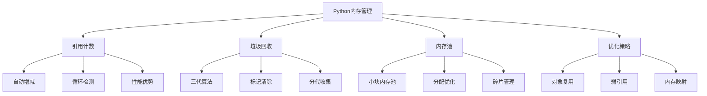

# 3.1 内存管理

## 🎯 核心理念

内存管理是Python的"自动化艺术"。理解Python如何优雅地管理内存，就是理解现代编程语言的核心智慧。

### 🧠 Python内存管理架构



## 🔍 内存引用机制深度解析

### 💡 引用计数的真相

```python
# ✅ Python引用计数的实际观察
import sys
import gc
from weakref import WeakValueDictionary

class MemoryInspector:
    """内存检查器 - 深入观察Python内存管理"""
    
    @staticmethod
    def inspect_reference_count():
        """观察引用计数变化"""
        
        # 创建对象
        obj = [1, 2, 3]
        print(f"创建的列表: {obj}")
        print(f"引用计数: {sys.getrefcount(obj)}")
        
        # 增加引用
        obj_ref = obj
        print(f"赋给变量后: {sys.getrefcount(obj)}")
        
        obj_list = [obj]
        print(f"放入列表后: {sys.getrefcount(obj)}")
        
        obj_dict = {'item': obj}
        print(f"放入字典后: {sys.getrefcount(obj)}")
        
        # 删除引用
        del obj_ref
        print(f"删除变量后: {sys.getrefcount(obj)}")
        
        obj_list.clear()
        print(f"清空列表后: {sys.getrefcount(obj)}")
        
        obj_dict.clear()
        print(f"清空字典后: {sys.getrefcount(obj)}")
    
    @staticmethod
    def circular_reference_demo():
        """循环引用演示"""
        
        class Node:
            def __init__(self, value):
                self.value = value
                self.parent = None
                self.children = []
            
            def add_child(self, child):
                child.parent = self
                self.children.append(child)
        
        # 创建循环引用
        parent = Node("parent")
        child1 = Node("child1")
        child2 = Node("child2")
        
        parent.add_child(child1)
        parent.add_child(child2)
        
        print("创建前垃圾数量:", len(gc.garbage))
        
        # 删除所有外部引用
        del parent, child1, child2
        
        print("删除外部引用后垃圾数量:", len(gc.garbage))
        
        # 强制垃圾回收
        collected = gc.collect()
        print(f"垃圾回收收集了 {collected} 个对象")
        print("垃圾回收后垃圾数量:", len(gc.garbage))

MemoryInspector.inspect_reference_count()
MemoryInspector.circular_reference_demo()
```

### 🔧 垃圾回收算法实现

```python
class GarbageCollectionAnalysis:
    """垃圾回收机制分析"""
    
    @staticmethod
    def generation_analysis():
        """分代垃圾回收分析"""
        
        # 启用垃圾回收调试
        gc.set_debug(gc.DEBUG_STATS)
        
        # 创建大量临时对象
        def create_short_lived_objects():
            """创建短期对象"""
            short_lived = []
            for i in range(1000):
                short_lived.append({'temp': i})
            return short_lived
        
        def create_long_lived_objects():
            """创建长期对象"""
            long_lived = []
            for i in range(100):
                long_lived.append({'permanent': i})
            return long_lived
        
        # 测试分代回收
        long_objects = create_long_lived_objects()
        
        for cycle in range(5):
            print(f"\n--- 回收周期 {cycle + 1} ---")
            
            short_objects = create_short_lived_objects()
            del short_objects  # 删除短期引用
            
            # 检查各代对象计数
            generation_counts = gc.get_count()
            print(f"各代对象计数: {generation_counts}")
            
            # 尝试触发垃圾回收
            collected = gc.collect()
            print(f"回收了 {collected} 个对象")
    
    @staticmethod
    def memory_profiling():
        """内存使用分析"""
        import tracemalloc
        
        # 开始内存跟踪
        tracemalloc.start()
        
        # 记录初始快照
        snapshot1 = tracemalloc.take_snapshot()
        
        # 创建一些对象
        data = []
        for i in range(10000):
            data.append([x for x in range(i % 100)])
        
        # 记录分配后快照
        snapshot2 = tracemalloc.take_snapshot()
        
        # 分析内存使用
        top_stats = snapshot2.compare_to(snapshot1, 'lineno')
        
        print("内存使用统计 (Top 10):")
        for stat in top_stats[:10]:
            print(f"{stat}")

GarbageCollectionAnalysis.generation_analysis()
GarbageCollectionAnalysis.memory_profiling()
```

### 🎨 Python对象存储结构

```python
class ObjectStructureAnalysis:
    """对象存储结构分析"""
    
    @staticmethod
    def basic_types_analysis():
        """基础类型内存分析"""
        
        import sys
        from ctypes import sizeof, Structure
        
        # 整数类型内存分析
        print("=== 整数内存分析 ===")
        for i in [0, 1, 255, 256, 256**2, 256**4]:
            print(f"数字 {i}: {sys.getsizeof(i)} 字节")
        
        # 字符串内存分析
        print("\n=== 字符串内存分析 ===")
        strings = ["", "a", "ab", "abcdef", "a" * 100]
        for s in strings:
            print(f"'{s[:10]}...': {sys.getsizeof(s)} 字节")
        
        # 列表内存分析
        print("\n=== 列表内存分析 ===")
        lists = [[], [1], [1, 2], [1, 2, 3], list(range(10))]
        for lst in lists:
            print(f"列表长度 {len(lst)}: {sys.getsizeof(lst)} 字节")
        
        # 字典内存分析
        print("\n=== 字典内存分析 ===")
        dicts = [{}, {1: 'a'}, {1: 'a', 2: 'b'}, dict(range(10))]
        for d in dicts:
            print(f"字典长度 {len(d)}: {sys.getsizeof(d)} 字节")
    
    @staticmethod
    def object_internals():
        """对象内部结构分析"""
        
        class TestClass:
            """测试类 - 分析对象内部结构"""
            class_var = "shared"
            
            def __init__(self, value):
                self.instance_var = value
            
            def method(self):
                return self.instance_var
        
        obj = TestClass("test_value")
        
        print("=== 对象内部结构 ===")
        print(f"对象类型: {type(obj)}")
        print(f"对象ID: {id(obj)}")
        print(f"对象大小: {sys.getsizeof(obj)}")
        
        # 访问对象字典
        print(f"对象字典: {obj.__dict__}")
        print(f"类字典: {TestClass.__dict__}")
        
        # 分析方法解析顺序
        print(f"MRO: {TestClass.__mro__}")

ObjectStructureAnalysis.basic_types_analysis()
ObjectStructureAnalysis.object_internals()
```

## 🧪 内存优化策略

### 📝 练习1：内存泄漏检测

**任务**：编写一个内存泄漏检测器

```python
class MemoryLeakDetector:
    """内存泄漏检测器"""
    
    def __init__(self):
        self.snapshots = []
    
    def take_snapshot(self, label=""):
        """拍摄内存快照"""
        snapshot = {
            'label': label,
            'timestamp': time.time(),
            'ref_counts': {},
            'objects': gc.get_objects()[:100]  # 限制数量避免内存过大
        }
        self.snapshots.append(snapshot)
    
    def compare_snapshots(self):
        """比较快照发现潜在泄漏"""
        if len(self.snapshots) < 2:
            return
        
        prev = self.snapshots[-2]
        curr = self.snapshots[-1]
        
        print(f"比较 {prev['label']} 和 {curr['label']}")
        
        # 简单的对象计数比较
        prev_count = len(prev['objects'])
        curr_count = len(curr['objects'])
        
        print(f"对象数量变化: {prev_count} -> {curr_count}")

# 测试内存泄漏检测
detector = MemoryLeakDetector()
detector.take_snapshot("初始状态")

# 创建一些对象
data = []
for i in range(1000):
    data.append([x for x in range(i % 10)])

detector.take_snapshot("创建对象后")

# 清理对象
del data
gc.collect()

detector.take_snapshot("清理后")
detector.compare_snapshots()
```

### 🎯 练习2：内存池效率分析

**任务**：分析Python内存池的效率

```python
def memory_pool_analysis():
    """内存池效率分析"""
    
    # 测试小整数缓存
    print("=== 小整数缓存测试 ===")
    a = 256
    b = 256
    print(f"256 is 256: {a is b}")
    
    # 测试字符串实习
    print("\n=== 字符串实习测试 ===")
    s1 = "hello"
    s2 = "hello"
    s3 = input("输入 'hello' 测试: ")  # 用户输入
    
    print(f"s1 is s2: {s1 is s2}")
    print(f"s1 is s3: {s1 is s3}")
    
    # 测试空容器复用
    print("\n=== 空容器测试 ===")
    empty_list1 = []
    empty_list2 = []
    print(f"空列表 is 相同: {empty_list1 is empty_list2}")

memory_pool_analysis()
```

## 🔗 知识连接

- **数据类型**：[[1.6 数据类型深度解析]] - 数据类型的底层实现
- **解释器原理**：[[1.2 解释器原理与字节码]] - 字节码执行机制
- **并发编程**：[[3.3 并发编程]] - 多线程内存安全性

## 💡 费曼检验

**向运维同事解释：为什么Python程序有时候内存占用很高，但工作却正常？垃圾回收是如何自动工作的？**

核心要点：
1. **自动管理**：Python自动管理内存分配和释放
2. **引用计数**：基于引用计数的高效回收
3. **垃圾回收**：定期清理循环引用对象
4. **最佳实践**：理解机制有助于写出内存友好的代码

---

📚 **扩展阅读**：
- [[⚡ 快速概念辞典]] - "内存"、"垃圾回收"等术语
- [[🗺️ Python学习全景图]] - 整体学习架构

🎯 **下个目标**：学习[[3.2 错误处理]]中的Python异常机制
