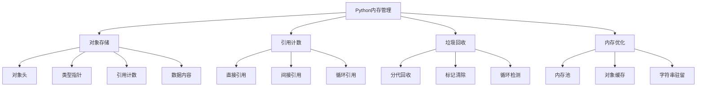

# 3.1 内存管理深度解析

## 🎯 核心理念

内存管理是Python的"自动家务管理"。理解其机制不仅能写出更高效的代码，更能避免内存泄漏和性能陷阱，体现了"自动化但不盲目"的编程智慧。

### 🧠 内存管理架构



## 🚀 深度原理解析

### 💡 引用计数机制

```python
import sys
import gc
import weakref
import tracemalloc

class ReferenceCountingDeepDive:
    """引用计数深度探究"""
    
    @staticmethod
    def basic_reference_tracking():
        """基础引用跟踪"""
        
        print("📊 引用计数基础演示:")
        
        # 创建对象
        obj = [1, 2, 3]
        initial_refcount = sys.getrefcount(obj)
        print(f"初始引用计数: {initial_refcount}")
        
        # 增加引用
        obj_ref = obj
        refcount_after = sys.getrefcount(obj)
        print(f"赋值后引用计数: {refcount_after}")
        
        # 容器引用
        container = [obj]
        container_refcount = sys.getrefcount(obj)
        print(f"放入容器后引用计数: {container_refcount}")
        
        # 减少引用
        del obj_ref
        del container[0]
        final_refcount = sys.getrefcount(obj)
        print(f"删除引用后计数: {final_refcount}")
        
        print(f"最终对象: {obj}")
    
    @staticmethod
    def circular_reference_detection():
        """循环引用检测"""
        
        print("\n🔄 循环引用演示:")
        
        class Node:
            def __init__(self, value):
                self.value = value
                self.parent = None
                self.children = []
            
            def add_child(self, child):
                child.parent = self
                self.children.append(child)
        
        # 创建循环引用
        parent = Node("根节点")
        child1 = Node("子节点1")
        child2 = Node("子节点2")
        
        parent.add_child(child1)
        parent.add_child(child2)
        child1.add_child(Node("孙子节点"))
        
        print(f"父节点引用计数: {sys.getrefcount(parent)}")
        print(f"子节点引用计数: {sys.getrefcount(child1)}")
        
        # 删除外部引用
        del parent, child1, child2
        
        # 手动垃圾回收
        print("手动执行垃圾回收...")
        collected = gc.collect()
        print(f"回收了 {collected} 个循环引用对象")
        print(f"垃圾对象: {len(gc.garbage)}")

# ✅ 垃圾回收机制深度
class GarbageCollectionMechanism:
    """垃圾回收机制"""
    
    @staticmethod
    def generational_collection():
        """分代回收机制"""
        
        print("\n🗑️ 分代垃圾回收:")
        
        # 获取分代信息
        def show_generations():
            for i in range(3):
                generation = gc.get_objects() if i == 0 else []
                print(f"第{i}代对象数量: {len([obj for obj in gc.get_objects() if gc.get_referents(obj)])}")
        
        # 创建不同生命周期的对象
        def create_objects():
            short_lived = [i for i in range(100)]  # 第0代
            print("创建短生命周期对象")
            medium_lived = []
            for i in range(50):
                obj = [i * 2 for i in range(10)]
                medium_lived.append(obj)
                obj.append(short_lived)  # 引用短生命周期对象
            
            long_lived = []
            for obj in medium_lived[::2]:
                long_lived.append(obj)
            
            print("创建不同生命周期对象")
            show_generations()
            
            return short_lived, medium_lived, long_lived
        
        # 强制垃圾回收各代
        def force_generation_collection():
            print("\n强制分代回收:")
            for i in range(3):
                collected = gc.collect(i)
                print(f"第{i}代回收: {collected} 个对象")
        
        objects = create_objects()
        force_generation_collection()
        
        # 垃圾回收阈值
        thresholds = gc.get_threshold()
        print(f"\n分代阈值: {thresholds}")
    
    @staticmethod
    def memory_leak_detection():
        """内存泄漏检测"""
        
        print("\n🔍 内存泄漏检测:")
        
        # 启动内存跟踪
        tracemalloc.start()
        
        # 创建可能的内存泄漏
        leaky_objects = []
        
        class LeakyClass:
            def __init__(self, data):
                self.data = data
                leaky_objects.append(self)  # 可能的泄漏
        
        for i in range(1000):
            obj = LeakyClass(f"data_{i}")
            
            if i % 100 == 0:
                current, peak = tracemalloc.get_traced_memory()
                print(f"对象数量: {len(leaky_objects)}, 当前内存: {current / 1024 / 1024:.1f}MB")
        
        # 清理
        leaky_objects.clear()
        gc.collect()
        
        final_current, peak = tracemalloc.get_traced_memory()
        print(f"清理后内存: {final_current / 1024 / 1024:.1f}MB")
        
        tracemalloc.stop()

# ✅ 对象内部结构
class ObjectInternalStructure:
    """对象内部结构"""
    
    @staticmethod
    def object_header_analysis():
        """对象头分析"""
        
        print("\n🔬 对象内部结构分析:")
        
        class ObjectInspector:
            """对象检查器"""
            
            @staticmethod
            def inspect_basic_types():
                """检查基本类型"""
                
                objects_to_inspect = [
                    42,           # int
                    3.14,         # float
                    "hello",      # str
                    [1, 2, 3],    # list
                    (1, 2, 3),    # tuple
                    {1: "a"},     # dict
                    {1, 2, 3},    # set
                ]
                
                for obj in objects_to_inspect:
                    obj_type = type(obj).__name__
                    obj_size = sys.getsizeof(obj)
                    obj_id = id(obj)
                    
                    print(f"{obj_type:10}: 大小={obj_size:3d}字节, ID={obj_id:x}")
            
            @staticmethod
            def inspect_string_interning():
                """字符串驻留分析"""
                
                print("\n字符串驻留:")
                
                # 驻留字符串
                interned_str1 = "hello"
                interned_str2 = "hello"
                large_str1 = "hello" + " world"
                large_str2 = "hello" + " world"
                
                print(f"驻留字符串相同: {interned_str1 is interned_str2}")
                print(f"长字符串相同: {large_str1 is large_str2}")
                
                # 强制驻留
                manual_intern = sys.intern("manual_" + "intern")
                manual_intern2 = sys.intern("manual_" + "intern")
                print(f"手动驻留相同: {manual_intern is manual_intern2}")
            
            @staticmethod
            def inspect_container_overhead():
                """容器开销分析"""
                
                print("\n容器开销分析:")
                
                containers = {
                    'list': list(),
                    'tuple': tuple(),
                    'dict': dict(),
                    'set': set(),
                }
                
                for name, container in containers.items():
                    empty_size = sys.getsizeof(container)
                    print(f"空{name:5}: {empty_size}字节")
                
                # 元素增加时的内存增长
                growth_list = []
                for i in range(10):
                    growth_list.append(i)
                    size = sys.getsizeof(growth_list)
                    print(f"list长度{i+1}: {size}字节", end=" ")
                    if i > 0:
                        prev_size = sys.getsizeof(growth_list[:-1])
                        print(f"(+{size-prev_size}字节)")
                    else:
                        print()

# ✅ 内存优化策略
class MemoryOptimizationStrategies:
    """内存优化策略"""
    
    @staticmethod
    def __slots__optimization():
        """__slots__优化"""
        
        print("\n🚀 __slots__内存优化:")
        
        class RegularClass:
            def __init__(self, name, age):
                self.name = name
                self.age = age
        
        class SlotsClass:
            __slots__ = ['name', 'age']
            
            def __init__(self, name, age):
                self.name = name
                self.age = age
        
        # 创建对象比较内存使用
        regular_objects = []
        slots_objects = []
        
        for i in range(1000):
            regular_obj = RegularClass(f"name_{i}", i)
            regular_objects.append(regular_obj)
        
        for i in range(1000):
            slots_obj = SlotsClass(f"name_{i}", i)
            slots_objects.append(slots_obj)
        
        regular_size = sys.getsizeof(regular_objects)
        slots_size = sys.getsizeof(slots_objects)
        
        print(f"普通类对象总大小: {regular_size / 1024:.1f}KB")
        print(f"slots类对象总大小: {slots_size / 1024:.1f}KB")
        print(f"内存节省: {(regular_size - slots_size) / regular_size * 100:.1f}%")
    
    @staticmethod
    def generator_memory_efficiency():
        """生成器内存效率"""
        
        print("\n⚡ 生成器内存效率:")
        
        # 列表vs生成器内存对比
        def list_approach(n):
            return [i ** 2 for i in range(n)]
        
        def generator_approach(n):
            return (i ** 2 for i in range(n))
        
        n = 1000000
        
        # 列表占用
        lst = list_approach(n)
        list_size = sys.getsizeof(lst)
        
        # 生成器占用
        gen = generator_approach(n)
        gen_size = sys.getsizeof(gen)
        
        print(f"列表大小 ({n}元素): {list_size / 1024 / 1024:.1f}MB")
        print(f"生成器大小: {gen_size}字节")
        print(f"内存节省: {list_size / gen_size:.0f}倍")
        
        # 证明生成器延迟计算
        def measure_computation_time():
            import time
            
            # 列表计算时间
            start = time.perf_counter()
            list_result = list_approach(1000000)
            list_time = time.perf_counter() - start
            
            # 生成器计算时间（只创建生成器）
            start = time.perf_counter()
            gen_result = generator_approach(1000000)
            gen_creation_time = time.perf_counter() - start
            
            print(f"\n性能对比:")
            print(f"列表创建时间: {list_time:.4f}秒")
            print(f"生成器创建时间: {gen_creation_time:.6f}秒")
            print(f"生成器速度快: {list_time / gen_creation_time:.0f}倍")

# ✅ 弱引用管理
class WeakReferenceManagement:
    """弱引用管理"""
    
    @staticmethod
    def weak_ref_patterns():
        """弱引用模式"""
        
        print("\n🔗 弱引用模式:")
        
        class Cache:
            """缓存类"""
            
            def __init__(self):
                self._cache = weakref.WeakValueDictionary()
            
            def get_or_create(self, key, factory):
                """获取或创建对象"""
                if key in self._cache:
                    return self._cache[key]
                
                obj = factory()
                self._cache[key] = obj
                return obj
        
        def create_expensive_object(data):
            """创建昂贵对象"""
            print(f"创建昂贵对象: {data}")
            return {"data": data, "processed": data.upper()}
        
        cache = Cache()
        
        # 使用缓存
        obj1 = cache.get_or_create("key1", lambda: create_expensive_object("data1"))
        obj2 = cache.get_or_create("key1", lambda: create_expensive_object("data1"))  # 应该返回缓存的对象
        
        print(f"对象相同: {obj1 is obj2}")
        print(f"缓存大小: {len(cache._cache)}")
        
        # 删除强引用
        del obj1, obj2
        
        # 垃圾回收
        gc.collect()
        
        print(f"垃圾回收后缓存大小: {len(cache._cache)}")
    
    @staticmethod
    def finalizer_callbacks():
        """终结器回调"""
        
        print("\n🏁 终结器回调:")
        
        class ResourceManager:
            """资源管理器"""
            
            def __init__(self, resource_name):
                self.resource_name = resource_name
                print(f"获取资源: {resource_name}")
            
            def cleanup(self):
                print(f"清理资源: {self.resource_name}")
            
            def __del__(self):
                print(f"自动清理: {self.resource_name}")
        
        # 使用弱引用回调
        def cleanup_callback(resource_ref):
            print("弱引用回调被触发")
        
        # 创建对象
        resource = ResourceManager("database_connection")
        weak_ref = weakref.ref(resource, cleanup_callback)
        
        print(f"弱引用存活: {weak_ref()[0].resource_name}")
        
        # 删除强引用
        del resource
        
        # 触发垃圾回收
        gc.collect()
        print(f"弱引用存活: {weak_ref()}")

# 运行所有内存管理示例
ReferenceCountingDeepDive.basic_reference_tracking()
ReferenceCountingDeepDive.circular_reference_detection()
GarbageCollectionMechanism.generational_collection()
GarbageCollectionMechanism.memory_leak_detection()
ObjectInternalStructure.ObjectInspector.inspect_basic_types()
ObjectInternalStructure.ObjectInspector.inspect_string_interning()
ObjectInternalStructure.ObjectInspector.inspect_container_overhead()
MemoryOptimizationStrategies.__slots__optimization()
MemoryOptimizationStrategies.generator_memory_efficiency()
WeakReferenceManagement.weak_ref_patterns()
WeakReferenceManagement.finalizer_callbacks()

## 🧪 内存管理实践

### 📝 练习1：内存使用监控器

**任务**：创建一个内存使用监控器

```python
# ✅ 内存监控器
import psutil
import os

class MemoryMonitor:
    """内存监控器"""
    
    def __init__(self):
        self.start_memory = self.get_current_memory()
    
    def get_current_memory(self):
        """获取当前内存使用"""
        process = psutil.Process(os.getpid())
        return process.memory_info().rss / 1024 / 1024  # MB
    
    def print_memory_usage(self, label):
        """打印内存使用"""
        current = self.get_current_memory()
        diff = current - self.start_memory
        print(f"{label}: 当前={current:.1f}MB, 增长={diff:.1f}MB")
    
    def measure_function_memory(self, func, name):
        """测量函数内存使用"""
        before = self.get_current_memory()
        result = func()
        after = self.get_current_memory()
        print(f"{name}: {before:.1f} → {after:.1f}MB (增长{after-before:.1f}MB)")
        return result

# 使用示例
def memory_intensive_task():
    """内存密集型任务"""
    return [i ** 2 for i in range(100000)]

def memory_efficient_task():
    """内存高效任务"""
    return (i ** 2 for i in range(100000))

monitor = MemoryMonitor()
monitor.measure_function_memory(memory_intensive_task, "内存密集型")
monitor.measure_function_memory(memory_efficient_task, "内存高效型")
```

### 🎯 练习2：自定义缓存池

**任务**：实现对象复用缓存池

```python
# ✅ 对象缓存池
class ObjectPool:
    """对象缓存池"""
    
    def __init__(self, factory_func, max_size=100):
        self._pool = []
        self._max_size = max_size
        self._factory = factory_func
        self._active_count = 0
    
    def acquire(self):
        """获取对象"""
        if self._pool:
            obj = self._pool.pop()
            obj._reset()
        else:
            obj = self._factory()
        
        self._active_count += 1
        obj._pool_ref = weakref.ref(self)
        return obj
    
    def release(self, obj):
        """释放对象"""
        if hasattr(obj, '_pool_ref') and obj._pool_ref():
            if len(self._pool) < self._max_size:
                self._pool.append(obj)
            self._active_count -= 1

class PoolableObject:
    """可池化对象"""
    
    def __init__(self, data=""):
        self.data = data
        self._initialized = True
    
    def _reset(self):
        """重置对象状态"""
        self.data = ""
    
    def close(self):
        """关闭对象"""
        if hasattr(self, '_pool_ref') and self._pool_ref():
            self._pool_ref().release(self)
    
    def __enter__(self):
        return self
    
    def __exit__(self, exc_type, exc_val, exc_tb):
        self.close()
```

## 🔗 知识连接

- **数据结构**：[[2.2.1 内置数据结构的底层实现]] - 数据结构的内存特性
- **性能优化**：[[5.5 性能调优与监控]] - 高级性能优化技术
- **并发编程**：[[3.2 并发与异步编程]] - 多线程内存管理

## 💡 费曼检验

**解释：什么是引用计数？循环引用如何导致内存泄漏？垃圾回收机制如何解决这些问题？**

核心要点：
1. **引用计数**：每个对象跟踪指向它的引用数量，计数为0时自动回收
2. **循环引用**：相互引用的对象无法被引用计数回收，需要垃圾回收器处理
3. **分代回收**：基于对象生命周期假设的优化策略
4. **标记清除**：遍历可达对象，清除不可达的对象

---

🎯 **下个目标**：学习[[3.1.2 垃圾回收算法剖析]]中的回收算法细节
