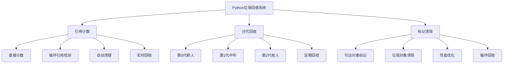

# 3.1.2 垃圾回收算法剖析

## 🎯 核类理念

垃圾回收是Python内存管理的"自动清洁工"。理解其算法机制不仅有助于优化内存使用，更能避免循环引用陷阱，实现高效的长期运行程序。

### 🗑️ 垃圾回收体系架构



## 🚀 算法深度解析

### 💡 引用计数算法

```python
import gc
import sys
import ctypes
import weakref
from collections import defaultdict

class ReferenceCountingAlgorithm:
    """引用计数算法深度分析"""
    
    @staticmethod
    def reference_counting_demo():
        """引用计数演示"""
        
        print("🔢 引用计数算法演示:")
        
        class CustomObject:
            def __init__(self, name):
                self.name = name
                print(f"创建对象: {name}")
            
            def __del__(self):
                print(f"销毁对象: {self.name}")
        
        # 基本引用计数
        def basic_reference_counting():
            print("\n1. 基本引用计数:")
            
            obj = CustomObject("obj1")
            print(f"创建后引用计数+: {sys.getrefcount(obj)}")
            
            # 增加引用
            ref1 = obj
            print(f"赋值后引用计数+: {sys.getrefcount(obj)}")
            
            # 列表引用
            container = [obj]
            print(f"列表引用后计数+: {sys.getrefcount(obj)}")
            
            # 字典引用
            mapping = {"obj": obj}
            print(f"字典引用后计数+: {sys.getrefcount(obj)}")
            
            # 减少引用
            del ref1
            print(f"删除引用后计数+: {sys.getrefcount(obj)}")
            
            del container[0]
            print(f"删除容器引用后计数+: {sys.getrefcount(obj)}")
            
            del mapping
            del obj  # 最后删除
            print("对象应该被销毁")
        
        basic_reference_counting()
    
    @staticmethod
    def circular_reference_analysis():
        """循环引用分析"""
        
        print("\n🔄 循环引用深度分析:")
        
        class Node:
            def __init__(self, value):
                self.value = value
                self.parent = None
                self.children = []
                print(f"创建节点: {value}")
            
            def __del__(self):
                print(f"销毁节点: {self.value}")
            
            def add_child(self, child):
                child.parent = self
                self.children.append(child)
        
        def create_family_tree():
            print("\n1. 创建树形结构（循环引用）:")
            
            # 创建父子关系
            parent = Node("根节点")
            child1 = Node("子节点1")
            child2 = Node("子节点2")
            grandchild = Node("孙子节点")
            
            # 建立循环引用
            parent.add_child(child1)
            parent.add_child(child2)
            child1.add_child(grandchild)
            grandchild.parent = child1  # 额外的循环引用
            
            print(f"父节点引用数: {sys.getrefcount(parent)}")
            print(f"子节点参考数: {sys.getrefcount(child1)}")
            print(f"孙子节点引用数: {sys.getrefcount(grandchild)}")
            
            # 删除外部引用
            return parent, child1, child2, grandchild
        
        def manipulate_circular_references():
            print("\n2. 循环引用操控:")
            
            # 创建循环引用对象
            obj1 = Node("对象1")
            obj2 = Node("对象2")
            
            # 创建循环引用
            obj1.ref_to_other = obj2
            obj2.ref_to_other = obj1
            
            print(f"obj1的引用数: {sys.getrefcount(obj1)}")
            print(f"obj2的引用数: {sys.getrefcount(obj2)}")
            
            # 删除变量
            del obj1, obj2
            print("变量已删除，但对象未销毁（循环引用）")
            
            # 手动触发垃圾回收
            collected = gc.collect()
            print(f"垃圾回收清理了 {collected} 个对象")
        
        # 运行循环引用示例
        tree_nodes = create_family_tree()
        manipulate_circular_references()

# ✅ 分代垃圾回收
class GenerationalGarbageCollection:
    """分代垃圾回收机制"""
    
    @staticmethod
    def generational_hypothesis_demo():
        """分代假设演示"""
        
        print("\n⚡ 分代回收假设验证:")
        
        def create_objects_with_different_lifespans():
            """创建不同生命周期的对象"""
            
            # 第0代：短生命周期对象
            short_lived_objects = []
            for i in range(100):
                obj = {"data": i, "type": "short"}
                short_lived_objects.append(obj)
            
            print(f"创建了 {len(short_lived_objects)} 个短生命周期对象")
            
            # 第1代：中等生命周期对象
            medium_lived_objects = []
            for i in range(50):
                obj = {"data": i * 2, "type": "medium", "refs": []}
                for j in range(3):
                    obj["refs"].append({"nested": j})
                medium_lived_objects.append(obj)
            
            print(f"创建了 {len(medium_lived_objects)} 个中等生命周期对象")
            
            # 第2代：长生命周期对象  
            long_lived_objects = []
            for i in range(10):
                obj = {"data": i * 10, "type": "long", "persistent_refs": medium_lived_objects[:2]}
                long_lived_objects.append(obj)
            
            print(f"创建了 {len(long_lived_objects)} 个长生命周期对象")
            
            return short_lived_objects, medium_lived_objects, long_lived_objects
        
        def analyze_generation_collection():
            """分析分代回收效果"""
            
            print("\n分析分代回收:")
            
            # 获取各代阈值
            thresholds = gc.get_threshold()
            print(f"分代阈值: {thresholds}")
            
            # 获取各代对象数量
            objects_before = []
            for i in range(3):
                objects_before.append(len([obj for obj in gc.get_objects() if gc.get_referents(obj)]))
            
            print(f"回收前各代对象数: {objects_before}")
            
            # 手动执行分代回收
            for generation in range(3):
                collected = gc.collect(generation)
                print(f"第{generation}代回收: 清理了 {collected} 个对象")
            
            # 检查回收后状态
            objects_after = []
            for i in range(3):
                objects_after.append(len([obj for obj in gc.get_objects() if gc.get_referents(obj)]))
            
            print(f"回收后各代对象数: {objects_after}")
        
        objects = create_objects_with_different_lifespans()
        analyze_generation_collection()
    
    @staticmethod
    def gc_statistics_monitoring():
        """垃圾回收统计监控"""
        
        print("\n📊 垃圾回收统计监控:")
        
        def monitor_gc_performance():
            """监控垃圾回收性能"""
            
            # 启用统计信息
            gc.set_debug(gc.DEBUG_STATS)
            
            print("垃圾回收统计信息:")
            
            # 收集统计信息
            gc_stats = gc.get_stats()
            for i, stats in enumerate(gc_stats):
                print(f"第{i}代统计:")
                print(f"  收集次数: {stats['collections']}")
                print(f"  收集对象总数: {stats.get('collected', 'unknown')}")
                print(f"  未被收集对象数: {stats.get('uncollectable', 'unknown')}")
            
            # 垃圾回收阈值
            thresholds = gc.get_threshold()
            print(f"当前阈值设置: {thresholds}")
            
            # 禁用调试
            gc.set_debug(0)
        
        def memory_pressure_test():
            """内存压力测试"""
            
            print("\n内存压力测试:")
            
            # 消耗内存
            large_objects = []
            for i in range(1000):
                obj = {"data": [j for j in range(100)], "id": i}
                large_objects.append(obj)
                
                if i % 100 == 0:
                    collected = gc.collect()
                    print(f"创建{i}个对象后回收了{collected}个对象")
        
        monitor_gc_performance()
        memory_pressure_test()

# ✅ 标记清除算法
class MarkAndSweepAlgorithm:
    """标记清除算法详解"""
    
    @staticmethod
    def mark_sweep_simulation():
        """标记清除模拟"""
        
        print("\n🔍 标记清除算法模拟:")
        
        class GCNode:
            """垃圾回收节点"""
            
            def __init__(self, value, color="white"):
                self.value = value
                self.color = color  # white, grey, black
                self.neighbors = []
            
            def add_neighbor(self, node):
                if node not in self.neighbors:
                    self.neighbors.append(node)
                if self not in node.neighbors:
                    node.neighbors.append(self)
            
            def __repr__(self):
                return f"GCNode({self.value}, {self.color})"
        
        def create_object_graph():
            """创建对象图"""
            
            # 创建节点
            nodes = {}
            for name in ['A', 'B', 'C', 'D', 'E', 'F', 'G']:
                nodes[name] = GCNode(name)
            
            # 建立引用关系
            # A -> B, C
            nodes['A'].add_neighbor(nodes['B'])
            nodes['A'].add_neighbor(nodes['B'])
            
            # B -> D
            nodes['B'].add_neighbor(nodes['D'])
            
            # C -> E
            nodes['C'].add_neighbor(nodes['E'])
            
            # D -> C (循环引用)
            nodes['D'].add_neighbor(nodes['C'])
            
            # F -> G (孤立循环)
            nodes['F'].add_neighbor(nodes['G'])
            nodes['G'].add_neighbor(nodes['F'])
            
            return nodes
        
        def mark_sweep_garbage_collection(root_objects, all_objects):
            """标记清除垃圾回收实现"""
            
            print("开始标记清除垃圾回收:")
            
            # 阶段1: 标记阶段 (Mark)
            def mark_phase():
                print("\n标记阶段:")
                
                # 将所有对象标记为白色
                for obj in all_objects.values():
                    obj.color = "white"
                
                # 从根对象开始，标记为灰色
                grey_objects = set()
                for root in root_objects:
                    root.color = "grey"
                    grey_objects.add(root)
                
                # 遍历灰色对象
                while grey_objects:
                    current = grey_objects.pop()
                    current.color = "black"  # 标记为黑色
                    
                    print(f"  标记 {current} 为黑色")
                    
                    # 标记所有邻接对象
                    for neighbor in current.neighbors:
                        if neighbor.color == "white":
                            neighbor.color = "grey"
                            grey_objects.add(neighbor)
                            print(f"    邻接 {neighbor} 标记为灰色")
            
            # 阶段2: 清除阶段 (Sweep)
            def sweep_phase():
                print("\n清除阶段:")
                
                garbage_objects = []
                kept_objects = []
                
                for obj in all_objects.values():
                    if obj.color == "black":
                        obj.color = "white"  # 重置为白色
                        obj.color = "white"
                        kept_objects.append(obj)
                        print(f"  保留 {obj.value}")
                    else:
                        garbage_objects.append(obj)
                        print(f"  清理 {obj.value}")
                
                return garbage_objects, kept_objects
            
            # 执行标记清除
            mark_phase()
            garbage, kept = sweep_phase()
            
            print(f"\n垃圾回收结果:")
            print(f"  保留了 {len(kept)} 个对象")
            print(f"  清理了 {len(garbage)} 个垃圾对象")
            
            return garbage, kept
        
        # 执行模拟
        nodes = create_object_graph()
        print("对象图创建完成:")
        
        for name, node in nodes.items():
            neighbor_names = [n.value for n in node.neighbors]
            print(f"  {name} -> {neighbor_names}")
        
        # 设置根对象 (A和E是可到达的)
        root_objects = [nodes['A'], nodes['E']]
        
        # 执行垃圾回收
        garbage, kept = mark_sweep_garbage_collection(root_objects, nodes)
    
    @staticmethod
    def gc_optimization_strategies():
        """垃圾回收优化策略"""
        
        print("\n⚡ 垃圾回收优化策略:")
        
        def reduce_object_creation():
            """减少对象创建"""
            
            print("\n1. 减少对象创建:")
            
            import time
            
            # 低效方式：重复创建字符串
            def inefficient_string_concatenation():
                start_time = time.perf_counter()
                result = ""
                for i in range(10000):
                    result += str(i)  # 每次都创建新字符串对象
                return time.perf_counter() - start_time
            
            # 高效方式：使用列表
            def efficient_string_concatenation():
                start_time = time.perf_counter()
                parts = []
                for i in range(10000):
                    parts.append(str(i))  # 减少字符串对象创建
                result = "".join(parts)
                return time.perf_counter() - start_time
            
            # 最高效：预分配
            def preallocated_concatenation():
                start_time = time.perf_counter()
                result = "".join(str(i) for i in range(10000))  # 生成器表达式
                return time.perf_counter() - start_time
            
            inefficient_time = inefficient_string_concatenation()
            efficient_time = efficient_string_concatenation()
            preallocated_time = preallocated_concatenation()
            
            print(f"低效率方式: {inefficient_time:.4f}秒")
            print(f"有效率方式: {efficient_time:.4f}秒")
            print(f"预分配方式: {preallocated_time:.4f}秒")
            print(f"性能提升: {inefficient_time/efficient_time:.1f}倍")
        
        def use_weak_references():
            """使用弱引用避免循环引用"""
            
            print("\n2. 使用弱引用:")
            
            class StrongRefContainer:
                def __init__(self, name):
                    self.name = name
                    self.stored_object = None
                
                def set_object(self, obj):
                    self.stored_object = obj
                
                def has_object(self):
                    return self.stored_object is not None
            
            class WeakRefContainer:
                def __init__(self, name):
                    self.name = name
                    self.stored_object = None
                
                def set_object(self, obj):
                    self.stored_object = weakref.ref(obj)
                
                def has_object(self):
                    return (self.stored_object is not None and 
                           self.stored_object() is not None)
                
                def get_object(self):
                    if self.has_object():
                        return self.stored_object()
                    return None
            
            # 测试对象
            test_obj = {"data": "important"}
            
            # 强引用测试
            strong_container = StrongRefContainer("强引用容器")
            strong_container.set_object(test_obj)
            print(f"强引用容器持有对象: {strong_container.has_object()}")
            
            del test_obj  # 删除原始引用
            print(f"删除原始引用后强引用仍存在: {strong_container.has_object()}")
            
            # 弱引用测试
            test_obj2 = {"data": "weak_important"}
            weak_container = WeakRefContainer("弱引用容器")
            weak_container.set_object(test_obj2)
            print(f"弱引用容器持有对象: {weak_container.has_object()}")
            
            del test_obj2  # 删除原始引用
            print(f"删除原始引用后弱引用失效: {weak_container.has_object()}")
        
        def gc_performance_tuning():
            """垃圾回收性能调优"""
            
            print("\n3. GC性能调优:")
            
            # 检查当前GC配置
            print("当前GC配置:")
            print(f"  阈值: {gc.get_threshold()}")
            print(f"  计数: {gc.get_count()}")
            
            # 优化策略
            def optimize_gc_thresholds():
                """优化GC阈值"""
                
                # 获取当前垃圾回收频率
                initial_count = gc.get_count()
                
                # 创建一些对象触发GC
                objects = []
                for i in range(1000):
                    objects.append(f"object_{i}")
                
                # 记录GC触发次数
                final_count = gc.get_count()
                gc_triggers = sum(final_count) - sum(initial_count)
                
                print(f"GC触发次数: {gc_triggers}")
                
                # 调整阈值（仅在必要时）
                if gc_triggers > 10:  # 如果GC触发过于频繁
                    print("GC触发频繁，考虑调整阈值")
                    # gc.set_threshold(700, 15, 15)  # 示例调整
                else:
                    print("GC阈值设置合理")
            
            optimize_gc_thresholds()
        
        reduce_object_creation()
        use_weak_references()
        gc_performance_tuning()

# 🧪 垃圾回收实战应用
class GarbageCollectionPractices:
    """垃圾回收实践应用"""
    
    @staticmethod
    def memory_leak_detection():
        """内存泄漏检测"""
        
        print("\n🔍 内存泄漏检测:")
        
        def detect_circular_references():
            """检测循环引用"""
            
            # 启用循环引用调试
            gc.set_debug(gc.DEBUG_SAVEALL)
            
            # 创建循环引用
            import time
            
            class LeakyClass:
                def __init__(self, name):
                    self.name = name
                    self.ref = None
            
            def create_leaky_objects():
                leaky_objects = []
                
                for i in range(100):
                    obj1 = LeakyClass(f"obj1_{i}")
                    obj2 = LeakyClass(f"obj2_{i}")
                    
                    # 创建循环引用
                    obj1.ref = obj2
                    obj2.ref = obj1
                    
                    leaky_objects.extend([obj1, obj2])
                
                return leaky_objects
            
            # 创建对象
            leaky_objects = create_leaky_objects()
            print(f"创建了 {len(leaky_objects)} 个泄漏对象")
            
            # 删除外部引用但保留循环引用
            del leaky_objects
            
            # 强制垃圾回收
            collected = gc.collect()
            print(f"回收了 {collected} 个循环引用对象")
            
            # 检查garbage字典
            print(f"垃圾对象数量: {len(gc.garbage)}")
            
            # 清理garbage
            gc.garbage.clear()
            
            # 重置调试
            gc.set_debug(0)
        
        def automated_memory_monitoring():
            """自动内存监控"""
            
            print("\n自动内存监控:")
            
            import psutil
            import os
            
            def monitor_memory_usage():
                """监控内存使用"""
                
                process = psutil.Process(os.getpid())
                
                # 内存信息
                memory_info = process.memory_info()
                print(f"RSS内存: {memory_info.rss / 1024 / 1024:.1f} MB")
                print(f"VMS内存: {memory_info.vms / 1024 / 1024:.1f} MB")
                
                # GC统计
                gc_stats = gc.get_stats()
                print(f"GC统计: {len(gc_stats)} 代")
                
                # 对象计数
                object_count = len([obj for obj in gc.get_objects()])
                print(f"总对象数: {object_count}")
                
                return {
                    'rss_mb': memory_info.rss / 1024 / 1024,
                    'object_count': object_count,
                    'gc_generations': len(gc_stats)
                }
            
            # 基线测量
            baseline = monitor_memory_usage()
            print(f"\n基线: RSS={baseline['rss_mb']:.1f}MB, 对象数={baseline['object_count']}")
            
            # 创建大量对象
            big_objects = []
            for i in range(50000):
                big_objects.append({"data": i * "x", "index": i})
            
            # 测量峰值
            peak = monitor_memory_usage()
            print(f"峰值: RSS={peak['rss_mb']:.1f}MB, 对象数={peak['object_count']}")
            
            # 清理对象
            del big_objects
            
            # 强制清理
            gc.collect()
            
            # 测量清理后
            cleaned = monitor_memory_usage()
            print(f"清理后: RSS={cleaned['rss_mb']:.1f}MB, 对象数={cleaned['object_count']}")
        
        detect_circular_references()
        automated_memory_monitoring()

# 运行所有垃圾回收示例
print("🚀 Python垃圾回收算法深度剖析:")
ReferenceCountingAlgorithm.reference_counting_demo()
ReferenceCountingAlgorithm.circular_reference_analysis()
GenerationalGarbageCollection.generational_hypothesis_demo()
GenerationalGarbageCollection.gc_statistics_monitoring()
MarkAndSweepAlgorithm.mark_sweep_simulation()
MarkAndSweepAlgorithm.gc_optimization_strategies()
GarbageCollectionPractices.memory_leak_detection()

## 🧪 垃圾回收最佳实践

### 📝 实践1：内存泄漏检测器

**任务**：实现一个自动内存泄漏检测工具

```python
# ✅ 内存泄漏检测器
class MemoryLeakDetector:
    """内存泄漏检测器"""
    
    def __init__(self):
        self.baseline_objects = set()
        self.suspicious_objects = {}
        self.growth_history = []
    
    def establish_baseline(self):
        """建立基线"""
        
        # 保存当前所有对象ID作为基线
        self.baseline_objects = set(id(obj) for obj in gc.get_objects())
        
        print(f"建立基线: {len(self.baseline_objects)} 个对象")
    
    def detect_leaks(self, threshold=0.1):
        """检测内存泄漏"""
        
        # 获取当前对象
        current_objects = set(id(obj) for obj in gc.get_objects())
        
        # 查找泄露可疑的对象
        leaked_objects = current_objects - self.baseline_objects
        
        print(f"当前对象数: {len(current_objects)}")
        print(f"泄漏可疑对象数: {len(leaked_objects)}")
        
        if len(leaked_objects) > threshold * len(self.baseline_objects):
            print("⚠️ 警告: 检测到潜在内存泄漏")
            return leaked_objects
        
        return set()
    
    def analyze_object_types(self, leaked_object_ids):
        """分析泄漏对象类型"""
        
        from collections import defaultdict
        
        type_counts = defaultdict(int)
        
        for obj in gc.get_objects():
            if id(obj) in leaked_object_ids:
                type_name = type(obj).__name__
                type_counts[type_name] += 1
        
        print("泄漏对象类型分析:")
        for type_name, count in sorted(type_counts.items(), 
                                     key=lambda x: x[1], reverse=True)[:10]:
            print(f"  {type_name}: {count} 个")

# leak_detector = MemoryLeakDetector()
# leak_detector.establish_baseline()
```

### 🎯 实践2：自定义垃圾回收优化器

**任务**：实现针对特定场景的GC优化策略

```python
# ✅ GC优化器
class GCOptimizer:
    """垃圾回收优化器"""
    
    def __init__(self):
        self.original_thresholds = gc.get_threshold()
        self.gc_stats_history = []
    
    def analyze_gc_patterns(self):
        """分析GC模式"""
        
        # 记录GC统计信息
        gc_stats = gc.get_count()
        self.gc_stats_history.append(gc_stats)
        
        if len(self.gc_stats_history) > 10:
            self.gc_stats_history.pop(0)
        
        # 计算GC频率
        if len(self.gc_stats_history) >= 2:
            recent_stats = self.gc_stats_history[-1]
            previous_stats = self.gc_stats_history[-2]
            
            gc_frequency = [recent - prev for recent, prev 
                          in zip(recent_stats, previous_stats)]
            
            return gc_frequency
        
        return None
    
    def optimize_thresholds(self):
        """优化GC阈值"""
        
        gc_frequency = self.analyze_gc_patterns()
        if not gc_frequency:
            return
        
        print(f"GC频率分析: {gc_frequency}")
        
        # 动态调整策略
        if gc_frequency[0] > 20:  # 第0代GC过频繁
            print("第0代GC频率过高，考虑增加阈值")
        elif gc_frequency[1] > 5:  # 第1代GC过频繁
            print("第1代GC频率过高，考虑调整分代参数")
        
    def reset_optimization(self):
        """重置优化设置"""
        
        gc.set_threshold(*self.original_thresholds)
        print("GC阈值已重置为原始值")

# gc_optimizer = GCOptimizer()
# gc_optimizer.optimize_thresholds()
```

## 🔗 知识连接

- **内存管理**：[[3.1 内存管理深度解析]] - 整体内存管理架构
- **性能优化**：[[5.5 性能调优与监控]] - 高级性能优化技术
- **并发编程**：[[3.2 并发与异步编程]] - 多线程环境下的GC

## 💡 费曼检验

**解释：Python垃圾回收的三种算法分别解决什么问题？为什么要使用分代回收？如何避免内存泄漏？**

核心要点：
1. **引用计数**：实时回收无引用对象，但无法处理循环引用
2. **标记清除**：解决循环引用问题，但不实时
3. **分代回收**：基于生命周期假设优化GC性能
4. **避免泄漏**：使用弱引用、及时断开引用、监控内存使用

---

🎯 **下个目标**：学习[[3.1.3 内存优化策略与工具]]中的高级优化技巧
