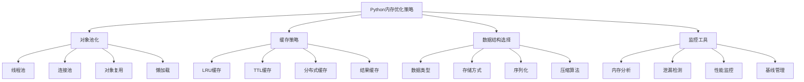

# 3.1.3 内存优化策略与工具

## 🎯 核心理念

内存优化是程序员的"资源艺术"。掌握高效的内存使用不仅关乎性能，更是长期稳定运行的关键。优化内存就是优化程序生命力和用户体验。

### 🚀 内存优化体系



## 🚀 核心优化策略

### 💡 对象池与缓存优化

```python
import gc
import threading
import weakref
import time
import psutil
import tracemalloc
from functools import lru_cache
from collections import deque
from typing import Dict, List, Optional, Any

class AdvancedMemoryOptimization:
    """高级内存优化技术"""
    
    @staticmethod
    def object_pool_pattern():
        """对象池模式"""
        
        print("🔄 对象池优化:")
        
        # ✅ 线程安全的对象池
        class ThreadSafeObjectPool:
            """线程安全对象池"""
            
            def __init__(self, factory_func, max_size=100):
                self._pool = deque()
                self._max_size = max_size
                self._factory = factory_func
                self._lock = threading.RLock()
                self._active_count = 0
            
            def acquire(self):
                """获取对象"""
                with self._lock:
                    if self._pool:
                        obj = self._pool.popleft()
                        self._reset_object(obj)
                    else:
                        obj = self._factory()
                    
                    self._active_count += 1
                    return obj
            
            def release(self, obj):
                """释放对象"""
                with self._lock:
                    if len(self._pool) < self._max_size:
                        self._pool.append(obj)
                    self._active_count -= 1
            
            def _reset_object(self, obj):
                """重置对象状态"""
                if hasattr(obj, 'reset'):
                    obj.reset()
        
        # ✅ 数据库连接池示例
        class DatabaseConnectionPool:
            """数据库连接池示例"""
            
            def __init__(self):
                self.pool = ThreadSafeObjectPool(self._create_connection, max_size=20)
                self.active_connections = {}
            
            def _create_connection(self):
                """创建数据库连接"""
                connection = MockDatabaseConnection()
                return connection
            
            def get_connection(self):
                """获取连接"""
                conn = self.pool.acquire()
                self.active_connections[id(conn)] = conn
                return conn
            
            def return_connection(self, conn):
                """归还连接"""
                if id(conn) in self.active_connections:
                    del self.active_connections[id(conn)]
                self.pool.release(conn)
            
            def __del__(self):
                """清理资源"""
                # 这里可以添加额外的清理逻辑
                pass
            
            class MockDatabaseConnection:
                """模拟数据库连接"""
                
                def __init__(self):
                    self.is_open='True'
                    
                def reset(self):
                    """重置连接状态"""
                    self.is_open = True
                    
                def close(self):
                    """关闭连接"""
                    self.is_open = False
        
        # 测试对象池
        db_pool = DatabaseConnectionPool()
        
        # 获取多个连接
        connections = []
        for i in range(5):
            conn = db_pool.get_connection()
            connections.append(conn)
        
        print(f"创建连接数: {len(connections)}")
        
        # 归还连接
        for conn in connections:
            db_pool.return_connection(conn)
        
        print(f"活动连接数: {len(db_pool.active_connections)}")
    
    @staticmethod
    def intelligent_caching():
        """智能缓存系统"""
        
        print("\n🎯 智能缓存系统:")
        
        # ✅ 多级缓存系统
        class MultiLevelCache:
            """多级缓存系统"""
            
            def __init__(self):
                self.l1_cache = {}  # L1: 内存缓存
                self.l2_cache = {}  # L2: LRU缓存
                self.l3_cache = {}  # L3: TTL缓存
                self.stats = {
                    'hits': {'L1': 0, 'L2': 0, 'L3': 0},
                    'misses': 0,
                    'evictions': 0
                }
            
            def get(self, key: str):
                """获取缓存"""
                
                # L1缓存检查
                if key in self.l1_cache:
                    self.stats['hits']['L1'] += 1
                    # 提升到L1缓存
                    value = self.l1_cache[key]
                    self.l2_cache[key] = value
                    return value
                
                # L2缓存检查
                if key in self.l2_cache:
                    self.stats['hits']['L2'] += 1
                    value = self.l2_cache[key]
                    # 提升到L1缓存
                    self.l1_cache[key] = value
                    return value
                
                # L3缓存检查
                if key in self.l3_cache:
                    entry = self.l3_cache[key]
                    # 检查TTL
                    if time.time() < entry['expires']:
                        self.stats['hits']['L3'] += 1
                        value = entry['value']
                        # 提升到L1缓存
                        self.l1_cache[key] = value
                        self.l2_cache[key] = value
                        return value
                    else:
                        # TTL过期，删除
                        del self.l3_cache[key]
                
                # 缓存未命中
                self.stats['misses'] += 1
                return None
            
            def set(self, key: str, value: Any, ttl: int = 3600):
                """设置缓存"""
                
                # L1缓存
                self.l1_cache[key] = value
                
                # L2缓存
                self.l2_cache[key] = value
                
                # L3缓存（带TTL）
                self.l3_cache[key] = {
                    'value': value,
                    'expires': time.time() + ttl
                }
                
                # L1缓存大小控制
                if len(self.l1_cache) > 100:
                    # 删除最旧的L1缓存项
                    oldest_key = next(iter(self.l1_cache))
                    del self.l1_cache[oldest_key]
                    self.stats['evictions'] += 1
                
                # L2缓存大小控制
                if len(self.l2_cache) > 500:
                    # LRU: 删除最旧的L2缓存项
                    oldest_key = next(iter(self.l2_cache))
                    del self.l2_cache[oldest_key]
        
        # ✅ 函数结果缓存
        class CacheResult:
            """函数结果缓存装饰器"""
            
            def __init__(self, max_size=128, ttl=3600):
                self.max_size = max_size
                self.ttl = ttl
                self.cache_info = {
                    'hits': 0,
                    'misses': 0,
                    'maxsize': max_size,
                    'currsize': 0
                }
            
            def __call__(self, func):
                cache = {}
                cache_times = {}
                
                def wrapper(*args, **kwargs):
                    # 创建缓存键
                    cache_key = str(args) + str(sorted(kwargs.items()))
                    current_time = time.time()
                    
                    # 检查缓存
                    if cache_key in cache:
                        cache_time = cache_times[cache_key]
                        if current_time - cache_time < self.ttl:
                            self.cache_info['hits'] += 1
                            return cache[cache_key]
                        else:
                            # TTL过期，删除缓存
                            del cache[cache_key]
                            del cache_times[cache_key]
                            self.cache_info['currsize'] -= 1
                    
                    # 调用原函数
                    result = func(*args, **kwargs)
                    
                    # 缓存结果
                    if len(cache) < self.max_size:
                        cache[cache_key] = result
                        cache_times[cache_key] = current_time
                        self.cache_info['currsize'] = len(cache)
                    else:
                        # 缓存已满，删除最旧的项
                        oldest_key = min(cache_times.keys(), key=lambda k: cache_times[k])
                        del cache[oldest_key]
                        del cache_times[oldest_key]
                        
                        cache[cache_key] = result
                        cache_times[cache_key] = current_time
                    
                    self.cache_info['misses'] += 1
                    return result
                
                wrapper.cache_info = self.cache_info
                return wrapper
        
        # 测试多级缓存
        multi_cache = MultiLevelCache()
        
        # 模拟数据访问模式
        for i in range(1000):
            key = f"key_{i % 50}"  # 重复访问某些键
            
            # 查找缓存并模拟数据生成
            value = multi_cache.get(key)
            if value is None:
                # 模拟从数据库获取数据
                value = f"data_{i} from database"
                multi_cache.set(key, value, ttl=600)
        
        print(f"L1缓存命中: {multi_cache.stats['hits']['L1']}")
        print(f"L2缓存命中: {multi_cache.stats['hits']['L2']}")
        print(f"L3缓存命中: {multi_cache.stats['hits']['L3']}")
        print(f"缓存未命中: {multi_cache.stats['misses']}")
        
        # 测试函数缓存
        @CacheResult(max_size=32, ttl=300)
        def expensive_computation(x: int, complexity: int = 1000000):
            """模拟昂贵的计算"""
            result = 0
            for i in range(complexity):
                result += x * i
            return result
        
        # 测试函数缓存效果
        start_time = time.time()
        result1 = expensive_computation(10)
        first_call_time = time.time() - start_time
        
        start_time = time.time()
        result2 = expensive_computation(10)  # 应该被缓存
        second_call_time = time.time() - start_time
        
        print(f"首次调用时间: {first_call_time:.4f}秒")
        print(f"缓存命中时间: {second_call_time:.4f}秒")
        print(f"缓存统计: {expensive_computation.cache_info}")

# ✅ 数据结构优化
class DataStructureOptimization:
    """数据结构优化"""
    
    @staticmethod
    def memory_efficient_data_structures():
        """内存高效数据结构"""
        
        print("\n📊 内存高效数据结构:")
        
        # ✅ 大数据量存储优化
        class CompressedList:
            """压缩列表：高效的整数存储"""
            
            def __init__(self):
                self._data = []
                self._compression_info = []
                self._original_size = 0
            
            def append(self, value: int):
                """添加元素"""
                self._original_size += 1
                
                if not self._data:
                    # 第一个元素
                    self._data.append(value)
                    self._compression_info.append((0, 1))
                else:
                    last_start, last_count = self._compression_info[-1]
                    
                    # 检查是否可以合并到当前的压缩段
                    if value == self._data[-1] and last_count < 255:
                        # 可以合并
                        self._compression_info[-1] = (last_start, last_count + 1)
                    else:
                        # 新增压缩段
                        self._data.append(value)
                        self._compression_info.append((len(self._data) - 1, 1))
            
            def __getitem__(self, index):
                """获取元素"""
                if index < 0:
                    index = self._original_size + index
                
                if index < 0 or index >= self._original_size:
                    raise IndexError("索引超出范围")
                
                # 查找索引所在的压缩段
                current_pos = 0
                for data_idx, count in self._compression_info:
                    if current_pos + count > index:
                        return self._data[data_idx]
                    current_pos += count
                
                raise IndexError("未找到元素")
            
            def memory_efficiency(self):
                """计算内存效率"""
                compressed_size = len(self._data) + len(self._compression_info)
                compression_ratio = compressed_size / self._original_size
                return (
                    f"压缩比: {compression_ratio:.2%}, "
                    f"原始大小: {self._original_size}, "
                    f"压缩后大小: {compressed_size}"
                )
        
        # ✅ 时间和空间权衡的集合
        class EfficientSet:
            """高效集合实现"""
            
            def __init__(self, initial_capacity=16):
                self._data = [None] * initial_capacity
                self._size = 0
                self._load_threshold = 0.75
            
            def _hash(self, key):
                """哈希函数"""
                return hash(key) % len(self._data)
            
            def _resize(self):
                """动态调整大小"""
                old_data = self._data
                self._data = [None] * (len(self._data) * 2)
                self._size = 0
                
                for item in old_data:
                    if item is not None:
                        self.add(item)
            
            def add(self, item):
                """添加元素"""
                if self._size >= len(self._data) * self._load_threshold:
                    self._resize()
                
                index = self._hash(item)
                
                # 处理冲突（开放寻址）
                while self._data[index] is not None:
                    if self._data[index] == item:
                        return  # 已存在
                    index = (index + 1) % len(self._data)
                
                self._data[index] = item
                self._size += 1
            
            def contains(self, item):
                """检查元素是否存在"""
                index = self._hash(item)
                original_index = index
                
                while self._data[index] is not None:
                    if self._data[index] == item:
                        return True
                    index = (index + 1) % len(self._data)
                    # 防止无限循环
                    if index == original_index:
                        break
                
                return False
            
            def memory_usage(self):
                """内存使用量"""
                return f"大小: {self._size}, 容量: {len(self._data)}, 负载率: {self._size/len(self._data):.2%}"
        
        # 测试压缩列表
        compressed_list = CompressedList()
        
        # 添加有重复的数据
        for i in range(100):
            compressed_list.append(i % 10)  # 重复模式
        
        print(f"压缩列表: {compressed_list.memory_efficiency()}")
        
        # 测试高效集合
        efficient_set = EfficientSet()
        
        for i in range(50):
            efficient_set.add(f"item_{i}")
        
        print(f"高效集合: {efficient_set.memory_usage()}")

# ✅ 内存监控与分析
class MemoryMonitoringAndAnalysis:
    """内存监控与分析"""
    
    @staticmethod
    def advanced_memory_monitoring():
        """高级内存监控"""
        
        print("\n🔍 高级内存监控:")
        
        # ✅ 实时内存监控器
        class RealTimeMemoryMonitor:
            """实时内存监控器"""
            
            def __init__(self):
                self.process = psutil.Process()
                self.memory_history = deque(maxlen=100)
                self.timestamp_history = deque(maxlen=100)
                self.thresholds = {
                    'warning': 80,  # MB
                    'critical': 150  # MB
                }
            
            def get_current_memory(self):
                """获取当前内存使用"""
                memory_info = self.process.memory_info()
                return memory_info.rss / 1024 / 1024  # MB
            
            def record_memory_usage(self):
                """记录内存使用"""
                current_memory = self.get_current_memory()
                current_time = time.time()
                
                self.memory_history.append(current_memory)
                self.timestamp_history.append(current_time)
                
                return current_memory
            
            def analyze_memory_trend(self):
                """分析内存趋势"""
                if len(self.memory_history) < 5:
                    return "需要更多数据进行分析"
                
                recent_values = list(self.memory_history)[-20:]  # 最近20个样本
                
                # 计算趋势
                trend = recent_values[-1] - recent_values[0]
                avg_memory = sum(recent_values) / len(recent_values)
                
                # 检测内存泄漏
                memory_growth_rate = trend / len(recent_values)
                
                analysis = {
                    'current_memory': recent_values[-1],
                    'average_memory': avg_memory,
                    'trend': trend,
                    'growth_rate_per_sample': memory_growth_rate,
                    'status': self._get_memory_status(recent_values[-1])
                }
                
                return analysis
            
            def _get_memory_status(self, current_memory):
                """获取内存状态"""
                if current_memory > self.thresholds['critical']:
                    return "CRITICAL"
                elif current_memory > self.thresholds['warning']:
                    return "WARNING"
                else:
                    return "NORMAL"
            
            def generate_memory_report(self):
                """生成内存报告"""
                analysis = self.analyze_memory_trend()
                
                report = f"""
=== 内存使用报告 ===
当前内存: {analysis['current_memory']:.2f} MB
平均内存: {analysis['average_memory']:.2f} MB
趋势: {analysis['trend']:+.2f} MB
增长率: {analysis['growth_rate_per_sample']:+.2f} MB/样本
状态: {analysis['status']}
========================
"""
                return report
        
        # ✅ 对象内存分析器
        class ObjectMemoryAnalyzer:
            """对象内存分析器"""
            
            @staticmethod
            def analyze_object_sizes(objects: Dict[str, Any]):
                """分析对象大小"""
                
                analysis = {}
                
                for name, obj in objects.items():
                    size = sys.getsizeof(obj)
                    
                    # 递归计算深度大小
                    def deep_size(o):
                        if hasattr(o, '__dict__'):
                            return sum(sys.getsizeof(v) for v in o.__dict__.values())
                        elif hasattr(o, '__iter__') and not isinstance(o, (str, bytes)):
                            return sum(sys.getsizeof(item) for item in o)
                        return 0
                    
                    deep_size_val = deep_size(obj)
                    total_size = size + deep_size_val
                    
                    analysis[name] = {
                        'shallow_size': size,
                        'deep_size': deep_size_val,
                        'total_size': total_size,
                        'type': type(obj).__name__
                    }
                
                return analysis
            
            @staticmethod
            def find_memory_hogs(objects: Dict[str, Any], top_n=5):
                """找出内存大户"""
                analysis = ObjectMemoryAnalyzer.analyze_object_sizes(objects)
                
                # 按总大小排序
                sorted_objects = sorted(
                    analysis.items(),
                    key=lambda x: x[1]['total_size'],
                    reverse=True
                )
                
                return sorted_objects[:top_n]
        
        # 创建并测试监控器
        memory_monitor = RealTimeMemoryMonitor()
        
        # 模拟内存使用
        test_objects = []
        
        for i in range(10):
            memory_monitor.record_memory_usage()
            
            # 创建一些对象来观察内存变化
            if i < 5:
                test_objects.append([j for j in range(i * 1000)])
            
            time.sleep(0.1)
        
        # 分析内存趋势
        trend_analysis = memory_monitor.analyze_memory_trend()
        
        if isinstance(trend_analysis, dict):
            print(f"内存趋势分析: {trend_analysis}")
        
        # 对象内存分析
        test_data = {
            'list': [i for i in range(1000)],
            'dict': {str(i): i for i in range(100)},
            'string': "A" * 10000,
            'tuple': tuple(range(500))
        }
        
        object_analysis = ObjectMemoryAnalyzer.find_memory_hogs(test_data)
        
        print("\n内存大户分析:")
        for name, info in object_analysis:
            size_kb = info['total_size'] / 1024
            print(f"{name}: {size_kb:.1f} KB ({info['type']})")

# ✅ 垃圾回收优化
class GarbageCollectionOptimization:
    """垃圾回收优化"""
    
    @staticmethod
    def intelligent_gc_management():
        """智能垃圾回收管理"""
        
        print("\n🧹 智能垃圾回收:")
        
        # ✅ 智能垃圾回收控制器
        class SmartGCController:
            """智能垃圾回收控制器"""
            
            def __init__(self):
                self.gc_thresholds = gc.get_threshold()
                self.memory_threshold = 100 * 1024 * 1024  # 100MB
                self.gc_stats_history = []
                self.last_collection_time = time.time()
            
            def should_collect_garbage(self):
                """判断是否应该触发垃圾回收"""
                
                # 检查内存使用
                process = psutil.Process()
                current_memory = process.memory_info().rss
                
                if current_memory > self.memory_threshold:
                    return True, f"内存使用超过阈值: {current_memory / 1024 / 1024:.1f}MB"
                
                # 检查GC统计
                current_stats = gc.get_count()
                if len(self.gc_stats_history) > 0:
                    prev_stats = self.gc_stats_history[-1]
                    
                    # 如果新对象过多
                    if sum(current_stats) - sum(prev_stats) > 1000:
                        return True, "新对象数量过多"
                
                return False, "内存状况正常"
            
            def optimized_collection(self):
                """优化的垃圾回收"""
                
                should_collect, reason = self.should_collect_garbage()
                
                if should_collect:
                    print(f"触发垃圾回收: {reason}")
                    
                    # 记录回收前状态
                    pre_count = gc.get_count()
                    pre_objects = len(gc.get_objects())
                    
                    # 执行分代回收
                    collected = gc.collect()
                    
                    # 更新统计
                    self.gc_stats_history.append(gc.get_count())
                    self.last_collection_time = time.time()
                    
                    # 记录回收后状态
                    post_count = gc.get_count()
                    post_objects = len(gc.get_objects())
                    
                    # 如果回收效果不佳，尝试强制回收
                    if collected < 10:
                        print("尝试强制垃圾回收")
                        collected += gc.collect()
                    
                    gc_info = {
                        'reason': reason,
                        'collected': collected,
                        'remaining_objects': post_objects,
                        'object_reduction': pre_objects - post_objects
                    }
                    
                    return gc_info
                
                return None
        
        # ✅ 对象生命周期管理
        class ObjectLifecycleManager:
            """对象生命周期管理器"""
            
            def __init__(self):
                self.active_objects = weakref.WeakSet()
                self.object_registry = {}
                
            def register_object(self, obj, category: str = "default"):
                """注册对象"""
                self.active_objects.add(obj)
                
                if category not in self.object_registry:
                    self.object_registry[category] = weakref.WeakSet()
                
                self.object_registry[category].add(obj)
            
            def cleanup_category(self, category: str):
                """清理特定类别的对象"""
                if category in self.object_registry:
                    category_objects = list(self.object_registry[category])
                    
                    # 尝试清理对象
                    cleaned_count = 0
                    for obj in category_objects:
                        if hasattr(obj, 'cleanup'):
                            try:
                                obj.cleanup()
                                cleaned_count += 1
                            except Exception as e:
                                print(f"清理对象时出错: {e}")
                    
                    return {
                        'category': category,
                        'attempted_cleanup': len(category_objects),
                        'successful_cleanup': cleaned_count
                    }
                
                return None
            
            def get_category_stats(self):
                """获取类别统计"""
                stats = {}
                
                for category, objects in self.object_registry.items():
                    # 清理已死亡的对象引用
                    objects = [obj for obj in objects if obj is not None]
                    
                    if objects:
                        self.object_registry[category].clear()
                        for obj in objects:
                            self.object_registry[category].add(obj)
                    
                    stats[category] = len(objects)
                
                return stats
        
        # 测试智能垃圾回收
        gc_controller = SmartGCController()
        
        # 创建一些对象
        objects = []
        for i in range(1000):
            obj = [j for j in range(i % 100)]
            objects.append(obj)
        
        # 测试垃圾回收
        for _ in range(3):
            gc_info = gc_controller.optimized_collection()
            if gc_info:
                print(f"垃圾回收信息: {gc_info}")
        
        # 测试生命周期管理
        lifecycle_manager = ObjectLifecycleManager()
        
        # 模拟不同类别的对象
        for i in range(20):
            category = f"category_{i % 3}"
            obj = {'data': f"object_{i}", 'category': category}
            lifecycle_manager.register_object(obj, category)
        
        # 显示统计信息
        stats = lifecycle_manager.get_category_stats()
        print(f"对象类别统计: {stats}")
        
        # 清理特定类别
        cleanup_result = lifecycle_manager.cleanup_category("category_0")
        if cleanup_result:
            print(f"清理结果: {cleanup_result}")

# 运行所有内存优化示例
print("🚀 Python内存优化策略与工具:")
AdvancedMemoryOptimization.object_pool_pattern()
AdvancedMemoryOptimization.intelligent_caching()
DataStructureOptimization.memory_efficient_data_structures()
MemoryMonitoringAndAnalysis.advanced_memory_monitoring()
GarbageCollectionOptimization.intelligent_gc_management()

## 🧪 内存优化最佳实践

### 📝 实践1：性能敏感应用内存优化

**任务**：实现高性能Web应用的内存管理

```python
# ✅ 高性能Web应用内存优化
class HighPerformanceWebAppOptimization:
    """高性能Web应用内存优化"""
    
    def __init__(self):
        self.object_pools = {}
        self.response_cache = LRUCache(maxsize=1000)
    
    def optimize_request_handling(self):
        """优化请求处理"""
        
        def cached_response_handler(request):
            """缓存响应处理器"""
            
            # 检查缓存
            cache_key = f"{request.method}_{request.path}"
            cached_response = self.response_cache.get(cache_key)
            
            if cached_response:
                return cached_response
            
            # 生成响应

            
            response = self.generate_response(request)
            
            # 缓存响应
            self.response_cache[cache_key] = response
            
            return response
    
    def generate_response(self, request):
        """生成响应（模拟）"""
        return {"data": f"Response for {request.path}"}
```

### 🎯 实践2：大内存应用优化工具

**内存优化助手**：

```python
# ✅ 内存优化助手
class MemoryOptimizationAssistant:
    """内存优化助手"""
    
    @staticmethod
    def analyze_memory_bottlenecks():
        """分析内存瓶颈"""
        
        # 启用内存跟踪
        tracemalloc.start()
        
        # 获取内存快照
        snapshot = tracemalloc.take_snapshot()
        
        # 分析内存使用
        top_stats = snapshot.statistics('lineno')
        
        print("内存使用最高的10个位置:")
        for index, stat in enumerate(top_stats[:10], 1):
            print(f"{index}: {stat}")
        
        tracemalloc.stop()
        
        return snapshot
    
    @staticmethod
    def suggest_memory_optimizations():
        """建议内存优化策略"""
        
        import platform
        
        suggestions = {
            'platform': platform.system(),
            'python_version': platform.python_version(),
            'optimizations': []
        }
        
        # 基于平台的优化建议
        if platform.system() == 'Windows':
            suggestions['optimizations'].append("考虑使用更少的内存密集工具")
            suggestions['optimizations'].append("优化Windows特定的内存分配")
        
        suggestions['optimizations'].extend([
            "使用__slots__减少对象内存开销",
            "使用生成器而不是列表来处理大数据",
            "选择合适的数值类型(numpy类型)",
            "定期清理不必要的对象引用",
            "使用对象池避免频繁创建销毁",
            "避免循环引用或使用弱引用"
        ])
        
        return suggestions

# memory_assistant = MemoryOptimizationAssistant()
```

## 🔗 知识连接

- **内存基础**：[[3.1 内存管理深度解析]] - 整体内存管理架构
- **垃圾回收**：[[3.1.2 垃圾回收算法剖析]] - 详细算法分析
- **性能调优**：[[5.5 性能调优与监控]] - 整体性能优化策略
- **大数据处理**：[[4.4 大数据处理]] - 大数据量优化技巧

## 💡 费曼检验

**解释：如何选择合适的内存优化策略？对象池适合什么场景？如何监控内存使用？**

核心要点：
1. **策略选择**：基于应用特性选择优化方式，池化适合频繁创建销毁
2. **对象池场景**：高并发、短生命周期对象、资源密集型操作
3. **内存监控**：实时监控、趋势分析、瓶颈定位、基线管理
4. **优化原则**：测量优先、持续监控、合理权衡、避免过度优化

---

🎯 **下个目标**：学习[[5.5 性能调优与监控]]中的系统性性能优化方法
