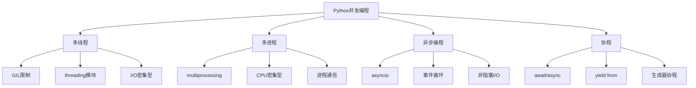

# 3.2 并发与异步编程

## 🎯 核心理念

并发编程是"多任务协调的艺术"。理解异步、多线程、多进程的本质差异，能让我们选择最适合的并发模型，实现高效的并行处理。

### 🧠 并发模型架构



## 🚀 并发模型深入

### 💡 GIL机制与多线程

```python
import threading
import time
import queue
from concurrent.futures import ThreadPoolExecutor, ProcessPoolExecutor
import multiprocessing
import asyncio
import aiohttp
import signal

class ConcurrencyModelDeepDive:
    """并发模型深度探究"""
    
    @staticmethod
    def gil_limitation_demo():
        """GIL限制演示"""
        
        print("🔄 GIL限制演示:")
        
        # CPU密集型任务
        def cpu_intensive_task(n):
            """CPU密集型任务"""
            result = 0
            for i in range(n):
                result += i * i
            return result
        
        def single_thread_cpu(cpu_bound_n):
            """单线程CPU任务"""
            start_time = time.perf_counter()
            results = []
            for _ in range(4):
                result = cpu_intensive_task(cpu_bound_n)
                results.append(result)
            end_time = time.perf_counter()
            print(f"单线程CPU任务耗时: {end_time - start_time:.4f}秒")
            return results
        
        def multi_thread_cpu(cpu_bound_n):
            """多线程CPU任务"""
            start_time = time.perf_counter()
            results = []
            
            def worker():
                result = cpu_intensive_task(cpu_bound_n)
                results.append(result)
            
            threads = []
            for _ in range(4):
                thread = threading.Thread(target=worker)
                threads.append(thread)
                thread.start()
            
            for thread in threads:
                thread.join()
            
            end_time = time.perf_counter()
            print(f"多线程CPU任务耗时: {end_time - start_time:.4f}秒")
            return results
        
        # I/O密集型任务
        def io_intensive_task(delay):
            """I/O密集型任务"""
            time.sleep(delay)
            return f"Completed after {delay}s"
        
        def single_thread_io(io_bound_delay):
            """单线程I/O任务"""
            start_time = time.perf_counter()
            results = []
            for _ in range(4):
                result = io_intensive_task(io_bound_delay)
                results.append(result)
            end_time = time.perf_counter()
            print(f"单线程I/O任务耗时: {end_time - start_time:.4f}秒")
            return results
        
        def multi_thread_io(io_bound_delay):
            """多线程I/O任务"""
            start_time = time.perf_counter()
            results = []
            
            def worker():
                result = io_intensive_task(io_bound_delay)
                results.append(result)
            
            threads = []
            for _ in range(4):
                thread = threading.Thread(target=worker)
                threads.append(thread)
                thread.start()
            
            for thread in threads:
                thread.join()
            
            end_time = time.perf_counter()
            print(f"多线程I/O任务耗时: {end_time - start_time:.4f}秒")
            return results
        
        # 测试
        cpu_n = 1000000
        io_delay = 0.1
        
        single_thread_cpu(cpu_n)
        multi_thread_cpu(cpu_n)
        print()
        
        single_thread_io(io_delay)
        multi_thread_io(io_delay)
    
    @staticmethod
    def thread_synchronization():
        """线程同步"""
        
        print("\n🔒 线程同步演示:")
        
        # 线程安全问题
        shared_counter = 0
        lock = threading.Lock()
        
        def unsafe_increment():
            """不安全的递增"""
            global shared_counter
            for _ in range(1000):
                temp = shared_counter
                temp += 1
                shared_counter = temp
        
        def safe_increment():
            """安全的递增"""
            global shared_counter
            for _ in range(1000):
                with lock:
                    temp = shared_counter
                    temp += 1
                    shared_counter = temp
        
        # 不安全版本
        shared_counter = 0
        threads = []
        for _ in range(5):
            thread = threading.Thread(target=unsafe_increment)
            threads.append(thread)
        
        start_time = time.perf_counter()
        for thread in threads:
            thread.start()
        for thread in threads:
            thread.join()
        unsafe_time = time.perf_counter() - start_time
        print(f"不安全版本结果: {shared_counter} (预期: 5000), 耗时: {unsafe_time:.4f}秒")
        
        # 安全版本
        shared_counter = 0
        threads = []
        for _ in range(5):
            thread = threading.Thread(target=safe_increment)
            threads.append(thread)
        
        start_time = time.perf_counter()
        for thread in threads:
            thread.start()
        for thread in threads:
            thread.join()
        safe_time = time.perf_counter() - start_time
        print(f"安全版本结果: {shared_counter} (正确: 5000), 耗时: {safe_time:.4f}秒")
    
    @staticmethod
    def producer_consumer_pattern():
        """生产者消费者模式"""
        
        print("\n🏭 生产者消费者模式:")
        
        def producer_consumer_queue():
            """使用队列的生产者消费者"""
            
            q = queue.Queue(maxsize=5)
            results = []
            
            def producer():
                for i in range(10):
                    time.sleep(0.1)  # 模拟生产耗时
                    q.put(f"item_{i}")
                    print(f"生产者生产: item_{i}")
                q.put(None)  # 结束信号
            
            def consumer():
                while True:
                    item = q.get()
                    if item is None:
                        q.task_done()
                        break
                    time.sleep(0.15)  # 模拟消费耗时
                    results.append(f"processed_{item}")
                    print(f"消费者处理: {item}")
                    q.task_done()
            
            # 创建线程
            producer_thread = threading.Thread(target=producer)
            consumer_thread = threading.Thread(target=consumer)
            
            # 启动线程
            start_time = time.perf_counter()
            producer_thread.start()
            consumer_thread.start()
            
            # 等待完成
            producer_thread.join()
            consumer_thread.join()
            
            end_time = time.perf_counter()
            print(f"生产者消费者耗时: {end_time - start_time:.4f}秒")
            print(f"处理结果数量: {len(results)}")
        
        producer_consumer_queue()

# ✅ 多进程编程
class MultiprocessingProgramming:
    """多进程编程"""
    
    @staticmethod
    def process_vs_thread():
        """进程vs线程"""
        
        print("\n🚀 多进程对比多线程:")
        
        def cpu_bound_task(n):
            """CPU密集型任务"""
            result = sum(i * i for i in range(n))
            return result
        
        def test_threads(n_threads=4, task_n=1000000):
            """测试多线程"""
            start_time = time.perf_counter()
            
            with ThreadPoolExecutor(max_workers=n_threads) as executor:
                futures = [executor.submit(cpu_bound_task, task_n) for _ in range(n_threads)]
                results = [f.result() for f in futures]
            
            end_time = time.perf_counter()
            print(f"多线程结果: {sum(results)}, 耗时: {end_time - start_time:.4f}秒")
        
        def test_processes(n_processes=4, task_n=1000000):
            """测试多进程"""
            start_time = time.perf_counter()
            
            with ProcessPoolExecutor(max_workers=n_processes) as executor:
                futures = [executor.submit(cpu_bound_task, task_n) for _ in range(n_processes)]
                results = [f.result() for f in futures]
            
            end_time = time.perf_counter()
            print(f"多进程结果: {sum(results)}, 耗时: {end_time - start_time:.4f}秒")
        
        test_threads()
        test_processes()
    
    @staticmethod
    def inter_process_communication():
        """进程间通信"""
        
        print("\n📡 进程间通信:")
        
        def shared_memory_example():
            """共享内存示例"""
            import multiprocessing as mp
            
            def worker_function(value_array, index):
                """工作函数"""
                time.sleep(0.1)  # 模拟计算
                value_array[index] = index ** 2
            
            # 创建共享数组
            shared_array = mp.Array('i', range(10))  # 'i'表示整数类型
            
            print(f"修改前: {list(shared_array)}")
            
            # 创建进程
            processes = []
            for i in range(len(shared_array)):
                p = mp.Process(target=worker_function, args=(shared_array, i))
                processes.append(p)
                p.start()
            
            # 等待所有进程完成
            for p in processes:
                p.join()
            
            print(f"修改后: {list(shared_array)}")
        
        def pipeline_example():
            """管道通信示例"""
            import multiprocessing as mp
            
            def sender(conn, messages):
                """发送者进程"""
                for msg in messages:
                    conn.send(msg)
                    time.sleep(0.1)
                conn.close()
            
            def receiver(conn):
                """接收者进程"""
                received_messages = []
                while True:
                    try:
                        msg = conn.recv()
                        print(f"接收到: {msg}")
                        received_messages.append(msg)
                    except EOFError:
                        break
                conn.close()
                return received_messages
            
            # 创建管道
            parent_conn, child_conn = mp.Pipe()
            
            # 测试数据
            messages = [f"message_{i}" for i in range(5)]
            
            # 创建进程
            sender_process = mp.Process(target=sender, args=(parent_conn, messages))
            receiver_process = mp.Process(target=receiver, args=(child_conn,))
            
            # 启动进程
            sender_process.start()
            receiver_process.start()
            
            # 等待完成
            sender_process.join()
            receiver_process.join()
        
        shared_memory_example()
        pipeline_example()

# ✅ 异步编程
class AsyncProgramming:
    """异步编程"""
    
    @staticmethod
    def asyncio_basics():
        """asyncio基础"""
        
        print("\n⚡ asyncio基础演示:")
        
        async def async_io_task(task_id, delay):
            """异步I/O任务"""
            print(f"任务{task_id}开始")
            await asyncio.sleep(delay)  # 非阻塞等待
            print(f"任务{task_id}完成")
            return f"任务{task_id}结果"
        
        async def concurrent_tasks():
            """并发任务示例"""
            start_time = time.perf_counter()
            
            # 创建多个任务
            tasks = [
                async_io_task(1, 0.2),
                async_io_task(2, 0.3),
                async_io_task(3, 0.1),
                async_io_task(4, 0.4)
            ]
            
            # 并发执行
            results = await asyncio.gather(*tasks)
            
            end_time = time.perf_counter()
            print(f"异步任务总耗时: {end_time - start_time:.4f}秒")
            print(f"任务结果: {results}")
        
        def blocking_vs_non_blocking():
            """阻塞vs非阻塞对比"""
            
            def blocking_example():
                start_time = time.perf_counter()
                results = []
                for i in range(4):
                    result = io_intensive_task(0.2)
                    results.append(result)
                end_time = time.perf_counter()
                print(f"阻塞I/O耗时: {end_time - start_time:.4f}秒")
                return results
            
            async def non_blocking_example():
                start_time = time.perf_counter()
                tasks = [async_io_task(i+1, 0.2) for i in range(4)]
                results = await asyncio.gather(*tasks)
                end_time = time.perf_counter()
                print(f"非阻塞I/O耗时: {end_time - start_time:.4f}秒")
                return results
            
            print("同步阻塞版本:")
            blocking_example()
            
            print("\n异步非阻塞版本:")
            asyncio.run(non_blocking_example())
        
        # 运行异步示例
        asyncio.run(concurrent_tasks())
        blocking_vs_non_blocking()
    
    @staticmethod
    def async_with_real_io():
        """真实I/O的异步处理"""
        
        print("\n🌐 真实I/O异步处理:")
        
        async def fetch_url(session, url):
            """获取URL内容"""
            try:
                async with session.get(url, timeout=5) as response:
                    return await response.text()
            except Exception as e:
                return f"错误: {e}"
        
        async def concurrent_fetches():
            """并发获取多次URL"""
            urls = [
                "https://httpbin.org/delay/1",
                "https://httpbin.org/delay/1", 
                "https://httpbin.org/delay/1",
                "https://httpbin.org/delay/1"
            ]
            
            start_time = time.perf_counter()
            
            async with aiohttp.ClientSession() as session:
                tasks = [fetch_url(session, url) for url in urls]
                results = await asyncio.gather(*tasks, return_exceptions=True)
            
            end_time = time.perf_counter()
            print(f"并发请求耗时: {end_time - start_time:.4f}秒")
            print(f"获取结果数量: {len(results)}")
        
        def sync_fetches():
            """同步请求对比"""
            import requests
            
            urls = [
                "https://httpbin.org/delay/1",
                "https://httpbin.org/delay/1",
                "https://httpbin.org/delay/1", 
                "https://httpbin.org/delay/1"
            ]
            
            start_time = time.perf_counter()
            results = []
            for url in urls:
                try:
                    response = requests.get(url, timeout=5)
                    results.append(response.text)
                except Exception as e:
                    results.append(f"错误: {e}")
            
            end_time = time.perf_counter()
            print(f"同步请求耗时: {end_time - start_time:.4f}秒")
            print(f"获取结果数量: {len(results)}")
        
        print("同步请求:")
        sync_fetches()
        
        print("\n异步请求:")
        asyncio.run(concurrent_fetches())

# ✅ 协程与生成器
class CoroutineAndGenerators:
    """协程与生成器"""
    
    @staticmethod
    def generator_coroutines():
        """生成器协程"""
        
        print("\n🔄 生成器协程演示:")
        
        def simple_generator():
            """简单生成器"""
            for i in range(3):
                yield i
        
        def generator_with_send():
            """支持send的生成器"""
            received = None
            for i in range(3):
                received = yield f"original_{i}"
                print(f"接收到: {received}")
        
        def generator_with_throw():
            """支持throw的生成器"""
            data = yield "start"
            try:
                while True:
                    data = yield f"processing_{data}"
            except GeneratorExit:
                print("生成器正常退出")
            except Exception as e:
                print(f"生成器异常: {e}")
                yield "recovered"
        
        print("简单生成器:")
        gen1 = simple_generator()
        for value in gen1:
            print(f"生成器值: {value}")
        
        print("\n支持send的生成器:")
        gen2 = generator_with_send()
        next(gen2)  # 启动生成器
        try:
            gen2.send("hello")
            gen2.send("world")
            gen2.send("python")
        except StopIteration:
            print("生成器结束")
        
        print("\n支持throw的生成器:")
        gen3 = generator_with_throw()
        next(gen3)
        gen3.send("data1")
        try:
            gen3.throw(ValueError("测试异常"))
        except StopIteration:
            print("生成器最终结束")
    
    @staticmethod
    def async_generator_vs_async_def():
        """异步生成器vs异步函数"""
        
        print("\n⚡ 异步生成器演示:")
        
        async def async_generator_data():
            """异步生成器"""
            for i in range(5):
                await asyncio.sleep(0.1)  # 模拟异步操作
                yield f"async_data_{i}"
        
        async def process_async_generator():
            """处理异步生成器"""
            async for data in async_generator_data():
                print(f"处理: {data}")
        
        def stream_processing_example():
            """流处理示例"""
            
            async def data_stream_processor():
                """数据流处理器"""
                async def read_data():
                    for i in range(10):
                        await asyncio.sleep(0.05)  # 模拟读取延迟
                        yield {"id": i, "value": i * 2}
                
                async def process_data(data_stream):
                    """数据处理"""
                    async for item in data_stream:
                        # 模拟处理延迟
                        await asyncio.sleep(0.1)
                        processed_item = {
                            **item,
                            "processed": True,
                            "result_value": item["value"] ** 2
                        }
                        yield processed_item
            
            async def stream_pipeline():
                """流处理管道"""
                processor = data_stream_processor()
                
                async def read_data():
                    for i in range(5):
                        await asyncio.sleep(0.05)
                        yield {"id": i, "value": i * 3}
                
                async def stream_processor(slow_stream):
                    async for item in slow_stream:
                        await asyncio.sleep(0.1)
                        item["processed"] = True
                        yield item
                
                print("流处理管道:")
                pipeline_processor = stream_processor(read_data())
                
                count = 0
                async for processed_item in pipeline_processor:
                    print(f"处理结果: {processed_item}")
                    count += 1
                    if count >= 3:  # 限制输出
                        break
            
            asyncio.run(stream_pipeline())

# 运行所有并发编程示例
ConcurrencyModelDeepDive.gil_limitation_demo()
ConcurrencyModelDeepDive.thread_synchronization()
ConcurrencyModelDeepDive.producer_consumer_pattern()
MultiprocessingProgramming.process_vs_thread()
MultiprocessingProgramming.inter_process_communication()
AsyncProgramming.asyncio_basics()
# AsyncProgramming.async_with_real_io()  # 需要网络连接
CoroutineAndGenerators.generator_coroutines()
CoroutineAndGenerators.async_generator_vs_async_def()

## 🧪 并发编程实践

### 📝 练习1：并发Web爬虫

**任务**：实现一个并发爬虫

```python
# ✅ 并发Web爬虫
import asyncio
import aiohttp
from bs4 import BeautifulSoup

class ConcurrentWebCrawler:
    """并发Web爬虫"""
    
    def __init__(self, max_concurrent=10):
        self.semaphore = asyncio.Semaphore(max_concurrent)
        self.session = None
    
    async def fetch_page(self, url):
        """获取单个页面"""
        async with self.semaphore:
            try:
                async with self.session.get(url, timeout=10) as response:
                    if response.status == 200:
                        html = await response.text()
                        return {"url": url, "content": html, "status": 200}
                    else:
                        return {"url": url, "content": None, "status": response.status}
            except Exception as e:
                return {"url": url, "error": str(e)}
    
    async def crawl_pages(self, urls):
        """爬取多个页面"""
        async with aiohttp.ClientSession() as session:
            self.session = session
            
            tasks = [self.fetch_page(url) for url in urls]
            results = await asyncio.gather(*tasks, return_exceptions=True)
            
            return results

# 使用示例
async def test_crawler():
    """测试爬虫"""
    urls = [
        "https://httpbin.org/html",
        "https://httpbin.org/json",
        "https://httpbin.org/delay/1"
    ] * 3  # 重复3次增加并发数
    
    crawler = ConcurrentWebCrawler(max_concurrent=5)
    results = await crawler.crawl_pages(urls)
    
    successful_results = [r for r in results if isinstance(r, dict) and r.get("status") == 200]
    print(f"成功爬取: {len(successful_results)}/{len(results)}")
```

### 🎯 练习2：实时数据处理管道

**任务**：实现异步数据处理管道

```python
# ✅ 实时数据处理管道
import asyncio
import json
from datetime import datetime

class AsyncDataPipeline:
    """异步数据处理管道"""
    
    def __init__(self):
        self.data_queue = asyncio.Queue(maxsize=100)
        self.processors = []
    
    async def data_producer(self):
        """数据生产者"""
        import random
        
        for i in range(50):
            data = {
                "id": i,
                "timestamp": datetime.now().isoformat(),
                "value": random.randint(1, 100),
                "category": random.choice(["A", "B", "C"])
            }
            
            await self.data_queue.put(data)
            await asyncio.sleep(0.1)  # 模拟生产延迟
        
        # 发送结束信号
        await self.data_queue.put(None)
    
    async def data_processor(self, processor_id):
        """数据处理器"""
        processed_count = 0
        
        while True:
            data = await self.data_queue.get()
            
            if data is None:
                # 传播结束信号
                await self.data_queue.put(None)
                break
            
            # 模拟处理过程
            await asyncio.sleep(0.05)
            
            processed_data = {
                **data,
                "processed_by": processor_id,
                "processed_at": datetime.now().isoformat(),
                "doubled_value": data["value"] * 2
            }
            
            processed_count += 1
            if processed_count % 10 == 0:
                print(f"处理器{processor_id}已处理{processed_count}条数据")
        
        print(f"处理器{processor_id}结束，共处理{processed_count}条数据")
    
    async def run_pipeline(self, num_processors=3):
        """运行数据处理管道"""
        print(f"启动数据处理管道，使用{num_processors}个处理器")
        
        start_time = asyncio.get_event_loop().time()
        
        # 创建任务
        tasks = [self.data_producer()]
        for i in range(num_processors):
            tasks.append(self.data_processor(i))
        
        # 运行所有任务
        await asyncio.gather(*tasks)
        
        end_time = asyncio.get_event_loop().time()
        print(f"数据处理管道完成，总耗时: {end_time - start_time:.2f}秒")

# 运行管道
pipeline = AsyncDataPipeline()
asyncio.run(pipeline.run_pipeline())
```

## 🔗 知识连接

- **内存管理**：[[3.1 内存管理]] - 并发环境下的内存问题
- **函数编程**：[[2.8 函数设计原则]] - 异步编程中的函数设计
- **错误处理**：[[3.3 错误处理]] - 并发环境下的异常处理

## 💡 费曼检验

**解释：什么是GIL？为什么Python需要GIL？在什么情况下多线程性能不如单线程？**

核心要点：
1. **GIL作用**：全局解释器锁，确保同一时刻只有一个线程执行Python字节码
2. **设计原因**：保护CPython内部数据结构，简化内存管理
3. **性能影响**：对CPU密集型任务没有帮助，但对I/O密集型任务有效
4. **解决方案**：多进程、异步编程、C扩展

---

🎯 **下个目标**：学习[[3.2.1 GIL机制与多线程]]中的GIL深度分析
