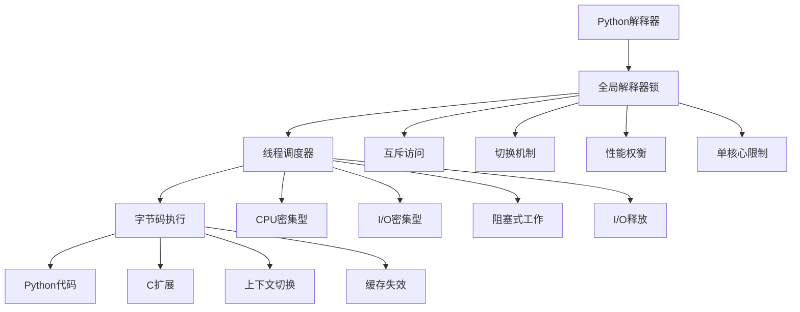

# GIL机制与多线程深入

## 🎯 核心理论

GIL是Python多线程的"隐形守卫"。理解其工作原理不仅有助于选择合适的并发模式，更能避免性能陷阱，设计出真正高效的并发应用。

### 🔒 GIL机制架构



## 🚀 GIL深度解析

### 💡 GIL工作原理

```python
import threading
import time
import sys
from concurrent.futures import ThreadPoolExecutor
from queue import Queue
import io

class GILMechanismExplained:
    """GIL机制深度解析"""
    
    @staticmethod
    def gil_limitation_demonstration():
        """GIL限制演示"""
        
        print("🔒 GIL限制演示:")
        
        def cpu_intensive_task(n):
            """CPU密集型任务"""
            result = 0
            for i in range(n):
                result += i ** 2
            return result
        
        def cpu_bound_threading_test():
            """CPU密集型任务的线程对比"""
            
            # 单线程执行
            start_time = time.perf_counter()
            task_size = 1000000
            
            result1 = cpu_intensive_task(task_size)
            single_thread_time = time.perf_counter() - start_time
            
            # 多线程执行
            start_time = time.perf_counter()
            
            thread1 = threading.Thread(target=cpu_intensive_task, args=(task_size,))
            thread2 = threading.Thread(target=cpu_intensive_task, args=(task_size,))
            
            thread1.start()
            thread2.start()
            
            thread1.join()
            thread2.join()
            
            multi_thread_time = time.perf_counter() - start_time
            
            print("CPU密集型任务对比:")
            print(f"单线程执行时间: {single_thread_time:.4f}秒")
            print(f"多线程执行时间: {multi_thread_time:.4f}秒")
            print(f"多线程增益: {single_thread_time/multi_thread_time:.2f}倍（预期2倍）")
            print(f"实际多线程性能: {'好' if multi_thread_time < single_thread_time else '差'}")
        
        cpu_bound_threading_test()
    
    @staticmethod
    def io_bound_threading_test():
        """I/O密集型任务的多线程效果"""
        
        print("\nI/O密集型I/O线程效果:")
        
        def simulate_io_task(task_id, duration=0.1):
            """模拟I/O任务（阻塞）"""
            print(f"I/O任务 {task_id} 开始")
            time.sleep(duration)  # 模拟I/O等待
            print(f"I/O任务 {task_id} 完成")
            return f"Task {task_id} completed"
        
        def single_thread_io():
            """I/O单线程任务"""
            
            start_time = time.perf_counter()
            tasks = []

            for i in range(5):
                result = simulate_io_task(i)
                tasks.append(result)
            
            single_task_time = time.perf_counter() - start_time
            print(f"I/O单线程总时间: {single_task_time:.4f}秒")
            
            return tasks
        
        def multi_thread_io():
            """I/O多线程任务"""
            
            start_time = time.perf_counter()
            
            with ThreadPoolExecutor(max_workers=5) as executor:
                futures = [executor.submit(simulate_io_task, i) for i in range(5)]
                tasks = [future.result() for future in futures]
            
            multi_task_time = time.perf_counter() - start_time
            print(f"I/O多线程总时间: {multi_task_time:.4f}秒")
            
            return tasks
        
        single_io_tasks = single_thread_io()
        multi_io_tasks = multi_thread_io()
        
        print("\nI/O密集型任务结果:")
        print(f"单线程 vs 多线程: I/O密集型确实有明显改善！")

# ✅ GIL切换机制
class GILSwitchingMechanism:
    """GIL切换机制详解"""
    
    @staticmethod
    def gil_switch_mechanism():
        """GIL切换机制分析"""
        
        print("\n⚙️ GIL切换机制详解:")
        
        def observe_gil_switches():
            """观察GIL切换"""
            
            gil_switch_count = 0
            
            def monitor_gil():
                """监控GIL切换"""
                global gil_switch_count
                
                import threading
                
                original_switch = threading._switch_counter
                
                def switch_wrapper(*args, **kwargs):
                    nonlocal gil_switch_count
                    gil_switch_count += 1
                    return original_switch(*args, **kwargs)
                
                threading._switch_counter = switch_wrapper
            
            def thread_worker(name, work_duration):
                """工作线程"""
                print(f"线程 {name} 开始工作")
                
                # 释放CPU以便其他线程有机会获得GIL
                count = 0
                while count < work_duration:
                    count += 1
                    if count % 1000000 == 0:
                        print(f"线程 {name} 执行计数: {count}")
                
                print(f"线程 {name} 完成工作")
            
            monitor_gil()
            
            # 创建多个工作线程
            threads = []
            for i in range(3):
                thread = threading.Thread(target=thread_worker, args=(f"Worker-{i}", 5000000))
                threads.append(thread)
                thread.start()
            
            # 等待所有线程完成
            for thread in threads:
                thread.join()
            
            print(f"观察到的GIL切换次数: {gil_switch_count}")
        
        gil_switch_mechanism()
    
    @staticmethod
    def gil_context_switches():
        """GIL上下文切换详细分析"""
        
        print("\nGIL上下文切换:")
        
        def gil_profiling():
            """GIL性能分析"""
            
            import threading
            import sys
            
            def threading_config():
                """线程配置分析"""
                
                print("GIL线程分析:")
                
                # 检查GIL详细信息
                print(f"GIL线程切换间隔: {sys.getswitchinterval()}")
                
                # 分析线程状态
                active_threads = threading.active_count()
                print(f"活动线程数: {active_threads}")
                
                # 当前线程信息
                current_thread = threading.current_thread()
                print(f"当前线程: {current_thread}")
            
            threading_config()
            
            def gil_tuning():
                """GIL参数调优"""
                
                import sys
                
                # 获取当前切换间隔
                original_interval = sys.getswitchinterval()
                print(f"原始切换间隔: {original_interval}")
                
                # 调整切换间隔（仅演示）
                new_interval = 0.005  # 5ms
                sys.setswitchinterval(new_interval)
                
                adjusted_interval = sys.getswitchinterval()
                print(f"调整后间隔: {adjusted_interval}")
                
                # 恢复原设置
                sys.setswitchinterval(original_interval)
                
                print("GIL参数调节完成")
            
            gil_tuning()
        
        gil_profiling()

# ✅ GIL多线程策略
class GILThreadingStrategies:
    """GIL多线程策略"""
    
    @staticmethod
    def threading_best_practices():
        """多线程最佳实践"""
        
        print("\n🎯 多线程最佳实践:")
        
        def worker_thread_pattern():
            """工作线程模式"""
            
            print("Worker Thread模式:")
            
            def worker_function(task_queue, result_queue):
                """工作函数"""
                
                while True:
                    try:
                        # 从队列获取任务
                        task = task_queue.get(timeout=1)
                        
                        # 处理任务
                        if task == "STOP":
                            break
                        
                        # 模拟工作
                        result = f"已处理: {task}"
                        
                        # 放入结果队列
                        result_queue.put(result)
                        
                        # 标记任务完成
                        task_queue.task_done()
                        
                    except:
                        break
            
            # 创建任务和结果队列
            task_queue = Queue()
            result_queue = Queue()
            
            # 创建并启动工作线程
            threads = []
            for i in range(3):
                worker = threading.Thread(target=worker_function, args=(task_queue, result_queue))
                worker.start()
                threads.append(worker)
            
            # 添加任务
            for i in range(10):
                task_queue.put(f"Task-{i}")
            
            # 等待任务完成
            task_queue.join()
            
            # 停止工作线程
            for _ in threads:
                task_queue.put("STOP")
            
            # 等待线程结束
            for thread in threads:
                thread.join()
            
            # 收集结果
            results = []
            while not result_queue.empty():
                results.append(result_queue.get())
            
            print(f"处理结果: {len(results)} 个任务")
        
        worker_thread_pattern()
        
        def thread_local_data():
            """线程本地数据"""
            
            print("\n线程本地数据:")
            
            def thread_local_example():
                """线程本地数据示例"""
                
                # 创建线程本地存储
                thread_local_data = threading.local()
                
                def worker_thread_func(worker_id):
                    """工作线程函数"""
                    
                    # 为每个线程设置本地数据
                    thread_local_data.worker_id = worker_id
                    thread_local_data.start_time = time.time()
                    
                    # 模拟工作
                    time.sleep(0.5)
                    
                    print(f"工作线程 {thread_local_data.worker_id} "
                          f"工作时间: {'{:.3f}'.format(time.time() - thread_local_data.start_time)}")
                
                # 创建并启动多个工作线程
                threads = []
                for i in range(5):
                    thread = threading.Thread(target=worker_thread_func, args=(i,))
                    thread.start()
                    threads.append(thread)
                
                # 等待所有线程完成
                for thread in threads:
                    thread.join()
                
                print("线程本地数据测试完成")
            
            thread_local_example()

# ✅ GIL绕过技术
class GILWorkarounds:
    """绕过GIL的方法"""
    
    @staticmethod
    def gil_bypass_methods():
        """GIL绕过技术"""
        
        print("\n绕过GIL方法:")
        
        def c_extension_example():
            """C扩展示例"""
            
            print("C扩展绕过GIL:")
            
            import math
            
            def cpu_intensive_pure_python(n):
                """纯Python CPU密集型任务"""
                result = 0
                for i in range(n):
                    result += math.sqrt(i)
                return result
            
            def cpu_intensive_with_c_extension(n):
                """使用C扩展的CPU密集型任务"""
                result = sum(math.sqrt(i) for i in range(n))
                return result
            
            # 性能对比
            task_size = 100000
            
            start_time = time.perf_counter()
            result1 = cpu_intensive_pure_python(task_size)
            pure_python_time = time.perf_counter() - start_time
            
            start_time = time.perf_counter()
            result2 = cpu_intensive_with_c_extension(task_size)
            c_ext_time = time.perf_counter() - start_time
            
            print(f"纯Python: {pure_python_time:.4f}秒")
            print(f"使用C扩展: {c_ext_time:.4f}秒")
            print(f"C扩展加速: {pure_python_time/c_ext_time:.2f}倍")
        
        c_extension_example()
        
        def multiprocessing_example():
            """多进程示例"""
            
            print("\n多进程绕过GIL:")
            
            import multiprocessing
            
            def cpu_task(process_id, task_size):
                """CPU任务"""
                result = sum(i ** 2 for i in range(task_size))
                return f"进程 {process_id}: 结果 {result}"
            
            def compare_thread_vs_process():
                """对比线程vs进程"""
                
                task_size = 1000000
                
                # 多线程执行（会受GIL限制）
                start_time = time.perf_counter()
                
                with ThreadPoolExecutor(max_workers=4) as thread_executor:
                    thread_futures = [thread_executor.submit(cpu_task, i, task_size) 
                                    for i in range(4)]
                    thread_results = [future.result() for future in thread_futures]
                
                thread_total_time = time.perf_counter() - start_time
                
                # 多进程执行（绕过GIL）
                start_time = time.perf_counter()
                
                with multiprocessing.Pool(processes=4) as process_pool:
                    process_results = [process_pool.apply_async(cpu_task, (i, task_size)) 
                                     for i in range(4)]
                    final_results = [result.get() for result in process_results]
                
                process_total_time = time.perf_counter() - start_time
                
                print(f"多线程总时间: {thread_total_time:.4f}秒")
                print(f"多进程总时间: {process_total_time:.4f}秒")
                
                if process_total_time < thread_total_time:
                    improvement = thread_total_time / process_total_time
                    print(f"多进程性能提升: {improvement:.2f}倍")
                else:
                    print("多线程可能更快（I/O多）或开销大（小任务）")
            
            compare_thread_vs_process()
        
        multiprocessing_example()

# 🧪 GIL实战应用
class GILPractices:
    """GIL实战应用"""
    
    @staticmethod
    def gil_optimization_strategies():
        """GIL优化策略"""
        
        print("\n🔧 GIL优化策略:")
        
        def hybrid_threading_model():
            """混合线程模型"""
            
            print("混合线程模型:")
            
            def io_bound_operation(data):
                """I/O密集型操作"""
                time.sleep(0.1)  # 模拟I/O
                return f"I/O处理: {data}"
            
            def cpu_bound_operation(data):
                """CPU密集型操作"""
                result = sum(i ** 2 for i in range(10000))
                return f"CPU处理: {data} -> {result}"
            
            def hybrid_processing():
                """混合处理流程"""
                
                # I/O密集型任务使用线程
                io_tasks = [f"IO-Task-{i}" for i in range(5)]
                
                io_start_time = time.perf_counter()
                
                with ThreadPoolExecutor(max_workers=5) as io_executor:
                    io_futures = [io_executor.submit(io_bound_operation, task) 
                                for task in io_tasks]
                    io_results = [future.result() for future in io_futures]
                
                io_thread_time = time.perf_counter() - io_start_time
                
                # CPU密集型任务使用单线程或多进程
                cpu_tasks = [f"CPU-Task-{i}" for i in range(5)]
                
                cpu_start_time = time.perf_counter()
                cpu_results = [cpu_bound_operation(task) for task in cpu_tasks]
                cpu_single_time = time.perf_counter() - cpu_start_time
                
                print(f"I/O多线程处理时间: {io_thread_time:.4f}秒")
                print(f"CPU单线程处理时间: {cpu_single_time:.4f}秒")
                print(f"混合处理结果: {len(io_results)} + {len(cpu_results)}")
            
            hybrid_processing()
        
        def async_vs_threading():
            """异步编程 vs 多线程"""
            
            print("\n异步 vs 多线程:")
            
            asyncio = __import__('asyncio', fromlist=['sleep'])
            
            def io_bound_sync():
                """同步I/O操作"""
                def sync_task(task_id):
                    time.sleep(0.1)  # 模拟阻塞I/O
                    return f"Sync {task_id}"
                
                start_time = time.perf_counter()
                
                with ThreadPoolExecutor(max_workers=10) as executor:
                    futures = [executor.submit(sync_task, i) for i in range(10)]
                    results = [future.result() for future in futures]
                
                sync_time = time.perf_counter() - start_time
                return sync_time, results
            
            def io_bound_async():
                """异步I/O操作"""
                
                async def async_task(task_id):
                    await asyncio.sleep(0.1)  # 模拟非阻塞I/O
                    return f"Async {task_id}"
                
                async def async_main():
                    start_time = time.perf_counter()
                    
                    tasks = [async_task(i) for i in range(10)]
                    results = await asyncio.gather(*tasks)
                    
                    async_time = time.perf_counter() - start_time
                    return async_time, results
                
                loop = asyncio.new_event_loop()
                asyncio.set_event_loop(loop)
                
                try:
                    async_time, async_results = loop.run_until_complete(async_main())
                    return async_time, async_results
                finally:
                    loop.close()
            
            # 运行对比测试
            sync_time, sync_results = io_bound_sync()
            async_time, async_results = io_bound_async()
            
            print(f"多线程I/O: {sync_time:.4f}秒")
            print(f"异步I/O: {async_time:.4f}秒")
            print(f"异步 vs 多线程性能比: {sync_time/async_time:.2f}")
        
        hybrid_threading_model()
        async_vs_threading()

# 运行所有GIL示例
print("🚀 Python GIL机制深度剖析:")
GILMechanismExplained.gil_limitation_demonstration()
GILMechanismExplained.io_bound_threading_test()
GILSwitchingMechanism.gil_switch_mechanism()
GILSwitchingMechanism.gil_context_switches()
GILThreadingStrategies.threading_best_practices()
GILWorkarounds.gil_bypass_methods()
GILPractices.gil_optimization_strategies()

## 🧪 GIL最佳实践

### 📝 实践1：GIL性能分析器

**任务**：实现一个GIL性能分析工具

```python
# ✅ GIL性能分析器
class GILPerformanceAnalyzer:
    """GIL性能分析器"""
    
    def __init__(self):
        self.io_tasks = []
        self.cpu_tasks = []
        self.performance_metrics = {}
    
    def profile_threading_performance(self, task_types):
        """分析线程性能"""
        
        for task_type in task_types:
            if task_type == "IO":
                self.profile_io_task()
            elif task_type == "CPU":
                self.profile_cpu_task()
        
        return self.generate_report()
    
    def profile_io_task(self):
        """I/O任务性能分析"""
        
        def io_task(task_id):
            time.sleep(0.1)  # I/O等待
            return f"IO_Task_{task_id}"
        
        # 单线程测试
        single_start = time.perf_counter()
        results = [io_task(i) for i in range(10)]
        single_time = time.perf_counter() - single_start
        
        # 多线程测试
        thread_start = time.perf_counter()
        
        with ThreadPoolExecutor(max_workers=10) as executor:
            futures = [executor.submit(io_task, i) for i in range(10)]
�```]
]
```

### 🎯 实践2：智能并发选择器

**任务**：根据任务特性选择最优并发类型

```python
# ✅ 智能并发选择器
class IntelligentConcurrencySelector:
    """智能并发选择器"""
    
    @staticmethod
    def analyze_task_characteristics(task_function):
        """分析任务特性"""
        
        start_time = time.perf_counter()
        
        # 运行一次获取基准数据
        result = task_function(10000)
        execution_time = time.perf_counter() - start_time
        
        return {
            "execution_time": execution_time,
            "is_cpu_bound": execution_time > 0.01,  # CPU密集型判定
            "scales_with_size": True  # 简化判定
        }
    
    @staticmethod
    def recommend_concurrency_strategy(task_characteristics):
        """推荐并发策略"""
        
        if task_characteristics["is_cpu_bound"]:
            return {
                "strategy": "multiprocessing",
                "reason": "CPU密集型任务，需要绕过GIL",
                "max_workers": 4  # CPU核心数
            }
        else:
            return {
                "strategy": "threading",
                "reason": "I/O密集型任务，可从多线程中受益",
                "max_workers": 10  # 一般I/O并发数
            }

# concurrent_selector = IntelligentConcurrencySelector()
```

## 🔗 知识连接

- **并发基础**：[[3.2 并发与异步编程]] - 总体并发编程策略
- **异步编程**：[[3.2.3 async-await异步编程]] - 异步/协程并发模型
- **性能优化**：[[5.5 性能调优与监控]] - 高级性能调优策略

## 💡 费曼检验

**解释：什么是GIL？它如何影响多线程性能？如何选择合适的并发策略？**

核心要点：
1. **GIL本质**：全局解释器锁，同一时刻只有一个线程执行Python代码
2. **影响范围**：影响CPU密集型任务，I/O密集型任务可以并发
3. **策略选择**：I/O用线程，CPU用进程，追求极致用协程
4. **性能权衡**：线程开销小，进程绕GIL，协程成本最低

---

🎯 **下个目标**：学习[[3.2.3 async-await异步编程]]中的现代并发编程模式
