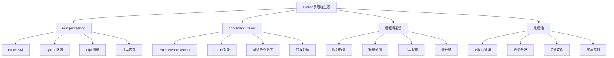

# 3.2.2 多进程编程实践

## 🎯 核心理念

多进程编程是Python突破GIL限制的"终极武器"。通过进程间并行，我们可以实现真正的并发，充分利用多核CPU资源。这是高性能Python应用的关键技术。

### 🚀 多进程技术架构



## 🚀 多进程核心技术

### 💡 基础多进程编程

```python
import multiprocessing as mp
from concurrent.futures import ProcessPoolExecutor, as_completed
import time
import os
import signal
import queue
from typing import Any, List, Dict, Callable, Optional
import numpy as np
import psutil
from dataclasses import dataclass
import pickle
import threading

class MultiProcessingMastery:
    """多进程编程精通技术"""
    
    @staticmethod
    def basic_process_management():
        """基础进程管理"""
        
        print("🔄 基础进程管理:")
        
        # ✅ 简单进程创建
        def worker_process(name, duration=2):
            """工作进程函数"""
            pid = os.getpid()
            print(f"[{pid}] 工作进程 {name} 开始执行")
            
            # 模拟工作
            for i in range(duration):
                print(f"[{pid}] 工作进程 {name}: 步骤 {i+1}/{duration}")
                time.sleep(1)
            
            print(f"[{pid}] 工作进程 {name} 执行完成")
            return f"工作进程 {name} 的结果"
        
        # ✅ 进程创建和等待
        def create_and_wait_processes():
            """创建和等待进程"""
            
            processes = []
            
            # 创建多个进程
            for i in range(3):
                p = mp.Process(target=worker_process, args=(f"Worker{i}", 3))
                processes.append(p)
            
            # 启动所有进程
            start_time = time.time()
            print("启动所有进程...")
            for p in processes:
                p.start()
            
            # 等待所有进程完成
            print("等待所有进程完成...")
            for p in processes:
                p.join()
            
            end_time = time.time()
            
            print(f"所有进程完成，总耗时: {end_time - start_time:.2f}秒")
            
            # 检查进程状态
            for i, p in enumerate(processes):
                print(f"进程{i}: 存活={p.is_alive()}, 退出码={p.exitcode}")
        
        # ✅ 进程间数据传递
        def process_data_exchange():
            """进程间数据交换"""
            
            # Queue: 进程间队列通信
            def producer(queue):
                """生产者进程"""
                for i in range(5):
                    queue.put(f"消息_{i}_{time.time()}")
                    print(f"[生产者] 发送消息_{i}")
                    time.sleep(0.5)
                
                # 发送结束信号
                queue.put(None)
            
            def consumer(queue):
                """消费者进程"""
                while True:
                    message = queue.get()
                    if message is None:
                        break
                    print(f"[消费者] 接收: {message}")
                    time.sleep(0.3)
                
                print("[消费者] 结束")
            
            # 创建进程间队列
            mp_queue = mp.Queue()
            
            producer_proc = mp.Process(target=producer, args=(mp_queue,))
            consumer_proc = mp.Process(target=consumer, args=(mp_queue,))
            
            # 启动进程
            producer_proc.start()
            consumer_proc.start()
            
            # 等待完成
            producer_proc.join()
            consumer_proc.join()
        
        # ✅ Pipe管道通信
        def pipe_communication():
            """管道通信示例"""
            
            def writer(conn):
                """写入进程"""
                for i in range(5):
                    data = {"id": i, "data": f"管道消息_{i}", "timestamp": time.time()}
                    conn.send(data)
                    print(f"[写入] 发送: {data}")
                    time.sleep(0.5)
                
                conn.send(None)  # 结束信号
                conn.close()
            
            def reader(conn):
                """读取进程"""
                while True:
                    data = conn.recv()
                    if data is None:
                        break
                    print(f"[读取] 接收: {data}")
                    time.sleep(0.3)
                
                conn.close()
                print("[读取] 结束")
            
            # 创建管道(双向)
            parent_conn, child_conn = mp.Pipe(duplex=True)
            
            writer_proc = mp.Process(target=writer, args=(parent_conn,))
            reader_proc = mp.Process(target=reader, args=(child_conn,))
            
            writer_proc.start()
            reader_proc.start()
            
            writer_proc.join()
            reader_proc.join()
        
        # 运行基础示例
        create_and_wait_processes()
        print("\n" + "="*60)
        process_data_exchange()
        print("\n" + "="*60)
        pipe_communication()
    
    @staticmethod
    def advanced_process_patterns():
        """高级进程模式"""
        
        print("\n🎯 高级进程模式:")
        
        # ✅ 进程池模式
        def process_pool_examples():
            """进程池示例"""
            
            def cpu_intensive_task(n):
                """CPU密集型任务"""
                start = time.time()
                
                # 模拟大计算量
                result = sum(i * i for i in range(n))
                
                duration = time.time() - start
                pid = os.getpid()
                
                return {
                    'task_id': n,
                    'result': result,
                    'duration': duration,
                    'pid': pid
                }
            
            # 使用ProcessPoolExecutor
            def use_process_pool_executor():
                """使用进程池执行器"""
                
                tasks = [100000, 150000, 200000, 100000, 250000]
                
                print("使用ProcessPoolExecutor:")
                start_time = time.time()
                
                # 创建进程池
                with ProcessPoolExecutor(max_workers=4) as executor:
                    # 提交任务
                    future_to_task = {executor.submit(cpu_intensive_task, n): n for n in tasks}
                    
                    # 收集结果
                    results = []
                    for future in as_completed(future_to_task):
                        task_id = future_to_task[future]
                        try:
                            result = future.result()
                            results.append(result)
                            print(f"任务 {task_id} 完成: PID={result['pid']}, 耗时={result['duration']:.2f}s")
                        except Exception as e:
                            print(f"任务 {task_id} 异常: {e}")
                
                total_time = time.time() - start_time
                print(f"进程池总耗时: {total_time:.2f}秒")
                
                # 计算加速比
                sequential_time = sum(result['duration'] for result in results)
                speedup = sequential_time / total_time
                print(f"理论加速比: {speedup:.1f}倍")
            
            # 对比：顺序执行 vs 进程池
            def compare_execution_methods():
                """对比执行方法"""
                
                tasks = [50000, 75000, 100000, 50000]
                
                print("\n📊 性能对比:")
                
                # 顺序执行
                print("顺序执行:")
                sequential_start = time.time()
                sequential_results = [cpu_intensive_task(n) for n in tasks]
                sequential_time = time.time() - sequential_start
                
                total_cpu_time = sum(r['duration'] for r in sequential_results)
                print(f"顺序执行: {sequential_time:.2f}秒 (CPU时间: {total_cpu_time:.2f}秒)")
                
                # 进程池执行
                print("进程池执行:")
                pool_start = time.time()
                
                with ProcessPoolExecutor(max_workers=4) as executor:
                    pool_results = list(executor.map(cpu_intensive_task, tasks))
                
                pool_time = time.time() - pool_start
                print(f"进程池执行: {pool_time:.2f}秒")
                
                # 计算效率
                speedup = total_cpu_time / pool_time
                efficiency = speedup / min(4, len(tasks))
                
                print(f"加速比: {speedup:.1f}倍")
                print(f"效率: {efficiency:.1%}")
            
            use_process_pool_executor()
            compare_execution_methods()
        
        # ✅ 生产者-消费者模式
        def producer_consumer_pattern():
            """生产者-消费者模式"""
            
            @dataclass
            class Task:
                """任务数据结构"""
                id: int
                data: str
                priority: int = 1
                
                def __lt__(self, other):
                    return self.priority < other.priority
            
            # 优先级队列版本
            def producer_with_priority(queue_, num_tasks):
                """生产者(支持优先级)"""
                import heapq
                
                for i in range(num_tasks):
                    priority = i % 3 + 1  # 优先级1-3
                    task = Task(id=i, data=f"任务数据_{i}", priority=priority)
                    
                    queue_.put(task)
                    print(f"[生产者] 创建任务 {i}, 优先级 {priority}")
                    time.sleep(0.1)
                
                # 发送结束信号
                queue_.put(None)
            
            def consumer_with_priority(queue_, consumer_id):
                """消费者"""
                processed_count = 0
                
                while True:
                    try:
                        task = queue_.get(timeout=5)
                        if task is None:
                            break
                        
                        print(f"[消费者{consumer_id}] 处理任务 {task.id}, 优先级 {task.priority}")
                        
                        # 模拟处理时间
                        processing_time = task.priority * 0.2
                        time.sleep(processing_time)
                        
                        processed_count += 1
                        print(f"[消费者{consumer_id}] 完成任务 {task.id}")
                        
                    except queue.Empty:
                        print(f"[消费者{consumer_id}] 超时，可能生产者已结束")
                        break
                
                print(f"[消费者{consumer_id}] 处理完成，共处理 {processed_count} 个任务")
        
            # 多生产者-多消费者
            def multi_producer_multi_consumer():
                """多生产者-多消费者"""
                
                # 创建进程间等待队列
                task_queue = mp.Queue()
                
                # 启动多个生产者
                producers = []
                for i in range(2):
                    p = mp.Process(target=producer_with_priority, args=(task_queue, 5))
                    producers.append(p)
                    p.start()
                
                # 启动多个消费者
                consumers = []
                for i in range(3):
                    c = mp.Process(target=consumer_with_priority, args=(task_queue, i))
                    consumers.append(c)
                    c.start()
                
                # 等待生产者完成
                for p in producers:
                    p.join()
                
                # 发送结束信号给所有消费者
                for _ in consumers:
                    task_queue.put(None)
                
                # 等待消费者完成
                for c in consumers:
                    c.join()
                
                print("多生产者-多消费者完成")
            
            multi_producer_multi_consumer()
        
        # ✅ 共享内存模式
        def shared_memory_pattern():
            """共享内存模式"""
            
            # 使用Array共享内存
            def worker_with_shared_array(arr, start_idx, end_idx):
                """使用共享数组的工作进程"""
                pid = os.getpid()
                print(f"[{pid}] 进程处理索引 {start_idx}-{end_idx}")
                
                for i in range(start_idx, min(end_idx, len(arr))):
                    # 模拟数据处理
                    arr[i] = arr[i] * 2 + i
                    time.sleep(0.01)  # 小延迟
                
                print(f"[{pid}] 进程处理完成")
            
            def shared_array_example():
                """共享数组示例"""
                
                # 创建共享数组
                shared_arr = mp.Array('i', range(100))
                
                print(f"原始数组前10个元素: {list(shared_arr[:10])}")
                
                # 创建多个进程处理不同部分
                processes = []
                chunk_size = len(shared_arr) // 4
                
                for i in range(4):
                    start = i * chunk_size
                    end = start + chunk_size if i < 3 else len(shared_arr)
                    
                    p = mp.Process(target=worker_with_shared_array, 
                                 args=(shared_arr, start, end))
                    processes.append(p)
                    p.start()
                
                # 等待完成
                for p in processes:
                    p.join()
                
                print(f"处理后数组前10个元素: {list(shared_arr[:10])}")
            
            # 使用Value共享单个值
            def shared_counter_example():
                """共享计数器示例"""
                
                def counter_worker(val, increment_count):
                    """计数器工作进程"""
                    for _ in range(increment_count):
                        val.value += 1
                        time.sleep(0.01)
                
                # 创建共享计数器
                shared_counter = mp.Value('i', 0)
                
                # 创建多个进程增加计数器
                processes = []
                for _ in range(5):
                    p = mp.Process(target=counter_worker, args=(shared_counter, 10))
                    processes.append(p)
                    p.start()
                
                # 等待完成
                for p in processes:
                    p.join()
                
                print(f"最终计数器值: {shared_counter.value}")
            
            shared_array_example()
            print("\n" + "="*40)
            shared_counter_example()
        
        # 运行高级模式示例
        process_pool_examples()
        print("\n" + "="*80)
        producer_consumer_pattern()
        print("\n" + "="*80)
        shared_memory_pattern()

# ✅ 进程间同步
class ProcessSynchronization:
    """进程间同步技术"""
    
    @staticmethod
    def synchronization_primitives():
        """同步原语"""
        
        print("\n🔒 进程间同步:")
        
        # ✅ 锁机制
        def shared_resource_with_lock():
            """共享资源锁示例"""
            
            # 共享资源
            shared_data = mp.Array('i', [0, 0, 0])  # 共享数组
            lock = mp.Lock()  # 进程锁
            
            def resource_worker(worker_id):
                """资源工作进程"""
                pid = os.getpid()
                
                for i in range(3):
                    # 模拟一些非临界区工作
                    time.sleep(0.1)
                    
                    # 临界区
                    with lock:
                        print(f"[{pid}] 工作者{worker_id} 获取锁，准备修改资源")
                        
                        # 修改共享资源
                        time.sleep(0.1)  # 模拟处理时间
                        shared_data[worker_id] += 1
                        
                        print(f"[{pid}] 工作者{worker_id} 修改完成，释放锁")
                        print(f"当前资源状态: {list(shared_data)}")
            
            # 创建多个工作进程
            processes = []
            for i in range(3):
                p = mp.Process(target=resource_worker, args=(i,))
                processes.append(p)
                p.start()
            
            # 等待完成
            for p in processes:
                p.join()
            
            print(f"最终资源状态: {list(shared_data)}")
        
        # ✅ 信号量
        def semaphore_examples():
            """信号量示例"""
            
            def resource_access_worker(worker_id, semaphore):
                """资源访问工作进程"""
                pid = os.getpid()
                
                print(f"[{pid}] 工作者{worker_id} 请求资源访问")
                
                # 获取信号量
                semaphore.acquire()
                try:
                    print(f"[{pid}] 工作者{worker_id} 获得资源，开始处理")
                    
                    # 处理资源(临界区)
                    time.sleep(1)
                    
                    print(f"[{pid}] 工作者{worker_id} 处理完成")
                
                finally:
                    # 释放信号量
                    semaphore.release()
                    print(f"[{pid}] 工作者{worker_id} 释放资源")
            
            # 创建信号量(最多3个进程同时访问)
            semaphore = mp.Semaphore(3)
            
            # 创建更多的工作进程
            processes = []
            for i in range(8):  # 8个进程争夺3个资源
                p = mp.Process(target=resource_access_worker, args=(i, semaphore))
                processes.append(p)
                p.start()
            
            # 等待完成
            for p in processes:
                p.join()
            
            print("信号量示例完成")
        
        # ✅ 事件同步
        def event_synchronization():
            """事件同步示例"""
            
            # 创建同步事件
            startup_event = mp.Event()
            shutdown_event = mp.Event()
            
            def worker_with_events(worker_id):
                """带事件的工作进程"""
                pid = os.getpid()
                
                print(f"[{pid}] 工作者{worker_id} 等待启动信号")
                
                # 等待启动事件
                startup_event.wait()
                print(f"[{pid}] 工作者{worker_id} 收到启动信号，开始工作")
                
                # 工作循环
                work_count = 0
                while not shutdown_event.is_set():
                    work_count += 1
                    print(f"[{pid}] 工作者{worker_id} 正在工作{work_count}")
                    time.sleep(0.5)
                
                print(f"[{pid}] 工作者{worker_id} 收到结束信号，停止工作")
            
            def coordinator_process():
                """协调进程"""
                print("[协调者] 启动...")
                time.sleep(2)
                
                print("[协调者] 发送启动信号")
                startup_event.set()
                
                # 让工作者工作一段时间
                time.sleep(5)
                
                print("[协调者] 发送结束信号")
                shutdown_event.set()
            
            # 创建工作进程
            workers = []
            for i in range(3):
                p = mp.Process(target=worker_with_events, args=(i,))
                workers.append(p)
                p.start()
            
            # 启动协调进程
            coordinator = mp.Process(target=coordinator_process)
            coordinator.start()
            
            # 等待所有完成
            coordinator.join()
            for worker in workers:
                worker.join()
            
            print("事件同步示例完成")
        
        # ✅ 条件变量
        def condition_variable_example():
            """条件变量示例"""
            
            # 共享资源
            shared_queue = mp.Queue()
            condition = mp.Condition()
            
            def producer_process():
                """生产者进程"""
                pid = os.getpid()
                
                for i in range(5):
                    time.sleep(1)  # 生产间隔
                    
                    item = f"item_{i}"
                    shared_queue.put(item)
                    
                    print(f"[{pid}] 生产者生产: {item}")
                    
                    # 通知消费者
                    with condition:
                        condition.notify_all()
            
            def consumer_process(consumer_id):
                """消费者进程"""
                pid = os.getpid()
                
                # 等待生产
                with condition:
                    condition.wait_for(lambda: not shared_queue.empty(), timeout=10)
                
                while True:
                    if not shared_queue.empty():
                        item = shared_queue.get()
                        print(f"[{pid}] 消费者{consumer_id}消费: {item}")
                        time.sleep(0.5)
                    else:
                        break
            
            # 启动生产者和消费者
            producer = mp.Process(target=producer_process)
            consumers = [mp.Process(target=consumer_process, args=(i,)) for i in range(2)]
            
            producer.start()
            for consumer in consumers:
                consumer.start()
            
            producer.join()
            for consumer in consumers:
                consumer.join()
            
            print("条件变量示例完成")
        
        # 运行同步示例
        shared_resource_with_lock()
        print("\n" + "="*60)
        semaphore_examples()
        print("\n" + "="*60)
        event_synchronization()
        print("\n" + "="*60)
        condition_variable_example()

# ✅ 性能监控与优化
class ProcessPerformanceOptimization:
    """进程性能优化"""
    
    @staticmethod
    def performance_monitoring():
        """性能监控"""
        
        print("\n📊 进程性能监控:")
        
        # ✅ 进程创建成本分析
        @dataclass
        class ProcessCreationCost:
            """进程创建成本分析"""
            
            @staticmethod
            def analyze_process_creation():
                """分析进程创建成本"""
                
                def simple_task():
                    return os.getpid()
                
                # 测试进程创建时间
                num_processes = 100
                
                print(f"创建 {num_processes} 个进程的时间分析:")
                
                # 批量创建
                start_time = time.perf_counter()
                processes = []
                
                for _ in range(num_processes):
                    p = mp.Process(target=simple_task)
                    processes.append(p)
                
                creation_time = time.perf_counter() - start_time
                
                # 批量启动
                start_time = time.perf_counter()
                for p in processes:
                    p.start()
                
                start_time_spent = time.perf_counter() - start_time
                
                # 等待完成
                start_time = time.perf_counter()
                for p in processes:
                    p.join()
                
                join_time_spent = time.perf_counter() - start_time
                
                print(f"进程创建: {creation_time*1000:.1f}ms ({creation_time/num_processes*1000:.1f}ms/个)")
                print(f"进程启动: {start_time_spent*1000:.1f}ms ({start_time_spent/num_processes*1000:.1f}ms/个)")
                print(f"进程等待: {join_time_spent*1000:.1f}ms ({join_time_spent/num_processes*1000:.1f}ms/个)")
        
        # ✅ 内存使用分析
        def analyze_memory_usage():
            """分析内存使用"""
            
            def memory_intensive_task(memory_mb=100):
                """内存密集型任务"""
                pid = os.getpid()
                
                # 分配指定大小的内存
                import array
                data = array.array('i', [0] * (memory_mb * 1024 * 1024 // 4))  # 4字节int
                
                print(f"[{pid}] 分配了 {memory_mb}MB 内存")
                
                # 处理数据
                for i in range(min(len(data), 1000000)):
                    data[i] = i * i
                
                time.sleep(5)  # 保持内存一段时间
                
                return len(data)
            
            print("内存使用分析:")
            
            # 创建进程并监控内存
            num_processes = 3
            memory_per_process = 50  # MB
            
            processes = []
            for i in range(num_processes):
                p = mp.Process(target=memory_intensive_task, args=(memory_per_process,))
                processes.append(p)
                p.start()
                
                # 监控子进程内存
                time.sleep(1)
                process = psutil.Process(p.pid)
                memory_info = process.memory_info()
                print(f"进程 {p.pid}: RSS={memory_info.rss/1024/1024:.1f}MB, "
                      f"VMS={memory_info.vms/1024/1024:.1f}MB")
            
            # 等待完成
            for p in processes:
                p.join()
            
            print("内存分析完成")
        
        # ✅ CPU利用率优化
        def cpu_utilization_optimization():
            """CPU利用率优化"""
            
            def cpu_bound_task(iterations):
                """CPU密集型任务"""
                start_time = time.perf_counter()
                
                # 模拟CPU密集计算
                result = 0
                for i in range(iterations):
                    result += i * i
                
                duration = time.perf_counter() - start_time
                cpu_count = os.cpu_count() or 1
                
                return {
                    'result': result,
                    'duration': duration,
                    'iterations': iterations,
                    'cpu_count': cpu_count
                }
            
            print("CPU利用率优化:")
            
            # 测试不同进程数的性能
            tasks = [1000000] * 8  # 8个相同任务
            
            # 顺序执行
            print("顺序执行:")
            start_time = time.perf_counter()
            sequential_results = [cpu_bound_task(n) for n in tasks]
            sequential_time = time.perf_counter() - start_time
            
            cpu_time = sum(r['duration'] for r in sequential_results)
            print(f"顺序总时间: {sequential_time:.2f}s")
            print(f"CPU时间总和: {cpu_time:.2f}s")
            print(f"CPU利用率: {cpu_time/sequential_time:.1%}")
            
            # 进程池执行 (使用所有CPU核心)
            print(f"\n进程池执行 (使用所有CPU核心):")
            start_time = time.perf_counter()
            
            with ProcessPoolExecutor() as executor:
                pool_results = list(executor.map(cpu_bound_task, tasks))
            
            pool_time = time.perf_counter() - start_time
            
            speedup = cpu_time / pool_time
            efficiency = speedup / os.cpu_count()
            
            print(f"进程池总时间: {pool_time:.2f}s")
            print(f"加速比: {speedup:.1f}倍")
            print(f"效率: {efficiency:.1%}")
        
        # ✅ 负载均衡策略
        def load_balancing_strategies():
            """负载均衡策略"""
            
            def task_data_generator():
                """生成不同复杂度的任务"""
                import random
                
                # 生成不同复杂度的任务
                tasks = []
                for i in range(10):
                    complexity = random.choice([0.5, 1.0, 2.0, 3.0])  # 不同复杂度
                    tasks.append({
                        'id': i,
                        'complexity': complexity,
                        'iterations': int(500000 * complexity)
                    })
                
                return tasks
            
            def adaptive_worker(task):
                """自适应工作进程"""
                pid = os.getpid()
                
                # 根据复杂度调整处理时间
                actual_time = task['complexity'] # 实际处理时间正比于复杂度
                time.sleep(actual_time)
                
                print(f"[{pid}] 完成任务 {task['id']}, 复杂度: {task['complexity']}")
                return {"task_id": task['id'], "pid": pid}
            
            print("负载均衡策略测试:")
            
            # 获取任务
            tasks = task_data_generator()
            
            print(f"任务复杂度分布: {[t['complexity'] for t in tasks]}")
            
            # 普通进程池处理
            start_time = time.perf_counter()
            
            with ProcessPoolExecutor(max_workers=4) as executor:
                results = list(executor.map(adaptive_worker, tasks))
            
            normal_time = time.perf_counter() - start_time
            print(f"普通进程池时间: {normal_time:.2f}s")
            
            # 模拟结果分析
            completion_order = [r['task_id'] for r in results]
            print(f"任务完成顺序: {completion_order}")
        
        # 运行性能示例
        ProcessCreationCost.analyze_process_creation()
        print("\n" + "="*80)
        analyze_memory_usage()
        print("\n" + "="*80)
        cpu_utilization_optimization()
        print("\n" + "="*80)
        load_balancing_strategies()

# ✅ 错误处理与调试
class ProcessErrorHandling:
    """进程错误处理"""
    
    @staticmethod
    def error_handling_patterns():
        """错误处理模式"""
        
        print("\n🚨 进程错误处理:")
        
        # ✅ 异常传播
        def exception_propagation():
            """异常传播"""
            
            def problematic_worker(task_id):
                """可能出问题的工作进程"""
                print(f"任务 {task_id} 开始处理")
                
                if task_id % 3 == 0:
                    raise ValueError(f"任务 {task_id} 故意出错")
                
                time.sleep(0.5)
                return f"任务 {task_id} 成功"
            
            print("异常传播测试:")
            
            tasks = list(range(6))
            
            # 使用进程池处理
            with ProcessPoolExecutor(max_workers=3) as executor:
                results = []
                for i, task in enumerate(tasks):
                    future = executor.submit(problematic_worker, task)
                    try:
                        result = future.result(timeout=10)
                        results.append(result)
                        print(f"✅ {result}")
                    except Exception as e:
                        print(f"❌ 任务 {task} 异常: {e}")
                        results.append(None)
            
            success_count = sum(1 for r in results if r is not None)
            print(f"成功率: {success_count}/{len(tasks)}")
        
        # ✅ 超时处理
        def timeout_handling():
            """超时处理"""
            
            def long_running_task(duration):
                """长时间运行的任务"""
                time.sleep(duration)
                return f"任务完成，耗时 {duration} 秒"
            
            print("超时处理测试:")
            
            tasks_with_timeout = [
                (1, 2),    # (任务ID, 超时时间)
                (2, 1),
                (3, 3),
                (4, 1),
            ]
            
            with ProcessPoolExecutor(max_workers=2) as executor:
                futures = {}
                
                for duration, timeout in tasks_with_timeout:
                    future = executor.submit(long_running_task, duration)
                    futures[future] = (duration, timeout)
                
                for future, (duration, timeout) in futures.items():
                    try:
                        result = future.result(timeout=timeout)
                        print(f"✅ {result}")
                    except TimeoutError:
                        print(f"⏰ 任务超时 (耗时{duration}s, 限制{timeout}s)")
                        future.cancel()  # 尝试取消
        
        # ✅ 优雅关闭
        def graceful_shutdown():
            """优雅关闭"""
            
            def worker_with_shutdown_check(shutdown_event):
                """支持关闭检查的工作进程"""
                pid = os.getpid()
                count = 0
                
                while not shutdown_event.is_set():
                    count += 1
                    print(f"[{pid}] 工作计数: {count}")
                    
                    # 模拟工作
                    time.sleep(0.5)
                    
                    # 检查是否收到关闭信号
                    if shutdown_event.is_set():
                        print(f"[{pid}] 收到关闭信号，优雅退出")
                        break
                
                return count
            
            print("优雅关闭测试:")
            
            shutdown_event = mp.Event()
            
            with ProcessPoolExecutor(max_workers=3) as executor:
                # 提交任务
                futures = []
                for i in range(3):
                    future = executor.submit(worker_with_shutdown_check, shutdown_event)
                    futures.append(future)
                
                # 让工作进程运行一段时间
                time.sleep(3)
                
                print("发送关闭信号...")
                shutdown_event.set()
                
                # 等待进程完成
                for future in futures:
                    try:
                        result = future.result(timeout=5)
                        print(f"工作进程最终计数: {result}")
                    except Exception as e:
                        print(f"工作进程异常: {e}")
            
            print("优雅关闭完成")
        
        # 运行错误处理示例
        exception_propagation()
        print("\n" + "="*80)
        timeout_handling()
        print("\n" + "="*80)
        graceful_shutdown()

# 运行所有示例
if __name__ == "__main__":
    print("🚀 Python多进程编程深度技术:")
    
    MultiProcessingMastery.basic_process_management()
    MultiProcessingMastery.advanced_process_patterns()
    
    ProcessSynchronization.synchronization_primitives()
    
    ProcessPerformanceOptimization.performance_monitoring()
    
    ProcessErrorHandling.error_handling_patterns()

## 🧪 多进程最佳实践

### 📝 实践1：高性能计算框架

**任务**：构建通用的高性能计算框架

```python
# ✅ 通用高性能计算框架
class HighPerformanceComputing:
    """通用高性能计算框架"""
    
    def __init__(self, max_workers=None):
        self.max_workers = max_workers or os.cpu_count()
        self.executor = None
    
    def parallel_map(self, func, data, chunk_size=None):
        """并行映射函数"""
        
        if chunk_size is None:
            chunk_size = max(1, len(data) // (self.max_workers * 4))
        
        def chunked_func(chunk):
            return [func(item) for item in chunk]
        
        # 分块处理
        chunks = [data[i:i + chunk_size] for i in range(0, len(data), chunk_size)]
        
        with ProcessPoolExecutor(max_workers=self.max_workers) as executor:
            chunk_results = list(executor.map(chunked_func, chunks))
        
        # 展平结果
        results = []
        for chunk_result in chunk_results:
            results.extend(chunk_result)
        
        return results
    
    def batch_processing(self, items, batch_func, batch_size=None):
        """批量处理"""
        
        if batch_size is None:
            batch_size = max(1, len(items) // self.max_workers)
        
        batches = [items[i:i + batch_size] for i in range(0, len(items), batch_size)]
        
        with ProcessPoolExecutor(max_workers=self.max_workers) as executor:
            results = list(executor.map(batch_func, batches))
        
        return results

# 使用示例
def square_numbers(numbers):
    """平方计算"""
    return [x**2 for x in numbers]

hpc = HighPerformanceComputing()
results = hpc.parallel_map(lambda x: x**2, range(1000))
print(f"处理了{len(results)}个数字")
```

### 🎯 实践2：进程监控系统

**任务**：实现进程运行状态监控

```python
# ✅ 进程监控系统
class ProcessMonitor:
    """进程监控系统"""
    
    def __init__(self):
        self.monitored_processes = {}
    
    def start_monitoring(self, process_id, check_interval=1):
        """开始监控进程"""
        
        # 启动监控线程
        monitor_thread = threading.Thread(
            target=self._monitor_process,
            args=(process_id, check_interval),
            daemon=True
        )
        monitor_thread.start()
        
        self.monitored_processes[process_id] = {
            'thread': monitor_thread,
            'start_time': time.time()
        }
    
    def _monitor_process(self, process_id, interval):
        """监控进程状态"""
        
        try:
            process = psutil.Process(process_id)
            
            while process.is_running():
                # 收集指标
                metrics = {
                    'cpu_percent': process.cpu_percent(),
                    'memory_info': process.memory_info(),
                    'status': process.status(),
                    'timestamp': time.time()
                }
                
                print(f"进程 {process_id}: {metrics}")
                
                time.sleep(interval)
        
        except psutil.NoSuchProcess:
            print(f"进程 {process_id} 已结束")
    
    def stop_monitoring(self, process_id):
        """停止监控"""
        if process_id in self.monitored_processes:
            # 这里可以添加停止逻辑
            del self.monitored_processes[process_id]
```

## 🔗 知识连接

- **并发基础**：[[3.2 并发与异步编程]] - 整体并发编程策略
- **异步编程**：[[3.2.3 async-await异步编程]] - 异步编程技术
- **GIL机制**：[[3.2.1 GIL机制与多线程]] - GIL限制和替代方案
- **性能优化**：[[5.5 性能调优与监控]] - 多进程性能优化

## 💡 费曼检验

**解释：什么是多进程编程？如何选择合适的进程数量？进程间如何高效通信？**

核心要点：
1. **多进程概念**：绕过GIL限制，实现真正的并行计算，适合CPU密集型任务
2. **进程数量选择**：通常使用CPU核心数或稍多于核心数的进程，考虑内存限制和创建开销
3. **进程间通信**：Queue适合生产者-消费者，Pipe适合点对点，共享内存适合大数据共享
4. **最佳实践**：使用ProcessPoolExecutor、适当的同步机制、错误处理和资源管理

---

🎯 **下个目标**：学习[[3.2.4 协作式并发vs抢占式并发]]中的并发模式对比
