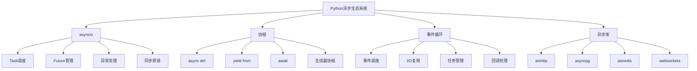

# 3.2.3 async-await异步编程深度

## 🎯 核心理念

异步编程是Python并发编程的"效率革命"。理解`async/await`不仅关乎性能，更是现代Python应用的基石。异步是一种思维模式的转变：从顺序执行到协作式并发。

### 🚀 异步编程体系架构



## 🚀 asyncio深度技术

### 💡 协程与任务管理

```python
import asyncio
import aiohttp
import time
import random
from typing import List, Dict, Any, Optional
from concurrent.futures import ThreadPoolExecutor
import functools

class AsyncProgrammingMastery:
    """异步编程精通技术"""
    
    @staticmethod
    def core_async_concepts():
        """异步核心概念"""
        
        print("🕒 异步编程核心概念:")
        
        # ✅ 基础协程函数
        async def simple_coroutine():
            """简单协程函数"""
            print("协程开始执行")
            
            # 模拟异步I/O操作
            await asyncio.sleep(1)
            
            print("协程执行完成")
            return "协程返回值"
        
        # ✅ 创建任务和运行
        async def run_coroutine_examples():
            """运行协程示例"""
            
            print("\n=== 基础协程执行 ===")
            
            # 直接调用协程（不推荐）
            result = await simple_coroutine()
            print(f"直接调用结果: {result}")
            
            print("\n=== 任务创建和管理 ===")
            
            # 创建任务
            task1 = asyncio.create_task(simple_coroutine())
            task2 = asyncio.create_task(simple_coroutine())
            
            print(f"任务1状态: {task1}")
            print(f"任务2状态: {task2}")
            
            # 等待任务完成
            results = await asyncio.gather(task1, task2)
            print(f"任务结果: {results}")
            
            # 获取任务状态
            print(f"任务1完成状态: {task1.done()}")
            print(f"任务1结果: {task1.result()}")
        
        # ✅ 协程vs生成器
        def generator_coroutine_comparison():
            """协程vs生成器对比"""
            
            print("\n=== 协程vs生成器 ===")
            
            async def async_function():
                """异步函数（协程）"""
                await asyncio.sleep(0.1)
                return "async result"
            
            def generator_function():
                """生成器函数"""
                yield "generator value 1"
                yield "generator value 2"
                yield "generator value 3"
            
            # 检查函数类型
            print(f"async_function类型: {type(async_function())}")
            print(f"generator_function类型: {type(generator_function())}")
            
            # 判断是否为协程函数
            print(f"async_function是协程: {asyncio.iscoroutinefunction(async_function)}")
            print(f"generator_function是协程: {asyncio.iscoroutinefunction(generator_function)}")
        
        # 运行示例
        asyncio.run(run_coroutine_examples())
        generator_coroutine_comparison()
    
    @staticmethod
    def advanced_task_management():
        """高级任务管理"""
        
        print("\n🎯 高级任务管理:")
        
        async def complex_task_execution():
            """复杂任务执行示例"""
            
            # ✅ 任务组管理
            class TaskGroupManager:
                """任务组管理器"""
                
                def __init__(self):
                    self.tasks = []
                    self.completed_tasks = []
                    self.failed_tasks = []
                
                async def add_task(self, coro, name=None):
                    """添加任务"""
                    task = asyncio.create_task(coro, name=name)
                    self.tasks.append(task)
                    return task
                
                async def wait_for_completion(self, timeout=None):
                    """等待任务完成"""
                    done, pending = await asyncio.wait(
                        self.tasks,
                        timeout=timeout,
                        return_when=asyncio.ALL_COMPLETED
                    )
                    
                    for task in done:
                        try:
                            result = task.result()
                            self.completed_tasks.append((task, result))
                        except Exception as e:
                            self.failed_tasks.append((task, e))
                    
                    return done, pending
                
                def get_statistics(self):
                    """获取统计信息"""
                    return {
                        'total': len(self.tasks),
                        'completed': len(self.completed_tasks),
                        'failed': len(self.failed_tasks),
                        'pending': len(self.tasks) - len(self.completed_tasks) - len(self.failed_tasks)
                    }
            
            # ✅ 模拟不同类型的任务
            async def io_intensive_task(task_id, duration=1):
                """I/O密集型任务"""
                await asyncio.sleep(duration)
                return f"I/O任务_{task_id}完成"
            
            async def cpu_bound_task(task_id, complexity=10000):
                """CPU密集型任务（在异步中的演示）"""
                # 通常CPU密集型任务应该在线程池中运行
                def cpu_worker():
                    result = sum(i ** 2 for i in range(complexity))
                    return f"CPU任务_{task_id}完成, 结果: {result}"
                
                # 在线程池中运行CPU密集型任务
                loop = asyncio.get_running_loop()
                with ThreadPoolExecutor() as executor:
                    result = await loop.run_in_executor(executor, cpu_worker)
                return result
            
            async def data_processing_task(task_id, data_size=1000):
                """数据处理任务"""
                # 模拟数据处理
                data = [i for i in range(data_size)]
                
                # 异步等待（模拟I/O）
                await asyncio.sleep(0.5)
                
                processed_data = [x * 2 for x in data]
                
                return f"数据任务_{task_id}完成, 处理了{len(processed_data)}条数据"
            
            # ✅ 执行任务组
            task_manager = TaskGroupManager()
            
            # 添加不同类型的任务
            await task_manager.add_task(io_intensive_task(1, 1.5), "IO_1")
            await task_manager.add_task(io_intensive_task(2, 1.0), "IO_2")
            await task_manager.add_task(cpu_bound_task(1), "CPU_1")
            await task_manager.add_task(data_processing_task(1), "DATA_1")
            
            print(f"任务组统计: {task_manager.get_statistics()}")
            
            # 等待所有任务完成
            start_time = time.time()
            done, pending = await task_manager.wait_for_completion(timeout=10)
            end_time = time.time()
            
            print(f"任务执行完成，耗时: {end_time - start_time:.2f}秒")
            print(f"完成任务数: {len(done)}")
            print(f"待完成任务数: {len(pending)}")
            
            # 显示完成任务的详情
            for task, result in task_manager.completed_tasks:
                print(f"✅ {task.get_name()}: {result}")
            
            # 显示失败任务的详情
            for task, error in task_manager.failed_tasks:
                print(f"❌ {task.get_name()}: {error}")
        
        # 运行复杂任务执行
        asyncio.run(complex_task_execution())

# ✅ 事件循环深度控制
class EventLoopControl:
    """事件循环深度控制"""
    
    @staticmethod
    def advanced_event_loop():
        """高级事件循环技术"""
        
        print("\n🔄 高级事件循环技术:")
        
        # ✅ 自定义事件循环策略
        async def custom_loop_demo():
            """自定义循环演示"""
            
            loop = asyncio.get_running_loop()
            print(f"当前事件循环: {loop}")
            
            # ✅ 回调函数管理
            def callback_handler():
                """回调处理器"""
                print(f"回调执行时间: {time.strftime('%H:%M:%S')}")
            
            # 安排定时回调
            loop.call_soon(callback_handler)
            loop.call_later(1, callback_handler)  # 1秒后执行
            
            # ✅ 使用信号量控制并发
            semaphore = asyncio.Semaphore(3)  # 最多3个并发
            
            async def limited_concurrent_task(task_id):
                """受限制的并发任务"""
                async with semaphore:
                    print(f"任务{task_id}开始执行")
                    await asyncio.sleep(1)
                    print(f"任务{task_id}完成")
                    return f"任务{task_id}结果"
            
            # 创建多个受限任务
            tasks = [limited_concurrent_task(i) for i in range(10)]
            results = await asyncio.gather(*tasks)
            
            print(f"受限并发任务结果: {len(results)}")
            
            # ✅ 任务取消和超时
            async def cancellable_task(duration=5):
                """可取消任务"""
                try:
                    await asyncio.sleep(duration)
                    return "任务完成"
                except asyncio.CancelledError:
                    print("任务被取消")
                    raise
            
            # 创建任务并取消
            task = asyncio.create_task(cancellable_task(3))
            
            # 等待1秒后取消
            await asyncio.sleep(1)
            task.cancel()
            
            try:
                await task
            except asyncio.CancelledError:
                print("任务取消成功")
            
            # ✅ 超时任务
            async def timeout_task(duration=2):
                """超时任务"""
                await asyncio.sleep(duration)
                return "超时任务完成"
            
            try:
                result = await asyncio.wait_for(timeout_task(30), timeout=1)
                print(f"任务结果: {result}")
            except asyncio.TimeoutError:
                print("任务超时")
        
        asyncio.run(custom_loop_demo())

# ✅ 异步上下文管理器
class AsyncContextManagers:
    """异步上下文管理器"""
    
    @staticmethod
    def async_context_patterns():
        """异步上下文管理器模式"""
        
        print("\n📦 异步上下文管理器:")
        
        # ✅ 异步上下文管理器实现
        class AsyncResourceManager:
            """异步资源管理器"""
            
            def __init__(self, resource_name):
                self.resource_name = resource_name
                self.is_open = False
                self.start_time = None
            
            async def __aenter__(self):
                """进入上下文"""
                print(f"打开异步资源: {self.resource_name}")
                self.start_time = time.time()
                
                # 模拟异步连接建立
                await asyncio.sleep(0.1)
                
                self.is_open = True
                return self
            
            async def __aexit__(self, exc_type, exc_val, exc_tb):
                """退出上下文"""
                end_time = time.time()
                
                if self.is_open:
                    print(f"关闭异步资源: {self.resource_name} (耗时: {end_time - self.start_time:.2f}秒)")
                    # 模拟异步清理
                    await asyncio.sleep(0.05)
                    self.is_open = False
                
                if exc_type:
                    print(f"异步上下文异常: {exc_type}: {exc_val}")
                
                return False  # 不抑制异常
            
            async def perform_operation(self, operation_data):
                """执行操作"""
                if not self.is_open:
                    raise RuntimeError("资源未打开")
                
                await asyncio.sleep(0.2)  # 模拟操作
                return f"{self.resource_name}处理: {operation_data}"
        
        # ✅ 复杂异步上下文管理器
        class AsyncDatabaseTransaction:
            """异步数据库事务管理器"""
            
            def __init__(self, db_name):
                self.db_name = db_name
                self.session = None
                self.transaction_id = None
            
            async def __aenter__(self):
                """开始事务"""
                print(f"🔐 开始数据库事务: {self.db_name}")
                
                # 模拟连接数据库
                await asyncio.sleep(0.1)
                
                self.session = f"session_{random.randint(1000, 9999)}"
                self.transaction_id = random.randint(10000, 99999)
                
                return self
            
            async def __aexit__(self, exc_type, exc_val, exc_tb):
                """结束事务"""
                if exc_type is None:
                    print(f"✅ 提交事务 {self.transaction_id}")
                    await asyncio.sleep(0.05)  # 模拟提交
                else:
                    print(f"❌ 回滚事务 {self.transaction_id}")
                    await asyncio.sleep(0.05)  # 模拟回滚
                
                print(f"🔓 关闭数据库会话: {self.session}")
                await asyncio.sleep(0.05)  # 模拟关闭连接
            
            async def execute_query(self, query):
                """执行查询"""
                print(f"📍 执行查询: {query}")
                await asyncio.sleep(0.1)  # 模拟查询执行
                return f"结果: {query} -> data_{random.randint(1, 100)}"
        
        async def context_manager_demo():
            """上下文管理器演示"""
            
            # 基础异步上下文管理器
            async with AsyncResourceManager("文件连接") as resource:
                result = await resource.perform_operation("读取数据")
                print(f"操作结果: {result}")
            
            print("\n" + "="*50)
            
            # 成功的事务
            async with AsyncDatabaseTransaction("用户数据库") as tx:
                result1 = await tx.execute_query("SELECT * FROM users")
                result2 = await tx.execute_query("UPDATE users SET status = 'active'")
                print(f"查询1: {result1}")
                print(f"查询2: {result2}")
            
            print("\n" + "="*50)
            
            # 失败的事务（会触发回滚）
            try:
                async with AsyncDatabaseTransaction("订单数据库") as tx:
                    await tx.execute_query("INSERT INTO orders VALUES (...)")
                    await tx.execute_query("UPDATE inventory SET stock = stock - 1")
                    
                    # 模拟一个错误
                    raise ValueError("库存不足")
                    
            except ValueError as e:
                print(f"捕获到错误: {e}")
            
            print("\n" + "="*50)
            
            # 嵌套上下文管理器
            async with AsyncResourceManager("外层资源") as outer_resource:
                async with AsyncResourceManager("内层资源") as inner_resource:
                    result_outer = await outer_resource.perform_operation("数据1")
                    result_inner = await inner_resource.perform_operation("数据2")
                    print(f"嵌套操作: {result_outer}, {result_inner}")
        
        asyncio.run(context_manager_demo())

# ✅ 异步设计模式
class AsyncDesignPatterns:
    """异步设计模式"""
    
    @staticmethod
    def async_patterns():
        """异步设计模式"""
        
        print("\n🏗️ 异步设计模式:")
        
        # ✅ 生产者-消费者模式（异步版）
        async def async_producer_consumer():
            """异步生产者消费者模式"""
            
            # 共享队列
            queue = asyncio.Queue(maxsize=10)
            
            # 消费者协程
            async def consumer(consumer_id):
                """消费者"""
                while True:
                    try:
                        # 等待数据
                        item = await asyncio.wait_for(queue.get(), timeout=5)
                        
                        if item is None:  # 结束信号
                            break
                        
                        # 处理数据
                        print(f"🔆 消费者{consumer_id}处理: {item}")
                        await asyncio.sleep(0.5)  # 模拟处理时间
                        
                        # 标记任务完成
                        queue.task_done()
                        
                    except asyncio.TimeoutError:
                        print(f"⏰ 消费者{consumer_id}超时等待数据")
                        break
            
            # 生产者协程
            async def producer(producer_id, item_count=20):
                """生产者"""
                for i in range(item_count):
                    item = f"产品_{producer_id}_{i}"
                    
                    # 放入队列
                    await queue.put(item)
                    print(f"🔧 生产者{producer_id}生产: {item}")
                    
                    await asyncio.sleep(0.2)  # 生产间隔
                
                # 发送完成信号
                await queue.put(None)
            
            # 启动生产者和消费者
            tasks = []
            
            # 启动生产者
            producer_task = asyncio.create_task(producer(1, 15))
            tasks.append(producer_task)
            
            # 启动消费者
            consumer_tasks = [asyncio.create_task(consumer(i)) for i in range(3)]
            tasks.extend(consumer_tasks)
            
            # 等待生产者完成
            await producer_task
            
            # 等待所有消费者完成
            await asyncio.gather(*consumer_tasks)
            
            print("🔄 生产者消费者完成")
        
        # ✅ 异步信号量模式
        async def async_semaphore_pattern():
            """异步信号量模式"""
            
            # 访问受限资源的类
            class RestrictedResource:
                def __init__(self, name, max_connections=3):
                    self.name = name
                    self.semaphore = asyncio.Semaphore(max_connections)
                    self.active_connections = set()
                
                async def access_resource(self, user_id):
                    """访问资源"""
                    async with self.semaphore:
                        connection_id = f"conn_{user_id}_{random.randint(100, 999)}"
                        self.active_connections.add(connection_id)
                        
                        print(f"🔒 用户{user_id}获得{self.name}连接: {connection_id}")
                        print(f"📊 当前活跃连接: {len(self.active_connections)}")
                        
                        # 模拟使用资源
                        await asyncio.sleep(1)
                        
                        print(f"🔓 用户{user_id}释放{self.name}连接: {connection_id}")
                        self.active_connections.discard(connection_id)
                        
                        return f"用户{user_id}完成资源使用"
            
            # 创建受限资源
            resource = RestrictedResource("数据库", max_connections=2)
            
            # 模拟多个用户同时访问
            async def simulate_user(user_id):
                """模拟用户访问"""
                result = await resource.access_resource(user_id)
                return result
            
            # 并发访问
            users = [simulate_user(i) for i in range(6)]
            results = await asyncio.gather(*users)
            
            print(f"📋 资源访问结果: {len(results)}个用户访问完成")
        
        # ✅ 异步观察者模式
        class AsyncEventHandler:
            """异步事件处理器"""
            
            def __init__(self):
                self.handlers = {}
                self.event_queue = asyncio.Queue()
                self.is_running = False
            
            def subscribe(self, event_type, handler):
                """订阅事件"""
                if event_type not in self.handlers:
                    self.handlers[event_type] = []
                self.handlers[event_type].append(handler)
            
            async def emit_event(self, event_type, data):
                """发送事件"""
                event = {'type': event_type, 'data': data, 'timestamp': time.time()}
                await self.event_queue.put(event)
            
            async def process_events(self):
                """处理事件"""
                self.is_running = True
                
                while self.is_running:
                    try:
                        # 等待事件
                        event = await asyncio.wait_for(self.event_queue.get(), timeout=1)
                        
                        # 分发事件
                        await self.dispatch_event(event)
                        
                    except asyncio.TimeoutError:
                        continue
            
            async def dispatch_event(self, event):
                """分发事件给处理器"""
                event_type = event['type']
                
                if event_type in self.handlers:
                    handlers = self.handlers[event_type]
                    
                    # 并发执行所有处理器
                    tasks = [handler(event) for handler in handlers]
                    await asyncio.gather(*tasks, return_exceptions=True)
            
            async def stop(self):
                """停止事件处理"""
                self.is_running = False
        
        async def observer_pattern_demo():
            """观察者模式演示"""
            
            event_handler = AsyncEventHandler()
            
            # 定义事件处理器
            async def email_handler(event):
                print(f"📧 邮件通知: {event['data']}")
                await asyncio.sleep(0.1)
            
            async def log_handler(event):
                print(f"📝 日志记录: {event['type']} -> {event['data']}")
                await asyncio.sleep(0.05)
            
            async def alert_handler(event):
                print(f"🚨 警告通知: {event['data']}")
                await asyncio.sleep(0.1)
            
            # 订阅事件
            event_handler.subscribe('user_login', email_handler)
            event_handler.subscribe('user_login', log_handler)
            event_handler.subscribe('user_error', log_handler)
            event_handler.subscribe('user_error', alert_handler)
            
            # 启动事件处理
            processing_task = asyncio.create_task(event_handler.process_events())
            
            # 发送一些事件
            await event_handler.emit_event('user_login', '用户Alice登录')
            await asyncio.sleep(0.5)
            
            await event_handler.emit_event('user_error', '用户Bob访问权限错误')
            await asyncio.sleep(0.5)
            
            # 停止事件处理
            await event_handler.stop()
            await processing_task
        
        # 运行设计模式示例
        asyncio.run(async_producer_consumer())
        print("\n" + "="*60)
        asyncio.run(async_semaphore_pattern())
        print("\n" + "="*60)
        asyncio.run(observer_pattern_demo())

# ✅ 异步错误处理与调试
class AsyncErrorHandling:
    """异步错误处理"""
    
    @staticmethod
    def async_error_management():
        """异步错误管理"""
        
        print("\n🚨 异步错误处理:")
        
        async def comprehensive_error_demo():
            """综合错误处理演示"""
            
            # ✅ 异步异常处理
            async def risky_operation(task_id, should_fail=False):
                """有风险的操作"""
                await asyncio.sleep(0.5)
                
                if should_fail:
                    if task_id == 1:
                        raise ValueError("模拟的值错误")
                    elif task_id == 2:
                        raise RuntimeError("模拟的运行时错误")
                    elif task_id == 3:
                        raise ConnectionError("模拟的连接错误")
                
                return f"成功完成任务{task_id}"
            
            # ✅ 单个任务错误处理
            try:
                result = await risky_operation(1, should_fail=True)
                print(f"任务结果: {result}")
            except ValueError as e:
                print(f"值错误: {e}")
            except Exception as e:
                print(f"未知错误: {e}")
            
            # ✅ 批量任务错误处理
            print("\n批量任务错误处理:")
            
            # 创建混合成功和失败的任务
            tasks = []
            for i in range(1, 6):
                task = risky_operation(i, should_fail=(i <= 3))
                tasks.append(task)
            
            # 处理所有任务的结果和异常
            results = []
            for task in asyncio.as_completed(tasks):
                try:
                    result = await task
                    results.append(f"成功: {result}")
                except ValueError as e:
                    results.append(f"值错误: {e}")
                except RuntimeError as e:
                    results.append(f"运行时错误: {e}")
                except ConnectionError as e:
                    results.append(f"连接错误: {e}")
                except Exception as e:
                    results.append(f"其他错误: {e}")
            
            print("任务结果汇总:")
            for result in results:
                print(f"  {result}")
            
            # ✅ 自定义异步异常
            class CustomAsyncException(Exception):
                """自定义异步异常"""
                def __init__(self, message, task_context=None):
                    super().__init__(message)
                    self.task_context = task_context
            
            async def task_with_context(task_name):
                """带上下文的任务"""
                await asyncio.sleep(0.2)
                
                if task_name == "problematic":
                    raise CustomAsyncException(
                        "任务失败",
                        task_context={"name": task_name, "timestamp": time.time()}
                    )
                
                return f"上下文任务{task_name}完成"
            
            try:
                result = await task_with_context("problematic")
                print(f"上下文任务结果: {result}")
            except CustomAsyncException as e:
                print(f"自定义异常: {e}")
                print(f"任务上下文: {e.task_context}")
        
        # ✅ 异步调试技术
        async def async_debugging_techniques():
            """异步调试技术"""
            
            print("\n🔍 异步调试技术:")
            
            # 设置日志级别
            import logging
            logging.basicConfig(level=logging.DEBUG)
            logger = logging.getLogger(__name__)
            
            # ✅ 异步任务状态监控
            async def monitore d_task(task_id):
                """被监控的任务"""
                logger.info(f"任务{task_id}开始")
                
                try:
                    # 模拟异步工作
                    await asyncio.sleep(1)
                    logger.info(f"任务{task_id}完成")
                    return f"任务{task_id}成功"
                except Exception as e:
                    logger.error(f"任务{task_id}失败: {e}")
                    raise
            
            # ✅ 任务监控装饰器
            def async_monitor(func):
                """异步监控装饰器"""
                
                @functools.wraps(func)
                async def wrapper(*args, **kwargs):
                    task_name = func.__name__
                    start_time = time.time()
                    
                    logger.info(f"🚀 启动任务: {task_name}")
                    
                    try:
                        result = await func(*args, **kwargs)
                        end_time = time.time()
                        logger.info(f"✅ 任务{task_name}成功完成 (耗时: {end_time - start_time:.2f}秒)")
                        return result
                    except Exception as e:
                        end_time = time.time()
                        logger.error(f"❌ 任务{task_name}失败 (耗时: {end_time - start_time:.2f}秒): {e}")
                        raise
                
                return wrapper
            
            # 使用监控装饰器
            @async_monitor
            async def monitored_calculation(x, y):
                """被监控的计算"""
                await asyncio.sleep(0.5)
                result = x * y
                if result > 100:
                    raise ValueError("计算结果过大")
                return result
            
            # 执行监控任务
            try:
                result = await monitored_calculation(10, 5)
                print(f"监控任务结果: {result}")
            except ValueError as e:
                print(f"监控捕获到错误: {e}")
            
            # ✅ 异步性能分析
            async def async_performance_profile():
                """异步性能分析"""
                
                async def slow_operation(name, duration):
                    await asyncio.sleep(duration)
                    return f"{name}完成"
                
                # 计算总执行时间
                start_time = time.time()
                
                # 并发执行多个任务
                tasks = [
                    slow_operation("快速任务", 0.1),
                    slow_operation("中等任务", 0.3),
                    slow_operation("慢速任务", 0.5)
                ]
                
                results = await asyncio.gather(*tasks)
                
                end_time = time.time()
                total_time = end_time - start_time
                
                print(f"异步并发执行:")
                print(f"  总任务数: {len(results)}")
                print(f"  总耗时: {total_time:.2f}秒")
                print(f"  平均每个任务: {total_time/len(results):.2f}秒")
                
                # 如果顺序执行需要的时间
                sequential_time = 0.1 + 0.3 + 0.5
                acceleration_ratio = sequential_time / total_time
                print(f"  顺序执行需要: {sequential_time:.2f}秒")
                print(f"  性能提升: {acceleration_ratio:.1f}倍")
            
            await async_performance_profile()
        
        # 运行错误处理和调试演示
        asyncio.run(comprehensive_error_demo())
        asyncio.run(async_debugging_techniques())

# 运行所有异步编程示例
print("🚀 Python异步编程深度技术:")
AsyncProgrammingMastery.core_async_concepts()
AsyncProgrammingMastery.advanced_task_management()
EventLoopControl.advanced_event_loop()
AsyncContextManagers.async_context_patterns()
AsyncDesignPatterns.async_patterns()
AsyncErrorHandling.async_error_management()

## 🧪 异步编程最佳实践

### 📝 实践1：高并发Web服务

**任务**：构建高性能异步Web服务

```python
# ✅ 异步Web服务
class AsyncWebService:
    """异步Web服务框架"""
    
    def __init__(self, name="AsyncWebService"):
        self.name = name
        self.routes = {}
        self.middlewares = []
    
    async def route(self, path, methods=None):
        """路由装饰器"""
        def decorator(func):
            self.routes[path] = {
                'handler': func,
                'methods': methods or ['GET']
            }
            return func
        return decorator
    
    async def add_middleware(self, middleware_func):
        """添加中间件"""
        self.middlewares.append(middleware_func)
    
    async def handle_request(self, request):
        """处理请求"""
        # 执行中间件
        for middleware in self.middlewares:
            request = await middleware(request)
        
        # 路由处理
        path = request.get('path', '/')
        if path in self.routes:
            handler = self.routes[path]['handler']
            return await handler(request)
        
        return {'status': 404, 'body': 'Not Found'}

# async_web_service = AsyncWebService()
```

### 🎯 实践2：异步任务队列系统

**任务**：实现分布式异步任务队列

```python
# ✅ 异步任务队列
class AsyncTaskQueue:
    """异步任务队列"""
    
    def __init__(self, queue_name="default"):
        self.queue_name = queue_name
        self.tasks = asyncio.Queue()
        self.workers = []
        self.is_running = False
    
    async def enqueue_task(self, task_data, priority=0):
        """入队任务"""
        task = {
            'id': f"{int(time.time() * 1000)}_{random.randint(1000, 9999)}",
            'data': task_data,
            'priority': priority,
            'created_at': time.time()
        }
        await self.tasks.put(task)
        return task['id']
    
    async def dequeue_task(self):
        """出队任务"""
        task = await self.tasks.get()
        self.tasks.task_done()
        return task
    
    async def worker_loop(self, worker_id):
        """工作者循环"""
        while self.is_running:
            try:
                task = await asyncio.wait_for(self.dequeue_task(), timeout=1)
                print(f"👷 工作者{worker_id}处理任务: {task['id']}")
                
                # 模拟任务处理
                await asyncio.sleep(random.random() * 2)
                
                print(f"✅ 任务{task['id']}完成")
                
            except asyncio.TimeoutError:
                continue
            except Exception as e:
                print(f"❌ 工作者{worker_id}处理任务时出错: {e}")
    
    async def start_workers(self, worker_count=3):
        """启动工作者"""
        self.is_running = True
        self.workers = [
            asyncio.create_task(self.worker_loop(i))
            for i in range(worker_count)
        ]
    
    async def stop_workers(self):
        """停止工作者"""
        self.is_running = False
        await asyncio.gather(*self.workers, return_exceptions=True)
        self.workers.clear()

# task_queue = AsyncTaskQueue("my_queue")
```

## 🔗 知识连接

- **并发基础**：[[3.2 并发与异步编程]] - 整体并发编程策略
- **GIL机制**：[[3.2.1 GIL机制与多线程]] - GIL限制和多线程技术
- **性能优化**：[[5.5 性能调优与监控]] - 异步性能优化技术
- **Web开发**：[[5.1 Web开发框架]] - 异步Web应用开发

## 💡 费曼检验

**解释：Python异步编程的核心概念是什么？async/await与传统多线程的区别？如何设计高效的异步应用？**

核心要点：
1. **核心概念**：协程是协作式并发，事件循环管理任务调度，async/await是协程的语法糖
2. **vs多线程**：异步单线程高并发，上下文切换成本低，I/O密集型优势明显
3. **设计原则**：避免阻塞操作，合理使用await，控制并发数量，处理异常和超时
4. **最佳实践**：使用aiohttp/aiofiles等异步库，避免混用同步异步代码，监控任务状态

---

🎯 **下个目标**：学习[[3.2.4 协作式并发vs抢占式并发]]中的并发模式对比
