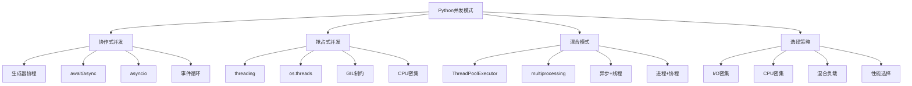

# 3.2.4 协作式并发vs抢占式并发

## 🎯 核心理念

并发编程有两种基本模式：协作式并发和抢占式并发。协作式并发依赖任务主动让出控制权，而抢占式并发由系统强制切换。理解这两种模式的特点、适用场景和实现方式，是掌握高级并发编程的关键。

### 🚀 并发模式技术体系



## 🚀 协作式并发深度技术

### 💡 生成器和协程

```python
import asyncio
import threading
import multiprocessing as mp
from concurrent.futures import ThreadPoolExecutor, ProcessPoolExecutor
from typing import Generator, AsyncGenerator, Callable, List, Any, Tuple
import time
from queue import Queue
import heapq

class CooperativeConcurrencyMastery:
    """协作式并发掌握技术"""
    
    @staticmethod
    def generator_coroutines():
        """生成器协程技术"""
        
        print("🔄 生成器协程:")
        
        # ✅ yield关键字协程
        def simple_coroutine():
            """简单协程"""
            print("协程开始")
            result = yield "第一个值"
            print(f"接收到值: {result}")
            result = yield "第二个值"
            print(f"再次接收: {result}")
            return "协程结束"
        
        def run_coroutine_sync():
            """同步运行协程"""
            cor = simple_coroutine()
            
            print(cor.send(None))    # 启动协程
        
            print(cor.send("Hello")) # 发送值
            print(cor.send("World")) # 再发送值
            
            try:
                cor.send("Over")     # 协程已结束
            except StopIteration as e:
                print(f"协程返回值: {e.value}")
        
        # ✅ yield from协程链
        def producer():
            """生产者协程"""
            for i in range(5):
                print(f"生产者产生: {i}")
                yield i
        
        def consumer():
            """消费者协程"""
            total = 0
            for value in producer():
                print(f"消费者接收: {value}")
                total += value
                yield f"处理完成，当前总数: {total}"
        
        def run_coroutine_chain():
            """运行协程链"""
            for result in consumer():
                print(f"最终结果: {result}")
        
        # ✅ 自定义调度器
        class TaskScheduler:
            """协作式任务调度器"""
            
            def __init__(self):
                self.tasks = []
                self.current_time = 0
            
            def add_task(self, generator, priority=0):
                """添加任务"""
                heapq.heappush(self.tasks, (priority, self.current_time, generator))
            
            def run(self):
                """运行所有任务"""
                while self.tasks:
                    priority, _, generator = heapq.heappop(self.tasks)
                    
                    try:
                        result = next(generator)
                        print(f"任务执行: {result}")
                        
                        # 任务未完成，重新调度
                        heapq.heappush(self.tasks, (priority, self.current_time + 1, generator))
                        
                    except StopIteration:
                        print("任务完成")
                    
                    self.current_time += 1
        
        # 测试协作式并发
        print("=== 同步协程 ===")
        run_coroutine_sync()
        
        print("\n=== 协程链 ===")
        run_coroutine_chain()
        
        print("\n=== 自定义调度器 ===")
        scheduler = TaskScheduler()
        
        def task1():
            for i in range(3):
                yield f"任务1-{i}"
        
        def task2():
            for i in range(3):
                yield f"任务2-{i}"
        
        scheduler.add_task(task1(), priority=1)
        scheduler.add_task(task2(), priority=2)
        scheduler.run()
    
    @staticmethod
    def asyncio_coroutines():
        """asyncio协程技术"""
        
        print("\n⚡ asyncio协程:")
        
        # ✅ 基础async/await模式
        async def download_file(filename: str, delay: float = 1.0) -> str:
            """模拟文件下载"""
            print(f"开始下载: {filename}")
            await asyncio.sleep(delay)  # 模拟I/O等待
            print(f"下载完成: {filename}")
            return f"{filename}已下载"
        
        async def process_downloads():
            """并发下载处理"""
            tasks = [
                download_file("file1.txt", 1.0),
                download_file("file2.txt", 0.5),
                download_file("file3.txt", 1.5)
            ]
            
            # 并发执行所有下载任务
            results = await asyncio.gather(*tasks)
            print(f"所有下载完成: {results}")
        
        # ✅ 协程池管理
        class AsyncCoroutinePool:
            """异步协程池"""
            
            def __init__(self, max_concurrent: int = 3):
                self.max_concurrent = max_concurrent
                self.semaphore = asyncio.Semaphore(max_concurrent)
                self.active_tasks = 0
            
            async def execute_task(self, coroutine: AsyncGenerator):
                """在池中执行任务"""
                async with self.semaphore:
                    self.active_tasks += 1
                    try:
                        async for result in coroutine:
                            yield result
                    finally:
                        self.active_tasks -= 1
            
            async def execute_multiple(self, coroutines: List[AsyncGenerator]):
                """并发执行多个协程"""
                tasks = [asyncio.create_task(
                    self._collect_results(self.execute_task(coro))
                ) for coro in coroutines]
                
                results = await asyncio.gather(*tasks)
                return results
            
            async def _collect_results(self, async_iter):
                """收集异步迭代器结果"""
                results = []
                async for result in async_iter:
                    results.append(result)
                    await asyncio.sleep(0.1)  # 避免阻塞
                return results
        
        # ✅ 事件驱动编程
        class EventDrivenSystem:
            """事件驱动系统"""
            
            def __init__(self):
                self.subscribers = dict()
                self.event_queue = asyncio.Queue()
            
            def subscribe(self, event_type: str, handler: Callable):
                """订阅事件"""
                if event_type not in self.subscribers:
                    self.subscribers[event_type] = []
                self.subscribers[event_type].append(handler)
            
            async def publish(self, event_type: str, data: Any):
                """发布事件"""
                await self.event_queue.put((event_type, data))
            
            async def event_loop(self):
                """事件循环"""
                while True:
                    try:
                        event_type, data = await asyncio.wait_for(
                            self.event_queue.get(), timeout=1.0
                        )
                        
                        # 处理事件
                        if event_type in self.subscribers:
                            for handler in self.subscribers[event_type]:
                                try:
                                    if asyncio.iscoroutinefunction(handler):
                                        await handler(data)
                                    else:
                                        handler(data)
                                except Exception as e:
                                    print(f"事件处理器错误: {e}")
                        
                    except asyncio.TimeoutError:
                        print("事件循环超时，继续等待...")
                        break
        
        # 运行asyncio示例
        print("=== asyncio并发下载 ===")
        asyncio.run(process_downloads())
    
    @staticmethod
    def cooperative_patterns():
        """协作式模式"""
        
        print("\n🤝 协作式并发模式:")
        
        # ✅ 生产者-消费者协程
        async def producer_consumer_pattern():
            """生产者-消费者模式"""
            
            async def producer(queue: asyncio.Queue, num_items: int):
                """生产者协程"""
                for i in range(num_items):
                    item = f"item_{i}"
                    await queue.put(item)
                    print(f"生产者产生: {item}")
                    await asyncio.sleep(0.1)  # 协作让步
                
                # 发送结束信号
                await queue.put(None)
            
            async def consumer(queue: asyncio.Queue, consumer_id: int):
                """消费者协程"""
                while True:
                    item = await queue.get()
                    if item is None:
                        await queue.put(None)  # 传递结束信号
                        break
                    
                    print(f"消费者{consumer_id}处理: {item}")
                    await asyncio.sleep(0.2)  # 模拟处理时间
            
            # 创建队列和任务
            queue = asyncio.Queue(maxsize=5)
            
            tasks = [
                producer(queue, 10),
                consumer(queue, 1),
                consumer(queue, 2),
                consumer(queue, 3)
            ]
            
            await asyncio.gather(*tasks)
        
        # ✅ 流水线处理
        async def pipeline_processing():
            """协程流水线"""
            
            async def stage1(data: List[int]) -> List[str]:
                """第一级处理"""
                result = []
                for item in data:
                    await asyncio.sleep(0.1)  # 协作让步
                    result.append(f"stage1_{item}")
                return result
            
            async def stage2(data: List[str]) -> List[str]:
                """第二级处理"""
                result = []
                for item in data:
                    await asyncio.sleep(0.1)  # 模拟处理
                    result.append(item.replace("stage1", "stage2"))
                return result
            
            async def stage3(data: List[str]) -> List[str]:
                """第三级处理"""
                result = []
                for item in data:
                    await asyncio.sleep(0.1)  # 模拟处理
                    result.append(f"final_{item}")
                return result
            
            # 串行流水线
            input_data = [1, 2, 3, 4, 5]
            
            print("串行流水线:")
            start_time = time.time()
            
            stage1_result = await stage1(input_data)
            stage2_result = await stage2(stage1_result)
            stage3_result = await stage3(stage2_result)
            
            end_time = time.time()
            print(f"串行结果: {stage3_result}")
            print(f"串行耗时: {end_time - start_time:.2f}s")
        
        # ✅ 错误处理和恢复
        async def fault_tolerance_pattern():
            """容错模式"""
            
            async def unreliable_task(task_id: int, fail_chance: float = 0.3) -> str:
                """不可靠任务"""
                await asyncio.sleep(0.1)
                
                import random
                if random.random() < fail_chance:
                    raise ConnectionError(f"任务{task_id}失败")
                
                return f"任务{task_id}成功"
            
            async def resilient_executor(tasks: List[int], max_retries: int = 2):
                """弹性执行器"""
                results = []
                
                for task_id in tasks:
                    retry_count = 0
                    success = False
                    
                    while retry_count <= max_retries and not success:
                        try:
                            result = await unreliable_task(task_id, fail_chance=0.5)
                            results.append(result)
                            success = True
                            print(f"✅ {result}")
                            
                        except Exception as e:
                            retry_count += 1
                            if retry_count <= max_retries:
                                print(f"⚠️ 重试任务{task_id} ({retry_count}/{max_retries}): {e}")
                                await asyncio.sleep(0.2)  # 重试延迟
                            else:
                                print(f"❌ 任务{task_id}最终失败: {e}")
                
                return results
            
            # 运行容错示例
            task_list = [1, 2, 3, 4, 5]
            results = await resilient_executor(task_list)
            print(f"容错执行结果: {results}")
        
        # 运行协作式模式
        print("=== 生产者-消费者 ===")
        asyncio.run(producer_consumer_pattern())
        
        print("\n=== 流水线处理 ===")
        asyncio.run(pipeline_processing())
        
        print("\n=== 容错模式 ===")
        asyncio.run(fault_tolerance_pattern())

# ✅ 抢占式并发深度技术
class PreemptiveConcurrencyMastery:
    """抢占式并发掌握技术"""
    
    @staticmethod
    def threading_models():
        """线程模型研究"""
        
        print("\n🧵 抢占式并发:")
        
        # ✅ Thread类应用
        def threading_basics():
            """线程基础"""
            
            def worker(name: str, duration: int):
                """工作线程函数"""
                print(f"线程{name}开始工作")
                for i in range(duration):
                    print(f"线程{name}: 工作步骤{i+1}")
                    time.sleep(0.5)  # 模拟工作
                print(f"线程{name}完成工作")
            
            # 创建多个线程
            threads = []
            for i in range(3):
                thread = threading.Thread(target=worker, args=(f"Worker-{i}", 3))
                threads.append(thread)
            
            # 启动所有线程
            print("启动所有线程...")
            start_time = time.time()
            
            for thread in threads:
                thread.start()
            
            # 等待所有线程完成
            for thread in threads:
                thread.join()
            
            end_time = time.time()
            print(f"所有线程完成，总耗时: {end_time - start_time:.2f}s")
        
        # ✅ 线程安全与同步
        def thread_synchronization():
            """线程同步"""
            
            class BankAccount:
                """银行账户类"""
                
                def __init__(self, initial_balance: int = 0):
                    self.balance = initial_balance
                    self.lock = threading.Lock()
                
                def deposit(self, amount: int) -> None:
                    """存款"""
                    with self.lock:
                        old_balance = self.balance
                        time.sleep(0.001)  # 模拟处理延迟
                        self.balance = old_balance + amount
                        print(f"存款: +{amount}, 余额: {self.balance}")
                
                def withdraw(self, amount: int) -> bool:
                    """取款"""
                    with self.lock:
                        if self.balance >= amount:
                            old_balance = self.balance
                            time.sleep(0.001)  # 模拟处理延迟
                            self.balance = old_balance - amount
                            print(f"取款: -{amount}, 余额: {self.balance}")
                            return True
                        else:
                            print(f"取款失败: 余额不足 (余额: {self.balance}, 请求: {amount})")
                            return False
            
            def depositor(account: BankAccount, amount: int, times: int):
                """存款者线程"""
                for _ in range(times):
                    account.deposit(amount)
                    time.sleep(0.01)

            def withdrawer(account: BankAccount, amount: int, times: int):
                """取款者线程"""
                for _ in range(times):
                    account.withdraw(amount)
                    time.sleep(0.01)
            
            # 创建账户和线程
            account = BankAccount(initial_balance=1000)
            
            depositor_thread = threading.Thread(
                target=depositor, args=(account, 100, 10)
            )
            withdrawer_thread = threading.Thread(
                target=withdrawer, args=(account, 50, 15)
            )
            
            print("开始银行业务...")
            depositor_thread.start()
            withdrawer_thread.start()
            
            depositor_thread.join()
            withdrawer_thread.join()
            
            print(f"最终余额: {account.balance}")
        
        # ✅ ThreadPoolExecutor应用
        def thread_pool_patterns():
            """线程池模式"""
            
            def cpu_bound_task(n: int) -> int:
                """CPU密集型任务"""
                result = 0
                for i in range(n):
                    result += i * i
                return result
            
            def io_bound_task(duration: float) -> str:
                """I/O密集型任务"""
                time.sleep(duration)
                return f"I/O任务完成，耗时 {duration}s"
            
            # CPU密集型任务测试
            cpu_tasks = [100000, 150000, 200000]
            print("CPU密集型任务测试:")
            
            with ThreadPoolExecutor(max_workers=3) as executor:
                start_time = time.time()
                cpu_futures = [executor.submit(cpu_bound_task, n) for n in cpu_tasks]
                cpu_results = [future.result() for future in cpu_futures]
                cpu_end_time = time.time()
                
                print(f"CPU任务结果: {cpu_results}")
                print(f"CPU任务耗时: {cpu_end_time - start_time:.2f}s")
            
            # I/O密集型任务测试
            io_tasks = [0.5, 0.3, 0.8, 0.2]
            print("\nI/O密集型任务测试:")
            
            with ThreadPoolExecutor(max_workers=4) as executor:
                start_time = time.time()
                io_futures = [executor.submit(io_bound_task, duration) for duration in io_tasks]
                io_results = [future.result() for future in io_futures]
                io_end_time = time.time()
                
                print(f"I/O任务结果: {io_results}")
                print(f"I/O任务耗时: {io_end_time - start_time:.2f}s")
        
        # 运行抢占式示例
        print("=== 线程基础 ===")
        threading_basics()
        
        print("\n=== 线程同步 ===")
        thread_synchronization()
        
        print("\n=== 线程池模式 ===")
        thread_pool_patterns()
    
    @staticmethod
    def multiprocessing_models():
        """多进程模型研究"""
        
        print("\n🔧 多进程并发:")
        
        # ✅ Process类应用
        def process_basics():
            """进程基础"""
            
            def cpu_bound_process(n: int) -> int:
                """CPU密集型进程"""
                result = sum(i * i for i in range(n))
                return result
            
            # CPU密集型任务测试
            tasks = [500000, 600000, 700000]
            
            # 顺序执行
            print("顺序执行:")
            start_time = time.time()
            sequential_results = [cpu_bound_process(n) for n in tasks]
            sequential_time = time.time() - start_time
            print(f"顺序结果: {sequential_results}")
            print(f"顺序耗时: {sequential_time:.2f}s")
            
            # 多进程执行
            print("\n多进程执行:")
            start_time = time.time()
            
            processes = []
            for n in tasks:
                process = mp.Process(target=lambda: cpu_bound_process(n))
                processes.append((process, n))
            
            # 启动所有进程
            for process, _ in processes:
                process.start()
            
            # 等待所有进程完成
            for process, _ in processes:
                process.join()
            
            multiprocessing_time = time.time() - start_time
            print(f"多进程耗时: {multiprocessing_time:.2f}s")
            print(f"加速比: {sequential_time / multiprocessing_time:.2f}倍")
        
        # ✅ ProcessPoolExecutor应用
        def process_pool_patterns():
            """进程池模式"""
            
            def data_processing_chunk(chunk_data: List[int]) -> Dict[str, int]:
                """数据处理块"""
                return {
                    'sum': sum(chunk_data),
                    'count': len(chunk_data),
                    'max': max(chunk_data) if chunk_data else 0,
                    'min': min(chunk_data) if chunk_data else 0
                }
            
            # 生成大数据集
            large_dataset = list(range(1000000))
            chunk_size = 100000
            chunks = [
                large_dataset[i:i + chunk_size]
                for i in range(0, len(large_dataset), chunk_size)
            ]
            
            print(f"数据集分块: {len(chunks)}个块, 每块大小: {chunk_size}")
            
            # 使用进程池处理
            with ProcessPoolExecutor(max_workers=4) as executor:
                start_time = time.time()
                chunk_futures = [executor.submit(data_processing_chunk, chunk) for chunk in chunks]
                chunk_results = [future.result() for future in chunk_futures]
                process_time = time.time() - start_time
                
                # 合并结果
                total_stats = {
                    'total_sum': sum(result['sum'] for result in chunk_results),
                    'total_count': sum(result['count'] for result in chunk_results),
                    'global_max': max(result['max'] for result in chunk_results),
                    'global_min': min(result['min'] for result in chunk_results)
                }
                
                print(f"处理结果统计: {total_stats}")
                print(f"进程池耗时: {process_time:.2f}s")
        
        # 运行多进程示例
        print("=== 进程基础 ===")
        process_basics()
        
        print("\n=== 进程池模式 ===")
        process_pool_patterns()

# ✅ 并发模式选择策略
class ConcurrencyPatternSelection:
    """并发模式选择策略"""
    
    @staticmethod
    def selection_criteria():
        """选择标准分析"""
        
        print("\n🎯 并发模式选择策略:")
        
        # ✅ 性能对比分析
        def performance_comparison():
            """性能对比分析"""
            
            import random
            
            # I/O密集型任务
            def io_task(duration: float):
                time.sleep(duration)
                return f"I/O任务完成: {duration}s"
            
            def async_io_performance():
                async def async_io_task(duration):
                    await asyncio.sleep(duration)
                    return f"异步I/O任务完成: {duration}s"
                
                async def run_async_io():
                    tasks = [async_io_task(random.uniform(0.1, 0.3)) for _ in range(10)]
                    start_time = time.time()
                    results = await asyncio.gather(*tasks)
                    end_time = time.time()
                    return end_time - start_time
                
                return asyncio.run(run_async_io())
            
            def threading_io_performance():
                def threading_io_task(duration):
                    time.sleep(duration)
                    return f"线程I/O任务完成: {duration}s"
                
                with ThreadPoolExecutor(max_workers=10) as executor:
                    tasks = [random.uniform(0.1, 0.3) for _ in range(10)]
                    start_time = time.time()
                    futures = [executor.submit(threading_io_task, duration) for duration in tasks]
                    results = [future.result() for future in futures]
                    end_time = time.time()
                    return end_time - start_time
            
            print("I/O密集型任务性能对比:")
            
            async_time = async_io_performance()
            threading_time = threading_io_performance()
            
            print(f"异步协程耗时: {async_time:.2f}s")
            print(f"多线程耗时: {threading_time:.2f}s")
            print(f"异步协程优势: {threading_time / async_time:.2f}倍")
        
        # ✅ 应用场景分析
        def use_case_analysis():
            """使用场景分析"""
            
            scenarios = {
                "Web服务器": {
                    "并发类型": "I/O密集型",
                    "推荐方案": "asyncio + 协程",
                    "原因": "大量的HTTP请求处理，异步I/O效率最高",
                    "代码示例": """
# Web API异步处理
async def handle_request(request):
    data = await fetch_data_async()
    result = await process_data_async(data)
    return await save_result_async(result)
"""
                },
                "数据科学计算": {
                    "并发类型": "CPU密集型",
                    "推荐方案": "multiprocessing",
                    "原因": "GIL限制，需要真正的并行计算",
                    "代码示例": """
# 数据并行计算
with ProcessPoolExecutor() as executor:
    results = executor.map(data_analysis_function, data_chunks)
"""
                },
                "文件批处理": {
                    "并发类型": "I/O密集型",
                    "推荐方案": "ThreadPoolExecutor",
                    "原因": "文件读写，简单的线程池即可",
                    "代码示例": """
# 文件并行处理
with ThreadPoolExecutor(max_workers=4) as executor:
    futures = [executor.submit(process_file, file) for file in files]
    results = [future.result() for future in futures]
"""
                },
                "混合负载系统": {
                    "并发类型": "I/O + CPU混合",
                    "推荐方案": "asyncio + ThreadPoolExecutor",
                    "原因": "异步处理I/O，线程池处理CPU密集型操作",
                    "代码示例": """
# 异步 + 线程池混合
async def process_data(data):
    result1 = await async_io_operation(data)
    result2 = await asyncio.get_event_loop().run_in_executor(
        None, cpu_intensive_function, result1
    )
    return await async_save(result2)
"""
                }
            }
            
            print("不同场景的并发选择:")
            for scenario, details in scenarios.items():
                print(f"\n📋 {scenario}:")
                for key, value in details.items():
                    if key != "代码示例":
                        print(f"  {key}: {value}")
                    else:
                        print(f"  {key}:{value}")
        
        # ✅ 决策流程图
        def decision_flow():
            """决策流程"""
            
            print("\n📊 并发选择决策流程:")
            
            decision_tree = """
            ├─ 是否为I/O密集型?
            │  ├─ 是 → 使用 asyncio (推荐)
            │  │    ├─ 大量网络请求 → async/await
            │  │    ├─ 数据库操作 → async数据库驱动
            │  │    └─ 文件I/O → aiofiles
            │  │
            │  └─ 否 → CPU密集型
            │       ├─ 需要绕过GIL → multiprocessing
            │       │    ├─ 科学计算 → ProcessPoolExecutor
            │       │    └─ 并行算法 → multiprocessing.Process
            │       │
            │       └─ 简单CPU任务 → ThreadPoolExecutor
            │
            ├─ 混合负载?
            │  ├─ I/O + CPU → asyncio + ThreadPoolExecutor
            │  └─ 需要高并发 → asyncio + 消息队列
            │
            ├─ 内存限制?
            │  ├─ 内存充足 → multiprocessing
            │  └─ 内存受限 → asyncio (轻量级)
            │
            └─ 调试难度?
                ├─ 简单调试 → threading.Thread
                └─ 复杂调试 → concurrent.futures
            """
            
            print(decision_tree)
        
        # 运行分析
        performance_comparison()
        use_case_analysis()
        decision_flow()

# 运行所有示例
if __name__ == "__main__":
    print("🚀 Python并发模式深度解析:")
    
    CooperativeConcurrencyMastery.generator_coroutines()
    CooperativeConcurrencyMastery.asyncio_coroutines()
    CooperativeConcurrencyMastery.cooperative_patterns()
    
    PreemptiveConcurrencyMastery.threading_models()
    PreemptiveConcurrencyMastery.multiprocessing_models()
    
    ConcurrencyPatternSelection.selection_criteria()

## 🧪 并发模式最佳实践

### 📝 实践1：混合并发框架

**任务**：实现协作式+抢占式混合并发

```python
# ✅ 混合并发框架
class HybridConcurrencyFramework:
    """混合并发框架"""
    
    def __init__(self):
        self.async_loop = None
        self.thread_pool = ThreadPoolExecutor(max_workers=4)
        self.process_pool = ProcessPoolExecutor(max_workers=2)
    
    async def async_cpu_task(self, cpu_func, *args):
        """异步执行CPU密集型任务"""
        loop = asyncio.get_event_loop()
        return await loop.run_in_executor(self.thread_pool, cpu_func, *args)
    
    async def hybrid_processing(self, io_task, cpu_task, data):
        """混合处理流程"""
        # I/O密集型异步处理
        io_result = await io_task(data)
        
        # CPU密集型线程池处理
        cpu_result = await self.async_cpu_task(cpu_task, io_result)
        
        return cpu_result
```

### 🎯 实践2：并发性能监控

**任务**：监控并发性能指标

```python
# ✅ 并发性能监控
class ConcurrencyMonitor:
    """并发性能监控"""
    
    def __init__(self):
        self.metrics = {
            'task_duration': [],
            'retry_count': 0,
            'success_rate': 0.0
        }
    
    async def monitor_task(self, coroutine):
        """监控任务执行"""
        start_time = time.time()
        try:
            result = await coroutine
            duration = time.time() - start_time
            
            self.metrics['task_duration'].append(duration)
            self.metrics['success_rate'] = (
                self.metrics['success_rate'] * 0.9 + 1.0 * 0.1
            )
            
            return result
        except Exception as e:
            duration = time.time() - start_time
            self.metrics['task_duration'].append(duration)
            self.metrics['retry_count'] += 1
            self.metrics['success_rate'] = (
                self.metrics['success_rate'] * 0.9 + 0.0 * 0.1
            )
            raise
```

## 🔗 知识连接

- **GIL机制**：[[3.2.1 GIL机制与多线程]] - GIL对线程的影响
- **异步编程**：[[3.2.3 异步编程核心]] - asyncio深度应用
- **多进程**：[[3.2.2 多进程编程实践]] - 多进程技术
- **性能优化**：[[5.5 性能调优与监控]] - 并发性能优化

## 💡 费曼检验

**解释：协作式并发和抢占式并发的本质区别是什么？什么情况下选择哪种并发模式？如何结合使用两种模式？**

核心要点：
1. **本质区别**：协作式依赖任务主动让出控制权，抢占式由系统强制切换；协作式效率高但可能饿死，抢占式公平但开销大
2. **选择策略**：I/O密集型选择协程(asyncio)，CPU密集型选择多进程(multiprocessing)，简单场景选择线程池(ThreadPoolExecutor)
3. **结合使用**：用异步处理I/O，线程池处理CPU密集操作，多进程处理独立计算单元

---

🎯 **下个目标**：学习[[3.2.5 深度递归与元编程]]中的高级编程技巧
