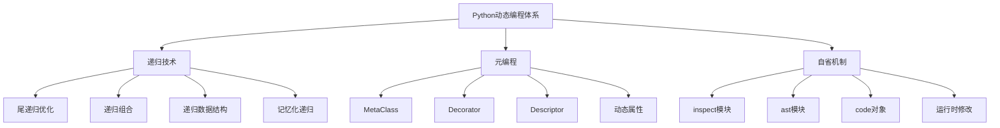

# 3.2.5 深度递归与元编程进阶

## 🎯 核心理念

递归是Python中最优雅的"自我表达"。元编程则是Python的动态"超能力"—在运行时创建、修改和理解代码的代码。这两者的结合创造了Python最强大的表达力：代码在运行时的自我进化。

### 🚀 递归思维与元编程体系



## 🚀 深度递归技术

### 💡 高效递归模式

```python
import functools
import inspect
import sys
from typing import Any, Callable, Dict, List, Union, Optional, Type
from collections import defaultdict, deque
import ast
import types
import operator

class AdvancedRecursionTechniques:
    """高级递归技术"""
    
    @staticmethod
    def tail_call_optimization():
        """尾递归优化"""
        
        print("🎯 尾递归优化技术:")
        
        # ✅ 标准递归vs尾递归对比
        def fibonacci_traditional(n):
            """传统递归实现"""
            if n <= 1:
                return n
            return fibonacci_traditional(n-1) + fibonacci_traditional(n-2)
        
        def fibonacci_tail_recursive(n, a=0, b=1):
            """尾递归实现"""
            if n == 0:
                return a
            if n == 1:
                return b
            return fibonacci_tail_recursive(n-1, b, a+b)
        
        def fibonacci_trampoline(n):
            """蹦床优化尾递归"""
            
            def fib_helper(n, a, b):
                if n == 0:
                    return lambda: a
                if n == 1:
                    return lambda: b
                return lambda: fib_helper(n-1, b, a+b)
            
            result = fib_helper(n, 0, 1)
            while callable(result):
                result = result()
            return result
        
        # ✅ 通用蹦床优化器
        class Trampoline:
            """蹦床优化器"""
            
            def __init__(self, func):
                self.func = func
            
            def __call__(self, *args, **kwargs):
                result = self.func(*args, **kwargs)
                while isinstance(result, Trampolined):
                    result = result.value
                return result
        
        class Trampolined:
            """蹦床包装类"""
            def __init__(self, value):
                self.value = value
        
        # 蹦床优化的阶乘
        @Trampoline
        def factorial_trampoline(n, acc=1):
            """蹦床优化阶乘"""
            if n <= 1:
                return Trampolined(acc)
            return Trampolined(factorial_trampoline(n-1, acc*n))
        
        # ✅ 自定义递归装饰器
        def memo_recursion(func):
            """记忆化递归装饰器"""
            cache = {}
            
            @functools.wraps(func)
            def wrapper(*args):
                if args in cache:
                    return cache[args]
                
                result = func(*args)
                cache[args] = result
                return result
            
            wrapper.cache = cache
            wrapper.cache_info = lambda: {'hits': len(cache), 'size': len(cache)}
            wrapper.cache_clear = cache.clear
            
            return wrapper
        
        @memo_recursion
        def fibonacci_memo(n):
            """记忆化斐波那契"""
            if n <= 1:
                return n
            return fibonacci_memo(n-1) + fibonacci_memo(n-2)
        
        # ✅ 递归深度控制
        class RecursionDepthManager:
            """递归深度管理器"""
            
            def __init__(self, max_depth=sys.getrecursionlimit()):
                self.max_depth = max_depth
                self.original_limit = sys.getrecursionlimit()
            
            def __enter__(self):
                sys.setrecursionlimit(self.max_depth)
                return self
            
            def __exit__(self, exc_type, exc_val, exc_tb):
                sys.setrecursionlimit(self.original_limit)
                if exc_type is RecursionError:
                    print(f"递归深度超过限制: {self.max_depth}")
                    return False  # 不抑制异常
        
        # 测试不同递归方法
        n = 30
        
        print(f"\n计算斐波那契数列第{n}项:")
        
        # 使用递归深度管理器
        with RecursionDepthManager(100):
            try:
                # 传统递归(很慢)
                # result = fibonacci_traditional(n)
                print("传统递归: 跳过(太慢)")
            except RecursionError:
                print("传统递归: 递归深度超限")
        
        result = fibonacci_tail_recursive(n)
        print(f"尾递归: {result}")
        
        result = fibonacci_trampoline(n)
        print(f"蹦床优化: {result}")
        
        result = fibonacci_memo(n)
        print(f"记忆化: {result}")
        print(f"记忆缓存信息: {fibonacci_memo.cache_info()}")
    
    @staticmethod
    def recursive_data_structures():
        """递归数据结构"""
        
        print("\n🌳 递归数据结构:")
        
        # ✅ 自引用数据结构
        class TreeNode:
            """树节点"""
            
            def __init__(self, value, children=None):
                self.value = value
                self.children = children or []
            
            def add_child(self, child):
                """添加子节点"""
                if isinstance(child, TreeNode):
                    self.children.append(child)
                else:
                    self.children.append(TreeNode(child))
            
            def depth_first_traverse(self, visitor_func=None):
                """深度优先遍历"""
                if visitor_func:
                    visitor_func(self)
                
                for child in self.children:
                    child.depth_first_traverse(visitor_func)
            
            def breadth_first_traverse(self, visitor_func=None):
                """广度优先遍历"""
                queue = deque([self])
                
                while queue:
                    node = queue.popleft()
                    if visitor_func:
                        visitor_func(node)
                    
                    for child in node.children:
                        queue.append(child)
            
            def find_nodes(self, predicate):
                """查找满足条件的节点"""
                results = []
                
                def collector(node):
                    if predicate(node):
                        results.append(node)
                
                self.depth_first_traverse(collector)
                return results
            
            def count_nodes(self):
                """统计节点数量"""
                count = 0
                
                def counter(node):
                    nonlocal count
                    count += 1
                
                self.depth_first_traverse(counter)
                return count
            
            def serialize(self):
                """序列化树结构"""
                return {
                    'value': self.value,
                    'children': [child.serialize() for child in self.children]
                }
            
            @classmethod
            def deserialize(cls, data):
                """反序列化树结构"""
                node = cls(data['value'])
                for child_data in data['children']:
                    child_node = cls.deserialize(child_data)
                    node.add_child(child_node)
                return node
        
        # ✅ 图结构实现
        class GraphNode:
            """图节点"""
            
            def __init__(self, value):
                self.value = value
                self.neighbors = []
                self.visited = False
            
            def add_edge(self, other_node):
                """添加边"""
                if other_node not in self.neighbors:
                    self.neighbors.append(other_node)
                    other_node.neighbors.append(self)
            
            def dfs_traversal(self, visited=None):
                """深度优先搜索"""
                if visited is None:
                    visited = set()
                
                visited.add(self)
                result = [self.value]
                
                for neighbor in self.neighbors:
                    if neighbor not in visited:
                        result.extend(neighbor.dfs_traversal(visited))
                
                return result
            
            def find_cycle(self, visited=None, recursion_stack=None):
                """检测环的存在"""
                if visited is None:
                    visited = set()
                if recursion_stack is None:
                    recursion_stack = set()
                
                visited.add(self)
                recursion_stack.add(self)
                
                for neighbor in self.neighbors:
                    if neighbor not in visited:
                        if neighbor.find_cycle(visited, recursion_stack):
                            return True
                    elif neighbor in recursion_stack:
                        return True
                
                recursion_stack.remove(self)
                return False
        
        # ✅ 构建示例树
        root = TreeNode("A")
        b = TreeNode("B")
        c = TreeNode("C")
        d = TreeNode("D")
        e = TreeNode("E")
        
        root.add_child(b)
        root.add_child(c)
        b.add_child(d)
        b.add_child(e)
        c.add_child(TreeNode("F"))
        
        print("树结构遍历:")
        
        # 深度优先遍历
        print("深度优先遍历:")
        nodes_depth = []
        root.depth_first_traverse(lambda n: nodes_depth.append(n.value))
        print(f"  {nodes_depth}")
        
        # 广度优先遍历
        print("广度优先遍历:")
        nodes_breadth = []
        root.breadth_first_traverse(lambda n: nodes_breadth.append(n.value))
        print(f"  {nodes_breadth}")
        
        # 节点查找
        vowel_nodes = root.find_nodes(lambda n: n.value in "AEIOU")
        print(f"元音节点: {[n.value for n in vowel_nodes]}")
        
        # 节点统计
        print(f"总节点数: {root.count_nodes()}")
    
    @staticmethod
    def advanced_recursive_algorithms():
        """高级递归算法"""
        
        print("\n⚙️ 高级递归算法:")
        
        # ✅ 分治算法
        def divide_and_conquer(array, operation, base_case=None):
            """通用分治算法"""
            if len(array) <= 1:
                return array[0] if array else base_case
            
            mid = len(array) // 2
            left_result = divide_and_conquer(array[:mid], operation, base_case)
            right_result = divide_and_conquer(array[mid:], operation, base_case)
            
            return operation(left_result, right_result)
        
        # 分治好用的示例
        def merge_sort_recursive(arr):
            """递归归并排序"""
            if len(arr) <= 1:
                return arr
            
            mid = len(arr) // 2
            left = merge_sort_recursive(arr[:mid])
            right = merge_sort_recursive(arr[mid:])
            
            return merge(left, right)
        
        def merge(left, right):
            """合并两个有序数组"""
            result = []
            i = j = 0
            
            while i < len(left) and j < len(right):
                if left[i] <= right[j]:
                    result.append(left[i])
                    i += 1
                else:
                    result.append(right[j])
                    j += 1
            
            result.extend(left[i:`])
            result.extend(right[j:`])
            return result
        
        # 快速排序(递归版)
        def quicksort_recursive(arr):
            """递归快速排序"""
            if len(arr) <= 1:
                return arr
            
            pivot = arr[len(arr) // 2]
            left = [x for x in arr if x < pivot]
            middle = [x for x in arr if x == pivot]
            right = [x for x in arr if x > pivot]
            
            return quicksort_recursive(left) + middle + quicksort_recursive(right)
        
        # ✅ 回溯算法
        def solve_n_queens(n):
            """N皇后问题的递归求解"""
            solutions = []
            
            def is_safe(board, row, col):
                """检查位置是否安全"""
                # 检查列
                for i in range(row):
                    if board[i] == col:
                        return False
                
                # 检查对角线
                for i in range(row):
                    if abs(board[i] - col) == abs(i - row):
                        return False
                
                return True
            
            def backtrack(board, row, n):
                """回溯求解"""
                if row == n:
                    solutions.append(board[:])
                    return
            
                for col in range(n):
            if is_safe(board, row, col):
                board[row] = col
                backtrack(board, row + 1, n)
                board[row] = -1  # 回溯
            
            board = [-1] * n
            backtrack(board, 0, n)
            return solutions
        
        # ✅ 动态规划递归转迭代
        def fibonacci_dp_recursive(n, memo={}):
            """动态规划递归实现"""
            if n in memo:
                return memo[n]
            
            if n <= 1:
                return n
            
            memo[n] = fibonacci_dp_recursive(n-1, memo) + fibonacci_dp_recursive(n-2, memo)
            return memo[n]
        
        def fibonacci_dp_iterative(n):
            """动态规划迭代实现"""
            if n <= 1:
                return n
            
            dp = [0, 1]
            for i in range(2, n + 1):
                dp.append(dp[i-1] + dp[i-2])
            
            return dp[n]
        
        # 测试算法
        print("算法测试:")
        
        # 排序测试
        test_array = [64, 34, 25, 12, 22, 11, 90]
        print(f"原始数组: {test_array}")
        
        merge_sorted = merge_sort_recursive(test_array.copy())
        print(f"归并排序: {merge_sorted}")
        
        quicksort_sorted = quicksort_recursive(test_array.copy())
        print(f"快速排序: {quicksort_sorted}")
        
        # N皇后测试
        print(f"N皇后(4): {len(solve_n_queens(4))}种解")
        
        # 动态规划对比
        n_fib = 30
        print(f"斐波那契({n_fib}) - 递归DP: {fibonacci_dp_recursive(n_fib)}")
        print(f"斐波那契({n_fib}) - 迭代DP: {fibonacci_dp_iterative(n_fib)}")

# ✅ 元编程核心技术
class MetaProgrammingTechniques:
    """元编程核心技术"""
    
    @staticmethod
    def metaclass_deep_dive():
        """元类深度解析"""
        
        print("\n🔮 元类深度技术:")
        
        # ✅ 装饰器元类
        class CallCounterMeta(type):
            """调用计数器元类"""
            
            def __new__(cls, name, bases, namespace):
                # 为每个方法添加调用计数
                for key, value in namespace.items():
                    if callable(value) and not key.startswith('_'):
                        namespace[key] = cls.wrap_method(value)
                
                return super().__new__(cls, name, bases, namespace)
            
            @staticmethod
            def wrap_method(method):
                """包装方法以计数调用"""
                method._call_count = 0
                
                def wrapper(*args, **kwargs):
                    method._call_count += 1
                    print(f"🔢 {method.__name__} 被调用第 {method._call_count} 次")
                    return method(*args, **kwargs)
                
                wrapper._call_count = lambda: method._call_count
                return wrapper
        
        # 使用元类的类
        class CountedClass(metaclass=CallCounterMeta):
            """用于计数的类"""
            
            def __init__(self, name):
                self.name = name
            
            def greet(self):
                return f"Hello from {self.name}"
            
            def calculate(self, x):
                return x * 2
        
        # ✅ 动态属性元类
        class DynamicPropertyMeta(type):
            """动态属性元类"""
            
            def __new__(cls, name, bases, namespace):
                # 为所有以'_'开头的属性创建property
                for key in list(namespace.keys()):
                    if key.startswith('_') and not key.startswith('__'):
                        # 创建对应的property
                        private_attr = key
                        public_attr = key[1:]  # 去掉'_'
                        
                        # 获取getter和setter
                        getter_name = f'_get_{public_attr}'
                        setter_name = f'_set_{public_attr}'
                        
                        getter = namespace.get(getter_name)
                        setter = namespace.get(setter_name)
                        
                        if getter and setter:
                            namespace[public_attr] = property(getter, setter)
                            del namespace[getter_name]
                            del namespace[setter_name]
                
                return super().__new__(cls, name, bases, namespace)
        
        class DynamicClass(metaclass=DynamicPropertyMeta):
            """动态属性类"""
            
            def __init__(self):
                self._value = 0
            
            def _get_value(self):
                print("🔍 获取值")
                return self._value
            
            def _set_value(self, value):
                print(f"⚡ 设置值为: {value}")
                self._value = value
        
        # ✅ 验证元类
        class ValidationMeta(type):
            """验证元类"""
            
            def __new__(cls, name, bases, namespace):
                # 查找验证器
                validator_methods = {}
                for key, value in namespace.items():
                    if key.startswith('_validate_'):
                        attr_name = key[9:]  # 去掉'_validate_'
                        validator_methods[attr_name] = value
                
                # 为每个验证属性创建property
                for attr_name, validator in validator_methods.items():
                    private_attr = f'_{attr_name}'
                    
                    def make_property(validator_func):
                        def getter(self):
                            return getattr(self, f'_{attr_name}', None)
                        
                        def setter(self, value):
                            # 执行验证
                            validator_func(self, value)
                            setattr(self, f'_{attr_name}', value)
                        
                        return property(getter, setter)
                    
                    namespace[attr_name] = make_property(validator)
                
                return super().__new__(cls, name, bases, namespace)
        
        class ValidatedClass(metaclass=ValidationMeta):
            """验证类"""
            
            def _validate_age(self, value):
                """年龄验证器"""
                if not isinstance(value, int):
                    raise TypeError("年龄必须是整数")
                if value < 0 or value > 150:
                    raise ValueError("年龄必须在0-150之间")
            
            def _validate_name(self, value):
                """姓名验证器"""
                if not isinstance(value, str):
                    raise TypeError("姓名必须是字符串")
                if len(value) < 2:
                    raise ValueError("姓名长度至少2个字符")
        
        # ✅ 测试元类技术
        print("元类技术测试:")
        
        # 调用计数测试
        obj1 = CountedClass("Test")
        obj1.greet()
        obj1.calculate(5)
        obj1.greet()
        
        # 动态属性测试
        dyn_obj = DynamicClass()
        dyn_obj.value = 42
        print(f"获取值: {dyn_obj.value}")
        
        # 验证测试
        val_obj = ValidatedClass()
        try:
            val_obj.age = 25  # 有效
            val_obj.name = "Alice"  # 有效
            print(f"验证通过: {val_obj.age}岁, 姓名: {val_obj.name}")
            
            val_obj.age = -5  # 无效
        except ValueError as e:
            print(f"验证失败: {e}")
    
    @staticmethod
    def descriptor_advanced_features():
        """描述符高级特性"""
        
        print("\n📝 描述符高级特性:")
        
        # ✅ 自定义描述符
        class TypedDescriptor:
            """类型检查描述符"""
            
            def __init__(self, expected_type, default=None):
                self.expected_type = expected_type
                self.default = default
                self.name = None
            
            def __set_name__(self, owner, name):
                self.name = name
            
            def __get__(self, instance, owner):
                if instance is None:
                    return self
                return instance.__dict__.get(self.name, self.default)
            
            def __set__(self, instance, value):
                if not isinstance(value, self.expected_type):
                    raise TypeError(f"{self.name}必须是{self.expected_type.__name__}类型")
                instance.__dict__[self.name] = value
        
        # ✅ 范围检查描述符
        class RangeCheckDescriptor:
            """范围检查描述符"""
            
            def __init__(self, min_val=None, max_val=None):
                self.min_val = min_val
                self.max_val = max_val
                self.name = None
            
            def __set_name__(self, owner, name):
                self.name = name
            
            def __get__(self, instance, owner):
                if instance is None:
                    return self
                return instance.__dict__.get(self.name)
            
            def __set__(self, instance, value):
                if self.min_val is not None and value < self.min_val:
                    raise ValueError(f"{self.name}不能小于{self.min_val}")
                if self.max_val is not None and value > self.max_val:
                    raise ValueError(f"{self.name}不能大于{self.max_val}")
                instance.__dict__[self.name] = value
        
        # ✅ 缓存描述符
        class CachedProperty:
            """缓存属性描述符"""
            
            def __init__(self, func):
                self.func = func
                self.name = func.__name__
            
            def __get__(self, instance, owner):
                if instance is None:
                    return self
                
                cache_name = f'_cached_{self.name}'
                if not hasattr(instance, cache_name):
                    # 计算并缓存结果
                    result = self.func(instance)
                    setattr(instance, cache_name, result)
                
                return getattr(instance, cache_name)
        
        # ✅ 惰性加载描述符
        class LazyLoadDescriptor:
            """惰性加载描述符"""
            
            def __init__(self, loader_func):
                self.loader_func = loader_func
                self.name = None
            
            def __set_name__(self, owner, name):
                self.name = name
            
            def __get__(self, instance, owner):
                if instance is None:
                    return self
                
                cache_name = f'_cached_{self.name}'
                if not hasattr(instance, cache_name):
                    # 加载数据
                    data = self.loader_func(instance)
                    setattr(instance, cache_name, data)
                
                return getattr(instance, cache_name)
        
        # 使用描述符的类
        class PersonWithDescriptors:
            """使用描述符的人"""
            
            age = TypedDescriptor(int, 0)
            salary = RangeCheckDescriptor(min_val=0, max_val=1000000)
            name = TypedDescriptor(str, "")
            
            def __init__(self, name, age, salary):
                self.name = name
                self.age = age
                self.salary = salary
            
            @CachedProperty
            def expensive_calculation(self):
                """昂贵的计算(缓存)"""
                import time
                time.sleep(0.1)  # 模拟耗时计算
                return f"{self.name}的复杂计算结果: {self.age * self.salary}"
            
            @LazyLoadDescriptor
            def external_data(self):
                """外部数据(惰性加载)"""
                print("🌐 正在加载外部数据...")
                import time
                time.sleep(0.2)  # 模拟网络请求
                return {"loaded_at": time.time(), "data": f"{self.name}的外部数据"}
        
        # ✅ 方法描述符
        class LoggedMethod:
            """日志方法描述符"""
            
            def __init__(self, func):
                self.func = func
                self.name = func.__name__
            
            def __get__(self, instance, owner):
                if instance is None:
                    return self
                
                def logged_method(*args, **kwargs):
                    print(f"📝 调用方法: {self.name}")
                    print(f"   参数: {args}, {kwargs}")
                    result = self.func(instance, *args, **kwargs)
                    print(f"   结果: {result}")
                    return result
                
                return logged_method
        
        # ✅ 属性访问拦截
        class PropertyMonitor:
            """属性访问监控器"""
            
            def __init__(self):
                self._access_count = defaultdict(int)
                self._last_access = {}
            
            def monitor_access(self, attr_name):
                """监控属性访问"""
                def decorator(func):
                    def wrapper(self, *args, **kwargs):
                        self._access_count[attr_name] += 1
                        self._last_access[attr_name] = time.time()
                        print(f"🎯 访问{attr_name}(第{self._access_count[attr_name]}次)")
                        return func(self, *args, **kwargs)
                    return wrapper
                return decorator
        
        # 测试描述符技术
        print("描述符技术测试:")
        
        # 基本描述符测试
        person = PersonWithDescriptors("Alice", 25, 50000)
        print(f"人员: {person.name}, {person.age}岁, 薪资: {person.salary}")
        
        # 类型检查测试
        try:
            person.age = "无效年龄"
        except TypeError as e:
            print(f"类型检查: {e}")
        
        # 范围检查测试
        try:
            person.salary = -1000
        except ValueError as e:
            print(f"范围检查: {e}")
        
        # 缓存属性测试
        print("缓存测试:")
        start_time = time.time()
        result1 = person.expensive_calculation
        end_time = time.time()
        print(f"第一次计算耗时: {end_time - start_time:.2f}秒")
        print(f"结果: {result1}")
        
        start_time = time.time()
        result2 = person.expensive_calculation  # 应该从缓存获取
        end_time = time.time()
        print(f"第二次计算耗时: {end_time - start_time:.2f}秒")
        print(f"缓存的性能优势明显!")
        
        # 惰性加载测试
        print("\n惰性加载测试:")
        external = person.external_data  # 触发加载
        print(f"外部数据: {external}")
        external2 = person.external_data  # 应该使用缓存
        print(f"再次访问: {external2}")

# ✅ 代码自省与生成
class CodeIntrospectionAndGeneration:
    """代码自省与生成"""
    
    @staticmethod
    def advanced_introspection():
        """高级自省技术"""
        
        print("\n🔍 高级代码自省:")
        
        # ✅ 深入函数检查
        def analyze_function_structure():
            """分析函数结构"""
            
            def complex_function(a, b=10, *args, **kwargs):
                """复杂函数示例"""
                local_var = a + b
                result = local_var * len(args)
                return result
            
            # 获取函数信息
            sig = inspect.signature(complex_function)
            
            print("📊 函数签名分析:")
            print(f"  参数数量: {len(sig.parameters)}")
            print(f"  参数类型: {[p.kind.name for p in sig.parameters.values()]}")
            print(f"  默认值: {[p.default for p in sig.parameters.values() if p.default != inspect.Parameter.empty]}")
            
            # 检查源代码
            source = inspect.getsource(complex_function)
            print(f"  源代码长度: {len(source)} 字符")
            
            # AST分析
            tree = ast.parse(source)
            print(f"  AST节点数: {len(list(ast.walk(tree)))}")
            
            return complex_function
        
        # ✅ 动态创建函数
        def create_dynamic_function():
            """动态创建函数"""
            
            # 从字符串创建函数
            function_code = """
def dynamic_calculator(x, y, operation='add'):
    if operation == 'add':
        return x + y
    elif operation == 'multiply':
        return x * y
    elif operation == 'power':
        return x ** y
    else:
        return 0
"""
            
            namespace = {}
            exec(function_code, namespace)
            dynamic_func = namespace['dynamic_hacker_calculator']
            
            print("🔧 动态函数测试:")
            print(f"  加法: {dynamic_func(5, 3, 'add')}")
            print(f"  乘法: {dynamic_func(5, 3, 'multiply')}")
            print(f"  幂运算: {dynamic_func(5, 3, 'power')}")
            
            return dynamic_func
        
        # ✅ 运行时修改类
        def runtime_class_modification():
            """运行时类修改"""
            
            class SimpleClass:
                """简单类"""
                def __init__(self, value):
                    self.value = value
            
            # 动态添加方法
            def double_value(self):
                return self.value * 2
            
            def square_value(self):
                return self.value ** 2
            
            # 使用方法monkey patching
            SimpleClass.double = double_value
            SimpleClass.square = square_value
            
            # 动态添加属性
            SimpleClass.DYNAMIC_CONSTANT = 42
            
            obj = SimpleClass(5)
            print("🎪 动态方法测试:")
            print(f"  原值: {obj.value}")
            print(f"  翻倍: {obj.double()}")
            print(f"  平方: {obj.square()}")
            print(f"  常量: {SimpleClass.DYNAMIC_CONSTANT}")
            
            return obj
        
        # ✅ 元数据驱动的类生成
        def generate_class_from_metadata():
            """从元数据生成类"""
            
            # 定义类元数据
            class_metadata = {
                'name': 'GeneratedClass',
                'attributes': {
                    'name': {'type': str, 'required': True},
                    'age': {'type': int, 'default': 0, 'validator': lambda x: 0 <= x <= 150},
                    'email': {'type': str, 'validator': lambda x: '@' in x if x else True}
                },
                'methods': {
                    'greet': lambda self: f"Hello, I'm {self.name}",
                    'get_info': lambda self: f"{self.name}, {self.age} years old"
                }
            }
            
            # 动态创建类
            def create_validation_getter(attr_name, validator=None):
                def getter(self):
                    return getattr(self, f"_generated_{attr_name}")
                return getter
            
            def create_validation_setter(attr_name, expected_type, validator=None):
                def setter(self, value):
                    if not isinstance(value, expected_type):
                        raise TypeError(f"{attr_name} must be {expected_type.__name__}")
                    
                    if validator and not validator(value):
                        raise ValueError(f"{attr_name} failed validation")
                    
                    setattr(self, f"_generated_{attr_name}", value)
                return setter
            
            # 构建类字典
            class_dict = {'__module__': __name__}
            
            # 添加属性
            properties = {}
            for attr_name, attr_config in class_metadata['attributes'].items():
                expected_type = attr_config['type']
                validator = attr_config.get('validator')
                
                getter = create_validation_getter(attr_name, validator)
                setter = create_validation_setter(attr_name, expected_type, validator)
                properties[attr_name] = property(getter, setter)
            
            class_dict.update(properties)
            
            # 添加方法
            for method_name, method_func in class_metadata['methods'].items():
                class_dict[method_name] = method_func
            
            # 添加初始化方法
            def __init__(self, **kwargs):
                for attr_name, attr_config in class_metadata['attributes'].items():
                    default_value = attr_config.get('default')
                    if default_value is not None:
                        setattr(self, f"_generated_{attr_name}", default_value)
                
                for attr_name, value in kwargs.items():
                    if attr_name in class_metadata['attributes']:
                        setattr(self, attr_name, value)
            
            class_dict['__init__'] = __init__
            
            # 动态创建类
            GeneratedClass = type(class_metadata['name'], (), class_dict)
            
            # 测试生成的类
            print("🏭 元数据生成类测试:")
            obj = GeneratedClass(name="Alice", age=25, email="alice@example.com")
            print(f"  问候: {obj.greet()}")
            print(f"  信息: {obj.get_info()}")
            print(f"  属性: name={obj.name}, age={obj.age}, email={obj.email}")
            
            return GeneratedClass
        
        # 运行自省测试
        analyze_function_structure()
        create_dynamic_function()
        runtime_class_modification()
        generate_class_from_metadata()

# ✅ 组合模式
class AdvancedPatternComposition:
    """高级模式组合"""
    
    @staticmethod
    def pattern_composition_examples():
        """模式组合示例"""
        
        print("\n🎨 模式组合技术:")
        
        # ✅ 装饰器 + 元类组合
        def logged_method(func):
            """日志装饰器"""
            @functools.wraps(func)
            def wrapper(self, *args, **kwargs):
                print(f"📝 {func.__name__} called with {args}, {kwargs}")
                result = func(self, *args, **kwargs)
                print(f"📝 {func.__name__} returned: {result}")
                return result
            return wrapper
        
        class LoggedMeta(type):
            """日志元类"""
            
            def __new__(cls, name, bases, namespace):
                # 为所有方法添加日志装饰器
                for key, value in namespace.items():
                    if callable(value) and not key.startswith('_'):
                        namespace[key] = logged_method(value)
                
                return super().__new__(cls, name, bases, namespace)
        
        class LoggedClass(metaclass=LoggedMeta):
            """使用日志的类"""
            
            def __init__(self, name):
                self.name = name
            
            def greet(self):
                return f"Hello, {self.name}"
            
            def calculate(self, x, y):
                return x + y
        
        # ✅ 描述符 + 元类组合
        class AutoPropertyMeta(type):
            """自动属性元类"""
            
            def __new__(cls, name, bases, namespace):
                # 查找描述符配置
                descriptors = {}
                for key, value in namespace.items():
                    if isinstance(value, dict) and key.endswith('_config'):
                        attr_name = key[:-7]  # 去掉'_config'
                        descriptors[attr_name] = value
                
                # 为每个配置创建property
                for attr_name, config in descriptors.items():
                    expected_type = config.get('type', str)
                    validator = config.get('validator')
                    default = config.get('default')
                    
                    def create_property(expected_type, validator, default):
                        def getter(self):
                            return getattr(self, f'_{attr_name}', default)
                        
                        def setter(self, value):
                            if not isinstance(value, expected_type):
                                raise TypeError(f"{attr_name} must be {expected_type.__name__}")
                            
                            if validator and not validator(attr_name, value):
                                raise ValueError(f"{attr_name} value validation failed")
                            
                            setattr(self, f'_{attr_name}', value)
                        
                        return property(getter, setter)
                    
                    namespace[attr_name] = create_property(expected_type, validator, default)
                
                return super().__new__(cls, name, bases, namespace)
        
        class AutoPropertyClass(metaclass=AutoPropertyMeta):
            """自动属性类"""
            
            age_config = {
                'type': int,
                'validator': lambda name, value: 0 <= value <= 150,
                'default': 0
            }
            
            name_config = {
                'type': str,
                'validator': lambda name, value: len(value) >= 2,
                'default': ''
            }
        
        # ✅ 函数式 + 面向对象组合
        class FunctionalOOPMixin:
            """函数式OOP混合"""
            
            def compose(self, *functions):
                """函数组合"""
                def composed(x):
                    result = x
                    for func in reversed(functions):
                        if isinstance(func, str):
                            # 处理方法名
                            result = getattr(self, func)(result)
                        else:
                            result = func(result)
                    return result
                return composed
            
            def pipe(self, data, *functions):
                """管道操作"""
                result = data
                for func in functions:
                    if isinstance(func, str):
                        result = getattr(self, func)(result)
                    else:
                        result = func(result)
                return result
            
            def partial_bind(self, method_name, *args, **kwargs):
                """部分绑定方法"""
                method = getattr(self, method_name)
                def bound(*more_args):
                    return method(*(args + more_args), **kwargs)
                return bound
        
        class DataProcessor(FunctionalOOPMixin):
            """数据处理器"""
            
            def add(self, x):
                return lambda y: x + y
            
            def multiply(self, x):
                return lambda y: y * x
            
            def square(self, x):
                return x ** 2
            
            def filter_even(self, data):
                return [x for x in data if x % 2 == 0]
            
            def process_data(self, data):
                # 组合操作
                pipeline = self.compose(
                    self.filter_even,
                    lambda xs: [self.square(x) for x in xs],
                    lambda xs: sum(xs)
                )
                
                return pipeline(data)
        
        # ✅ 测试模式组合
        print("模式组合测试:")
        
        # 装饰器 + 元类
        logged_obj = LoggedClass("Test")
        logged_obj.greet()
        logged_obj.calculate(5, 10)
        
        # 描述符 + 元类
        auto_obj = AutoPropertyClass()
        auto_obj.name = "Alice"
        auto_obj.age = 25
        print(f"自动属性: {auto_obj.name}, {auto_obj.age}")
        
        # 函数式 + OOP
        processor = DataProcessor()
        test_data = list(range(1, 11))
        result = processor.process_data(test_data)
        print(f"数据处理结果: {result}")

# 运行所有示例
if __name__ == "__main__":
    print("🚀 Python 递归与元编程深度技术:")
    
    AdvancedRecursionTechniques.tail_call_optimization()
    AdvancedRecursionTechniques.recursive_data_structures()
    AdvancedRecursionTechniques.advanced_recursive_algorithms()
    
    MetaProgrammingTechniques.metaclass_deep_dive()
    MetaProgrammingTechniques.descriptor_advanced_features()
    
    CodeIntrospectionAndGeneration.advanced_introspection()
    
    AdvancedPatternComposition.pattern_composition_examples()

## 🧪 递归与元编程最佳实践

### 📝 实践1：递归优化策略

**任务**：实现高效的递归算法框架

```python
# ✅ 通用递归优化框架
class RecursionOptimizer:
    """递归优化器"""
    
    @staticmethod
    def memoize(func):
        """记忆化装饰器"""
        cache = {}
        
        @functools.wraps(func)
        def wrapper(*args):
            if args in cache:
                return cache[args]
            
            result = func(*args)
            cache[args] = result
            return result
        
        wrapper.cache = cache
        wrapper.cache_info = lambda: {'size': len(cache)}
        wrapper.cache_clear = lambda: cache.clear()
        
        return wrapper
    
    @staticmethod
    def tail_recursive(func):
        """尾递归优化"""
        @functools.wraps(func)
        def wrapper(*args, **kwargs):
            result = func(*args, **kwargs)
            while callable(result):
                result = result()
            return result
        return wrapper
```

### 🎯 实践2：动态类生成器

**任务**：创建智能的类工厂

```python
# ✅ 动态类生成器
class ClassFactory:
    """动态类工厂"""
    
    @staticmethod
    def create_database_model(table_name, columns):
        """创建数据库模型类"""
        
        class_dict = {'__table_name__': table_name}
        
        # 添加字段
        for col_name, col_type in columns.items():
            private_name = f'_{col_name}'
            
            def create_property(col_name, col_type):
                def getter(self):
                    return getattr(self, f'_{col_name}')
                
                def setter(self, value):
                    if not isinstance(value, col_type):
                        raise TypeError(f"{col_name} must be {col_type.__name__}")
                    setattr(self, f'_{col_name}', value)
                
                return property(getter, setter)
            
            class_dict[col_name] = create_property(col_name, col_type)
        
        # 动态创建类
        ModelClass = type(f"{table_name.title()}Model", (), class_dict)
        return ModelClass

# UserModel = ClassFactory.create_database_model('users', {
#     'id': int,
#     'name': str,
#     'email': str,
#     'age': int
# })
```

## 🔗 知识连接

- **高级编程**：[[3.2 并发与异步编程]] - 递归在并发中的应用
- **设计模式**：[[2.1.3 设计模式在Python中的应用]] - 元编程实现设计模式
- **性能优化**：[[5.5 性能调优与监控]] - 递归和元编程的性能考虑
- **框架开发**：[[5.1 Web开发框架]] - 框架中的元编程应用

## 💡 费曼检验

**解释：什么是递归优化？元编程的核心思想是什么？如何优雅地使用Python的元编程能力？**

核心要点：
1. **递归优化**：尾递归消去、记忆化缓存、蹦床技术、深度控制
2. **元编程核心理念**：代码生成代码，运行时的自我修改能力
3. **元编程技术栈**：元类(创建类)、描述符(属性控制)、装饰器(函数修改)、自省(运行时代码检查)
4. **最佳实践**：适度使用、性能考虑、代码可读性、测试覆盖

---

🎯 **下个目标**：探索[[4.2 第三方库深度应用]]中的现代Python生态库
