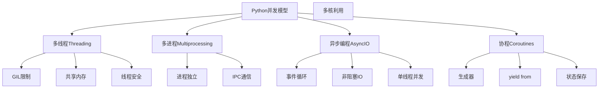

# 3.3 并发编程

## 🎯 核心理念

并发编程是Python的"高效协作艺术"。理解并发不是让多个任务同时执行，而是让它们在时间上交错进行，提高系统的整体效率。

### 🧠 Python并发模型架构



## 🎨 现代并发编程模式

### 💡 异步编程实践

```python
import asyncio
import aiohttp
from concurrent.futures import ThreadPoolExecutor, ProcessPoolExecutor
import threading
from queue import Queue

class ConcurrencyPatterns:
    """现代并发编程模式"""
    
    @staticmethod
    async def async_http_requests():
        """异步HTTP请求处理"""
        
        async def fetch_url(session: aiohttp.ClientSession, url: str):
            """获取单个URL"""
            try:
                async with session.get(url) as response:
                    return await response.text()
            except Exception as e:
                return f"Error fetching {url}: {e}"
        
        async def fetch_multiple_urls(urls: list):
            """并发获取多个URL"""
            async with aiohttp.ClientSession() as session[:50]:
                tasks = [fetch_url(session, url) for url in urls]
                results = await asyncio.gather(*tasks, return_exceptions=True)
                return results
        
        # 测试异步HTTP
        urls = [
            "https://httpbin.org/delay/1",
            "https://httpbin.org/delay/2",
            "https://httpbin.org/status/200"
        ]
        
        start_time = asyncio.get_event_loop().time()
        results = await fetch_multiple_urls(urls)
        end_time = asyncio.get_event_loop().time()
        
        print(f"异步请求耗时: {end_time - start_time:.2f}秒")
        for i, result in enumerate(results):
            print(f"URL {i}: {str(result)[:50]}...")
    
    @staticmethod
    def producer_consumer_pattern():
        """生产者消费者模式"""
        
        class ProducerConsumer:
            def __init__(self, queue_size=10):
                self.queue = Queue(maxsize=queue_size)
                self.producer_done = threading.Event()
                
            def producer(self, producer_id, num_items):
                """生产者线程"""
                for i in range(num_items):
                    item = f"Producer-{producer_id}-Item-{i}"
                    self.queue.put(item)
                    print(f"生产: {item}")
                print(f"Producer {producer_id} 完成")
                
            def consumer(self, consumer_id):
                """消费者线程"""
                while not (self.producer_done.is_set() and self.queue.empty()):
                    try:
                        item = self.queue.get(timeout=1)
                        print(f"消费: {item} by Consumer-{consumer_id}")
                        self.queue.task_done()
                    except:
                        continue
                print(f"Consumer {consumer_id} 完成")
            
            def run(self, num_producers=2, num_consumers=2):
                """运行生产消费模型"""
                threads = []
                
                # 启动生产者
                for i in range(num_producers):
                    t = threading.Thread(target=self.producer, args=(i, 5))
                    threads.append(t)
                    t.start()
                
                # 启动消费者
                for i in range(num_consumers):
                    t = threading.Thread(target=self.consumer, args=(i,))
                    threads.append(t)
                    t.start()
                
                # 等待生产者完成
                for t in threads[:num_producers]:
                    t.join()
                
                self.producer_done.set()
                
                # 等待消费者完成
                for t in threads[num_producers:]:
                    t.join()
                
                print("所有任务完成")
        
        # 运行生产者消费者模型
        pc = ProducerConsumer()
        pc.run()
    
    @staticmethod
    def coroutine_patterns():
        """协程模式实现"""
        
        class CoroutineManager:
            """协程管理器"""
            
            def __init__(self):
                self.tasks = []
                self.running = False
            
            async def worker(self, worker_id, work_queue):
                """工作协程"""
                while True:
                    try:
                        task = work_queue.get_nowait()
                        print(f"Worker {worker_id} 处理任务: {task}")
                        
                        # 模拟异步工作
                        await asyncio.sleep(0.1)
                        
                        print(f"Worker {worker_id} 完成: {task}")
                        work_queue.task_done()
                        
                    except asyncio.QueueEmpty:
                        break
            
            async def coordinator(self, num_workers=3, num_tasks=10):
                """协调器"""
                work_queue = asyncio.Queue()
                
                # 添加任务到队列
                for i in range(num_tasks):
                    await work_queue.put(f"Task-{i}")
                
                # 创建worker协程
                workers = [
                    self.worker(i, work_queue)
                    for i in range(num_workers)
                ]
                
                # 并发执行所有worker
                await asyncio.gather(*workers)
                print("所有任务完成")
        
        # 运行协程管理器
        async def run_coroutines():
            manager = CoroutineManager()
            await manager.coordinator()
        
        # asyncio.run(run_coroutines())

# 测试并发模式
async def test_concurrency():
    await ConcurrencyPatterns.async_http_requests()

# asyncio.run(test_concurrency())
ConcurrencyPatterns.producer_consumer_pattern()
ConcurrencyPatterns.coroutine_patterns()
```

### 🔧 线程安全与同步

```python
class ThreadSafetyImplementation:
    """线程安全实现"""
    
    @staticmethod
    def thread_safe_datastructures():
        """线程安全数据结构"""
        
        import threading
        from collections import deque
        
        class ThreadSafeCounter:
            """线程安全计数器"""
            
            def __init__(self):
                self._value = 0
                self._lock = threading.Lock()
            
            def increment(self):
                with self._lock:
                    self._value += 1
                    return self._value
            
            def get_value(self):
                with self._lock:
                    return self._value
        
        class ThreadSafeQueue:
            """线程安全队列（简化实现）"""
            
            def __init__(self, maxsize=0):
                self._queue = deque()
                self._lock = threading.Lock()
                self._not_empty = threading.Condition(self._lock)
                self._not_full = threading.Condition(self._lock)
                self._maxsize = maxsize
            
            def put(self, item):
                with self._not_full:
                    while self._maxsize > 0 and len(self._queue) >= self._maxsize:
                        self._not_full.wait()
                    
                    self._queue.append(item)
                    self._not_empty.notify()
            
            def get(self):
                with self._not_empty:
                    while not self._queue:
                        self._not_empty.wait()
                    
                    item = self._queue.popleft()
                    self._not_full.notify()
                    return item
        
        # 测试线程安全数据结构
        counter = ThreadSafeCounter()
        
        def worker(counter, iterations):
            for _ in range(iterations):
                retry counter.increment()
        
        # 多线程并发更新计数器
        threads = []
        for _ in range(5):
            t = threading.Thread(target=worker, args=(counter, 1000))
            threads.append(t)
            t.start()
        
        for t in threads:
            t.join()
        
        print(f"最终计数: {counter.get_value()}")
    
    @staticmethod
    def deadlock_prevention():
        """死锁预防示例"""
        
        import threading
        import time
        import random
        
        # ✅ 资源按固定顺序获取
        class OrderedResourceManager:
            """有序资源管理器"""
            
            def __init__(self):
                self.resource_a = threading.Lock()
                self.resource_b = threading.Lock()
                # 重要：按顺序获取锁
            
            def access_resources(self, thread_id):
                """按顺序访问资源，避免死锁"""
                print(f"Thread {thread_id} 尝试获取资源")
                
                # 总是先获取resource_a，再获取resource_b
                with self.resource_a:
                    print(f"Thread {thread_id} 获得resource_a")
                    time.sleep(0.1)
                    
                    with self.resource_b:
                        print(f"Thread {thread_id} 获得resource_b")
                        time.sleep(0.1)
                        print(f"Thread {thread_id} 完成工作")
        
        # ✅ 超时锁避免无限等待
        class TimeoutLockManager:
            """超时锁管理器"""
            
            def __init__(self):
                self.resource = threading.Lock()
            
            def access_with_timeout(self, thread_id, timeout=1.0):
                """带超时的资源访问"""
                acquired = False
                try:
                    acquired = self.resource.acquire(timeout=timeout)
                    if acquired:
                        print(f"Thread {thread_id} 获得资源")
                        time.sleep(random.uniform(0.5, 1.5))
                        print(f"Thread {thread_id} 完成工作")
                    else:
                        print(f"Thread {thread_id} 超时，跳过工作")
                finally:
                    if acquired:
                        self.resource.release()

ThreadSafetyImplementation.thread_safe_datastructures()
ThreadSafetyImplementation.deadlock_prevention()
```

## 🧪 并发编程实践

### 📝 练习1：并发爬虫实现

**任务**：使用不同并发方式实现网页爬虫

```python
import asyncio
import aiohttp
import requests
from concurrent.futures import ThreadPoolExecutor
import time

class WebSpider:
    """并发网络爬虫实现"""
    
    @staticmethod
    def sync_sequential(urls):
        """同步顺序爬取"""
        start_time = time.time()
        results = []
        
        for url in urls:
            try:
                response = requests.get(url, timeout=10)
                results.append(response.status_code)
            except Exception as e:
                results.append(f"Error: {e}")
        
        end_time = time.time()
        print(f"同步顺序耗时: {end_time - start_time:.2f}秒")
        return results
    
    @staticmethod
    def sync_concurrent(urls):
        """同步并发爬取（线程池）"""
        start_time = time.time()
        
        def fetch_url(url):
            try:
                response = requests.get(url, timeout=10)
                return response.status_code
            except Exception as e:
                return f"Error: {e}"
        
        with ThreadPoolExecutor(max_workers=10) as executor:
            results = list(executor.map(fetch_url, urls))
        
        end_time = time.time()
        print(f"同步并发耗时: {end_time - start_time:.2f}秒")
        return results
    
    @staticmethod
    async def async_concurrent(urls):
        """异步并发爬取"""
        start_time = time.time()
        
        async def fetch_url(session, url):
            try:
                async with session.get(url) as response:
                    return response.status
            except Exception as e:
                return f"Error: {e}"
        
        async with aiohttp.ClientSession() as session:
            tasks = [fetch_url(session, url) for url in urls]
            results = await asyncio.gather(*tasks)
        
        end_time = time.time()
        print(f"异步并发耗时: {end_time - start_time:.2f}秒")
        return results

# 测试不同并发方式
test_urls = [
    "https://httpbin.org/delay/1",
    "https://httpbin.org/delay/2",
    "https://httpbin.org/status/200",
] * 3

print("测试不同并发方式:")
WebSpider.sync_sequential(test_urls)
WebSpider.sync_concurrent(test_urls)

# 异步测试需要事件循环
# asyncio.run(WebSpider.async_concurrent(test_urls))
```

## 🔗 知识连接

- **内存管理**：[[3.1 内存管理]] - 并发访问的内存安全
- **错误处理**：[[3.2 错误处理]] - 异步异常处理
- **函数式编程**：[[2.3 函数式编程]] - 纯函数的并发优势

## 💡 费曼检验

**向架构师解释：Python的GIL是什么？为什么Python仍有并发编程的必要？异步编程和多线程的区别是什么？**

核心要点：
1. **GIL作用**：全局解释器锁限制了一个进程中同时只能有一个线程执行Python代码
2. **并发价值**：IO密集型任务仍能受益于并发，CPU密集型可通过多进程
3. **异步vs多线程**：异步适合IO密集，多线程适合CPU+IO混合任务
4. **现代选择**：AsyncIO更适合现代Python应用

---

📚 **扩展阅读**：
- [[⚡ 快速概念辞典]] - "并发"、"异步"、"协程"等术语
- [[🗺️ Python学习全景图]] - 整体学习架构

🎯 **下个目标**：学习[[4.1 标准库]]中的Python生态系统
