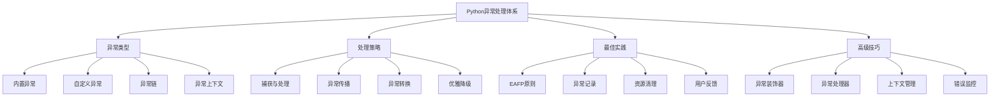

# 3.3.1 异常处理最佳实践

## 🎯 核心理念

异常处理是Python编程的"安全网"。它不是简单的try-except包装，而是一种系统性的错误管理和恢复策略。掌握异常处理的最佳实践，能够构建健壮、可维护的应用程序，让程序在面对意外情况时能够优雅地应对和恢复。

### 🚀 异常处理技术体系



## 🚀 异常处理核心技巧

### 💡 基础异常处理模式

```python
import logging
import traceback
import sys
from typing import Any, Callable, Optional, Dict, List
from functools import wraps
from contextlib import contextmanager, asynccontextmanager
from enum import Enum
import asyncio
from datetime import datetime
import json
import time

class ExceptionHandlingMastery:
    """异常处理精通技术"""
    
    @staticmethod
    def fundamental_exception_patterns():
        """基础异常处理模式"""
        
        print("🛡️ 基础异常处理模式:")
        
        # ✅ 精确异常捕获
        def precise_exception_handling():
            """精确异常处理"""
            
            def divide_numbers(a: float, b: float) -> float:
                """安全的除法运算"""
                if not isinstance(a, (int, float)):
                    raise TypeError(f"Expected number, got {type(a).__name__}")
                if not isinstance(b, (int, float)):
                    raise TypeError(f"Expected number, got {type(b).__name__}")
                
                if b == 0:
                    raise ZeroDivisionError("Cannot divide by zero")
                
                return a / b
            
            def safe_calculation(values: List[tuple]) -> tuple:
                """安全计算函数"""
                results = []
                errors = []
                
                for i, (a, b) in enumerate(values):
                    try:
                        result = divide_numbers(a, b)
                        results.append(f"计算 {i+1}: {a}/{b} = {result}")
                    except TypeError as e:
                        errors.append(f"类型错误 {i+1}: {e}")
                    except ZeroDivisionError as e:
                        errors.append(f"除零错误 {i+1}: {e}")
                    except Exception as e:
                        errors.append(f"未知错误 {i+1}: {e}")
                
                return results, errors
            
            # _test_数据
            test_values = [
                (10, 2),      # 正常计算
                (5, 0),       # 除零错误
                ("3", 1),     # 类型错误
                (8, 4),       # 正常计算
                (None, 2)     # 类型错误
            ]
            
            results, errors = safe_calculation(test_values)
            
            print("计算结果:")
            for result in results:
                print(f"  ✅ {result}")
            
            print("\n错误信息:")
            for error in errors:
                print(f"  ❌ {error}")
        
        # ✅ 异常鏈与上下文
        def exception_chaining_context():
            """异常链与上下文"""
            
            class DatabaseConnectionError(Exception):
                """数据库连接异常"""
                pass
            
            class UserNotFoundError(Exception):
                """用户未找到异常"""
                pass
            
            def get_user_from_db(user_id: int) -> dict:
                """模拟数据库查询"""
                if user_id < 0:
                    raise DatabaseConnectionError("Invalid user ID") from ValueError("user_id must be positive")
                elif user_id > 1000:
                    raise UserNotFoundError(f"User {user_id} not found")
                return {"id": user_id, "name": f"User{user_id}"}
            
            def create_user_profile(user_id: int) -> str:
                """创建用户档案"""
                try:
                    user_data = get_user_from_db(user_id)
                    return f"Profile created for {user_data['name']}"
                except (DatabaseConnectionError, UserNotFoundError) as e:
                    # 重新引发异常并添加上下文信息
                    raise RuntimeError(f"Failed to create profile for user {user_id}") from e
            
            # 测试异常链
            test_cases = [5, -1, 1500]
            
            for user_id in test_cases:
                try:
                    result = create_user_profile(user_id)
                    print(f"✅ 用户 {user_id}: {result}")
                except RuntimeError as e:
                    print(f"❌ 用户 {user_id}: {e}")
                    if e.__cause__:
                        print(f"   原因: {e.__cause__}")
        
        # ✅ finally和else的使用
        def exception_finally_else():
            """finally和else的使用"""
            
            def process_file(filename: str) -> str:
                """处理文件"""
                file_handle = None
                try:
                    print(f"打开文件: {filename}")
                    file_handle = open(filename, 'r', encoding='utf-8')
                    content = file_handle.read()
                    
                    if len(content) > 100:
                        return "文件内容过长"
                    else:
                        return f"处理结果: {len(content)} 字符"
                        
                except FileNotFoundError:
                    return f"文件 {filename} 不存在"
                except UnicodeDecodeError as e:
                    return f"文件编码错误: {e}"
                else:
                    # 只有在try块没有异常时执行
                    print("文件读取成功!")
                    return "文件读取成功"
                finally:
                    # 无论如何都会执行
                    if file_handle:
                        file_handle.close()
                        print(f"文件 {filename} 已关闭")
            
            # 测试不同的文件处理场景
            test_files = ["missing.txt", "test.txt"]
            
            for filename in test_files:
                result = process_file(filename)
                print(f"处理 {filename}: {result}")
        
        # 运行基础模式示例
        precise_exception_handling()
        print("\n" + "="*60)
        exception_chaining_context()
        print("\n" + "="*60)
        exception_finally_else()

# ✅ 高级异常处理技术
class AdvancedExceptionTechniques:
    """高级异常处理技术"""
    
    @staticmethod
    def decorator_based_exception_handling():
        """基于装饰器的异常处理"""
        
        print("\n🎭 装饰器异常处理:")
        
        # ✅ 异常处理装饰器
        def exception_handler(*exception_types):
            """异常处理装饰器"""
            def decorator(func: Callable) -> Callable:
                @wraps(func)
                def wrapper(*args, **kwargs):
                    try:
                        return func(*args, **kwargs)
                    except exception_types as e:
                        # 记录异常信息
                        logging.error(f"函数 {func.__name__} 发生异常: {e}")
                        return None  # 或者返回默认值
                    except Exception as e:
                        # 处理未预期的异常
                        logging.error(f"函数 {func.__name__} 发生未预期异常: {e}")
                        raise  # 重新引发
                return wrapper
            return decorator
        
        # ✅ 重试装饰器
        def retry_on_exception(max_retries: int = 3, delay: float = 1.0):
            """重试装饰器"""
            def decorator(func: Callable) -> Callable:
                @wraps(func)
                def wrapper(*args, **kwargs):
                    last_exception: Optional[Exception] = None
                    
                    for attempt in range(max_retries + 1):
                        try:
                            return func(*args, **kwargs)
                        except Exception as e:
                            last_exception = e
                            if attempt < max_retries:
                                print(f"尝试 {attempt + 1}/{max_retries + 1} 失败: {e}")
                                print(f"等待 {delay} 秒后重试...")
                                time.sleep(delay)
                            else:
                                print(f"所有重试均失败，抛出最后异常")
                    
                    raise last_exception
                return wrapper
            return decorator
        
        # ✅ 使用装饰器的示例
        @exception_handler(ValueError, TypeError)
        def risky_calculation(x: Any) -> float:
            """危险的数学计算"""
            if not isinstance(x, (int, float)):
                raise TypeError(f"Expected number, got {type(x).__name__}")
            if x <= 0:
                raise ValueError("Value must be positive")
            return x ** 2
        
        @retry_on_exception(max_retries=2, delay=0.5)
        def unreliable_network_call() -> str:
            """不可靠的网络调用"""
            import random
            if random.random() < 0.7:  # 70% 失败率
                raise ConnectionError("Network connection failed")
            return "Network call successful"
        
        # 测试装饰器
        print("测试异常处理装饰器:")
        
        # 测试异常捕获
        print(risky_calculation(5))      # 正常
        print(risky_calculation("hello"))  # 类型错误 -> 返回None
        print(risky_calculation(-1))     # 值错误 -> 返回None
        
        # 测试重试机制
        result = unreliable_network_call()
        print(f"网络调用结果: {result}")

# ✅ 上下文管理器异常处理
class ContextManagerExceptionHandling:
    """上下文管理器异常处理"""
    
    @staticmethod
    def context_manager_patterns():
        """上下文管理器模式"""
        
        print("\n📝 上下文管理器异常处理:")
        
        # ✅ 自定义上下文管理器
        @contextmanager
        def database_transaction():
            """数据库事务上下文管理器"""
            print("开始数据库事务")
            try:
                yield "database_connection"  # 模拟数据库连接
                print("提交事务")
            except Exception as e:
                print(f"回滚事务: {e}")
                raise  # 重新引发异常
            finally:
                print("关闭数据库连接")
        
        # ✅ 异步上下文管理器
        @asynccontextmanager
        async def async_resource_manager():
            """异步资源管理器"""
            resource = None
            try:
                print("初始化异步资源...")
                resource = "async_resource_connection"
                yield resource
                print("异步资源操作成功")
            except Exception as e:
                print(f"异步资源操作失败: {e}")
                raise
            finally:
                if resource:
                    print("清理异步资源...")
        
        # 测试上下文管理器
        print("测试数据库事务管理器:")
        try:
            with database_transaction() as conn:
                print(f"使用连接: {conn}")
                # 模拟正常操作
                pass
        except Exception as e:
            print(f"事务异常: {e}")

# ✅ 日志与监控集成
class LoggingAndMonitoringIntegration:
    """日志与监控集成"""
    
    @staticmethod
    def exception_logging_strategies():
        """异常日志策略"""
        
        print("\n📝 异常日志策略:")
        
        #         # ✅ 配置日志
        logging.basicConfig(
            level=logging.INFO,
            format='%(asctime)s - %(name)s - %(levelname)s - %(message)s',
            handlers=[
                logging.FileHandler('exceptions.log'),
                logging.StreamHandler()
            ]
        )
        
        logger = logging.getLogger(__name__)
        
        # ✅ 结构化异常日志
        def log_exception_with_context(exception: Exception, context: Optional[Dict[str, Any]] = None) -> Dict[str, Any]:
            """记录带上下文的异常"""
            exc_info = {
                'exception_type': type(exception).__name__,
                'exception_message': str(exception),
                'traceback': traceback.format_exc(),
                'context': context or {},
                'timestamp': datetime.now().isoformat()
            }
            
            logger.error(f"异常发生: {json.dumps(exc_info, ensure_ascii=False)}")
            return exc_info
        
        # ✅ 异常监控装饰器
        def monitor_exceptions(func: Callable) -> Callable:
            """异常监控装饰器"""
            @wraps(func)
            def wrapper(*args, **kwargs):
                try:
                    return func(*args, **kwargs)
                except Exception as e:
                    # 记录异常详情
                    context = {
                        'function_name': func.__name__,
                        'args': str(args),
                        'kwargs': str(kwargs)
                    }
                    log_exception_with_context(e, context)
                    raise
            return wrapper
        
        # ✅ 异常统计
        class ExceptionStats:
            """异常统计"""
            def __init__(self):
                self.stats: Dict[str, int] = {}
                self.total_count: int = 0
            
            def record_exception(self, exception_type: str) -> None:
                """记录异常"""
                self.total_count += 1
                self.stats[exception_type] = self.stats.get(exception_type, 0) + 1
            
            def get_report(self) -> Dict[str, Any]:
                """获取统计报告"""
                return {
                    'total_exceptions': self.total_count,
                    'by_type': self.stats,
                    'timestamp': datetime.now().isoformat()
                }
        
        # 全局异常统计器
        exception_stats = ExceptionStats()
        
        print("异常日志系统配置完成")
        return exception_stats

# ✅ 异步异常处理
class AsyncExceptionHandling:
    """异步异常处理"""
    
    @staticmethod
    def async_exception_patterns():
        """异步异常处理模式"""
        
        print("\n⚡ 异步异常处理:")
        
        # ✅ 异步任务异常处理
        async def async_risky_task(task_id: int, should_fail: bool = False) -> str:
            """异步危险任务"""
            await asyncio.sleep(0.1)  # 模拟异步操作
            
            if should_fail:
                raise RuntimeError(f"任务 {task_id} 故意失败")
            
            return f"任务 {task_id} 成功完成"
        
        # ✅ 异步批量处理
        async def handle_multiple_tasks() -> None:
            """处理多个异步任务"""
            tasks = []
            
            # 创建多个任务（部分会失败）
            for i in range(5):
                task = asyncio.create_task(
                    async_risky_task(i, should_fail=(i % 3 == 0))
                )
                tasks.append(task)
            
            print("批量处理异步任务...")
            
            # 等待所有任务完成（不中断）
            results = await asyncio.gather(*tasks, return_exceptions=True)
            
            success_count = 0
            for i, result in enumerate(results):
                if isinstance(result, Exception):
                    print(f"❌ 任务 {i} 失败: {result}")
                else:
                    print(f"✅ {result}")
                    success_count += 1
            
            print(f"批量处理完成: {success_count}/{len(tasks)} 成功")
        
        # 运行异步异常处理示例
        asyncio.run(handle_multiple_tasks())

# ✅ 异常处理最佳实践总结
class ExceptionBestPracticesSummary:
    """异常处理最佳实践总结"""
    
    @staticmethod
    def code_quality_guidelines():
        """代码质量指导原则"""
        
        print("\n📋 异常处理最佳实践:")
        
        guidelines = {
            "异常设计原则": [
                "1. 使用具体的异常类型，避免捕获过于宽泛的Exception",
                "2. 创建有意义的自定义异常，提供清晰的错误信息",
                "3. 优先使用EAFP(Easier to Ask for Forgiveness than Permission)原则",
                "4. 异常应该提供足够的上下文信息"
            ],
            "异常处理策略": [
                "1. 在适当的抽象层次处理异常",
                "2. 记录详细的异常信息用于调试",
                "3. 提供用户友好的错误消息",
                "4. 实现优雅的错误恢复机制"
            """ ],
            "资源管理": [
                "1. 使用finally确保资源清理",
                "2. 使用上下文管理器管理资源生命周期",
                "3. 在异常处理中也要清理资源",
                "4. 避免资源泄漏"
            ],
            "代码结构化": [
                "1. 将异常处理逻辑与业务逻辑分离",
                "2. 使用装饰器统一异常处理",
                "3. 创建异常处理中间件",
                "4. 标准化错误响应格式"
            ]
        }
        
        for category, practices in guidelines.items():
            print(f"\n{category}:")
            for practice in practices:
                print(f"  {practice}")

# 运行所有示例
if __name__ == "__main__":
    print("🚀 Python异常处理最佳实践:")
    
    ExceptionHandlingMastery.fundamental_exception_patterns()
    AdvancedExceptionTechniques.decorator_based_exception_handling()
    ContextManagerExceptionHandling.context_manager_patterns()
    
    logging_system = LoggingAndMonitoringIntegration.exception_logging_strategies()
    AsyncExceptionHandling.async_exception_patterns()
    ExceptionBestPracticesSummary.code_quality_guidelines()

## 🧪 异常处理最佳实践

### 📝 实践1：异常处理中间件

**任务**：创建统一的异常处理中间件

```python
# ✅ 异常处理中间件
class ExceptionHandlingMiddleware:
    """异常处理中间件"""
    
    def __init__(self):
        self.exception_handlers: Dict[type, Callable] = {}
        self.general_handler: Optional[Callable] = None
    
    def register_handler(self, exception_type: type, handler_func: Callable) -> None:
        """注册特定异常处理器"""
        self.exception_handlers[exception_type] = handler_func
    
    def set_general_handler(self, handler_func: Callable) -> None:
        """设置通用异常处理器"""
        self.general_handler = handler_func
    
    def handle_exception(self, exception: Exception, context: Optional[Dict] = None) -> Any:
        """处理异常"""
        exception_type: type = type(exception)
        
        if exception_type in self.exception_handlers:
            return self.exception_handlers[exception_type](exception, context)
        elif self.general_handler:
            return self.general_handler(exception, context)
        else:
            raise  # 重新引发未处理的异常
```

### 🎯 实践2：错误恢复策略

**任务**：实现智能的错误恢复机制

```python
# ✅ 智能错误恢复
class ErrorRecoveryStrategy:
    """错误恢复策略"""
    
    def __init__(self):
        self.retry_strategies: Dict[type, Callable] = {}
        self.circuit_breaker_state: Dict[str, Dict] = {}
    
    def with_exponential_backoff(self, operation: Callable, max_retries: int = 3) -> Any:
        """指数退避重试"""
        for attempt in range(max_retries):
            try:
                return operation()
            except Exception as e:
                if attempt == max_retries - 1:
                    raise
                
                delay: float = 2 ** attempt
                print(f"重试 {attempt + 1}/{max_retries}, 等待 {delay} 秒...")
                time.sleep(delay)
```

## 🔗 知识连接

- **调试技巧**：[[3.3.2 系统化调试方法]] - 异常与调试协作
- **日志设计: [[3.3.3 日志设计与监控]] - 异常日志集成
- **测试策略**：[[3.3.4 测试策略与自动化]] - 异常测试
- **并发编程**：[[3.2 并发与异步编程]] - 异步异常处理

## 💡 费曼检验

**解释：什么是EAFP原则？如何设计有效的异常处理策略？异常处理在系统架构中的作用是什么？**

核心要点：
1. **EAFP原则**：Easier to Ask for Forgiveness than Permission，先行动再处理异常，符合Python哲学
2. **有效策略**：具体异常捕获、分层异常处理、优雅降级、详细日志记录、用户友好反馈
3. **系统作用**：错误隔离、状态恢复、资源清理、监控告警、用户体验保障

---

🎯 **下个目标**：学习[[3.3.2 系统化调试方法]]中的调试技巧