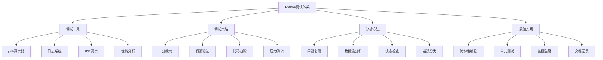

# 3.3.2 系统化调试方法

## 🎯 核心理念

调试是编程的核心技能之一。它不是简单的"加print"或"看日志"，而是一种系统化的问题分析与解决思维。掌握科学的调试方法，能够快速定位问题根源，提高开发效率，构建更加健壮的软件系统。

### 🚀 调试方法技术体系



## 🚀 调试工具精通

### 💡 Python调试器(pdb)

```python
import pdb
import sys
import traceback
import logging
import time
from typing import Any, Dict, List, Callable, Optional
import inspect
import ast
import cProfile
import pstats
import io
from contextlib import contextmanager
from functools import wraps
import threading
import multiprocessing

class DebuggingMastery:
    """调试方法精通技术"""
    
    @staticmethod
    def pdb_debugging():
        """pdb调试器精通"""
        
        print("🐞 pdb调试器技术:")
        
        # ✅ pdb基础命令演示
        def pdb_basic_commands():
            """pdb基础命令演示"""
            
            def complex_function(x: int, y: int) -> float:
                """复杂函数示例"""
                # pdb.set_trace()  # 设置断点（注释掉避免阻塞）
                
                result = 0
                for i in range(x):
                    if i > y:
                        temp_val = i ** 2 + y
                        result += temp_val
                    else:
                        result += i * 0.5
                
                return result / x if x > 0 else 0
            
            print("pdb命令演示:")
            print("常用pdb命令:")
            print("  h(elp) - 帮助")
            print("  l(ist) - 显示当前代码")
            print("  p - 打印表达式")
            print("  pp - 美化打印")
            print("  w(here) - 显示调用栈")
            print("  u(p) - 上一层调用栈")
            print("  d(own) - 下一层调用栈")
            print("  s(tep) - 单步执行")
            print("  n(ext) - 下一行")
            print("  c(ontinue) - 继续执行")
            print("  r(eturn) - 运行到函数返回")
            print("  q(uit) - 退出调试器")
            print("  a(rgs) - 显示函数参数")
            print("  l(ocal)s - 显示局部变量")
            
            # 演示调试功能
            result = complex_function(5, 3)
            print(f"函数结果: {result}")
        
        # ✅ 编程式调试控制
        def programmatic_debugging():
            """编程式调试控制"""
            
            def debug_function_call(func, *args, **kwargs):
                """调试函数调用的包装器"""
                print(f"调用函数: {func.__name__}")
                print(f"参数: {args}")
                print(f"关键字参数: {kwargs}")
                
                try:
                    result = func(*args, **kwargs)
                    print(f"返回结果: {result}")
                    return result
                except Exception as e:
                    print(f"异常: {type(e).__name__}: {e}")
                    
                    # 自动进入调试器
                    print("自动进入调试器...")
                    # pdb.post_mortem()  # 注释掉避免阻塞
                    raise
            
            def problematic_function(values: List[int]) -> float:
                """容易出错的函数"""
                if not values:
                    raise ValueError("Empty list")
                
                total = 0
                for i, val in enumerate(values):
                    if val < 0:
                        # 手动设置断点进行调试
                        print(f"调试点: i={i}, val={val}, total={total}")
                    
                    total += val ** (1/i if i > 0 else 1)  # 可能导致除零
            
                return total / len(values)
            
            # 测试调试功能
            test_values = [1, 2, -1, 4, 5]
            try:
                debug_function_call(problematic_function, test_values)
            except Exception:
                print("捕获到异常，程序继续")
        
        # ✅ 条件调试断点
        def conditional_debugging():
            """条件调试断点"""
            
            def process_data(data: List[Dict[str, Any]]):
                """数据处理函数"""
                results = []
                
                for i, item in enumerate(data):
                    # 条件调试：只有当值大于100时才停止
                    if isinstance(item, dict) and 'value' in item and item['value'] > 100:
                        print(f"条件断点触发: {item}")
                        # pdb.set_trace()  # 条件断点
                    
                    result = item.get('value', 0) * 2
                    results.append(result)
                    
                    # 调试复杂逻辑
                    if i > 10 and 'error' in item:
                        pdb.set_trace()  # 调试错误处理
            
                return results
            
            # 测试数据
            test_data = [
                {'value': 50, 'name': 'A'},
                {'value': 150, 'name': 'B'},  # 会触发条件断点
                {'value': 75, 'name': 'C'},
                {'value': 200, 'error': True, 'name': 'D'}  # 会触发错误调试
            ]
            
            # 只处理前3个避免调试中断
            results = process_data(test_data[:3])
            print(f"处理结果: {results}")
        
        # 运行pdb示例
        pdb_basic_commands()
        print("\n" + "="*60)
        programmatic_debugging()
        print("\n" + "="*60)
        conditional_debugging()

    @staticmethod
    def logging_debugging():
        """日志调试系统"""
        
        print("\n📝 日志调试系统:")
        
        # ✅ 高级日志配置
        def advanced_logging_setup():
            """高级日志配置"""
            
            # 多级别日志配置
            logging.basicConfig(
                level=logging.DEBUG,
                format='%(asctime)s - %(name)s - %(levelname)s - %(filename)s:%(lineno)d - %(message)s',
                handlers=[
                    logging.FileHandler('debug.log', encoding='utf-8'),
                    logging.StreamHandler()
                ]
            )
            
            logger = logging.getLogger(__name__)
            
            # 创建专用的调试日志器
            debug_logger = logging.getLogger('debug')
            debug_logger.setLevel(logging.DEBUG)
            
            # 添加调试处理器
            debug_handler = logging.FileHandler('detailed_debug.log', mode='w', encoding='utf-8')
            debug_formatter = logging.Formatter(
                '%(asctime)s [%(thread)d] %(name)s:%(funcName)s:%(lineno)d - %(levelname)s - %(message)s'
            )
            debug_handler.setFormatter(debug_formatter)
            debug_logger.addHandler(debug_handler)
            
            return logger, debug_logger
        
        # ✅ 调试日志装饰器
        def create_debug_logger():
            """创建调试日志器"""
            
            def debug_logger(func):
                """调试日志装饰器"""
                
                @wraps(func)
                def wrapper(*args, **kwargs):
                    logger_name = f"{func.__module__}.{func.__qualname__}"
                    func_logger = logging.getLogger(logger_name)
                    
                    func_logger.debug(f"调用 {func.__name__}")
                    func_logger.debug(f"参数: args={args}, kwargs={kwargs}")
                    
                    start_time = time.time()
                    
                    try:
                        result = func(*args, **kwargs)
                        execution_time = time.time() - start_time
                        
                        func_logger.debug(f"返回: {result}")
                        func_logger.debug(f"执行时间: {execution_time:.4f}s")
                        
                        return result
                        
                    except Exception as e:
                        execution_time = time.time() - start_time
                        func_logger.error(f"异常: {type(e).__name__}: {e}")
                        func_logger.error(f"执行时间: {execution_time:.4f}s")
                        
                        # 捕获堆栈信息
                        func_logger.error("堆栈跟踪:", exc_info=True)
                        raise
                
                return wrapper
            
            return debug_logger
        
        # ✅ 性能调试日志
        def performance_debug_logging():
            """性能调试日志"""
            
            # 性能监控装饰器
            def performance_monitor(threshold: float = 1.0):
                """性能监控装饰器"""
                def decorator(func):
                    @wraps(func)
                    def wrapper(*args, **kwargs):
                        start_time = time.perf_counter()
                        start_memory = sys.getsizeof(args) + sys.getsizeof(kwargs)
                        
                        logger = logging.getLogger(f"performance.{func.__qualname__}")
                        
                        try:
                            result = func(*args, **kwargs)
                            
                            end_time = time.perf_counter()
                            execution_time = end_time - start_time
                            
                            if execution_time > threshold:
                                logger.warning(
                                    f"慢函数警告: {func.__qualname__} "
                                    f"耗时 {execution_time:.4f}s "
                                    f"(超过阈值 {threshold}s)"
                                )
                            
                            logger.debug(f"函数执行: {func.__qualname__} - {execution_time:.4f}s")
                            return result
                            
                        except Exception as e:
                            end_time = time.perf_counter()
                            execution_time = end_time - start_time
                            
                            logger.error(
                                f"函数异常: {func.__qualname__} "
                                f"耗时 {execution_time:.4f}s "
                                f"异常: {e}"
                            )
                            raise
                    
                    return wrapper
                return decorator
            
            return performance_monitor
        
        # ✅ 上下文调试管理器
        def create_debug_context():
            """创建调试上下文管理器"""
            
            @contextmanager
            def debug_context(operation_name: str, **context_data):
                """调试上下文管理器"""
                logger = logging.getLogger('debug.context')
                
                start_time = time.time()
                context_id = id(threading.current_thread())
                
                logger.info(f"开始操作: {operation_name} (上下文ID: {context_id})")
                
                # 记录上下文数据
                for key, value in context_data.items():
                    logger.debug(f"  上下文数据: {key} = {value}")
                
                try:
                    yield {
                        'operation': operation_name,
                        'context_id': context_id,
                        'start_time': start_time
                    }
                    
                    logger.info(f"操作成功: {operation_name}")
                    
                except Exception as e:
                    logger.error(f"操作失败: {operation_name} - {e}")
                    raise
                    
                finally:
                    execution_time = time.time() - start_time
                    logger.info(f"操作完成: {operation_name} (耗时: {execution_time:.4f}s)")
            
            return debug_context
        
        # 测试日志调试
        logger, debug_logger = advanced_logging_setup()
        
        debug_logger.info("调试日志系统初始化完成")
        
        # 测试调试装饰器
        debug_logger_func = create_debug_logger()
        
        @debug_logger_func
        def test_function(x: int, y: int = 10) -> int:
            """测试函数"""
            return x * y
        
        result = test_function(5, 20)
        
        # 测试性能监控
        perf_monitor = performance_debug_logging()
        
        @perf_monitor(threshold=0.001)  # 1ms阈值
        def fast_function():
            """快速函数"""
            return sum(range(1000))
        
        @perf_monitor(threshold=0.001)
        def slow_function():
            """慢函数"""
            time.sleep(0.01)  # 10ms
            return "completed"
        
        fast_function()
        slow_function()
        
        # 测试上下文管理器
        debug_context = create_debug_context()
        
        with debug_context("数据处理", input_size=1000, data_type="numbers") as ctx:
            # 模拟数据处理
            processed = sum(range(ctx['data_type'] == "numbers" and 100 or 10))
            debug_logger.info(f"处理结果: {processed}")

    @staticmethod
    def profiling_techniques():
        """性能分析技术"""
        
        print("\n📊 性能分析技术:")
        
        # ✅ cProfile性能分析
        def cprofile_analysis():
            """cProfile性能分析"""
            
            # 示例函数
            def fibonacci_inefficient(n: int) -> int:
                """低效的斐波那契函数"""
                if n <= 1:
                    return n
                return fibonacci_inefficient(n-1) + fibonacci_inefficient(n-2)
            
            def fibonacci_efficient(n: int) -> int:
                """高效的斐波那契函数"""
                if n <= 1:
                    return n
                
                a, b = 0, 1
                for _ in range(2, n + 1):
                    a, b = b, a + b
                return b
            
            def performance_test():
                """性能测试函数"""
                for i in range(25):
                    result = fibonacci_inefficient(i)
                    if i > 20:  # 只对大的值使用高效版本
                        efficient_result = fibonacci_efficient(i)
                        assert result == efficient_result
            
            # cProfile分析
            print("cProfile性能分析:")
            
            # 创建分析器
            profiler = cProfile.Profile()
            
            # 运行分析
            profiler.enable()
            performance_test()
            profiler.disable()
            
            # 生成报告
            s = io.StringIO()
            ps = pstats.Stats(profiler, stream=s)
            ps.sort_stats('cumulative')
            ps.print_stats(10)  # 前10个最耗时的函数
            
            print("Top 10 最耗时函数:")
            print(s.getvalue())
            
            # 按时间排序
            s = io.StringIO()
            ps.sort_stats('time')
            ps.print_stats(5)  # 前5个
        
        # ✅ 自定义性能计时器
        def custom_timing_profiler():
            """自定义性能计时器"""
            
            class TimingProfiler:
                """自定义计时分析器"""
                
                def __init__(self):
                    self.timings = {}
                    self.call_counts = {}
                
                def timer(self, func_name: str = None):
                    """计时装饰器"""
                    
                    if func_name is None:
                        func_name = func.__name__
                    
                    def decorator(func):
                        @wraps(func)
                        def wrapper(*args, **kwargs):
                            start_time = time.perf_counter()
                            
                            try:
                                result = func(*args, **kwargs)
                                return result
                            finally:
                                end_time = time.perf_counter()
                                execution_time = end_time - start_time
                                
                                if func_name not in self.timings:
                                    self.timings[func_name] = []
                                    self.call_counts[func_name] = 0
                                
                                self.timings[func_name].append(execution_time)
                                self.call_counts[func_name] += 1
                        
                        return wrapper
                    return decorator
                
                def get_stats(self):
                    """获取统计信息"""
                    stats = {}
                    
                    for func_name, times in self.timings.items():
                        if times:
                            stats[func_name] = {
                                'call_count': self.call_counts[func_name],
                                'total_time': sum(times),
                                'avg_time': sum(times) / len(times),
                                'min_time': min(times),
                                'max_time': max(times)
                            }
                    
                    return stats
                
                def print_report(self, sort_by='total_time'):
                    """打印报告"""
                    stats = self.get_stats()
                    
                    if sort_by == 'total_time':
                        sorted_funcs = sorted(stats.items(), 
                                            key=lambda x: x[1]['total_time'], 
                                            reverse=True)
                    elif sort_by == 'avg_time':
                        sorted_funcs = sorted(stats.items(), 
                                            key=lambda x: x[1]['avg_time'], 
                                            reverse=True)
                    else:
                        sorted_funcs = stats.items()
                    
                    print(f"\n性能分析报告 (按 {sort_by} 排序):")
                    print("函数名\t\t调用次数\t总时间\t\t平均时间\t最小时间\t最大时间")
                    print("-" * 80)
                    
                    for func_name, stat in sorted_funcs:
                        print(f"{func_name:<20} {stat['call_count']:<8} "
                              f"{stat['total_time']:<12.4f} {stat['avg_time']:<12.4f} "
                              f"{stat['min_time']:<12.4f} {stat['max_time']:<12.4f}")
            
            # 测试自定义计时器
            profiler = TimingProfiler()
            
            @profiler.timer('slow_operation')
            def slow_operation():
                """慢操作"""
                time.sleep(0.01)
                return "slow result"
            
            @profiler.timer('fast_operation')
            def fast_operation():
                """快操作"""
                return "fast result"
            
            @profiler.timer('calculation')
            def heavy_calculation(n: int):
                """重计算"""
                result = 0
                for i in range(n * 1000):
                    result += i ** 0.5
                return result
            
            # 执行测试
            for _ in range(5):
                slow_operation()
            
            for _ in range(10):
                fast_operation()
            
            for i in range(3):
                heavy_calculation(100)
            
            # 打印报告
            profiler.print_report('total_time')
            profiler.print_report('avg_time')
        
        # ✅ 内存使用分析
        def memory_profiling():
            """内存使用分析"""
            
            def memory_intensive_function(n: int):
                """内存密集型函数"""
                data = []
                
                for i in range(n):
                    data.append({
                        'id': i,
                        'value': str(i) * 100,  # 大量字符串数据
                        'numbers': list(range(i % 10))
                    })
                
                # 模拟处理
                result = sum(len(item['value']) for item in data)
                return result, len(data)
            
            # 内存分析
            print("内存使用分析:")
            
            import tracemalloc
            
            # 开始内存追踪
            tracemalloc.start()
            
            # 执行内存密集型函数
            result, count = memory_intensive_function(1000)
            
            # 获取当前内存统计
            current, peak = tracemalloc.get_traced_memory()
            print(f"函数结果: {result}, 处理元素: {count}")
            print(f"当前内存使用: {current / 1024 / 1024:.2f} MB")
            print(f"峰值内存使用: {peak / 1024 / 1024:.2f} MB")
            
            # 获取内存快照
            snapshot = tracemalloc.take_snapshot()
            top_stats = snapshot.statistics('lineno')
            
            print("\nTop 10 内存分配:")
            for stat in top_stats[:10]:
                print(stat)
            
            # 停止内存追踪
            tracemalloc.stop()
        
        # 运行性能分析示例
        cprofile_analysis()
        print("\n" + "="*60)
        custom_timing_profiler()
        print("\n" + "="*60)
        memory_profiling()

# ✅ 高级调试策略
class AdvancedDebuggingStrategies:
    """高级调试策略"""
    
    @staticmethod
    def systematic_debugging_approach():
        """系统化调试方法"""
        
        print("\n🎯 系统化调试策略:")
        
        # ✅ 二分搜索调试法
        def binary_search_debugging():
            """二分搜索调试法"""
            
            def buggy_function(data: List[int]) -> List[int]:
                """有bug的函数示例"""
                result = []
                
                for i, item in enumerate(data):
                    # 这个函数有bug
                    if i % 2 == 0:
                        processed = item * 2 + (item > 10 and item or item + 5)  # bug在这里
                        result.append(processed)
                    else:
                        result.append(item + 1)
                
                return result
            
            def binary_search_debug(data_size: int = 100):
                """二分搜索调试实现"""
                print(f"二分搜索调试: 在长度{data_size}的数据中寻找问题")
                
                # 生成测试数据
                test_data = list(range(1, data_size + 1))
                
                # 找到有问题的数据范围
                low, high = 0, len(test_data) - 1
                bug_position = None
                
                while low <= high:
                    mid = (low + high) // 2
                    
                    # 测试前半部分
                    left_data = test_data[:mid + 1]
                    left_result = buggy_function(left_data)
                    
                    # 测试单个元素
                    if mid < len(test_data):
                        single_data = [test_data[mid]]
                        single_result = buggy_function(single_data)
                        
                        # 检查单独处理和批量处理的差异
                        if len(left_result) > mid and left_result[mid] != single_result[0]:
                            print(f"发现问题在位置 {mid}")
                            print(f"单独处理: {single_result[0]}")
                            print(f"批量处理: {left_result[mid]}")
                            bug_position = mid
                            break
                    
                    # 根据测试结果调整搜索范围
                    if len(left_data) > 20:  # 如果范围太大，缩小范围
                        high = mid - 1
                    else:
                        low = mid + 1
                
                if bug_position is not None:
                    print(f"二分搜索找到问题位置: {bug_position}")
                else:
                    print("二分搜索未找到明显问题")
            
            # 运行二分搜索调试
            binary_search_debug()
        
        # ✅ 假设验证调试法
        def hypothesis_based_debugging():
            """假设验证调试法"""
            
            def process_user_data(user_input: str) -> Dict[str, Any]:
                """处理用户数据的函数"""
                result = {
                    'input': user_input,
                    'length': len(user_input),
                    'words': user_input.split(),
                    'processed': False,
                    'errors': []
                }
                
                # 验证假设1: 输入不为空
                if not user_input.strip():
                    result['errors'].append('Empty input')
                    return result
                
                # 验证假设2: 输入长度适中
                if len(user_input) > 1000:
                    result['errors'].append('Input too long')
                    return result
                
                # 验证假设3: 没有特殊字符
                special_chars = '!@#$%^&*()'
                if any(char in user_input for char in special_chars):
                    result['processed'] = True
                else:
                    result['processed'] = False
                
                return result
            
            def test_hypothesis(hypothesis_name: str, test_data: List[str]):
                """测试假设"""
                print(f"\n验证假设: {hypothesis_name}")
                
                success_count = 0
                total_count = len(test_data)
                
                for test_input in test_data:
                    result = process_user_data(test_input)
                    
                    # 根据假设检查结果
                    if hypothesis_name == "empty_input" and result['errors']:
                        success_count += 1
                    elif hypothesis_name == "normal_input" and result['processed']:
                        success_count += 1
                
                success_rate = success_count / total_count if total_count > 0 else 0
                print(f"  成功率: {success_rate:.2%}")
                
                return success_rate
            
            # 测试不同假设
            empty_inputs = ["", "   ", "\t\n"]
            normal_inputs = ["hello world", "test", "special@char"]
            
            test_hypothesis("empty_input", empty_inputs)
            test_hypothesis("normal_input", normal_inputs)
            test_hypothesis("edge_cases", ["", "a" * 1001])
        
        # ✅ 状态检查调试法
        def state_inspection_debugging():
            """状态检查调试法"""
            
            class DebugState:
                """调试状态类"""
                
                def __init__(self):
                    self.variables = {}
                    self.checkpoints = []
                
                def checkpoint(self, name: str, **vars):
                    """设置检查点"""
                    self.checkpoints.append({
                        'name': name,
                        'variables': vars.copy(),
                        'timestamp': time.time()
                    })
                    
                    for key, value in vars.items():
                        self.variables[key] = value
                
                def compare_states(self):
                    """比较状态"""
                    if len(self.checkpoints) < 2:
                        return "需要至少两个检查点"
                    
                    changes = []
                    prev_checkpoint = self.checkpoints[-2]
                    curr_checkpoint = self.checkpoints[-1]
                    
                    for key in prev_checkpoint['variables']:
                        prev_value = prev_checkpoint['variables'].get(key)
                        curr_value = curr_checkpoint['variables'].get(key)
                        
                        if prev_value != curr_value:
                            changes.append({
                                'variable': key,
                                'previous': prev_value,
                                'current': curr_value
                            })
                    
                    return changes
            
            def data_processing_pipeline(data: List[int], debug_state: DebugState):
                """数据处理流水线"""
                
                debug_state.checkpoint("initial", data=data.copy(), count=len(data))
                
                # 步骤1: 过滤数据
                filtered_data = [x for x in data if x > 0]
                debug_state.checkpoint("after_filter", 
                                     data=filtered_data.copy(), 
                                     count=len(filtered_data),
                                     filtered_count=len(data) - len(filtered_data))
                
                # 步骤2: 转换数据
                transformed_data = [x * 2 for x in filtered_data]
                debug_state.checkpoint("after_transform",
                                     data=transformed_data.copy(),
                                     count=len(transformed_data),
                                     max_val=max(transformed_data) if transformed_data else 0)
                
                # 步骤3: 聚合数据
                aggregated = sum(transformed_data)
                debug_state.checkpoint("after_aggregate",
                                     result=aggregated,
                                     count=len(transformed_data))
                
                return aggregated
            
            # 测试状态检查
            debug_state = DebugState()
            test_data = [1, -5, 3, 0, 7, -2]
            
            result = data_processing_pipeline(test_data, debug_state)
            
            print("状态检查调试:")
            print(f"最终结果: {result}")
            
            # 分析状态变化
            changes = debug_state.compare_states()
            if changes:
                print("状态变化检测:")
                for change in changes:
                    print(f"  {change['variable']}: "
                          f"{change['previous']} -> {change['current']}")
        
        # 运行系统化调试示例
        binary_search_debugging()
        hypothesis_based_debugging()
        state_inspection_debugging()

# ✅ 调试最佳实践
class DebuggingBestPractices:
    """调试最佳实践"""
    
    @staticmethod
    def debugging_workflow():
        """调试工作流"""
        
        print("\n🛠️ 调试工作流:")
        
        # ✅ 问题诊断流程
        def diagnostic_workflow():
            """问题诊断流程"""
            
            diagnostic_steps = [
                "1. 问题复现 - 确保能稳定重现问题",
                "2. 错误分类 - 确定是逻辑错误、性能问题还是异常",
                "3. 范围缩小 - 确定问题影响的代码范围",
                "4. 假设验证 - 基于线索提出并验证假设",
                "5. 根因分析 - 找到问题的根本原因",
                "6. 解决验证 - 确保修复没有问题且没有引入新问题"
            ]
            
            print("系统化调试流程:")
            for step in diagnostic_steps:
                print(f"  {step}")
        
        # ✅ 调试工具选择指南
        def debugging_tool_selection():
            """调试工具选择指南"""
            
            tool_recommendations = {
                "简单逻辑错误": {
                    "推荐工具": ["print语句", "IDE调试器", "pdb"],
                    "场景": "函数返回值不正确、条件判断错误"
                },
                "性能问题": {
                    "推荐工具": ["cProfile", "line_profiler", "memory_profiler"],
                    "场景": "程序运行缓慢、内存使用过高"
                },
                "并发问题": {
                    "推荐工具": ["threading debugger", "asyncio调试", "日志系统"],
                    "场景": "死锁、竞态条件、线程安全问题"
                },
                "大型系统": {
                    "推荐工具": ["分布式调试", "APM工具", "监控系统"],
                    "场景": "微服务协调、分布式系统问题"
                }
            }
            
            print("调试工具选择指南:")
            for problem_type, info in tool_recommendations.items():
                print(f"\n{problem_type}:")
                print(f"  推荐工具: {', '.join(info['推荐工具'])}")
                print(f"  适用场景: {info['场景']}")
        
        # ✅ 预防性调试实践
        def preventive_debugging():
            """预防性调试实践"""
            
            print("预防性调试实践:")
            
            practices = [
                "1. 防御性编程 - 添加输入验证和边界检查",
                "2. 单元测试 - 确保每个函数都有充分测试覆盖",
                "3. 日志记录 - 在关键点添加结构化日志",
                "4. 类型提示 - 使用typing提高代码可读性",
                "5. 错误处理 - 实现健壮的异常处理机制",
                "6. 文档记录 - 维护清晰的代码文档和注释",
                "7. 代码评审 - 通过同行评审发现潜在问题",
                "8. 持续集成 - 使用CI/CD自动化测试和检查"
            ]
            
            for practice in practices:
                print(f"  {practice}")
        
        # 运行最佳实践示例
        diagnostic_workflow()
        print("\n" + "="*60)
        debugging_tool_selection()
        print("\n" + "="*60)
        preventive_debugging()

# 运行所有调试示例
if __name__ == "__main__":
    print("🚀 Python系统化调试方法:")
    
    DebuggingMastery.pdb_debugging()
    DebuggingMastery.logging_debugging()
    DebuggingMastery.profiling_techniques()
    
    AdvancedDebuggingStrategies.systematic_debugging_approach()
    DebuggingBestPractices.debugging_workflow()

## 🧪 调试方法最佳实践

### 📝 实践1：智能调试框架

**任务**：创建智能调试框架

```python
# ✅ 智能调试框架
class SmartDebugger:
    """智能调试框架"""
    
    def __init__(self):
        self.debug_context = {}
        self.performance_cache = {}
        self.error_patters = {}
    
    def auto_debug(self, func):
        """自动调试装饰器"""
        @wraps(func)
        def wrapper(*args, **kwargs):
            debug_id = f"{func.__name__}_{id(args)}{id(kwargs)}"
            
            # 记录参数
            self.debug_context[debug_id] = {
                'func_name': func.__name__,
                'args': args,
                'kwargs': kwargs,
                'call_time': time.time()
            }
            
            try:
                result = func(*args, **kwargs)
                return result
            except Exception as e:
                # 自动分析异常模式
                self._analyze_error_pattern(func.__name__, e, args, kwargs)
                raise
        
        return wrapper
    
    def _analyze_error_pattern(self, func_name, error, args, kwargs):
        """分析错误模式"""
        pattern_key = f"{func_name}_{type(error).__name__}"
        
        if pattern_key not in self.error_patters:
            self.error_patters[pattern_key] = {
                'count': 0,
                'common_args': {},
                'errors': []
            }
        
        self.error_patters[pattern_key]['count'] += 1
        self.error_patters[pattern_key]['errors'].append(str(error))
```

### 🎯 实践2：分布式调试技术

**任务**：实现分布式系统调试

```python
# ✅ 分布式调试技术
class DistributedDebugger:
    """分布式调试器"""
    
    def __init__(self, service_id: str):
        self.service_id = service_id
        self.request_traces = {}
        self.correlation_id = None
    
    def trace_request(self, request_id: str):
        """请求追踪"""
        trace_info = {
            'request_id': request_id,
            'service_id': self.service_id,
            'start_time': time.time(),
            'operations': []
        }
        
        self.request_traces[request_id] = trace_info
        return request_id
    
    def add_operation(self, request_id: str, operation: str, 
                     details: Dict[str, Any] = None):
        """添加操作记录"""
        if request_id in self.request_traces:
            self.request_traces[request_id]['operations'].append({
                'operation': operation,
                'timestamp': time.time(),
                'details': details or {}
            })
```

## 🔗 知识连接

- **异常处理**：[[3.3.1 异常处理最佳实践]] - 调试中的异常处理
- **日志设计**：[[3.3.3 日志设计与监控]] - 调试日志集成
- **测试策略**：[[3.3.4 测试策略与自动化]] - 调试与测试协作
- **性能优化**：[[5.5 性能调优与监控]] - 性能调试技术

## 💡 费曼检验

**解释：系统化调试的核心原则是什么？如何选择合适的调试工具？预防性调试的关键实践有哪些？**

核心要点：
1. **核心原则**：问题复现、假设验证、分而治之、状态检查、根因分析
2. **工具选择**：根据问题类型选择：简单逻辑用print/pdb、性能问题用profiler、并发问题用threading debugger
3. **预防实践**：防御性编程、充分测试、结构化日志、类型提示、错误处理、文档记录、代码评审、自动化检查

---

🎯 **下个目标**：学习[[3.3.3 日志设计与监控]]中的日志系统构建
