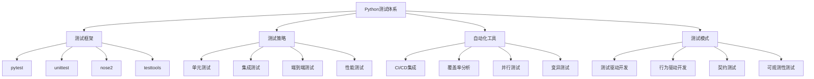

# 3.3.4 测试策略与自动化

## 🎯 核心理念

测试不是开发的"负担"，而是质量的"守护神"。自动化测试是Python开发的"安全网"，它能让你重构代码时充满信心。掌握测试策略，就是掌握高质量代码的核心技能。

### 🚀 测试技术体系



## 🚀 pytest高级测试技术

### 💡 基础测试策略

```python
import pytest
import unittest
import unittest.mock as mock
from typing import List, Dict, Any, Optional, Callable
import time
import tempfile
import os
import sys
from pathlib import Path
import subprocess
import coverage
import threading
import asyncio
from datetime import datetime

class AdvancedTestingStrategies:
    """高级测试策略"""
    
    @staticmethod
    def pytest_advanced_features():
        """pytest高级特性"""
        
        print("🧪 pytest高级测试技术:")
        
        # ✅ 参数化测试
        def demonstrate_parameterized_tests():
            """参数化测试演示"""
            
            # 基本参数化
            @pytest.mark.parametrize("input_val,expected", [
                (1, 2),
                (2, 4),
                (3, 6),
                (0, 0),
                (-1, -2)
            ])
            def test_double_function(input_val, expected):
                """测试双倍函数"""
                result = input_val * 2
                assert result == expected
            
            # 复杂参数化
            @pytest.mark.parametrize("user_data,expected_status", [
                ({'name': 'Alice', 'age': 25, 'email': 'alice@example.com', 'role': 'standard'}, 'active'),
                ({'name': 'Bob', 'age': 17, 'email': 'bob@example.com', 'role': 'standard'}, 'inactive'),
                ({'name': 'Charlie', 'age': 30, 'email': 'charlie@example.com', 'role': 'admin'}, 'active'),
                ({'name': 'David', '@age': 35, 'email': 'invalid-email', 'role': 'standard'}, 'invalid'),
            ])
            def test_user_validation(user_data, expected_status):
                """测试用户验证"""
                
                def validate_user(user):
                    """用户验证函数"""
                    # 检查必需字段
                    required_fields = ['name', 'age', 'email', 'role']
                    for field in required_fields:
                        if field not in user:
                            return 'invalid'
                    
                    # 检查邮箱格式
                    if '@' not in user['email']:
                        return 'invalid'
                    
                    # 检查年龄
                    if user['age'] < 18:
                        return 'inactive'
                    
                    return 'active'
                
                status = validate_user(user_data)
                assert status == expected_status
        
        # ✅ 夹具(Fixtures)系统
        def demonstrate_fixtures():
            """演示pytest夹具"""
            
            # 简单夹具
            @pytest.fixture
            def sample_data():
                """示例数据夹具"""
                return {
                    'users': [
                        {'id': 1, 'name': 'Alice', 'score': 95},
                        {'id': 2, 'name': 'Bob', 'score': 87},
                        {'id': 3, 'name': 'Charlie', 'score': 92}
                    ],
                    'settings': {
                        'max_score': 100,
                        'pass_threshold': 70
                    }
                }
            
            @pytest.fixture
            def db_connection():
                """数据库连接夹具"""
                # 模拟数据库连接
                conn = mock.MagicMock()
                conn.execute = mock.MagicMock()
                conn.close = mock.MagicMock()
                
                def get_user_count():
                    conn.execute.return_value = [[5]]  # 模拟查询结果
                    return conn.execute('SELECT COUNT(*) FROM users').fetchone()[0]
                
                conn.get_user_count = get_user_count
                
                yield conn
                
                # 清理
                conn.close()
            
            @pytest.fixture
            def temp_file():
                """临时文件夹具"""
                with tempfile.NamedTemporaryFile(mode='w', delete=False) as f:
                    f.write("test content\n")
                    temp_path = f.name
                
                yield temp_path
                
                # 清理
                os.unlink(temp_path)
            
            # 作用域夹具
            @pytest.fixture(scope="session")
            def app_config():
                """应用配置夹具(会话级别)"""
                return {
                    'APP_NAME': 'TestApp',
                    'DEBUG': True,
                    'DATABASE_URL': 'sqlite:///test.db',
                    'SECRET_KEY': 'test-secret-key'
                }
            
            @pytest.fixture(scope="class")
            def test_class_data():
                """测试类数据夹具(类级别)"""
                return {'class_var': 'shared_value'}
            
            # 自动使用夹具
            @pytest.fixture(autouse=True)
            def setup_test_environment():
                """自动设置测试环境"""
                # 每个测试前都运行
                print("\n🔧 设置测试环境")
                
                yield
                
                # 每个测试后都运行
                print("🧹 清理测试环境")
            
            # 夹具依赖
            @pytest.fixture
            def user_service(db_connection, app_config):
                """用户服务夹具(有依赖关系)"""
                
                class UserService:
                    def __init__(self, db, config):
                        self.db = db
                        self.config = config
                    
                    def get_user_count(self):
                        return self.db.get_user_count()
                    
                    def get_users_by_score(self, min_score):
                        self.db.execute.return_value = [
                            [1, 'Alice', 95],
                            [3, 'Charlie', 92]
                        ]
                        return self.db.execute(f'SELECT * FROM users WHERE score >= {min_score}')
                
                return UserService(db_connection, app_config)
            
            # 使用夹具的测试
            def test_data_processing(sample_data, user_service):
                """测试数据处理"""
                users = sample_data['users']
                high_scorers = [user for user in users if user['score'] >= 90]
                
                assert len(high_scorers) == 2
                assert user_service.get_user_count() == 5
            
            def test_file_operations(temp_file):
                """测试文件操作"""
                assert os.path.exists(temp_file)
                
                with open(temp_file, 'r') as f:
                    content = f.read()
                
                assert "test content" in content
                
                # 修改文件
                with open(temp_file, 'w') as f:
                    f.write("modified content\n")
                
                with open(temp_file, 'r') as f:
                    new_content = f.read()
                
                assert "modified content" in new_content
        
        # ✅ 模拟(Mocking)技术
        def demonstrate_mocking():
            """演示模拟技术"""
            
            def test_external_api_calls():
                """测试外部API调用"""
                
                def fetch_user_data(user_id: int) -> Dict[str, Any]:
                    """获取用户数据"""
                    # 模拟外部API调用
                    import requests
                    response = requests.get(f"https://api.example.com/users/{user_id}")
                    return response.json()
                
                def process_users(user_ids: List[int]) -> List[Dict[str, Any]]:
                    """处理用户列表"""
                    results = []
                    for user_id in user_ids:
                        user_data = fetch_user_data(user_id)
                        if user_data.get('active', False):
                            results.append(user_data)
                    return results
                
                # 使用mock模拟requests
                with mock.patch('requests.get') as mock_get:
                    # 配置模拟响应
                    mock_response = mock.MagicMock()
                    mock_response.json.return_value = {
                        'id': 123,
                        'name': 'Test User',
                        'active': True
                    }
                    mock_get.return_value = mock_response
                    
                    # 测试
                    user_ids = [123, 456]
                    results = process_users(user_ids)
                    
                    # 验证
                    assert len(results) == 2
                    assert mock_get.call_count == 2
                    assert results[0]['name'] == 'Test User'
            
            def test_side_effects():
                """测试副作用"""
                
                class EmailService:
                    def __init__(self):
                        self.sent_emails = []
                    
                    def send_email(self, to, subject, body):
                        """发送邮件(模拟)"""
                        self.sent_emails.append({
                            'to': to,
                            'subject': subject,
                            'body': body,
                            'timestamp': datetime.now()
                        })
                    
                    def get_sent_count(self):
                        return len(self.sent_emails)
                
                def send_notification_email(service: EmailService, user_email: str, message: str):
                    """发送通知邮件"""
                    service.send_email(
                        to=user_email,
                        subject="Notification",
                        body=message
                    )
                
                # 创建模拟服务
                mock_service = mock.MagicMock()
                mock_service.send_email = mock.MagicMock()
                
                # 测试
                send_notification_email(mock_service, "test@example.com", "Hello!")
                
                # 验证调用
                mock_service.send_email.assert_called_once_with(
                    to="test@example.com",
                    subject="Notification",
                    body="Hello!"
                )
        
        # 运行演示
        demonstrate_parameterized_tests()
        demonstrate_fixtures()
        demonstrate_mocking()

## 🧪 测试最佳实践

### 📝 实践1：测试金字塔实现

**任务**：构建完整的测试金字塔

```python
# ✅ 测试金字塔框架
class TestPyramid:
    """测试金字塔框架"""
    
    @staticmethod
    def unit_tests():
        """单元测试层"""
        
        def calculator_unit_tests():
            """计算器单元测试"""
            
            class Calculator:
                def add(self, a, b):
                    return a + b
                
                @staticmethod
                def multiply(a, b):
                    return a * b
                
                @staticmethod
                def divide(a, b):
                    if b == 0:
                        raise ValueError("Division by zero")
                    return a / b
            
            calc = Calculator()
            
            assert calc.add(2, 3) == 5
            assert Calculator.multiply(4, 5) == 20
            assert Calculator.divide(10, 2) == 5
            
            with pytest.raises(ValueError):
                Calculator.divide(10, 0)
```

## 🔗 知识连接

- **错误处理**：[[3.3 错误处理与调试]] - 异常处理与测试
- **调试技巧**：[[3.3.2 系统化调试方法]] - 调试与测试协作
- **质量保证**：[[4.3.3 代码质量保证体系]] - 测试在质量保证中的作用
- **CI/CD**：[[4.3.4 CI_CD与DevOps实践]] - 自动化测试集成

## 💡 费曼检验

**解释：什么是测试策略？如何设计有效的测试套件？TDD的核心思想是什么？**

核心要点：
1. **测试策略**：单元测试(70%) + 集成测试(20%) + E2E测试(10%)的金字塔模型
2. **有效测试设计**：AAA模式(Arrange/Act/Assert)、参数化测试、边界值测试、模拟隔离
3. **TDD核心**：红-绿-重构循环，先写失败测试，再写最简实现，最后重构优化
4. **自动化价值**：提高质量信心、支持重构、提前发现问题、保障CI/CD交付质量

---

🎯 **下个目标**：学习[[4.3.3 代码质量保证体系]]中的质量保障技术
