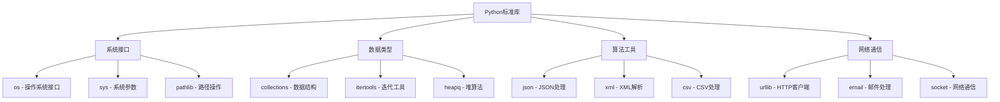

# 4.1 标准库

## 🎯 核心理念

标准库是Python的"武器库"。它是一个"电池内置"的设计哲学 - 开发者不需要为了简单的任务重新发明轮子，而是可以专注于业务逻辑的创新。

### 🏗️ 标准库分类架构



## 🎨 核心库深度应用

### 💡 数据处理库组合使用

```python
import os
import json
import csv
import xml.etree.ElementTree as ET
from datetime import datetime, timedelta
from pathlib import Path
from collections import Counter, defaultdict, deque
from itertools import chain, groupby, combinations

class StandardLibraryExamples:
    """标准库综合应用示例"""
    
    @staticmethod
    def file_processing_pipeline():
        """文件处理管道"""
        
        # ✅ 使用pathlib进行路径操作
        class FileProcessor:
            def __init__(self, source_dir: Path, output_dir: Path):
                self.source_dir = Path(source_dir)
                self.output_dir = Path(output_dir)
                self.output_dir.mkdir(exist_ok=True)
            
            def process_csv_files(self):
                """处理CSV文件"""
                csv_files = list(self.source_dir.glob("*.csv"))
                
                for csv_file in csv_files:
                    output_file = self.output_dir / f"processed_{csv_file.name}"
                    
                    with open(csv_file, 'r', encoding='utf-8') as infile:
                        reader = csv.DictReader(infile)
                        rows = list(reader)
                    
                    # 数据处理 - 统计各字段值
                    field_stats = defaultdict(Counter)
                    for row in rows:
                        for field, value in row.items():
                            field_stats[field][value] += 1
                    
                    # 输出为JSON
                    stats_data = {
                        'file': str(csv_file),
                        'total_rows': len(rows),
                        'field_statistics': dict(field_stats),
                        'processed_at': datetime.now().isoformat()
                    }
                    
                    with open(output_file.with_suffix('.json'), 'w') as outfile:
                        json.dump(stats_data, outfile, indent=2, ensure_ascii=False)
        
        # ✅ 使用deque进行高效数据处理
        class DataBuffer:
            """数据缓冲区"""
            
            def __init__(self, max_size=1000):
                self.buffer = deque(maxlen=max_size)
                self.stats = Counter()
            
            def add_data(self, item):
                """添加数据"""
                self.buffer.append(item)
                self.stats[item['type']] += 1
            
            def process_batch(self):
                """批量处理数据"""
                if not self.buffer:
                    return []
                
                # 按类型分组
                grouped_data = defaultdict(list)
                for item in self.buffer:
                    grouped_data[item['type']].append(item)
                
                # 处理每种类型的数据
                results = []
                for data_type, items in grouped_data.items():
                    if data_type == 'temperature':
                        avg_temp = sum(item['value'] for item in items) / len(items)
                        results.append({'type': 'temperature_avg', 'value': avg_temp})
                    elif data_type == 'pressure':
                        max_pressure = max(item['value'] for item in items)
                        results.append({'type': 'max_pressure', 'value': max_pressure})
                
                return results
```

### 🔧 系统接口与进程管理

```python
import subprocess
import signal
import threading
from typing import List, Dict

class SystemInterfaceManagement:
    """系统接口管理"""
    
    @staticmethod
    def process_monitoring():
        """进程监控系统"""
        
        class ProcessMonitor:
            """进程监控器"""
            
            def __init__(self):
                self.running_processes = {}
                self.stop_event = threading.Event()
            
            def start_process(self, command: List[str], name: str) -> bool:
                """启动进程"""
                try:
                    process = subprocess.Popen(
                        command,
                        stdout=subprocess.PIPE,
                        stderr=subprocess.PIPE,
                        text=True
                    )
                    
                    self.running_processes[name] = {
                        'process': process,
                        'command': command,
                        'start_time': datetime.now()
                    }
                    
                    print(f"启动进程 {name}: PID {process.pid}")
                    return True
                    
                except Exception as e:
                    print(f"启动进程失败: {e}")
                    return False
            
            def monitor_processes(self):
                """监控进程状态"""
                while not self.stop_event.is_set():
                    dead_processes = []
                    
                    for name, info in self.running_processes.items():
                        process = info['process']
                        
                        # 检查进程状态
                        poll = process.poll()
                        if poll is not None:
                            print(f"进程 {name} 已结束: 退出代码 {poll}")
                            dead_processes.append(name)
                        
                        # 检查运行时间
                        runtime = datetime.now() - info['start_time']
                        if runtime > timedelta(minutes=5):
                            print(f"进程 {name} 运行超过5分钟")
                    
                    # 清理结束的进程
                    for name in dead_processes:
                        del self.running_processes[name]
                    
                    threading.Event().wait(10)  # 等待10秒
            
            def stop_all_processes(self):
                """停止所有进程"""
                print("停止所有进程...")
                
                for name, info in self.running_processes.items():
                    try:
                        info['process'].terminate()
                        print(f"终止进程 {name}")
                    except Exception as e:
                        print(f"终止进程失败: {e}")
                
                self.stop_event.set()

# ✅ 网络通信示例
class NetworkCommunication:
    """网络通信示例"""
    
    @staticmethod
    def http_client_example():
        """HTTP客户端示例"""
        import urllib.request
        import urllib.parse
        import urllib.error
        
        def fetch_url_with_retry(url, max_retries=3):
            """带重试的URL获取"""
            for attempt in range(max_retries):
                try:
                    with urllib.request.urlopen(url, timeout=10) as response:
                        return response.read().decode('utf-8')
                        
                except urllib.error.URLError as e:
                    print(f"尝试 {attempt + 1} 失败: {e}")
                    if attempt == max_retries - 1:
                        raise
            
            return None
        
        # 测试HTTP客户端
        test_urls = [
            "https://httpbin.org/json",
            "https://httpbin.org/delay/2",
        ]
        
        for url in test_urls:
            try:
                content = fetch_url_with_retry(url)
                print(f"成功获取 {url}: {len(content)} 字节")
            except Exception as e:
                print(f"获取失败: {e}")
```

### 🎯 综合项目应用

```python
class ProjectTemplateGenerator:
    """项目模板生成器 - 展示标准库综合应用"""
    
    def __init__(self, project_name: str, template_type: str = "web"):
        self.project_name = project_name
        self.template_type = template_type
        self.project_path = Path(project_name)
        
    def generate_project(self):
        """生成项目结构"""
        
        # ✅ 创建项目目录结构
        directories = [
            self.project_path,
            self.project_path / "src",
            self.project_path / "tests",
            self.project_path / "docs",
            self.project_path / "data",
        ]
        
        for directory in directories:
            directory.mkdir(exist_ok=True)
            print(f"创建目录: {directory}")
        
        # ✅ 生成配置文件
        config_files = {
            'requirements.txt': self._generate_requirements(),
            'pyproject.toml': self._generate_pyproject(),
            'README.md': self._generate_readme(),
            'main.py': self._generate_main_script(),
        }
        
        for filename, content in config_files.items():
            filepath = self.project_path / filename
            with open(filepath, 'w', encoding='utf-8') as f:
                f.write(content)
            print(f"创建文件: {filepath}")
    
    def _generate_requirements(self) -> str:
        """生成requirements.txt"""
        if self.template_type == "web":
            return """
fastapi==0.104.0
uvicorn==0.24.0
pydantic==2.5.0
pytest==7.4.0
black==23.0.0
flake8==6.0.0
"""
        else:
            return """
pandas==2.1.0
numpy==1.24.0
matplotlib==3.7.0
pytest==7.4.0
"""
    
    def _generate_pyproject(self) -> str:
        """生成pyproject.toml"""
        return f"""
[tool.poetry]
name = "{self.project_name}"
version = "0.1.0"
description = "Python project generated from template"
authors = ["Developer <dev@example.com>"]

[build-system]
requires = ["poetry-core"]
build-backend = "poetry.core.masonry.api"

[tool.black]
line-length = 88
target-version = ['py39']

[tool.pytest.ini_options]
testpaths = ["tests"]
python_files = ["test_*.py"]
"""
    
    def _generate_readme(self) -> str:
        """生成README.md"""
        return f"""# {self.project_name}

## 项目描述
这是一个使用Python标准库构建的{self.template_type}项目。

## 安装依赖
```bash
pip install -r requirements.txt
```

## 运行项目
```bash
python main.py
```

## 测试
```bash
pytest
```
"""
    
    def _generate_main_script(self) -> str:
        """生成主脚本"""
        if self.template_type == "web":
            return '''from fastapi import FastAPI
from pathlib import Path

app = FastAPI(title="Python项目")

@app.get("/")
def read_root():
    return {"message": "Hello World", "project_path": str(Path.cwd())}

if __name__ == "__main__":
    import uvicorn
    uvicorn.run(app, host="0.0.0.0", port=8000)
'''
        else:
            return '''import os
from pathlib import Path
from datetime import datetime

def main():
    print(f"项目启动时间: {datetime.now()}")
    print(f"当前工作目录: {Path.cwd()}")
    print(f"Python版本: {os.sys.version}")

if __name__ == "__main__":
    main()
'''

# 测试项目生成器
generator = ProjectTemplateGenerator("demo_project", "web")
generator.generate_project()
```

## 🧪 标准库练习

### 📝 练习1：日志分析工具

**任务**：使用标准库构建日志分析工具

```python
import re
from collections import defaultdict
from datetime import datetime

class LogAnalyzer:
    """日志分析器"""
    
    def __init__(self):
        self.log_patterns = {
            'error': r'ERROR',
            'warning': r'WARN',
            'info': r'INFO',
            'debug': r'DEBUG'
        }
    
    def analyze_log_file(self, filepath: Path):
        """分析日志文件"""
        stats = defaultdict(int)
        error_messages = []
        
        with open(filepath, 'r') as f:
            for line_num, line in enumerate(f, 1):
                for level, pattern in self.log_patterns.items():
                    if re.search(pattern, line, re.IGNORECASE):
                        stats[level] += 1
                        if level == 'error':
                            error_messages.append((line_num, line.strip()))
        
        return {
            'statistics': dict(stats),
            'error_lines': error_messages[:10]  # 只返回前10个错误
        }

# 使用示例
analyzer = LogAnalyzer()
# results = analyzer.analyze_log_file("app.log")
```

## 🔗 知识连接

- **并发编程**：[[3.3 并发编程]] - 标准库中的并发工具
- **第三方库**：[[4.2 第三方库]] - 标准库的扩展
- **项目架构**：[[4.3 项目架构]] - 标准库在项目中的应用

## 💡 费曼检验

**向新同事解释：为什么说Python标准库体现了"电池内置"的设计哲学？如何选择合适的标准库工具？**

核心要点：
1. **不重新发明轮子**：标准库提供了常用功能，无需外部依赖
2. **一致性设计**：所有标准库模块遵循相同的设计原则
3. **性能优化**：标准库是C实现的，性能优秀
4. **学习资源**：理解标准库是成为Python专家的必经之路

---

📚 **扩展阅读**：
- [[⚡ 快速概念辞典]] - "标准库"、"模块"等术语
- [[🗺️ Python学习全景图]] - 整体学习架构

🎯 **下个目标**：学习[[4.2 第三方库]]中的生态系统
