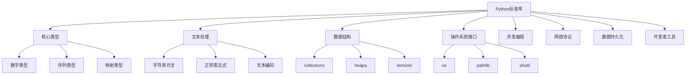

# 4.1 标准库深度应用

## 🎯 核心理念

Python标准库是"自给自足的宝库"。熟练运用标准库，能让我们用最少的依赖解决最多的问题，体现了"自带电池"的Python哲学。

### 🌟 标准库功能分类



## 🚀 深度应用实践

### 💡 核心模块深度探索

```python
# ✅ 系统交互模块
import os
import sys
import platform
import subprocess
import pathlib
import shutil

class SystemInteractionModules:
    """系统交互模块深度使用"""
    
    @staticmethod
    def os_module_mastery():
        """os模块精通"""
        
        # ✅ 环境变量和路径
        home = os.path.expanduser("~")
        current_dir = os.getcwd()
        sep = os.path.sep
        
        print(f"用户目录: {home}")
        print(f"当前目录: {current_dir}")
        print(f"路径分隔符: '{sep}'")
        
        # ✅ 文件系统操作
        try:
            # 目录操作
            new_dir = "test_dir"
            if not os.path.exists(new_dir):
                os.makedirs(new_dir)
            
            # 文件操作
            test_file = os.path.join(new_dir, "test.txt")
            with open(test_file, "w") as f:
                f.write("测试内容")
            
            # 显示文件信息
            stat_info = os.stat(test_file)
            print(f"文件大小: {stat_info.st_size} 字节")
            print(f"修改时间: {stat_info.st_mtime}")
            
            # 清理
            os.remove(test_file)
            os.rmdir(new_dir)
            
        except OSError as e:
            print(f"文件系统操作错误: {e}")
    
    @staticmethod
    def pathlib_modern_approach():
        """pathlib现代路径处理"""
        
        # ✅ pathlib对象创建和操作
        current = pathlib.Path(".")
        home = pathlib.Path.home()
        test_path = pathlib.Path("test_file.txt")
        
        # 创建测试文件
        test_path.write_text("这是用pathlib处理的文件", encoding='utf-8')
        
        print(f"当前目录内容:")
        for item in current.iterdir():
            if item.name.startswith("test"):
                print(f"  {item.name}: {item.stat().st_size} 字节")
        
        # ✅ 路径操作
        backup_path = test_path.with_suffix(".bak")
        shutil.copy2(test_path, backup_path)
        
        # 处理相对路径和绝对路径
        abs_path = test_path.resolve()
        print(f"绝对路径: {abs_path}")
        print(f"文件存在: {test_path.exists()}")
        
        # 清理
        test_path.unlink()
        backup_path.unlink()

# ✅ 数据结构增强模块
from collections import Counter, defaultdict, deque, namedtuple, OrderedDict
from collections.abc import MutableMapping

class CollectionsModulesPro:
    """collections模块专业应用"""
    
    @staticmethod
    def counter_analytics():
        """Counter数据分析"""
        
        # ✅ 文本分析
        text = "python programming is powerful and python is elegant"
        word_counts = Counter(text.split())
        
        print(f"词频统计: {word_counts}")
        print(f"最常用词: {word_counts.most_common(3)}")
        
        # ✅ 频率分析
        chars = Counter("hello world")
        print(f"字符频率: {chars}")
        print(f"总字符数: {sum(chars.values())}")
        print(f"唯一字符: {len(chars)}")
    
    @staticmethod
    def defaultdict_patterns():
        """defaultdict使用模式"""
        
        # ✅ 嵌套字典
        nested_dict = defaultdict(dict)
        nested_dict["user"]["name"] = "Alice"
        nested_dict["user"]["age"] = 25
        
        print(f"嵌套字典: {dict(nested_dict)}")
        
        # ✅ 分组操作
        people = [
            {"name": "Alice", "department": "Engineering"},
            {"name": "Bob", "department": "Engineering"},
            {"name": "Charlie", "department": "Sales"}
        ]
        
        dept_groups = defaultdict(list)
        for person in people:
            dept_groups[person["department"]].append(person["name"])
        
        print(f"按部门分组: {dict(dept_groups)}")
    
    @staticmethod
    def deque_efficient_operations():
        """deque高效操作"""
        
        # ✅ 双向队列操作
        dq = deque([1, 2, 3, 4, 5])
        
        # 两端操作
        dq.appendleft(0)
        dq.append(6)
        print(f"添加元素后: {list(dq)}")
        
        # 滑动窗口模拟
        window_size = 3
        window = deque(maxlen=window_size)
        
        # 模拟滑动窗口
        for i in range(10):
            window.append(i)
            if len(window) == window_size:
                print(f"窗口 {i-2}: {list(window)}")

# ✅ 日期时间处理
from datetime import datetime, timedelta, timezone
import time

class DateTimeMastery:
    """日期时间处理精通"""
    
    @staticmethod
    def datetime_operations():
        """datetime操作"""
        
        # ✅ 基本datetime操作
        now = datetime.now()
        utc_now = datetime.now(timezone.utc)
        
        print(f"本地时间: {now}")
        print(f"UTC时间: {utc_now}")
        
        # ✅ 时间格式化
        formatted = now.strftime("%Y-%m-%d %H:%M:%S")
        iso_format = now.isoformat()
        
        print(f"格式化时间: {formatted}")
        print(f"ISO格式: {iso_format}")
        
        # ✅ 时间计算
        tomorrow = now + timedelta(days=1)
        last_week = now - timedelta(week=1)
        
        print(f"明天: {tomorrow.date()}")
        print(f"上周: {last_week.date()}")
        
        # ✅ 时间差计算
        time_diff = tomorrow - now
        print(f"时间差: {time_diff}")
        print(f"总秒数: {time_diff.total_seconds()}")

# ✅ 文件I/O与序列化
import json
import pickle
import csv
from xml.etree import ElementTree as ET

class FileIOMastery:
    """文件I/O精通"""
    
    @staticmethod
    def json_handling():
        """JSON处理"""
        
        # ✅ JSON序列化/反序列化
        data = {
            "name": "Alice",
            "age": 30,
            "hobbies": ["编程", "读书"],
            "nested": {"email": "alice@example.com"}
        }
        
        # 序列化
        json_str = json.dumps(data, ensure_ascii=False, indent=2)
        print(f"JSON字符串:\n{json_str}")
        
        # 反序列化
        parsed_data = json.loads(json_str)
        print(f"解析结果: {parsed_data['name']}")
        
        # ✅ 文件操作
        temp_file = "temp_data.json"
        try:
            with open(temp_file, "w", encoding="utf-8") as f:
                json.dump(data, f, ensure_ascii=False, indent=2)
            
            with open(temp_file, "r", encoding="utf-8") as f:
                loaded_data = json.load(f)
            
            print(f"文件加载成功: {loaded_data['name']}")
        finally:
            if os.path.exists(temp_file):
                os.remove(temp_file)
    
    @staticmethod
    def csv_processing():
        """CSV处理"""
        
        # ✅ CSV读写
        csv_data = [
            ["姓名", "年龄", "城市"],
            ["Alice", "25", "北京"],
            ["Bob", "30", "上海"],
            ["Charlie", "28", "广州"]
        ]
        
        temp_csv = "temp_data.csv"
        try:
            # 写入CSV
            with open(temp_csv, "w", newline="", encoding="utf-8-sig") as f:
                writer = csv.writer(f)
                writer.writerows(csv_data)
            
            # 读取CSV
            with open(temp_csv, "r", encoding="utf-8-sig") as f:
                reader = csv.DictReader(f)
                for row in reader:
                    print(f"记录: {row}")
                    
        finally:
            if os.path.exists(temp_csv):
                os.remove(temp_csv)

# ✅ 网络与URL处理
import urllib.parse
import urllib.request
from urllib.error import URLError, HTTPError

class NetworkUtilities:
    """网络工具"""
    
    @staticmethod
    def url_manipulation():
        """URL处理"""
        
        # ✅ URL解析和构建
        url = "https://www.example.com:8080/path/to/page?q=python+programming&lang=zh#section"
        
        # 解析URL
        parsed = urllib.parse.urlparse(url)
        print(f"协议: {parsed.scheme}")
        print(f"域名: {parsed.netloc}")
        print(f"路径: {parsed.path}")
        print(f"查询参数: {parsed.query}")
        print(f"片段: {parsed.fragment}")
        
        # ✅ 查询参数处理
        query_params = urllib.parse.parse_qs(parsed.query)
        print(f"解析查询参教: {query_params}")
        
        # ✅ URL构建
        new_params = {"new_param": "value"}
        encoded_params = urllib.parse.urlencode(new_params)
        new_url = urllib.parse.urlunparse((parsed.scheme, parsed.netloc, 
                                           "/new/path", "", encoded_params, ""))
        print(f"构建新URL: {new_url}")

# ✅ 开发者工具
import logging
import inspect
import ast

class DeveloperTools:
    """开发者工具"""
    
    @staticmethod
    def logging_setup():
        """日志设置"""
        
        # ✅ 配置日志
        logging.basicConfig(
            level=logging.DEBUG,
            format='%(asctime)s - %(name)s - %(levelname)s - %(message)s',
            handlers=[
                logging.FileHandler('debug.log'),
                logging.StreamHandler()
            ]
        )
        
        # 创建logger
        logger = logging.getLogger('StandardLibraryExample')
        
        logger.debug("这是调试信息")
        logger.info("这是一般信息")
        logger.warning("这是警告信息")
        logger.error("这是错误信息")
    
    @staticmethod
    def code_inspection():
        """代码检查"""
        
        # ✅ 检查任意函数
        def sample_function(a, b=10, *args, **kwargs):
            """示例函数"""
            return a + b
        
        # 获取函数信息
        sig = inspect.signature(sample_function)
        print(f"函数签名: {sig}")
        print(f"参数: {list(sig.parameters.keys())}")
        print(f"默认值: {sig.parameters['b'].default}")

# 运行所有模块示例
SystemInteractionModules.os_module_mastery()
SystemInteractionModules.pathlib_modern_approach()
CollectionsModulesPro.clounter_analytics()
CollectionsModulesPro.defaultdict_patterns()
CollectionsModulesPro.deque_efficient_operations()
DateTimeMastery.datetime_operations()
FileIOMastery.json_handling()
FileIOMastery.csv_processing()
NetworkUtilities.url_manipulation()
DeveloperTools.logging_setup()
DeveloperTools.code_inspection()

## 🧪 标准库实践练习

### 📝 练习1：构建配置管理器

**任务**：使用`configparser`模块构建一个跨平台的配置管理器

```python
# ✅ 配置管理器示例
import configparser
from pathlib import Path

def create_config_manager():
    """创建配置管理器"""
    
    config = configparser.ConfigParser()
    
    # 默认配置
    config['Database'] = {
        'host': 'localhost',
        'port': '5432',
        'username': 'user',
        'password': 'pass123'
    }
    
    config['Server'] = {
        'address': '0.0.0.0',
        'port': '8080',
        'debug': 'False'
    }
    
    # 写入配置文件
    config_path = Path('config.ini')
    try:
        with open(config_path, 'w') as f:
            config.write(f)
        
        # 读取配置
        config.read(config_path)
        print(f"数据库主机: {config['Database']['host']}")
        print(f"服务器端口: {config['Server']['port']}")
        
    finally:
        config_path.unlink(missing_ok=True)
```

### 🎯 练习2：高效数据处理管道

**任务**：使用`itertools`构建高效的数据处理管道

```python
# ✅ 数据管道示例
from itertools import chain, groupby, tee

def efficient_data_pipeline():
    """高效数据处理管道"""
    
    # 数据源
    data1 = [1, 2, 3, 4, 5]
    data2 = [6, 7, 8, 9, 10]
    
    # 链式合并
    combined = list(chain(data1, data2))
    print(f"合并数据: {combined}")
    
    # 分组操作
    grouped_data = [(k, list(g)) for k, g in groupby(sorted([1,1,2,2,3,3]), key=lambda x: x)]
    print(f"分组结果: {grouped_data}")
    
    # 迭代器分割
    iter1, iter2 = tee(combined, 2)
    print(f"分割后长度: {len(list(iter1))}, {len(list(iter2))}")
```

## 🔗 知识连接

- **python哲学**：[[1.1 python语言哲学]] - "自带电池"的设计理念
- **包管理**：[[4.2 第三方库]] - 第三方库与标准库的平衡
- **项目架构**：[[4.3 架构设计与工程实践]] - 标准库在项目中的作用

## 💡 费曼检验

**解释：什么是Python"自带电池"的哲学？为什么要优先使用标准库而不是第三方库？**

核心要点：
1. **自给自足**：Python标准库提供丰富的内置功能
2. **依赖最小**：减少外部依赖，提高代码可靠性
3. **性能优化**：标准库经过优化，性能更好
4. **维护简单**：标准库随Python发布，版本兼容性好

---

🎯 **下个目标**：学习[[4.1.1 文件I-O与路径处理]]中的文件操作细节
