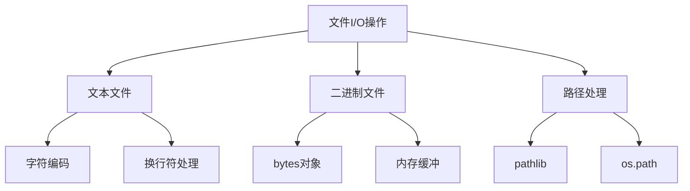

# 4.1.1 文件I-O与路径处理

## 🎯 核心理念

文件I/O是Python与外部世界交互的"桥梁"。掌握高效的文件操作技能，能让我们的程序具备持久化存储能力，实现数据的高效读写和管理。

### 🏗️ 文件I/O架构图



## 📚 基础知识

### 📁 pathlib - 现代路径处理

```python
from pathlib import Path
import os

# 创建路径对象
p = Path("/tmp/test.txt")
home = Path.home()  # 用户主目录
current = Path.cwd()  # 当前工作目录

# 路径拼接
path = Path("data") / "2023" / "files" / "report.txt"
print(path)  # data/2023/files/report.txt

# 文件信息
if p.exists():
    print(f"文件大小: {p.stat().st_size} 字节")
    print(f"修改时间: {p.stat().st_mtime}")

# 目录操作
data_dir = Path("data")
data_dir.mkdir(parents=True, exist_ok=True)

# 搜索文件
for py_file in Path("..").glob("**/*.py"):
    print(f"Python文件: {py_file}")
```

### ✅ 文件操作基本模式

```python
# 文本文件操作
text_content = "Hello, World!\nPython文件操作"

# 写入文件
with open("demo.txt", "w", encoding="utf-8") as f:
    f.write(text_content)
    f.write("\n追加内容")

# 读取文件 (多种方式)
with open("demo.txt", "r", encoding="utf-8") as f:
    content = f.read()  # 全部内容
    # content = f.readline()  # 单行
    # lines = f.readlines()  # 所有行

# 逐行读取 (推荐用于大文件)
with open("demo.txt", "r", encoding="utf-8") as f:
    for line in f:
        print(line.strip())

# 二进制文件操作
binary_data = b'\x48\x65\x6c\x6c\x6f'  # "Hello"
with open("demo.bin", "wb") as f:
    f.write(binary_data)

with open("demo.bin", "rb") as f:
    data = f.read()
```

### 🔄 高效文件处理策略

```python
import shutil
import tempfile
from contextlib import contextmanager

def process_large_file(source: Path, target: Path):
    """处理大文件的高效方法"""
    temp_file = None
    
    try:
        # 创建临时文件
        with tempfile.NamedTemporaryFile(mode='w', delete=False, suffix='.tmp') as temp:
            temp_file = temp.name
            
            # 逐块处理
            with open(source, buffer_size=8192) as src:
                with open(temp_file, 'w') as dst:
                    for chunk in iter(lambda: src.read(8192), ''):
                        processed_chunk = transform_data(chunk)
                        dst.write(processed_chunk)
            
            # 原子性替换
            shutil.move(temp_file, target)
            
    except Exception as e:
        if temp_file and os.path.exists(temp_file):
            os.unlink(temp_file)
        raise e

def transform_data(chunk: str) -> str:
    """数据处理逻辑"""
    return chunk.upper()

# 使用上下文管理器
@contextmanager
def safe_file_operation(filepath: Path, mode: str = "w"):
    """安全的文件操作上下文管理器"""
    backup_path = None
    original_path = Path(filepath)
    
    try:
        # 备份原文件
        if original_path.exists():
            backup_path = original_path.with_suffix('.backup')
            shutil.copy2(original_path, backup_path)
        
        # 执行操作
        yield original_path
        
    except Exception as e:
        # 恢复备份
        if backup_path and backup_path.exists():
            shutil.move(backup_path, original_path)
        raise e
```

## 🚀 进阶技巧

### 🌐 异步文件操作

```python
import aiofiles
import asyncio
from typing import AsyncGenerator

async def async_file_processor(file_paths: list[Path]) -> AsyncGenerator[str, None]:
    """异步文件处理器"""
    for file_path in file_paths:
        if file_path.suffix == ".txt":
            async with aiofiles.open(file_path, 'r', encoding='utf-8') as f:
                content = await f.read()
                yield f"处理完成: {file_path.name}, 内容长度: {len(content)}"

# 并发处理多个文件
async def concurrent_file_analysis():
    files = [
        Path("data1.txt"),
        Path("data2.txt"), 
        Path("data3.txt")
    ]
    
    tasks = []
    async for result in async_file_processor(files):
        tasks.append(result)
        print(result)

# 运行异步任务
asyncio.run(concurrent_file_analysis())
```

### 📊 日志文件轮转

```python
import logging.handlers
from datetime import datetime

def setup_rotating_logger(log_file: Path, max_bytes: int = 10*1024*1024, backup_count: int = 5):
    """设置轮转日志"""
    logger = logging.getLogger('app')
    logger.setLevel(logging.INFO)
    
    handler = logging.handlers.RotatingFileHandler(
        log_file,
        maxBytes=max_bytes,
        backupCount=backup_count
    )
    
    formatter = logging.Formatter(
        '%(asctime)s - %(name)s - %(levelname)s - %(message)s'
    )
    handler.setFormatter(formatter)
    logger.addHandler(handler)
    
    return logger

# 使用示例
logger = setup_rotating_logger(Path("app.log"))
logger.info("应用程序启动")
logger.warning("内存使用率过高")
logger.error("连接数据库失败")
```

### 🔐 文件加密与压缩

```python
import zipfile
import gzip
import cryptography.fernet

class SecureFileManager:
    """安全文件管理器"""
    
    def __init__(self, password: str):
        from cryptography.fernet import Fernet
        key = Fernet.generate_key()
        self.cipher = Fernet(key)
    
    def encrypt_file(self, file_path: Path) -> Path:
        """加密文件"""
        encrypted_path = file_path.with_suffix('.enc')
        
        with open(file_path, 'rb') as src:
            data = src.read()
        
        encrypted_data = self.cipher.encrypt(data)
        
        with open(encrypted_path, 'wb') as dst:
            dst.write(encrypted_data)
            
        return encrypted_path
    
    def decrypt_file(self, encrypted_path: Path) -> Path:
        """解密文件"""
        decrypted_path = encrypted_path.with_suffix('')
        
        with open(encrypted_path, 'rb') as src:
            encrypted_data = src.read()
        
        data = self.cipher.decrypt(encrypted_data)
        
        with open(decrypted_path, 'wb') as dst:
            dst.write(data)
            
        return decrypted_path

# 压缩文件工具
def compress_directory(source_dir: Path, archive_path: Path):
    """压缩目录"""
    with zipfile.ZipFile(archive_path, 'w', zipfile.ZIP_DEFLATED) as zipf:
        for file_path in source_dir.rglob('*'):
            if file_path.is_file():
                arcname = file_path.relative_to(source_dir.parent)
                zipf.write(file_path, arcname)
```

## 💡 最佳实践

### 🎯 错误处理与恢复

```python
from typing import Protocol
import json

class FileProcessor(Protocol):
    """文件处理协议"""
    def can_process(self, file_path: Path) -> bool: ...
    def process(self, file_path: Path) -> dict: ...

class TextFileProcessor:
    def can_process(self, file_path: Path) -> bool:
        return file_path.suffix in ['.txt', '.md']
    
    def process(self, file_path: Path) -> dict:
        with open(file_path, 'r', encoding='utf-8') as f :
            content = f.read()
            return {
                'lines': content.count('\n'),
                'words': len(content.split()),
                'bytes': len(content.encode('utf-8'))
            }

# 重试机制
import time
from functools import wraps

def retry_on_io_error(max_retries: int = 3):
    """IO错误重试装饰器"""
    def decorator(func):
        @wraps(func)
        def wrapper(*_args, **kwargs):
            last_exception = None
            
            for attempt in range(max_retries + 1):
                try:
                    return func(*args, **kwargs)
                except (OSError, IOError) as e:
                    last_exception = e
                    if attempt < max_retries:
                        print(f"重试第 {attempt + 1} 次: {e}")
                        time.sleep(2 ** attempt)  # 指数退避
                        continue
                    raise last_exception
            
            return wrapper
        return decorator

@retry_on_io_error()
def resilient_file_operation(file_path: Path):
    """具有重试机制的文件操作"""
    with open(file_path, 'r', encoding='utf-8') as f:
        return f.read()
```

## 🔧 实用工具

### 📝 文件监控器

```python
import watchdog
from watchdog.observers import Observer
from watchdog.events import FileSystemEventHandler

class FileChangeHandler(FileSystemEventHandler):
    """文件变化处理器"""
    
    def __init__(self, callback_func):
        self.callback = callback_func
    
    def on_modified(self, event):
        if not event.is_directory:
            self.callback(event.src_path)
    
    def on_created(self, event):
        if not event.is_directory:
            self.callback(f"新建文件: {event.src_path}")
    
    def on_deleted(self, event):
        if not event.is_directory:
            self.callback(f"删除文件: {event.src_path}")

# 文件监控工具类
class FileMonitor:
    def __init__(self, watch_path: Path):
        self.watch_path = Path(watch_path)
        self.observer = Observer()
        self.handler = None
    
    def start_monitoring(self, callback_func):
        """开始监控文件变化"""
        self.handler = FileChangeHandler(callback_func)
        self.observer.schedule(self.handler, str(self.watch_path), recursive=True)
        self.observer.start()
        print(f"开始监控目录: {self.watch_path}")
    
    def stop_monitoring(self):
        """停止监控"""
        if self.observer:
            self.observer.stop()
            print("停止文件监控")
```

### 📊 文件大小分析器

```python
def analyze_directory_size(directory: Path) -> dict:
    """分析目录大小"""
    size_info = {
        'total_size': 0,
        'file_count': 0,
        'directory_count': 0,
        'largest_files': [],
        'by_extension': {}
    }
    
    def scan_directory(path: Path):
        if path.is_file():
            file_size = path.stat().st_size
            size_info['total_size'] += file_size
            size_info['file_count'] += 1
            
            # 记录最大文件
            size_info['largest_files'].append((path.name, file_size))
            
            # 按扩展名分类
            ext = path.suffix.lower()
            if ext not in size_info['by_extension']:
                size_info['by_extension'][ext] = {'size': 0, 'count': 0}
            size_info['by_extension'][ext]['size'] += file_size
            size_info['by_extension'][ext]['count'] += 1
            
        elif path.is_dir():
            size_info['directory_count'] += 1
            for child in path.iterdir():
                scan_directory(child)
    
    scan_directory(directory)
    
    # 排序最大文件
    size_info['largest_files'].sort(key=lambda x: x[1], reverse=True)
    size_info['largest_files'] = size_info['largest_files'][:10]
    
    return size_info

# 使用示例
analysis = analyze_directory_size(Path("./data"))
print(f"总大小: {analysis['total_size'] / 1024 / 1024:.2f} MB")
print(f"文件数量: {analysis['file_count']}")
print("最大的文件:")
for name, size in analysis['largest_files']:
    print(f"  {name}: {size / 1024:.2f} KB")
```

## 🎯 学习实践

### 🧪 路径处理练习

**目标：** 实现一个智能的文件整理工具

```python
def organize_files(source_dir: Path, organize_rules: dict):
    """智能文件整理工具"""
    for file_path in source_dir.rglob('*'):
        if file_path.is_file():
            # 根据规则重新组织文件
            for rule_pattern, target_category in organize_rules.items():
                if file_path.suffix in rule_pattern:
                    target_dir = source_dir / target_category
                    target_dir.mkdir(exist_ok=True)
                    
                    target_path = target_dir / file_path.name
                    
                    # 处理重名文件
                    counter = 1
                    while target_path.exists():
                        stem = file_path.stem
                        suffix = file_path.suffix
                        target_path = target_dir / f"{stem}_{counter}{suffix}"
                        counter += 1
                    
                    shutil.move(str(file_path), str(target_path))
                    print(f"移动文件: {file_path.name} -> {target_category}/")

# 整理规则
organize_rules = {
    ('.jpg', '.png', '.gif'): '图片',
    ('.mp4', '.avi', '.mkv'): '视频',
    ('.pdf', '.doc', '.docx'): '文档',
    ('.zip', '.rar', '.7z'): '压缩包'
}

organize_files(Path("Downloads"), organize_rules)
```

文件I/O与路径处理是Python底层操作的重要组成部分。掌握这些技能，能让我们构建更加健壮、高效的应用程序！