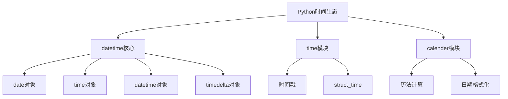

# 4.1.2 日期时间处理精要

## 🎯 核心理念

时间就是数据，时间是生命线。在Python的世界里，时间处理不仅仅是简单的日期计算，更是连接过去、现在和未来的"时间机器"。掌握时间处理，让我们能在数据流中找到时间的旋律。

### 🏗️ 时间处理架构



## 📚 核心模块详解

### 📅 datetime模块 - 时间的基石

```python
from datetime import datetime, date, time, timedelta, timezone
import time

# 获取当前时间
now = datetime.now()
today = date.today()
current_time = datetime.now().time()

print(f"现在: {now}")
print(f"今天: {today}")
print(f"当前时间: {current_time}")

# 时间对象创建
birthday = date(1990, 5, 15)
meeting_time = datetime(2023, 12, 25, 14, 30, 0)
alarm = time(7, 0, 0)

print(f"生日: {birthday}")
print(f"会议时间: {meeting_time}")
print(f"闹钟时间: {alarm}")

# 时区处理
utc_now = datetime.now(timezone.utc)
bj_tz = timezone(timedelta(hours=8))
bj_time = datetime.now(bj_tz)

print(f"UTC时间: {utc_now}")
print(f"北京时间: {bj_time}")
```

### ⏱️ timedelta - 时间的算术

```python
# 时间计算
now = datetime.now()
one_hour_later = now + timedelta(hours=1)
tomorrow = now + timedelta(days=1)
next_week = now + timedelta(weeks=1, days=2)

# 时间差计算
project_start = date(2023, 1, 1)
project_end = date(2023, 12, 31)
duration = project_end - project_start

print(f"项目持续时间: {duration.days} 天")

# 复杂时间运算
from datetime import timedelta

def calculate_age(birth_date: date) -> dict:
    """计算精确年龄"""
    today = date.today()
    age_delta = today - birth_date
    
    years = age_delta.days // 365
    remaining_days = age_delta.days % 365
    months = (remaining_days / 365) * 12
    
    return {
        'years': years,
        'total_days': age_delta.days,
        'approximate_months': months + (years * 12)
    }

birth_date = date(1990, 5, 15)
age_info = calculate_age(birth_date)
print(f"年龄信息: {age_info}")
```

### 📅 dateutil库 - 时间处理的瑞士军刀

```python
from dateutil import parser, relativedelta
import pytz

# 智能日期解析
date_strings = [
    "2023-12-25",
    "Dec 25, 2023",
    "2023/12/25 14:30:00",
    "tomorrow",
    "next Monday",
    "2023-W52-1"  # ISO周
]

for ds in date_strings:
    try:
        parsed = parser.parse(ds)
        print(f"'{ds}' -> {parsed}")
    except:
        print(f"无法解析: {ds}")

# 相对时间计算
today = date.today()
next_month_same_day = today + relativedelta(month=today.month+1)
next_last_monday = today + relativedelta(day=1, weekday=relativedelta.MO(-1))

print(f"下月同日: {next_month_same_day}")
print(f"本月最后一个周一: {next_last_monday}")
```

## 🚀 进阶时间处理

### 🌍 时区操作专家

```python
import pytz
from zoneinfo import ZoneInfo  # Python 3.9+

def timezone_converter(dt: datetime, from_tz: str, to_tz: str) -> datetime:
    """跨时区时间转换"""
    from_zone = pytz.timezone(from_tz)
    to_zone = pytz.timezone(to_tz)
    
    # 本地化时间
    localized = from_zone.localize(dt)
    
    # 转换到目标时区
    converted = localized.astimezone(to_zone)
    
    return converted

# 使用示例
meeting_time = datetime(2023, 12, 25, 14, 30)  # 本地时间
utc_time = timezone_converter(meeting_time, 'Asia/Shanghai', 'UTC')
new_york_time = timezone_converter(meeting_time, 'Asia/Shanghai', 'America/New_York')

print(f"原始时间: {meeting_time}")
print(f"UTC时间: {utc_time}")
print(f"纽约时间: {new_york_time}")

# 处理夏令时
dst_dates = [
    datetime(2023, 3, 15, 14, 30),  # 夏令时开始前
    datetime(2023, 6, 15, 14, 30),  # 夏令时期间
    datetime(2023, 11, 15, 14, 30), # 夏令时结束后
]

for dt in dst_dates:
    ny_tz = pytz.timezone('America/New_York')
    ny_time = ny_tz.localize(dt).astimezone(pytz.utc)
    print(f"纽约时间 {dt} -> UTC {ny_time}")
```

### 📊 高性能时间序列处理

```python
class TimeSeriesProcessor:
    """高性能时间序列处理器"""
    
    def __init__(self):
        self.time_index = []
        self.data = []
    
    def add_point(self, timestamp: datetime, value: float):
        """添加数据点"""
        self.time_index.append(timestamp)
        self.data.append(value)
    
    def get_range(self, start: datetime, end: datetime) -> list:
        """获取时间范围内的数据"""
        result = []
        for i, ts in enumerate(self.time_index):
            if start <= ts <= end:
                result.append((ts, self.data[i]))
        return result
    
    def resample(self, freq: str = '1H') -> dict:
        """重采样数据"""
        # 简化实现，实际应使用pandas
        resampled = {}
        current_hour = None
        hour_data = []
        
        for i, ts in enumerate(self.time_index):
            hour_key = ts.replace(minute=0, second=0, microsecond=0)
            
            if current_hour != hour_key:
                if current_hour is not None:
                    resampled[current_hour] = sum(hour_data) / len(hour_data)
                current_hour = hour_key
                hour_data = [self.data[i]]
            else:
                hour_data.append(self.data[i])
        
        return resampled

# 使用示例
processor = TimeSeriesProcessor()
base_time = datetime(2023, 12, 25, 0, 0)

# 模拟添加小时数据
for hour in range(24):
    ts = base_time + timedelta(hours=hour)
    value = hour * 2.5 + (hour % 3) * 1.2
    processor.add_point(ts, value)

# 计算平均
hourly_avg = processor.resample('1H')
print("每小时平均值:")
for hour, avg_value in hourly_avg.items():
    print(f"{hour.strftime('%H:%M')}: {avg_value:.2f}")
```

### 🎯 时间格式化与本地化

```python
import locale
from datetime import datetime, date

def comprehensive_time_formatting():
    """全面的时间格式化展示"""
    now = datetime.now()
    
    formatting_examples = {
        'ISO格式': now.isoformat(),
        'RFC时间': now.ctime(),
        '自定义格式': now.strftime('%Y年%m月%d日 %H时%M分'),
        '12小时制': now.strftime('%I:%M %p'),
        '星期': now.strftime('今天是%A，第%W周'),
        '儒略日': now.strftime('%j天'),
        'Unix时间戳': str(int(now.timestamp())),
    }
    
    print("时间格式化示例:")
    for desc, formatted in formatting_examples.items():
        print(f"{desc:12}: {formatted}")

comprehensive_time_formatting()

# 国际化时间显示
def international_time_display():
    """国际化时间显示"""
    now = datetime.now()
    
    locales_and_formats = [
        ('zh_CN', '%Y年%m月%d日'),
        ('en_US', '%B %d, %Y'),
        ('de_DE', '%d. %B %Y'),
        ('ja_JP', '%Y年%m月%d日'),
    ]
    
    print("\n国际化时间显示:")
    for locale_name, fmt in locales_and_formats:
        try:
            # 临时设置locale
            original_locale = locale.getlocale()
            locale.setlocale(locale.LC_TIME, locale_name)
            formatted = now.strftime(fmt)
            print(f"{locale_name:6}: {formatted}")
            locale.setlocale(locale.LC_TIME, original_locale)
        except:
            print(f"{locale_name:6}: 不支持")
```

## 💡 实用时间工具

### 📅 日期计算器

```python
class DateCalculator:
    """专业日期计算器"""
    
    @staticmethod
    def get_business_days(start: date, end: date) -> int:
        """计算工作日天数"""
        business_days = 0
        current = start
        
        while current <= end:
            if current.weekday() < 5:  # 周一到周五
                business_days += 1
            current += timedelta(days=1)
        
        return business_days
    
    @staticmethod
    def get_nth_weekday_of_month(year: int, month: int, weekday: int, n: int) -> date:
        """获取某月第N个星期X"""
        first_day = date(year, month, 1)
        
        # 找到第一个目标星期几
        days_until_target = (weekday - first_day.weekday()) % 7
        first_target = first_day + timedelta(days=days_until_target)
        
        # 如果不是第一个，则推后N-1周
        if n > 1:
            first_target += timedelta(weeks=n-1)
        
        return first_target
    
    @staticmethod
    def fiscal_year_info(target_date: date) -> dict:
        """财年信息计算"""
        year = target_date.year
        month = target_date.month
        
        # 假设财年从4月开始
        if month >= 4:
            fiscal_year = year
            fiscal_start = date(year, 4, 1)
        else:
            fiscal_year = year - 1
            fiscal_start = date(year - 1, 4, 1)
        
        fiscal_end = date(fiscal_year + 1, 3, 31)
        days_in_fy = fiscal_end.day - fiscal_start.day + 1
        days_passed = (target_date - fiscal_start).days
        
        return {
            'fiscal_year': fiscal_year,
            'fiscal_start': fiscal_start,
            'fiscal_end': fiscal_end,
            'days_passed': days_passed,
            'progress_percentage': (days_passed / days_in_fy) * 100
        }

# 使用示例
calc = DateCalculator()

# 工作日计算
project_start = date(2023, 12, 1)
project_end = date(2023, 12, 31)
work_days = calc.get_business_days(project_start, project_end)
print(f"项目工作日: {work_days} 天")

# 月末计算
third_monday = calc.get_nth_weekday_of_month(2023, 12, 0, 3)
print(f"2023年12月第三个周一: {third_monday}")

# 财年信息
today_info = calc.fiscal_year_info(date.today())
print(f"财年进度: {today_info['progress_percentage']:.1f}%")
```

### 🎯 时间验证与转换工具

```python
class TimeValidator:
    """时间验证工具"""
    
    @staticmethod
    def is_leap_year(year: int) -> bool:
        """判断闰年"""
        return year % 4 == 0 and (year % 100 != 0 or year % 400 == 0)
    
    @staticmethod
    def validate_date(year: int, month: int, day: int) -> tuple[bool, str]:
        """验证日期有效性"""
        try:
            test_date = date(year, month, day)
            return True, "日期有效"
        except ValueError as e:
            return False, f"日期无效: {e}"
    
    @staticmethod
    def convert_timestamp_to_readable(timestamp: float, tz: str = 'UTC') -> str:
        """时间戳转换为可读格式"""
        dt = datetime.fromtimestamp(timestamp)
        if tz != 'UTC':
            dt = dt.replace(tzinfo=pytz.UTC).astimezone(pytz.timezone(tz))
        return dt.strftime('%Y-%m-%d %H:%M:%S %Z')
    
    @staticmethod
    def parse_duration_string(duration_str: str) -> timedelta:
        """解析持续时间字符串"""
        duration_str = duration_str.lower().strip()
        
        if not duration_str:
            return timedelta()
        
        # 支持格式: "1d 2h 30m 15s"
        pattern_map = {
            'd': 'days',
            'day': 'days',
            'days': 'days',
            'h': 'hours', 
            'hour': 'hours',
            'hours': 'hours',
            'm': 'minutes',
            'min': 'minutes',
            'minute': 'minutes',
            'minutes': 'minutes',
            's': 'seconds',
            'sec': 'seconds',
            'second': 'seconds',
            'seconds': 'seconds'
        }
        
        kwargs = {}
        import re
        
        for match in re.finditer(r'(\d+(?:\.\d+)?)\s*([a-z]+)', duration_str):
            value = float(match.group(1))
            unit = match.group(2)
            
            if unit in pattern_map:
                key = pattern_map[unit]
                kwargs[key] = kwargs.get(key, 0) + value
        
        return timedelta(**kwargs)

# 使用示例
validator = TimeValidator()

# 闰年判断
print(f"2024是闰年: {validator.is_leap_year(2024)}")
print(f"2100是闰年: {validator.is_leap_year(2100)}")

# 日期验证
is_valid, message = validator.validate_date(2023, 2, 29)
print(f"2023-02-29: {message}")

# 持续时间解析
duration = validator.parse_duration_string("2d 3h 45m 30s")
print(f"持续时间: {duration}")

# 时间戳转换
timestamp = 1703001600  # 示例时间戳
readable_time = validator.convert_timestamp_to_readable(timestamp, 'Asia/Shanghai')
print(f"可读时间: {readable_time}")
```

## 🔧 性能优化与缓存

### ⚡ 高效时间处理策略

```python
import functools
from datetime import datetime, timedelta

def cached_time_operation(ttl_seconds: int = 3600):
    """时间操作缓存装饰器"""
    def decorator(func):
        cache = {}
        
        @functools.wraps(func)
        def wrapper(*args, **kwargs):
            cache_key = str(args) + str(sorted(kwargs.items()))
            now = datetime.now()
            
            if cache_key in cache:
                result, cached_time = cache[cache_key]
                if now - cached_time < timedelta(seconds=ttl_seconds):
                    return result
            
            # 执行函数并缓存结果
            result = func(*args, **kwargs)
            cache[cache_key] = (result, now)
            
            return result
        
        return wrapper
    return decorator

@cached_time_operation(ttl_seconds=1800)  # 30分钟缓存
def expensive_time_zone_conversion(dt: datetime, target_tz: str):
    """耗时的时区转换操作"""
    # 模拟复杂的时区转换计算
    import time
    time.sleep(0.1)  # 模拟延迟
    
    target_timezone = pytz.timezone(target_tz)
    return dt.astimezone(target_timezone)

# 批量时间处理
def batch_time_process(dates: list[date], operation_func) -> list:
    """批量处理时间数据"""
    results = []
    
    for dt in dates:
        try:
            result = operation_func(dt)
            results.append(result)
        except Exception as e:
            print(f"处理时间 {dt} 时出错: {e}")
            results.append(None)
    
    return results

# 时间数据压缩
def compress_time_series(time_data: list[(datetime, float)]) -> list[(datetime, float)]:
    """时间序列数据压缩"""
    if len(time_data) <= 1:
        return time_data
    
    compressed = [time_data[0]]
    threshold = 0.01  # 变化阈值
    
    for timestamp, value in time_data[1:]:
        last_value = compressed[-1][1]
        
        if abs(value - last_value) >= threshold:
            compressed.append((timestamp, value))
    
    return compressed
```

时间处理的艺术在于理解时间的本质 - 它既是数据的维度，也是生命的度量。掌握Python的时间处理技巧，让我们能在数据的海洋中，精确地定位时间的坐标！