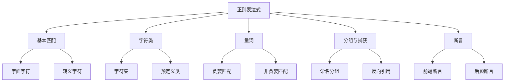

# 4.1.3 正则表达式实战

## 🎯 核心理念

正则表达式是文本处理领域的"魔法定律"。它通过模式匹配的方式，让我们能够精确地捕获、替换和验证文本中的各种结构，是数据清洗、文本分析和自动化处理的强大工具。

### 🏗️ 正则表达式架构



## 📚 核心语法与模式

### 🔤 基础匹配模式

```python
import re

# 基础匹配
text = "Hello World! This is Python 2023."

# 精确匹配
pattern = r"Python"
match = re.search(pattern, text)
print(f"找到: {match.group()}" if match else "未找到")

# 字符类匹配
phone_pattern = r'\d{3}-\d{3}-\d{4}'
phone_text = "我的电话号码是: 138-6789-1234"
phone_match = re.search(phone_pattern, phone_text)
print(f"电话号码: {phone_match.group()}")

# 不区分大小写匹配
email_pattern = r'\b[A-Za-z0-9._%+-]+@[A-Za-z0-9.-]+\.[A-Z]{2,}\b'
email_text = "我的邮箱是 User.Name@example.com，欢迎联系！"
email_match = re.search(email_pattern, email_text, re.IGNORECASE)
print(f"邮箱: {email_match.group()}")

# 多行匹配
multiline_text = """这是第一行
这是第二行
这是第三行"""

line_pattern = r'^这是'
matches = re.findall(line_pattern, multiline_text, re.MULTILINE)
print(f"找到行的开头: {matches}")
```

### 🎯 字符类与量词组合

```python
# 复杂字符类匹配
def validate_password_strength(password: str) -> dict:
    """密码强度验证"""
    patterns = {
        'lowercase': r'[a-z]',
        'uppercase': r'[A-Z]', 
        'digits': r'[0-9]',
        'special': r'[!@#$%^&*(),.?":{}|<>]',
        'length': r'.{8,}'
    }
    
    results = {}
    for check_name, pattern in patterns.items():
        matches = re.search(pattern, password)
        results[check_name] = bool(matches)
    
    strength_score = sum(results.values())
    results['strength_score'] = strength_score
    
    return results

passwords = [
    "password123",
    "Password123!",
    "weak",
    "SuperStrong123!"
]

for pwd in passwords:
    result = validate_password_strength(pwd)
    print(f"密码 '{pwd}': 强度 {result['strength_score']}/5")

# 贪婪 vs 非贪婪匹配
html_text = '<div>内容1</div><div>内容2</div>'

# 贪婪匹配
greedy_pattern = r'<div>.*</div>'
greedy_match = re.search(greedy_pattern, html_text)
print(f"\n贪婪匹配: {greedy_match.group()}")

# 非贪婪匹配
non_greedy_pattern = r'<div>.*?</div>'
non_greedy_matches = re.findall(non_greedy_pattern, html_text)
print(f"非贪婪匹配: {non_greedy_matches}")
```

### 🏷️ 分组与捕获高级技巧

```python
# 命名分组
date_pattern = r'(?P<year>\d{4})-(?P<month>\d{1,2})-(?P<day>\d{1,2})'
date_text = "今天是2023-12-25，明天是2023-12-26"

date_matches = re.finditer(date_pattern, date_text)
for match in date_matches:
    print(f"年份: {match.group('year')}")
    print(f"月份: {match.group('month')}")
    print(f"日期: {match.group('day')}")
    print("---")

# 条件表达式
condition_pattern = r'(?:Mr\.|Ms\.|Dr\.)\s+(\w+)'
titles_text = "Mr. Smith, Ms. Johnson, Dr. Brown, John Doe"
title_matches = re.findall(condition_pattern, titles_text)
print(f"称谓匹配: {title_matches}")

# 反向引用验证
# 寻找重复单词
duplicate_word_pattern = r'\b(\w+)\b(?=.*\b\1\b)'
text_with_duplicates = "the quick brown dog jumped over the lazy dog"
duplicates = re.findall(duplicate_word_pattern, text_with_duplicates, re.IGNORECASE)
print(f"重复单词: {set(duplicates)}")

# 验证HTML标签配对
def validate_html_tags(html: str) -> bool:
    """验证HTML标签是否正确配对"""
    # 匹配所有标签
    tag_pattern = r'<(?:/?)(?:[a-zA-Z][a-zA-Z0-9]*)\b[^>]*>'
    tags = re.findall(tag_pattern, html)
    
    stack = []
    for tag in tags:
        if tag.startswith('</'):
            # 结束标签
            tag_name = re.match(r'</([a-zA-Z0-9]+)', tag).group(1).lower()
            if not stack or stack.pop() != tag_name:
                return False
        elif not tag.endswith('/>'):
            # 开始标签
            tag_name = re.match(r'<([a-zA-Z0-9]+)', tag).group(1).lower()
            stack.append(tag_name)
    
    return len(stack) == 0

html_examples = [
    "<div><p>Hello</p></div>",  # 正确
    "<div><p>Hello</div>",       # 错误
    "",    # 正确
]

for html in html_examples:
    is_valid = validate_html_tags(html)
    print(f"HTML '{html}' 标签配对: {'正确' if is_valid else '错误'}")
```

## 🚀 进阶正则技巧

### 🎯 零宽断言实战

```python
# 前瞻断言 - 查找前面的模式
def extract_numbers_before_unit(text: str) -> list[str]:
    """提取单位前的数字"""
    # 匹配一个数字，后面紧跟着单位
    pattern = r'\d+(?=\s*(?:kg|lb|m|cm|ft|in))'
    numbers = re.findall(pattern, text)
    return numbers

measurements = "这个箱子重25 kg，长30 ft，宽20 cm"
nums = extract_numbers_before_unit(measurements)
print(f"单位前的数字: {nums}")

# 负前瞻断言 - 排除特定模式  
def extract_non_currencies(text: str) -> list[str]:
    """提取非货币的数字"""
    # 匹配数字，但不在$符号后
    pattern = r'(?<!\$)\b\d+\b'
    numbers = re.findall(pattern, text)
    return numbers

money_text = "这个物品$50，价格30，汇率$1.2"
non_currency_nums = extract_non_currencies(money_text)
print(f"非货币数字: {non_currency_nums}")

# 后顾断言 - 查找后面的模式
def extract_titles_before_colon(text: str) -> list[str]:
    """提取冒号前的标题"""
    pattern = r'.*?(?=:)'
    titles = re.findall(pattern, text)
    return titles

title_text = "用户手册:介绍,第1章:开始,第2章:进阶"
titles = extract_titles_before_colon(title_text)
print(f"冒号前的标题: {titles}")

# 负后顾断言
def extract_words_not_after_numbers(text: str) -> list[str]:
    """提取不在数字后面的单词"""
    # 匹配单词，但前面不是数字
    pattern = r'(?<!\d)\b[a-zA-Z]+\b'
    words = re.findall(pattern, text)
    return words

mixed_text = "我有3个苹果5个橘子和一个香蕉"
words = extract_words_not_after_numbers(mixed_text)
print(f"非数字后的单词: {words}")
```

### 🎨 模式匹配与替换专家

```python
class RegexProcessor:
    """正则表达式处理器"""
    
    @staticmethod
    def clean_html(html_text: str) -> str:
        """清理HTML标签"""
        # 移除HTML标签
        clean_pattern = r'<[^>]+>'
        cleaned = re.sub(clean_pattern, '', html_text)
        
        # 清理多余空白
        whitespace_pattern = r'\s+'
        cleaned = re.sub(whitespace_pattern, ' ', cleaned).strip()
        
        return cleaned
    
    @staticmethod
    def extract_urls(text: str) -> list[str]:
        """提取URL"""
        url_pattern = r'https?://(?:[-\w.])+(?:[:\d]+)?(?:/(?:[\w/_.])*(?:\?(?:[\w&=%.])*)?(?:#(?:[\w.])*)?)?'
        urls = re.findall(url_pattern, url_text)
        return urls
    
    @staticmethod
    def normalize_whitespace(text: str) -> str:
        """标准化空白字符"""
        # 替换所有空白字符为标准空格
        normalized = re.sub(r'\s+', ' ', text)
        
        # 清理首尾空白
        normalized = normalized.strip()
        
        return normalized
    
    @staticmethod
    def extract_code_blocks(text: str) -> list[str]:
        """提取代码块"""
        # 匹配三引号代码块
        code_pattern = r'```[\s\S]*?```'
        code_blocks = re.findall(code_pattern, text)
        
        # 清理标记
        cleaned_blocks = []
        for block in code_blocks:
            cleaned = re.sub(r'^```.*?\n|\n```$', '', block)
            cleaned_blocks.append(cleaned.strip())
        
        return cleaned_blocks

# 使用示例
processor = RegexProcessor()

html_content = """
<html>
<head><title>测试页面</title></head>
<body>
<p>这里有<strong>重要</strong>信息</p>
</body>
</html>
"""

cleaned_html = processor.clean_html(html_content)
print(f"清理后: '{cleaned_html}'")

url_text = "访问 https://example.com 和 http://test.org/page?id=123"
urls = processor.extract_urls(url_text)
print(f"找到URL: {urls}")

code_text = """
这是一个Python函数：

```python
def hello():
    print("Hello World")
    return True
```

使用方式如上。
"""

code_blocks = processor.extract_code_blocks(code_text)
print(f"代码块: {code_blocks}")
```

### 🔄 正则表达式优化与性能

```python
import time
from functools import lru_cache

class OptimizedRegex:
    """优化的正则表达式处理器"""
    
    def __init__(self):
        self._compiled_patterns = {}
    
    @lru_cache(maxsize=128)
    def get_compiled_pattern(self, pattern: str) -> re.Pattern:
        """编译并缓存正则表达式"""
        if pattern not in self._compiled_patterns:
            self._compiled_patterns[pattern] = re.compile(pattern)
        return self._compiled_patterns[pattern]
    
    def fast_match(self, pattern: str, text: str) -> bool:
        """快速模式匹配"""
        compiled_pattern = self.get_compiled_pattern(pattern)
        return bool(compiled_pattern.search(text))
    
    def fast_findall(self, pattern: str, text: str) -> list[str]:
        """快速查找所有匹配"""
        compiled_pattern = self.get_compiled_pattern(pattern)
        return compiled_pattern.findall(text)
    
    def benchmark_pattern(self, pattern: str, text: str, iterations: int = 1000):
        """基准测试正则表达式性能"""
        # 非编译版本
        start_time = time.time()
        for _ in range(iterations):
            re.findall(pattern, text)
        non_compiled_time = time.time() - start_time
        
        # 编译版本
        compiled_pattern = self.get_compiled_pattern(pattern)
        start_time = time.time()
        for _ in range(iterations):
            compiled_pattern.findall(text)
        compiled_time = time.time() - start_time
        
        return {
            'non_compiled': non_compiled_time,
            'compiled': compiled_time,
            'improvement': (non_compiled_time - compiled_time) / non_compiled_time * 100
        }

# 性能测试示例
optimizer = OptimizedRegex()

test_pattern = r'\b[A-Za-z0-9._%+-]+@[A-Za-z0-9.-]+\.[A-Z]{2,}\b'
test_text = "联系我: user@example.com 或 admin@company.org"

benchmark_result = optimizer.benchmark_pattern(test_pattern, test_text, 1000)
print(f"性能对比:")
print(f"非编译版本: {benchmark_result['non_compiled']:.4f}秒")
print(f"编译版本: {benchmark_result['compiled']:.4f}秒") 
print(f"性能提升: {benchmark_result['improvement']:.1f}%")
```

## 💡 实用正则工具

### 🛡️ 数据验证工具

```python
class DataValidator:
    """数据验证工具集"""
    
    @staticmethod
    def validate_email(email: str) -> bool:
        """邮箱格式验证"""
        pattern = r'^[a-zA-Z0-9._%+-]+@[a-zA-Z0-9.-]+\.[a-zA-Z]{2,}$'
        return bool(re.match(pattern, email))
    
    @staticmethod
    def validate_phone(phone: str) -> dict:
        """电话号码验证"""
        patterns = {
            'chinese_mobile': r'^1[3-9]\d{9}$',
            'american': r'^\d{3}-\d{3}-\d{4}$',
            'international': r'^\+\d{1,4}\s?\d{1,14}$'
        }
        
        results = {}
        for phone_type, pattern in patterns.items():
            results[phone_type] = bool(re.match(pattern, phone))
        
        return results
    
    @staticmethod
    def validate_credit_card(card_number: str) -> tuple[bool, str]:
        """信用卡号验证(Luhn算法)"""
        # 移除空格和连字符
        clean_number = re.sub(r'[-\s]', '', card_number)
        
        if not re.match(r'^\d{13,19}$', clean_number):
            return False, "无效的信用卡号格式"
        
        # Luhn算法验证
        digits = [int(d) for d in clean_number[::-1]]
        doubled_digits = []
        
        for i, digit in enumerate(digits):
            if i % 2 == 1:
                doubled_digit = digit * 2
                if doubled_digit > 9:
                    doubled_digit = doubled_digit - 9
                doubled_digits.append(doubled_digit)
            else:
                doubled_digits.append(digit)
        
        total_sum = sum(doubled_digits)
        is_valid = total_sum % 10 == 0
        
        return is_valid, "有效" if is_valid else "无效"

# 使用示例
validator = DataValidator()

# 邮箱验证
emails = [
    "user@example.com",
    "test@domain.org",
    "invalid.email",
    "user@domain"
]

for email in emails:
    is_valid = validator.validate_email(email)
    print(f"邮箱 '{email}': {'有效' if is_valid else '无效'}")

# 电话号码验证
phones = [
    "13812345678",
    "123-456-7890", 
    "+1 555 123 4567"
]

for phone in phones:
    results = validator.validate_phone(phone)
    print(f"电话 '{phone}': {results}")

# 信用卡验证
cards = [
    "4532 1234 5678 9012",
    "4111 1111 1111 1111",
    "1234 5678 9012 3456"
]

for card in cards:
    is_valid, message = validator.validate_credit_card(card)
    print(f"信用卡 '{card}': {message}")
```

### 📊 文本分析器

```python
class TextAnalyzer:
    """基于正则表达式的文本分析器"""
    
    @staticmethod
    def extract_numbers(text: str) -> list[float]:
        """提取文本中的所有数字"""
        # 匹配整数和小数
        pattern = r'-?\d+(?:\.\d+)?'
        numbers_str = re.findall(pattern, text)
        numbers = []
        
        for num_str in numbers_str:
            try:
                numbers.append(float(num_str))
            except ValueError:
                continue
        
        return numbers
    
    @staticmethod
    def count_word_frequency(text: str) -> dict[str, int]:
        """统计单词频率"""
        # 标准化文本
        normalized_text = re.sub(r'[^\w\s]', ' ', text.lower())
        words = re.findall(r'\b[a-zA-Z]+\b', normalized_text)
        
        word_count = {}
        for word in words:
            word_count[word] = word_count.get(word, 0) + 1
        
        return word_count
    
    @staticmethod
    def extract_sentences(text: str) -> list[str]:
        """提取句子"""
        # 匹配以标点符号结尾的句子
        pattern = r'[^.!?]*[.!?]'
        sentences = re.findall(pattern, text)
        
        # 清理空白
        cleaned_sentences = []
        for sentence in sentences:
            cleaned = re.sub(r'\s+', ' ', sentence.strip())
            if cleaned:
                cleaned_sentences.append(cleaned)
        
        return cleaned_sentences
    
    @staticmethod
    def find_acronyms(text: str) -> list[str]:
        """查找首字母缩略词"""
        # 匹配大写字母组成的缩写词
        pattern = r'\b[A-Z]{2,}\b'
        acronyms = re.findall(pattern, text)
        
        # 过滤掉普通的大写单词
        common_words = {'THE', 'AND', 'OR', 'BUT', 'FOR', 'WITH'}
        filtered_acronyms = [acronym for acronym in acronyms if acronym not in common_words]
        
        return filtered_acronyms

# 使用示例
analyzer = TextAnalyzer()

sample_text = """
Python is an amazing programming language. Popular frameworks like Django, 
Flask, and FastAPI make web development efficient. Data science libraries 
include NumPy, Pandas, and Scikit-learn. AI applications use TensorFlow and PyTorch.
"""

# 提取数字
numbers = analyzer.extract_numbers(sample_text)
print(f"找到的数字: {numbers}")

# 单词频率统计
word_freq = analyzer.count_word_frequency(sample_text)
top_words = sorted(word_freq.items(), key=lambda x: x[1], reverse=True)[:5]
print(f"高频单词: {top_words}")

# 提取句子
sentences = analyzer.extract_sentences(sample_text)
print(f"句子数量: {len(sentences)}")
for i, sentence in enumerate(sentences):
    print(f"句子{i+1}: {sentence}")

# 查找缩写词
acronyms = analyzer.find_acronyms(sample_text)
print(f"缩写词: {acronyms}")
```

## 🎯 学习实践

### 🧪 正则挑战：日志解析器

```python
class LogParser:
    """正则表达式解析日志文件"""
    
    def __init__(self):
        # 解析Apache/常用网络服务器日志格式
        self.log_pattern = r'(\d+\.\d+\.\d+\.\d+) (.+) (.+) \[(.+)\] "(.*?)" (\d+) (\d+|-) "(.*?)" "(.*?)"'
    
    def parse_log_line(self, line: str) -> dict:
        """解析单条日志"""
        match = re.match(self.log_pattern, line)
        if match:
            return {
                'ip': match.group(1),
                'identity': match.group(2),
                'user': match.group(3),
                'timestamp': match.group(4),
                'request': match.group(5),
                'status': int(match.group(6)),
                'size': int(match.group(7)) if match.group(7) != '-' else 0,
                'referer': match.group(8),
                'user_agent': match.group(9)
            }
        return None
    
    def analyze_log_patterns(self, log_file_path: str) -> dict:
        """分析日志模式"""
        ip_count = {}
        status_count = {}
        request_patterns = {}
        
        with open(log_file_path, 'r', encoding='utf-8') as f:
            for line_num, line in enumerate(f, 1):
                parsed = self.parse_log_line(line.strip())
                if parsed:
                    # 统计IP
                    ip_count[parsed['ip']] = ip_count.get(parsed['ip'], 0) + 1
                    
                    # 统计状态码
                    status_count[parsed['status']] = status_count.get(parsed['status'], 0) + 1
                    
                    # 分析请求模式
                    request_type = parsed['request'].split()[0] if parsed['request'] else 'UNKNOWN'
                    request_patterns[request_type] = request_patterns.get(request_type, 0) + 1
        
        return {
            'total_requests': len(ip_count),
            'unique_ips》： len(ip_count),
            'top_ips': sorted(ip_count.items(), key=lambda x: x[1], reverse=True)[:10],
            'status_distribution': status_count,
            'request_types': request_patterns
        }

# 模拟日志数据
sample_log = """
192.168.1.1 - - [25/Dec/2023:10:30:15 +0800] "GET /index.html HTTP/1.1" 200 1234 "-" "Mozilla/5.0"
192.168.1.2 - - [25/Dec/2023:10:30:16 +0800] "POST /api/users HTTP/1.1" 201 256 "-" "Python-urllib/3.8"
192.168.1.3 - - [25/Dec/2023:10:30:17 +0800] "GET /assets/style.css HTTP/1.1" 200 567 "-" "Mozilla/5.0"
"""

with open("sample.log", "w") as f:
    f.write(sample_log)

parser = LogParser()
analysis = parser.analyze_log_patterns("sample.log")

print("日志分析结果:")
print(f"总请求数: {analysis['total_requests']}")
print(f"独立IP数: {analysis['unique_ips']}")
print("状态码分布:", analysis['status_distribution'])
print("请求类型分布:", analysis['request_types'])

# 清理测试文件
import os
os.remove("sample.log")
```

正则表达式如同文本世界的DNA，它定义了模式的结构，让我们能够精确地解读和处理任何形式的文本数据。掌握正则表达式，就是掌握了文本处理的神奇钥匙！