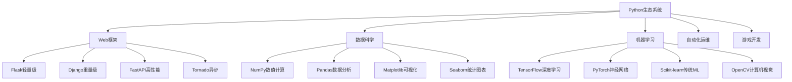

# 4.2 生态系统框架

## 🎯 核心理念

Python的生态系统是一个"万物互联的生态圈"。从简单的脚本到大型企业应用，从科学计算到机器学习，Python生态系统提供了丰富的框架和库，让开发者能够站在巨人的肩膀上构建现代应用。

### 🏗️ Python生态系统架构



## 📚 核心框架分类

### 🌐 Web开发框架生态

```python
# Flask - 轻量级微框架
from flask import Flask, request, jsonify, render_template

app = Flask(__name__)

@app.route('/api/users', methods=['GET', 'POST'])
def manage_users():
    """用户管理API"""
    if request.method == 'GET':
        # 模拟用户数据
        users = [
            {'id': 1, 'name': 'Alice', 'email': 'alice@example.com'},
            {'id': 2, 'name': 'Bob', 'email': 'bob@example.com'}
        ]
        return jsonify({'users': users})
    
    elif request.method == 'POST':
        data = request.get_json()
        # 创建新用户的逻辑
        new_user = {
            'id': 3,
            'name': data.get('name'),
            'email': data.get('email')
        }
        return jsonify({'message': '用户创建成功', 'user': new_user}), 201

# Flask性能扩展示例
from flask_limiter import Limiter
from flask_limiter.util import get_remote_address

limiter = Limiter(
    app,
    key_func=get_remote_address,
    default_limits=["200 per day", "50 per hour"]
)

@app.route('/api/limited')
@limiter.limit("10 per minute")
def rate_limited_endpoint():
    """限流保护接口"""
    return jsonify({'message': '请求成功'})

# Django风格的功能（使用Flask实现）
from flask_sqlalchemy import SQLAlchemy
from flask_wtf import FlaskForm
from wtforms import StringField, SubmitField
from wtforms.validators import DataRequired

app.config['SQLALCHEMY_DATABASE_URI'] = 'sqlite:///example.db'
db = SQLAlchemy(app)

class User(db.Model):
    id = db.Column(db.Integer, primary_key=True)
    name = db.Column(db.String(80), nullable=False)
    email = db.Column(db.String(120), unique=True, nullable=False)

class UserForm(FlaskForm):
    name = StringField('姓名', validators=[DataRequired()])
    email = StringField('邮箱', validators=[DataRequired()])
    submit = SubmitField('提交')

@app.route('/users/new', methods=['GET', 'POST'])
def create_user():
    form = UserForm()
    if form.validate_on_submit():
        user = User(name=form.name.data, email=form.email.data)
        db.session.add(user)
        db.session.commit()
        return jsonify({'message': '用户创建成功'})
    return render_template('user_form.html', form=form)
```

### 📊 数据科学框架生态

```python
# NumPy - 数值计算基础
import numpy as np

# 数组操作基础
data = np.array([1, 2, 3, 4, 5])
print(f"数组形状: {data.shape}")
print(f"数据类型: {data.dtype}")
print(f"数组求和: {np.sum(data)}")

# 高效数值运算
matrix_a = np.random.rand(1000, 1000)
matrix_b = np.random.rand(1000, 1000)

# 矩阵乘法（矢量化运算）
result_matrix = np.dot(matrix_a, matrix_b)
print(f"矩阵运算结果形状: {result_matrix.shape}")

# 科学计算示例
def solve_linear_system():
    """求解线性方程组 Ax = b"""
    # 创建系数矩阵
    A = np.array([
        [3, 2, 1],
        [1, 3, 2],
        [2, 1, 3]
    ])
    
    # 创建常数向量
    b = np.array([14, 16, 16])
    
    # 求解
    x = np.linalg.solve(A, b)
    print(f"解向量: {x}")
    
    # 验证
    verification = np.dot(A, x)
    print(f"验证结果: {verification}")
    print(f"误差: {np.max(np.abs(verification - b))}")

solve_linear_system()

# Pandas - 数据分析之王
import pandas as pd

def advanced_data_analysis():
    """高级数据分析示例"""
    # 创建示例数据
    np.random.seed(42)
    n_samples = 1000
    
    data = {
        'user_id': range(1, n_samples + 1),
        'age': np.random.normal(35, 15, n_samples),
        'income': np.random.normal(50000, 20000, n_samples),
        'spending': None,
        'category': np.random.choice(['A', 'B', 'C'], n_samples)
    }
    
    # 创建DataFrame
    df = pd.DataFrame(data)
    
    # 基于收入和年龄计算支出
    df['spending'] = df['income'] * 0.3 + df['age'] * 100 + np.random.normal(0, 5000, n_samples)
    
    # 数据清洗
    df = df[df['age'] > 0]  # 移除无效年龄
    df = df[df['income'] > 0]  # 移除负收入
    
    # 统计分析
    summary = df.describe()
    print("数据摘要:")
    print(summary)
    
    # 分组分析
    category_stats = df.groupby('category').agg({
        'income': ['mean', 'std'],
        'spending': ['mean', 'count'],
        'age': 'median'
    })
    print("\n分类统计:")
    print(category_stats)
    
    # 相关性分析
    correlation = df[['age', 'income', 'spending']].corr()
    print("\n相关性矩阵:")
    print(correlation)
    
    # 异常值检测
    def detect_outliers(series, threshold=2):
        """使用Z-score检测异常值"""
        z_scores = np.abs((series - series.mean()) / series.std())
        return z_scores > threshold
    
    income_outliers = df[detect_outliers(df['income'])]
    print(f"\n收入异常值数量: {len(income_outliers)}")
    
    return df

# 高级数据处理示例
def advanced_pandas_operations():
    """高级Pandas操作"""
    df = advanced_data_analysis()
    
    # 数据透视表
    pivot_table = pd.pivot_table(
        df, 
        values='spending', 
        index='category', 
        aggfunc=['mean', 'sum', 'count']
    )
    print("透视表:")
    print(pivot_table)
    
    # 时间序列处理（模拟）
    df['timestamp'] = pd.date_range('2023-01-01', periods=len(df), freq='H')
    df_time = df.set_index('timestamp')
    
    # 重采样分析（按天）
    daily_spending = df_time['spending'].resample('D').agg(['sum', 'mean', 'count'])
    print("\n日消费统计:")
    print(daily_spending.head())
    
    # 滑动窗口计算
    df_time['spending_ma_7'] = df_time['spending'].rolling(window=24*7).mean()
    print(f"\n7天移动平均样本: {df_time['spending_ma_7'].dropna().head()}")

advanced_pandas_operations()
```

### 🤖 机器学习框架生态

```python
# Scikit-learn - 传统机器学习
from sklearn.model_selection import train_test_split
from sklearn.ensemble import RandomForestClassifier
from sklearn.metrics import classification_report, confusion_matrix
from sklearn.preprocessing import StandardScaler

def sklearn_ml_pipeline():
    """Scikit-learn机器学习管道"""
    # 使用内置数据集
    from sklearn.datasets import load_wine
    wine_data = load_wine()
    
    X, y = wine_data.data, wine_data.target
    
    print(f"数据集形状: X={X.shape}, y={y.shape}")
    print(f"特征名称: {wine_data.feature_names[:5]}...")
    
    # 数据预处理
    X_train, X_test, y_train, y_test = train_test_split(
        X, y, test_size=0.2, random_state=42
    )
    
    # 特征标准化
    scaler = StandardScaler()
    X_train_scaled = scaler.fit_transform(X_train)
    X_test_scaled = scaler.transform(X_test)
    
    # 训练模型
    rf_classifier = RandomForestClassifier(
        n_estimators=100,
        random_state=42,
        max_depth=10
    )
    rf_classifier.fit(X_train_scaled, y_train)
    
    # 预测和评估
    y_pred = rf_classifier.predict(X_test_scaled)
    
    print("\n分类报告:")
    print(classification_report(y_test, y_pred))
    
    # 特征重要性
    feature_importance = pd.DataFrame({
        'feature': wine_data.feature_names,
        'importance': rf_classifier.feature_importances_
    }).sort_values('importance', ascending=False)
    
    print("\n特征重要性:")
    print(feature_importance.head())
    
    # 模型持久化
    import joblib
    joblib.dump(rf_classifier, 'wine_classifier.joblib')
    joblib.dump(scaler, 'wine_scaler.joblib')
    
    return rf_classifier, scaler

# TensorFlow/Keras - 深度学习
try:
    import tensorflow as tf
    from tensorflow import keras
    
    def keras_deep_learning():
        """Keras深度学习示例"""
        # 创建简单的神经网络
        model = keras.Sequential([
            keras.layers.Dense(128, activation='relu', input_shape=(784,)),
            keras.layers.Dropout(0.2),
            keras.layers.Dense(64, activation='relu'),
            keras.layers.Dropout(0.2),
            keras.layers.Dense(10, activation='softmax')
        ])
        
        # 编译模型
        model.compile(
            optimizer='adam',
            loss='sparse_categorical_crossentropy',
            metrics=['accuracy']
        )
        
        print("\n深度学习模型架构:")
        model.summary()
        
        # 生成模拟数据进行训练
        x_train = np.random.random((1000, 784))
        y_train = np.random.randint(0, 10, (1000,))
        x_val = np.random.random((200, 784))
        y_val = np.random.randint(0, 10, (200,))
        
        # 训练模型
        history = model.fit(
            x_train, y_train,
            batch_size=32,
            epochs=5,
            validation_data=(x_val, y_val),
            verbose=1
        )
        
        # 保存模型
        model.save('simple_dnn_model.h5')
        
        return model, history
    
    # 执行深度学习示例
    keras_model, keras_history = keras_deep_learning()
    
except ImportError:
    print("\nTensorFlow未安装，跳过深度学习示例")

# 计算机视觉框架使用
def computer_vision_pipeline():
    """计算机视觉处理管道"""
    try:
        import cv2
        from PIL import Image
        
        # 创建虚拟图像用于演示
        def create_sample_image():
            """创建示例图像"""
            img_array = np.random.randint(0, 256, (300, 400, 3), dtype=np.uint8)
            
            # 添加一些几何图形
            cv2.rectangle(img_array, (50, 50), (150, 150), (255, 0, 0), -1)
            cv2.circle(img_array, (300, 200), 50, (0, 255, 0), -1)
            cv2.putText(img_array, 'Sample Image', (100, 280), 
                       cv2.FONT_HERSHEY_SIMPLEX, 1, (0, 0, 255), 2)
            
            return img_array
        
        # 图像处理管道
        image = create_sample_image()
        
        # 转换为PIL Image进行某些操作
        pil_image = Image.fromarray(image)
        
        # 图像增强
        from PIL import ImageEnhance
        enhancer = ImageEnhance.Contrast(pil_image)
        enhanced_image = enhancer.enhance(1.5)
        
        # 尺寸调整
        resized_image = pil_image.resize((200, 150))
        
        print("计算机视觉管道执行完成:")
        print(f"原始图像形状: {image.shape}")
        print(f"增强后图像: {enhanced_image.size}")
        print(f"调整后图像: {resized_image.size}")
        
    except ImportError:
        print("OpenCV或PIL未安装，跳过计算机视觉示例")

computer_vision_pipeline()
```

## 🚀 生态系统整合应用

### 🏗️ 全栈开发集成

```python
# Web应用 + 数据科学 + ML的集成示例
from flask import Flask, request, jsonify
import pandas as pd
import numpy as np
from sklearn.cluster import KMeans
import joblib
from functools import wraps

app = Flask(__name__)

# CORS装饰器
from flask_cors import CORS
CORS(app)

class DataAnalysisService:
    """数据分析服务"""
    
    def __init__(self):
        self.models = {}
        self.data_cache = {}
    
    def load_sample_data(self):
        """加载示例数据"""
        if 'sample_data' not in self.data_cache:
            # 生成示例销售数据
            np.random.seed(42)
            n_customers = 1000
            
            data = {
                'customer_id': range(1, n_customers + 1),
                'age': np.random.normal(35, 15, n_customers),
                'income': np.random.normal(50000, 20000, n_customers),
                'purchases': np.random.poisson(10, n_customers),
                'avg_order_value': np.random.gamma(2, 50, n_customers),
                'region': np.random.choice(['North', 'South', 'East', 'West'], n_customers)
            }
            
            self.data_cache['sample_data'] = pd.DataFrame(data)
        
        return self.data_cache['sample_data']
    
    def perform_customer_segmentation(self, n_clusters=4):
        """客户细分分析"""
        df = self.load_sample_data()
        
        # 特征选择
        features = ['age', 'income', 'purchases', 'avg_order_value']
        X = df[features].values
        
        # K-means聚类
        kmeans = KMeans(n_clusters=n_clusters, random_state=42)
        df['cluster'] = kmeans.fit_predict(X)
        
        # 保存模型
        self.models['customer_segmentation'] = kmeans
        joblib.dump(kmeans, 'customer_segmentation_model.joblib')
        
        # 分析每个簇的特征
        cluster_summary = df.groupby('cluster')[features].mean()
        cluster_summary['count'] = df['cluster'].value_counts()
        
        return cluster_summary.to_dict()
    
    def predict_customer_value(self, customer_data):
        """预测客户价值"""
        df = self.load_sample_data()
        
        # 简单的价值预测模型（基于支出）
        features = ['age', 'income', 'purchases']
        X = df[features].values
        y = df['avg_order_value'].values
        
        from sklearn.ensemble import RandomForestRegressor
        model = RandomForestRegressor(n_estimators=50, random_state=42)
        model.fit(X, y)
        
        predicted_value = model.predict([customer_data])[0]
        return predicted_value

# 创建服务实例
analysis_service = DataAnalysisService()

# API路由
@app.route('/api/data/summary')
def get_data_summary():
    """获取数据摘要"""
    df = analysis_service.load_sample_data()
    
    summary = {
        'total_customers': len(df),
        'total_income': df['income'].sum(),
        'average_age': df['age'].mean(),
        'average_purchases': df['purchases'].mean(),
        'regions': df['region'].value_counts().to_dict()
    }
    
    return jsonify(summary)

@app.route('/api/analysis/segmentation', methods=['POST'])
def customer_segmentation():
    """客户细分分析"""
    data = request.get_json()
    n_clusters = data.get('clusters', 4)
    
    try:
        results = analysis_service.perform_customer_segmentation(n_clusters)
        return jsonify({'segmentation': results})
    except Exception as e:
        return jsonify({'error': str(e)}), 500

@app.route('/api/ml/predict', methods=['POST'])
def predict_customer_value():
    """客户价值预测"""
    data = request.get_json()
    
    required_fields = ['age', 'income', 'purchases']
    if not all(field in data for field in required_fields):
        return jsonify({'error': '缺少必要字段'}), 400
    
    try:
        customer_data = [data[field] for field in required_fields]
        predicted_value = analysis_service.predict_customer_value(customer_data)
        
        return jsonify({
            'predicted_value': float(predicted_value),
            'input_data': data
        })
    except Exception as e:
        return jsonify({'error': str(e)}), 500

@app.route('/api/frameworks/status')
def frameworks_status():
    """检查框架状态"""
    frameworks = {
        'Flask': '✅ Web框架',
        'Pandas': '✅ 数据分析',
        'NumPy': '✅ 数值计算',
        'Scikit-learn': '✅ 机器学习',
        'TensorFlow': '',
        'OpenCV': '',
        'PIL': ''
    }
    
    # 检测可选框架
    try:
        import tensorflow as tf
        frameworks['TensorFlow'] = f'✅ 深度学习 (v{tf.__version__})'
    except ImportError:
        frameworks['TensorFlow'] = '❌ 未安装'
    
    try:
        import cv2
        frameworks['OpenCV'] = f'✅ 计算机视觉 (v{cv2.__version__})'
    except ImportError:
        frameworks['OpenCV'] = '❌ 未安装'
    
    try:
        from PIL import Image
        frameworks['PIL'] = '✅ 图像处理'
    except ImportError:
        frameworks['PIL'] = '❌ 未安装'
    
    return jsonify(frameworks)

# 性能监控装饰器
def monitor_performance(func):
    """性能监控装饰器"""
    @wraps(func)
    def wrapper(*args, **kwargs):
        start_time = time.time()
        result = func(*args, **kwargs)
        end_time = time.time()
        
        print(f"{func.__name__} 执行时间: {end_time - start_time:.3f}秒")
        return result
    return wrapper

# 健康检查
@app.route('/health')
@monitor_performance
def health_check():
    """健康检查端点"""
    return jsonify({
        'status': 'healthy',
        'timestamp': datetime.datetime.now().isoformat(),
        'frameworks': list(analysis_service.models.keys())
    })

# 启动应用时的初始化
@app.before_first_request
def initialize_app():
    """应用初始化"""
    print("正在初始化Python生态系统框架...")
    
    # 创建必要目录
    import os
    os.makedirs('models', exist_ok=True)
    os.makedirs('data', exist_ok=True)
    
    print("生态系统框架就绪!")

if __name__ == '__main__':
    app.run(debug=True, host='0.0.0.0', port=5000)
```

Python生态系统的强大之处不仅在于单个框架的功能，更在于它们之间的协作与整合。通过掌握这些框架，我们能够构建从数据收集、处理、分析到机器学习和Web服务的完整解决方案！
