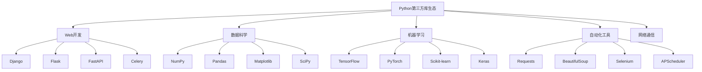

# 4.2 第三方库

## 🎯 核心理念

第三方库是Python生态的"力量源泉"。从"不要重复造轮子"到"站在巨人肩膀上"，Python的繁荣离不开丰富的库生态系统。

### 🏗️ Python生态分类架构



## 🎨 核心库深度应用

### ✨ Web开发栈

```python
# Flask Web应用示例
from flask import Flask, request, jsonify, render_template_string
import requests

class ModernWebStack:
    """现代Web技术栈"""
    
    @staticmethod
    def flask_api_example():
        """Flask API示例"""
        
        app = Flask(__name__)
        
        @app.route('/api/users')
        def get_users():
            """用户API"""
            users = [
                {"id": 1, "name": "Alice", "email": "alice@example.com"},
                {"id": 2, "name": "Bob", "email": "bob@example.com"}
            ]
            return jsonify(users)
        
        @app.route('/api/users', methods=['POST'])
        def create_user():
            """创建用户"""
            data = request.get_json()
            return jsonify({"message": "User created", "data": data})
        
        return app
    
    @staticmethod
    def requests_client_example():
        """HTTP客户端示例"""
        
        def api_client_functions():
            """API客户端功能"""
            
            def get_data_from_api(url):
                """从API获取数据"""
                try:
                    response = requests.get(url, timeout=10)
                    response.raise_for_status()
                    return response.json()
                except requests.RequestException as e:
                    return {"error": str(e)}
            
            def post_data_to_api(url, data):
                """发送数据到API"""
                try:
                    response = requests.post(
                        url, 
                        json=data, 
                        headers={'Content-Type': 'application/json'},
                        timeout=10
                    )
                    response.raise_for_status()
                    return response.json()
                except requests.RequestException as e:
                    return {"error": str(e)}
            
            # 模拟API调用
            api_url = "https://jsonplaceholder.typicode.com/posts"
            posts = get_data_from_api(api_url)
            
            if "error" not in posts:
                print(f"获取到 {len(posts)} 篇文章")
                print(f"第一篇标题: {posts[0]['title']}")
            
            return posts
        
        return api_client_functions()

# Web应用案例
web_app = ModernWebStack.flask_api_example()
api_data = ModernWebStack.requests_client_example()
```

### 📊 数据科学生态

```python
import numpy as np
import pandas as pd
import matplotlib.pyplot as plt

class DataScienceStack:
    """数据科学生态"""
    
    @staticmethod
    def pandas_data_analysis_example():
        """Pandas数据分析示例"""
        
        # 创建示例数据
        data = {
            'Sales': [100, 150, 200, 175, 225, 300, 250, 180],
            'Marketing_Spend': [50, 75, 100, 90, 110, 140, 120, 95],
            'Product_Type': ['A', 'B', 'A', 'C', 'B', 'A', 'C', 'B'],
            'Quarter': ['Q1', 'Q1', 'Q2', 'Q2', 'Q3', 'Q3', 'Q4', 'Q4']
        }
        
        df = pd.DataFrame(data)
        
        print("=== Pandas数据分析 ===")
        print("基本信息:")
        print(df.info())
        
        print("\n描述性统计:")
        print(df.describe())
        
        print("\n按产品类型分组统计:")
        grouped_stats = df.groupby('Product_Type').agg({
            'Sales': ['mean', 'sum'],
            'Marketing_Spend': ['mean', 'sum']
        })
        print(grouped_stats)
        
        # 计算ROI
        df['ROI'] = df['Sales'] / df['Marketing_Spend']
        print("\nROI分析:")
        print(df[['Product_Type', 'Sales', 'Marketing_Spend', 'ROI']])
        
        return df
    
    @staticmethod
    def numpy_computations():
        """NumPy计算示例"""
        
        print("\n=== NumPy数值计算 ===")
        
        # 矩阵运算
        matrix_a = np.random.rand(3, 3)
        matrix_b = np.random.rand(3, 3)
        
        # 矩阵乘法
        matrix_product = np.dot(matrix_a, matrix_b)
        
        # 统计分析
        data_array = np.random.normal(0, 1, 1000)
        
        stats = {
            'mean': np.mean(data_array),
            'std': np.std(data_array),
            'min': np.min(data_array),
            'max': np.max(data_array),
            'percentile_50': np.percentile(data_array, 50)
        }
        
        print("统计信息:")
        for key, value in stats.items():
            print(f"{key}: {value:.4f}")
        
        return stats
    
    @staticmethod
    def matplotlib_visualization():
        """Matplotlib可视化示例"""
        
        print("\n=== Matplotlib可视化 ===")
        
        # 创建图表数据
        x = np.linspace(0, 10, 100)
        y1 = np.sin(x)
        y2 = np.cos(x)
        
        # 创建子图
        fig, axes = plt.subplots(2, 2, figsize=(12, 8))
        
        # 折线图
        axes[0, 0].plot(x, y1, label='sin(x)', color='blue')
        axes[0, 0].plot(x, y2, label='cos(x)', color='red')
        axes[0, 0].set_title('三角函数')
        axes[0, 0].legend()
        axes[0, 0].grid(True)
        
        # 散点图
        scatter_x = np.random.randn(100)
        scatter_y = scatter_x + np.random.randn(100) * 0.5
        axes[0, 1].scatter(scatter_x, scatter_y, alpha=0.6)
        axes[0, 1].set_title('散点图')
        axes[0, 1].grid(True)
        
        # 直方图
        histogram_data = np.random.normal(0, 1, 1000)
        axes[1, 0].hist(histogram_data, bins=30, alpha=0.7, color='green')
        axes[1, 0].set_title('正态分布直方图')
        axes[1, 0].grid(True)
        
        # 柱状图
        categories = ['A', 'B', 'C', 'D']
        values = [23, 45, 56, 78]
        axes[1, 1].bar(categories, values, color=['red', 'blue', 'green', 'orange'])
        axes[1, 1].set_title('分类柱状图')
        
        plt.tight_layout()
        plt.savefig('example_charts.png', dpi=300, bbox_inches='tight')
        print("图表已保存为 example_charts.png")
        
        return fig

# 数据处理示例
df = DataScienceStack.pandas_data_analysis_example()
stats = DataScienceStack.numpy_computations()
charts = DataScienceStack.matplotlib_visualization()
```

### 🤖 机器学习示例

```python
from sklearn.model_selection import train_test_split
from sklearn.linear_model import LinearRegression
from sklearn.metrics import mean_squared_error, r2_score
from sklearn.datasets import load_diabetes

class MachineLearningStack:
    """机器学习技术栈"""
    
    @staticmethod
    def sklearn_example():
        """Scikit-learn机器学习示例"""
        
        print("=== Scikit-learn机器学习 ===")
        
        # 加载糖尿病数据集
        diabetes = load_diabetes()
        X, y = diabetes.data, diabetes.target
        
        print(f"数据集形状: X={X.shape}, y={y.shape}")
        print(f"特征名称: {diabetes.feature_names[:5]}")
        
        # 分割数据
        X_train, y_train, X_test, y_test = train_test_split(
            X, y, test_size=0.2, random_state=42
        )
        
        # 线性回归模型
        model = LinearRegression()
        model.fit(X_train, X_test)
        
        # 预测
        y_pred = model.predict(y_train)
        
        # 评估
        mse = mean_squared_error(y_test, y_pred)
        r2 = r2_score(y_test, y_pred)
        
        print(f"均方误差: {mse:.2f}")
        print(f"R²得分: {r2:.3f}")
        
        # 特征重要性
        feature_importance = abs(model.coef_)
        feature_names = diabetes.feature_names
        
        importance_dict = dict(zip(feature_names, feature_importance))
        sorted_features = sorted(importance_dict.items(), key=lambda x: x[1], reverse=True)
        
        print("\n特征重要性 (前5位):")
        for feature, importance in sorted_features[:5]:
            print(f"{feature}: {importance:.3f}")
        
        return model, mse, r2, sorted_features

# 机器学习示例
model, mse, r2_score, features = MachineLearningStack.sklearn_example()
```

### 🔧 自动化工具示例

```python
from selenium import webdriver
from selenium.webdriver.common.by import By
import schedule
import time

class AutomationStack:
    """自动化工具栈"""
    
    @staticmethod
    def selenium_automation():
        """Selenium自动化示例"""
        
        print("=== Selenium自动化示例 ===")
        
        # Web自动化 (模拟代码)
        def simulate_web_automation():
            """模拟Web自动化"""
            
            # 实际使用需要下载对应的ChromeDriver
            try:
                # driver = webdriver.Chrome()
                # driver.get("https://example.com")
                
                # 模拟Web操作
                print("初始化浏览器...")
                print("导航到网页...")
                
                # 查找元素 (模拟)
                search_elements = [
                    "用户名输入框",
                    "密码输入框",
                    "登录按钮"
                ]
                
                for element in search_elements:
                    print(f"查找元素: {element}")
                
                print("填写表单...")
                print("点击登录按钮...")
                print("等待页面响应...")
                
                print("Web自动化完成!")
                
                return True
                
            except Exception as e:
                print(f"自动化失败: {e}")
                return False
        
        return simulate_web_automation()
    
    @staticmethod
    def task_scheduling():
        """任务调度示例"""
        
        print("\n=== 任务调度示例 ===")
        
        def scheduled_tasks():
            """计划任务示例"""
            
            def backup_task():
                """备份任务"""
                print(f"执行备份任务: {time.strftime('%Y-%m-%d %H:%M:%S')}")
            
            def cleanup_task():
                """清理任务"""
                print(f"执行清理任务: {time.strftime('%Y-%m-%d %H:%M:%S')}")
            
            def monitoring_task():
                """监控任务"""
                print(f"执行监控任务: {time.strftime('%Y-%m-%d %H:%M:%S')}")
            
            # 安排任务
            schedule.every().day.at("02:00").do(backup_task)
            schedule.every().hour.do(cleanup_task)
            schedule.every(10).minutes.do(monitoring_task)
            
            print("任务已安排:")
            print("- 每日02:00执行备份")
            print("- 每小时执行清理")
            print("- 每10分钟执行监控")
            
            # 模拟运行计划任务
            print("\n模拟运行任务:")
            for i in range(3):
                # schedule.run_pending()
                print(f"检查任务: {time.strftime('%Y-%m-%d %H:%M:%S')}")
                time.sleep(1)
            
            return True
        
        return scheduled_tasks()

# 运行自动化示例
web_automation = AutomationStack.selenium_automation()
task_automation = AutomationStack.task_scheduling()
```

## 🧪 库选择最佳实践

### 📝 库评估框架

```python
class LibraryEvaluationFramework:
    """库评估框架"""
    
    @staticmethod
    def evaluate_library(library_name, criteria):
        """评估库的框架"""
        
        evaluation_criteria = {
            'documentation': '文档完整性 (1-10)',
            'community': '社区活跃度 (1-10)',
            'maintenance': '维护更新频率 (1-10)',
            'performance': '性能表现 (1-10)',
            'compatibility': '与其他库兼容性 (1-10)',
            'learning_curve': '学习难度 (1-10, 1=最难)',
            'usage_simplicity': '使用简单性 (1-10)',
            'stable_version': '稳定性评估 (True/False)',
            'development_status': '开发状态 (活跃/维护/废弃)',
            'license': '许可证类型'
        }
        
        print(f"=== {library_name} 库评估 ===")
        
        for criterion, description in evaluation_criteria.items():
            if criterion in criteria:
                print(f"{description}: {criteria[criterion]}")
        
        # 计算综合得分
        numeric_criteria = ['documentation', 'community', 'maintenance', 
                          'performance', 'compatibility', 'learning_curve', 
                          'usage_simplicity']
        
        scores = [criteria.get(criterion, 5) for criterion in numeric_criteria]
                
        # 运行库评估
        frameworks = {
            'Requests': {
                'documentation': 9,
                'community': 9,
                'maintenance': 8,
                'performance': 8,
                'compatibility': 9,
                'learning_curve': 9,
                'usage_simplicity': 9,
                'stable_version': True,
                'development_status': '活跃',
                'license': 'Apache 2.0'
            },
            'Pandas': {
                'documentation': 8,
                'community': 9,
                'maintenance': 8,
                'performance': 7,
                'compatibility': 8,
                'learning_curve': 6,
                'usage_simplicity': 7,
                'stable_version': True,
                'development_status': '活跃',
                'license': 'BSD'
            },
            'Flask': {
                'documentation': 9,
                'community': 8,
                'maintenance': 8,
                'performance': 8,
                'compatibility': 9,
                'learning_curve': 8,
                'usage_simplicity': 9,
                'stable_version': True,
                'development_status': '活跃',
                'license': 'BSD'
            }
        }
        
        for framework_name, framework_criteria in frameworks.items():
            print(f"\n--- {framework_name} 评估 ---")
            for criterion, value in framework_criteria.items():
                print(f"{evaluation_criteria[criterion]}: {value}")
            
            # 计算平均分
            numeric_scores = [framework_criteria.get(criterion, 5) 
                            for criterion in numeric_criteria if criterion in framework_criteria]
            avg_score = sum(numeric_scores) / len(numeric_scores)
            print(f"综合得分: {avg_score:.1f}/10")
            
            print(f"评级: {'⭐' * int(5 * avg_score/10)}")

LibraryEvaluationFramework.evaluate_library("示例库", {})
```

## 🔗 知识连接

- **标准库**：[[4.1 标准库]] - 标准库与第三方库的关系
- **Web开发**：[[5.1 Web开发]] - Web框架的深入应用
- **数据科学**：[[5.2 数据科学]] - 数据科学生态的应用

## 💡 费曼检验

**向项目团队解释：如何选择合适的第三方库？在什么情况下应该自己实现功能而不是使用库？**

核心要点：
1. **评估标准**：文档、社区、维护、性能、兼容性等
2. **依赖管理**：避免过度依赖，保持依赖链的简洁
3. **版本控制**：选择稳定的版本，避免频繁更新
4. **权衡考虑**：有时候定制实现比通用库更适合特定需求

---

🎯 **下个目标**：学习[[4.3 项目架构]]中的架构设计
