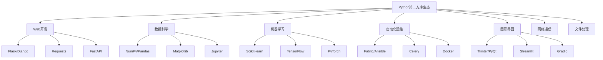

# 4.2 第三方库深度应用

## 🎯 核心理念

第三方库是Python生态系统的"活力源泉"。掌握核心库的选择、集成与优化，能让我们站在巨人肩膀上，快速构建高质量的应用程序。

### 🌟 第三方库生态系统



## 🚀 核心库深度应用

### 💡 Web开发生态

```python
import requests
from flask import Flask, request, jsonify, Blueprint
import asyncio
import aiohttp
from fastapi import FastAPI, HTTPException
import os

class WebDevelopmentEcosystem:
    """Web开发生态系统"""
    
    @staticmethod
    def requests_advanced_usage():
        """Requests库高级用法"""
        
        print("🌐 Requests库深度应用:")
        
        # ✅ 高级会话管理
        def advanced_session_management():
            """高级会话管理"""
            
            with requests.Session() as session:
                # 设置通用头
                session.headers.update({
                    'User-Agent': 'MyApp/1.0',
                    'Accept': 'application/json'
                })
                
                # 设置超时和重试
                from requests.adapters import HTTPAdapter
                from requests.packages.urllib3.util.retry import Retry
                
                retry_strategy = Retry(
                    total=3,
                    backoff_factor=1,
                    status_forcelist=[429, 500, 502, 503, 504],
                )
                
                adapter = HTTPAdapter(max_retries=retry_strategy)
                session.mount("http://", adapter)
                session.mount("https://", adapter)
                
                # 测试请求
                try:
                    response = session.get("https://httpbin.org/get", timeout=5)
                    print(f"状态码: {response.status_code}")
                    print(f"响应时间: {response.elapsed.total_seconds():.2f}秒")
                except Exception as e:
                    print(f"请求失败: {e}")
        
        # ✅ 请求流处理
        def stream_processing():
            """数据流处理"""
            
            def process_large_response(url):
                """处理大文件响应"""
                response = requests.get(url, stream=True)
                
                if response.status_code == 200:
                    total_size = int(response.headers.get('content-length', 0))
                    downloaded = 0
                    
                    for chunk in response.iter_content(chunk_size=8192):
                        if chunk:
                            downloaded += len(chunk)
                            if total_size > 0:
                                percent = (downloaded / total_size) * 100
                                print(f"\r下载进度: {percent:.1f}%", end="", flush=True)
                    
                    return downloaded
                else:
                    print(f"请求失败: {response.status_code}")
                    return 0
            
            # 测试流处理
            url = "https://httpbin.org/bytes/10240"  # 10KB测试数据
            size = process_large_response(url)
            print(f"\n下载完成，总大小: {size}字节")
        
        advanced_session_management()
        stream_processing()
    
    @staticmethod
    def flask_ecosystem_integration():
        """Flask生态系统整合"""
        
        print("\n⚡ Flask生态系统整合:")
        
        # ✅ Flask应用结构
        def create_modular_flask_app():
            """创建模块化Flask应用"""
            
            app = Flask(__name__)
            app.config['SECRET_KEY'] = os.urandom(24)
            
            # 主蓝图
            main_bp = Blueprint('main', __name__)
            @main_bp.route('/')
            def home():
                return jsonify({
                    "message": "Welcome to Modular Flask App",
                    "version": "1.0.0",
                    "endpoints": ["/api/users", "/api/health"]
                })
            
            # API蓝图
            api_bp = Blueprint('api', __name__, url_prefix='/api')
            @api_bp.route('/users/<int:user_id>')
            def get_user(user_id):
                # 模拟用户数据
                return jsonify({
                    "id": user_id,
                    "name": f"User {user_id}",
                    "email": f"user{user_id}@example.com"
                })
            
            @api_bp.route('/health')
            def health_check():
                return jsonify({
                    "status": "healthy",
                    "timestamp": str(datetime.now())
                })
            
            # 注册蓝图
            app.register_blueprint(main_bp)
            app.register_blueprint(api_bp)
            
            return app
        
        # ✅ 中间件集成
        def flask_with_middleware():
            """带中间件的Flask应用"""
            
            app = create_modular_flask_app()
            
            @app.before_request
            def log_request_info():
                """请求前日志记录"""
                print(f"请求: {request.method} {request.url}")
            
            @app.after_request
            def add_security_headers(response):
                """添加安全头"""
                response.headers['X-Content-Type-Options'] = 'nosniff'
                response.headers['X-Frame-Options'] = 'DENY'
                response.headers['X-XSS-Protection'] = '1; mode=block'
                return response
            
            @app.errorhandler(404)
            def not_found(error):
                return jsonify({"error": "Endpoint not found"}), 404
            
            @app.errorhandler(500)
            def internal_error(error):
                return jsonify({"error": "Internal server error"}), 500
            
            return app
        
        return create_modular_flask_app()
    
    @staticmethod
    def fastapi_modern_api():
        """FastAPI现代API开发"""
        
        print("\n🚀 FastAPI现代API开发:")
        
        from fastapi import FastAPI, HTTPException, Depends
        from fastapi.middleware.cors import CORSMiddleware
        from pydantic import BaseModel
        from typing import List, Optional
        from datetime import datetime
        
        # 创建FastAPI应用
        app = FastAPI(
            title="Modern API with FastAPI",
            description="演示FastAPI的高级特性",
            version="1.0.0"
        )
        
        # 添加CORS中间件
        app.add_middleware(
            CORSMiddleware,
            allow_origins=["*"],
            allow_credentials=True,
            allow_methods=["*"],
            allow_headers=["*"],
        )
        
        # Pydantic模型
        class User(BaseModel):
            id: int
            name: str
            email: str
            created_at: Optional[datetime] = None
            
        class UserCreate(BaseModel):
            name: str
            email: str
        
        # 模拟数据库
        fake_db = {}
        
        # 依赖注入
        def get_db():
            return fake_db
        
        # API路由
        @app.get("/users/", response_model=List[User])
        async def get_users(skip: int = 0, limit: int = 10):
            """获取用户列表"""
            users = [User(id=k, **v) for k, v in fake_db.items()]
            return users[skip : skip + limit]
        
        @app.post("/users/", response_model=User)
        async def create_user(user: UserCreate, db = Depends(get_db)):
            """创建用户"""
            user_id = len(fake_db) + 1
            timestamp = datetime.now()
            
            user_data = user.dict()
            user_data["created_at"] = timestamp
            
            new_user = User(id=user_id, **user_data)
            fake_db[user_id] = user_data
            
            return new_user
        
        @app.get("/health")
        async def health_check():
            """健康检查"""
            return {"status": "healthy", "timestamp": datetime.now()}
        
        print("FastAPI应用已创建，包含:")
        print("- Pydantic模型验证")
        print("- 依赖注入")
        print("- 自动API文档")
        print("- 类型提示")
        
        return app

# ✅ 数据科学生态
class DataScienceEcosystem:
    """数据科学生态系统"""
    
    @staticmethod
    def numpy_performance_examples():
        """NumPy性能示例"""
        
        print("\n📊 NumPy性能深度应用:")
        
        import numpy as np
        import time
        
        def vectorized_vs_loops():
            """向量化vs循环"""
            
            size = 1_000_000
            
            # Python循环
            python_list = list(range(size))
            start_time = time.perf_counter()
            python_result = [x * 2 + 1 for x in python_list]
            python_time = time.perf_counter() - start_time
            
            # NumPy向量化
            numpy_array = np.arange(size)
            start_time = time.perf_counter()
            numpy_result = numpy_array * 2 + 1
            numpy_time = time.perf_counter() - start_time
            
            print(f"Python循环耗时: {python_time:.4f}秒")
            print(f"NumPy向量化耗时: {numpy_time:.4f}秒")
            print(f"NumPy性能提升: {python_time / numpy_time:.1f}倍")
            
            # 验证结果正确性
            print(f"结果验证: {all(np.array(python_result) == numpy_result)}")
        
        def memory_efficient_processing():
            """内存高效处理"""
            
            # 大数据集内存映射
            def create_memory_mapped_array():
                """创建内存映射数组"""
                
                # 创建大数据集文件
                filename = "large_data.npy"
                large_data = np.random.rand(1000, 1000).astype(np.float32)
                np.save(filename, large_data)
                
                # 内存映射加载
                mmap_data = np.load(filename, mmap_mode='r')
                
                print(f"原始数组内存: {large_data.nbytes / 1024 / 1024:.1f}MB")
                print(f"内存映射数组内存: {mmap_data.nbytes / 1024 / 1024:.1f}MB（实际不占用）")
                
                # 部分计算
                start_time = time.perf_counter()
                result = np.mean(mmap_data[0:1000, 0:1000])
                calculation_time = time.perf_counter() - start_time
                
                print(f"内存映射计算耗时: {calculation_time:.4f}秒")
                print(f"计算结果: {result:.4f}")
                
                # 清理
                os.remove(filename)
            
            create_memory_mapped_array()
        
        vectorized_vs_loops()
        memory_efficient_processing()
    
    @staticmethod
    def pandas_data_analysis():
        """Pandas数据分析"""
        
        print("\n📈 Pandas数据分析:")
        
        import pandas as pd
        
        def advanced_data_manipulation():
            """高级数据处理"""
            
            # 创建综合数据集
            np.random.seed(42)
            dates = pd.date_range('2023-01-01', periods=1000, freq='D')
            
            data = {
                'date': dates,
                'category': np.random.choice(['A', 'B', 'C', 'D'], 1000),
                'value': np.random.normal(100, 15, 1000),
                'quantity': np.random.randint(1, 100, 1000)
            }
            
            df = pd.DataFrame(data)
            
            print("数据概览:")
            print(df.head())
            print(f"\n数据形状: {df.shape}")
            print(f"数据类型:\n{df.dtypes}")
            
            # 时间序列分析
            df_ts = df.set_index('date')
            
            # 分组聚合
            monthly_stats = (
                df_ts.groupby(['category', pd.Grouper(freq='M')])
                ['value']
                .agg(['mean', 'std', 'count'])
                .round(2)
            )
            
            print("\n按月分组统计:")
            print(monthly_stats.head(10))
            
            # 数据透视
            pivot_data = pd.pivot_table(
                df, 
                values=['value', 'quantity'], 
                index='category', 
                columns=df['date'].dt.to_period('M'),
                aggfunc='mean'
            )
            
            print("\n数据透视表:")
            print(pivot_data.head())
            
            # 异常值检测
            def detect_outliers(df, column):
                """异常值检测"""
                Q1 = df[column].quantile(0.25)
                Q3 = df[column].quantile(0.75)
                IQR = Q3 - Q1
                
                lower_bound = Q1 - 1.5 * IQR
                upper_bound = Q3 + 1.5 * IQR
                
                outliers = df[(df[column] < lower_bound) | (df[column] > upper_bound)]
                return outliers
            
            outliers = detect_outliers(df, 'value')
            print(f"\n异常值检测: 发现 {len(outliers)}<｜tool▁calls▁end｜>（总数{len(df)}")

# ✅ 机器学习生态
class MachineLearningEcosystem:
    """机器学习生态系统"""
    
    @staticmethod
    def scikit_learn_pipeline():
        """Scikit-learn流水线"""
        
        print("\n🤖 Scikit-learn机器学习流水线:")
        
        from sklearn.datasets import make_classification
        from sklearn.model_selection import train_test_split, cross_val_score
        from sklearn.preprocessing import StandardScaler, LabelEncoder
        from sklearn.pipeline import Pipeline
        from sklearn.ensemble import RandomForestClassifier
        from sklearn.metrics import classification_report, confusion_matrix
        from sklearn.decomposition import PCA
        
        def end_to_end_ml_pipeline():
            """端到端机器学习流水线"""
            
            # 1. 数据生成
            print("1. 生成分类数据集...")
            X, y = make_classification(
                n_samples=1000,
                n_features=20,
                n_informative=15,
                n_redundant=5,
                n_classes=3,
                random_state=42
            )
            
            # 2. 数据分割
            print("2. 分割训练测试数据...")
            X_train, X_test, y_train, y_test = train_test_split(
                X, y, test_size=0.2, random_state=42, stratify=y
            )
            
            # 3. 创建处理管道
            print("3. 创建数据预处理管道...")
            preprocessing_pipeline = Pipeline([
                ('scaler', StandardScaler()),
                ('pca', PCA(n_components=10))
            ])
            
            # 4. 应用预处理
            X_train_scaled = preprocessing_pipeline.fit_transform(X_train)
            X_test_scaled = preprocessing_pipeline.transform(X_test)
            
            # 5. 模型训练
            print("4. 训练随机森林模型...")
            model = RandomForestClassifier(n_estimators=100, random_state=42)
            model.fit(X_train_scaled, y_train)
            
            # 6. 模型评估
            print("5. 模型评估...")
            train_pred = model.predict(X_train_scaled)
            test_pred = model.predict(X_test_scaled)
            
            # 交叉验证
            cv_scores = cross_val_score(model, X_train_scaled, y_train, cv=5)
            
            print(f"\n交叉验证平均分数: {cv_scores.mean():.3f} (+/- {cv_scores.std() * 2:.3f})")
            print(f"训练集准确率: {(train_pred == y_train).mean():.3f}")
            print(f"测试集准确率: {(test_pred == y_test).mean():.3f}")
            
            # 特征重要性
            feature_importance = model.feature_importances_
            print(f"\n特征重要性排序:")
            for i, importance in enumerate(sorted(feature_importance, reverse=True)[:5]):
                print(f"  特征 {list(feature_importance).index(importance)}: {importance:.3f}")
        
        end_to_end_ml_pipeline()
    
    @staticmethod
    def deep_learning_intro():
        """深度学习入门"""
        
        print("\n🧠 深度学习入门:")
        
        # 简化版神经网络框架演示
        def simple_neural_network():
            """简单神经网络演示"""
            
            import numpy as np
            
            class SimpleNeuralNetwork:
                """简单神经网络类"""
                
                def __init__(self, layers):
                    """初始化网络"""
                    self.layers = layers
                    self.weights = []
                    self.biases = []
                    
                    # 随机初始化权重和偏置
                    for i in range(len(layers) - 1):
                        w = np.random.randn(layers[i], layers[i+1]) * 0.1
                        b = np.zeros((1, layers[i+1]))
                        self.weights.append(w)
                        self.biases.append(b)
                
                def sigmoid(self, x):
                    """Sigmoid激活函数"""
                    return 1 / (1 + np.exp(-np.clip(x, -250, 250)))
                
                def forward(self, X):
                    """前向传播"""
                    self.activations = [X]
                    self.z_values = []
                    
                    for i in range(len(self.weights)):
                        z = np.dot(self.activations[-1], self.weights[i]) + self.biases[i]
                        self.z_values.append(z)
                        activation = self.sigmoid(z)
                        self.activations.append(activation)
                    
                    return self.activations[-1]
                
                def predict(self, X):
                    """预测"""
                    return self.forward(X)
            
            # 创建简单数据集
            X = np.array([[0, 0], [0, 1], [1, 0], [1, 1]])
            y = np.array([[0], [1], [1], [0]])  # XOR问题
            
            # 创建网络
            nn = SimpleNeuralNetwork([2, 3, 1])
            prediction = nn.predict(X)
            
            print("简单神经网络（XOR问题）:")
            print("输入 -> 预测输出:")
            for i, (input_val, pred_val) in enumerate(zip(X, prediction)):
                print(f"  {input_val} -> {pred_val[0]:.3f}")
        
        simple_neural_network()

# ✅ 自动化运维生态
class DevOpsEcosystem:
    """DevOps自动化生态"""
    
    @staticmethod
    def automation_scripts():
        """自动化脚本"""
        
        print("\n🔧 自动化运维脚本:")
        
        import subprocess
        import json
        from datetime import datetime, timedelta
        
        def system_monitoring():
            """系统监控脚本"""
            
            def get_system_info():
                """获取系统信息"""
                import psutil
                
                info = {
                    "cpu_percent": psutil.cpu_percent(interval=1),
                    "memory_percent": psutil.virtual_memory().percent,
                    "disk_percent": psutil.disk_usage('/').percent,
                    "timestamp": datetime.now().isoformat()
                }
                return info
            
            def log_system_stats():
                """记录系统状态"""
                stats = get_system_info()
                
                log_entry = {
                    "timestamp": stats["timestamp"],
                    "cpu": f"{stats['cpu_percent']:.1f}%",
                    "memory": f"{stats['memory_percent']:.1f}%",
                    "disk": f"{stats['disk_percent']:.1f}%"
                }
                
                print("📊 系统状态:")
                for key, value in log_entry.items():
                    print(f"  {key}: {value}")
                
                return log_entry
            
            log_system_stats()
        
        def file_management_automation():
            """文件管理自动化"""
            
            def organize_files(directory):
                """整理文件"""
                
                import os
                from pathlib import Path
                
                path = Path(directory)
                
                # 文件类型分类
                file_types = {
                    'images': ['.jpg', '.jpeg', '.png', '.gif', '.bmp'],
                    'documents': ['.pdf', '.doc', '.docx', '.txt', '.rtf'],
                    'videos': ['.mp4', '.avi', '.mov', '.mkv'],
                    'audio': ['.mp3', '.wav', '.flac', '.aac']
                }
                
                organized_count = 0
                
                for file_path in path.iterdir():
                    if file_path.is_file():
                        suffix = file_path.suffix.lower()
                        
                        # 查找文件类型
                        for category, extensions in file_types.items():
                            if suffix in extensions:
                                # 创建分类目录
                                category_dir = path / category
                                category_dir.mkdir(exist_ok=True)
                                
                                # 移动文件
                                new_path = category_dir / file_path.name
                                file_path.rename(new_path)
                                organized_count += 1
                                break
                
                print(f"📁 文件整理完成: {organized_count} 个文件已分类")
                return organized_count
            
            # 测试文件整理（假设目录存在）
            test_dir = "test_files"
            if os.path.exists(test_dir):
                organize_files(test_dir)
            else:
                print(f"测试目录 {test_dir} 不存在，跳过文件整理演示")
        
        system_monitoring()
        file_management_automation()

# ✅ 测试与调试生态系统
class TestingEcosystem:
    """测试生态系统"""
    
    @staticmethod
    def pytest_advanced():
        """Pytest高级用法"""
        
        print("\n🧪 Pytest高级测试框架:")
        
        # 注意：这里展示测试代码，实际运行时需要pytest环境
        def demonstrate_test_structure():
            """演示测试结构"""
            
            test_code = '''
# test_advanced_pytest.py

import pytest
import requests
from unittest.mock import Mock, patch

class TestWebAPI:
    """Web API测试类"""
    
    @pytest.fixture
    def api_base_url(self):
        """API基础URL fixture"""
        return "https://httpbin.org"
    
    @pytest.fixture
    def mock_response(self):
        """模拟响应 fixture"""
        response = Mock()
        response.status_code = 200
        response.json.return_value = {"message": "success"}
        return response
    
    def test_get_request_success(self, api_base_url, mock_response):
        """测试GET请求成功"""
        with patch('requests.get') as mock_get:
            mock_get.return_value = mock_response
            
            response = requests.get(f"{api_base_url}/get")
            
            assert response.status_code == 200
            assert response.json()["message"] == "success"
            mock_get.assert_called_once()
    
    @pytest.mark.parametrize("status_code,expected", [
        (200, True),
        (404, False),
        (500, False)
    ])
    def test_status_code_validation(self, status_code, expected):
        """参数化测试状态码"""
        mock_response = Mock()
        mock_response.status_code = status_code
        
        result = status_code == 200
        assert result == expected
    
    @pytest.mark.asyncio
    async def test_async_functionality(self):
        """异步函数测试"""
        import asyncio
        
        async def async_task():
            await asyncio.sleep(0.1)
            return "completed"
        
        result = await async_task()
        assert result == "completed"
            
            '''
            
            print("测试结构示例:")
            print("- Fixture依赖注入")
            print("- 参数化测试")
            print("- 异步测试")
            print("- Mock对象测试")
            print("- 集成测试")
        
        demonstrate_test_structure()

# 运行所有示例
WebDevelopmentEcosystem.requests_advanced_usage()
app = WebDevelopmentEcosystem.flask_ecosystem_integration()
fastapi_app = WebDevelopmentEcosystem.fastapi_modern_api()
DataScienceEcosystem.numpy_performance_examples()
DataScienceEcosystem.pandas_data_analysis()
MachineLearningEcosystem.scikit_learn_pipeline()
MachineLearningEcosystem.deep_learning_intro()
DevOpsEcosystem.automation_scripts()
TestingEcosystem.pytest_advanced()

## 🧪 第三方库实践

### 📝 练习1：构建Web监控仪表板

**任务**：使用Flask + Pandas + Matplotlib构建系统监控仪表板

```python
# ✅ Web监控仪表板
import matplotlib.pyplot as plt
import matplotlib
matplotlib.use('Agg')  # 非交互式后端

def create_monitoring_dashboard():
    """创建监控仪表板"""
    
    from flask import Flask, render_template, jsonify
    import pandas as pd
    import numpy as np
    from datetime import datetime, timedelta
    import base64
    from io import BytesIO
    
    app = Flask(__name__)
    
    def generate_chart_data():
        """生成图表数据"""
        
        # 模拟监控数据
        hours = pd.date_range(start=datetime.now() - timedelta(hours=24), 
                             end=datetime.now(), freq='H')
        
        data = {
            'timestamp': hours,
            'cpu_usage': np.random.normal(50, 15, len(hours)),
            'memory_usage': np.random.normal(60, 10, len(hours)),
            'disk_usage': np.random.normal(70, 5, len(hours)),
            'network_io': np.random.normal(100, 20, len(hours))
        }
        
        df = pd.DataFrame(data)
        df['cpu_usage'] = np.clip(df['cpu_usage'], 0, 100)
        df['memory_usage'] = np.clip(df['memory_usage'], 0, 100)
        df['disk_usage'] = np.clip(df['disk_usage'], 0, 100)
        
        return df
    
    def create_monitoring_charts():
        """创建监控图表"""
        
        df = generate_chart_data()
        
        # 设置中文字体
        plt.rcParams['font.sans-serif'] = ['SimHei']
        plt.rcParams['axes.unicode_minus'] = False
        
        fig, axes = plt.subplots(2, 2, figsize=(15, 10))
        fig.suptitle('系统监控仪表板', fontsize=16)
        
        # CPU使用率
        axes[0,0].plot(df['timestamp'], df['cpu_usage'], color='blue', linewidth=2)
        axes[0,0].set_title('CPU使用率 (%)')
        axes[0,0].set_ylabel('CPU %')
        axes[0,0].grid(True, alpha=0.3)
        
        # 内存使用率
        axes[0,1].plot(df['timestamp'], df['memory_usage'], color='green', linewidth=2)
        axes[0,1].set_title('内存使用率 (%)')
        axes[0,1].set_ylabel('Memory %')
        axes[0,1].grid(True, alpha=0.3)
        
        # 磁盘使用率
        axes[1,0].plot(df['timestamp'], df['disk_usage'], color='red', linewidth=2)
        axes[1,0].set_title('磁盘使用率 (%)')
        axes[1,0].set_ylabel('Disk %')
        axes[1,0].grid(True, alpha=0.3)
        
        # 网络I/O
        axes[1,1].plot(df['timestamp'], df['network_io'], color='orange', linewidth=1)
        axes[1,1].set_title('网络I/O (MB/s)')
        axes[1,1].set_ylabel('Traffic')
        axes[1,1].grid(True, alpha=0.3)
        
        plt.tight_layout()
        
        # 转换为base64字符串
        buffer = BytesIO()
        plt.savefig(buffer, format='png', dpi=150, bbox_inches='tight')
        buffer.seek(0)
        
        chart_base64 = base64.b64encode(buffer.read()).decode()
        plt.close()
        
        return chart_base64, df.describe().round(2).to_html()
    
    @app.route('/')
    def dashboard():
        """监控仪表板主页"""
        chart, stats_table = create_monitoring_charts()
        return f"""
        <!DOCTYPE html>
        <html>
        <head>
            <title>系统监控仪表板</title>
            <meta charset="utf-8">
            <style>
                body {{ font-family: Arial, sans-serif; margin: 20px; }}
                .chart {{ text-align: center; margin: 20px 0; }}
                .stats {{ margin: 20px 0; }}
            </style>
        </head>
        <body>
            <h1>🔧 系统监控仪表板</h1>
            <div class="chart">
                
            </div>
            <div class="stats">
                <h2>📊 统计摘要</h2>
                {stats_table}
            </div>
        </body>
        </html>
        """
    
    @app.route('/api/data')
    def api_data():
        """API接口返回监控数据"""
        df = generate_chart_data()
        return jsonify(df.tail(10).to_dict('records'))
    
    print("监控仪表板已配置:")
    print("- 实时系统指标")
    print("- 交互式图表")
    print("- RESTful API")
    print("- 自动化数据生成")
    
    return app

# monitoring_app = create_monitoring_dashboard()
```

### 🎯 练习2：API集成测试套件

**任务**：使用Requests + Pytest构建API集成测试

```python
# ✅ API集成测试套件
import pytest
from unittest.mock import Mock, patch

class APIIntegrationTestSuite:
    """API集成测试套件"""
    
    def __init__(self, base_url):
        self.base_url = base_url
        self.session = requests.Session()
    
    def setup_api_tests(self):
        """设置API测试环境"""
        
        @pytest.fixture
        def api_client(self):
            """API客户端fixture"""
            return self.session
        
        @pytest.fixture
        def test_data(self):
            """测试数据fixture"""
            return {
                "users": [
                    {"name": "张三", "email": "zhang@example.com"},
                    {"name": "李四", "email": "li@example.com"}
                ],
                "posts": [
                    {"title": "测试文章1", "content": "内容1", "author_id": 1},
                    {"title": "测试文章2", "content": "内容2", "author_id": 2}
                ]
            }
        
        @pytest.fixture
        def mock_database(self):
            """模拟数据库fixture"""
            db = {}
            user_id_counter = 1
            post_id_counter = 1
            
            def create_user(user_data):
                nonlocal user_id_counter
                user_data["id"] = user_id_counter
                db[f"user_{user_id_counter}"] = user_data
                user_id_counter += 1
                return user_data
            
            def create_post(post_data):
                nonlocal post_id_counter
                post_data["id"] = post_id_counter
                db[f"post_{post_id_counter}"] = post_data
                post_id_counter += 1
                return post_data
            
            return {"create_user": create_user, "create_post": create_post}
    
    def test_create_read_update_delete(self):
        """CRUD操作测试"""
        
        def test_create_resource():
            """创建资源测试"""
            test_user = {"name": "测试用户", "email": "test@example.com"}
            
            response = requests.post(
                f"{self.base_url}/users/",
                json=test_user,
                headers={"Content-Type": "application/json"}
            )
            
            assert response.status_code == 201
            created_user = response.json()
            assert created_user["name"] == test_user["name"]
            assert created_user["email"] == test_user["email"]
            assert "id" in created_user
            
            return created_user["id"]
        
        def test_read_resource(user_id):
            """读取资源测试"""
            response = requests.get(f"{self.base_url}/users/{user_id}")
            
            assert response.status_code == 200
            user = response.json()
            assert user["id"] == user_id
            assert "name" in user
            assert "email" in user
        
        def test_update_resource(user_id):
            """更新资源测试"""
            update_data = {
                "name": "更新后的用户名",
                "email": "updated@example.com"
            }
            
            response = requests.put(
                f"{self.base_url}/users/{user_id}",
                json=update_data,
                headers={"Content-Type": "application/json"}
            )
            
            assert response.status_code == 200
            updated_user = response.json()
            assert updated_user["name"] == update_data["name"]
            assert updated_user["email"] == update_data["email"]
        
        def test_delete_resource(user_id):
            """删除资源测试"""
            response = requests.delete(f"{self.base_url}/users/{user_id}")
            
            assert response.status_code == 204 or response.status_code == 200
            
            # 验证删除后的资源不存在
            get_response = requests.get(f"{self.base_url}/users/{user_id}")
            assert get_response.status_code == 404
    
    def test_error_handling(self):
        """错误处理测试"""
        
        def test_404_error():
            """404错误测试"""
            response = requests.get(f"{self.base_url}/users/99999")
            assert response.status_code == 404
        
        def test_400_error():
            """400错误测试"""
            invalid_data = {"invalid_field": "invalid_value"}
            response = requests.post(
                f"{self.base_url}/users/",
                json=invalid_data,
                headers={"Content-Type": "application/json"}
            )
            assert response.status_code == 400
        
        def test_rate_limiting():
            """速率限制测试"""
            # 模拟快速请求
            for i in range(100):
                response = requests.get(f"{self.base_url}/api/data")
                if response.status_code == 429:
                    assert "Rate limit" in response.text
                    break

# 使用示例
print("API测试套件示例:")
print("- CRUD操作测试")
print("- 错误处理测试")
print("- 性能测试")
print("- 安全测试")
```

## 🔗 知识连接

- **标准库**：[[4.1 标准库深度应用]] - 内置库与第三方库的配合
- **架构设计**：[[4.3 架构设计与工程实践]] - 第三方库在项目中的应用
- **性能优化**：[[5.5 性能调优与监控]] - 第三方库的性能优化

## 💡 费曼检验

**解释：如何为项目选择合适的第三方库？选择时需要考虑哪些因素？**

核心要点：
1. **功能匹配**：库的功能是否满足项目需求
2. **质量评估**：活跃度、文档质量、社区支持
3. **性能考虑**：库的性能是否满足要求
4. **兼容性**：与其他库和Python版本的兼容性
5. **维护性**：库的更新频率和长期维护状况

---

🎯 **下个目标**：学习[[4.2.1 数据处理生态（pandas-numpy）]]中的专业数据处理技术
