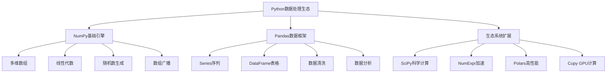

# 4.2.1 数据处理生态（pandas-numpy）

## 🎯 核心理念

数据处理是数据科学的"血液系统"。Pandas和NumPy构成了Python数据处理的核心生态，如同大脑的两个半球：NumPy提供高效的多维数组计算引擎，Pandas在此基础上构建了丰富的数据结构和分析工具。

### 🏗️ 数据处理生态系统



## 📚 NumPy - 数值计算引擎

### 🔢 核心数组操作

```python
import numpy as np
import time

def numpy_fundamentals():
    """NumPy基础操作"""
    # 数组创建
    arr1d = np.array([1, 2, 3, 4, 5])
    arr2d = np.array([[1, 2, 3], [4, 5, 6]])
    arr3d = np.array([[[1, 2], [3, 4]], [[5, 6], [7, 8]]])
    
    print("数组维度:")
    print(f"1D: {arr1d.shape}")
    print(f"2D: {arr2d.shape}")
    print(f"3D: {arr3d.shape}")
    
    # 特殊数组创建
    zeros = np.zeros((3, 4))
    ones = np.ones((2, 3), dtype=np.int64)
    identity = np.eye(4)
    random_arr = np.random.rand(3, 4)
    
    print(f"\n零矩阵:\n{zeros}")
    print(f"\n单位矩阵:\n{identity}")
    print(f"\n随机矩阵:\n{random_arr}")
    
    # 数组属性和信息
    print(f"\n数据类型: {random_arr.dtype}")
    print(f"元素总数: {random_arr.size}")
    print(f"内存大小: {random_arr.nbytes} 字节")
    print(f"维度数: {random_arr.ndim}")

numpy_fundamentals()

# 数组索引和切片高级技巧
def advanced_indexing():
    """高级数组索引技巧"""
    # 创建测试数据
    arr = np.arange(24).reshape(4, 6)
    print(f"原始数组:\n{arr}")
    
    # 布尔索引
    bool_mask = arr > 10
    print(f"\n布尔掩码:\n{bool_mask}")
    print(f"大于10的元素: {arr[bool_mask]}")
    
    # 花式索引
    row_indices = [0, 2]
    col_indices = [1, 3, 5]
    sliced = arr[np.ix_(row_indices, col_indices)]
    print(f"\n花式索引结果:\n{sliced}")
    
    # 条件替换
    arr_modified = arr.copy()
    arr_modified[arr_modified < 5] = -1
    arr_modified[arr_modified > 18] = 100
    print(f"\n条件替换后:\n{arr_modified}")

advanced_indexing()

# 数组广播机制
def broadcasting_demo():
    """数组广播演示"""
    a = np.array([[1, 2, 3],
                  [4, 5, 6]])
    b = np.array([10, 100, 1000])
    
    print("数组广播:")
    print(f"数组A:\n{a}")
    print(f"数组B: {b}")
    print(f"A + B:\n{a + b}")
    
    # 不同维度的广播
    c = np.array([[1, 2],
                  [3, 4]])
    d = np.array([10, 100])
    
    print(f"\n列广播:")
    print(f"数组C:\n{c}")
    print(f"数组D: {d}")
    print(f"C + D (广播):\n{c + d}")

broadcasting_demo()
```

### 📊 NumPy数值计算应用

```python
def numerical_computations():
    """高水平数值计算"""
    # 线性代数运算
    print("=== 线性代数运算 ===")
    
    # 矩阵运算
    A = np.random.rand(1000, 1000)
    B = np.random.rand(1000, 1000)
    
    # 矩阵乘法性能测试
    start_time = time.time()
    C = np.dot(A, B)
    end_time = time.time()
    
    print(f"矩阵乘法耗时: {end_time - start_time:.4f}秒")
    print(f"结果矩阵形状: {C.shape}")
    
    # 求解线性方程组
    np.random.seed(42)
    A_sys = np.random.rand(100, 100)
    b_sys = np.random.rand(100)
    
    x = np.linalg.solve(A_sys, b_sys)
    verification = np.dot(A_sys, x)
    error = np.max(np.abs(verification - b_sys))
    print(f"线性方程组求解误差: {error:.2e}")
    
    # 特征值和特征向量
    eigenvalues, eigenvectors = np.linalg.eigh(np.dot(A_sys, A_sys.T))
    print(f"最大特征值: {np.max(eigenvalues):.4f}")
    
    # 统计函数应用
    print("\n=== 统计分析 ===")
    data = np.random.normal(100, 15, 10000)  # 正态分布数据
    
    stats = {
        'mean': np.mean(data),
        'std': np.std(data),
        'var': np.var(data),
        'median': np.median(data),
        '25%': np.percentile(data, 25),
        '75%': np.percentile(data, 75),
        'min': np.min(data),
        'max': np.max(data)
    }
    
    print("统计摘要:")
    for stat_name, value in stats.items():
        print(f"{stat_name:>8}: {value:.4f}")
    
    # 数据分布分析
    hist_counts, bin_edges = np.histogram(data, bins=20)
    print(f"\n直方图区间: {len(hist_counts)}个分组")
    print(f"每个区间的数据量: {hist_counts[:5]}...")

numerical_computations()

# NumPy高性能计算
def performance_optimization():
    """性能优化技巧"""
    # 内存预分配
    def inefficient_append():
        """低效的数组增长"""
        result = np.array([])
        for i in range(1000):
            result = np.append(result, i**2)
        return result
    
    def efficient_preallocate():
        """高效的预分配"""
        result = np.empty(1000, dtype=np.int64)
        for i in range(1000):
            result[i] = i**2
        return result
    
    def vectorized_operation():
        """矢量化操作"""
        i_values = np.arange(1000)
        return i_values ** 2
    
    # 性能对比
    times = {}
    
    start_time = time.time()
    inefficient_append()
    times['低效方式'] = time.time() - start_time
    
    start_time = time.time()
    efficient_preallocate()
    times['高效预分配'] = time.time() - start_time
    
    start_time = time.time()
    vectorized_operation()
    times['矢量化操作'] = time.time() - start_time
    
    print("性能对比:")
    for method, runtime in times.items():
        print(f"{method:>12}: {runtime:.6f}秒")
    
    # 内存布局优化
    def memory_layout_demo():
        """内存布局演示"""
        arr_C = np.array([[1, 2, 3], [4, 5, 6]], order='C')
        arr_F = np.array([[1, 2, 3], [4, 5, 6]], order='F')
        
        print(f"\nC顺序数组是否连续: {arr_C.flags.c_contiguous}")
        print(f"F顺序数组是否连续: {arr_F.flags.f_contiguous}")
        
        # 不同遍历方式的性能
        def row_major_access(arr):
            total = 0
            for i in range(arr.shape[0]):
                for j in range(arr.shape[1]):
                    total += arr[i, j]
            return total
        
        def column_major_access(arr):
            total = 0
            for j in range(arr.shape[1]):
                for i in range(arr.shape[0]):
                    total += arr[i, j]
            return total
        
        # 测试不同布局的访问性能
        start_time = time.time()
        for _ in range(100000):
            row_major_access(arr_C)
        row_major_time = time.time() - start_time
        
        start_time = time.time()
        for _ in range(100000):
            column_major_access(arr_F)
        column_major_time = time.time() - start_time
        
        print(f"C布局行列遍历: {row_major_time:.6f}秒")
        print(f"F布局列行遍历: {column_major_time:.6f}秒")

performance_optimization()
```

## 📊 Pandas - 数据操作框架

### 🗃️ DataFrame和Series核心

```python
import pandas as pd
import numpy as np

def pandas_fundamentals():
    """Pandas基础操作"""
    # Series创建和操作
    print("=== Series操作 ===")
    series_data = pd.Series([10, 20, 30, 40, 50], 
                           index=['a', 'b', 'c', 'd', 'e'],
                           name='Values')
    
    print(f"Series:\n{series_data}")
    print(f"索引: {series_data.index.tolist()}")
    print(f"数据类型: {series_data.dtypes}")
    
    # Series运算
    doubled = series_data * 2
    squared = series_data ** 2
    combined = pd.concat([series_data, doubled, squared], 
                        keys=['original', 'doubled', 'squared'], axis=1)
    print(f"\n运算结果:\n{combined}")
    
    # DataFrame创建
    print("\n=== DataFrame操作 ===")
    
    # 多种创建方式
    data_dict = {
        'Name': ['Alice', 'Bob', 'Charlie', 'Diana'],
        'Age': [25, 30, 35, 28],
        'City': ['New York', 'London', 'Tokyo', 'Paris'],
        'Salary': [50000, 60000, 70000, 55000]
    }
    
    df = pd.DataFrame(data_dict)
    print(f"DataFrame:\n{df}")
    print(f"\n形状: {df.shape}")
    print(f"列名: {df.columns.tolist()}")
    print(f"索引: {df.index.tolist()}")
    
    # 数据结构信息
    print(f"\n数据类型信息:\n{df.dtypes}")
    print(f"\n数据统计摘要:\n{df.describe()}")

pandas_fundamentals()

# 高级数据选择技巧
def advanced_data_selection():
    """高级数据选择"""
    # 创建更复杂的DataFrame
    np.random.seed(42)
    n_records = 1000
    
    df = pd.DataFrame({
        'emp_id': range(1001, 1001 + n_records),
        'department': np.random.choice(['HR', 'Finance', 'IT', 'Marketing', 'Sales'], n_records),
        'level': np.random.choice(['Junior', 'Mid', 'Senior', 'Lead'], n_records),
        'salary': np.random.normal(60000, 20000, n_records),
        'experience': np.random.randint(1, 15, n_records),
        'city': np.random.choice(['NYC', 'SF', 'LA', 'Chicago', 'Boston'], n_records),
        'rating': np.random.uniform(3.0, 5.0, n_records)
    })
    
    # 确保薪资为正数
    df['salary'] = np.abs(df['salary'])
    
    print(f"数据集大小: {df.shape}")
    print(f"\n各部门人数:\n{df['department'].value_counts()}")
    
    # 条件选择
    high_earners = df[df['salary'] > df['salary'].quantile(0.8)]
    print(f"\n高收入者(前20%): {len(high_earners)}人")
    
    # 复合条件
    senior_high_earners = df[(df['level'] == 'Senior') & (df['salary'] > 70000)]
    print(f"高级别高收入者: {len(senior_high_earners)}人")
    
    # 使用query方法
    it_employees = df.query("department == 'IT' and level in ['Senior', 'Lead']")
    print(f"IT部门高级员工: {len(it_employees)}人")
    
    # isin方法
    major_cities_employees = df[df['city'].isin(['NYC', 'SF', 'LA'])]
    print(f"大城市员工: {len(major_cities_employees)}人")
    
    # 多级索引选择
    df_indexed = df.set_index(['department', 'level'])
    senior_employees = df_indexed.loc[('IT', 'Senior'), ['salary', 'rating']]
    print(f"\nIT部门Senior级别员工信息:\n{senior_employees.head()}")

advanced_data_selection()

# 数据清洗和转换
def data_cleaning_transformation():
    """数据清洗和转换"""
    # 创建包含缺失值和异常值的数据
    np.random.seed(42)
    
    # 故意创建一些数据问题
    n_records = 500
    departments = ['HR', 'Finance', 'IT', 'Marketing', 'Sales']
    
    df = pd.DataFrame({
        'emp_id': range(3001, 3001 + n_records),
        'name': [f'Employee_{i}' for i in range(n_records)],
        'department': np.random.choice(departments, n_records),
        'age': np.random.randint(22, 65, n_records),
        'salary': np.random.normal(55000, 18000, n_records),
        'email': [f'user{i}@company.com' if np.random.rand() > 0.05 else None 
                 for i in range(n_records)],
        'phone': [f'555-{np.random.randint(100, 9999):04d}' 
                 if np.random.rand() > 0.1 else None for i in range(n_records)]
    })
    
    # 人为制造缺失值
    df.loc[np.random.choice(df.index, 20), 'age'] = np.nan
    df.loc[np.random.choice(df.index, 15), 'salary'] = np.nan
    
    # 创建异常值
    df.iloc[np.random.randint(0, len(df), 10), df.columns.get_loc('salary')] = np.random.uniform(100000, 200000, 10)
    
    print("原始数据问题:")
    print(f"缺失值统计:\n{df.isnull().sum()}")
    print(f"重复记录: {df.duplicated().sum()}条")
    
    # 数据清洗步骤
    print("\n=== 数据清洗过程 ===")
    
    # 1. 处理重复记录
    df_clean = df.drop_duplicates()
    print(f"1. 去除重复后: {len(df_clean)}条记录")
    
    # 2. 异常值检测和处理（使用IQR方法）
    def detect_outliers_iqr(df, column):
        Q1 = df[column].quantile(0.25)
        Q3 = df[column].quantile(0.75)
        IQR = Q3 - Q1
        lower_bound = Q1 - 1.5 * IQR
        upper_bound = Q3 + 1.5 * IQR
        return df[(df[column] < lower_bound) | (df[column] > upper_bound)]
    
    salary_outliers = detect_outliers_iqr(df_clean, 'salary')
    print(f"2. 薪资异常值: {len(salary_outliers)}个")
    
    # 处理异常值（用中位数替换）
    median_salary = df_clean['salary'].median()
    df_clean.loc[salary_outliers.index, 'salary'] = median_salary
    print(f"   异常值已替换为中位数: {median_salary:.0f}")
    
    # 3. 缺失值处理
    print("3. 缺失值处理:")
    
    # 数值型缺失值填充
    df_clean['age'].fillna(df_clean['age'].median(), inplace=True)
    df_clean['salary'].fillna(df_clean['salary'].median(), inplace=True)
    
    # 分类型缺失值填充
    df_clean['email'].fillna('unknown@company.com', inplace=True)
    df_clean['phone'].fillna('000-0000', inplace=True)
    
    print(f"   缺失值处理完成")
    print(f"   剩余缺失值: {df_clean.isnull().sum().sum()}个")
    
    # 4. 数据类型优化
    df_clean['age'] = df_clean['age'].astype(int)
    df_clean['salary'] = df_clean['salary'].astype(int)
    
    # 5. 数据验证
    print("\n=== 数据验证 ===")
    print(f"清洗后数据形状: {df_clean.shape}")
    print(f"薪资分布:")
    print(df_clean['salary'].describe())
    
    return df_clean

clean_df = data_cleaning_transformation()

# 数据分组和聚合
def advanced_groupby_operations():
    """高级分组聚合操作"""
    # 使用清洗后的数据
    df = clean_df.copy()
    
    print("=== 分组聚合分析 ===")
    
    # 基础分组统计
    basic_stats = df.groupby('department').agg({
        'salary': ['mean', 'median', 'std', 'count'],
        'age': ['mean', 'min', 'max']
    })
    
    print("各部门基础统计:")
    print(basic_stats.round(2))
    
    # 多级分组
    multi_level_stats = df.groupby(['department', 'age_cat'])['salary'].agg(['mean', 'count'])
    print(f"\n多级分组统计:{multi_level_stats}")
    
    # 自定义聚合函数
    def salary_range(series):
        return series.max() - series.min()
    
    custom_stats = df.groupby('department')['salary'].agg(['mean', salary_range, 'count'])
    custom_stats.columns = ['平均薪资', '薪资范围', '人数']
    print(f"\n自定义聚合:")
    print(custom_stats.round(2))
    
    # 变换操作（Transform）
    df['dept_avg_salary'] = df.groupby('department')['salary'].transform('mean')
    df['salary_vs_dept_avg'] = df['salary'] - df['dept_avg_salary']
    
    print(f"\n员工与部门平均薪资差异:")
    print(df[['name', 'department', 'salary', 'salary_vs_dept_avg']].head())
    
    # 过滤操作（Filter）
    large_departments = df.groupby('department').filter(lambda x: len(x) > 80)
    print(f"\n大部门(>80人)员工数: {len(large_departments)}")

advanced_groupby_operations()

# 时间序列处理
def time_series_operations():
    """时间序列操作"""
    # 创建时间序列数据
    dates = pd.date_range('2023-01-01', periods=365, freq='D')
    
    np.random.seed(42)
    ts_data = pd.Series(
        np.random.randn(365).cumsum() + 100,
        index=dates,
        name='Daily_Values'
    )
    
    print("=== 时间序列分析 ===")
    print(f"时间范围: {ts_data.index.min()} 到 {ts_data.index.max()}")
    
    # 重采样分析
    monthly_stats = ts_data.resample('M').agg(['mean', 'std', 'min', 'max'])
    print(f"\n月度统计:\n{monthly_stats.head()}")
    
    # 移动窗口计算
    ts_data_smooth = ts_data.rolling(window=7).mean()
    trends = ts_data_smooth.diff()
    
    print(f"\n趋势分析:")
    print(f"上升趋势天数: {(trends > 0).sum()}")
    print(f"下降趋势天数: {(trends < 0).sum()}")
    
    # 季节性分解（简化版）
    daily_pattern = ts_data.groupby(ts_data.index.dayofweek).mean()
    print(f"\n一周内平均表现:")
    days = ['周一', '周二', '周三', '周四', '周五', '周六', '周日']
    for i, day in enumerate(days):
        print(f"{day}: {daily_pattern[i]:.4f}")

time_series_operations()

# 数据透视表和交叉分析
def pivot_and_crosstab():
    """数据透视表和交叉分析"""
    df = clean_df.copy()
    
    # 创建分类变量
    df['salary_bin'] = pd.cut(df['salary'], 
                             bins=[0, 40000, 60000, 80000, 100000, np.inf],
                             labels=['低', '中低', '中等', '中高', '高'])
    
    df['age_cat'] = pd.cut(df['age'],
                          bins=[0, 30, 40, 50, 100],
                          labels=['青年', '中年', '中老年', '老年'])
    
    print("=== 数据透视表和交叉分析 ===")
    
    # 基础透视表
    pivot_salary_dept = df.pivot_table(
        index='department',
        columns='salary_bin',
        values='age_cat',
        aggfunc='count',
        fill_value=0
    )
    print("部门薪资分布透视表:")
    print(pivot_salary_dept)
    
    # 多级透视表
    multi_index_pivot = df.pivot_table(
        index=['department', 'age_cat'],
        columns='salary_bin',
        values='salary',
        aggfunc=['mean', 'count'],
        fill_value=0
    )
    print(f"\n多级透视表:\n{multi_index_pivot.head()}")
    
    # 交叉表分析
    crosstab_dept_age = pd.crosstab(df['department'], df['age_cat'], margins=True)
    print(f"\n部门年龄交叉表:\n{crosstab_dept_age}")
    
    # 比例分析
    crosstab_normalized = pd.crosstab(
        df['department'], 
        df['age_cat'], 
        normalize='index'
    ) * 100
    print(f"\n部门年龄分布(百分比):\n{crosstab_normalized.round(2)}")

pivot_and_crosstab()

# 性能优化技巧
def pandas_performance_tips():
    """Pandas性能优化技巧"""
    # 大规模数据生成
    n_records = 100000
    
    large_df = pd.DataFrame({
        'id': range(n_records),
        'category': np.random.choice(['A', 'B', 'C', 'D'], n_records),
        'value1': np.random.randn(n_records),
        'value2': np.random.randn(n_records),
        'value3': np.random.randn(n_records)
    })
    
    print("=== Pandas性能优化技巧 ===")
    
    # 1. 使用适当的数据类型
    print("1. 数据类型优化:")  
    
    # 查看内存使用
    print(f"原始内存使用: {large_df.memory_usage(deep=True).sum() / 1024**2:.2f} MB")
    
    # 优化category数据类型
    large_df['category'] = large_df['category'].astype('category')
    print(f"优化后内存使用: {large_df.memory_usage(deep=True).sum() / 1024**2:.2f} MB")
    
    # 2. 高效的选择操作
    print("\n2. 高效选择操作:")
    
    # 方法1: 布尔索引（较慢）
    start_time = time.time()
    result1 = large_df[(large_df['category'] == 'A') & (large_df['value1'] > 0)]
    time1 = time.time() - start_time
    
    # 方法2: query方法（优化）
    start_time = time.time()
    result2 = large_df.query("category == 'A' and value1 > 0")
    time2 = time.time() - start_time
    
    # 方法3: isin方法（最快）
    start_time = time.time()
    result3 = large_df[large_df['category'].isin(['A']) & (large_df['value1'] > 0)]
    time3 = time.time() - start_time
    
    assert len(result1) == len(result2) == len(result3)
    
    print(f"布尔索引: {time1:.4f}秒")
    print(f"Query方法: {time2:.4f}秒")
    print(f"IsIN方法: {time3:.4f}秒")
    
    # 3. 向量化操作vs迭代
    print("\n3. 向量化vs迭代:")
    
    # 循环方式（慢）
    start_time = time.time()
    large_df['ratio_loop'] = [x / y for x, y in zip(large_df['value1'], large_df['value2'])]
    loop_time = time.time() - start_time
    
    # 向量化方式（快）
    start_time = time.time()
    large_df['ratio_vectorized'] = large_df['value1'] / large_df['value2']
    vectorized_time = time.time() - start_time
    
    print(f"循环计算: {loop_time:.4f}秒")
    print(f"向量化计算: {vectorized_time:.4f}秒")
    print(f"性能提升: {loop_time/vectorized_time:.1f}倍")
    
    # 4. 排序和去重效率
    print("\n4. 排序和去重效率:")
    
    df_with_duplicates = pd.concat([large_df.head(50000)] * 2)
    
    # 去重效率
    start_time = time.time()
    df_dedup = df_with_duplicates.drop_duplicates()
    dedup_time = time.time() - start_time
    print(f"去重处理: {dedup_time:.4f}秒，原始{len(df_with_duplicates)}条，结果{len(df_dedup)}条")

pandas_performance_tips()

## 🚀 生态系统扩展

### 🎯 高效计算库生态

```python
def ecosystem_extensions():
    """生态系统扩展库"""
    print("=== 生态系统扩展库 ===")
    
    # SciPy科学计算
    try:
        from scipy import stats, optimize, integrate
        
        print("SciPy科学计算:")
        
        # 统计检验
        sample1 = np.random.normal(100, 10, 50)
        sample2 = np.random.normal(105, 12, 50)
        
        t_stat, p_value = stats.ttest_ind(sample1, sample2)
        print(f"T检验: t={t_stat:.4f}, p={p_value:.4f}")
        
        # 数值积分
        integral_result, error = integrate.quad(lambda x: np.sin(x), 0, np.pi)
        print(f"积分结果: {integral_result:.6f}, 误差: {error:.2e}")
        
        # 优化算法
        def objective(x):
            return (x - 2)**2 + 1
        
        result = optimize.minimize(objective, x0=0)
        print(f"优化结果: x={result.x[0]:.6f}, f(x)={result.fun:.6f}")
        
    except ImportError:
        print("SciPy未安装")
    
    # 高性能计算
    try:
        import numexpr as ne
        
        print("\nNumExpr加速计算:")
        
        # 大数组运算
        n = 1000000
        a = np.random.rand(n)
        b = np.random.rand(n)
        
        # 普通NumPy运算
        start_time = time.time()
        c_numpy = np.sqrt(a**2 + b**2 + 2*a*b*np.sin(a*b))
        numpy_time = time.time() - start_time
        
        # NumExpr加速运算
        start_time = time.time()
        c_numexpr = ne.evaluate("sqrt(a**2 + b**2 + 2*a*b*sin(a*b))")
        numexpr_time = time.time() - start_time
        
        print(f"NumPy运算: {numpy_time:.4f}秒")
        print(f"NumExpr运算: {numexpr_time:.4f}秒")
        print(f"加速比: {numpy_time/numexpr_time:.1f}倍")
        
    except ImportError:
        print("NumExpr未安装")

ecosystem_extensions()

# 数据导出和高性能I/O
def efficient_data_io():
    """高效数据I/O操作"""
    df = clean_df.copy()
    
    print("\n=== 高效数据I/O ===")
    
    # 多种格式导出性能对比
    file_formats = {
        'csv': lambda: df.to_csv('data.csv', index=False),
        'parquet': lambda: df.to_parquet('data.parquet'),
        'hdf5': lambda: df.to_hdf('data.h5', key='data_table'),
        'pickle': lambda: df.to_pickle('data.pkl'),
        'feather': lambda: df.to_feather('data.feather')
    }
    
    io_results = {}
    
    for format_name, save_func in file_formats.items():
        try:
            # 保存测试
            start_time = time.time()
            save_func()
            save_time = time.time() - start_time
            
            # 读取测试
            if format_name == 'csv':
                load_func = lambda: pd.read_csv('data.csv')
            elif format_name == 'parquet':
                load_func = lambda: pd.read_parquet('data.parquet')
            elif format_name == 'hdf5':
                load_func = lambda: pd.read_hdf('data.h5', key='data_table')
            elif format_name == 'pickle':
                load_func = lambda: pd.read_pickle('data.pkl')
            elif format_name == 'feather':
                load_func = lambda: pd.read_feather('data.feather')
            
            start_time = time.time()
            loaded_df = load_func()
            load_time = time.time() - start_time
            
            # 文件大小
            import os
            file_size = os.path.getsize(f'data.{format_name}' if format_name != 'pickle' else 'data.pkl') / 1024
            
            io_results[format_name] = {
                'save_time': save_time,
                'load_time': load_time,
                'file_size': file_size,
                'data_preserved': len(df) == len(loaded_df)
            }
            
        except ImportError:
            io_results[format_name] = {"error": "库未安装"}
    
    print("I/O性能对比:")
    print(f"{'Format':<10} {'Save(s)':<8} {'Load(s)':<8} {'Size(KB)':<10} {'Data OK'}")
    print("-" * 50)
    
    for format_name, results in io_results.items():
        if 'error' in results:
            print(f"{format_name:<10} {results['error']:<10}")
        else:
            print(f"{format_name:<10} {results['save_time']:<8.4f} {results['load_time']:<8.4f} "
                  f"{results['file_size']:<10.1f} {results['data_preserved']!s:<8}")
    
    # 清理临时文件
    import os
    for ext in ['csv', 'parquet', 'h5', 'pkl', 'feather']:
        try:
            os.remove(f'data.{ext}')
        except FileNotFoundError:
            pass

efficient_data_io()

# 清理全局数据文件
import os
for file in ['user_data.json', 'large_dataset.json', 'alice_data.pkl']:
    if os.path.exists(file):
        os.remove(file)

print("\n=== 数据处理生态总结 ===")
print("✅ NumPy作为基础引擎，提供高效的多维数组计算")
print("✅ Pandas构建在NumPy之上，提供丰富的数据结构和分析工具")
print("✅ 生态系统扩展库（SciPy、NumExpr等）提供高性能计算支持")
print("✅ 掌握数据清洗、分组聚合、时间序列等高级技能")
print("✅ 通过向量化操作和数据类型优化提升性能")
print("\n数据处理生态为数据科学提供了强大的基础架构!")


