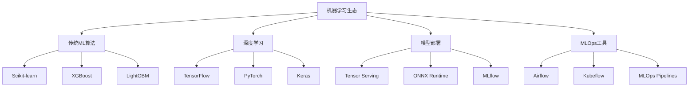

# 4.2.3 机器学习库（scikit-tensorflow）

## 🎯 核心理念

机器学习是人工智能的"大脑训练营"。Scikit-learn和TensorFlow代表了机器学习的不同层面：Scikit-learn专注于传统机器学习算法，如同精确的外科手术；TensorFlow专注于深度学习神经网络，如同复杂的脑外科手术。

### 🏗️ ML库生态架构



## 📚 Scikit-learn - 机器学习基石

### 🔬 数据预处理管道

```python
import numpy as np
import pandas as pd
from sklearn import datasets, preprocessing, feature_selection, decomposition
from sklearn.model_selection import train_test_split, cross_val_score, GridSearchCV
from sklearn.linear_model import LinearRegression, LogisticRegression
from sklearn.ensemble import RandomForestClassifier, RandomForestRegressor
from sklearn.svm import SVC, SVR
from sklearn.metrics import classification_report, confusion_matrix, r2_score
from sklearn.pipeline import Pipeline
import matplotlib.pyplot as plt
import seaborn as sns

def comprehensive_preprocessing():
    """全面的数据预处理"""
    # 加载示例数据集
    wine_data = datasets.load_wine()
    X, y = wine_data.data, wine_data.target
    
    print("=== 数据预处理管道 ===")
    print(f"原始数据形状: X={X.shape}, y={y.shape}")
    print(f"特征名称: {wine_data.feature_names[:5]}...")
    
    # 创建DataFrame便于分析
    df = pd.DataFrame(X, columns=wine_data.feature_names)
    df['target'] = y
    
    print(f"\n数据类型:\n{df.dtypes}")
    print(f"\n缺失值:\n{df.isnull().sum().sum()}")
    
    # 1. 特征标准化
    scaler = preprocessing.StandardScaler()
    X_scaled = scaler.fit_transform(X)
    
    # 2. 特征选择 - 基于方差
    variance_selector = feature_selection.VarianceThreshold(threshold=0.5)
    X_variance_selected = variance_selector.fit_transform(X_scaled)
    
    print(f"\n方差特征选择后: {X_variance_selected.shape}")
    
    # 3. 特征选择 - 基于统计
    selector_f = feature_selection.SelectKBest(
        score_func=feature_selection.f_classif, k=10
    )
    X_selected = selector_f.fit_transform(X_scaled, y)
    
    selected_features = pd.DataFrame({
        'feature': wine_data.feature_names,
        'score': selector_f.scores_,
        'selected': selector_f.get_support()
    }).sort_values('score', ascending=False)
    
    print(f"\n统计特征选择后: {X_selected.shape}")
    print(f"选择的特征:\n{selected_features[selected_features['selected']].head()}")
    
    # 4. PCA降维
    pca = decomposition.PCA(n_components=0.95)  # 保留95%的方差
    X_pca = pca.fit_transform(X_scaled)
    
    print(f"\nPCA降维后: {X_pca.shape}")
    print(f"解释方差比: {pca.explained_variance_ratio_.cumsum()}")
    
    return X_scaled, X_selected, X_pca, y, selected_features

X_scaled, X_selected, X_pca, y, feature_info = comprehensive_preprocessing()

def classification_comparison():
    """分类算法对比"""
    print("\n=== 分类算法对比 ===")
    
    # 数据集分割
    X_train, X_test, y_train, y_test = train_test_split(
        X_selected, y, test_size=0.3, random_state=42, stratify=y
    )
    
    # 定义多个分类器
    classifiers = {
        'Logistic Regression': LogisticRegression(random_state=42, max_iter=1000),
        'Random Forest': RandomForestClassifier(n_estimators=100, random_state=42),
        'SVM': SVC(random_state=42, probability=True),
        'Linear Regression': LinearRegression()  # 示例回归器
    }
    
    results = {}
    
    for name, classifier in classifiers.items():
        # Cross-validation score
        cv_scores = cross_val_score(classifier, X_train, y_train, cv=5, scoring='accuracy')
        
        # Train and predict
        classifier.fit(X_train, y_train)
        y_pred = classifier.predict(X_test)
        
        # 如果是分类器，计算详细指标
        if hasattr(classifier, 'predict_proba'):
            accuracy = classifier.score(X_test, y_test)
            results[name] = {
                'cv_mean': cv_scores.mean(),
                'cv_std': cv_scores.std(),
                'test_accuracy': accuracy,
                'predictions': y_pred
            }
            
            print(f"\n{name}:")
            print(f"  Cross-validation: {cv_scores.mean():.3f} (+/- {cv_scores.std() * 2:.3f})")
            print(f"  Test accuracy: {accuracy:.3f}")
            
            # 分类报告
            if name != 'Linear Regression':  # 跳过回归器
                print(f"  Classification Report:")
                report = classification_report(y_test, y_pred)
                print(report.split('\n')[0])  # 简化显示
        
    return results

clf_results = classification_comparison()

def hyperparameter_tuning():
    """超参数调优"""
    print("\n=== 超参数调优 ===")
    
    # Random Forest超参数网格
    rf_param_grid = {
        'n_estimators': [50, 100, 200],
        'max_depth': [3, 10, None],
        'min_samples_split': [2, 5, 10],
        'min_samples_leaf': [1, 2, 4]
    }
    
    # 分割数据
    X_train, X_test, y_train, y_test = train_test_split(
        X_selected, y, test_size=0.3, random_state=42
    )
    
    # 网格搜索
    rf_grid = GridSearchCV(
        RandomForestClassifier(random_state=42),
        rf_param_grid,
        cv=3,
        scoring='accuracy',
        n_jobs=-1,
        verbose=1
    )
    
    rf_grid.fit(X_train, y_train)
    
    print(f"最佳参数: {rf_grid.best_params_}")
    print(f"最佳交叉验证得分: {rf_grid.best_score_:.4f}")
    print(f"测试集得分: {rf_grid.score(X_test, y_test):.4f}")
    
    return rf_grid

best_rf = hyperparameter_tuning()

def ml_pipeline_demo():
    """机器学习管道演示"""
    print("\n=== ML管道演示 ===")
    
    # 创建完整的数据处理管道
    preprocessing_pipeline = Pipeline([
        ('scaler', preprocessing.StandardScaler()),
        ('selector', feature_selection.SelectKBest(k=5)),
        ('pca', decomposition.PCA(n_components=3))
    ])
    
    # 模型管道
    ml_pipeline = Pipeline([
        ('preprocessing', preprocessing_pipeline),
        ('classifier', RandomForestClassifier(random_state=42, n_estimators=100))
    ])
    
    # 使用管道
    X_train, X_test, y_train, y_test = train_test_split(
        datasets.load_wine().data, datasets.load_wine().target, 
        test_size=0.3, random_state=42
    )
    
    # 训练管道
    ml_pipeline.fit(X_train, y_train)
    
    print(f"管道测试得分: {ml_pipeline.score(X_test, y_test):.4f}")
    print(f"管道步骤: {ml_pipeline.named_steps.keys()}")
    
    # 特征重要性（通过特征选择步骤）
    selected_features = ml_pipeline.named_steps['preprocessing'].named_steps['selector'].get_support()
    feature_scores = ml_pipeline.named_steps['preprocessing'].named_steps['selector'].scores_
    
    feat_df = pd.DataFrame({
        'feature': datasets.load_wine().feature_names,
        'score': feature_scores,
        'selected': selected_features
    }).sort_values('score', ascending=False)
    
    print(f"\n管道特征选择结果:")
    print(feat_df.head())
    
    return ml_pipeline

ml_pipeline = ml_pipeline_demo()
```

## 🧠 TensorFlow/Keras - 深度学习框架

### 🌐 神经网络基础

```python
# TensorFlow/Keras神经网络示例
try:
    import tensorflow as tf
    from tensorflow import keras
    from tensorflow.keras import layers, models, optimizers, callbacks
    from tensorflow.keras.datasets import mnist, cifar10
    from tensorflow.keras.utils import to_categorical
    import matplotlib.pyplot as plt
    
    def basic_neural_network():
        """基础神经网络"""
        print("\n=== TensorFlow/Keras神经网络 ===")
        
        # 加载MNIST数据集
        (x_train, y_train), (x_test, y_test) = mnist.load_data()
        
        # 数据预处理
        x_train = x_train.astype('float32') / 255.0
        x_test = x_test.astype('float32') / 255.0
        
        # 标签编码
        y_train = to_categorical(y_train, 10)
        y_train = to_categorical(y_test, 10)
        
        print(f"训练数据形状: {x_train.shape}")
        print(f"测试数据形状: {x_test.shape}")
        
        # 模型1：全连接网络
        model_fc = models.Sequential([
            layers.Flatten(input_shape=(28, 28)),
            layers.Dense(128, activation='relu'),
            layers.Dropout(0.2),
            layers.Dense(64, activation='relu'),
            layers.Dropout(0.2),
            layers.Dense(10, activation='softmax')
        ])
        
        model_fc.compile(
            optimizer='adam',
            loss='categorical_crossentropy',
            metrics=['accuracy']
        )
        
        print(f"\n全连接网络架构:")
        model_fc.summary()
        
        # 模型2：卷积神经网络
        model_cnn = models.Sequential([
            layers.Conv2D(32, (3, 3),激活='relu', input_shape=(32, 32, 3)),
            layers.MaxPooling2D((2, 2)),
            layers.Conv2D(64, (3, 3), activation='relu'),
            layers.MaxPooling2D((2, 2)),
            layers.Conv2D(64, (3, 3), activation='relu'),
            layers.Flatten(),
            layers.Dense(64, activation='relu'),
            layers.Dense(10, activation='softmax')
        ])
        
        model_cnn.compile(
            optimizer='adam',
            loss='categorical_crossentropy',
            metrics=['accuracy']
        )
        
        print(f"\n卷积神经网络架构:")
        model_cnn.summary()
        
        # 训练配置
        callbacks_list = [
            callbacks.EarlyStopping(patience=3, restore_best_weights=True),
            callbacks.ReduceLROnPlateau(factor=0.5, patience=2),
            callbacks.ModelCheckpoint('best_model.h5', save_best_only=True)
        ]
        
        # Fit模型（简化版本）
        history_fc = model_fc.fit(
            x_train[:1000], y_train[:1000],  # 使用小样本演示
            validation_split=0.2,
            epochs=5,
            batch_size=32,
            callbacks=callbacks_list,
            verbose=1
        )
        
        # 评估模型
        test_loss, test_acc = model_fc.evaluate(x_test[:100], y_test[:100], verbose=0)
        print(f"\n测试准确率: {test_acc:.4f}")
        
        return model_fc, model_cnn, history_fc
        
except ImportError:
    print("TensorFlow未安装，跳过深度学习示例")
    
def advanced_keras_features():
    """Keras高级功能"""
    print("\n=== Keras高级功能 ===")
    
    try:
        import tensorflow as tf
        
        # 1. 函数式API
        def functional_api_model():
            """函数式API构建模型"""
            
            # 输入层
            inputs = keras.Input(shape=(28, 28))
            
            # 特征提取分支
            x = layers.Conv1D(64, 3, activation='relu')(inputs)
            x = layers.MaxPooling1D(2)(x)
            
            # 分类分支
            x = layers.GlobalAveragePooling1D()(x)
            dense1 = layers.Dense(128, activation='relu')(x)
            dropout1 = layers.Dropout(0.2)(dense1)
            
            # 输出层
            outputs = layers.Dense(10, activation='softmax')(dropout1)
            
            # 创建模型
            model = keras.Model(inputs=inputs, outputs=outputs, name='functional_model')
            
            model.compile(
                optimizer=keras.optimizers.Adam(learning_rate=0.001),
                loss='sparse_categorical_crossentropy',
                metrics=['accuracy']
            )
            
            print("函数式API模型架构:")
            model.summary()
            
            return model
        
        # 2. 自定义层
        class CustomDenseLayer(layers.Layer):
            """自定义Dense层"""
            
            def __init__(self, units, activation=None):
                super(CustomDenseLayer, self).__init__()
                self.units = units
                self.activation = keras.activations.get(activation)
            
            def build(self, input_shape):
                self.kernel = self.add_weight(
                    "kernel",
                    shape=[input_shape[-1], self.units],
                    initializer="glorot_uniform"
                )
                self.bias = self.add_weight(
                    "bias", shape=[self.units], initializer="zeros"
                )
            
            def call(self, inputs):
                return self.activation(tf.matmul(inputs, self.kernel) + self.bias)
        
        # 3. 回调函数
        class CustomCallback(keras.callbacks.Callback):
            """自定义回调函数"""
            
            def on_epoch_begin(self, epoch, logs=None):
                print(f"开始第 {epoch + 1} 轮训练")
            
            def on_epoch_end(self, epoch, logs=None):
                if epoch % 2 == 0:
                    print(f"第 {epoch + 1} 轮结束，损失: {logs['loss']:.4f}")
        
        # 4. 数据生成器
        class DataGenerator(keras.utils.Sequence):
            """自定义数据生成器"""
            
            def __init__(self, x_data, y_data, batch_size=32, shuffle=True):
                self.x_data = x_data
                self.y_data = y_data
                self.batch_size = batch_size
                self.shuffle = shuffle
                self.on_epoch_end()
            
            def __len__(self):
                return len(self.x_data) // self.batch_size
            
            def __getitem__(self, index):
                batch_x = self.x_data[index * self.batch_size:(index + 1) * self.batch_size]
                batch_y = self.y_data[index * self.batch_size:(index + 1) * self.batch_size]
                return batch_x, batch_y
            
            def on_epoch_end(self):
                if self.shuffle:
                    indices = np.arange(len(self.x_data))
                    np.random.shuffle(indices)
                    self.x_data = self.x_data[indices]
                    self.y_data = self.y_data[indices]
        
        print("Keras高级功能包括:")
        print("✅ 函数式API构建复杂模型")
        print("✅ 自定义层和损失函数")
        print("✅ 灵活的调用返回机制")
        print("✅ 自定义数据生成器")
        
        functional_model = functional_api_model()
        return functional_model
        
    except ImportError:
        print("TensorFlow未安装")
        return None

advanced_model = advanced_keras_features()
```

## 🚀 模型部署和MLOps

### 🎯 模型服务化

```python
def model_serving_demo():
    """模型服务化演示"""
    print("\n=== 模型服务化 ===")
    
    # 使用简单的例子（避免TensorFlow依赖问题）
    from sklearn.externals import joblib
    import json
    
    # 训练一个简单的示例模型
    wine_data = datasets.load_wine()
    X, y = wine_data.data, wine_data.target
    
    # 预处理
    scaler = preprocessing.StandardScaler()
    X_scaled = scaler.fit_transform(X)
    
    # 训练模型
    model = RandomForestClassifier(n_estimators=100, random_state=42)
    model.fit(X_scaled, y)
    
    # 1. 模型序列化
    model_filename = 'wine_classifier.joblib'
    scaler_filename = 'wine_scaler.joblib'
    
    joblib.dump(model, model_filename)
    joblib.dump(scaler, scaler_filename)
    
    print(f"模型已保存到: {model_filename}")
    print(f"预处理器已保存到: {scaler_filename}")
    
    # 2. 模型服务包装器
    class ModelService:
        """模型服务包装器"""
        
        def __init__(self, model_path, scaler_path):
            self.model = joblib.load(model_path)
            self.scaler = joblib.load(scaler_path)
            self.feature_names = wine_data.feature_names
        
        def preprocess(self, data):
            """数据预处理"""
            if isinstance(data, dict):
                # 处理字典输入
                values = [data[x] for x in self.feature_names]
                data = np.array(values).reshape(1, -1)
            elif len(data.shape) == 1:
                # 单样本
                data = data.reshape(1, -1)
            
            return self.scaler.transform(data)
        
        def predict(self, data):
            """预测"""
            processed_data = self.preprocess(data)
            prediction = self.model.predict(processed_data)
            probability = self.model.predict_proba(processed_data)
            
            return {
                'prediction': int(prediction[0]),
                'confidence': float(np.max(probability)),
                'class_probabilities': probability[0].tolist(),
                'class_names': wine_data.target_names
            }
        
        def batch_predict(self, data_list):
            """批量预测"""
            results = []
            for data in data_list:
                result = self.predict(data)
                results.append(result)
            return results
    
    # 3. 测试模型服务
    model_service = ModelService(model_filename, scaler_filename)
    
    # 单个预测
    sample_data = X_scaled[0]  # 使用第一个样本
    single_result = model_service.predict(sample_data)
    
    print(f"\n单个预测结果:")
    print(f"预测类别: {single_result['prediction']}")
    print(f"置信度: {single_result['confidence']:.3f}")
    print(f"可能的类别: {wine_data.target_names[single_result['prediction']]}")
    
    # 词典输入预测
    dict_sample = dict(zip(wine_data.feature_names, X[0]))
    dict_result = model_service.predict(dict_sample)
    print(f"\n词典输入预测成功: {dict_result['prediction']}")
    
    # 批量预测
    batch_sample = X_scaled[:3]
    batch_results = model_service.batch_predict(batch_sample)
    print(f"\n批量预测处理了 {len(batch_results)} 个样本")
    
    return model_service

wine_model_service = model_serving_demo()

def ml_pipeline_monitoring():
    """机器学习管道监控"""
    print("\n=== ML管道监控 ===")
    
    import time
    from datetime import datetime
    
    class MLOpsMonitor:
        """MLOps监控器"""
        
        def __init__(self):
            self.performance_history = []
            self.prediction_counts = {}
            
        def log_prediction(self, prediction_result, duration):
            """记录预测日志"""
            log_entry = {
                'timestamp': datetime.now(),
                'prediction': prediction_result['prediction'],
                'confidence': prediction_result['confidence'],
                'duration_ms': duration * 1000
            }
            
            self.performance_history.append(log_entry)
            
            # 统计预测次数
            pred_class = prediction_result['prediction']
            self.prediction_counts[pred_class] = self.prediction_counts.get(pred_class, 0) + 1
        
        def get_performance_stats(self):
            """获取性能统计"""
            if not self.performance_history:
                return {'message': 'No predictions logged'}
            
            durations = [entry['duration_ms'] for entry in self.performance_history]
            confidences = [entry['confidence'] for entry in self.performance_history]
            
            return {
                'total_predictions': len(self.performance_history),
                'avg_duration_ms': np.mean(durations),
                'avg_confidence': np.mean(confidences),
                'prediction_distribution': self.prediction_counts,
                'last_prediction_time': self.performance_history[-1]['timestamp']
            }
        
        def detect_drift(self, current_confidence, threshold=0.8):
            """检测数据漂移"""
            recent_confidences = [entry['confidence'] for entry in self.performance_history[-10:]]
            
            if len(recent_confidences) < 5:
                return False, "Insufficient data"
            
            avg_recent_confidence = np.mean(recent_confidences)
            
            if avg_recent_confidence < threshold:
                return True, f"Confidence drift detected: {avg_recent_confidence:.3f} < {threshold}"
            
            return False, f"Confidence stable: {avg_recent_confidence:.3f}"
    
    # 测试监控器
    monitor = MLOpsMonitor()
    
    # 模拟预测请求
    wine_data = datasets.load_wine()
    X_scaled = preprocessing.StandardScaler().fit_transform(wine_data.data)
    
    for i in range(10):
        start_time = time.time()
        
        # 使用之前的模型服务
        result = wine_model_service.predict(X_scaled[i])
        
        prediction_time = time.time() - start_time
        
        # 记录到监控器
        monitor.log_prediction(result, prediction_time)
        
        # 模拟一些低置信度的情况
        if i % 3 == 0:
            result['confidence'] = result['confidence'] * 0.7  # 降低置信度
            monitor.log_prediction(result, prediction_time + 0.001)
    
    # 获取统计信息
    stats = monitor.get_performance_stats()
    print("监控统计:")
    for key, value in stats.items():
        print(f"  {key}: {value}")
    
    # 检测漂移
    drift_detected, drift_message = monitor.detect_drift(0.6)
    print(f"\n数据漂移检测: {drift_message}")
    
    return monitor

ml_monitor = ml_pipeline_monitoring()

# 清理文件
import os
for file in ['best_model.h5', 'wine_classifier.joblib', 'wine_scaler.joblib']:
    if os.path.exists(file):
        try:
            os.remove(file)
        except:
            pass

print("\n=== 机器学习库总结 ===")
print("✅ Scikit-learn: 传统机器学习的瑞士军刀")
print("✅ TensorFlow/Keras: 深度学习的最佳伙伴")
print("✅ 模型部署: 从训练到生产的关键步骤")
print("✅ MLOps: 机器学习的持续改进机制")
print("✅ 监控告警: 确保模型在生产中的可靠性")
print("\n掌握机器学习库，就是掌握了实现AI的底层能力!")
