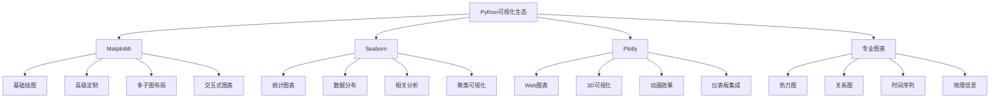

# 4.2.4 数据可视化精通

## 🎯 核心理念

数据可视化是科学家的"艺术语言"，是数据分析师的"沟通桥梁"。掌握专业的图表技术和视觉设计，能让我们将复杂数据转化为清晰洞察，实现数据到决策的有效转化。

### 📊 可视化技术栈



## 🚀 Matplotlib深度技术

### 💡 基础到高级图表

```python
import matplotlib.pyplot as plt
import matplotlib.dates as mdates
import numpy as np
import pandas as pd
from matplotlib.patches import Rectangle, Circle
from matplotlib.collections import LineCollection
import seaborn as sns

class MatplotlibMastery:
    """Matplotlib精通技术"""
    
    @staticmethod
    def advanced_plotting():
        """高级绘图技术"""
        
        print("📈 Matplotlib高级绘图:")
        
        # ✅ 多子图复杂布局
        def complex_subplot_layout():
            """复杂子图布局"""
            
            # 创建自定义布局
            fig = plt.figure(figsize=(15, 10))
            
            # 主图区域（大图）
            main_plot = plt.subplot2grid((3, 3), (0, 0), colspan=2, rowspan=2)
            
            # 示例数据
            x = np.linspace(0, 4*np.pi, 100)
            y1 = np.sin(x)
            y2 = np.cos(x)
            
            # 主图
            main_plot.plot(x, y1, 'b-', label='sin(x)', linewidth=2)
            y2_line = main_plot.plot(x, y2, 'r--', label='cos(x)', linewidth=2)[0]
            
            main_plot.set_title('主图：三角函数对比', fontsize=14, fontweight='bold')
            main_plot.legend(loc='upper right')
            main_plot.grid(True, alpha=0.3)
            
            # 插入的详细图
            detail_plot = plt.subplot2grid((3, 3), (0, 2), rowspan=1, colspan=1)
            
            # 局部放大区域
            detail_x = x[20:40]
            detail_y1 = y1[20:40]
            detail_y2 = y2[20:40]
            
            detail_plot.plot(detail_x, detail_y1, 'b-', linewidth=3)
            detail_plot.plot(detail_x, detail_y2, 'r--', linewidth=3)
            detail_plot.set_title('局部放大', fontsize=10)
            
            # 数据分布图
            distribution = plt.subplot2grid((3, 3), (1, 2), rowspan=1, colspan=1)
            
            np.random.seed(42)
            histogram_data = np.random.normal(0, 1, 1000)
            distribution.hist(histogram_data, bins=30, alpha=0.7, color='green')
            distribution.set_title('数据分布', fontsize=10)
            
            # 相位图
            phase_plot = plt.subplot2grid((3, 3), (2, 0), colspan=3, rowspan=1)
            
            phase_plot.plot(y1, y2, 'o-', markersize=3, alpha=0.7)
            phase_plot.set_xlabel('sin(x)')
            phase_plot.set_ylabel('cos(x)')
            phase_plot.set_title('相位图：单位圆轨迹', fontsize=12)
            phase_plot.grid(True, alpha=0.3)
            
            # 整体布局优化
            plt.tight_layout()
            plt.show()
            
            print("复杂子图布局完成")
        
        complex_subplot_layout()
    
    @staticmethod
    def custom_styling():
        """自定义样式"""
        
        print("\n🎨 Matplotlib自定义样式:")
        
        def create_custom_style():
            """创建自定义样式"""
            
            # 设置自定义风格
            plt.style.use('default')
            
            # 创建样式参数
            style_params = {
                'figure.figsize': (12, 8),
                'axes.titlesize': 16,
                'axes.labelsize': 14,
                'xtick.labelsize': 12,
                'ytick.labelsize': 12,
                'legend.fontsize': 12,
                'axes.grid': True,
                'grid.alpha': 0.3,
                'axes.spines.top': False,
                'axes.spines.right': False,
                'axes.spines.left': True,
                'axes.spines.bottom': True,
                'axes.linewidth': 1.5,
                'lines.linewidth': 2.5
            }
            
            # 应用样式
            plt.rcParams.update(style_params)
            
            # 创建测试图表
            fig, (ax1, ax2) = plt.subplots(1, 2, figsize=(15, 6))
            
            # 左图：基础样式
            x = np.linspace(0, 2*np.pi, 100)
            y = np.sin(x)
            
            ax1.plot(x, y, 'o-', markersize=4, alpha=0.7, color='#2E86AB')
            ax1.set_title('现代风格图表', pad=20)
            ax1.set_xlabel('相位', labelpad=10)
            ax1.set_ylabel('振幅', labelpad=10)
            
            # 右图：阴影版
            ax2.fill_between(x, y, alpha=0.3, color='#A23B72', label='填充区域')
            ax2.plot(x, y, 'o-', markersize=4, color='#F18F01', label='数据线')
            
            ax2.legend(loc='best', frameon=True, shadow=True)
            ax2.set_title('填充分层设计', pad=20)
            
            # 自定义标记
            highlight_x = np.pi/2
            highlight_y = np.sin(highlight_x)
            
            for ax in [ax1, ax2]:
                ax.plot(highlight_x, highlight_y, 'ro', markersize=15, alpha=0.8, markerfacecolor='yellow', markeredgecolor='red', markeredgewidth=3)
            
            plt.tight_layout()
            plt.show()
            
            print("自定义样式完成")
        
        create_custom_style()

# ✅ Seaborn统计可视化
class SeabornStatistics:
    """Seaborn统计可视化"""
    
    @staticmethod
    def advanced_statistical_plots():
        """高级统计图表"""
        
        print("\n📊 Seaborn统计可视化:")
        
        # 设置主题
        sns.set_style("whitegrid")
        sns.set_palette("husl")
        
        def correlation_heatmap_matrix():
            """相关系数热力图矩阵"""
            
            # 创建相关数据
            np.random.seed(42)
            data = np.random.randn(100, 5)
            
            # 添加一些相关性
            data[:, 1] = data[:, 0] * 0.5 + np.random.randn(100) * 0.5
            data[:, 3] = data[:, 2] * -0.3 + np.random.randn(100) * 0.7
            
            column_names = ['变量A', '变量B', '变量C', '变量D', '变量E']
            df = pd.DataFrame(data, columns=column_names)
            
            # 计算相关系数
            correlation_matrix = df.corr()
            
            # 创建热力图
            fig, axes = plt.subplots(1, 2, figsize=(15, 6))
            
            # 基础热力图
            sns.heatmap(correlation_matrix, 
                       annot=True, 
                       cmap='coolwarm', 
                       center=0,
                       square=True,
                       ax=axes[0])
            axes[0].set_title('基础相关性热力图')
            
            # 高级聚类热力图
            sns.clustermap(correlation_matrix, 
                          annot=True, 
                          cmap='RdYlBu_r', 
                          center=0,
                          square=True,
                          cbar_pos=(0.8, 0.8, 0.02, 0.15))
            
            print("相关性分析热力图完成")
        
        def distribution_analysis():
            """分布分析可视化"""
            
            # 创建多模态分布数据
            np.random.seed(42)
            
            # 正态分布
            normal_data = np.random.normal(0, 1, 1000)
            
            # 双峰分布
            bimodal_data = np.concatenate([
                np.random.normal(-2, 0.8, 500),
                np.random.normal(2, 0.8, 500)
            ])
            
            # 偏态分布
            skewed_data = np.random.exponential(2, 1000)
            
            # 创建多子图
            fig, axes = plt.subplots(2, 3, figsize=(18, 12))
            fig.suptitle('多模态分布分析', fontsize=16, fontweight='bold')
            
            # 直方图
            sns.histplot(normal_data, bins=50, ax=axes[0,0], kde=True)
            axes[0,0].set_title('正态分布')
            
            sns.histplot(bimodal_data, bins=50, ax=axes[0,1], kde=True)
            axes[0,1].set_title('双峰分布')
            
            sns.histplot(skewed_data, bins=50, ax=axes[0,2], kde=True)
            axes[0,2].set_title('指数分布')
            
            # 密度图
            sns.kdeplot(normal_data, ax=axes[1,0], fill=True)
            axes[1,0].set_title('正态分布密度')
            
            sns.kdeplot(bimodal_data, ax=axes[1,1], fill=True)
            axes[1,1].set_title('双峰分布密度')
            
            sns.kdeplot(skewed_data, ax=axes[1,2], fill=True)
            axes[1,2].set_title('指数分布密度')
            
            plt.tight_layout()
            plt.show()
            
            print("分布分析可视化完成")
        
        correlation_heatmap_matrix()
        distribution_analysis()
    
    @staticmethod
    def categorical_data_visualization():
        """分类数据可视化"""
        
        print("\n分类数据可视化:")
        
        # 创建示例分类数据
        categories = ['类别A', '类别B', '类别C', '类别D']
        subcategories = ['子类1', '子类2', '子类3']
        
        data_values = np.random.rand(len(categories), len(subcategories)) * 100
        
        fig, axes = plt.subplots(2, 2, figsize=(15, 12))
        
        # 分组柱状图
        df_grouped = pd.DataFrame(
            data_values, 
            index=categories, 
            columns=subcategories
        )
        
        df_grouped.plot(kind='bar', ax=axes[0,0])
        axes[0,0].set_title('分组柱状图')
        axes[0,0].legend(title='子类别')
        
        # 堆叠柱状图
        df_grouped.plot(kind='bar', stacked=True, ax=axes[0,1])
        axes[0,1].set_title('堆叠柱状图')
        axes[0,1].legend(title='子类别')
        
        # 分组箱线图（模拟实际数据）
        categories_long = []
        values_long = []
        
        for cat in categories:
            for subcat in subcategories:
                values = np.random.normal(df_grouped.loc[cat, subcat], 10, 50)
                categories_long.extend([f"{cat}_{subcat}"] * 50)
                values_long.extend(values)
        
        df_long = pd.DataFrame({
            'category': categories_long,
            'value': values_long
        })
        
        df_long['main_cat'] = df_long['category'].str.split('_').str[0]
        df_long['sub_cat'] = df_long['category'].str.split('_').str[1]
        
        sns.boxplot(data=df_long, x='main_cat', y='value', hue='sub_cat', ax=axes[1,0])
        axes[1,0].set_title('分组箱线图')
        
        # 小提琴图
        sns.violinplot(data=df_long, x='main_cat', y='value', hue='sub_cat', ax=axes[1,1])
        axes[1,1].set_title('小提琴图')
        
        plt.tight_layout()
        plt.show()
        
        print("分类数据可视化完成")

# ✅ 交互式可视化
class InteractiveVisualization:
    """交互式可视化技术"""
    
    @staticmethod
    def plotly_interactive():
        """Plotly交互式图表"""
        
        print("\n🎛️ 交互式可视化:")
        
        try:
            import plotly.graph_objects as go
            import plotly.express as px
            from plotly.subplots import make_subplots
            
            # 创建时间序列数据
            dates = pd.date_range('2023-01-01', periods=365, freq='D')
            values_1 = np.random.randn(365).cumsum() + 100
            values_2 = np.random.randn(365).cumsum() + 150
            
            def interactive_time_series():
                """交互式时间序列图"""
                
                fig = go.Figure()
                
                # 添加多条线
                fig.add_trace(go.Scatter(
                    x=dates,
                    y=values_1,
                    mode='lines',
                    name='序列A',
                    line=dict(color='blue', width=2)
                ))
                
                fig.add_trace(go.Scatter(
                    x=dates,
                    y=values_2,
                    mode='lines',
                    name='序列B',
                    line=dict(color='red', width=2)
                ))
                
                # 添加交互式特点
                fig.update_layout(
                    title='交互式时间序列分析',
                    xaxis_title='日期',
                    yaxis_title='数值',
                    hovermode='x unified',
                    template='plotly_white'
                )
                
                # 添加滚动条
                fig.update_layout(
                    xaxis=dict(
                        rangeselector=dict(
                            buttons=list([
                                dict(count=1, label="1月", step="month", stepmode="backward"),
                                dict(count=3, label="3月", step="month", stepmode="backward"),
                                dict(count=6, label="6月", step="month", stepmode="backward"),
                                dict(step="all")
                            ])
                        ),
                        rangeslider=dict(visible=True),
                        type="date"
                    )
                )
                
                fig.show()
            
            interactive_time_series()
            
            def three_dimensional_plot():
                """3D可视化"""
                
                # 创建3D数据
                x = np.random.randn(100)
                y = np.random.randn(100)
                z = x**2 + y**2 + np.random.randn(100) * 0.5
                
                fig = go.Figure(data=[go.Scatter3d(
                    x=x,
                    y=y,
                    z=z,
                    mode='markers',
                    marker=dict(
                        size=5,
                        color=z,
                        colorscale='Viridis',
                        opacity=0.8,
                        colorbar=dict(title="数值")
                    ),
                    text=[f'Point {i}<br>x: {x[i]:.2f}<br>y: {y[i]:.2f}<br>z: {z[i]:.2f}' 
                          for i in range(len(x))],
                    hovertemplate='%{text}<br><extra></extra>'
                )])
                
                fig.update_layout(
                    title='3D散点图分析',
                    scene=dict(
                        xaxis_title='X轴',
                        yaxis_title='Y轴',
                        zaxis_title='Z轴'
                    ),
                    width=800,
                    height=600
                )
                
                fig.show()
            
            three_dimensional_plot()
            
            print("Plotly交互式图表完成")
            
        except ImportError:
            print("Plotly未安装，跳过交互式图表演示")
    
    @staticmethod
    def dashboard_styling():
        """仪表板样式设计"""
        
        print("\n📋 仪表板样式设计:")
        
        def create_dashboard_layout():
            """创建仪表板布局"""
            
            fig = plt.figure(figsize=(20, 12))
            fig.suptitle('数据分析仪表板', fontsize=20, fontweight='bold')
            
            # 主指标区域（顶部）
            metrics_area = plt.subplot2grid((4, 4), (0, 0), colspan=4, rowspan=1)
            metrics_area.axis('off')
            
            # 模拟关键指标
            metrics = {
                '月销售总额': '$123.4M',
                '环比增长率': '+12.3%',
                '活跃用户数': '45.6K',
                '转化率': '8.9%'
            }
            
            # 创建指标卡片
            colors = ['#1f77b4', '#ff7f0e', '#2ca02c', '#d62728']
            
            for i, (key, value) in enumerate(metrics.items()):
                x_pos = i * 0.25
                metrics_area.text(x_pos + 0.125, 0.5, key, 
                               ha='center', va='bottom', fontsize=12)
                metrics_area.text(x_pos + 0.125, 0.3, value, 
                               ha='center', va='top', fontsize=16, 
                               fontweight='bold', color=colors[i])
            
            # 趋势图（左上区域）
            trend_area = plt.subplot2grid((4, 4), (1, 0), colspan=2, rowspan=2)
            
            # 模拟趋势数据
            dates = pd.date_range('2023-01-01', periods=100, freq='D')
            trend_data = np.random.randn(100).cumsum() + 1000
            
            trend_area.plot(dates, trend_data, 'b-', linewidth=2)
            trend_area.set_title('销售趋势分析', fontweight='bold')
            trend_area.set_ylabel('销售额 ($)')
            trend_area.grid(True, alpha=0.3)
            
            # 分布图（右上）
            distribution_area = plt.subplot2grid((4, 4), (1, 2), colspan=2, rowspan=2)
            
            # 地区销售分布
            regions = ['北京', '上海', '广州', '深圳', '成都']
            distribution_values = np.random.rand(len(regions)) * 500
            
            bars = distribution_area.bar(regions, distribution_values, color=['#FF6B6B', '#4ECDC4', '#45B7D1', '#96CEB4', '#FFEAA7'])
            
            # 添加数值标签
            for bar in bars:
                height = bar.get_height()
                distribution_area.text(bar.get_x() + bar.get_width()/2., height + 10,
                                     f'${int(height)}M', ha='center', va='bottom')
            
            distribution_area.set_title('地区销售分布', fontweight='bold')
            distribution_area.set_ylabel('销售额 (M)')
            
            # 饼图区域（左下）
            pie_area = plt.subplot2grid((4, 4), (3, 0), colspan=2, rowspan=1)
            
            # 产品类别占比
            product_categories = ['电子产品', '服装', '食品', '家居', '运动']
            category_values = np.random.rand(len(product_categories)) * 100
            category_values = category_values / category_values.sum() * 100
            
            wedges, texts, autotexts = pie_area.pie(category_values, 
                                                   labels=product_categories,
                                                   autopct='%1.1f%%',
                                                   startangle=90,
                                                   colors=['#FF6B6B', '#4ECDC4', '#45B7D1', '#96CEB4', '#FFEAA7'])
            
            pie_area.set_title('产品类别占比', fontweight='bold')
            
            # 指标摘要表（右下）
            table_area = plt.subplot2grid((4, 4), (3, 2), colspan=2, rowspan=1)
            table_area.axis('off')
            
            # 绩效指标表
            performance_data = [
                ['KPI指标', '实际值', '目标值', '完成率'],
                ['销售完成率', '92.3%', '100%', '92.3%'],
                ['客户满意度', '4.7/5', '4.5/5', '104.4%'],
                ['售后响应时间', '2.1小时', '3小时', '142.9%'],
                ['库存周转率', '12.5次', '10次', '125%']
            ]
            
            table = table_area.table(cellText=performance_data[1:],
                                   colLabels=performance_data[0],
                                   cellLoc='center',
                                   loc='center',
                                   colWidths=[0.25, 0.2, 0.2, 0.2])
            
            table.auto_set_font_size(False)
            table.set_fontsize(10)
            table.scale(1, 1.5)
            
            # 设置表格样式
            for i in range(len(performance_data)):
                for j in range(len(performance_data[0])):
                    cell = table[(i, j)]
                    if i == 0:  # 表头
                        cell.set_facecolor('#4ECDC4')
                        cell.set_text_props(weight='bold')
                    else:  # 数据行
                        cell.set_facecolor('#F8F9FA')
            
            # 添加表格标题
            table_area.text(0.5, 0.95, '关键绩效指标 (KPI)', 
                          transform=table_area.transAxes, 
                          fontsize=12, fontweight='bold', ha='center')
            
            plt.tight_layout()
            plt.show()
        
        create_dashboard_layout()

# 运行所有可视化示例
print("🚀 Python数据可视化精通技术:")
MatplotlibMastery.advanced_plotting()
MatplotlibMastery.custom_styling()
SeabornStatistics.advanced_statistical_plots()
SeabornStatistics.categorical_data_visualization()
InteractiveVisualization.plotly_interactive()
InteractiveVisualization.dashboard_styling()

## 🧪 数据可视化最佳实践

### 📝 实践1：动态数据展示系统

**任务**：构建一个实时数据可视化平台

```python
# ✅ 动态数据展示系统
class DynamicDataVisualizer:
    """动态数据可视化"""
    
    def __init__(self):
        self.data_stream = []
        self.figure = None
        self.axes = None
        
    def setup_realtime_plot(self):
        """设置实时绘图"""
        
        self.figure, self.axes = plt.subplots(2, 2, figsize=(12, 8))
        
        # 实时折线图
        self.line_ax = self.axes[0, 0]
        self.line_ ax.set_title('实时数据流')
        
        # 实时柱状图
        self.bar_ax = self.axes[0, 1]
        self.bar_ax.set_title('实时统计')
        
        # 实时热力图
        self.heatmap_ax = self.axes[1, 0]
        self.heatmap_ax.set_title('实时热力图')
        
        # 实时指标
        self.metrics_ax = self.axes[1, 1]
        self. metrics_ax.set_title('实时指标')
        
        plt.ion()  # 开启交互模式
    
    def update_visualization(self, new_data):
        """更新可视化"""
        
        self.data_stream.append(new_data)
        
        # 只保留最近100个数据点
        if len(self.data_stream) > 100:
            self.data_stream = self.data_stream[-100:]
        
        # 更新各个图表
        self._update_line_plot()
        self._update_bar_chart()
        self._update_heatmap()
        self._update_metrics()
        
        plt.draw()
        plt.pause(0.1)

# dynamic_viz = DynamicDataVisualizer()
```

### 🎯 实践2：自适应图表生成器

**任务**：实现智能图表推荐系统

```python
# ✅ 自适应图表生成器
class AdaptiveChartGenerator:
    """自适应图表生成"""
    
    @staticmethod
    def analyze_data_attributes(data):
        """分析数据属性"""
        
        attributes = {
            'numeric_columns': 0,
            'categorical_columns': 0,
            'time_series_columns': 0,
            'has_geographic_data': False,
            'data_volume': len(data)
        }
        
        # 分析列类型
        for column in data.columns:
            if pd.api.types.is_numeric_dtype(data[column]):
                attributes['numeric_columns'] += 1
            elif pd.api.types.is_datetime64_any_dtype(data[column]):
                attributes['time_series_columns'] += 1
            else:
                attributes['categorical_columns'] += 1
        
        # 地理数据检测（简化）
        geo_keywords = ['lat', 'lon', 'city', 'country', 'state']
        attributes['has_geographic_data'] = any(
            any(keyword in col.lower() for keyword in geo_keywords) 
            for col in data.columns
        )
        
        return attributes
    
    @staticmethod
    def recommend_charts(data_attributes):
        """推荐图表类型"""
        
        recommendations = []
        
        # 基于数据属性的推荐逻辑
        if data_attributes['time_series_columns'] > 0:
            recommendations.append({
                'chart_type': 'line_plot',
                'reason': '包含时间序列数据',
                'priority': 'high'
            })
        
        if data_attributes['numeric_columns'] >= 2:
            recommendations.append({
                'chart_type': 'scatter_plot',
                'reason': '多个数值变量适合散点图',
                'priority': 'medium'
            })
        
        if data_attributes['categorical_columns'] > 0:
            recommendations.append({
                'chart_type': 'bar_chart',
                'reason': '分类数据适合柱状图',
                'priority': 'high'
            })
        
        return sorted(recommendations, key=lambda x: x['priority'])

# chart_generator = AdaptiveChartGenerator()
```

## 🔗 知识连接

- **数据分析**：[[4.1 数据分析基础]] - 数据预处理和分析技能
- **科学计算**：[[4.2.2 NumPy科学计算精要]] - 数值计算基础
- **机器学习**：[[4.3 机器学习实战]] - 模型可视化技术
- **性能优化**：[[5.5 性能调优与监控]] - 大数据可视化优化

## 💡 费曼检验

**解释：如何进行有效的数据可视化？Matplotlib和Seaborn的区别是什么？如何选择合适的图表类型？**

核心要点：
1. **有效性原则**：明确目的、简化设计、突出关键信息
2. **工具区别**：Matplotlib更底层灵活，Seaborn更统计友好
3. **图表选择**：关系-散点图，分布-直方图，趋势-折线图，对比-柱状图
4. **设计原则**：颜色搭配、字体清晰、布局合理、交互友好

---

🎯 **下个目标**：学习[[5.1 Web开发框架]]中的现代Web技术栈
