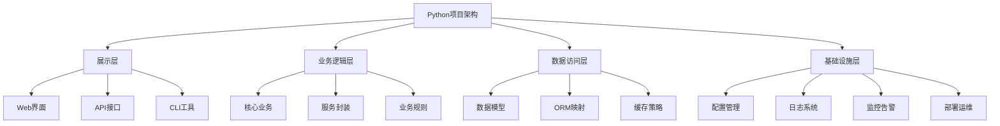

# 4.3 架构设计与工程实践

## 🎯 核心理念

软件架构是"系统的骨骼与血液"。优秀的架构设计能让复杂系统变得清晰、可维护、可扩展，体现了"结构与功能并重"的工程哲学。

### 🌟 项目架构设计图



## 🚀 架构实践

### 💡 项目组织结构

```python
# ✅ 标准项目结构
project_structure = {
    "现代Python项目结构": {
        "根目录文件": [
            "pyproject.toml",      # 项目配置与依赖
            "README.md",           # 项目说明
            "LICENSE",             # 许可证
            ".gitignore",          # Git忽略规则
            ".pre-commit-config.yaml"  # 代码质量检查
        ],
        "源码目录": {
            "src/": {
                "package_name/": [
                    "__init__.py",     # 包初始化
                    "models/",         # 数据模型
                    "services/",       # 业务服务
                    "api/",           # API接口
                    "utils/",         # 工具函数
                    "config/"         # 配置管理
                ]
            }
        },
        "其他目录": {
            "tests/": [
                "unit/",             # 单元测试
                "integration/",      # 集成测试
                "fixtures/"          # 测试数据
            ],
            "docs/": [
                "api.md",           # API文档
                "deployment.md"      # 部署文档
            ],
            "scripts/": [
                "setup.py",         # 安装脚本
                "deploy.py"         # 部署脚本
            ]
        }
    }
}

class ProjectArchitecture:
    """项目架构设计"""
    
    @staticmethod
    def clean_architecture_example():
        """清洁架构示例"""
        
        # ✅ 依赖注入模式
        class DatabaseInterface:
            """数据库接口抽象"""
            def save(self, data): pass
            def find(self, query): pass
            def delete(self, id): pass
        
        class BusinessService:
            """业务服务层"""
            def __init__(self, db: DatabaseInterface):
                self.db = db
            
            def create_user(self, user_data):
                # 业务逻辑验证
                if not self._validate_user_data(user_data):
                    raise ValueError("Invalid user data")
                
                # 通过接口访问数据层
                return self.db.save(user_data)
            
            def _validate_user_data(self, data):
                return "name" in data and "email" in data
        
        # ✅ 配置管理
        import os
        from dataclasses import dataclass
        from typing import Optional
        
        @dataclass
        class DatabaseConfig:
            host: str
            port: int
            username: str
            password: str
            database: str
            
            @classmethod
            def from_env(cls):
                return cls(
                    host=os.getenv("DB_HOST", "localhost"),
                    port=int(os.getenv("DB_PORT", "5432")),
                    username=os.getenv("DB_USER", "user"),
                    password=os.getenv("DB_PASSWORD", ""),
                    database=os.getenv("DB_NAME", "mydb")
                )
        
        return DatabaseConfig.from_env()
    
    @staticmethod
    def modular_organiztion():
        """模块化组织"""
        
        # ✅ 模块化设计示例
        class ModuleRegistry:
            """模块注册器"""
            def __init__(self):
                self._modules = {}
                self._dependencies = {}
            
            def register(self, name, module, dependencies=None):
                """注册模块"""
                self._modules[name] = module
                self._dependencies[name] = dependencies or []
            
            def get_module(self, name):
                """获取模块实例"""
                if name in self._modules:
                    return self._modules[name]
                else:
                    raise ValueError(f"Module '{name}' not found")
            
            def resolve_dependencies(self, module_name):
                """解析依赖关系"""
                deps = self._dependencies.get(module_name, [])
                return {dep: self.get_module(dep) for dep in deps}
        
        # ✅ 装饰器模式用于模块管理
        def module(name, dependencies=None):
            """模块装饰器"""
            def decorator(cls):
                def wrapper(*args, **kwargs):
                    instance = cls(*args, **kwargs)
                    registry.register(name, instance, dependencies)
                    return instance
                return wrapper
            return decorator
        
        registry = ModuleRegistry()
        return registry

# ✅ 配置管理系统
class ConfigurationManagement:
    """配置管理系统"""
    
    @staticmethod
    def environment_based_config():
        """基于环境的配置"""
        
        import os
        from typing import Dict, Any
        
        class EnvironmentConfig:
            """环境配置"""
            
            def __init__(self):
                self.env = os.getenv("ENV", "development")
                self._config = self._load_config()
            
            def _load_config(self):
                """加载配置"""
                base_config = {
                    "app": {
                        "name": "MyApp"},
                        "version": "1.0.0",
                        "debug": False
                    },
                    "database": {
                        "host": "localhost",
                        "port": 5432
                    }
                }
                
                env_specific = self._get_env_specific_config()
                return self._merge_configs(base_config, env_specific)
            
            def _get_env_specific_config(self):
                """获取环境特定配置"""
                if self.env == "production":
                    return {
                        "app": {"debug": False},
                        "database": {
                            "host": os.getenv("DB_HOST", "prod-db.internal"),
                            "port": int(os.getenv("DB_PORT", "5432"))
                        }
                    }
                elif self.env == "testing":
                    return {
                        "app": {"debug": True},
                        "database": {
                            "host": "test-db",
                            "port": 5432
                        }
                    }
                else:  # development
                    return {
                        "app": {"debug": True},
                        "database": {
                            "host": "localhost",
                            "port": 5432
                        }
                    }
            
            def _merge_configs(self, base, override):
                """合并配置"""
                result = base.copy()
                for key, value in override.items():
                    if key in result and isinstance(result[key], dict):
                        result[key] = self._merge_configs(result[key], value)
                    else:
                        result[key] = value
                return result
            
            def get(self, key_path: str, default=None):
                """获取配置值"""
                keys = key_path.split('.')
                value = self._config
                
                try:
                    for key in keys:
                        value = value[key]
                    return value
                except (KeyError, TypeError):
                    return default
        
        return EnvironmentConfig()

# ✅ 代码质量保证
class QualityAssurance:
    """代码质量保证"""
    
    @staticmethod
    def code_structure_rules():
        """代码结构规则"""
        
        # ✅ 单一职责原则应用
        class DataProcessor:
            """数据处理类"""
            
            def __init__(self):
                self.validators = []
                self.transformers = []
            
            def add_validator(self, validator):
                self.validators.append(validator)
            
            def add transfomer(self, transformer):
                self.transformers.append(transformer)
            
            def process(self, data):
                # 验证数据
                for validator in self.validators:
                    if not validator.validate(data):
                        raise ValueError("Data validation failed")
                
                # 转换数据
                for transformer in self.transformers:
                    data = transformer.transform(data)
                
                return data
        
        # ✅ 开闭原则应用
        class PaymentProcessor:
            """支付处理器基类"""
            
            def process_payment(self, amount):
                raise NotImplementedError
        
        class CreditCardProcessor(PaymentProcessor):
            """信用卡支付处理"""
            
            def process_payment(self, amount):
                return f"Processed {amount} via Credit Card"
        
        class PayPalProcessor(PaymentProcessor):
            """PayPal支付处理"""
            
            def process_payment(self, amount):
                return f"Processed {amount} via PayPal"
        
        # ✅ 依赖倒置原则应用
        class EmailService:
            """邮件服务抽象"""
            
            def send_email(self, to, subject, body):
                raise NotImplementedError
        
        class SMTPEmailService(EmailService):
            """SMTP邮件服务实现"""
            
            def send_email(self, to, subject, body):
                return f"Email sent to {to} via SMTP"
        
        class NotificationService:
            """通知服务"""
            
            def __init__(self, email_service: EmailService):
                self.email_service = email_service
            
            def notify_user(self, user_email, message):
                self.email_service.send_email(user_email, "Notification", message)
        
        return NotificationService(SMTPEmailService())

# ✅ DevOps实践
class DevOpsPractices:
    """DevOps实践"""
    
    @staticmethod
    def ci_cd_pipeline():
        """CI/CD管道配置"""
        
        # ✅ GitHub Actions配置示例
        github_actions_config = """
        name: CI/CD Pipeline
        
        on:
          push:
            branches: [ main, develop ]
          pull_request:
            branches: [ main ]
        
        jobs:
          test:
            runs-on: ubuntu-latest
            strategy:
              matrix:
                python-version: [3.8, 3.9, '3.10', '3.11']
            
            steps:
            - uses: actions/checkout@v3
            - name: Set up Python ${{ matrix.python-version }}
              uses: actions/setup-python@v4
              with:
                python-version: ${{ matrix.python-version }}
            
            - name: Install dependencies
              run: |
                pip install -r requirements.txt
                pip install pytest pytest-cov
            
            - name: Run tests
              run: |
                pytest --cov=src tests/
            
            - name: Upload coverage
              uses: codecov/codecov-action@v3
        
          deploy:
            needs: test
            runs-on: ubuntu-latest
            if: github.ref == 'refs/heads/main'
            
            steps:
            - name: Deploy to production
              run: echo "Deploying to production"
        """
        
        # ✅ Docker配置示例
        dockerfile_config = """
        FROM python:3.11-slim
        
        # 设置工作目录
        WORKDIR /app
        
        # 安装系统依赖
        RUN apt-get update && apt-get install -y \\
            gcc \\
            && rm -rf /var/lib/apt/lists/*
        
        # 复制依赖文件
        COPY requirements.txt .
        
        # 安装Python依赖
        RUN pip install --no-cache-dir -r requirements.txt
        
        # 复制源代码
        COPY src/ ./src/
        
        # 暴露端口
        EXPOSE 8000
        
        # 启动命令
        CMD ["python", "-m", "src.main"]
        """
        
        return github_actions_config, dockerfile_config
    
    @staticmethod
    def monitoring_setup():
        """监控设置"""
        
        # ✅ 应用指标收集
        class MetricsCollector:
            """指标收集器"""
            
            def __init__(self):
                self.counters = {}
                self.timers = {}
                self.gauges = {}
            
            def increment_counter(self, name, value=1):
                """增加计数器"""
                self.counters[name] = self.counters.get(name, 0) + value
            
            def start_timer(self, name):
                """开始计时"""
                import time
                self.timers[name] = time.time()
            
            def end_timer(self, name):
                """结束计时"""
                import time
                if name in self.timers:
                    duration = time.time() - self.timers[name]
                    self.increment_counter(f"{name}_duration", duration)
                    del self.timers[name]
            
            def set_gauge(self, name, value):
                """设置测量值"""
                self.gauges[name] = value
            
            def get_metrics(self):
                """获取所有指标"""
                return {
                    "counters": self.counters.copy(),
                    "gauges": self.gauges.copy()
                }
        
        # ✅ 健康检查
        class HealthChecker:
            """健康检查"""
            
            def __init__(self):
                self.checkers = []
            
            def add_check(self, name, check_func):
                """添加健康检查"""
                self.checkers.append((name, check_func))
            
            def check_health(self):
                """执行健康检查"""
                results = {}
                overall_healthy = True
                
                for name, check_func in self.checkers:
                    try:
                        result = check_func()
                        results[name] = {"status": "healthy", "details": result}
                    except Exception as e:
                        results[name] = {"status": "unhealthy", "error": str(e)}
                        overall_healthy = False
                
                return {
                    "healthy": overall_healthy,
                    "checks": results
                }
        
        metrics_collector = MetricsCollector()
        health_checker = HealthChecker()
        
        return metrics_collector, health_checker

# 运行架构示例
config = ProjectArchitecture.clean_architecture_example()
db_config = ConfigurationManagement.environment_based_config()
notification_service = QualityAssurance.code_structure_rules()
ci_cd_config, docker_config = DevOpsPractices.ci_cd_pipeline()
metrics, health = DevOpsPractices.monitoring_setup()

## 🧪 架构设计实践

### 📝 练习1：设计微服务架构

**任务**：设计一个电商微服务架构

```python
# ✅ 微服务架构示例
class MicroserviceArchitecture:
    """微服务架构设计"""
    
    def __init__(self):
        self.services = {}
    
    def register_service(self, name, service):
        """注册服务"""
        self.services[name] = service
    
    def get_service(self, name):
        """获取服务"""
        return self.services.get(name)
    
    def create_user_service(self):
        """用户服务"""
        class UserService:
            def create_user(self, user_data):
                return {"id": 123, "name": user_data["name"]}
            
            def get_user(self, user_id):
                return {"id": user_id, "name": "John Doe"}
        
        return UserService()
    
    def create_order_service(self):
        """订单服务"""
        class OrderService:
            def __init__(self, user_service):
                self.user_service = user_service
            
            def create_order(self, user_id, products):
                user = self.user_service.get_user(user_id)
                return {
                    "order_id": 456,
                    "user": user,
                    "products": products,
                    "status": "pending"
                }
        
        return OrderService(self.create_user_service())
```

### 🎯 练习2：实现事件驱动架构

**任务**：实现基于事件的系统解耦

```python
# ✅ 事件驱动架构
class EventDrivenArchitecture:
    """事件驱动架构"""
    
    def __init__(self):
        self.subscribers = {}
    
    def subscribe(self, event_type, callback):
        """订阅事件"""
        if event_type not in self.subscribers:
            self.subscribers[event_type] = []
        self.subscribers[event_type].append(callback)
    
    def publish(self, event_type, data):
        """发布事件"""
        if event_type in self.subscribers:
            for callback in self.subscribers[event_type]:
                callback(data)
    
    def create_events(self):
        """创建事件系统"""
        def user_registered(data):
            print(f"Welcome email sent to: {data['email']}")
        
        def order_created(data):
            print(f"Order confirmation email sent for: {data['order_id']}")
        
        # 订阅事件
        self.subscribe("user.registered", user_registered)
        self.subscribe("order.created", order_created)
        
        # 发布事件
        self.publish("user.registered", {"email": "user@example.com"})
        self.publish("order.created", {"order_id": "12345"})
```

## 🔗 知识连接

- **函数设计**：[[1.8 函数设计原则]] - 函数级架构原则
- **面向对象**：[[2.1 面向对象编程精要]] - 类级别架构设计
- **依赖管理**：[[4.2 第三方库]] - 如何选择和管理依赖

## 💡 费曼检验

**解释：什么是软件架构？好的架构设计应该具备哪些特征？如何评估一个架构设计的好坏？**

核心要点：
1. **清晰性**：架构目标明确，结构清晰易懂
2. **可维护性**：易于修改和扩展，降低维护成本
3. **可测试性**：支持单元测试和集成测试
4. **性能考虑**：满足性能需求且可优化
5. **可扩展性**：支持水平和垂直扩展

---

🎯 **下个目标**：学习[[4.3.1 项目架构设计模式]]中的具体实现细节
