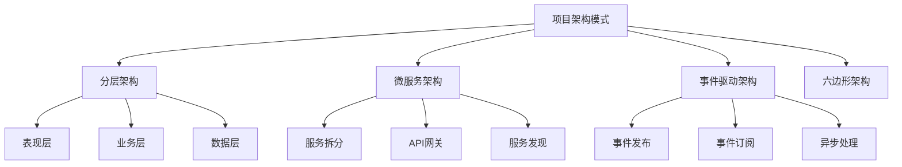

# 4.3.1 项目架构设计模式

## 🎯 核心理念

项目架构是软件系统的"骨架"。一个优雅的架构设计可以让代码在变化中保持稳定，在复杂中保持清晰。掌握架构模式，就是在混沌中构建秩序的艺术。

### 🏗️ 架构模式总览



## 📚 经典架构模式

### 🏢 分层架构 - 经典三层

```python
"""
分层架构示例：Web应用的三层结构
"""
from abc import ABC, abstractmethod
from typing import List, Dict, Any
from dataclasses import dataclass
from datetime import datetime
import sqlite3
import json

# 1. 数据层 - Data Layer
@dataclass
class User:
    """用户数据模型"""
    id: int = None
    username: str = ""
    email: str = ""
    created_at: datetime = None
    
    def to_dict(self) -> Dict[str, Any]:
        return {
            'id': self.id,
            'username': self.username,
            'email': self.email,
            'created_at': self.created_at.isoformat() if self.created_at else None
        }

class UserRepository(ABC):
    """用户仓储抽象"""
    
    @abstractmethod
    def create(self, user: User) -> User:
        pass
    
    @abstractmethod
    def get_by_id(self, user_id: int) -> User:
        pass
    
    @abstractmethod
    def get_all(self) -> List[User]:
        pass
    
    @abstractmethod
    def update(self, user: User) -> User:
        pass
    
    @abstractmethod
    def delete(self, user_id: int) -> bool:
        pass

class SQLiteUserRepository(UserRepository):
    """SQLite用户仓储实现"""
    
    def __init__(self, db_path: str = "users.db"):
        self.db_path = db_path
        self.init_database()
    
    def init_database(self):
        """初始化数据库"""
        conn = sqlite3.connect(self.db_path)
        cursor = conn.cursor()
        
        cursor.execute("""
            CREATE TABLE IF NOT EXISTS users (
                id INTEGER PRIMARY KEY AUTOINCREMENT,
                username TEXT UNIQUE NOT NULL,
                email TEXT UNIQUE NOT NULL,
                created_at TIMESTAMP DEFAULT CURRENT_TIMESTAMP
            )
        """)
        
        conn.commit()
        conn.close()
    
    def create(self, user: User) -> User:
        """创建用户"""
        conn = sqlite3.connect(self.db_path)
        cursor = conn.cursor()
        
        try:
            cursor.execute(
                "INSERT INTO users (username, email) VALUES (?, ?)",
                (user.username, user.email)
            )
            user.id = cursor.lastrowid
            user.created_at = datetime.now()
            conn.commit()
            return user
        finally:
            conn.close()
    
    def get_by_id(self, user_id: int) -> User:
        """获取用户"""
        conn = sqlite3.connect(self.db_path)
        cursor = conn.cursor()
        
        try:
            cursor.execute("SELECT * FROM users WHERE id = ?", (user_id,))
            row = cursor.fetchone()
            
            if row:
                return User(id=row[0], username=row[1], email=row[2], created_at=row[3])
            return None
        finally:
            conn.close()
    
    def get_all(self) -> List[User]:
        """获取所有用户"""
        conn = sqlite3.connect(self.db_path)
        cursor = conn.cursor()
        
        try:
            cursor.execute("SELECT * FROM users ORDER BY created_at DESC")
            users = []
            for row in cursor.fetchall():
                users.append(User(id=row[0], username=row[1], email=row[2], created_at=row[3]))
            return users
        finally:
            conn.close()
    
    def update(self, user: User) -> User:
        """更新用户"""
        conn = sqlite3.connect(self.db_path)
        cursor = conn.cursor()
        
        try:
            cursor.execute(
                "UPDATE users SET username = ?, email = ? WHERE id = ?",
                (user.username, user.email, user.id)
            )
            conn.commit()
            return user
        finally:
            conn.close()
    
    def delete(self, user_id: int) -> bool:
        """删除用户"""
        conn = sqlite3.connect(self.db_path)
        cursor = conn.cursor()
        
        try:
            cursor.execute("DELETE FROM users WHERE id = ?", (user_id,))
            conn.commit()
            return cursor.rowcount > 0
        finally:
            conn.close()

# 2. 业务层 - Business Layer
class UserService:
    """用户业务服务"""
    
    def __init__(self, repository: UserRepository):
        self.repository = repository
    
    def create_user(self, username: str, email: str) -> Dict[str, Any]:
        """创建用户的业务逻辑"""
        # 业务规则验证
        if not username or len(username) < 3:
            raise ValueError("用户名至少需要3个字符")
        
        if not email or "@" not in email:
            raise ValueError("请输入有效的邮箱地址")
        
        # 检查用户名是否已存在
        existing_users = self.repository.get_all()
        if any(u.username == username for u in existing_users):
            raise ValueError("用户名已存在")
        
        # 创建用户
        user = User(username=username, email=email)
        created_user = self.repository.create(user)
        
        # 业务操作：记录创建日志
        self._log_user_creation(created_user)
        
        return created_user.to_dict()
    
    def get_user(self, user_id: int) -> Dict[str, Any]:
        """获取用户"""
        user = self.repository.get_by_id(user_id)
        if not user:
            raise ValueError("用户不存在")
        
        return user.to_dict()
    
    def get_all_users(self) -> List[Dict[str, Any]]:
        """获取所有用户"""
        users = self.repository.get_all()
        return [user.to_dict() for user in users]
    
    def _log_user_creation(self, user: User):
        """记录用户创建日志"""
        print(f"[LOG] 用户创建成功: {user.username} ({user.email})")

# 3. 表现层 - Presentation Layer
from flask import Flask, request, jsonify

class UserController:
    """用户控制器"""
    
    def __init__(self, user_service: UserService):
        self.user_service = user_service
    
    def create_user_endpoint(self):
        """创建用户端点"""
        try:
            data = request.get_json()
            username = data.get('username')
            email = data.get('email')
            
            result = self.user_service.create_user(username, email)
            return jsonify({'message': '用户创建成功', 'user': result}), 201
            
        except ValueError as e:
            return jsonify({'error': str(e)}), 400
        except Exception as e:
            return jsonify({'error': '服务器错误'}), 500
    
    def get_user_endpoint(self, user_id: int):
        """获取用户端点"""
        try:
            result = self.user_service.get_user(user_id)
            return jsonify(result)
            
        except ValueError as e:
            return jsonify({'error': str(e)}), 404
        except Exception as e:
            return jsonify({'error': '服务器错误'}), 500
    
    def get_all_users_endpoint(self):
        """获取所有用户端点"""
        try:
            result = self.user_service.get_all_users()
            return jsonify({'users': result})
        except Exception as e:
            return jsonify({'error': '服务器错误'}), 500

# 架构组装和应用启动
def setup_layered_architecture():
    """设置分层架构"""
    print("=== 分层架构演示 ===")
    
    # 依赖注入：组装各层
    user_repository = SQLiteUserRepository()
    user_service = UserService(user_repository)
    user_controller = UserController(user_service)
    
    # Flask应用设置
    app = Flask(__name__)
    
    @app.route('/api/users', methods=['POST'])
    def api_create_user():
        return user_controller.create_user_endpoint()
    
    @app.route('/api/users/<int:user_id>', methods=['GET'])
    def api_get_user(user_id):
        return user_controller.get_user_endpoint(user_id)
    
    @app.route('/api/users', methods=['GET'])
    def api_get_all_users():
        return user_controller.get_all_users_endpoint()
    
    print("分层架构特点:")
    print("✅ 清晰的分层边界")
    print("✅ 依赖倒置原则")
    print("✅ 单一职责分离")
    print("✅ 易于测试和维护")
    
    return app, user_service

# 测试分层架构
layered_app, layered_service = setup_layered_architecture()

# 直接测试业务服务
try:
    print("\n=== 业务服务测试 ===")
    
    # 创建测试用户
    user1 = layered_service.create_user("alice", "alice@example.com")
    print(f"创建用户: {user1}")
    
    user2 = layered_service.create_user("bob", "bob@example.com")
    print(f"创建用户: {user2}")
    
    # 获取用户
    found_user = layered_service.get_user(1)
    print(f"查询用户: {found_user}")
    
    # 获取所有用户
    all_users = layered_service.get_all_users()
    print(f"所有用户数量: {len(all_users)}")
    
except Exception as e:
    print(f"测试错误: {e}")

# 清理数据库文件
import os
if os.path.exists("users.db"):
    os.remove("users.db")
```

### 🔄 微服务架构模式

```python
"""
微服务架构示例：用户服务和订单服务
"""
import asyncio
import aiohttp
from typing import Dict, List, Optional
import json
from datetime import datetime

class ServiceRegistry:
    """服务注册中心"""
    
    def __init__(self):
        self.services = {}
    
    def register_service(self, service_name: str, service_url: str, health_endpoint: str = "/health"):
        """注册服务"""
        self.services[service_name] = {
            'url': service_url,
            'health_endpoint': health_endpoint,
            'registered_at': datetime.now(),
            'status': 'active'
        }
        print(f"服务 {service_name} 已注册: {service_url}")
    
    def discover_service(self, service_name: str) -> Optional[str]:
        """服务发现"""
        service_info = self.services.get(service_name)
        if service_info and service_info['status'] == 'active':
            return service_info['url']
        return None
    
    def list_services(self) -> Dict[str, Dict]:
        """列出所有服务"""
        return self.services

class MicroserviceBase:
    """微服务基类"""
    
    def __init__(self, name: str, port: int, registry: ServiceRegistry = None):
        self.name = name
        self.port = port
        self.registry = registry
        self.data_store = {}  # 简化的内存存储
        
    async def health_check(self) -> Dict:
        """健康检查"""
        return {
            'service': self.name,
            'status': 'healthy',
            'timestamp': datetime.now().isoformat(),
            'port': self.port
        }
    
    async def start_api_server(self):
        """启动API服务器"""
        print(f"启动 {self.name} 微服务，端口: {self.port}")
        
        if self.registry:
            service_url = f"http://localhost:{self.port}"
            self.registry.register_service(
                self.name, 
                service_url,
                f"{service_url}/health"
            )

class UserMicroservice(MicroserviceBase):
    """用户微服务"""
    
    def __init__(self, port: int = 8001, registry: ServiceRegistry = None):
        super().__init__("user-service", port, registry)
        self.users = {}
        self.next_user_id = 1
    
    async def create_user(self, username: str, email: str) -> Dict:
        """创建用户"""
        user_id = self.next_user_id
        self.users[user_id] = {
            'id': user_id,
            'username': username,
            'email': email,
            'created_at': datetime.now().isoformat()
        }
        self.next_user_id += 1
        
        print(f"[{self.name}] 创建用户: {username}")
        return self.users[user_id]
    
    async def get_user(self, user_id: int) -> Optional[Dict]:
        """获取用户"""
        return self.users.get(user_id)
    
    async def authenticate_user(self, username: str) -> Optional[Dict]:
        """用户身份验证"""
        for user in self.users.values():
            if user['username'] == username:
                return user
        return None

class OrderMicroservice(MicroserviceBase):
    """订单微服务"""
    
    def __init__(self, port: int = 8002, registry: ServiceRegistry = None, user_service: UserMicroservice = None):
        super().__init__("order-service", port, registry)
        self.orders = {}
        self.next_order_id = 1
        self.user_service = user_service
    
    async def create_order(self, user_id: int, items: List[Dict]) -> Dict:
        """创建订单"""
        # 验证用户存在
        if self.user_service:
            user = await self.user_service.get_user(user_id)
            if not user:
                raise ValueError(f"用户 {user_id} 不存在")
        
        order_id = self.next_order_id
        order = {
            'id': order_id,
            'user_id': user_id,
            'items': items,
            'status': 'pending',
            'created_at': datetime.now().isoformat(),
            'total_amount': sum(item.get('price', 0) * item.get('quantity', 1) for item in items)
        }
        
        self.orders[order_id] = order
        self.next_order_id += 1
        
        print(f"[{self.name}] 创建订单: {order_id} for user {user_id}")
        return order
    
    async def get_orders_by_user(self, user_id: int) -> List[Dict]:
        """获取用户订单"""
        return [order for order in self.orders.values() if order['user_id'] == user_id]
    
    async def update_order_status(self, order_id: int, status: str) -> Optional[Dict]:
        """更新订单状态"""
        if order_id in self.orders:
            self.orders[order_id]['status'] = status
            self.orders[order_id]['updated_at'] = datetime.now().isoformat()
            return self.orders[order_id]
        return None

class APIGateway:
    """API网关"""
    
    def __init__(self, service_registry: ServiceRegistry, port: int = 8000):
        self.service_registry = service_registry
        self.port = port
    
    async def route_request(self, service_name: str, endpoint: str, method: str = "POST", data: Dict = None) -> Dict:
        """路由请求到微服务"""
        service_url = self.service_registry.discover_service(service_name)
        
        if not service_url:
            return {'error': f'服务 {service_name} 不可用'}
        
        target_url = f"{service_url}{endpoint}"
        
        try:
            async with aiohttp.ClientSession() as session:
                if method == "GET":
                    async with session.get(target_url) as response:
                        return await response.json()
                else:
                    async with session.post(target_url, json=data) as response:
                        return await response.json()
        except Exception as e:
            return {'error': f'请求服务失败: {str(e)}'}

def microservices_demo():
    """微服务演示"""
    print("\n=== 微服务架构演示 ===")
    
    # 创建服务注册中心
    service_registry = ServiceRegistry()
    
    # 创建微服务
    user_service = UserMicroservice(port=8001, registry=service_registry)
    order_service = OrderMicroservice(port=8002, registry=service_registry, user_service=user_service)
    
    # 创建API网关
    api_gateway = APIGateway(service_registry, port=8000)
    
    async def run_microservices_simulation():
        """运行微服务模拟"""
        
        # 模拟服务注册和交互
        await user_service.start_api_server()
        await order_service.start_api_server()
        
        print("\n--- 微服务交互测试 ---")
        
        # 1. 创建用户
        user = await user_service.create_user("john_doe", "john@example.com")
        print(f"创建的用户: {user}")
        
        # 2. 创建订单
        order_items = [
            {'name': 'iPhone', 'price': 999, 'quantity': 1},
            {'name': 'Case', 'price': 49, 'quantity': 2}
        ]
        
        order = await order_service.create_order(user['id'], order_items)
        print(f"创建的订单: {order}")
        
        # 3. 查询用户订单
        user_orders = await order_service.get_orders_by_user(user['id'])
        print(f"用户订单数量: {len(user_orders)}")
        
        # 4. 服务发现测试
        print("\n--- 服务注册表 ---")
        services = service_registry.list_services()
        for name, info in services.items():
            print(f"{name}: {info['url']}")
        
        print("\n微服务架构特点:")
        print("✅ 服务独立部署和扩展")
        print("✅ 技术栈多样化支持")
        print("✅ 故障隔离和容错")
        print("✅ 团队独立开发")
    
    # 运行异步任务
    asyncio.run(run_microservices_simulation())

microservices_demo()
```

### 📡 事件驱动架构

```python
"""
事件驱动架构示例：发布-订阅模式
"""
from abc import ABC, abstractmethod
from typing import Dict, List, Callable, Any
from enum import Enum
import threading
import time
from dataclasses import dataclass
from datetime import datetime

class EventType(Enum):
    """事件类型枚举"""
    USER_CREATED = "user.created"
    USER_UPDATED = "user.updated"
    ORDER_CREATED = "order.created"
    ORDER_PAID = "order.paid"
    PAYMENT_FAILED = "payment.failed"

@dataclass
class Event:
    """事件数据模型"""
    event_type: EventType
    data: Dict[str, Any]
    timestamp: datetime
    source: str
    event_id: str

class EventHandler(ABC):
    """事件处理器抽象基类"""
    
    @abstractmethod
    def handle(self, event: Event) -> None:
        """处理事件"""
        pass
    
    @property
    @abstractmethod
    def event_types(self) -> List[EventType]:
        """支持的事件类型"""
        pass

class EmailService:
    """邮件服务 - 事件处理器"""
    
    def __init__(self):
        self.sent_emails = []
    
    def handle(self, event: Event) -> None:
        """处理事件并发送邮件"""
        if event.event_type == EventType.USER_CREATED:
            self.send_welcome_email(event.data)
        elif event.event_type == EventType.ORDER_PAID:
            self.send_order_confirmation(event.data)
        elif event.event_type == EventType.PAYMENT_FAILED:
            self.send_payment_failure_notice(event.data)
    
    def send_welcome_email(self, user_data: Dict):
        """发送欢迎邮件"""
        email_content = f"欢迎 {user_data['username']} 注册我们的服务！"
        self.sent_emails.append({
            'to': user_data['email'],
            'subject': '欢迎注册',
            'content': email_content,
            'timestamp': datetime.now()
        })
        print(f"📧 发送欢迎邮件给: {user_data['email']}")
    
    def send_order_confirmation(self, order_data: Dict):
        """发送订单确认邮件"""
        email_content = f"您的订单 {order_data['order_id']} 已确认，总金额: ${order_data['total_amount']}"
        self.sent_emails.append({
            'to': order_data['user_email'],
            'subject': '订单确认',
            'content': email_content,
            'timestamp': datetime.now()
        })
        print(f"📧 发送订单确认邮件给: {order_data['user_email']}")
    
    def send_payment_failure_notice(self, payment_data: Dict):
        """发送支付失败通知"""
        email_content = f"订单 {payment_data['order_id']} 支付失败，请重新尝试"
        self.sent_emails.append({
            'to': payment_data['user_email'],
            'subject': '支付失败',
            'content': email_content,
            'timestamp': datetime.now()
        })
        print(f"📧 发送支付失败通知给: {payment_data['user_email']}")
    
    @property
    def event_types(self) -> List[EventType]:
        return [EventType.USER_CREATED, EventType.ORDER_PAID, EventType.PAYMENT_FAILED]

class NotificationService:
    """通知服务 - 事件处理器"""
    
    def __init__(self):
        self.notifications = []
    
    def handle(self, event: Event) -> None:
        """处理事件并发送通知"""
        if event.event_type == EventType.ORDER_CREATED:
            self.send_push_notification(event.data)
        elif event.event_type == EventType.ORDER_PAID:
            self.update_order_status(event.data)
    
    def send_push_notification(self, order_data: Dict):
        """发送推送通知"""
        notification = {
            'user_id': order_data['user_id'],
            'title': '新订单创建',
            'message': f'订单 {order_data["order_id"]} 已创建',
            'timestamp': datetime.now()
        }
        self.notifications.append(notification)
        print(f"🔔 推送通知: 用户 {order_data['user_id']} - {notification['title']}")
    
    def update_order_status(self, order_data: Dict):
        """更新订单状态通知"""
        notification = {
            'user_id': order_data['user_id'],
            'title': '订单状态更新',
            'message': f'订单 {order_data["order_id"]} 已支付',
            'timestamp': datetime.now()
        }
        self.notifications.append(notification)
        print(f"🔔 状态通知: 用户 {order_data['user_id']} - {notification['title']}")
    
    @property
    def event_types(self) -> List[EventType]:
        return [EventType.ORDER_CREATED, EventType.ORDER_PAID]

class AnalyticsService:
    """分析服务 - 事件处理器"""
    
    def __init__(self):
        self.events_processed = 0
        self.metrics = {}
    
    def handle(self, event: Event) -> None:
        """处理事件并更新指标"""
        self.events_processed += 1
        
        # 更新指标
        event_type_name = event.event_type.value
        self.metrics[event_type_name] = self.metrics.get(event_type_name, 0) + 1
        
        # 特殊业务逻辑
        if event.event_type == EventType.ORDER_PAID:
            self.track_revenue(event.data)
    
    def track_revenue(self, order_data: Dict):
        """跟踪收入"""
        revenue = order_data.get('total_amount', 0)
        self.metrics['total_revenue'] = self.metrics.get('total_revenue', 0) + revenue
        print(f"💰 收入跟踪: ${revenue}, 总收入: ${self.metrics.get('total_revenue', 0)}")
    
    @property
    def event_types(self) -> List[EventType]:
        return [event_type for event_type in EventType]
    
    def get_metrics(self) -> Dict:
        """获取分析指标"""
        self.metrics['total_events'] = self.events_processed
        return self.metrics

class EventBus:
    """事件总线"""
    
    def __init__(self):
        self.subscribers = {}
        self.event_history = []
        self.lock = threading.Lock()
    
    def subscribe(self, event_handler: EventHandler):
        """订阅事件处理器"""
        for event_type in event_handler.event_types:
            if event_type not in self.subscribers:
                self.subscribers[event_type] = []
            self.subscribers[event_type].append(event_handler)
        
        print(f"✅ 订阅事件处理器: {type(event_handler).__name__}")
    
    def publish(self, event: Event):
        """发布事件"""
        with self.lock:
            # 记录事件历史
            self.event_history.append(event)
            
            # 通知订阅者
            subscribers = self.subscribers.get(event.event_type, [])
            
            if not subscribers:
                print(f"⚠️  没有订阅者处理事件: {event.event_type.value}')
                return
            
            print(f"📡 发布事件: {event.event_type.value}")
            
            for subscriber in subscribers:
                try:
                    subscriber.handle(event)
                except Exception as e:
                    print(f"❌ 事件处理失败: {type(subscriber).__name__} - {str(e)}")
    
    def get_event_history(self) -> List[Event]:
        """获取事件历史"""
        return self.event_history.copy()
    
    def get_subscriber_count(self, event_type: EventType) -> int:
        """获取特定事件的订阅者数量"""
        return len(self.subscribers.get(event_type, []))

def event_driven_demo():
    """事件驱动架构演示"""
    print("\n=== 事件驱动架构演示 ===")
    
    # 创建事件总线
    event_bus = EventBus()
    
    # 创建事件处理器
    email_service = EmailService()
    notification_service = NotificationService()
    analytics_service = AnalyticsService()
    
    # 订阅事件
    event_bus.subscribe(email_service)
    event_bus.subscribe(notification_service)
    event_bus.subscribe(analytics_service)
    
    print(f"\n--- 事件流程图 ---")
    
    # 1. 用户注册事件
    user_event = Event(
        event_type=EventType.USER_CREATED,
        data={
            'user_id': 1001,
            'username': 'alice',
            'email': 'alice@example.com'
        },
        timestamp=datetime.now(),
        source='user-service',
        event_id='evt_001'
    )
    event_bus.publish(user_event)
    
    time.sleep(0.1)  # 模拟异步处理
    
    # 2. 订单创建事件
    order_event = Event(
        event_type=EventType.ORDER_CREATED,
        data={
            'order_id': 'ORD_1001',
            'user_id': 1001,
            'username': 'alice',
            'total_amount': 99.99
        },
        timestamp=datetime.now(),
        source='order-service',
        event_id='evt_002'
    )
    event_bus.publish(order_event)
    
    time.sleep(0.1)
    
    # 3. 订单支付成功事件
    payment_success_event = Event(
        event_type=EventType.ORDER_PAID,
        data={
            'order_id': 'ORD_1001',
            'user_id': 1001,
            'user_email': 'alice@example.com',
            'total_amount': 99.99,
            'payment_method': 'credit_card'
        },
        timestamp=datetime.now(),
        source='payment-service',
        event_id='evt_003'
    )
    event_bus.publish(payment_success_event)
    
    time.sleep(0.1)
    
    # 4. 订单支付失败事件
    payment_fail_event = Event(
        event_type=EventType.PAYMENT_FAILED,
        data={
            'order_id': 'ORD_1002',
            'user_id': 1002,
            'user_email': 'bob@example.com',
            'total_amount': 149.99,
            'error_code': 'insufficient_funds'
        },
        timestamp=datetime.now(),
        source='payment-service',
        event_id='evt_004'
    )
    event_bus.publish(payment_fail_event)
    
    # 显示统计信息
    print(f"\n--- 事件统计 ---")
    print(f"总事件数: {len(event_bus.event_history)}")
    analytics = analytics_service.get_metrics()
    for metric, value in analytics.items():
        print(f"{metric}: {value}")
    
    print(f"\n邮件服务状态:")
    print f"已发送邮件数: {len(email_service.sent_emails)}")
    
    print(f"\n通知服务状态:")
    print(f"已发送通知数: {len(notification_service.notifications)}")
    
    print("\n事件驱动架构特点:")
    print("✅ 松耦合的系统组件")
    print("✅ 高度可扩展性")
    print("✅ 异步处理能力")
    print("✅ 事件可追溯性")

event_driven_demo()
```

## 🎯 架构选择指南

### 📊 架构对比分析

```python
def architecture_comparison():
    """架构模式对比分析"""
    
    comparison_data = {
        '分层架构': {
            '优点': [
                '简单易懂，学习成本低',
                '职责分离清晰',
                '易于测试和调试',
                '适合团队初学阶段'
            ],
            '缺点': [
                '层间依赖可能导致耦合',
                '扩展性相对有限',
                '不适合大型分布式系统'
            ],
            '适用场景': [
                '传统企业应用',
                '快速原型开发',
                '小型到中型项目'
            ],
            '技术栈': ['Spring Boot', 'Laravel', 'Django', 'Rails']
        },
        
        '微服务架构': {
            '优点': [
                '服务独立部署和扩展',
                '技术栈多样化',
                '团队独立开发',
                '高可用和容错'
            ],
            '缺点': [
                '系统复杂性增加',
                '网络通信开销',
                '数据一致性问题',
                '运维复杂度高'
            ],
            '适用场景': [
                '大型分布式系统',
                '需要频繁部署更新',
                '跨组织的大型团队',
                '云原生应用'
            ],
            '技术栈': ['Docker', 'Kubernetes', 'Istio', 'Consul']
        },
        
        '事件驱动架构': {
            '优点': [
                '高度松耦合',
                '优秀的扩展性',
                '异步处理能力',
                '事件可追溯'
            ],
            '缺点': [
                '调试困难',
                '事件顺序问题',
                '数据最终一致性',
                '学习曲线稍陡'
            ],
            '适用场景': [
                '实时处理系统',
                '物联网应用',
                '消息密集型业务',
                '需要审计追踪'
            ],
            '技术栈': ['Apache Kafka', 'RabbitMQ', 'Redis Streams', 'EventStore']
        }
    }
    
    print("=== 架构模式选型指南 ==="")
    
    for architecture, details in comparison_data.items():
        print(f"\n🏗️  {architecture}")
        
        print("✨ 优点:")
        for advantage in details['优点']:
            print(f"  • {advantage}")
        
        print("⚠️  缺点:")
        for disadvantage in details['缺点']:
            print(f"  • {disadvantage}")
        
        print("🎯 适用场景:")
        for scenario in details['适用场景']:
            print(f"  • {scenario}")
        
        print("🔧 相关技术:")
        for tech in details['技术栈']:
            print(f"  • {tech}")

def migration_strategy():
    """架构迁移策略"""
    
    strategies = {
        '分层到微服务': {
            '阶段1': '提取独立的数据层和数据访问层',
            '阶段2': '拆分业务逻辑为独立的服务',
            '阶段3': '重构用户界面为多个前端应用',
            '阶段4': '引入API网关和服务发现'
        },
        
        '单体到事件驱动': {
            '阶段1': '引入消息中间件',
            '阶段2': '识别和提取业务事件',
            '阶段3': '重构相关模块为事件处理器',
            '阶段4': '建立事件总线和处理流程'
        },
        
        '传统到云原生': {
            '阶段1': '应用容器化改造',
            '阶段2': '引入配置中心和服务网格',
            '阶段3': '实施CI/CD流水线',
            '阶段4': '监控和观测体系建设'
        }
    }
    
    print("\n=== 架构迁移策略 ===")
    
    for migration_type, phases in strategies.items():
        print(f"\n🔄 {migration_type}")
        for phase, description in phases.items():
            print(f"  {phase}: {description}")

architecture_comparison()
migration_strategy()

print("\n=== 项目架构总结 ===")
print("✅ 架构是软件系统的灵魂，选择适合的架构模式至关重要")
print("✅ 没有完美的架构，只有适合当前场景的架构")
print("✅ 架构演进需要循序渐进，不能一步到位")
print("✅ 团队能力和技术栈成熟度影响架构选择")
print("✅ 监控和观测是架构成功的关键因素")
print("\n掌握架构设计模式，就是掌握了构建大型系统的核心能力!")
