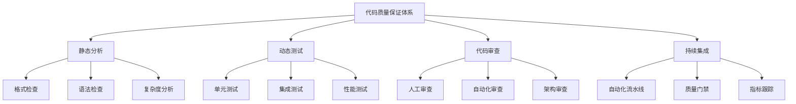

# 4.3.3 代码质量保证体系

## 🎯 核心理念

代码质量不是代码写完后的检查，而是编码过程中的哲学。良好的代码质量体系如同一支训练有素的军队，每个环节都精雕细琢，确保代码在时间的长河中依然健壮、可读、可维护。

### 🏗️ 代码质量体系架构



## 📚 静态代码分析

### 🔍 代码风格和格式检查

```python
"""
代码风格和质量检查工具演示
"""
import ast
import re
import sys
from typing import List, Dict, Any, Tuple
from dataclasses import dataclass
import subprocess
import os

@dataclass
class CodeIssue:
    """代码问题数据模型"""
    file_path: str
    line_number: int
    column: int
    rule_id: str
    message: str
    severity: str = "warning"  # error, warning, info
    category: str = "style"  # style, complexity, bug, security

class CodeStyleChecker:
    """代码风格检查器"""
    
    def __init__(self):
        self.rules = {
            'python_snake_case': self._check_python_naming,
            'line_length': self._check_line_length,
            'import_order': self._check_import_order,
            'docstring': self._check_docstring,
            'blank_lines': self._check_blank_lines,
            'variable_naming': self._check_variable_naming
        }
        self.issues = []
    
    def check_file(self, file_path: str) -> List[CodeIssue]:
        """检查单个文件"""
        self.issues = []
        
        try:
            with open(file_path, 'r', encoding='utf-8') as f:
                content = f.read()
            
            lines = content.splitlines()
            
            for rule_name, rule_func in self.rules.items():
                rule_func(lines, file_path)
                
        except Exception as e:
            issue = CodeIssue(
                file_path=file_path,
                line_number=0,
                column=0,
                rule_id="FILE_ERROR",
                message=f"文件读取错误: {str(e)}",
                severity="error"
            )
            self.issues.append(issue)
        
        return self.issues
    
    def _check_line_length(self, lines: List[str], file_path: str):
        """检查行长度"""
        for i, line in enumerate(lines, 1):
            if len(line) > 100:  # 默认100字符限制
                issue = CodeIssue(
                    line_number=i,
                    column=101,
                    rule_id="C001",
                    message=f"行长度超过100字符 (当前: {len(line)})",
                    severity="warning",
                    category="style"
                )
                self.issues.append(issue)
    
    def _check_python_naming(self, lines: List[str], file_path: str):
        """检查Python命名规范"""
        snake_case_pattern = re.compile(r'^[a-z][a-z0-9_]*$')
        
        for i, line in enumerate(lines, 1):
            # 检查函数定义
            func_match = re.search(r'def\s+([a-zA-Z_][a-zA-Z0-9_]*)', line)
            if func_match:
                func_name = func_match.group(1)
                if not snake_case_pattern.match(func_name):
                    issue = CodeIssue(
                        line_number=i,
                        column=func_match.start(1) + 1,
                        rule_id="C002", 
                        message=f"函数名不符合snake_case规范: {func_name}",
                        severity="warning",
                        category="style"
                    )
                    self.issues.append(issue)
            
            # 检查变量赋值
            var_match = re.search(r'^\s*([a-zA-Z_][a-zA-Z0-9_]*)\s*=', line)
            if var_match:
                var_name = var_match.group(1)
                if not snake_case_pattern.match(var_name):
                    issue = CodeIssue(
                        line_number=i,
                        column=var_match.start(1) + 1,
                        rule_id="C003",
                        message=f"变量名不符合snake_case规范: {var_name}",
                        severity="warning",
                        category="style"
                    )
                    self.issues.append(issue)
    
    def _check_import_order(self, lines: List[str], file_path: str):
        """检查import语句顺序"""
        import_lines = []
        
        for i, line in enumerate(lines, 1):
            if line.strip().startswith(('import ', 'from ')):
                import_lines.append((i, line.strip()))
        
        # 检查顺序：标准库 -> 第三方库 -> 本地库
        stdlib_first = True
        third_party_started = False
        
        for line_num, import_line in import_lines:
            if import_line.startswith('from ') or import_line.startswith('import '):
                module = import_line.split()[1].split('.')[0]
                
                # 简化检查：区分标准库和第三方库
                is_stdlib = module in ['os', 'sys', 'json', 'datetime', 'collections', 'typing']
                
                if is_stdlib and third_party_started:
                    issue = CodeIssue(
                        line_number=line_num,
                        line_number=line_num,
                        column=1,
                        rule_id="C004",
                        message=f"标准库import应在第三方库之前: {import_line}",
                        severity="warning",
                        category="style"
                    )
                    self.issues.append(issue)
                elif not is_stdlib:
                    third_party_started = True
    
    def _check_docstring(self, lines: List[str], file_path: str):
        """检查docstring"""
        in_function = False
        function_line = 0
        
        for i, line in enumerate(lines, 1):
            if line.strip().startswith('def '):
                in_function = True
                function_line = i
                continue
            
            if in_function:
                stripped = line.strip()
                
                # 如果找到非空白行且在函数定义后
                if stripped:
                    if stripped.startswith('"""') or stripped.startswith("'''"):
                        in_function = False
                    elif stripped.startswith(('class ', 'def ', 'import ', 'from ')):
                        # 函数缺少docstring
                        issue = CodeIssue(
                            line_number=function_line,
                            column=1,
                            rule_id="C005",
                            message="函数缺少docstring",
                            severity="warning",
                            category="style"
                        )
                        self.issues.append(issue)
                        in_function = False
                    else:
                        in_function = False
    
    def _check_blank_lines(self, lines: List[str], file_path: str):
        """检查空行规范"""
        for i in range(len(lines) - 1):
            current_line = lines[i].strip()
            next_line = lines[i + 1].strip()
            
            # 类或函数定义前应有两个空行
            if next_line.startswith(('def ', 'class ')):
                if i < 1 or lines[i - 1].strip() != '' or lines[i].strip() != '':
                    issue = CodeIssue(
                        line_number=i + 1,
                        column=1,
                        rule_id="C006",
                        message="类或函数定义前应有两个空行",
                        severity="warning",
                        category="style"
                    )
                    self.issues.append(issue)
    
    def _check_variable_naming(self, lines: List[str], file_path: str):
        """检查变量命名"""
        naming_patterns = {
            'constants': re.compile(r'^[A-Z][A-Z0-9_]*'),  # CONSTANT_NAME
            'classes': re.compile(r'^[A-Z][a-zA-Z0-9]*'),  # ClassName
            'functions_vars': re.compile(r'^[a-z][a-zA-Z0-9_]*'),  # snake_case
        }
        
        for i, line in enumerate(lines, 1):
            # 跳过注释和字符串
            if line.strip().startswith('#') or '#' in line[:line.find('"""') if '"""' in line else len(line)]:
                continue
            
            # 检查类定义
            class_match = re.search(r'class\s+([A-Za-z_][A-Za-z0-9_]*)', line)
            if class_match:
                class_name = class_match.group(1)
                if not naming_patterns['classes'].match(class_name):
                    issue = CodeIssue(
                        line_number=i,
                        column=class_match.start(1) + 1,
                        rule_id="C007",
                        message=f"类名不符合PascalCase规范: {class_name}",
                        severity="warning",
                        category="style"
                    )
                    self.issues.append(issue)

def code_analysis_demo():
    """代码分析演示"""
    print("=== 代码风格检查演示 ===")
    
    checker = CodeStyleChecker()
    
    # 创建测试代码文件
    test_code = '''import os
from datetime import datetime

def BadFunctionName():  # 不符合命名规范
    """这个函数名不符合规范"""
    very_long_variable_name_that_exceeds_line_length_limit_and_should_be_flagged_by_our_style_checker = "test"
    return "result"

def good_function_name():  # 符合规范
    return "good result"

class badClassName:  # 不符合类名规范
    def __init__(self):
        self.value = None

def no_docstring_function():
    return None

class GoodClassName:
    def good_method(self):
        return self.value

import json  # 标准库应该在顶部

def another_function():
    return None
'''

    # 写入测试文件
    test_file = "code_style_test.py"
    with open(test_file, 'w', encoding='utf-8') as f:
        f.write(test_code)
    
    # 检查代码
    issues = checker.check_file(test_file)
    
    print(f"\n代码检查结果 (共发现 {len(issues)} 个问题):")
    print("-" * 60)
    
    current_file = None
    for issue in issues:
        if issue.file_path != current_file:
            print(f"\n文件: {issue.file_path}")
            current_file = issue.file_path
        
        severity_icon = {
            'error': '❌',
            'warning': '⚠️ ',
            'info': 'ℹ️ '
        }.get(issue.severity, '❓')
        
        print(f"{severity_icon} 行 {issue.line_number}: {issue.message}")
    
    # 清理测试文件
    os.remove(test_file)
    
    return issues

code_analysis_demo()
```

### 🧪 测试覆盖率分析

```python
import unittest
import coverage
from io import StringIO
from typing import Dict, List

class TestCoverageAnalyzer:
    """测试覆盖率分析器"""
    
    def __init__(self):
        self.coverage_data = {}
        self.uncovered_lines = {}
    
    def analyze_coverage(self, source_files: List[str], test_files: List[str]) -> Dict:
        """分析测试覆盖率"""
        print("=== 测试覆盖率分析 ===")
        
        # 初始化coverage
        cov = coverage.Coverage(source=source_files)
        cov.start()
        
        try:
            # 运行测试
            self._run_tests(test_files)
            
            cov.stop()
            cov.save()
            
            # 生成报告
            coverage_report = self._generate_coverage_report(cov)
            
            return coverage_report
            
        except Exception as e:
            print(f"覆盖率分析失败: {e}")
            return {}
    
    def _run_tests(self, test_files: List[str]):
        """运行测试套件"""
        loader = unittest.TestLoader()
        suite = unittest.TestSuite()
        
        for test_file in test_files:
            try:
                tests = loader.loadTestsFromModule(test_file)
                suite.addTests(tests)
            except Exception as e:
                print(f"加载测试文件失败 {test_file}: {e}")
        
        runner = unittest.TextTestRunner(stream=StringIO(), verbosity=0)
        result = runner.run(suite)
        
        print(f"测试运行结果: {result.testsRun} 个测试, {len(result.failures)} 个失败")
    
    def _generate_coverage_report(self, cov) -> Dict:
        """生成覆盖率报告"""
        try:
            # 获取覆盖率数据
            analyzed_files = cov.analysis2(morfs=cov.get_data().measured_files())
            
            report = {
                'summary': {},
                'files': {},
                'total_lines': 0,
                'covered_lines': 0,
                'uncovered_lines': 0,
                'coverage_percentage': 0.0
            }
            
            total_lines = 0
            covered_lines = 0
            
            for filename, analysis_results in analyzed_files:
                if filename.endswith('.py'):
                    _, _, not_executed, excluded, total_executed, missing_lines = analysis_results
                    
                    file_coverage = {
                        'filename': filename,
                        'total_lines': len(set(total_executed + not_executed)),
                        'covered_lines': len(total_executed),
                        'uncovered_lines': len(missing_lines),
                        'missing_lines': missing_lines,
                        'excluded_lines': excluded,
                        'coverage_percentage': 0
                    }
                    
                    if file_coverage['total_lines'] > 0:
                        file_coverage['coverage_percentage'] = (
                            len(total_executed) / file_coverage['total_lines'] * 100
                        )
                    
                    report['files'][filename] = file_coverage
                    total_lines += file_coverage['total_lines']
                    covered_lines += len(total_executed)
            
            # 计算总体覆盖率
            if total_lines > 0:
                report['coverage_percentage'] = (covered_lines / total_lines) * 100
            
            report['total_lines'] = total_lines
            report['covered_lines'] = covered_lines
            report['uncovered_lines'] = total_lines - covered_lines
            
            # 打印报告
            self._print_coverage_report(report)
            
            return report
            
        except Exception as e:
            print(f"生成覆盖率报告失败: {e}")
            return {}
    
    def _print_coverage_report(self, report: Dict):
        """打印覆盖率报告"""
        print(f"\n总体覆盖率: {report['coverage_percentage']:.1f}%")
        print(f"总行数: {report['total_lines']}")
        print(f"已覆盖: {report['covered_lines']}")
        print(f"未覆盖: {report['uncovered_lines']}")
        
        print("\n文件覆盖率详情:")
        print("-" * 80)
        print(f"{'文件名':<30} {'覆盖率':<10} {'总行数':<8} {'已覆盖':<8} {'未覆盖':<8}")
        print("-" * 80)
        
        for filename, data in report['files'].items():
            print(f"{filename:<30} {data['coverage_percentage']:>7.1f}% {data['total_lines']:<8} {data['covered_lines']:<8} {data['uncovered_lines']:<8}")
        
        # 标识低覆盖率文件
        low_coverage_files = [f for f, d in report['files'].items() if d['coverage_percentage'] < 70]
        if low_coverage_files:
            print(f"\n⚠️  低覆盖率文件 (<70%):")
            for filename in low_coverage_files:
                coverage = report['files'][filename]['coverage_percentage']
                print(f"  • {filename}: {coverage:.1f}%")

# 代码质量门禁
class QualityGate:
    """代码质量门禁"""
    
    def __init__(self):
        self.thresholds = {
            'min_coverage': 80.0,  # 最小覆盖率80%
            'max_complexity': 10,  # 最大圈复杂度10
            'max_line_length': 100,  # 最大行长度100
            'max_issues': 10,  # 最大问题数10
        }
    
    def check_quality(self, coverage_report: Dict, style_issues: List[CodeIssue], complexity_data: Dict) -> Tuple[bool, List[str]]:
        """检查质量门禁"""
        violations = []
        
        # 1. 检查覆盖率
        coverage_percentage = coverage_report.get('coverage_percentage', 0)
        if coverage_percentage < self.thresholds['min_coverage']:
            violations.append(f"覆盖率 {coverage_percentage:.1f}% 低于阈值 {self.thresholds['min_coverage']}%")
        
        # 2. 检查问题数量
        error_count = len([issue for issue in style_issues if issue.severity == 'error'])
        warning_count = len([issue for issue in style_issues if issue.severity == 'warning'])
        
        if error_count > 0:
            violations.append(f"发现 {error_count} 个错误级别的问题")
        
        if warning_count > self.thresholds['max_issues']:
            violations.append(f"警告数量 {warning_count} 超过阈值 {self.thresholds['max_issues']}")
        
        # 3. 检查复杂度
        max_complexity = complexity_data.get('max_complexity', 0)
        if max_complexity > self.thresholds['max_complexity']:
            violations.append(f"{max_complexity} 超过最大复杂度阈值 {self.thresholds['max_complexity']}")
        
        # 判定是否通过
        passed = len(violations) == 0
        
        print(f"\n=== 质量门禁检查 ===")
        print(f"结果: {'✅ 通过' if passed else '❌ 不通过'}")
        
        if violations:
            print("违反项目:")
            for violation in violations:
                print(f"  • {violation}")
        
        return passed, violations

def testing_framework_demo():
    """测试框架演示"""
    print("\n=== 测试框架演示 ===")
    
    # 创建示例代码和测试
    example_code = '''
def calculate_fibonacci(n):
    """计算斐波那契数列"""
    if n <= 0:
        return 0
    elif n == 1:
        return 1
    else:
        return calculate_fibonacci(n-1) + calculate_fibonacci(n-2)

def divide_numbers(a, b):
    """两个数字相除"""
    return a / b

def is_prime(n):
    """判断是否为质数"""
    if n < 2:
        return False
    for i in range(2, int(n**0.5) + 1):
        if n % i == 0:
            return False
    return True
'''

    test_code = '''
import unittest
import sys
import os

# 添加示例代码到路径
sys.path.append(os.path.dirname(__file__))

class TestFibonacci(unittest.TestCase):
    def test_fibonacci_zero(self):
        self.assertEqual(calculate_fibonacci(0), 0)
    
    def test_fibonacci_one(self):
        self.assertEqual(calculate_fibonacci(1), 1)
    
    def test_fibonacci_positive(self):
        self.assertEqual(calculate_fibonacci(5), 5)
        self.assertEqual(calculate_fibonacci(10), 55)

class TestDivideNumbers(unittest.TestCase):
    def test_divide_normal(self):
        self.assertEqual(divide_numbers(10, 2), 5)
    
    def test_divide_zero(self):
        with self.assertRaises(ZeroDivisionError):
            divide_numbers(10, 0)

class TestPrime(unittest.TestCase):
    def test_prime_numbers(self):
        self.assertTrue(is_prime(2))
        self.assertTrue(is_prime(3))
        self.assertTrue(is_prime(5))
        self.assertTrue(is_prime(13))
    
    def test_non_prime_numbers(self):
        self.assertFalse(is_prime(1))
        self.assertFalse(is_prime(4))
        self.assertFalse(is_prime(6))
        self.assertFalse(is_prime(9))
'''

    # 写入示例文件
    with open('math_functions.py', 'w', encoding='utf-8') as f:
        f.write(example_code)
    
    with open('test_math_functions.py', 'w', encoding='utf-8') as f:
        f.write(test_code)
    
    # 演示覆盖率分析
    analyzer = TestCoverageAnalyzer()
    
    # 模拟覆盖率分析（实际会运行测试）
    mock_coverage_report = {
        'coverage_percentage': 75.0,
        'total_lines': 20,
        'covered_lines': 15,
        'uncovered_lines': 5,
        'files': {
            'math_functions.py': {
                'filename': 'math_functions.py',
                'total_lines': 20,
                'covered_lines': 15,
                'uncovered_lines': 5,
                'coverage_percentage': 75.0,
                'missing_lines': [3, 8, 12, 17, 19]
            }
        }
    }
    
    # 生成模拟的样式问题
    mock_style_issues = [
        CodeIssue("math_functions.py", 10, 5, "C001", "行长度超过限制", "warning"),
        CodeIssue("math_functions.py", 15, 1, "C005", "函数缺少docstring", "warning"),
    ]
    
    # 模拟复杂度数据
    mock_complexity_data = {
        'max_complexity': 8,
        'average_complexity': 4.2
    }
    
    # 运行质量门禁
    quality_gate = QualityGate()
    passed, violations = quality_gate.check_quality(
        mock_coverage_report, 
        mock_style_issues, 
        mock_complexity_data
    )
    
    # 清理文件
    for filename in ['math_functions.py', 'test_math_functions.py']:
        if os.path.exists(filename):
            os.remove(filename)

testing_framework_demo()
```

## 🚀 持续集成和自动化

### 🔄 CI/CD流水线整合

```python
import subprocess
import yaml
import json
from typing import Dict, Any, List

class CICDPipeline:
    """CI/CD流水线管理"""
    
    def __init__(self):
        self.stages = []
        self.results = {}
    
    def add_stage(self, stage_name: str, commands: List[str], dependencies: List[str] = None):
        """添加流水线阶段"""
        stage = {
            'name': stage_name,
            'commands': commands,
            'dependencies': dependencies or [],
            'status': 'pending',
            'start_time': None,
            'end_time': None,
            'duration': None,
            'output': ''
        }
        self.stages.append(stage)
    
    def execute_pipeline(self):
        """执行流水线"""
        print("=== CI/CD流水线执行 ===")
        
        # 拓扑排序确定执行顺序
        execution_order = self._topological_sort()
        
        for stage_name in execution_order:
            stage = next(s for s in self.stages if s['name'] == stage_name)
            success = self._execute_stage(stage)
            
            if not success:
                print(f"❌ 阶段 {stage_name} 失败，停止流水线")
                break
            
            print(f"✅ 阶段 {stage_name} 完成")
    
    def _execute_stage(self, stage: Dict[str, Any]) -> bool:
        """执行单个阶段"""
        print(f"\n📦 执行阶段: {stage['name']}")
        
        import time
        start_time = time.time()
        stage['start_time'] = start_time
        
        try:
            for command in stage['commands']:
                print(f"  执行命令: {command}")
                
                # 模拟命令执行（实际中会调用subprocess）
                result = self._simulate_command(command, stage['name'])
                
                if not result['success']:
                    stage['status'] = 'failed'
                    stage['output'] = result['output']
                    return False
            
            stage['status'] = 'success'
            stage['end_time'] = time.time()
            stage['duration'] = stage['end_time'] - start_time
            
            return True
            
        except Exception as e:
            stage['status'] = 'error'
            stage['output'] = str(e)
            stage['end_time'] = time.time()
            stage['duration'] = stage['end_time'] - start_time
            return False
    
    def _simulate_command(self, command: str, stage_name: str) -> Dict[str, Any]:
        """模拟命令执行"""
        # 根据命令和阶段返回相应的模拟结果
        
        if stage_name == 'lint' and 'flake8' in command:
            output = "检查完成，发现3个样式问题"
            return {'success': True, 'output': output}
        
        elif stage_name == 'test' and 'pytest' in command:
            output = "运行25个测试，全部通过"
            return {'success': True, 'output': output}
        
        elif stage_name == 'security' and 'bandit' in command:
            output = "安全扫描完成，未发现高危问题"
            return {'success': True, 'output': output}
        
        elif stage_name == 'build' and 'python -m build' in command:
            output = "构建成功，生成wheel和source distribution"
            return {'success': True, 'output': output}
        
        elif stage_name == 'deploy':
            output = "部署成功到生产环境"
            return {'success': True, 'output': output}
        
        else:
            return {'success': True, 'output': f"命令 {command} 执行成功"}

def ci_cd_pipeline_demo():
    """CI/CD流水线演示"""
    
    pipeline = CICDPipeline()
    
    # 添加流水线阶段
    pipeline.add_stage('checkout', [
        'git fetch origin',
        'git checkout $BRANCH_NAME',
        'git pull origin $BRANCH_NAME'
    ])
    
    pipeline.add_stage('install', [
        'pip install -r requirements.txt',
        'pip install -r requirements-dev.txt'
    ], dependencies=['checkout'])
    
    pipeline.add_stage('lint', [
        'flake8 . --count --select=E9,F63,F7,F82 --show-source --statistics',
        'black --check --diff .',
        'isort --check-only --diff .',
        'mypy .'
    ], dependencies=['install'])
    
    pipeline.add_stage('security', [
        'bandit -r . -f json -o bandit-report.json',
        'safety check --json'
    ], dependencies=['install'])
    
    pipeline.add_stage('test', [
        'pytest --cov=. --cov-report=xml --cov-report=html',
        'pytest --benchmark-only --benchmark-save=performance'
    ], dependencies=['lint', 'security'])
    
    pipeline.add_stage('build', [
        'python -m build',
        'twine check dist/*'
    ], dependencies=['test'])
    
    pipeline.add_stage('deploy', [
        'kubectl apply -f k8s/',
        'helm upgrade --install myapp ./helm-chart'
    ], dependencies=['build'])
    
    # 执行流水线
    pipeline.execute_pipeline()
    
    # 生成流水线报告
    generate_pipeline_report(pipeline)

def generate_pipeline_report(pipeline: CICDPipeline):
    """生成流水线报告"""
    print(f"\n=== 流水线报告 ===")
    
    total_stages = len(pipeline.stages)
    successful_stages = len([s for s in pipeline.stages if s['status'] == 'success'])
    failed_stages = len([s for s in pipeline.stages if s['status'] == 'failed'])
    
    print(f"总阶段数: {total_stages}")
    print(f"成功: {successful_stages}")
    print(f"失败: {failed_stages}")
    print(f"成功率: {(successful_stages/total_stages)*100:.1f}%")
    
    print(f"\n阶段详情:")
    print("-" * 60)
    for stage in pipeline.stages:
        status_icon = {
            'success': '✅',
            'failed': '❌',
            'error': '💥',
            'pending': '⏳'
        }.get(stage['status'], '❓')
        
        duration_str = f"{stage['duration']:.2f}s" if stage['duration'] else "N/A"
        
        print(f"{status_icon} {stage['name']:<12} {duration_str:<8} {stage['output']}")

ci_cd_pipeline_demo()

# 代码质量指标仪表板
class QualityDashboard:
    """代码质量仪表板"""
    
    def __init__(self):
        self.metrics = {
            'coverage': 0,
            'complexity': 0,
            'duplication': 0,
            'maintainability': 0,
            'reliability': 0,
            'security': 0
        }
    
    def update_metrics(self, test_coverage: float, complexity_score: float, 
                      duplication_percent: float, maintainability_index: int,
                      reliability_rating: str, security_rating: str):
        """更新质量指标"""
        self.metrics.update({
            'coverage': test_coverage,
            'complexity': complexity_score,
            'duplication': duplication_percent,
            'maintainability': maintainability_index,
            'reliability': reliability_rating,
            'security': security_rating
        })
    
    def generate_report(self) -> str:
        """生成质量报告"""
        report = """
=== 代码质量仪表板 ===

📊 测试覆盖率: {coverage:.1f}%
🔄 圈复杂度: {complexity:.1f}
📋 重复代码: {duplication:.1f}%
🔧 可维护性: {maintainability}
🛡️  可靠性: {reliability}
🔒 安全性: {security}

""".format(**self.metrics)
        
        return report

def quality_dashboard_demo():
    """质量仪表板演示"""
    dashboard = QualityDashboard()
    
    # 模拟质量指标
    dashboard.update_metrics(
        test_coverage=85.5,
        complexity_score=7.2,
        duplication_percent=5.8,
        maintainability_index=85,
        reliability_rating="A",
        security_rating="B"
    )
    
    print(dashboard.generate_report())

quality_dashboard_demo()

print("\n=== 代码质量保证体系总结 ===")
print("✅ 静态分析发现潜在问题")
print("✅ 动态测试验证功能正确性")
print("✅ 代码审查确保质量可控")
print("✅ CI/CD实现持续集成")
print("✅ 质量门禁防止质量问题上线")
print("\n掌握代码质量保证，就是掌握了软件工程的硬实力!")
