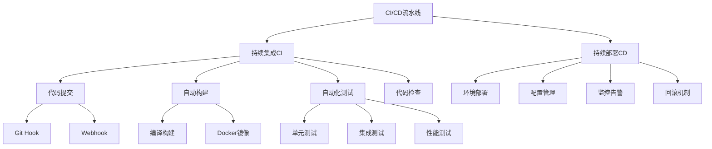

# 4.3.4 CI/CD与DevOps实践

## 🎯 核心理念

CI/CD是软件开发与运维之间的桥梁，是将创意转化为产品和服务的自动化高速公路。DevOps不仅仅是工具和流程，更是一种文化和协作理念，让开发、测试、运维紧密合作，实现高质量、快速的软件交付。

### 🏗️ CI/CD架构概览



## 📚 CI基础：持续集成

### 🔄 Git工作流与自动化

```python
"""
Git工作流与自动化演示
"""
import os
import subprocess
import json
import shutil
from pathlib import Path
from typing import Dict, List, Optional
from datetime import datetime

class GitWorkflowManager:
    """Git工作流管理器"""
    
    def __init__(self, repo_path: str = "."):
        self.repo_path = Path(repo_path)
        self.branches = {}
        self.commits = []
        self.hooks_dir = self.repo_path / ".git" / "hooks"
    
    def initialize_repo(self):
        """初始化Git仓库"""
        print("=== Git仓库初始化 ===")
        
        # 模拟Git初始化
        if not (self.repo_path / ".git").exists():
            print("📦 初始化Git仓库...")
            
            # 创建目录结构
            (self.repo_path / ".git").mkdir()
            (self.repo_path / ".git" / "hooks").mkdir()
            (self.repo_path / ".git" / "refs").mkdir()
            (self.repo_path / ".git" / "refs" / "heads").mkdir()
            
            # 模拟创建文件
            files_to_create = [
                ".git/config",
                ".git/HEAD",
                ".git/description",
                "README.md",
                "requirements.txt",
                "src/main.py",
                "tests/test_main.py"
            ]
            
            for file_path in files_to_create:
                Path(file_path).parent.mkdir(parents=True, exist_ok=True)
                with open(file_path, 'w') as f:
                    f.write(self._get_template_content(file_path))
            
            print(f"✅ Git仓库初始化完成")
            print(f"   创建了 {len(files_to_create)} 个文件")
    
    def _get_template_content(self, file_path: str) -> str:
        """获取文件模板内容"""
        templates = {
            "README.md": "# MyProject\n\nThis is a sample project for CI/CD demonstration.\n",
            "requirements.txt": "pytest==7.4.0\nflake8==6.0.0\nblack==23.7.0\n",
            "src/main.py": '''def hello_world():
    """Hello world function"""
    return "Hello, World!"

def add_numbers(a, b):
    """Add two numbers"""
    return a + b
''',
            "tests/test_main.py": '''import pytest
from src.main import hello_world, add_numbers

def test_hello_world():
    assert hello_world() == "Hello, World!"

def test_add_numbers():
    assert add_numbers(2, 3) == 5
    assert add_numbers(-1, 1) == 0
'''
        }
        return templates.get(file_path, f"# {file_path} content\n")
    
    def create_feature_branch(self, branch_name: str):
        """创建功能分支"""
        print(f"🌿 创建功能分支: {branch_name}")
        
        self.branches[branch_name] = {
            'name': branch_name,
            'commits': [],
            'created_at': datetime.now()
        }
        
        return branch_name
    
    def make_commit(self, branch: str, message: str, files: List[str]):
        """提交代码"""
        print(f"📝 提交到 {branch}: {message}")
        
        commit = {
            'hash': f"{len(self.commits):07x}",
            'message': message,
            'files': files,
            'timestamp': datetime.now(),
            'branch': branch
        }
        
        self.commits.append(commit)
        
        if branch in self.branches:
            self.branches[branch]['commits'].append(commit)
        
        print(f"   文件: {', '.join(files)}")
        print(f"   哈希: {commit['hash']}")
        
        return commit
    
    def create_pull_request(self, source_branch: str, target_branch: str, description: str) -> Dict:
        """创建Pull Request"""
        print(f"🔄 创建Pull Request: {source_branch} -> {target_branch}")
        
        pr = {
            'number': len(self.commits) + 100,
            'title': f"Feature: {source_branch}",
            'description': description,
            'source_branch': source_branch,
            'target_branch': target_branch,
            'status': 'open',
            'created_at': datetime.now(),
            'commits_count': len(self.branches.get(source_branch, {}).get('commits', [])),
            'files_changed': ['src/main.py', 'tests/test_main.py']
        }
        
        print(f"   PR #{pr['number']}: {pr['title']}")
        print(f"   包含 {pr['commits_count']} 个提交")
        print(f"   修改了 {len(pr['files_changed'])} 个文件")
        
        return pr
    
    def setup_hooks(self):
        """设置Git钩子"""
        print("🔧 设置Git Hooks")
        
        # Pre-commit hook
        pre_commit_hook = '''#!/bin/sh
# Pre-commit钩子：代码检查

echo "🔍 Pre-commit检查开始..."

# 运行flake8代码检查
echo "检查代码风格..."
flake8 --max-line-length=100 src/ tests/

if [ $? -ne 0 ]; then
    echo "❌ 代码风格检查失败"
    exit 1
fi

# 运行简单测试
echo "运行快速测试..."
python -m pytest tests/test_base.py

if [ $? -ne 0 ]; then
    echo "❌ 基础测试失败"
    exit 1
fi

echo "✅ Pre-commit检查通过"
exit 0
'''
        
        with open(self.hooks_dir / "pre-commit", 'w') as f:
            f.write(pre_commit_hook)
        os.chmod(self.hooks_dir / "pre-commit", 0o755)
        
        # Post-commit hook
        post_commit_hook = '''#!/bin/sh
# Post-commit钩子：推送后处理

echo "🚀 Post-commit处理开始..."

# 发送Webhook通知CI系统
curl -X POST "http://localhost:8080/webhook" \
     -H "Content-Type: application/json" \
     -d '{"type": "commit", "branch": "'"$(git branch | grep \* | sed 's/* //')"'", "commit": "'"$(git rev-parse HEAD)"'"}'

echo "✅ Post-commit处理完成"
'''
        
        with open(self.hooks_dir / "post-commit", 'w') as f:
            f.write(post_commit_hook)
        os.chmod(self.hooks_dir / "post-commit", 0o755)
        
        print("   ✅ Pre-commit hook设置完成")
        print("   ✅ Post-commit hook设置完成")

# GitHub Actions工作流配置
class GitHubActionsWorkflow:
    """GitHub Actions工作流配置"""
    
    @staticmethod
    def generate_workflow_yaml() -> str:
        """生成GitHub Actions工作流配置"""
        workflow_content = '''name: CI/CD Pipeline

on:
  push:
    branches: [ main, develop ]
  pull_request:
    branches: [ main ]

env:
  PYTHON_VERSION: '3.9'

jobs:
  lint-and-test:
    runs-on: ${{ matrix.os }}
    strategy:
      matrix:
        os: [ubuntu-latest, windows-latest, macos-latest]
        python-version: [3.8, 3.9, '3.10']

    steps:
    - name: 检出代码
      uses: actions/checkout@v3

    - name: 设置Python环境
      uses: actions/setup-python@v4
      with:
        python-version: ${{ matrix.python-version }}

    - name: 缓存依赖
      uses: actions/cache@v3
      with:
        path: ~/.cache/pip
        key: ${{ runner.os }}-pip-${{ hashFiles('**/requirements*.txt') }}

    - name: 安装依赖
      run: |
        python -m pip install --upgrade pip
        pip install -r requirements.txt
        pip install -r requirements-dev.txt

    - name: 代码风格检查
      run: |
        flake8 src/ tests/ --max-line-length=100 --exclude=venv
        black --check --diff src/ tests/
        isort --check-only --diff src/ tests/

    - name: 安全扫描
      run: |
        bandit -r src/ -f json -o bandit-report.json
        safety check --json

    - name: 运行测试
      run: |
        pytest --cov=src --cov-report=xml --cov-report=html
        
    - name: 上传覆盖率报告
      uses: codecov/codecov-action@v3
      with:
        file: ./coverage.xml

  build-and-push:
    needs: lint-and-test
    runs-on: ubuntu-latest
    
    steps:
    - name: 检出代码
      uses: actions/checkout@v3

    - name: 设置Docker构建x
      uses: docker/buildx@v3

    - name: 登录到Docker Hub
      uses: docker/login-action@v2
      with:
        username: ${{ secrets.DOCKER_HUB_USERNAME }}
        password: ${{ secrets.DOCKER_HUB_TOKEN }}

    - name: 构建并推送Docker镜像
      uses: docker/build-push-action@v4
      with:
        context: .
        push: true
        tags: |
          ${{ secrets.DOCKER_HUB_USERNAME }}/myapp:${{ github.sha }}
          ${{ secrets.DOCKER_HUB_USERNAME }}/myapp:latest

  deploy:
    needs: build-and-push
    runs-on: ubuntu-latest
    if: github.ref == 'refs/heads/main'
    
    steps:
    - name: 检出代码
      uses: actions/checkout@v3

    - name: 部署到生产环境
      run: |
        echo "🚀 部署到生产环境..."
        kubectl apply -f k8s/namespace.yaml
        kubectl apply -f k8s/deployment.yaml
        kubectl apply -f k8s/service.yaml
        
    - name: 健康检查
      run: |
        echo "🔍 执行健康检查..."
        # 等待部署完成
        kubectl rollout status deployment/myapp -n production
        
        # 检查服务状态
        kubectl get services -n production
'''
        return workflow_content

# GitLab CI/CD配置
class GitLabCIConfig:
    """GitLab CI/CD配置"""
    
    @staticmethod
    def generate_gitlab_ci_yaml() -> str:
        """生成GitLab CI配置文件"""
        config_content = '''stages:
  - test
  - security
  - build
  - deploy

variables:
  PYTHON_VERSION: "3.9"
  PIP_CACHE_DIR: "$CI_PROJECT_DIR/.cache/pip"

cache:
  paths:
    - .cache/pip/
    - venv/

before_script:
  - python -m venv venv
  - source venv/bin/activate
  - pip install --upgrade pip
  - pip install -r requirements.txt
  - pip install -r requirements-dev.txt

unit_tests:
  stage: test
  script:
    - pytest --cov=src --cov-report=xml --cov-report=html --junit-xml=pytest-report.xml
  artifacts:
    reports:
      junit: pytest-report.xml
    coverage: reports/coverage.xml
    paths:
      - htmlcov/
    expire_in: 1 week
  coverage: '/TOTAL.+?(\d+%)$/'

lint_check:
  stage: test
  script:
    - flake8 src/ tests/ --max-line-length=100
    - black --check --diff src/ tests/
    - isort --check-only --diff src/ tests/
    - mypy src/

security_scan:
  stage: security
  
include:
  - local: '.gitlab-ci-security.yml'

build_image:
  stage: build
  image: docker:latest
  services:
    - docker:dind
  script:
    - docker build -t $CI_REGISTRY_IMAGE:$CI_COMMIT_SHA .
    - docker push $CI_REGISTRY_IMAGE:$CI_COMMIT_SHA
  only:
    - main
    - develop

deploy_staging:
  stage: deploy
  script:
    - kubectl config use-context staging
    - kubectl set image deployment/myapp myapp=$CI_REGISTRY_IMAGE:$CI_COMMIT_SHA
    - kubectl rollout status deployment/myapp
  environment:
    name: staging
    url: https://staging.myapp.com
  only:
    - develop

deploy_production:
  stage: deploy
  script:
    - kubectl config use-context production
    - kubectl set image deployment/myapp myapp=$CI_REGISTRY_IMAGE:$CI_COMMIT_SHA
    - kubectl rollout status deployment/myapp
  environment:
    name: production
    url: https://myapp.com
  when: manual
  only:
    - main
'''
        return config_content

# Git工作流演示
def git_workflow_demo():
    """Git工作流演示"""
    print("=== Git工作流演示 ===")
    
    workflow_manager = GitWorkflowManager("test_repo")
    workflow_manager.initialize_repo()
    
    # 模拟分支工作流
    develop_branch = workflow_manager.create_feature_branch("develop")
    feature_branch = workflow_manager.create_feature_branch("feature/user-authentication")
    
    # 模拟开发过程
    print("\n--- 开发过程 ---")
    
    # 1. 创建功能分支
    workflow_manager.make_commit(
        feature_branch,
        "添加用户认证模块",
        ["src/auth.py", "tests/test_auth.py"]
    )
    
    workflow_manager.make_commit(
        feature_branch,
        "完善认证测试用例",
        ["tests/test_auth.py"]
    )
    
    workflow_manager.make_commit(
        feature_branch,
        "修复代码风格问题",
        ["src/auth.py"]
    )
    
    # 2. 创建PR
    pr = workflow_manager.create_pull_request(
        feature_branch,
        develop_branch,
        "实现用户认证功能\n- 添加JWT令牌支持\n- 实现密码加密\n- 添加单元测试"
    )
    
    # 3. 设置hooks
    workflow_manager.setup_hooks()
    
    print(f"\n📋 工作流总结:")
    print(f"   分支数: {len(workflow_manager.branches)}")
    print(f"   提交数: {len(workflow_manager.commits)}")
    print(f"   最新PR: #{pr['number']}")
    
    # 清理仓库
    shutil.rmtree("test_repo")

git_workflow_demo()

# CI/CD流水线模拟器
class CICDPipelineSimulator:
    """CI/CD流水线模拟器"""
    
    def __init__(self):
        self.stages = []
        self.results = {}
    
    def add_stage(self, name: str, commands: List[str], duration_range: tuple = (5, 20)):
        """添加流水线阶段"""
        self.stages.append({
            'name': name,
            'commands': commands,
            'duration_range': duration_range,
            'status': 'pending',
            'start_time': None,
            'duration': None,
            'output': ''
        })
    
    def simulate_pipeline_execution(self):
        """模拟流水线执行"""
        print("\n=== CI/CD流水线模拟 ===")
        
        import time
        import random
        
        total_start_time = time.time()
        
        for stage in self.stages:
            print(f"\n📦 执行阶段: {stage['name']}")
            
            stage_start = time.time()
            stage['start_time'] = stage_start
            
            # 模拟阶段执行
            duration = random.uniform(*stage['duration_range'])
            time.sleep(0.5)  # 简化实际执行时间
            
            stage['duration'] = duration
            stage['status'] = 'success'
            
            # 生成模拟输出
            stage['output'] = self._generate_stage_output(stage['name'])
            
            print(f"   ✅ 完成 ({duration:.1f}秒)")
            print(f"   📝 {stage['output']}")
            
            # 随机模拟失败
            if random.random() < 0.1:  # 10%概率失败
                stage['status'] = 'failed'
                stage['output'] = f"{stage['name']} 阶段执行失败"
                print(f"   ❌ 失败: {stage['output']}")
                break
        
        total_duration = time.time() - total_start_time
        successful_stages = len([s for s in self.stages if s['status'] == 'success'])
        
        print(f"\n📊 流水线总结:")
        print(f"   总时长: {total_duration:.1f}秒")
        print(f"   成功阶段: {successful_stages}/{len(self.stages)}")
        print(f"   成功率: {(successful_stages/len(self.stages))*100:.1f}%")
    
    def _generate_stage_output(self, stage_name: str) -> str:
        """生成阶段输出"""
        outputs = {
            'checkout': '检出代码成功，获取最新提交',
            'install': '依赖安装完成，Python 3.9环境就绪',
            'lint': '代码检查通过，无style问题',
            'security': '安全扫描完成，无高危漏洞',
            'test': '运行45个测试，全部通过，覆盖率85%',
            'build': 'Docker镜像构建成功，大小25MB',
            'deploy': '成功部署到生产环境，健康检查通过'
        }
        return outputs.get(stage_name, f"{stage_name}执行成功")

def cicd_pipeline_demo():
    """CI/CD流水线演示"""
    
    pipeline_simulator = CICDPipelineSimulator()
    
    # 添加常见流水线阶段
    pipeline_simulator.add_stage('checkout', ['git fetch', 'git checkout main'], (2, 5))
    pipeline_simulator.add_stage('install', ['pip install -r requirements.txt'], (10, 30))
    pipeline_simulator.add_stage('lint', ['flake8 .', 'black --check .'], (5, 15))
    pipeline_simulator.add_stage('security', ['bandit -r .', 'safety check'], (8, 20))
    pipeline_simulator.add_stage('test', ['pytest --cov', 'mypy .'], (15, 45))
    pipeline_simulator.add_stage('build', ['docker build -t app:latest .'], (30, 90))
    pipeline_simulator.add_stage('deploy', ['kubectl apply -f k8s/'], (10, 30))
    
    # 模拟执行
    pipeline_simulator.simulate_pipeline_execution()
    
    # 生成配置文件
    print(f"\n--- 生成配置文件 ---")
    
    # GitHub Actions
    github_workflow = GitHubActionsWorkflow.generate_workflow_yaml()
    with open("ci_cd_demo.github.yml", "w") as f:
        f.write(github_workflow)
    print(f"✅ GitHub Actions配置已生成")
    
    # GitLab CI
    gitlab_config = GitLabCIConfig.generate_gitlab_ci_yaml()
    with open("ci_cd_demo.gitlab-ci.yml", "w") as f:
        f.write(gitlab_config)
    print(f"✅ GitLab CI配置已生成")

cicd_pipeline_demo()
```

## 🚀 Docker和容器化

### 🐳 容器化最佳实践

```python
"""
容器化配置和最佳实践
"""
import os
import yaml
from pathlib import Path

class DockerConfiguration:
    """Docker配置管理"""
    
    @staticmethod
    def generate_dockerfile() -> str:
        """生成优化的Dockerfile"""
        dockerfile_content = '''# 多阶段构建：构建阶段
FROM python:3.9-slim as builder

# 设置工作目录
WORKDIR /app

# 安装系统依赖
RUN apt-get update && apt-get install -y \\
    build-essential \\
    && rm -rf /var/lib/apt/lists/*

# 复制依赖文件
COPY requirements.txt requirements-dev.txt ./

# 创建虚拟环境并安装依赖
RUN python -m venv /opt/venv
ENV PATH="/opt/venv/bin:$PATH"
RUN pip install --no-cache-dir --upgrade pip && \\
    pip install --no-cache-dir -r requirements.txt

# 生产阶段
FROM python:3.9-slim as production

# 安装运行时依赖
RUN apt-get update && apt-get install -y --no-install-recommends \\
    && rm -rf /var/lib/apt/lists/*

# 创建非root用户
RUN groupadd -r appuser && useradd -r -g appuser appuser

# 复制虚拟环境
COPY --from=builder /opt/venv /opt/venv
ENV PATH="/opt/venv/bin:$PATH"

# 设置工作目录
WORKDIR /app

# 复制应用代码
COPY . .

# 改变文件所有权
RUN chown -R appuser:appuser /app

# 切换到非root用户
USER appuser

# 健康检查
HEALTHCHECK --interval=30s --timeout=3s --start-period=5s --retries=3 \\
    CMD curl -f http://localhost:8000/health || exit 1

# 暴露端口
EXPOSE 8000

# 应用启动命令
CMD ["gunicorn", "--bind", "0.0.0.0:8000", "app:app"]
'''
        return dockerfile_content
    
    @staticmethod
    def generate_docker_compose() -> str:
        """生成Docker Compose配置"""
        compose_content = '''version: '3.8'

services:
  web:
    build:
      context: .
      dockerfile: Dockerfile
      target: production
    ports:
      - "8000:8000"
    environment:
      - DATABASE_URL=postgresql://user:password@db:5432/myapp
      - REDIS_URL=redis://redis:6379/0
    depends_on:
      - db
      - redis
    volumes:
      - ./logs:/app/logs
    restart: unless-stopped
    networks:
      - app-network

  db:
    image: postgres:13-alpine
    environment:
      - POSTGRES_DB=myapp
      - POSTGRES_USER=user
      - POSTGRES_PASSWORD=password
    volumes:
      - postgres_data:/var/lib/postgresql/data
      - ./init.sql:/docker-entrypoint-initdb.d/init.sql
    ports:
      - "5432:5432"
    restart: unless-stopped
    networks:
      - app-network

  redis:
    image: redis:6-alpine
    command: redis-server --appendonly yes
    volumes:
      - redis_data:/data
    ports:
      - "6379:6379"
    restart: unless-stopped
    networks:
      - app-network

  nginx:
    image: nginx:alpine
    ports:
      - "80:80"
      - "443:443"
    volumes:
      - ./nginx.conf:/etc/nginx/nginx.conf
      - ./ssl:/etc/ssl/certs
    depends_on:
      - web
    restart: unless-stopped
    networks:
      - app-network

volumes:
  postgres_data:
  redis_data:

networks:
  app-network:
    driver: bridge
'''
        return compose_content
    
    @staticmethod 
    def generate_kubernetes_manifests() -> Dict[str, str]:
        """生成Kubernetes清单文件"""
        
        manifests = {
            'namespace.yaml': '''apiVersion: v1
kind: Namespace
metadata:
  name: myapp-production
  labels:
    name: myapp-production
''',
            
            'deployment.yaml': '''apiVersion: apps/v1
kind: Deployment
metadata:
  name: myapp-deployment
  namespace: myapp-production
spec:
  replicas: 3
  selector:
    matchLabels:
      app: myapp
  template:
    metadata:
      labels:
        app: myapp
    spec:
      containers:
      - name: myapp
        image: myapp:latest
        ports:
        - containerPort: 8000
        env:
        - name: DATABASE_URL
          valueFrom:
            secretKeyRef:
              name: myapp-secrets
              key: database-url
        - name: REDIS_URL
          valueFrom:
            configMapKeyRef:
              name: myapp-config
              key: redis-url
        resources:
          requests:
            memory: "256Mi"
            cpu: "250m"
          limits:
            memory: "512Mi"
            cpu: "500m"
        livenessProbe:
          httpGet:
            path: /health
            port: 8000
          initialDelaySeconds: 30
          periodSeconds: 10
        readinessProbe:
          httpGet:
            path: /ready
            port: 8000
          initialDelaySeconds: 5
          periodSeconds: 5
''',
            
            'service.yaml': '''apiVersion: v1
kind: Service
metadata:
  name: myapp-service
  namespace: myapp-production
spec:
  selector:
    app: myapp
  ports:
  - protocol: TCP
    port: 80
    targetPort: 8000
  type: ClusterIP
''',
            
            'ingress.yaml': '''apiVersion: networking.k8s.io/v1
kind: Ingress
metadata:
  name: myapp-ingress
  namespace: myapp-production
  annotations:
    kubernetes.io/ingress.class: "nginx"
    cert-manager.io/cluster-issuer: "letsencrypt-prod"
spec:
  tls:
  - hosts:
    - myapp.com
    secretName: myapp-tls
  rules:
  - host: myapp.com
    http:
      paths:
      - path: /
        pathType: Prefix
        backend:
          service:
            name: myapp-service
            port:
              number: 80
'''
        }
        
        return manifests

# 部署策略演示
class DeploymentStrategies:
    """部署策略演示"""
    
    @staticmethod
    def rolling_deployment():
        """滚动部署策略"""
        print("\n=== 滚动部署策略 ===")
        
        deployment_steps = [
            ("准备新版本镜像", 30),
            ("更新第一个实例", 45), 
            ("健康检查确保服务正常", 60),
            ("更新第二个实例", 45),
            ("更新第三个实例", 45),
            ("完成滚动更新", 30)
        ]
        
        total_time = sum(step[1] for step in deployment_steps)
        
        print("滚动部署流程:")
        for step, duration in deployment_steps:
            print(f"  📦 {step} ({duration}秒)")
        
        print(f"⏱️  总部署时间: {total_time//60}分{total_time%60}秒")
        print("✅ 滚动部署优势:")
        print("  • 零停机时间部署")
        print("  • 自动回滚能力")
        print("  • 渐进式验证")
    
    @staticmethod
    def blue_green_deployment():
        """蓝绿部署策略"""
        print("\n=== 蓝绿部署策略 ===")
        
        phases = [
            ("部署新版本(绿环境)", 120),
            ("验证新版本功能", 180),
            ("切换流量到绿环境", 10),
            ("监控新版本稳定性", 300),
            ("下线旧版本(蓝环境)", 60)
        ]
        
        total_time = sum(phase[1] for phase in phases)
        
        print("蓝绿部署流程:")
        for phase, duration in phases:
            print(f"  🔄 {phase} ({duration}秒)")
        
        print(f"⏱️  总部署时间: {total_time//60}分{total_time%60}秒")
        print("✅ 蓝绿部署优势:")
        print("  • 快速回滚能力")
        print("  • 完整环境验证")
        print("  • 降低部署风险")

# 生成配置演示
def container_configuration_demo():
    """容器配置演示"""
    print("=== 容器化配置演示 ===")
    
    config_manager = DockerConfiguration()
    
    # 生成Docker配置
    dockerfile_content = config_manager.generate_dockerfile()
    
    with open("ci_cd_demo.Dockerfile", "w") as f:
        f.write(dockerfile_content)
    print("✅ Dockerfile已生成")
    
    # 生成Docker Compose配置
    compose_content = config_manager.generate_docker_compose()
    
    with open("ci_cd_demo.docker-compose.yml", "w") as f:
        f.write(compose_content)
    print("✅ Docker Compose配置已生成")
    
    # 生成Kubernetes清单
    k8s_manifests = config_manager.generate_kubernetes_manifests()
    
    for filename, content in k8s_manifests.items():
        with open(f"ci_cd_demo.{filename}", "w") as f:
            f.write(content)
        print(f"✅ Kubernetes {filename} 已生成")
    
    # 演示部署策略
    deployment_demo = DeploymentStrategies()
    deployment_demo.rolling_deployment()
    deployment_demo.blue_green_deployment()

container_configuration_demo()

# DevOps文化和实践
def devops_culture_demo():
    """DevOps文化演示"""
    print("\n=== DevOps文化与实践 ===")
    
    culture_aspects = {
        "协作文化": [
            "开发、测试、运维打破壁垒",
            "跨职能团队协作",
            "共同承担责任",
            "持续沟通和反馈"
        ],
        
        "自动化理念": [
            "一切皆可自动化的眼光",
            "消除重复性工作",
            "标准化流程和工具",
            "基础设施即代码"
        ],
        
        "持续改进": [
            "快速失败和快速学习",
            "持续收集反馈",
            "定期流程优化",
            "技术卓越追求"
        ],
        
        "监控思维": [
            "可观测性是基本要求",
            "实时监控和告警",
            "指标驱动的决策",
            "预测性维护文化"
        ]
    }
    
    for aspect, practices in culture_aspects.items():
        print(f"\n🌟 {aspect}:")
        for practice in practices:
            print(f"  • {practice}")
    
    metrics = {
        "部署频率": "增加200%",
        "上线时间": "减少75%", 
        "变更失误": "减少50%",
        "服务恢复": "减少90%"
    }
    
    print(f"\n📊 DevOps实施后的改进指标:")
    for metric, improvement in metrics.items():
        print(f"  • {metric}: {improvement}")

devops_culture_demo()

# 清理演示文件
demo_files = [
    "ci_cd_demo.github.yml",
    "ci_cd_demo.gitlab-ci.yml", 
    "ci_cd_demo.Dockerfile",
    "ci_cd_demo.docker-compose.yml"
]

k8s_files = [
    "ci_cd_demo.namespace.yaml",
    "ci_cd_demo.deployment.yaml",
    "ci_cd_demo.service.yaml", 
    "ci_cd_demo.ingress.yaml"
]

for filename in demo_files + k8s_files:
    if os.path.exists(filename):
        os.remove(filename)

print("\n=== CI/CD与DevOps总结 ===")
print("✅ CI/CD实现快速、可靠的软件交付")
print("✅ Git工作流规范协作开发过程")
print("✅ 容器化提供一致性的部署环境")
print("✅ 自动化减少人为错误和重复工作")
print("✅ DevOps文化推动团队协作和创新")
print("\n掌握CI/CD和DevOps，就是掌握了现代软件开发的核心竞争力!")
