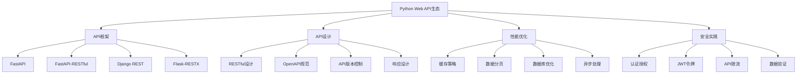

# 5.1 Web API开发

## 🎯 核心理念

Web API是现代软件开发的核心基础设施。无论是微服务架构、移动应用后端，还是前后端分离的项目，API都是数据交换的关键桥梁。掌握RESTful设计、性能优化和安全实践，是Python全栈开发者的必备技能。

### 🚀 Web API技术栈



## 🚀 FastAPI 高级开发

### 💡 基础API设计

```python
from fastapi import FastAPI, HTTPException, Depends, status, BackgroundTasks
from fastapi.middleware.cors import CORSMiddleware
from fastapi.middleware.trustedhost import TrustedHostMiddleware
from fastapi.security import HTTPBearer, HTTPAuthorizationCredentials
from fastapi.responses import JSONResponse
from fastapi.openapi.docs import get_redoc_html, get_swagger_ui_html
from pydantic import BaseModel, Field, validator
from typing import List, Optional, Dict, Any
import uvicorn
from datetime import datetime, timedelta
import os
import secrets
import hashlib
import jwt
from slowapi import Limiter, _rate_limit_exceeded_handler
from slowapi.util import get_remote_address
from slowapi.errors import RateLimitExceeded
import redis
import sqlite3
from contextlib import asynccontextmanager

class AdvancedAPIDevelopment:
    """高级API开发技术"""
    
    @staticmethod
    def fastapi_comprehensive_setup():
        """FastAPI全面设置"""
        
        print("🚀 FastAPI全面开发:")
        
        # ✅ Pydantic模型定义
        class UserBase(BaseModel):
            """用户基类"""
            email: str = Field(..., description="用户邮箱")
            username: str = Field(..., min_length=3, max_length=20)
            full_name: Optional[str] = Field(None, max_length=100)
            
            @validator('email')
            def validate_email(cls, v):
                if '@' not in v:
                    raise ValueError('Email must contain @')
                return v.lower()
        
        class UserCreate(UserBase):
            """用户创建"""
            password: str = Field(..., min_length=8, max_length=100)
            
            @validator('password')
            def validate_password(cls, v):
                if len(v) < 8:
                    raise ValueError('Password must be at least 8 characters')
                if not any(c.isdigit() for c in v):
                    raise ValueError('Password must contain at least one digit')
                return v
        
        class UserResponse(UserBase):
            """用户响应"""
            id: int
            is_active: bool
            created_at: datetime
            last_login: Optional[datetime] = None
            
            class Config:
                from_attributes = True
        
        class UserUpdate(BaseModel):
            """用户更新"""
            full_name: Optional[str] = None
            email: Optional[str] = None
            
            @validator('email')
            def validate_email(cls, v):
                if v and '@' not in v:
                    raise ValueError('Email must contain @')
                return v.lower() if v else v
        
        # ✅ 数据库模型
        class User:
            """用户数据库模型"""
            
            def __init__(self):
                self.id = None
                self.email = None
                self.username = None
                self.full_name = None
                self.password_hash = None
                self.is_active = True
                self.created_at = datetime.now()
                self.last_login = None
        
        # ✅ 数据库连接
        @asynccontextmanager
        async def get_db():
            """数据库连接管理"""
            
            conn = sqlite3.connect('users.db')
            try:
                # 创建表
                conn.execute('''
                    CREATE TABLE IF NOT EXISTS users (
                        id INTEGER PRIMARY KEY AUTOINCREMENT,
                        email TEXT UNIQUE NOT NULL,
                        username TEXT UNIQUE NOT NULL,
                        full_name TEXT,
                        password_hash TEXT NOT NULL,
                        is_active BOOLEAN DEFAULT TRUE,
                        created_at TIMESTAMP DEFAULT CURRENT_TIMESTAMP,
                        last_login TIMESTAMP
                    )
                ''')
                conn.commit()
                
                yield conn
            finally:
                conn.close()
        
        # ✅ 认证系统
        class AuthManager:
            """认证管理器"""
            
            def __init__(self):
                self.secret_key = os.getenv("SECRET_KEY", "your-secret-key-change-in-production")
                self.algorithm = "HS256"
                self.access_token_expire_minutes = 30
            
            def hash_password(self, password: str) -> str:
                """密码哈希"""
                return hashlib.sha256(password.encode()).hexdigest()
            
            def verify_password(self, plain_password: str, hashed_password: str) -> bool:
                """验证密码"""
                return self.hash_password(plain_password) == hashed_password
            
            def create_access_token(self, data: dict) -> str:
                """创建访问令牌"""
                to_encode = data.copy()
                expire = datetime.utcnow() + timedelta(minutes=self.access_token_expire_minutes)
                to_encode.update({"exp": expire})
                
                encoded_jwt = jwt.encode(to_encode, self.secret_key, algorithm=self.algorithm)
                return encoded_jwt
            
            def verify_token(self, token: str) -> Optional[dict]:
                """验证令牌"""
                try:
                    payload = jwt.decode(token, self.secret_key, algorithms=[self.algorithm])
                    return payload
                except jwt.JWTError:
                    return None
        
        # ✅ 缓存系统
        class CacheManager:
            """缓存管理器"""
            
            def __init__(self):
                try:
                    self.redis_client = redis.Redis(host='localhost', port=6379, db=0)
                    self.redis_client.ping()
                except:
                    self.redis_client = None  # 使用内存缓存作为fallback
                    self._memory_cache = {}
            
            def get(self, key: str):
                """获取缓存"""
                if self.redis_client:
                    try:
                        return self.redis_client.get(key)
                    except:
                        return None
                return self._memory_cache.get(key)
            
            def set(self, key: str, value: str, expire: int = 300):
                """设置缓存"""
                if self.redis_client:
                    try:
                        self.redis_client.setex(key, expire, value)
                        return True
                    except:
                        pass
                
                self._memory_cache[key] = value
                return True
        
        # ✅ 限流系统
        limiter = Limiter(
            key_func=get_remote_address,
            default_limits=["100/hour"]
        )
        
        # ✅ FastAPI应用创建
        app = FastAPI(
            title="Advanced API",
            description="一个高级Python Web API示例",
            version="1.0.0",
            docs_url="/api/docs",
            redoc_url="/api/redoc"
        )
        
        # ✅ 中间件配置
        app.state.limiter = limiter
        app.add_exception_handler(RateLimitExceeded, _rate_limit_exceeded_handler)
        
        # CORS中间件
        app.add_middleware(
            CORSMiddleware,
            allow_origins=["http://localhost:3000", "http://localhost:8080"],
            allow_credentials=True,
            allow_methods=["*"],
            allow_headers=["*"],
        )
        
        # 受信任主机中间件
        app.add_middleware(
            TrustedHostMiddleware, 
            allowed_hosts=["localhost", "*.example.com"]
        )
        
        # ✅ 依赖注入
        auth_manager = AuthManager()
        cache_manager = CacheManager()
        security = HTTPBearer()
        
        async def get_current_user(credentials: HTTPAuthorizationCredentials = Depends(security)) -> User:
            """获取当前用户"""
            if not credentials:
                raise HTTPException(
                    status_code=status.HTTP_401_UNAUTHORIZED,
                    detail="Not authenticated"
                )
            
            payload = auth_manager.verify_token(credentials.credentials)
            if payload is None:
                raise HTTPException(
                    status_code=status.HTTP_401_UNAUTHORIZED,
                    detail="Invalid token"
                )
            
            email = payload.get("sub")
            if email is None:
                raise HTTPException(
                    status_code=status.HTTP_401_UNAUTHORIZED,
                    detail="Invalid token payload"
                )
            
            # 从数据库获取用户
            async with get_db() as db:
                cursor = db.execute("SELECT * FROM users WHERE email = ?", (email,))
                user_data = cursor.fetchone()
                
                if user_data is None:
                    raise HTTPException(
                        status_code=status.HTTP_401_UNAUTHORIZED,
                        detail="User not found"
                    )
                
                user = User()
                user.id = user_data[0]
                user.email = user_data[1]
                user.username = user_data[2]
                user.full_name = user_data[3]
                user.is_active = user_data[5]
                user.created_at = user_data[6]
                user.last_login = user_data[7]
                
                return user
        
        async def get_current_active_user(current_user: User = Depends(get_current_user)) -> User:
            """获取当前活跃用户"""
            if not current_user.is_active:
                raise HTTPException(
                    status_code=status.HTTP_400_BAD_REQUEST,
                    detail="Inactive user"
                )
            return current_user
        
        # ✅ API路由定义
        @app.get("/", response_model=Dict[str, str])
        async def root():
            """根路径"""
            return {"message": "Welcome to Advanced API"}
        
        @app.post("/auth/register", response_model=UserResponse, status_code=status.HTTP_201_CREATED)
        @limiter.limit("5/minute")
        async def register(
            user_data: UserCreate,
            background_tasks: BackgroundTasks,
            db: sqlite3.Connection = Depends(get_db)
        ):
            """用户注册"""
            
            # 检查邮箱是否已存在
            cursor = db.execute("SELECT id FROM users WHERE email = ?", (user_data.email,))
            if cursor.fetchone():
                raise HTTPException(
                    status_code=status.HTTP_400_BAD_REQUEST,
                    detail="Email already registered"
                )
            
            # 检查用户名是否已存在
            cursor = db.execute("SELECT id FROM users WHERE username = ?", (user_data.username,))
            if cursor.fetchone():
                raise HTTPException(
                    status_code=status.HTTP_400_BAD_REQUEST,
                    detail="Username already taken"
                )
            
            # 创建用户
            password_hash = auth_manager.hash_password(user_data.password)
            
            cursor = db.execute(
                "INSERT INTO users (email, username, full_name, password_hash) VALUES (?, ?, ?, ?)",
                (user_data.email, user_data.username, user_data.full_name, password_hash)
            )
            user_id = cursor.lastrowid
            db.commit()
            
            # 获取新创建的用户
            cursor = db.execute("SELECT * FROM users WHERE id = ?", (user_id,))
            user_data_db = cursor.fetchone()
            
            user_response = UserResponse(
                id=user_data_db[0],
                email=user_data_db[1],
                username=user_data_db[2],
                full_name=user_data_db[3],
                is_active=user_data_db[5],
                created_at=user_data_db[6],
                last_login=user_data_db[7]
            )
            
            # 后台任务：发送欢迎邮件
            background_tasks.add_task(send_welcome_email, user_response.email)
            
            return user_response
        
        @app.post("/auth/login")
        async def login(
            email: str = Field(...),
            password: str = Field(...),
            db: sqlite3.Connection = Depends(get_db)
        ):
            """用户登录"""
            
            cursor = db.execute("SELECT * FROM users WHERE email = ?", (email,))
            user_data = cursor.fetchone()
            
            if not user_data or not auth_manager.verify_password(password, user_data[4]):
                raise HTTPException(
                    status_code=status.HTTP_401_UNAUTHORIZED,
                    detail="Invalid credentials"
                )
            
            if not user_data[5]:  # is_active
                raise HTTPException(
                    status_code=status.HTTP_400_BAD_REQUEST,
                    detail="Account disabled"
                )
            
            # 更新最后登录时间
            db.execute(
                "UPDATE users SET last_login = ? WHERE id = ?",
                (datetime.now(), user_data[0])
            )
            db.commit()
            
            # 创建访问令牌
            access_token = auth_manager.create_access_token(
                data={"sub": user_data[1]}  # 使用email作为subject
            )
            
            return {
                "access_token": access_token,
                "token_type": "bearer",
                "user_id": user_data[0],
                "expires_in": auth_manager.access_token_expire_minutes * 60
            }
        
        @app.get("/users/me", response_model=UserResponse)
        async def read_users_me(current_user: User = Depends(get_current_active_user)):
            """获取当前用户信息"""
            return UserResponse(
                id=current_user.id,
                email=current_user.email,
                username=current_user.username,
                full_name=current_user.full_name,
                is_active=current_user.is_active,
                created_at=current_user.created_at,
                last_login=current_user.last_login
            )
        
        @app.get("/users", response_model=List[UserResponse])
        @limiter.limit("30/minute")
        async def read_users(
            skip: int = Field(0, ge=0, description="跳过的用户数"),
            limit: int = Field(100, ge=1, le=100, description="限制的用户数"),
            db: sqlite3.Connection = Depends(get_db),
            current_user: User = Depends(get_current_active_user)
        ):
            """获取用户列表(分页)"""
            
            cursor = db.execute(
                "SELECT * FROM users LIMIT ? OFFSET ?", 
                (limit, skip)
            )
            users_data = cursor.fetchall()
            
            users = [
                UserResponse(
                    id=user[0],
                    email=user[1],
                    username=user[2],
                    full_name=user[3],
                    is_active=user[5],
                    created_at=user[6],
                    last_login=user[7]
                )
                for user in users_data
            ]
            
            return users
        
        @app.put("/users/me", response_model=UserResponse)
        async def update_user_me(
            user_update: UserUpdate,
            db: sqlite3.Connection = Depends(get_db),
            current_user: User = Depends(get_current_active_user)
        ):
            """更新当前用户信息"""
            
            # 如果更新邮箱，检查是否已存在
            if user_update.email and user_update.email != current_user.email:
                cursor = db.execute("SELECT id FROM users WHERE email = ?", (user_update.email,))
                if cursor.fetchone():
                    raise HTTPException(
                        status_code=status.HTTP_400_BAD_REQUEST,
                        detail="Email already registered"
                    )
            
            # 构建更新查询
            update_fields = []
            values = []
            
            if user_update.full_name is not None:
                update_fields.append("full_name = ?")
                values.append(user_update.full_name)
            
            if user_update.email is not None:
                update_fields.append("email = ?")
                values.append(user_update.email)
            
            if not update_fields:
                raise HTTPException(
                    status_code=status.HTTP_400_BAD_REQUEST,
                    detail="No fields to update"
                )
            
            values.append(current_user.id)
            
            query = f"UPDATE users SET {', '.join(update_fields)} WHERE id = ?"
            db.execute(query, values)
            db.commit()
            
            # 获取更新后的用户信息
            cursor = db.execute("SELECT * FROM users WHERE id = ?", (current_user.id,))
            updated_user_data = cursor.fetchone()
            
            return UserResponse(
                id=updated_user_data[0],
                email=updated_user_data[1],
                username=updated_user_data[2],
                full_name=updated_user_data[3],
                is_active=updated_user_data[5],
                created_at=updated_user_data[6],
                last_login=updated_user_data[7]
            )
        
        @app.get("/health")
        async def health_check():
            """健康检查"""
            return {
                "status": "healthy",
                "timestamp": datetime.now(),
                "version": "1.0.0"
            }
        
        # ✅ 异常处理
        @app.exception_handler(HTTPException)
        async def http_exception_handler(request, exc):
            """HTTP异常处理"""
            return JSONResponse(
                status_code=exc.status_code,
                content={
                    "error": {
                        "code": exc.status_code,
                        "message": exc.detail,
                        "timestamp": datetime.now().isoformat(),
                        "path": str(request.url)
                    }
                }
            )
        
        @app.exception_handler(Exception)
        async def general_exception_handler(request, exc):
            """通用异常处理"""
            return JSONResponse(
                status_code=500,
                content={
                    "error": {
                        "code": 500,
                        "message": "Internal server error",
                        "timestamp": datetime.now().isoformat(),
                        "path": str(request.url)
                    }
                }
            )
        
        # ✅ 后台任务
        async def send_welcome_email(email: str):
            """发送欢迎邮件(模拟)"""
            print(f"📧 Sending welcome email to {email}")
            # 这里可以集成真实的邮件服务
        
        print("✅ FastAPI应用配置完成")
        
        # 启动服务器
        if __name__ == "__main__":
            uvicorn.run(
                "main:app",
                host="0.0.0.0",
                port=8000,
                reload=True,
                log_level="info"
            )

# ✅ 性能优化技术
class APIPerformanceOptimization:
    """API性能优化"""
    
    @staticmethod
    def optimization_strategies():
        """优化策略"""
        
        print("\n⚡ API性能优化:")
        
        # ✅ 数据库查询优化
        def optimize_database_queries():
            """优化数据库查询"""
            
            class OptimizedDatabase:
                """优化的数据库类"""
                
                def __init__(self):
                    self.connection_pool = []
                    self.max_connections = 5
                
                async def execute_with_prepared_statement(self, query: str, params: tuple):
                    """使用预处理语句"""
                    async with self.get_connection() as conn:
                        # 使用预处理语句避免SQL注入并提高性能
                        prepared = await conn.prepare(query)
                        return await prepared.fetch(*params)
                
                async def execute_batch(self, queries: List[tuple]):
                    """批量执行查询"""
                    async with self.get_connection() as conn:
                        async with conn.transaction():
                            for query, params in queries:
                                await conn.execute(query, params)
                
                async def get_connection(self):
                    """获取数据库连接"""
                    # 模拟连接池
                    pass
        
        # ✅ 缓存策略实现
        def implement_caching_strategies():
            """实现缓存策略"""
            
            from functools import wraps
            
            def cache_response(timeout: int = 300):
                """响应缓存装饰器"""
                def decorator(func):
                    @wraps(func)
                    async def wrapper(*args, **kwargs):
                        # 生成缓存键
                        cache_key = f"{func.__name__}:{hash(str(args) + str(sorted(kwargs.items())))}"
                        
                        # 检查缓存
                        cache_manager = CacheManager()
                        cached_result = cache_manager.get(cache_key)
                        
                        if cached_result:
                            return cached_result
                        
                        # 执行函数
                        result = await func(*args, **kwargs)
                        
                        # 缓存结果
                        cache_manager.set(cache_key, str(result), timeout)
                        
                        return result
                    return wrapper
                return decorator
            
            # 使用示例
            @cache_response(timeout=600)  # 缓存10分钟
            async def get_expensive_data(skip: int, limit: int):
                """获取昂贵数据"""
                # 模拟昂贵的数据库查询
                await asyncio.sleep(1)
                return {"data": "expensive result", "count": limit}
        
        # ✅ 异步处理优化
        def async_processing_optimization():
            """异步处理优化"""
            
            async def process_multiple_requests(requests: List[Dict[str, Any]]):
                """并行处理多个请求"""
                
                async def process_single_request(request_data: Dict[str, Any]):
                    """处理单个请求"""
                    # 模拟异步操作
                    await asyncio.sleep(0.1)
                    return {"processed": request_data["id"]}
                
                # 使用asyncio.gather并行处理
                tasks = [process_single_request(req) for req in requests]
                results = await asyncio.gather(*tasks, return_exceptions=True)
                
                # 处理结果和异常
                processed_results = []
                errors = []
                
                for result in results:
                    if isinstance(result, Exception):
                        errors.append(result)
                    else:
                        processed_results.append(result)
                
                return {
                    "results": processed_results,
                    "errors": errors,
                    "total": len(requests),
                    "success": len(processed_results)
                }
        
        optimize_database_queries()
        implement_caching_strategies()
        async_processing_optimization()

# ✅ API安全实践
class APISecurityPractices:
    """API安全实践"""
    
    @staticmethod
    def security_implementation():
        """安全实现"""
        
        print("\n🔒 API安全实践:")
        
        # ✅ 输入验证强化
        def advanced_input_validation():
            """高级输入验证"""
            
            from pydantic import BaseModel, validator, EmailStr
            
            class SecureUserInput(BaseModel):
                """安全用户输入"""
                
                email: EmailStr = Field(..., description="用户邮箱")
                username: str = Field(..., min_length=3, max_length=20, regex="^[a-zA-Z0-9_]+$")
                full_name: Optional[str] = Field(None, max_length=100, regex="^[a-zA-Z\\s]+$")
                
                @validator('email')
                def validate_email_security(cls, v):
                    """邮箱安全验证"""
                    # 检查邮箱格式
                    if '@' not in v:
                        raise ValueError('Invalid email format')
                    
                    # 检查禁用域名
                    banned_domains = ['tempmail.com', 'guerrillamail.com']
                    domain = v.split('@')[1].lower()
                    if domain in banned_domains:
                        raise ValueError('Domain not allowed')
                    
                    return v.lower()
                
                @validator('username')
                def validate_username_security(cls, v):
                    """用户名安全验证"""
                    # 检查禁止的用户名
                    banned_usernames = ['admin', 'root', 'system', 'api']
                    if v.lower() in banned_usernames:
                        raise ValueError('Username not allowed')
                    
                    return v.lower()
        
        # ✅ JWT令牌安全
        def secure_jwt_implementation():
            """安全JWT实现"""
            
            class SecureJWTManager:
                """安全JWT管理器"""
                
                def __init__(self):
                    self.secret_key = os.getenv("JWT_SECRET_KEY", secrets.token_urlsafe(32))
                    self.algorithm = "HS256"
                    self.access_token_expire_minutes = 30
                    self.refresh_token_expire_days = 7
                
                def create_token_pair(self, user_id: int, email: str) -> Dict[str, str]:
                    """创建令牌对"""
                    
                    access_token_data = {
                        "sub": email,
                        "user_id": user_id,
                        "token_type": "access",
                        "exp": datetime.utcnow() + timedelta(minutes=self.access_token_expire_minutes)
                    }
                    
                    refresh_token_data = {
                        "sub": email,
                        "user_id": user_id,
                        "token_type": "refresh",
                        "exp": datetime.utcnow() + timedelta(days=self.refresh_token_expire_days)
                    }
                    
                    access_token = jwt.encode(access_token_data, self.secret_key, algorithm=self.algorithm)
                    refresh_token = jwt.encode(refresh_token_data, self.secret_key, algorithm=self.algorithm)
                    
                    return {
                        "access_token": access_token,
                        "refresh_token": refresh_token,
                        "token_type": "bearer",
                        "expires_in": self.access_token_expire_minutes * 60
                    }
                
                def verify_access_token(self, token: str) -> Optional[Dict]:
                    """验证访问令牌"""
                    try:
                        payload = jwt.decode(token, self.secret_key, algorithms=[self.algorithm])
                        if payload.get("token_type") != "access":
                            return None
                        return payload
                    except jwt.ExpiredSignatureError:
                        return None
                    except jwt.JWTError:
                        return None
        
        # ✅ API限流实现
        def advanced_rate_limiting():
            """高级限流实现"""
            
            from collections import defaultdict, deque
            import time
            
            class AdvancedLimiter:
                """高级限流器"""
                
                def __init__(self):
                    self.requests = defaultdict(lambda: deque())
                
                async def is_allowed(self, key: str, limit: int, window: int) -> bool:
                    """检查是否允许请求"""
                    now = time.time()
                    request_times = self.requests[key]
                    
                    # 清理过期的请求
                    while request_times and request_times[0] <= now - window:
                        request_times.popleft()
                    
                    # 检查是否超出限制
                    if len(request_times) >= limit:
                        return False
                    
                    # 记录当前请求
                    request_times.append(now)
                    return True
                
                def get_remaining_requests(self, key: str, limit: int, window: int) -> int:
                    """获取剩余请求数"""
                    now = time.time()
                    request_times = self.requests[key]
                    
                    # 清理过期请求
                    while request_times and request_times[0] <= now - window:
                        request_times.popleft()
                    
                    return max(0, limit - len(request_times))
        
        advanced_input_validation()
        secure_jwt_implementation()
        advanced_rate_limiting()

# 运行所有示例
if __name__ == "__main__":
    print("🚀 Python Web API开发技术:")
    
    AdvancedAPIDevelopment.fastapi_comprehensive_setup()
    APIPerformanceOptimization.optimization_strategies()
    APISecurityPractices.security_implementation()

## 🧪 API开发最佳实践

### 📝 实践1：微服务API设计

**任务**：设计分布式微服务API架构

```python
# ✅ 微服务API架构
class MicroserviceArchitecture:
    """微服务架构设计"""
    
    def __init__(self):
        self.services = {}
    
    def register_service(self, service_name: str, api_base_url: str):
        """注册服务"""
        self.services[service_name] = {
            "base_url": api_base_url,
            "health_check": f"{api_base_url}/health",
            "circuit_breaker": CircuitBreaker()
        }
    
    async def call_service(self, service_name: str, endpoint: str, data: dict = None):
        """调用服务"""
        
        if service_name not in self.services:
            raise ValueError(f"Service {service_name} not registered")
        
        service = self.services[service_name]
        
        # 使用断路器保护
        try:
            async with service["circuit_breaker"]:
                url = f"{service['base_url']}{endpoint}"
                # 实际的HTTP调用
                return await self._make_request(url, data)
        
        except CircuitBreakerOpenException:
            raise HTTPException(503, "Service temporarily unavailable")
```

### 🎯 实践2：API监控与告警

**任务**：实现API运行监控系统

```python
# ✅ API监控系统
class APIMonitoring:
    """API监控系统"""
    
    def __init__(self):
        self.metrics = {
            "request_count": defaultdict(int),
            "response_times": defaultdict(list),
            "error_rates": defaultdict(float)
        }
    
    def record_request(self, endpoint: str, method: str, status_code: int, duration: float):
        """记录请求"""
        key = f"{method}:{endpoint}"
        
        self.metrics["request_count"][key] += 1
        self.metrics["response_times"][key].append(duration)
        
        if status_code >= 400:
            self.metrics["error_rates"][key] += 1
    
    def get_health_status(self) -> dict:
        """获取健康状态"""
        avg_response_times = {}
        for endpoint, times in self.metrics["response_times"].items():
            avg_response_times[endpoint] = sum(times) / len(times)
        
        return {
            "status": "healthy",
            "request_counts": dict(self.metrics["request_count"]),
            "avg_response_times": avg_response_times,
            "error_rates": dict(self.metrics["error_rates"])
        }
```

## 🔗 知识连接

- **框架应用**：[[5.1.1 Flask框架深入应用]] - Flask API开发
- **框架对比**：[[5.1.2 FastAPI框架深入应用]] - FastAPI框架特性
- **数据库集成**：[[4.1.1 ORM框架深入应用]] - SQLAlchemy在API中的应用
- **性能优化**：[[5.5 性能调优与监控]] - API性能监控和优化

## 💡 费曼检验

**解释：什么是RESTful API？FastAPI相比其他框架有什么优势？如何保证API的安全性和性能？**

核心要点：
1. **RESTful API设计**：资源为中心的URL设计、HTTP方法的语义化使用、状态码的正确使用、统一的数据格式
2. **FastAPI优势**：自动文档生成、类型提示集成、异步支持、高性能、现代特性(如依赖注入)
3. **安全性保障**：输入验证、认证授权、HTTPS、限流、SQL注入防护、XSS防护
4. **性能优化**：数据库连接池、查询优化、缓存策略、异步处理、CDN集成

---

🎯 **下个目标**：学习[[5.1.1 Flask框架深入应用]]中的Flask高级技术
