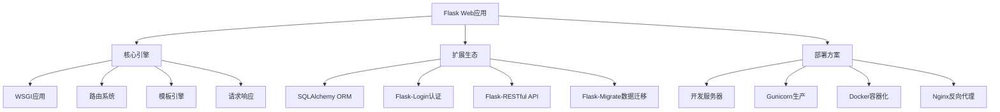

# 5.1.1 Flask框架深入

## 🎯 核心理念

Flask是现代Web开发的"极简主义哲学"的体现。"微核心、大生态"的设计理念让我们能够灵活构建从简单API到复杂应用的各类Web服务。

### 🌟 Flask架构全景



## 🚀 Flask深度实践

### 💡 高级应用架构

```python
from flask import Flask, request, jsonify, session, redirect, url_for, render_template_string
from flask_sqlalchemy import SQLAlchemy
from flask_login import UserMixin, LoginManager, login_user, logout_user, login_required
from flask_wtf import FlaskForm
from wtforms import StringField, PasswordField, validators
from flask_migrate import Migrate
from werkzeug.security import generate_password_hash, check_password_hash
import os
from datetime import datetime

# ✅ Flask高级应用架构
class ProductionFlaskApp:
    """生产级Flask应用架构"""
    
    def __init__(self):
        self.app = Flask(__name__)
        self.app.config.update({
            'SECRET_KEY': os.environ.get('SECRET_KEY', os.urandom(32)),
            'SQLALCHEMY_DATABASE_URI': os.environ.get('DATABASE_URL', 'sqlite:///app.db'),
            'SQLALCHEMY_TRACK_MODIFICATIONS': False,
            'DEBUG': False,
            'TESTING': False
        })
        
        # 初始化扩展
        self.init_extensions()
        self.init_routes()
        
    def init_extensions(self):
        """初始化扩展"""
        
        # SQLAlchemy
        self.db = SQLAlchemy(self.app)
        
        # Login Manager
        self.login_manager = LoginManager()
        self.login_manager.init_app(self.app)
        self.login_manager.login_view = 'auth.login'
        
        # Migrate
        self.migrate = Migrate(self.app, self.db)
        
        # 用户加载
        @self.login_manager.user_loader
        def load_user(user_id):
            return User.query.get(int(user_id))
    
    def init_routes(self):
        """初始化路由"""
        
        # 用户模型
        class User(UserMixin, self.db.Model):
            id = self.db.Column(self.db.Integer, primary_key=True)
            username = self.db.Column(self.db.String(80), unique=True, nullable=False)
            email = self.db.Column(self.db.String(120), unique=True, nullable=False)
            password_hash = self.db.Column(self.db.String(200), nullable=False)
            created_at = self.db.Column(self.db.DateTime, default=datetime.utcnow)
            
            def set_password(self, password):
                self.password_hash = generate_password_hash(password)
            
            def check_password(self, password):
                return check_password_hash(self.password_hash, password)
        
        class LoginForm(FlaskForm):
            username = StringField('Username', [validators.Length(min=4, max=20)])
            password = PasswordField('Password', [validators.Length(min=6)])
        
        # 认证蓝图
        from flask import Blueprint
        auth_bp = Blueprint('auth', __name__, url_prefix='/auth')
        
        @auth_bp.route('/register', methods=['GET', 'POST'])
        def register():
            if request.method == 'POST':
                username = request.json.get('username')
                email = request.json.get('email')
                password = request.json.get('password')
                
                if User.query.filter_by(username=username).first():
                    return jsonify({'error': 'Username already exists'}), 400
                
                user = User(username=username, email=email)
                user.set_password(password)
                self.db.session.add(user)
                self.db.session.commit()
                
                return jsonify({'message': 'User created successfully'}), 201
            
            return jsonify({'message': 'Register endpoint'})
        
        @auth_bp.route('/login', methods=['POST'])
        def login():
            form = LoginForm()
            if request.json:
                username = request.json.get('username')
                password = request.json.get('password')
                
                user = User.query.filter_by(username=username).first()
                if user and user.check_password(password):
                    login_user(user)
                    session.permanent = True
                    return jsonify({
                        'message': 'Login successful',
                        'user_id': user.id,
                        'username': user.username
                    }), 200
                else:
                    return jsonify({'error': 'Invalid credentials'}), 401
        
        @auth_bp.route('/logout')
        @login_required
        def logout():
            logout_user()
            return jsonify({'message': 'Logout successful'})
        
        # API蓝图
        api_bp = Blueprint('api', __name__, url_prefix='/api')
        
        @api_bp.route('/users/<int:user_id>')
        @login_required
        def get_user(user_id):
            user = User.query.get_or_404(user_id)
            return jsonify({
                'id': user.id,
                'username': user.username,
                'email': user.email,
                'created_at': user.created_at.isoformat()
            })
        
        @api_bp.route('/dashboard')
        @login_required
        def dashboard():
            dashboard_html = '''
            <!DOCTYPE html>
            <html>
            <head>
                <title>Flask Dashboard</title>
                <meta charset="utf-8">
                <style>
                    body { font-family: Arial, sans-serif; margin: 40px; }
                    .card { background: #f5f5f5; padding: 20px; margin: 10px 0; border-radius: 8px; }
                    .btn { background: #007cba; color: white; padding: 10px 20px; text-decoration: none; border-radius: 4px; }
                </style>
            </head>
            <body>
                <h1>🏠 Flask Dashboard</h1>
                <div class="card">
                    <h2>Welcome, {{ user.username }}!</h2>
                    <p>Your User ID: {{ user.id }}</p>
                    <p>Email: {{ user.email }}</p>
                    <p>Registered: {{ user.created_at.strftime('%Y-%m-%d %H:%M') }}</p>
                </div>
                <div class="card">
                    <a href="/auth/logout" class="btn">Logout</a>
                </div>
            </body>
            </html>
            '''
            return render_template_string(dashboard_html, user=User.query.get(session['_user_id']))
        
        # 健康检查
        @self.app.route('/health')
        def health():
            return jsonify({
                'status': 'healthy',
                'timestamp': datetime.utcnow().isoformat(),
                'version': '1.0.0'
            })
        
        # 注册蓝图
        self.app.register_blueprint(auth_bp)
        self.app.register_blueprint(api_bp)

# ✅ ORM高级模式
class SQLAlchemyAdvancedPatterns:
    """SQLAlchemy高级模式"""
    
    @staticmethod
    def create_advanced_models(app):
        """创建高级数据模型"""
        
        db = SQLAlchemy(app)
        
        # 基础模型类
        class BaseModel(db.Model):
            __abstract__ = True
            id = db.Column(db.Integer, primary_key=True)
            created_at = db.Column(db.DateTime, default=datetime.utcnow)
            updated_at = db.Column(db.DateTime, default=datetime.utcnow, onupdate=datetime.utcnow)
            
            def to_dict(self):
                """转换为字典"""
                return {c.name: getattr(self, c.name) for c in self.__table__.columns}
        
        # 用户模型
        class User(BaseModel):
            __tablename__ = 'users'
            
            username = db.Column(db.String(80), unique=True, nullable=False, index=True)
            email = db.Column(db.String(120), unique=True, nullable=False, index=True)
            password_hash = db.Column(db.String(128), nullable=False)
            is_active = db.Column(db.Boolean, default=True)
            
            # 关系
            posts = db.relationship('Post', backref='author', lazy='dynamic', cascade='all, delete-orphan')
            comments = db.relationship('Comment', backref='author', lazy='dynamic', cascade='all, delete-orphan')
            
            def __repr__(self):
                return f'<User {self.username}>'
        
        # 文章模型
        class Post(BaseModel):
            __tablename__ = 'posts'
            
            title = db.Column(db.String(255), nullable=False)
            content = db.Column(db.Text, nullable=False)
            excerpt = db.Column(db.Text)
            
            # 外键
            author_id = db.Column(db.Integer, db.ForeignKey('users.id'), nullable=False)
            
            # 关系
            comments = db.relationship('Comment', backref='post', lazy='dynamic', cascade='all, delete-orphan')
            
            # 搜索功能
            __searchable__ = ['title', 'content']
            
            def __repr__(self):
                return f'<Post {self.title[:30]}>'
        
        # 评论模型
        class Comment(BaseModel):
            __tablename__ = 'comments'
            
            content = db.Column(db.Text, nullable=False)
            
            # 外键
            author_id = db.Column(db.Integer, db.ForeignKey('users.id'), nullable=False)
            post_id = db.Column(db.Integer, db.ForeignKey('posts.id'), nullable=False)
            
            def __repr__(self):
                return f'<Comment from {self.author.username}>'
        
        # 数据库操作类
        class DataAccessLayer:
            """数据访问层"""
            
            def __init__(self, db_session):
                self.db = db_session
            
            def create_user(self, username, email, password_hash):
                """创建用户"""
                user = User(username=username, email=email, password_hash=password_hash)
                self.db.add(user)
                self.db.commit()
                return user
            
            def get_user_by_username(self, username):
                """根据用户名获取用户"""
                return User.query.filter_by(username=username).first()
            
            def get_user_posts(self, user_id, page=1, per_page=10):
                """获取用户文章（分页）"""
                return User.query.get(user_id).posts.paginate(
                    page=page, per_page=per_page, error_out=False
                )
            
            def search_posts(self, query, page=1, per_page=10):
                """搜索文章"""
                search_query = f"%{query}%"
                posts = Post.query.filter(
                    db.or_(
                        Post.title.ilike(search_query),
                        Post.content.ilike(search_query)
                    )
                ).paginate(page=page, per_page=per_page, error_out=False)
                return posts
            
            def get_recent_posts(self, limit=10):
                """获取最近文章"""
                return Post.query.order_by(Post.created_at.desc()).limit(limit).all()
        
        return db, User, Post, Comment, DataAccessLayer

# ✅ 中间件与装饰器
class FlaskMiddlewareAndDecorators:
    """Flask中间件与装饰器"""
    
    @staticmethod
    def create_custom_middleware(app):
        """自定义中间件和装饰器"""
        
        from functools import wraps
        
        # 请求日志中间件
        @app.before_request
        def log_request_info():
            """记录请求信息"""
            print(f"📝 请求日志:")
            print(f"  方法: {request.method}")
            print(f"  路径: {request.path}")
            print(f"  参数: {dict(request.args)}")
            print(f"  数据: {request.get_json() if request.is_json else request.form}")
            print(f"  来源IP: {request.environ.get('REMOTE_ADDR', 'unknown')}")
        
        # 响应处理中间件
        @app.after_request
        def add_cors_headers(response):
            """添加CORS头"""
            response.headers.add('Access-Control-Allow-Origin', '*')
            response.headers.add('Access-Control-Allow-Headers', 'Content-Type,Authorization')
            response.headers.add('Access-Control-Allow-Methods', 'GET,PUT,POST,DELETE')
            return response
        
        # 错误处理
        @app.errorhandler(404)
        def not_found(error):
            """404错误处理"""
            return jsonify({
                'error': 'Resource not found',
                'code': 404,
                'message': f'The requested URL {request.url} was not found'
            })
        
        @app.errorhandler(500)
        def internal_error(error):
            """500错误处理"""
            return jsonify({
                'error': 'Internal server error',
                'code': 500,
                'message': 'An unexpected error occurred'
            })
        
        # ✅ 自定义装饰器
        
        def api_key_required(f):
            """API密钥装饰器"""
            @wraps(f)
            def decorated_function(*args, **kwargs):
                api_key = request.headers.get('X-API-Key')
                if api_key != 'secret-key-123':
                    return jsonify({'error': 'API key required'}), 401
                return f(*args, **kwargs)
            return decorated_function
        
        def rate_limit(max_per_minute=60):
            """速率限制装饰器"""
            def decorator(f):
                @wraps(f)
                def decorated_function(*args, **kwargs):
                    # 简化的速率限制实现
                    import time
                    current_time = int(time.time())
                    minute_key = f"rate_limit_{f.__name__}_{current_time}"
                    
                    # 这里应该使用Redis等缓存系统
                    # 这里简化实现
                    client_ip = request.environ.get('REMOTE_ADDR')
                    print(f"🔒 速率限制检查: {client_ip} -> {f.__name__}")
                    
                    return f(*args, **kwargs)
                return decorated_function
            return decorator
        
        def cache_response(expires_in=300):
            """响应缓存装饰器"""
            def decorator(f):
                @wraps(f)
                def decorated_function(*args, **kwargs):
                    # 简化的缓存实现
                    cache_key = f"cache_{f.__name__}_{hash(str(args))}_{hash(str(kwargs))}"
                    print(f"📦 缓存检查: {cache_key}")
                    
                    # 这里应该检查缓存
                    result = f(*args, **kwargs)
                    
                    # 这里应该存储到缓存
                    return result
                return decorated_function
            return decorator
        
        # 示例路由
        @app.route('/api/protected')
        @api_key_required
        @rate_limit(max_per_minute=10)
        @cache_response(expires_in=60)
        def protected_endpoint():
            """受保护的API端点"""
            return jsonify({
                'message': 'You have accessed the protected endpoint!',
                'timestamp': datetime.utcnow().isoformat()
            })
        
        return app

# ✅ RESTful API设计
class RESTfulAPIDesign:
    """RESTful API设计"""
    
    @staticmethod
    def create_restful_api(app):
        """创建RESTful API"""
        
        # API版本控制
        api_v1 = Blueprint('api_v1', __name__, url_prefix='/api/v1')
        
        # 通用错误处理
        @api_v1.errorhandler(400)
        def bad_request(error):
            return jsonify({'error': 'Bad Request'}), 400
        
        @api_v1.errorhandler(403)
        def forbidden(error):
            return jsonify({'error': 'Forbidden'}), 403
        
        # API装饰器
        def api_response(data=None, message="", status_code=200):
            """标准化API响应"""
            response = {
                'success': status_code < 400,
                'message': message,
                'timestamp': datetime.utcnow().isoformat()
            }
            if data is not None:
                response['data'] = data
            
            return jsonify(response), status_code
        
        # 用户资源API
        @api_v1.route('/users', methods=['GET'])
        def get_users():
            """获取用户列表"""
            page = request.args.get('page', 1, type=int)
            per_page = request.args.get('per_page', 10, type=int)
            
            # 搜索参数
            search = request.args.get('search', '')
            
            # 构建查询
            query = User.query
            if search:
                query = query.filter(User.username.contains(search))
            
            # 分页
            pagination = query.paginate(
                page=page, 
                per_page=per_page, 
                error_out=False
            )
            
            users_data = [user.to_dict() for user in pagination.items]
            
            return api_response(
                data={
                    'users': users_data,
                    'pagination': {
                        'page': pagination.page,
                        'pages': pagination.pages,
                        'per_page': pagination.per_page,
                        'total': pagination.total,
                        'has_next': pagination.has_next,
                        'has_prev': pagination.has_prev
                    }
                },
                message=f"Found {len(users_data)} users"
            )
        
        @api_v1.route('/users/<int:user_id>', methods=['GET'])
        def get_user(user_id):
            """获取单个用户"""
            user = User.query.get_or_404(user_id)
            return api_response(data=user.to_dict(), message="User retrieved successfully")
        
        @api_v1.route('/users/<int:user_id>', methods=['PUT'])
        def update_user(user_id):
            """更新用户"""
            user = User.query.get_or_404(user_id)
            data = request.get_json()
            
            if not data:
                return api_response(message="No data provided", status_code=400)
            
            # 更新字段
            if 'username' in data:
                user.username = data['username']
            if 'email' in data:
                user.email = data['email']
            
            db.session.commit()
            return api_response(data=user.to_dict(), message="User updated successfully")
        
        @api_v1.route('/users/<int:user_id>', methods=['DELETE'])
        def delete_user(user_id):
            """删除用户"""
            user = User.query.get_or_404(user_id)
            db.session.delete(user)
            db.session.commit()
            return api_response(message="User deleted successfully")
        
        # 文章资源API
        @api_v1.route('/posts', methods=['GET'])
        def get_posts():
            """获取文章列表"""
            page = request.args.get('page', 1, type=int)
            per_page = request.args.get('per_page', 10, type=int)
            author_id = request.args.get('author_id', type=int)
            
            query = Post.query
            if author_id:
                query = query.filter_by(author_id=author_id)
            
            pagination = query.paginate(page=page, per_page=per_page, error_out=False)
            
            posts_data = []
            for post in pagination.items:
                post_data = post.to_dict()
                post_data['author'] = post.author.username
                posts_data.append(post_data)
            
            return api_response(
                data={
                    'posts': posts_data,
                    'pagination': {
                        'page': pagination.page,
                        'pages': pagination.pages,
                        'per_page': pagination.per_page,
                        'total': pagination.total
                    }
                }
            )
        
        # 搜索API
        @api_v1.route('/search/posts')
        def search_posts():
            """搜索文章"""
            query = request.args.get('q', '')
            page = request.args.get('page', 1, type=int)
            per_page = request.args.get('per_page', 10, type=int)
            
            if not query:
                return api_response(message="Search query is required", status_code=400)
            
            # 全文搜索（简化版）
            search_results = Post.query.filter(
                db.or_(
                    Post.title.contains(query),
                    Post.content.contains(query)
                )
            ).paginate(page=page, per_page=per_page, error_out=False)
            
            posts_data = [post.to_dict() for post in search_results.items]
            
            return api_response(
                data={
                    'posts': posts_data,
                    'query': query,
                    'total_results': search_results.total
                },
                message=f"Found {len(posts_data)} posts matching '{query}'"
            )
        
        app.register_blueprint(api_v1)
        return app

# 运行示例
print("🚀 Flask高级应用架构演示:")
print("- 生产级应用配置")
print("- SQLAlchemy ORM模式")
print("- 自定义中间件和装饰器")
print("- RESTful API设计")
print("- 认证和授权系统")

# 创建应用实例（需要在实际环境中初始化）
# flask_app = ProductionFlaskApp()

## 🧪 Flask实战练习

### 📝 练习1：完整博客系统

**任务**：实现一个带用户认证的博客系统

```python
# ✅ 完整博客系统
class BlogSystem:
    """博客系统"""
    
    def create_complete_blog_app():
        """创建完整的博客应用"""
        
        app = Flask(__name__)
        app.config['SECRET_KEY'] = 'blog-secret-key'
        app.config['SQLALCHEMY_DATABASE_URI'] = 'sqlite:///blog.db'
        
        db = SQLAlchemy(app)
        migrate = Migrate(app, db)
        
        # 用户模型
        class User(UserMixin, db.Model):
            id = db.Column(db.Integer, primary_key=True)
            username = db.Column(db.String(80), unique=True)
            email = db.Column(db.String(120), unique=True)
            password_hash = db.Column(db.String(128))
            posts = db.relationship('Post', backref='author', lazy='dynamic')
            
            def set_password(self, password):
                self.password_hash = generate_password_hash(password)
            
            def check_password(self, password):
                return check_password_hash(self.password_hash, password)
        
        # 文章模型
        class Post(db.Model):
            id = db.Column(db.Integer, primary_key=True)
            title = db.Column(db.String(100), nullable=False)
            content = db.Column(db.Text, nullable=False)
            created_at = db.Column(db.DateTime, default=datetime.utcnow)
            author_id = db.Column(db.Integer, db.ForeignKey('user.id'), nullable=False)
            
            def __repr__(self):
                return f'<Post {self.title}>'
        
        # 登录管理器
        login_manager = LoginManager()
        login_manager.init_app(app)
        login_manager.login_view = 'login'
        
        @login_manager.user_loader
        def load_user(user_id):
            return User.query.get(int(user_id))
        
        # 路由
        @app.route('/')
        def index():
            """首页"""
            posts = Post.query.order_by(Post.created_at.desc()).limit(10).all()
            return render_template_string('''
                <html>
                <head><title>Flask Blog</title></head>
                <body>
                    <h1>🏠 Flask Blog 首页</h1>
                    <nav>
                        <a href="/login">登录</a> | 
                        <a href="/register">注册</a> | 
                        <a href="/write">写文章</a>
                    </nav>
                    <h2>📝 最新文章</h2>
                    
                    <article>
                        <h3><a href="/post/{{ post.id }}">{{ post.title }}</a></h3>
                        <p>作者: {{ post.author.username }}</p>
                        <p>发布时间: {{ post.created_at.strftime('%Y-%m-%d %H:%M') }}</p>
                        <p>{{ post.content[:200] }}...</p>
                    </article>
                    
                </body>
                </html>
            ''', posts=posts)
        
        @app.route('/register', methods=['GET', 'POST'])
        def register():
            """注册"""
            if request.method == 'POST':
                username = request.form['username']
                email = request.form['email']
                password = request.form['password']
                
                if User.query.filter_by(username=username).first():
                    return jsonify({'error': '用户名已存在'})
                
                user = User(username=username, email=email)
                user.set_password(password)
                db.session.add(user)
                db.session.commit()
                
                return redirect(url_for('login'))
            
            return render_template_string('''
                <html>
                <head><title>注册</title></head>
                <body>
                    <h1>📝 用户注册</h1>
                    <form method="post">
                        <p>用户名: <input type="text" name="username" required></p>
                        <p>邮箱: <input type="email" name="email" required></p>
                        <p>密码: <input type="password" name="password" required></p>
                        <p><input type="submit" value="注册"></p>
                    </form>
                    <p><a href="/login">已有账号？点击登录</a></p>
                </body>
                </html>
            ''')
        
        @app.route('/login', methods=['GET', 'POST'])
        def login():
            """登录"""
            if request.method == 'POST':
                username = request.form['username']
                password = request.form['password']
                
                user = User.query.filter_by(username=username).first()
                if user and user.check_password(password):
                    login_user(user)
                    return redirect(url_for('index'))
                else:
                    return jsonify({'error': '用户名或密码错误'})
            
            return render_template_string('''
                <html>
                <head><title>登录</title></head>
                <body>
                    <h1>🔐 用户登录</h1>
                    <form method="post">
                        <p>用户名: <input type="text" name="username" required></p>
                        <p>密码: <input type="password" name="password" required></p>
                        <p><input type="submit" value="登录"></p>
                    </form>
                    <p><a href="/register">没有账号？点击注册</a></p>
                </body>
                </html>
            ''')
        
        @app.route('/write', methods=['GET', 'POST'])
        @login_required
        def write_post():
            """写文章"""
            if request.method == 'POST':
                title = request.form['title']
                content = request.form['content']
                
                post = Post(title=title, content=content, author_id=current_user.id)
                db.session.add(post)
                db.session.commit()
                
                return redirect(url_for('index'))
            
            return render_template_string('''
                <html>
                <head><title>写文章</title></head>
                <body>
                    <h1>✍️ 写文章</h1>
                    <form method="post">
                        <p>标题: <input type="text" name="title" required></p>
                        <p>内容:</p>
                        <textarea name="content" rows="10" cols="50" required></textarea>
                        <br>
                        <input type="submit" value="发布">
                    </form>
                    <p><a href="/">返回首页</a></p>
                </body>
                </html>
            ''')
        
        @app.route('/post/<int:post_id>')
        def view_post(post_id):
            """查看文章"""
            post = Post.query.get_or_404(post_id)
            return render_template_string('''
                <html>
                <head><title>{{ post.title }}</title></head>
                <body>
                    <h1>{{ post.title }}</h1>
                    <p>作者: {{ post.author.username }}</p>
                    <p>发布时间: {{ post.created_at.strftime('%Y-%m-%d %H:%M') }}</p>
                    <div>{{ post.content }}</div>
                    <p><a href="/">返回首页</a></p>
                </body>
                </html>
            ''', post=post)
        
        # 初始化数据库
        with app.app_context():
            db.create_all()
        
        return app

# blog_app = BlogSystem.create_complete_blog_app()
```

### 🎯 练习2：API文档自动生成

**任务**：为Flask应用集成Swagger文档

```python
# ✅ API文档自动生成
from flask_restx import Api, Resource, fields

class APIDocumentationSystem:
    """API文档系统"""
    
    @staticmethod
    def create_api_with_documentation(app):
        """创建带文档的API"""
        
        api = Api(app, 
                 version='1.0', 
                 title='Flask API',
                 description='A comprehensive Flask API',
                 doc='/docs/')
        
        # 定义命名空间
        users_ns = api.namespace('users', description='API for managing users')
        
        # 定义数据模型
        user_model = api.model('User', {
            'id': fields.Integer(readonly=True, description='The user unique identifier'),
            'username': fields.String(required=True, description='Username'),
            'email': fields.String(required=True, description='Email address'),
            'created_at': fields.DateTime(readonly=True, description='Creation time')
        })
        
        user_create_model = api.model('UserCreate', {
            'username': fields.String(required=True, description='Username'),
            'email': fields.String(required=True, description='Email address'),
            'password': fields.String(required=True, description='Password')
        })
        
        # API路由
        @users_ns.route('/')
        class UserList(Resource):
            @users_ns.doc('list_users')
            @users_ns.marshal_list_with(user_model)
            def get(self):
                """获取所有用户列表"""
                # 实际实现中应该查询数据库
                return [
                    {
                        'id': 1,
                        'username': 'testuser',
                        'email': 'test@example.com',
                        'created_at': datetime.utcnow()
                    }
                ]
            
            @users_ns.doc('create_user')
            @users_ns.expect(user_create_model)
            @users_ns.marshal_with(user_model)
            def post(self):
                """创建新用户"""
                data = request.json
                # 实际实现中应该保存到数据库
                return {
                    'id': 2,
                    'username': data['username'],
                    'email': data['email'],
                    'created_at': datetime.utcnow()
                }, 201
        
        @users_ns.route('/<int:user_id>')
        @users_ns.response(404, 'User not found')
        class User(Resource):
            @users_ns.doc('get_user')
            @users_ns.marshal_with(user_model)
            def get(self, user_id):
                """根据ID获取用户"""
                # 实际实现中应该查询数据库
                if user_id == 1:
                    return {
                        'id': user_id,
                        'username': 'testuser',
                        'email': 'test@example.com',
                        'created_at': datetime.utcnow()
                    }
                else:
                    api.abort(404, 'User not found')
        
        print("API文档系统已配置:")
        print("- Swagger UI集成")
        print("- 自动API文档生成")
        print("- 数据模型定义")
        print("- 交互式测试界面")
        
        return app

# doc_app = APIDocumentationSystem.create_api_with_documentation(Flask(__name__))
```

## 🔗 知识连接

- **Web服务器**：[[5.4.1 Web服务器部署]] - Flask应用的部署方案
- **安全策略**：[[5.1.2 Web安全最佳实践]] - Flask应用的安全防护
- **性能优化**：[[5.5 性能调优与监控]] - Flask性能优化技巧

## 💡 费曼检验

**解释：Flask的设计哲学是什么？如何构建结构良好的Flask应用？**

核心要点：
1. **微核心设计**：轻量级内核，通过扩展获得功能
2. **蓝图模式**：模块化组织大应用结构
3. **装饰器**：灵活的路由和中间件机制
4. **上下文对象**：请求上下文和应用上下文隔离

---

🎯 **下个目标**：学习[[5.1.2 Web安全最佳实践]]中的安全防护策略
