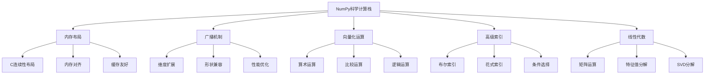

# 5.2.2 NumPy科学计算精要

## 🎯 核心理念

NumPy是Python科学计算的"数字计算的引擎"。理解其内部架构和优化机制，能让我们写出高性能的数值计算代码，实现从CPU级别的优化到算法级别的加速。

### 🌟 NumPy科学计算架构



## 🚀 NumPy深度技术

### 💡 内存与性能优化

```python
import numpy as np
import time
import psutil
import memory_profiler
from memory_profiler import profile

class NumPyPerformanceOptimization:
    """NumPy性能优化技术"""
    
    @staticmethod
    def memory_layout_analysis():
        """内存布局分析"""
        
        print("💾 NumPy内存布局深度分析:")
        
        # ✅ 数组内存布局
        def analyze_memory_layout():
            """分析内存布局"""
            
            # 不同创建方式的数组
            arrays = {
                'arange': np.arange(1000000),
                'zeros': np.zeros(1000000),
                'ones': np.ones(1000000),
                'random': np.random.rand(1000000),
                'list': np.array(list(range(1000000)))
            }
            
            print("数组内存使用分析:")
            for name, arr in arrays.items():
                memory_mb = arr.nbytes / 1024 / 1024
                print(f"{name:10}: {memory_mb:.2f}MB, 类型: {arr.dtype}")
            
            # 内存连续性
            print("\n内存连续性检查:")
            for name, arr in arrays.items():
                is_c_contiguous = arr.flags.c_contiguous
                is_f_contiguous = arr.flags.f_contiguous
                print(f"{name:10}: C连续={is_c_contiguous}, F连续={is_f_contiguous}")
        
        # ✅ 缓存友好的计算
        def cache_friendly_computation():
            """缓存友好计算"""
            
            # 创建测试数据
            size = 5000
            arr_c_contiguous = np.random.rand(size, size, dtype=np.float32)  # C顺序
            arr_f_contiguous = np.asfortranarray(arr_c_contiguous)  # Fortran顺序
            
            print("\n缓存性能对比:")
            
            # 行优先访问（C顺序友好）
            def row_major_sum(arr):
                total = 0.0
                for i in range(arr.shape[0]):
                    for j in range(arr.shape[1]):
                        total += arr[i, j]
                return total
            
            # 列优先访问（Fortran顺序友好）
            def column_major_sum(arr):
                total = 0.0
                for j in range(arr.shape[1]):
                    for i in range(arr.shape[0]):
                        total += arr[i, j]
                return total
            
            # 测试C顺序数组的行优先访问
            start_time = time.perf_counter()
            result = row_major_sum(arr_c_contiguous)
            c_time = time.perf_counter() - start_time
            print(f"C顺序数组行优先访问: {c_time:.4f}秒")
            
            # 测试C顺序数组的列优先访问
            start_time = time.perf_counter()
            result = column_major_sum(arr_c_contiguous)
            c_col_time = time.perf_counter() - start_time
            print(f"C顺序数组列优先访问: {c_col_time:.4f}秒")
            
            # 测试Fortran顺序数组的列优先访问
            start_time = time.perf_counter()
            result = column_major_sum(arr_f_contiguous)
            f_time = time.perf_counter() - start_time
            print(f"Fortran顺序数组列优先访问: {f_time:.4f}秒")
            
            print(f"性能差异: 列访问比行访问慢 {c_col_time/c_time:.1f}倍")
        
        analyze_memory_layout()
        cache_friendly_computation()
    
    @staticmethod
    def vectorization_mastery():
        """向量化技术精通"""
        
        print("\n⚡ NumPy向量化技术:")
        
        # ✅ 数值计算向量化
        def numerical_computation_vectorization():
            """数值计算向量化"""
            
            # 创建测试数据
            x = np.linspace(0, 10, 1000000)
            
            # 标量计算（慢）
            def scalar_computation():
                result = []
                for val in x:
                    result.append(np.sin(val) * np.cos(val) + val**2)
                return np.array(result)
            
            # 向量化计算（快）
            def vectorized_computation():
                return np.sin(x) * np.cos(x) + x**2
            
            # 性能测试
            print("数值计算向量化对比:")
            
            start_time = time.perf_counter()
            scalar_result = scalar_computation()
            scalar_time = time.perf_counter() - start_time
            
            start_time = time.perf_counter()
            vectorized_result = vectorized_computation()
            vectorized_time = time.perf_counter() - start_time
            
            print(f"标量计算耗时: {scalar_time:.4f}秒")
            print(f"向量化计算耗时: {vectorized_time:.4f}秒")
            print(f"向量化加速比: {scalar_time/vectorized_time:.1f}倍")
            
            # 验证结果一致性
            print(f"结果一致性: {np.allclose(scalar_result, vectorized_result)}")
        
        # ✅ 条件逻辑向量化
        def conditional_logic_vectorization():
            """条件逻辑向量化"""
            
            # 传统方法：条件循环
            def traditional_conditional(arr):
                result = np.zeros_like(arr)
                for i, val in enumerate(arr):
                    if val > 0.5:
                        result[i] = val * 2
                    else:
                        result[i] = val * 0.5
                return result
            
            # NumPy方法：向量化条件
            def vectorized_conditional(arr):
                """使用np.where进行条件向量化"""
                return np.where(arr > 0.5, arr * 2, arr * 0.5)
            
            # 另一种：使用布尔数组
            def boolean_mask_conditional(arr):
                """使用布尔掩码"""
                result = arr.copy()
                mask = arr > 0.5
                result[mask] *= 2
                result[~mask] *= 0.5
                return result
            
            # 测试数据
            test_data = np.random.rand(1000000)
            
            print("\n条件逻辑向量化对比:")
            
            # 方法1：传统循环
            start_time = time.perf_counter()
            result1 = traditional_conditional(test_data)
            time1 = time.perf_counter() - start_time
            
            # 方法2：np.where
            start_time = time.perf_counter()
            result2 = vectorized_conditional(test_data)
            time2 = time.perf_counter() - start_time
            
            # 方法3：布尔掩码
            start_time = time.perf_counter()
            result3 = boolean_mask_conditional(test_data)
            time3 = time.perf_counter() - start_time
            
            print(f"传统循环方法: {time1:.4f}秒")
            print(f"np.where方法: {time2:.4f}秒")
            print(f"布尔掩码方法: {time3:.4f}秒")
            print(f"最快的加速比: {time1/min(time2, time3):.1f}倍")
        
        numerical_computation_vectorization()
        conditional_logic_vectorization()
    
    @staticmethod
    def advanced_indexing():
        """高级索引技术"""
        
        print("\n🎯 高级索引技术:")
        
        # ✅ 多维高级索引
        def multidimensional_advanced_indexing():
            """多维高级索引"""
            
            # 创建三维测试数据
            cube = np.random.randint(0, 10, (4, 5, 6))
            print(f"原始数据形状: {cube.shape}")
            print(f"原始数据:\n{cube}")
            
            # 布尔索引
            print("\n1. 布尔索引:")
            bool_mask = cube > 5
            high_values = cube[bool_mask]
            print(f"大于5的值: {high_values}")
            
            # 条件式布尔索引
            condition_mask = (cube >= 3) & (cube <= 7)
            middle_values = cube[condition_mask]
            print(f"3-7之间的值: {middle_values}")
            
            # 花式索引
            print("\n2. 花式索引:")
            fancy_rows = cube[[0, 2, 3]]  # 选择第0、2、3行
            print(f"选择行的形状: {fancy_rows.shape}")
            
            fancy_elems = cube[[0, 2, 3], [1, 2, 0], [2, 3, 1]]  # 多维花式索引
            print(f"多维花式索引结果: {fancy_elems}")
            
            # 坐标索引
            print("\n3. 坐标索引:")
            x_coords = np.array([0, 1, 2, 3])
            y_coords = np.array([1, 2, 3, 0])
            z_coords = np.array([2, 3, 4, 1])
            
            coordinated_values = cube[x_coords, y_coords, z_coords]
            print(f"坐标索引结果: {coordinated_values}")
            
            # 混合索引
            print("\n4. 混合索引:")
            mixed_result = cube[1:3, [0, 2, 4], 2:4]  # 切片 + 花式索引 + 切片
            print(f"混合索引结果形状: {mixed_result.shape}")
        
        # ✅ 索引性能优化
        def indexing_performance_optimization():
            """索引性能优化"""
            
            # 大型数组
            large_array = np.random.rand(10000, 10000)
            
            print("\n索引性能对比:")
            
            # 传统索引（慢）
            def traditional_indexing(arr):
                result = []
                for i in range(0, len(arr), 1000):
                    result.append(arr[i])
                return np.array(result)
            
            # 切片索引（快）
            def slice_indexing(arr):
                return arr[::1000]
            
            # 花式索引（快）
            def fancy_indexing(arr):
                indices = np.arange(0, len(arr), 1000)
                return arr[indices]
            
            # 性能测试
            start_time = time.perf_counter()
            result1 = traditional_indexing(large_array)
            time1 = time.perf_counter() - start_time
            
            start_time = time.perf_counter()
            result2 = slice_indexing(large_array)
            time2 = time.perf_counter() - start_time
            
            start_time = time.perf_counter()
            result3 = fancy_indexing(large_array)
            time3 = time.perf_counter() - start_time
            
            print(f"传统循环索引: {time1:.4f}秒")
            print(f"切片索引: {time2:.4f}秒")
            print(f"花式索引: {time3:.4f}秒")
            print(f"最快方法加速: {time1/min(time2, time3):.1f}倍")
        
        multidimensional_advanced_indexing()
        indexing_performance_optimization()

# ✅ 线性代数实战
class NumPyLinearAlgebra:
    """NumPy线性代数实战"""
    
    @staticmethod
    def matrix_computations():
        """矩阵计算实战"""
        
        print("\n🔢 线性代数矩阵计算:")
        
        # ✅ 基本矩阵运算
        def basic_matrix_operations():
            """基本矩阵运算"""
            
            # 创建测试矩阵
            A = np.random.rand(5, 5)
            B = np.random.rand(5, 5)
            C = np.random.rand(5, 3)
            
            print("基本矩阵运算:")
            
            # 矩阵乘法
            AB = A @ B  # 现代NumPy语法
            AB_old = np.dot(A, B)  # 传统语法
            print(f"矩阵乘法一致性: {np.allclose(AB, AB_old)}")
            
            # 矩阵幂
            A_squared = A @ A
            A_power = np.linalg.matrix_power(A, 2)
            print(f"矩阵幂一致性: {np.allclose(A_squared, A_power)}")
            
            # 外积
            outer_product = np.outer(A[:, 0], B[0, :])
            print(f"外积形状: {outer_product.shape}")
            
            # Kronecker积
            kron_product = np.kron(A[:2, :2], B[:2, :2])
            print(f"Kronecker积形状: {kron_product.shape}")
        
        # ✅ 特征值分解
        def eigenvalue_decomposition():
            """特征值分解"""
            
            # 创建对称正定矩阵
            np.random.seed(42)
            A = np.random.rand(4, 4)
            A = A @ A.T  # 确保对称
            A = A + np.eye(4) * 0.1  # 确保正定
            
            print("\n特征值分解:")
            
            # 计算特征值和特征向量
            eigenvals, eigenvecs = np.linalg.eigh(A)
            
            print(f"特征值: {eigenvals}")
            print(f"特征向量形状: {eigenvecs.shape}")
            
            # 验证分解
            reconstructed_A = eigenvecs @ np.diag(eigenvals) @ eigenvecs.T
            print(f"重建精度: {np.allclose(A, reconstructed_A, rtol=1e-10)}")
            
            # 特征值排序
            sorted_indices = np.argsort(eigenvals)[::-1]
            print(f"排序后特征值: {eigenvals[sorted_indices]}")
        
        # ✅ SVD分解
        def svd_decomposition():
            """SVD奇异值分解"""
            
            # 创建非方阵矩阵
            M = np.random.rand(6, 4)
            
            print("\nSVD奇异值分解:")
            
            # 完整SVD
            U, s, Vt = np.linalg.svd(M, full_matrices=True)
            print(f"U形状: {U.shape}, s形状: {s.shape}, Vt形状: {Vt.shape}")
            
            # 经济SVD
            U_econ, s_econ, Vt_econ = np.linalg.svd(M, full_matrices=False)
            print(f"经济SVD形状: U{U_econ.shape}, s{s_econ.shape}, Vt{Vt_econ.shape}")
            
            # 验证分解
            Sigma = np.zeros((M.shape[0], M.shape[1]))
            Sigma[:len(s), :len(s)] = np.diag(s)
            reconstructed_M = U @ Sigma @ Vt
            
            print(f"SVD重建精度: {np.allclose(M, reconstructed_M, rtol=1e-10)}")
            
            # 低秩近似
            def low_rank_approximation(M, rank):
                U, s, Vt = np.linalg.svd(M, full_matrices=False)
                U_k = U[:, :rank]
                s_k = s[:rank]
                Vt_k = Vt[:rank, :]
                return U_k @ np.diag(s_k) @ Vt_k
            
            rank_2_approx = low_rank_approximation(M, 2)
            print(f"2秩近似精度: {np.linalg.norm(M - rank_2_approx):.4f}")
        
        basic_matrix_operations()
        eigenvalue_decomposition()
        svd_decomposition()
    
    @staticmethod
    def linear_systems():
        """线性系统求解"""
        
        print("\n📐 线性系统求解:")
        
        # ✅ 线性方程组求解
        def linear_system_solving():
            """线性方程组求解"""
            
            # 创建线性方程组 Ax = b
            np.random.seed(42)
            A = np.random.rand(4, 4)
            x_true = np.random.rand(4)
            b = A @ x_true
            
            print("线性方程组求解:")
            print(f"真实解: {x_true}")
            
            # 方法1：直接求解
            x_direct = np.linalg.solve(A, b)
            print(f"直接解: {x_direct}")
            print(f"解的精度: {np.allclose(x_true, x_direct, rtol=1e-10)}")
            
            # 方法2：最小二乘解
            x_lstsq = np.linalg.lstsq(A, b, rcond=None)[0]
            print(f"最小二乘解: {x_lstsq}")
            
            # 条件数分析
            cond_num = np.linalg.cond(A)
            print(f"矩阵条件数: {cond_num:.2e}")
            
            if cond_num > 1e12:
                print("警告: 矩阵条件数过大，可能数值不稳定")
        
        # ✅ 最小二乘问题
        def least_squares_problems():
            """最小二乘问题"""
            
            # 创建过定线性系统
            A = np.random.rand(10, 5)  # 10个方程，5个未知数
            x_true = np.random.rand(5)
            b = A @ x_true + np.random.randn(10) * 0.1  # 添加噪声
            
            print("\n最小二乘问题:")
            
            # 正规方程求解
            ATA = A.T @ A
            ATb = A.T @ b
            x_normal = np.linalg.solve(ATA, ATb)
            
            # SVD求解
            U, s, Vt = np.linalg.svd(A)
            x_svd = Vt.T @ np.diag(1./s) @ U.T @ b
            
            # NumPy lstsq求解
            x_lstsq, residuals, rank, s_values = np.linalg.lstsq(A, b, rcond=None)
            
            print(f"真实解: {x_true}")
            print(f"正规方程解: {x_lstsq}")
            print(f"SVD解: {x_svd}")
            print(f"残差范数: {np.linalg.norm(A @ x_lstsq - b):.6f}")
        
        linear_system_solving()
        least_squares_problems()

# ✅ 统计计算
class NumPyStatisticsComputing:
    """NumPy统计计算"""
    
    @staticmethod
    def advanced_statistics():
        """高级统计计算"""
        
        print("\n📊 NumPy高级统计计算:")
        
        # ✅ 协方差和相关性
        def covariance_and_correlation():
            """协方差和相关性分析"""
            
            # 创建多变量数据集
            np.random.seed(42)
            n_samples = 1000
            X = np.random.multivariate_normal([0, 0], [[4, 2], [2, 1]], n_samples)
            
            print("协方差和相关性分析:")
            
            # 计算协方差矩阵
            cov_matrix = np.cov(X.T)
            print(f"协方差矩阵:\n{cov_matrix}")
            
            # 计算相关系数矩阵
            corr_matrix = np.corrcoef(X.T)
            print(f"相关系数矩阵:\n{corr_matrix}")
            
            # 单变量统计分析
            print("\n单变量统计:")
            for i, var_name in enumerate(['变量1', '变量2']):
                mean_val = np.mean(X[:, i])
                std_val = np.std(X[:, i])
                var_val = np.var(X[:, i])
                print(f"{var_name}: 均值={mean_val:.3f}, 标准差={std_val:.3f}, 方差={var_val:.3f}")
        
        # ✅ 分位数和分布
        def quantiles_and_distributions():
            """分位数和分布分析"""
            
            # 创建不同分布的数据
            normal_data = np.random.normal(0, 1, 10000)
            uniform_data = np.random.uniform(-2, 2, 10000)
            exponential_data = np.random.exponential(1, 10000)
            
            print("\n分位数和分布分析:")
            
            datasets = {
                '正态分布': normal_data,
                '均匀分布': uniform_data,
                '指数分布': exponential_data
            }
            
            for name, data in datasets.items():
                # 计算各种分位数
                q25 = np.percentile(data, 25)
                q50 = np.percentile(data, 50)  # 中位数
                q75 = np.percentile(data, 75)
                
                # 计算IQR
                iqr = q75 - q25
                
                print(f"{name:10}: Q25={q25:.3f}, 中位数={q50:.3f}, Q75={q75:.3f}, IQR={iqr:.3f}")
        
        # ✅ 假设检验
        def hypothesis_testing():
            """假设检验（简化版）"""
            
            print("\n假设检验:")
            
            # 创建两组样本
            np.random.seed(42)
            group1 = np.random.normal(100, 15, 100)
            group2 = np.random.normal(105, 15, 100)
            
            # t检验（简化版）
            def simple_ttest(group1, group2):
                n1, n2 = len(group1), len(group2)
                mean1, mean2 = np.mean(group1), np.mean(group2)
                var1, var2 = np.var(group1, ddof=1), np.var(group2, ddof=1)
                
                # 合并标准差
                pooled_std = np.sqrt(((n1-1)*var1 + (n2-1)*var2) / (n1+n2-2))
                
                # t统计量
                t_stat = (mean1 - mean2) / (pooled_std * np.sqrt(1/n1 + 1/n2))
                
                return t_stat
            
            t_statistic = simple_ttest(group1, group2)
            print(f"t统计量: {t_statistic:.4f}")
            print(f"两组均值差异: {np.mean(group1) - np.mean(group2):.3f}")
        
        covariance_and_correlation()
        quantiles_and_distributions()
        hypothesis_testing()

# 运行所有示例
print("🚀 NumPy科学计算深度实战:")
NumPyPerformanceOptimization.memory_layout_analysis()
NumPyPerformanceOptimization.vectorization_mastery()
NumPyPerformanceOptimization.advanced_indexing()
NumPyLinearAlgebra.matrix_computations()
NumPyLinearAlgebra.linear_systems()
NumPyStatisticsComputing.advanced_statistics()

## 🧪 NumPy实战练习

### 📝 练习1：高性能图像处理

**任务**：使用NumPy实现基础图像处理算法

```python
# ✅ 图像处理算法
class NumPyImageProcessing:
    """NumPy图像处理"""
    
    @staticmethod
    def basic_image_operations():
        """基础图像操作"""
        
        # 创建模拟图像数据
        height, width = 512, 512
        image = np.random.randint(0, 256, (height, width), dtype=np.uint8)
        
        print("基础图像操作:")
        print(f"图像形状: {image.shape}")
        print(f"数据类型: {image.dtype}")
        print(f"像素值范围: {image.min()} - {image.max()}")
        
        # 灰度转换权重
        def grayscale_conversion(rgb_image):
            """灰度转换（加权平均）"""
            weights = np.array([0.299, 0.587, 0.114])
            return np.dot(rgb_image, weights)
        
        # 边缘检测（Sobel算子）
        def sobel_edge_detection(image):
            """Sobel边缘检测"""
            # Sobel卷积核
            sobel_x = np.array([[-1, 0, 1], [-2, 0, 2], [-1, 0, 1]])
            sobel_y = np.array([[-1, -2, -1], [0, 0, 0], [1, 2, 1]])
            
            # 转换为浮点数进行卷积
            img_float = image.astype(np.float32)
            
            # 边缘检测（简化版）
            gradient_x = np.zeros_like(img_float)
            gradient_y = np.zeros_like(img_float)
            
            # 手动卷积实现
            for i in range(1, image.shape[0]-1):
                for j in range(1, image.shape[1]-1):
                    # X方向梯度
                    gradient_x[i, j] = np.sum(sobel_x * img_float[i-1:i+2, j-1:j+2])
                    # Y方向梯度
                    gradient_y[i, j] = np.sum(sobel_y * img_float[i-1:i+2, j-1:j+2])
            
            # 计算梯度幅值
            gradient_magnitude = np.sqrt(gradient_x**2 + gradient_y**2)
            
            return gradient_magnitude, gradient_x, gradient_y
        
        # 滤波操作
        def gaussian_blur(image, sigma=1.0):
            """高斯模糊（简化版）"""
            # 创建高斯核（简化版3x3）
            kernel = np.array([[1, 2, 1], [2, 4, 2], [1, 2, 1]], dtype=np.float32)
            kernel = kernel / kernel.sum()
            
            blurred = np.zeros_like(image, dtype=np.float32)
            
            for i in range(1, image.shape[0]-1):
                for j in range(1, image.shape[1]-1):
                    blurred[i, j] = np.sum(kernel * image[i-1:i+2, j-1:j+2])
            
            return blurred
        
        # 测试图像处理算法
        edge_mag, edge_x, edge_y = sobel_edge_detection(image)
        blurred_image = gaussian_blur(image)
        
        print(f"边缘检测完成，梯度幅值范围: {edge_mag.min():.2f} - {edge_mag.max():.2f}")
        print(f"高斯模糊完成，输出范围: {blurred_image.min():.2f} - {blurred_image.max():.2f}")
    
    @staticmethod
    def image_filters_optimized():
        """优化的图像滤波器"""
        
        def vectorized_gaussian_kernel(size, sigma):
            """向量化的高斯核生成"""
            ax = np.linspace(-(size-1)/2., (size-1)/2., size)
            xx, yy = np.meshgrid(ax, ax)
            kernel = np.exp(-0.5 * (xx**2 + yy**2) / sigma**2)
            return kernel / kernel.sum()
        
        def convolution_2d_vectorized(image, kernel):
            """向量化的2D卷积"""
            # 确保kernel是奇数尺寸
            pad_h = kernel.shape[0] // 2
            pad_w = kernel.shape[1] // 2
            
            # 边界填充
            padded = np.pad(image, ((pad_h, pad_h), (pad_w, pad_w)), mode='constant')
            
            view_shape = (image.shape[0], image.shape[1], 
                         kernel.shape[0], kernel.shape[1])
            strides = padded.strides + padded.strides
            
            patches = np.lib.stride_tricks.as_strided(padded, view_shape, strides)
            
            return np.sum(patches * kernel, axis=(2, 3))
        
        print("\n优化的图像滤波器:")
        
        # 创建测试图像
        test_image = np.random.randint(0, 256, (100, 100), dtype=np.uint8).astype(np.float32)
        
        # 生成高斯核
        gaussian_kernel = vectorized_gaussian_kernel(5, 1.4)
        
        # 应用高斯滤波
        filtered_image = convolution_2d_vectorized(test_image, gaussian_kernel)
        
        print(f"向量化滤波完成，输出形状: {filtered_image.shape}")
        print(f"滤波后数值范围: {filtered_image.min():.2f} - {filtered_image.max():.2f}")

# image_processor = NumPyImageProcessing()
# image_processor.basic_image_operations()
# image_processor.image_filters_optimized()
```

### 🎯 练习2：科学计算模拟

**任务**：实现蒙特卡罗数值积分

```python
# ✅ 蒙特卡罗数值积分
class MonteCarloSimulation:
    """蒙特卡罗模拟"""
    
    @staticmethod
    def monte_carlo_integration():
        """蒙特卡罗数值积分"""
        
        def integrate_function(func, bounds, n_samples):
            """蒙特卡罗积分主函数"""
            a, b = bounds
            # 均匀采样
            samples = np.random.uniform(a, b, n_samples)
            func_values = func(samples)
            
            # 蒙特卡罗估计
            integral_estimate = (b - a) * np.mean(func_values)
            error_estimate = (b - a) * np.std(func_values) / np.sqrt(n_samples)
            
            return integral_estimate, error_estimate
        
        # 测试函数
        def test_function(x):
            return np.sin(x) + np.cos(x)**2 + 0.1 * x
        
        # 积分的真实值（解析解，如果有的话）
        def analytical_integral(a, b):
            # 这里用数值积分作为"真实值"
            from scipy.integrate import quad
            result, _ = quad(test_function, a, b)
            return result
        
        print("蒙特卡罗数值积分:")
        
        # 积分区间
        bounds = (0, 2 * np.pi)
        true_value = analytical_integral(*bounds)
        
        # 不同样本数量的误差分析
        sample_sizes = [1000, 10000, 100000, 1000000]
        
        print(f"积分区间: {bounds}")
        print(f"解析解结果: {true_value:.8f}")
        print("\n蒙特卡罗结果:")
        
        for n_samples in sample_sizes:
            estimate, error = integrate_function(test_function, bounds, n_samples)
            relative_error = abs(estimate - true_value) / abs(true_value) * 100
            
            print(f"样本数 {n_samples:8d}: 估计值={estimate:.8f}, "
                  f"标准误差={error:.8f}, 相对误差={relative_error:.4f}%")
        
        # 收敛性分析
        print("\n收敛性分析:")
        
        def convergence_analysis():
            """收敛性分析"""
            n_samples_list = np.logspace(2, 6, 20).astype(int)
            estimates = []
            errors = []
            
            for n in n_samples_list:
                estimate, error = integrate_function(test_function, bounds, n)
                estimates.append(abs(estimate - true_value))
                errors.append(error)
            
            # 理论收敛：∝ 1/sqrt(N)
            theoretical_convergence = 1.0 / np.sqrt(n_samples_list)
            
            print("收敛性验证:")
            for i, n in enumerate([n_samples_list[0], n_samples_list[-1]]):
                idx = np.where(n_samples_list == n)[0][0]
                print(f"N={n}: 实际收敛≈{estimates[idx]:.2e}, "
                      f"理论收敛∝{theoretical_convergence[idx]:.2e}")
        
        convergence_analysis()

# mc_simulation = MonteCarloSimulation()
# mc_simulation.monte_carlo_integration()
```

## 🔗 知识连接

- **数据处理**：[[5.2.1 数据处理完整流程]] - 与Pandas的数据处理管道
- **可视化**：[[5.2.3 数据可视化]] - Matplotlib结合NumPy的可视化
- **性能优化**：[[5.5 性能调优与监控]] - NumPy的性能优化策略

## 💡 费曼检验

**解释：NumPy的速度优势从何而来？什么是向量化编程？如何编写高效的内存友好代码？**

核心要点：
1. **C语言实现**：核心计算用C语言编写
2. **连续内存**：数组元素在内存中连续存储
3. **向量化操作**：避免Python循环，使用SIMD指令
4. **广播机制**：自动处理不同形状数组的运算

---

🎯 **下个目标**：学习[[5.2.3 数据可视化]]中的专业图表制作技术
