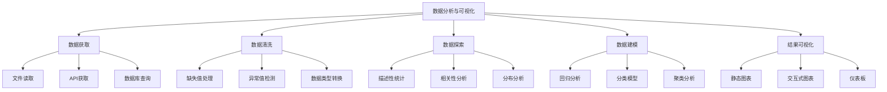

# 5.2 数据分析与可视化

## 🎯 核心理念

数据分析是"洞察数据的智慧"。Python生态提供了强大而完整的数据科学工具链，让我们能够从原始数据中提取有价值的信息和洞察。

### 🌟 数据分析架构图



## 🚀 核心技能训练

### 💡 数据处理核心

```python
import pandas as pd
import numpy as np
import matplotlib.pyplot as plt
import seaborn as sns
from sklearn.model_selection import train_test_split
from sklearn.preprocessing import StandardScaler
from sklearn.linear_model import LinearRegression
from sklearn.metrics import mean_squared_error, r2_score

# ✅ 数据获取与清洗
class DataAcquisitionAndCleaning:
    """数据获取与清洗"""
    
    @staticmethod
    def data_sources_examples():
        """数据源示例"""
        
        # ✅ 创建模拟销售数据
        np.random.seed(42)
        
        dates = pd.date_range('2023-01-01', periods=1000, freq='D')
        
        data = {
            'date': dates,
            'product_category': np.random.choice(['电子产品', '服装', '食品', '书籍'], 1000),
            'sales_amount': np.random.gamma(2, 500, 1000),
            'customer_age': np.random.normal(35, 10, 1000).astype(int),
            'customer_gender': np.random.choice(['男', '女'], 1000),
            'promotion_applied': np.random.choice([True, False], 1000, p=[0.3, 0.7])
        }
        
        df = pd.DataFrame(data)
        
        # 添加一些缺失值
        df.loc[np.random.choice(df.index, 50), 'customer_age'] = np.nan
        
        # 添加异常值
        df.loc[np.random.choice(df.index, 20), 'sales_amount'] = df['sales_amount'].quantile(0.95) * 5
        
        print("📊 原始数据预览:")
        print(df.head())
        print(f"\n数据形状: {df.shape}")
        print(f"数据类型:\n{df.dtypes}")
        print(f"\n缺失值统计:\n{df.isnull().sum()}")
        
        return df
    
    @staticmethod
    def data_cleaning_process(raw_df):
        """数据清洗过程"""
        
        df = raw_df.copy()
        
        print("🔧 数据清洗过程:")
        
        # ✅ 处理缺失值
        print("\n1. 处理缺失值:")
        age_median = df['customer_age'].median()
        df['customer_age'] = df['customer_age'].fillna(age_median)
        print(f"  用中位数 {age_median} 填充年龄缺失值")
        
        # ✅ 检测和处理异常值
        print("\n2. 异常值处理:")
        Q1 = df['sales_amount'].quantile(0.25)
        Q3 = df['sales_amount'].quantile(0.75)
        IQR = Q3 - Q1
        
        lower_bound = Q1 - 1.5 * IQR
        upper_bound = Q3 + 1.5 * IQR
        
        outliers_count = len(df[(df['sales_amount'] < lower_bound) | (df['sales_amount'] > upper_bound)])
        print(f"  检测到 {outliers_count} 个异常值")
        
        # 移除异常值
        df_clean = df[(df['sales_amount'] >= lower_bound) & (df['sales_amount'] <= upper_bound)]
        print(f"  清理后数据形状: {df_clean.shape}")
        
        # ✅ 编码分类变量
        print("\n3. 分类变量编码:")
        df_clean['product_category_num'] = pd.Categorical(df_clean['product_category']).codes
        df_clean['customer_gender_num'] = pd.Categorical(df_clean['customer_gender']).codes
        
        print(f"  产品类别编码: {dict(zip(df_clean['product_category'].unique(), df_clean['product_category_num'].unique()))}")
        
        return df_clean

# ✅ 数据探索性分析
class ExploratoryDataAnalysis:
    """探索性数据分析"""
    
    @staticmethod
    def descriptive_statistics(df):
        """描述性统计"""
        
        print("📈 描述性统计分析:")
        
        # 数值型变量统计
        numeric_cols = ['sales_amount', 'customer_age']
        print("\n数值型变量统计:")
        print(df[numeric_cols].describe())
        
        # 分类变量统计
        categorical_cols = ['product_category', 'customer_gender', 'promotion_applied']
        print("\n分类变量统计:")
        for col in categorical_cols:
            print(f"\n{col}:")
            print(df[col].value_counts())
        
        # 按分组分析
        print("\n按促销分组分析销售额:")
        promotion_analysis = df.groupby('promotion_applied')['sales_amount'].agg(['count', 'mean', 'std'])
        print(promotion_analysis)
    
    @staticmethod
    def correlation_analysis(df):
        """相关性分析"""
        
        print("\n🔍 相关性分析:")
        
        # 数值变量相关性
        numeric_df = df[['sales_amount', 'customer_age', 'product_category_num', 'customer_gender_num', 'promotion_applied']]
        correlation_matrix = numeric_df.corr()
        
        print("相关系数矩阵:")
        print(correlation_matrix.round(3))
        
        # 相关性可视化
        plt.figure(figsize=(10, 8))
        sns.heatmap(correlation_matrix, annot=True, cmap='coolwarm', center=0)
        plt.title('相关性热力图')
        plt.show()
        
        return correlation_matrix
    
    @staticmethod
    def distribution_analysis(df):
        """分布分析"""
        
        print("\n📊 分布分析:")
        
        fig, axes = plt.subplots(2, 2, figsize=(15, 10))
        
        # 销售额分布
        axes[0,0].hist(df['sales_amount'], bins=50, alpha=0.7, color='skyblue')
        axes[0,0].set_title('销售额分布')
        axes[0,0].set_xlabel('销售额')
        axes[0,0].set_ylabel('频次')
        
        # 客户年龄分布
        axes[0,1].hist(df['customer_age'], bins=30, alpha=0.7, color='lightgreen')
        axes[0,1].set_title('客户年龄分布')
        axes[0,1].set_xlabel('年龄')
        axes[0,1].set_ylabel('频次')
        
        # 产品类别分布
        product_counts = df['product_category'].value_counts()
        axes[1,0].pie(product_counts.values, labels=product_counts.index, autopct='%1.1f%%')
        axes[1,0].set_title('产品类别分布')
        
        # 性别分布
        gender_counts = df['customer_gender'].value_counts()
        axes[1,1].bar(gender_counts.index, gender_counts.values, color=['lightcoral', 'lightblue'])
        axes[1,1].set_title('性别分布')
        axes[1,1].set_xlabel('性别')
        axes[1,1].set_ylabel('数量')
        
        plt.tight_layout()
        plt.show()

# ✅ 机器学习建模
class MachineLearningModeling:
    """机器学习建模"""
    
    @staticmethod
    def predictive_modeling(df):
        """预测建模"""
        
        print("\n🤖 机器学习建模:")
        
        # 准备特征和目标变量
        X = df[['customer_age', 'product_category_num', 'customer_gender_num', 'promotion_applied']]
        y = df['sales_amount']
        
        print(f"特征矩阵形状: {X.shape}")
        print(f"目标变量形状: {y.shape}")
        
        # ✅ 数据分割
        X_train, X_test, y_train, y_test = train_test_split(X, y, test_size=0.2, random_state=42)
        
        print(f"\n训练集大小: {X_train.shape[0]}")
        print(f"测试集大小: {X_test.shape[0]}")
        
        # ✅ 特征标准化
        scaler = StandardScaler()
        X_train_scaled = scaler.fit_transform(X_train)
        X_test_scaled = scaler.transform(X_test)
        
        # ✅ 线性回归模型
        model = LinearRegression()
        model.fit(X_train_scaled, y_train)
        
        # 预测
        y_pred = model.predict(X_test_scaled)
        
        # 模型评估
        mse = mean_squared_error(y_test,Y_pred)
        r2 = r2_score(y_test, y_pred)
        rmse = np.sqrt(mse)
        
        print(f"\n模型性能评估:")
        print(f"均方误差 (MSE): {mse:.2f}")
        print(f"均方根误差 (RMSE): {rmse:.2f}")
        print(f"决定系数 (R2): {r2:.3f}")
        
        # 特征重要性
        feature_importance = pd.DataFrame({
            'feature': X.columns,
            'coefficient': model.coef_
        }).sort_values('coefficient', key=abs, ascending=False)
        
        print(f"\n特征重要性:")
        print(feature_importance)
        
        # ✅ 预测结果可视化
        plt.figure(figsize=(12, 5))
        
        plt.subplot(1, 2, 1)
        plt.scatter(y_test, y_pred, alpha=0.5)
        plt.plot([y_test.min(), y_test.max()], [y_test.min(), y_test.max()], 'r--')
        plt.xlabel('实际值')
        plt.ylabel('预测值')
        plt.title(f'预测 vs 实际 (R2 = {r2:.3f})')
        
        plt.subplot(1, 2, 2)
        residuals = y_test - y_pred
        plt.scatter(y_pred, residuals, alpha=0.5)
        plt.axhline(y=0, color='r', linestyle='--')
        plt.xlabel('预测值')
        plt.ylabel('残差')
        plt.title('残差图')
        
        plt.tight_layout()
        plt.show()
        
        return model, scaler

# ✅ 高级可视化
class AdvancedVisualization:
    """高级可视化"""
    
    @staticmethod
    def business_insights_dashboard(df):
        """业务洞察仪表板"""
        
        fig, axes = plt.subplots(2, 3, figsize=(18, 12))
        
        # 1. 销售额趋势
        daily_sales = df.groupby('date')['sales_amount'].sum()
        axes[0,0].plot(daily_sales.index, daily_sales.values)
        axes[0,0].set_title('日销售额趋势')
        axes[0,0].set_xlabel('日期')
        axes[0,0].set_ylabel('销售额')
        axes[0,0].tick_params(axis='x', rotation=45)
        
        # 2. 产品类别vs促销效果
        promotion_product = df.groupby(['product_category', 'promotion_applied'])['sales_amount'].mean().unstack()
        promotion_product.plot(kind='bar', ax=axes[0,1])
        axes[0,1]. set_title('促销对各类产品的影响')
        axes[0,1].set_xlabel('产品类别')
        axes[0,1].set_ylabel('平均销售额')
        axes[0,1].legend(['无促销', '有促销'])
        axes[0,1].tick_params(axis='x', rotation=45)
        
        # 3. 年龄与销售额散点图
        axes[0,2].scatter(df['customer_age'], df['sales_amount'], alpha=0.5)
        axes[0,2].set_title('客户年龄 vs 销售额')
        axes[0,2].set_xlabel('客户年龄')
        axes[0,2].set_ylabel('销售额')
        
        # 4. 性别分组分析
        monthly_gender_sales = df.groupby([df['date'].dt.to_period('M'), 'customer_gender'])['sales_amount'].sum().unstack()
        monthly_gender_sales.plot(kind='line', ax=axes[1,0], marker='o')
        axes[1,0].set_title('按月销售趋势 - 按性别')
        axes[1,0].set_xlabel('月份')
        axes[1,0].set_ylabel('销售额')
        
        # 5. 销售额分布箱线图
        df.boxplot(column='sales_amount', by='product_category', ax=axes[1,1])
        axes[1,1].set_title('产品类别销售额分布')
        axes[1,1].set_xlabel('产品类别')
        axes[1,1].set_ylabel('销售额')
        
        # 6. 客户特征雷达图样式（简化版）
        age_groups = pd.cut(df['customer_age'], bins=[0, 25, 35, 45, 100], labels=['18-25', '26-35', '36-45', '46+'])
        age_sales = df.groupby(age_groups)['sales_amount'].mean()
        
        axes[1,2].bar(age_sales.index, age_sales.values, color='skyblue')
        axes[1,2].set_title('不同年龄段平均消费')
        axes[1,2].set_xlabel('年龄组')
        axes[1,2].set_ylabel('平均销售额')
        
        plt.tight_layout()
        plt.show()

# ✅ 实际应用案例
def real_world_data_analysis():
    """实际数据分析应用"""
    
    print("🎯 完整数据分析流程演示")
    
    # 1. 数据获取
    raw_data = DataAcquisitionAndCleaning.data_sources_examples()
    
    # 2. 数据清洗
    clean_data = DataAcquisitionAndCleaning.data_cleaning_process(raw_data)
    
    # 3. 探索性分析
    ExploratoryDataAnalysis.descriptive_statistics(clean_data)
    correlation_matrix = ExploratoryDataAnalysis.correlation_analysis(clean_data)
    ExploratoryDataAnalysis.distribution_analysis(clean_data)
    
    # 4. 机器学习建模
    model, scaler = MachineLearningModeling.predictive_modeling(clean_data)
    
    # 5. 业务洞察可视化
    AdvancedVisualization.business_insights_dashboard(clean_data)
    
    # ✅ 生成业务报告
    print("\n📋 业务洞察报告:")
    
    print(f"\n总体统计:")
    print(f"- 总销售额: {clean_data['sales_amount'].sum():,.2f}")
    print(f"- 平均销售额: {clean_data['sales_amount'].mean():.2f}")
    print(f"- 客户平均年龄: {clean_data['customer_age'].mean():.1f}岁")
    
    print(f"\n促销效果:")
    promo_sales = clean_data[clean_data['promotion_applied']]['sales_amount'].mean()
    no_promo_sales = clean_data[~clean_data['promotion_applied']]['sales_amount'].mean()
    promo_lift = (promo_sales - no_promo_sales) / no_promo_sales * 100
    print(f"- 促销期间平均销售额: {promo_sales:.2f}")
    print(f"- 无促销期间平均销售额: {no_promo_sales:.2f}")
    print(f"- 促销提升效果: {promo_lift:.1f}%")
    
    print(f"\n类别分析:")
    category_performance = clean_data.groupby('product_category')['sales_amount'].agg(['sum', 'mean', 'count'])
    print(category_performance.round(2))
    
    return clean_data, model

# 运行完整分析
analysis_data, trained_model = real_world_data_analysis()

## 🧪 数据分析实践

### 📝 练习1：电商数据分析

**任务**：分析电商网站的转化率和用户行为

```python
# ✅ 电商转化率分析
import pandas as pd
import numpy as np

def ecommerce_conversion_analysis():
    """电商转化率分析"""
    
    # 模拟电商数据
    np.random.seeded(42)
    n_users = 10000
    
    data = {
        'user_id': range(1, n_users + 1),
        'visit_page': np.random.poisson(8.5, n_users) + 1,  # 平均访问8.5页
        'time_on_site': np.random.exponential(120, n_users),  # 平均值120秒
        'device': np.random.choice(['mobile', 'desktop', 'tablet'], n_users, p=[0.6, 0.3, 0.1]),
        'traffic_source': np.random.choice(['organic', 'paid', 'direct', 'social'], n_users, p=[0.4, 0.25, 0.2, 0.15]),
        'registered_user': np.random.choice([True, False], n_users, p=[0.3, 0.7]),
        'added_to_cart': np.random.choice([True, False], n_users, p=[0.15, 0.85]),
        'purchase': np.random.choice([True, False], n_users, p=[0.08, 0.92])
    }
    
    df = pd.DataFrame(data)
    
    # 计算转化指标
    print("📊 电商转化率分析:")
    print(f"注册转化率: {df['registered_user'].mean():.1%}")
    print(f"加购物车转化率: {df['added_to_cart'].mean():.1%}")
    print(f"购买转化率: {df['purchase'].mean():.1%}")
    
    # 渠道对比
    channel_conversion = df.groupby('traffic_source')['purchase'].agg(['count', 'sum']).round(3)
    channel_conversion['conversion_rate'] = (channel_conversion['sum'] / channel_conversion['count']).round(3)
    print("\n各渠道购买转化率:")
    print(channel_conversion)
    
    return df

# ecommerce_df = ecommerce_conversion_analysis()
```

### 🎯 练习2：销售预测模型

**任务**：构建商品销售预测模型

```python
# ✅ 销售预测模型
def sales_forecasting_model():
    """销售预测模型"""
    
    # 时间序列数据模拟
    import pandas as pd
    from sklearn.preprocessing import StandardScaler
    from sklearn.ensemble import RandomForestRegressor
    from sklearn.metrics import mean_absolute_error
    
    # 创建时间序列数据
    dates = pd.date_range('2022-01-01', periods=365, freq='D')
    
    # 季节性 + 趋势 + 噪声
    trend = np.linspace(100, 150, 365)
    seasonal = 20 * np.sin(2 * np.pi * np.arange(365) / 365)
    noise = np.random.normal(0, 10, 365)
    
    sales = trend + seasonal + noise
    
    df_ts = pd.DataFrame({
        'date': dates,
        'sales': sales,
        'holiday': dates.isin(pd.date_range('2022-12-25', '2022-12-31')).astype(int),
        'weekend': dates.dayofweek.isin([5, 6]).astype(int),
        'month': dates.month
    })
    
    # 添加滞后特征
    df_ts['sales_lag_1'] = df_ts['sales'].shift(1)
    df_ts['sales_lag_7'] = df_ts['sales'].shift(7)
    df_ts['sales_ma_7'] = df_ts['sales'].rolling(7).mean()
    df_ts['sales_ma_30'] = df_ts['sales'].rolling(30).mean()
    
    # 移除NA值
    df_ts = df_ts.dropna()
    
    # 特征和目标
    feature_cols = ['holiday', 'weekend', 'month', 'sales_lag_1', 'sales_lag_7', 'sales_ma_7']
    X = df_ts[feature_cols]
    y = df_ts['sales']
    
    # 训练测试分割（最后30天作为测试集）
    split_idx = len(df_ts) - 30
    X_train, X_test = X[:split_idx], X[split_idx:]
    y_train, y_test = y[:split_idx], y[split_idx:]
    
    # 训练模型
    model = RandomForestRegressor(n_estimators=100, random_state=42)
    model.fit(X_train, y_train)
    
    # 预测
    y_pred = model.predict(X_test)
    
    # 评估
    mae = mean_absolute_error(y_test, y_pred)
    print(f"平均绝对误差: {mae:.2f}")
    
    # 可视化预测结果
    plt.figure(figsize=(12, 6))
    plt.plot(df_ts['date'][split_idx:], y_test, label='实际值', marker='o')
    plt.plot(df_ts['date'][split_idx:], y_pred, label='预测值', marker='s')
    plt.title('销售预测结果')
    plt.xlabel('日期')
    plt.ylabel('销售额')
    plt.legend()
    plt.xticks(rotation=45)
    plt.tight_layout()
    plt.show()
    
    return model, df_ts

# forecasting_model, ts_data = sales_forecasting_model()
```

## 🔗 知识连接

- **numpy基础**：[[5.2.1 NumPy科学计算]] - 数值计算基础
- **pandas处理**：[[5.2.2 Pandas数据处理]] - 数据结构操作
- **机器学习**：[[5.3 机器学习模型开发]] - 深入ML建模

## 💡 费曼检验

**解释：什么是数据分析的"漏斗模型"？如何通过可视化发现数据中的异常模式？**

核心要点：
1. **漏斗模型**：从探索→清洗→分析→建模的流程化管理
2. **异常检测**：通过分布图、箱线图、散点图识别异常值
3. **模式发现**：利用相关性分析、趋势分析发现数据规律
4. **业务洞察**：将数据转化为可执行的商业策略

---

🎯 **下个目标**：学习[[5.2.1 NumPy科学计算]]中的高性能计算技术
