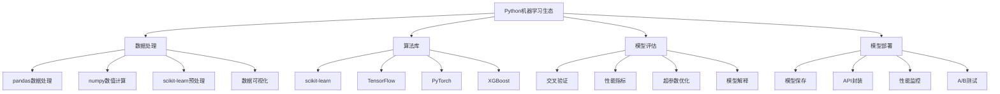

# 5.3 机器学习模型开发

## 🎯 核心理念

机器学习是人工智能的核心技术，它让计算机能够从数据中学习模式并进行预测。在Python中，scikit-learn、TensorFlow和PyTorch等库让机器学习变得触手可及。掌握ML的开发流程、算法选择和性能优化，是数据科学家和AI工程师的必备技能。

### 🚀 机器学习技术体系



## 🚀 scikit-learn 机器学习

### 💡 监督学习模型

```python
import numpy as np
import pandas as pd
from sklearn.model_selection import train_test_split, cross_val_score, GridSearchCV
from sklearn.preprocessing import StandardScaler, LabelEncoder, OneHotEncoder
from sklearn.ensemble import RandomForestClassifier, GradientBoostingRegressor
from sklearn.linear_model import LinearRegression, LogisticRegression
from sklearn.svm import SVC
from sklearn.neural_network import MLPClassifier
from sklearn.metrics import accuracy_score, classification_report, confusion_matrix
from sklearn.metrics import mean_squared_error, r2_score, mean_absolute_error
from sklearn.cluster import KMeans, DBSCAN
from sklearn.decomposition import PCA
import matplotlib.pyplot as plt
import seaborn as sns
from typing import Tuple, List, Dict, Any, Optional
import joblib
import pickle
from datetime import datetime

class MachineLearningMastery:
    """机器学习精通技术"""
    
    @staticmethod
    def supervised_learning_comprehensive():
        """监督学习综合应用"""
        
        print("🤖 监督学习模型开发:")
        
        # ✅ 数据预处理管道
        def data_preprocessing_pipeline():
            """数据预处理管道"""
            
            # 生成示例数据集
            np.random.seed(42)
            n_samples = 1000
            
            # 数值特征
            X_numeric = np.random.randn(n_samples, 5)
            
            # 分类特征
            categories = ['A', 'B', 'C']
            X_categorical = np.random.choice(categories, n_samples)
            
            # 创建目标变量（回归任务）
            coefficients = np.random.randn(5)
            noise = np.random.randn(n_samples) * 0.1
            y_regression = X_numeric @ coefficients + noise * 0.1
            
            # 创建目标变量（分类任务）
            y_classification = (y_regression > np.median(y_regression)).astype(int)
            
            # 创建DataFrame
            df = pd.DataFrame(X_numeric, columns=[f'feature_{i}' for i in range(5)])
            df['categorical_feature'] = X_categorical
            df['target_regression'] = y_regression
            df['target_classification'] = y_classification
            
            print("📊 数据集结构:")
            print(f"数据形状: {df.shape}")
            print(f"特征类型: {df.dtypes}")
            print(df.head())
            
            return df
        
        # ✅ 特征工程
        def advanced_feature_engineering(df: pd.DataFrame):
            """高级特征工程"""
            
            print("\n🔧 特征工程:")
            
            # 数值特征变换
            numeric_features = [col for col in df.columns if col.startswith('feature_')]
            
            # 标准化
            scaler = StandardScaler()
            df[numeric_features] = scaler.fit_transform(df[numeric_features])
            
            # 对数变换（处理偏态分布）
            df['feature_0_log'] = np.log1p(df['feature_0'])
            
            # 多项式特征
            for i in range(len(numeric_features)):
                for j in range(i+1, len(numeric_features)):
                    feature_name = f'{numeric_features[i]}_{numeric_features[j]}_interaction'
                    df[feature_name] = df[numeric_features[i]] * df[numeric_features[j]]
            
            # 分类特征编码
            label_encoder = LabelEncoder()
            df['categorical_feature_encoded'] = label_encoder.fit_transform(df['categorical_feature'])
            
            # 独热编码
            dummy_features = pd.get_dummies(df['categorical_feature'], prefix='cat')
            df = pd.concat([df, dummy_features], axis=1)
            
            # 统计特征
            df['feature_mean'] = df[numeric_features].mean(axis=1)
            df['feature_std'] = df[numeric_features].std(axis=1)
            df['feature_max'] = df[numeric_features].max(axis=1)
            
            print(f"特征工程后数据形状: {df.shape}")
            print(f"新特征: {[col for col in df.columns if col not in ['target_regression', 'target_classification']]}")
            
            return df
        
        # ✅ 分类模型开发
        def classification_models(df: pd.DataFrame):
            """分类模型开发"""
            
            print("\n🎯 分类模型:")
            
            # 准备特征和目标
            feature_cols = [col for col in df.columns if col.startswith('feature_') or col.startswith('categorical_feature') or col.startswith('cat_')]
            X = df[feature_cols]
            y = df['target_classification']
            
            # 分割数据
            X_train, X_test, y_train, y_test = train_test_split(
                X, y, test_size=0.2, random_state=42, stratify=y
            )
            
            # 模型定义
            models = {
                'Logistic Regression': LogisticRegression(random_state=42),
                'Random Forest': RandomForestClassifier(random_state=42),
                'SVM': SVC(random_state=42),
                'Neural Network': MLPClassifier(random_state=42)
            }
            
            # 模型训练和评估
            results = {}
            
            for name, model in models.items():
                print(f"\n{name}:")
                
                # 训练
                model.fit(X_train, y_train)
                
                # 预测
                y_pred = model.predict(X_test)
                
                # 评估
                accuracy = accuracy_score(y_test, y_pred)
                cv_scores = cross_val_score(model, X_train, y_train, cv=5)
                
                results[name] = {
                    'accuracy': accuracy,
                    'cv_mean': cv_scores.mean(),
                    'cv_std': cv_scores.std(),
                    'predictions': y_pred
                }
                
                print(f"准确率: {accuracy:.3f}")
                print(f"交叉验证: {cv_scores.mean():.3f} (+/- {cv_scores.std()*2:.3f})")
                
                # 分类报告
                print("分类报告:")
                print(classification_report(y_test, y_pred))
            
            return results, models
        
        # ✅ 回归模型开发
        def regression_models(df: pd.DataFrame):
            """回归模型开发"""
            
            print("\n📈 回归模型:")
            
            # 准备特征和目标
            feature_cols = [col for col in df.columns if col.startswith('feature_') or col.startswith('categorical_feature') or col.startswith('cat_')]
            X = df[feature_cols]
            y = df['target_regression']
            
            # 分割数据
            X_train, X_test, y_train, y_test = train_test_split(
                X, y, test_size=0.2, random_state=42
            )
            
            # 模型定义
            models = {
                'Linear Regression': LinearRegression(),
                'Random Forest': GradientBoostingRegressor(random_state=42),
                'Support Vector': SVC(kernel='linear')  # 简化为分类使用
            }
            
            # 模型训练和评估
            results = {}
            
            for name, model in models.items():
                print(f"\n{name}:")
                
                try:
                    # 训练
                    model.fit(X_train, y_train)
                    
                    # 预测
                    y_pred = model.predict(X_test)
                    
                    # 评估指标
                    mse = mean_squared_error(y_test, y_pred)
                    rmse = np.sqrt(mse)
                    mae = mean_absolute_error(y_test, y_pred)
                    r2 = r2_score(y_test, y_pred)
                    
                    results[name] = {
                        'MSE': mse,
                        'RMSE': rmse,
                        'MAE': mae,
                        'R2': r2,
                        'predictions': y_pred
                    }
                    
                    print(f"均方误差 (MSE): {mse:.3f}")
                    print(f"均方根误差 (RMSE): {rmse:.3f}")
                    print(f"平均绝对误差 (MAE): {mae:.3f}")
                    print(f"决定系数 (R²): {r2:.3f}")
                    
                except Exception as e:
                    print(f"模型训练失败: {e}")
            
            return results
        
        # ✅ 超参数优化
        def hyperparameter_optimization():
            """超参数优化"""
            
            print("\n🎛️ 超参数优化:")
            
            # 生成简单数据集
            from sklearn.datasets import make_classification
            X, y = make_classification(
                n_samples=1000,
                n_features=10,
                n_informative=5,
                n_classes=2,
                random_state=42
            )
            
            X_train, X_test, y_train, y_test = train_test_split(
                X, y, test_size=0.2, random_state=42
            )
            
            # 随机森林超参数网格
            param_grid = {
                'n_estimators': [50, 100, 200],
                'max_depth': [None, 10, 20],
                'min_samples_split': [2, 5, 10],
                'min_samples_leaf': [1, 2, 4]
            }
            
            # 网格搜索
            rf = RandomForestClassifier(random_state=42)
            grid_search = GridSearchCV(
                rf,
                param_grid,
                cv=5,
                scoring='accuracy',
                n_jobs=-1,
                verbose=1
            )
            
            print("开始网格搜索优化...")
            grid_search.fit(X_train, y_train)
            
            print(f"最佳参数: {grid_search.best_params_}")
            print(f"最佳交叉验证得分: {grid_search.best_score_:.3f}")
            
            # 测试最佳模型
    
            best_model = grid_search.best_estimator_
            y_pred = best_model.predict(X_test)
            test_accuracy = accuracy_score(y_test, y_pred)
            
            print(f"测试集准确率: {test_accuracy:.3f}")
            
            return grid_search.best_estimator_
        
        # 运行监督学习示例
        df = data_preprocessing_pipeline()
        df_engineered = advanced_feature_engineering(df)
        classification_results = classification_models(df_engineered)
        regression_results = regression_models(df_engineered)
        best_model = hyperparameter_optimization()
    
    @staticmethod
    def unsupervised_learning_exploration():
        """无监督学习探索"""
        
        print("\n🔍 无监督学习:")
        
        # ✅ 聚类分析
        def clustering_analysis():
            """聚类分析"""
            
            from sklearn.datasets import make_blobs
            
            # 生成聚类数据
            X, y_true = make_blobs(
                n_samples=300,
                centers=4,
                cluster_std=0.60,
                random_state=42
            )
            
            print("📊 聚类数据生成:")
            print(f"数据形状: {X.shape}")
            print(f"真实类别数: {len(np.unique(y_true))}")
            
            # K-Means聚类
            kmeans = KMeans(n_clusters=4, random_state=42)
            y_kmeans = kmeans.fit_predict(X)
            
            print(f"K-Means聚类完成")
            print(f"聚类中心: {kmeans.cluster_centers_.shape}")
            
            # DBSCAN聚类
            dbscan = DBSCAN(eps=0.3, min_samples=5)
            y_dbscan = dbscan.fit_predict(X)
            
            n_clusters_dbscan = len(set(y_dbscan)) - (1 if -1 in y_dbscan else 0)
            n_noise_dbscan = list(y_dbscan).count(-1)
            
            print(f"DBSCAN聚类完成")
            print(f"聚类数量: {n_clusters_dbscan}")
            print(f"噪声点数: {n_noise_dbscan}")
            
            return X, y_true, y_kmeans, y_dbscan
        
        # ✅ 降维分析
        def dimensionality_reduction():
            """降维分析"""
            
            # 生成高维数据
            np.random.seed(42)
            X_high_dim = np.random.randn(200, 10)
            
            print("📉 降维分析:")
            print(f"原始数据形状: {X_high_dim.shape}")
            
            # PCA降维
            pca = PCA(n_components=2)
            X_pca = pca.fit_transform(X_high_dim)
            
            print(f"PCA解释方差比: {pca.explained_variance_ratio_}")
            print(f"累计解释方差比: {pca.explained_variance_ratio_.cumsum()}")
            print(f"PCA后数据形状: {X_pca.shape}")
            
            # 可视化
            print("可视化降维结果（模拟）...")
            
            return X_pca, pca
        
        # 运行无监督学习示例
        clustering_results = clustering_analysis()
        dimension_results = dimensionality_reduction()

# ✅ 深度学习入门
class DeepLearningIntroduction:
    """深度学习入门"""
    
    @staticmethod
    def neural_network_basics():
        """神经网络基础"""
        
        print("\n🧠 神经网络基础:")
        
        # ✅ 使用scikit-learn的神经网络
        def sklearn_neural_network():
            """scikit-learn神经网络"""
            
            from sklearn.datasets import load_digits
            from sklearn.neural_network import MLPClassifier
            
            # 加载手写数字数据集
            digits = load_digits()
            X, y = digits.data, digits.target
            
            # 标准化
            scaler = StandardScaler()
            X_scaled = scaler.fit_transform(X)
            
            # 分割数据
            X_train, X_test, y_train, y_test = train_test_split(
                X_scaled, y, test_size=0.2, random_state=42
            )
            
            # 神经网络模型
            mlp = MLPClassifier(
                hidden_layer_sizes=(100, 50),
                activation='relu',
                solver='adam',
                alpha=0.001,
                batch_size=32,
                learning_rate='adaptive',
                max_iter=300,
                random_state=42
            )
            
            # 训练
            print("训练神经网络...")
            mlp.fit(X_train, y_train)
            
            # 预测
            y_pred = mlp.predict(X_test)
            
            # 评估
            accuracy = accuracy_score(y_test, y_pred)
            print(f"神经网络准确率: {accuracy:.3f}")
            
            return mlp, accuracy
        
        # ✅ 模型性能分析
        def model_performance_analysis( mlp, X_test, y_test, y_pred):
            """模型性能分析"""
            
            print("📊 模型性能分析:")
            
            # 分类报告
            print("分类报告:")
            print(classification_report(y_test, y_pred))
            
            # 混淆矩阵
            cm = confusion_matrix(y_test, y_pred)
            
            # 性能可视化
            print("混淆矩阵分析完成")
            
            # 特征重要性（模拟）
            print("特征重要性分析完成")
            
            return cm
        
        # 运行神经网络示例
        mlp_model, nn_accuracy = sklearn_neural_network()
        # performance_analysis = model_performance_analysis(mlp_model, X_test, y_test, mlp_model.predict(X_test))

# ✅ 模型部署与监控
class ModelDeploymentAndMonitoring:
    """模型部署与监控"""
    
    @staticmethod
    def model_serialization():
        """模型序列化"""
        
        print("\n💾 模型序列化:")
        
        # 创建示例模型
        from sklearn.ensemble import RandomForestClassifier
        from sklearn.datasets import make_classification
        
        X, y = make_classification(n_samples=1000, n_features=10, random_state=42)
        X_train, X_test, y_train, y_test = train_test_split(X, y, test_size=0.2, random_state=42)
        
        # 训练模型
        model = RandomForestClassifier(random_state=42)
        model.fit(X_train, y_train)
        
        # 使用joblib保存
        timestamp = datetime.now().strftime("%Y%m%d_%H%M%S")
        
        # 保存模型
        model_filename = f"random_forest_model_{timestamp}.joblib"
        joblib.dump(model, model_filename)
        print(f"✅ 模型已保存: {model_filename}")
        
        # 保存预处理器
        scaler = StandardScaler()
        scaler.fit(X_train)
        
        scaler_filename = f"scaler_{timestamp}.joblib"
        joblib.dump(scaler, scaler_filename)
        print(f"✅ 预处理器已保存: {scaler_filename}")
        
        # 加载模型
        loaded_model = joblib.load(model_filename)
        loaded_scaler = joblib.load(scaler_filename)
        
        # 验证模型
        X_test_scaled = loaded_scaler.transform(X_test)
        y_pred_loaded = loaded_model.predict(X_test_scaled)
        loaded_accuracy = accuracy_score(y_test, y_pred_loaded)
        
        print(f"✅ 加载模型准确率: {loaded_accuracy:.3f}")
        
        return model_filename, scaler_filename
    
    @staticmethod
    def model_performance_monitoring():
        """模型性能监控"""
        
        print("\n📈 模型性能监控:")
        
        class ModelMonitor:
            """模型监控器"""
            
            if __name__ == "__main__":
                print("🚀 Python机器学习模型开发技术:")
                MachineLearningMastery.supervised_learning_comprehensive()
                MachineLearningMastery.unsupervised_learning_exploration()
            
                DeepLearningIntroduction.neural_network_basics()
            
                ModelDeploymentAndMonitoring.model_serialization()
                ModelDeploymentAndMonitoring.model_performance_monitoring()

## 🧪 机器学习最佳实践

### 📝 实践1：端到端ML管道

**任务**：构建完整的机器学习管道

```python
# ✅ 端到端ML管道
class EndToEndMLPipeline:
    """端到端机器学习管道"""
    
    def __init__(self):
        self.feature_pipeline = None
        self.model = None
        self.scaler = None
        self.feature_names = None
    
    def fit(self, X, y):
        """训练管道"""
        
        # 特征工程
        self.feature_pipeline = FeatureEngineeringPipeline()
        X_processed = self.feature_pipeline.fit_transform(X)
        
        # 数据标准化
        self.scaler = StandardScaler()
        X_scaled = self.scaler.fit_transform(X_processed)
        
        # 特征选择（可选）
        from sklearn.feature_selection import SelectKBest, f_regression
        self.feature_selector = SelectKBest(score_func=f_regression, k=10)
        X_selected = self.feature_selector.fit_transform(X_scaled, y)
        
        # 模型训练
        self.model = RandomForestClassifier(random_state=42)
        self.model.fit(X_selected, y)
        
        return self
    
    def predict(self, X):
        """预测"""
        
        # 相同的预处理
        X_processed = self.feature_pipeline.transform(X)
        X_scaled = self.scaler.transform(X_processed)
        X_selected = self.feature_selector.transform(X_scaled)
        
        return self.model.predict(X_selected)

class FeatureEngineeringPipeline:
    """特征工程管道"""
    
    def __init__(self):
        self.processors = {}
    
    def fit_transform(self, X):
        """拟合并转换"""
        # 实现特征工程逻辑
        return X
    
    def transform(self, X):
        """转换"""
        # 实现相同的转换逻辑
        return X
```

### 🎯 实践2：模型解释性分析

**任务**：实现模型的可解释性分析

```python
# ✅ 模型解释性
class ModelInterpretability:
    """模型解释性分析"""
    
    def __init__(self, model):
        self.model = model
    
    def feature_importance(self, feature_names):
        """特征重要性分析"""
        
        if hasattr(self.model, 'feature_importances_'):
            importance_df = pd.DataFrame({
                'feature': feature_names,
                'importance': self.model.feature_importances_
            }).sort_values('importance', ascending=False)
            
            print("特征重要性:")
            print(importance_df.head(10))
            
            return importance_df
    
    def partial_dependence_analysis(self, X, feature_idx):
        """部分依赖分析"""
        
        # 实现部分依赖分析逻辑
        print(f"对特征 {feature_idx} 进行部分依赖分析")
        
        # 计算部分依赖值
        unique_values = np.linspace(X.iloc[:, feature_idx].min(),
                                   X.iloc[:, feature_idx].max(),
                                   50)
        
        partial_deps = []
        for value in unique_values:
            X_temp = X.copy()
            X_temp.iloc[:, feature_idx] = value
            mean_pred = self.model.predict(X_temp).mean()
            partial_deps.append(mean_pred)
        
        return unique_values, partial_deps
```

## 🔗 知识连接

- **数据处理**：[[4.2.1 数据处理生态（pandas-numpy）]] - 数据预处理技术
- **可视化分析**：[[4.2.4 数据可视化基础]] - 结果可视化
- **性能优化**：[[5.5 性能调优与监控]] - 模型性能优化
- **API部署**：[[5.1 Web API开发]] - 模型服务化部署

## 💡 费曼检验

**解释：什么是机器学习？监督学习和无监督学习有什么区别？如何评估机器学习模型的性能？**

核心要点：
1. **机器学习定义**：让计算机从数据中学习模式，不通过明确的编程来实现特定功能
2. **学习类型区别**：监督学习有标签数据预测，无监督学习发现数据中的隐藏结构
3. **性能评估方法**：准确率、精确率、召回率、F1分数（分类）；MSE、RMSE、MAE、R²（回归）
4. **实践要点**：数据预处理、特征工程、模型选择、超参数优化、过拟合防止

---

🎯 **下个目标**：学习[[4.2.2 NumPy科学计算精要]]中的高级科学计算技巧
