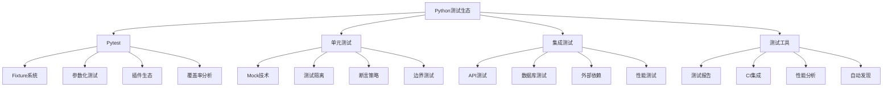

# 5.3.2 测试框架与最佳实践

## 🎯 核心理念

测试是质量保证的"安全网"。掌握现代测试框架不仅能提高代码可靠性，更能建立持续集成的信心基础，实现"测试即文档"的开发理念。

### 🧪 测试技术栈架构



## 🚀 Pytest深度技术

### 💡 核心测试模式

```python
import pytest
import asyncio
from unittest.mock import Mock, patch, MagicMock
from typing import Dict, List
import datetime
from dataclasses import dataclass

class ModernTestingFramework:
    """现代测试框架深度应用"""
    
    @staticmethod
    def advanced_pytest_features():
        """Pytest高级特性"""
        
        print("🧪 Pytest高级特性:")
        
        # ✅ Fixture系统深度
        @pytest.fixture(scope="module")
        def database_connection():
            """数据库连接fixture"""
            print("建立数据库连接")
            conn = Mock()
            conn.is_connected = True
            yield conn
            print("关闭数据库连接")
            conn.is_connected = False
        
        @pytest.fixture(scope="session")
        def redis_cache():
            """Redis缓存fixture"""
            cache = Mock()
            cache.get = Mock(return_value=None)
            cache.set = Mock(return_value=True)
            cache.delete = Mock(return_value=True)
            return cache
        
        # ✅ 复杂Fixtures
        @pytest.fixture
        def user_service(database_connection, redis_cache):
            """用户服务：依赖多个fixtures"""
            
            class UserService:
                def __init__(self, db, cache):
                    self.db = db
                    self.cache = cache
                
                def find_user(self, user_id: int):
                    # 先查缓存
                    cached_user = self.cache.get(f"user:{user_id}")
                    if cached_user:
                        return cached_user
                    
                    # 查数据库
                    user = self.db.query(f"SELECT * FROM users WHERE id = {user_id}")
                    if user:
                        self.cache.set(f"user:{user_id}", user)
                    
                    return user
                
                def create_user(self, user_data: Dict):
                    return self.db.insert("users", user_data)
            
            return UserService(database_connection, redis_cache)
        
        # 测试fixture组合
        def test_user_service_integration(user_service):
            """测试用户服务集成"""
            
            # 测试创建用户
            user_data = {"name": "Alice", "email": "alice@example.com"}
            result = user_service.create_user(user_data)
            
            # 验证数据库调用
            user_service.db.insert.assert_called_once_with("users", user_data)
            
            # 测试查找用户（模拟缓存未命中）
            user_service.cache.get.return_value = None
            user_service.db.query.return_value = user_data
            
            found_user = user_service.find_user(123)
            assert found_user == user_data
            user_service.db.query.assert_called_with("SELECT * FROM users WHERE id = 123")
        
        print("Fixture系统测试完成")
    
    @staticmethod
    def parametrized_testing():
        """参数化测试技术"""
        
        print("\n参数化测试:")
        
        # ✅ 业务逻辑测试
        @dataclass
        class Calculator:
            """计算器类"""
            
            @staticmethod
            def add(a: float, b: float) -> float:
                return a + b
            
            @staticmethod
            def multiply(a: float, b: float) -> float:
                return a * b
            
            @staticmethod
            def divide(a: float, b: float) -> float:
                if b == 0:
                    raise ValueError("除数不能为零")
                return a / b
        
        class TestCalculatorParametrized:
            """参数化测试类"""
            
            @pytest.mark.parametrize(
                "a,b,expected",
                [
                    (2, 3, 5),
                    (0, 5, 5),
                    (-1, 1, 0),
                    (3.14, 2.86, 6.0),
                    (1000000, 2000000, 3000000)
            ])
            def test_add(self, a, b, expected):
                """测试加法"""
                assert Calculator.add(a, b) == expected
            
            @pytest.mark.parametrize(
                "a,b",
                [(10, 0), (0, 0), (-5, 0)]
            )
            def test_divide_by_zero(self, a, b):
                """测试除零异常"""
                with pytest.raises(ValueError, match="除数不能为零"):
                    Calculator.divide(a, b)
            
            # ✅ 数据驱动测试
            @pytest.mark.parametrize(
                "operation,a,b,expected",
                [
                    ("add", 2, 3, 5),
                    ("multiply", 4, 5, 20),
                    ("divide", 10, 2, 5)
            ])
            def test_operations(self, operation, a, b, expected):
                """测试各种操作"""
                if operation == "add":
                    result = Calculator.add(a, b)
                elif operation == "multiply":
                    result = Calculator.multiply(a, b)
                elif operation == "divide":
                    result = Calculator.divide(a, b)
                
                assert result == expected
        
        print("参数化测试完成")

# ✅ 异步测试技术
class AsyncTestingPatterns:
    """异步测试模式"""
    
    @staticmethod
    def async_api_testing():
        """异步API测试"""
        
        print("\n🕰️ 异步测试:")
        
        import aiohttp
        
        @pytest.mark.asyncio
        async def test_async_api_call():
            """测试异步API调用"""
            
            async def fetch_user_data(user_id: int):
                """模拟异步API调用"""
                await asyncio.sleep(0.1)  # 模拟网络延迟
                return {"id": user_id, "name": f"User_{user_id}"}
            
            # 测试单个异步调用
            user_data = await fetch_user_data(123)
            assert user_data["id"] == 123
            assert user_data["name"] == "User_123"
            
            # 测试并发异步调用
            tasks = [fetch_user_data(i) for i in range(5)]
            results = await asyncio.gather(*tasks)
            
            assert len(results) == 5
            for i, result in enumerate(results):
                assert result["id"] == i
                assert result["name"] == f"User_{i}"
        
        # ✅ 异步Mock测试
        @pytest.mark.asyncio
        async def test_async_service_with_mock():
            """异步服务Mock测试"""
            
            class AsyncDatabaseService:
                """异步数据库服务"""
                
                async def async_query(self, query: str):
                    await asyncio.sleep(0.05)
                    return f"Result for: {query}"
            
            # Mock异步方法
            mock_db = AsyncMock()
            mock_db.async_query.return_value = "Mocked result"
            
            async def fetch_data_with_db(query, db_service):
                return await db_service.async_query(query)
            
            result = await fetch_data_with_db("SELECT * FROM users", mock_db)
            
            assert result == "Mocked result"
            mock_db.async_query.assert_called_once_with("SELECT * FROM users")
        
        print("异步测试完成")

# ✅ Mock高级技术
class AdvancedMockingTechniques:
    """高级Mock技术"""
    
    @staticmethod
    def sophisticated_mocking():
        """复杂Mock场景"""
        
        print("\n🎭 高级Mock技术:")
        
        def test_external_service_integration():
            """外部服务集成测试"""
            
            # ✅ 模拟外部API
            @patch('requests.get')
            def test_fetch_weather_data(mock_get):
                """测试天气数据获取"""
                
                # 模拟API响应
                mock_response = Mock()
                mock_response.json.return_value = {
                    "temperature": 25.5,
                    "humidity": 60,
                    "description": "晴天"
                }
                mock_response.status_code = 200
                mock_get.return_value = mock_response
                
                # 测试函数
                def fetch_weather(city):
                    response = requests.get(f"https://api.weather.com/{city}")
                    return response.json()
                
                result = fetch_weather("beijing")
                
                assert result["temperature"] == 25.5
                assert result["description"] == "晴天"
                mock_get.assert_called_once_with("https://api.weather.com/beijing")
        
        def test_context_manager_mocking():
            """上下文管理器Mock测试"""
            
            class DatabaseContext:
                """数据库上下文管理器"""
                
                def __init__(self):
                    self.is_open = False
                
                def __enter__(self):
                    self.is_open = True
                    return self
                
                def __exit__(self, exc_type, exc_val, exc_tb):
                    self.is_open = False
                
                def query(self, sql):
                    return f"Query result: {sql}"
            
            # Mock上下文管理器
            with patch.object(DatabaseContext, '__enter__') as mock_enter:
                with patch.object(DatabaseContext, '__exit__') as mock_exit:
                    
                    mock_db = Mock()
                    mock_db.query.return_value = "Mocked query result"
                    mock_enter.return_value = mock_db
                    
                    # 使用with语句
                    with DatabaseContext() as db:
                        result = db.query("SELECT * FROM users")
                    
                    mock_exit.assert_called_once()
                    assert result == "Mocked query result"
        
        def test_side_effects_and_spy():
            """Side Effects和Spy测试"""
            
            # ✅ Side Effects
            def mocked_file_reader():
                """模拟文件读取"""
                with patch('test_file.read', side_effect=["Line 1", "Line 2", StopIteration]):
                    lines = []
                    try:
                        for line in test_file.read():
                            lines.append(line)
                    except StopIteration:
                        pass
                
                return lines
            
            # ✅ Spy对象
            def spy_on_function_calls():
                """Spy函数调用"""
                
                real_function = sum  # 真实函数
                
                spy_function = Mock(side_effect=real_function)
                
                result = spy_function([1, 2, 3, 4])
                
                assert result == 10  # 真实功能正常
                spy_function.assert_called_once_with([1, 2, 3, 4])  # 调用被记录
        
        test_external_service_integration()
        test_context_manager_mocking()
        test_side_effects_and_spy()

# ✅ 测试覆盖率与质量
class TestCoverageAndQuality:
    """测试覆盖率和质量"""
    
    @staticmethod
    def coverage_analysis():
        """覆盖率分析"""
        
        print("\n📊 测试覆盖率:")
        
        # ✅ 业务逻辑带覆盖率检查
        class ShoppingCart:
            """购物车类"""
            
            def __init__(self):
                self.items = {}
                self.discount_threshold = 100
            
            def add_item(self, item_id: str, quantity: int = 1):
                """添加商品"""
                if quantity <= 0:
                    raise ValueError("数量必须大于0")
                
                if item_id in self.items:
                    self.items[item_id] += quantity
                else:
                    self.items[item_id] = quantity
            
            def remove_item(self, item_id: str, quantity: int = None):
                """删除商品"""
                if item_id not in self.items:
                    raise KeyError(f"商品 {item_id} 不存在")
                
                if quantity is None:
                    del self.items[item_id]
                else:
                    self.items[item_id] -= quantity
                    if self.items[item_id] <= 0:
                        del self.items[item_id]
            
            def calculate_total(self, item_prices: Dict[str, float]) -> float:
                """计算总价"""
                total = 0
                for item_id, quantity in self.items.items():
                    if item_id in item_prices:
                        total += item_prices[item_id] * quantity
                
                # 应用折扣
                if total >= self.discount_threshold:
                    total *= 0.9  # 10%折扣
                
                return total
        
        # ✅ 边界测试
        class TestShoppingCartBoundaryTesting:
            """购物车边界测试"""
            
            def setup_method(self):
                """测试设置"""
                self.cart = ShoppingCart()
                self.prices = {"item1": 10.0, "item2": 25.0}
            
            def test_empty_cart(self):
                """空购物车测试"""
                assert self.cart.calculate_total(self.prices) == 0
            
            def test_add_zero_quantity(self):
                """添加零数量测试"""
                with pytest.raises(ValueError, match="数量必须大于0"):
                    self.cart.add_item("item1", 0)
            
            def test_remove_nonexistent_item(self):
                """删除不存在商品测试"""
                with pytest.raises(KeyError, match="商品 nonexistent 不存在"):
                    self.cart.remove_item("nonexistent")
            
            def test_discount_boundary(self):
                """折扣边界测试"""
                # 刚好达到折扣阈值
                self.cart.add_item("item1", 10)  # 总额 = 100
                assert self.cart.calculate_total(self.prices) == 90.0  # 10%折扣
                
                # 略低于阈值
                self.cart.remove_item("item1", 1)  # 总额 = 90
                assert self.cart.calculate_total(self.prices) == 90.0  # 无折扣
        
        print("覆盖率分析完成")

# 🧪 测试最佳实践
class TestBestPractices:
    """测试最佳实践"""
    
    @staticmethod
    def test_design_principles():
        """测试设计原则"""
        
        print("\n🎯 测试设计原则:")
        
        # ✅ AAA模式（Arrange, Act, Assert）
        def test_aaa_pattern():
            """AAA测试模式"""
            
            # Arrange: 准备测试数据
            user_data = {
                "name": "John Doe",
                "email": "john@example.com",
                "age": 30
            }
            
            # Act: 执行被测试的操作
            user = validate_and_create_user(user_data)
            
            # Assert: 验证结果
            assert user.name == "John Doe"
            assert user.email == "john@example.com"
            assert user.age == 30
            
            def validate_and_create_user(data):
                """验证并创建用户"""
                if not data.get("name"):
                    raise ValueError("姓名不能为空")
                if "@" not in data.get("email", ""):
                    raise ValueError("邮箱格式错误")
                
                @dataclass
                class User:
                    name: str
                    email: str
                    age: int
                
                return User(**data)
        
        def test_one_assertion_per_concept():
            """一个概念一个断言"""
            
            def test_user_validation_multiple_concepts():
                """测试用户验证的多个概念"""
                
                # 概念1: 姓名验证
                with pytest.raises(ValueError, match="姓名不能为空"):
                    validate_and_create_user({"email": "test@example.com"})
                
                # 概念2: 邮箱验证
                with pytest.raises(ValueError, match="邮箱格式错误"):
                    validate_and_create_user({"name": "Test", "email": "invalid-email"})
                
                # 概念3: 正常创建
                user = validate_and_create_user({
                    "name": "Valid User",
                    "email": "valid@example.com",
                    "age": 25
                })
                assert user.name == "Valid User"
        
        def test_focused_unit_tests():
            """专注的单元测试"""
            
            class TestUserServiceFocused:
                """专注的用户服务测试"""
                
                @pytest.fixture
                def user_service(self):
                    return UserService()
                
                def test_create_user_success(self, user_service):
                    """只测试成功创建用户"""
                    user_data = {"name": "Alice", "email": "alice@example.com"}
                    
                    result = user_service.create_user(user_data)
                    
                    assert result.success is True
                    assert result.user_id is not None
                
                def test_create_user_email_validation(self, user_service):
                    """只测试邮箱验证"""
                    invalid_data = {"name": "Alice", "email": "invalid"}
                    
                    with pytest.raises(ValidationError):
                        user_service.create_user(invalid_data)
                
                class UserService:
                    """用户服务"""
                    
                    def create_user(self, user_data):
                        if "@" not in user_data.get("email", ""):
                            raise ValidationError("邮箱格式错误")
                        
                        @dataclass
                        class CreateResult:
                            success: bool
                            user_id: int = None
                        
                        return CreateResult(success=True, user_id=123)
        
        test_aaa_pattern()
        test_one_assertion_per_concept()
        test_focused_unit_tests()

# 运行所有测试示例
print("🚀 Python现代测试框架与技术:")
ModernTestingFramework.advanced_pytest_features()
ModernTestingFramework.parametrized_testing()
AsyncTestingPatterns.async_api_testing()
AdvancedMockingTechniques.sophisticated_mocking()
TestCoverageAndQuality.coverage_analysis()
TestBestPractices.test_design_principles()

## 🧪 测试实战项目

### 📝 实践1：微服务API测试套件

**任务**：构建完整的API测试解决方案

```python
# ✅ 微服务API测试套件
class MicroserviceTestSuite:
    """微服务测试套件"""
    
    @pytest.fixture(scope="session")
    def api_base_url(self):
        """API基础URL"""
        return "http://localhost:8000/api/v1"
    
    @pytest.fixture
    async def api_client(self, api_base_url):
        """异步HTTP客户端"""
        async with aiohttp.ClientSession() as session:
            yield APIClient(session, api_base_url)
    
    @pytest.mark.asyncio
    async def test_user_registration_endpoint(self, api_client):
        """测试用户注册端点"""
        
        user_data = {
            "username": "testuser",
            "email": "test@example.com",
            "password": "securepassword"
        }
        
        response, status = await api_client.post("/users/register", user_data)
        
        assert status == 201
        assert response["username"] == user_data["username"]
        assert "user_id" in response
    
    @pytest.mark.asyncio
    async def test_product_search_endpoint(self, api_client):
        """测试产品搜索端点"""
        
        params = {"q": "laptop", "category": "electronics"}
        response, status = await api_client.get("/products/search", params)
        
        assert status == 200
        assert "products" in response
        assert len(response["products"]) > 0

class APIClient:
    """API客户端"""
    
    def __init__(self, session, base_url):
        self.session = session
        self.base_url = base_url
    
    async def post(self, endpoint, data):
        """POST请求"""
        async with self.session.post(
            f"{self.base_url}{endpoint}", 
            json=data
        ) as response:
            return await response.json(), response.status
    
    async def get(self, endpoint, params=None):
        """GET请求"""
        async with self.session.get(
            f"{self.base_url}{endpoint}", 
            params=params or {}
        ) as response:
            return await response.json(), response.status
```

### 🎯 实践2：行为驱动测试（BDD）

**任务**：实现Given-When-Then测试模式

```python
# ✅ BDD测试框架
class BDDTestFramework:
    """行为驱动测试框架"""
    
    @staticmethod
    def given_exists(condition, value=None):
        """Given：前提条件"""
        
        def decorator(func):
            def wrapper(*args, **kwargs):
                # 设置前置条件
                setup_context = {condition: value}
                kwargs['context'] = setup_context
                
                return func(*args, **kwargs)
            return wrapper
        
        return decorator
    
    @staticmethod
    def when_action(action_name, *args, **kwargs):
        """When：执行动作"""
        
        def decorator(func):
            def wrapper(*args, **kwargs):
                # 执行动作前的设置
                print(f"执行动作: {action_name}")
                
                result = func(*args, **kwargs)
                
                # 记录动作结果
                context = kwargs.get('context', {})
                context['last_action'] = action_name
                context['action_result'] = result
                
                return result
            return wrapper
        
        return decorator
    
    @staticmethod
    def then_verify(assertion_func):
        """Then：验证结果"""
        
        def decorator(func):
            def wrapper(*args, **kwargs):
                result = func(*args, **kwargs)
                
                # 执行断言验证
                context = kwargs.get('context', {})
                assertion_func(context)
                
                return result
            return wrapper
        
        return decorator
    
    # BDD测试示例
    @BDDTestFramework.given_exists('user', {'name': 'Alice', 'balance': 100})
    @BDDTestFramework.when_action('transfer_money', amount=50, to='Bob')
    @BDDTestFramework.then_verify(lambda ctx: assert ctx['user']['balance'] == 50)
    def test_money_transfer():
        """BDD风格的钱包转账测试"""
        
        def transfer_money(user, amount, to_user, context):
            current_balance = context['user']['balance']
            new_balance = current_balance - amount
            
            context['user']['balance'] = new_balance
            context['transfer_recipient'] = to_user
            context['transfer_amount'] = amount
            
            return {
                'new_balance': new_balance,
                'recipient': to_user,
                'amount': amount
            }

# bdd_test = BDDTestFramework()
```

## 🔗 知识连接

- **代码质量**：[[5.3 代码质量保证]] - 整体代码质量策略
- **性能测试**：[[5.5 性能调优与监控]] - 性能测试技术
- **CI/CD**：[[5.4 部署与运维]] - 测试自动化集成
- **Web开发**：[[5.1 Web开发框架]] - Web应用测试

## 💡 费曼检验

**解释：如何设计有效的测试策略？Pytest的优势是什么？如何选择Mock还是Stub？**

核心要点：
1. **测试策略**：单元测试为主，集成测试补充，端到端验证关键路径
2. **Pytest优势**：简洁语法、丰富Fixture、强大插件、自动发现
3. **Mock vs Stub**：Mock验证交互，Stub提供数据，根据需要选择
4. **质量保证**：覆盖率追求意义，边界测试重要，错误处理必须

---

🎯 **下个目标**：学习[[5.3.3 CI_CD自动化流程]]中的持续集成技术
