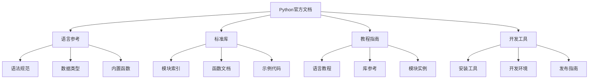

# 6.1.1 官方文档导航

## 🎯 核心理念

官方文档是Python学习者的"圣经"。它是最权威、最全面、最及时的Python知识来源，是专业开发者不可或缺的参考手册。

### 🏗️ Python官方文档架构



## 📚 核心文档分类导航

### 💡 学习路径文档

| 阶段 | 核心文档 | 重点内容 | 学习时间 |
|------|----------|----------|----------|
| **入门** | Python Tutorial | 基础语法、数据类型、控制流 | 2-3周 |
| **进阶** | Language Reference | 函数、类、模块、异常 | 3-4周 |
| **专业** | Library Reference | 标准库详解、高级特性 | 4-6周 |
| **专家** | Extending Python | C扩展、嵌入Python | 6-8周 |

### 🔧 标准库模块导航

#### 🎯 常用模块快速索引

| 模块分类 | 核心模块 | 应用场景 | 文档链接 |
|----------|----------|----------|----------|
| **数据处理** | `collections`, `itertools`, `heapq` | 高级数据结构操作 | [collections](https://docs.python.org/3/library/collections.html) |
| **文件操作** | `os`, `pathlib`, `json`, `csv` | 文件和目录管理 | [pathlib](https://docs.python.org/3/library/pathlib.html) |
| **网络通信** | `urllib`, `socket`, `email` | 网络编程 | [urllib](https://docs.python.org/3/library/urllib.html) |
| **日期时间** | `datetime`, `time`, `calendar` | 时间处理 | [datetime](https://docs.python.org/3/library/datetime.html) |
| **并发编程** | `threading`, `multiprocessing`, `asyncio` | 并行计算 | [threading](https://docs.python.org/3/library/threading.html) |
| **数学计算** | `math`, `statistics`, `random` | 数值计算 | [math](https://docs.python.org/3/library/math.html) |

#### 📊 按应用领域分类

```python
# ✅ 自动化脚本开发
AUTOMATION_MODULES = {
    'file_management': ['os', 'pathlib', 'shutil', 'glob'],
    'system_control': ['subprocess', 'signal', 'sys'],
    'task_scheduling': ['sched', 'time', 'datetime'],
    'system_info': ['platform', 'psutil', 'socket']
}

# ✅ Web开发
WEB_MODULES = {
    'http_client': ['urllib', 'http.client', 'requests'],
    'server': ['wsgiref', 'socket'],
    'data_format': ['json', 'xml', 'html'],
    'security': ['ssl', 'hashlib', 'hmac']
}

# ✅ 数据科学
DATA_SCIENCE_MODULES = {
    'core_math': ['math', 'statistics', 'random'],
    'advanced_tools': ['csv', 'json', 'sqlite3'],
    'concurrent': ['multiprocessing', 'threading', 'concurrent.futures']
}
```

### 🌐 官方工具与生态

#### 🎨 开发工具导航

| 工具分类 | 官方工具 | 第三方替代 | 选择建议 |
|----------|----------|-------------|----------|
| **包管理** | `pip`, `venv` | `conda`, `poetry` | 根据项目需求选择 |
| **代码风格** | `py_compile` | `black`, `flake8`, `pylint` | 第三方工具更丰富 |
| **测试框架** | `unittest` | `pytest`, `testify` | pytest更流行 |
| **文档生成** | `pydoc` | `sphinx`, `mkdocs` | sphinx功能更强大 |

#### 📦 Package Index导航

```python
# ✅ PyPI包搜索策略
def search_package_efficiency():
    """高效的包搜索策略"""
    
    # 1. 官方包优先
    official_packages = [
        'requests',      # HTTP库
        'pillow',       # 图像处理
        'beautifulsoup4', # HTML解析
        'flask',        # Web框架
        'django'        # Web框架
    ]
    
    # 2. 按质量指标选择
    package_evaluation_criteria = {
        'downloads': '下载量 > 100万/week',
        'stars': 'GitHub star > 1000',
        'maintenance': '最后更新 < 6个月',
        'documentation': '文档完整清晰',
        'test_coverage': '测试覆盖率 > 80%'
    }
    
    return package_evaluation_criteria

# ✅ 包版本策略
VERSIONING_STRATEGY = {
    'stable': '使用>=1.0.0,<2.0.0',
    'latest': '允许最新版本',
    'locked': '锁定具体版本',
    'candidates': '>=2.0.0,<3.0.0'
}
```

## 🔍 高级文档使用技巧

### 💡 深度学习文档模式

```python
class DocumentLearningStrategy:
    """文档学习策略"""
    
    def __init__(self):
        self.learning_stages = {
            'overview': '概览理解',
            'examples': '示例代码',
            'api_reference': 'API参考',
            'advanced_usage': '高级用法'
        }
    
    def systematic_learning(self):
        """系统性学习文档"""
        
        # ✅ 阅读策略
        reading_strategy = {
            'first_pass': '快速通读，了解整体结构',
            'example_focus': '重点关注示例代码',
            'api_dive': '深入API细节',
            'advanced_patterns': '学习高级模式'
        }
        
        # ✅ 笔记策略
        note_strategy = {
            '知识点整理': '按主题分类整理',
            '代码示例': '保存有价值的代码',
            '常见问题': '记录常见问题和解决方案',
            '最佳实践': '总结最佳实践'
        }
        
        return reading_strategy, note_strategy
    
    def documentation_project_setup(self):
        """文档项目设置"""
        
        # ✅ 离线文档设置
        def setup_offline_docs():
            """设置离线文档"""
            # 下载完整Python文档
            # python -m pydoc -p 8080
            # 或下载PDF版本
            
            return {
                'download_link': 'https://docs.python.org/3/download.html',
                'local_port': '8080',
                'chrome_bookmark': 'pydoc://localhost:8080'
            }
        
        # ✅ 搜索优化
        def optimize_search():
            """优化搜索体验"""
            return {
                'site_search': 'site:docs.python.org search_term',
                'version_specific': '/zh-cn/3.11/' + search_term,
                'module_search': 'docs.python.org/3/library/module_name.html'
            }
        
        return setup_offline_docs(), optimize_search()
```

### 🎯 问题解决工作流

```python
class DocumentationWorkflow:
    """文档工作流"""
    
    @staticmethod
    def troubleshooting_workflow(problem_description):
        """问题解决工作流"""
        
        steps = [
            {
                'step': 1,
                'action': '理解问题',
                'tool': '官方教程',
                'method': '查阅相关章节'
            },
            {
                'step': 2,
                'action': '查找API',
                'tool': 'API Reference',
                'method': '搜索相关函数/类'
            },
            {
                'step': 3,
                'action': '查看示例',
                'tool': '示例代码',
                'method': '运行和修改示例'
            },
            {
                'step': 4,
                'action': '实验验证',
                'tool': '交互式Python',
                'method': '编写测试代码'
            },
            {
                'step': 5,
                'action': '扩展应用',
                'tool': 'Stack Overflow',
                'method': '参考社区解决方案'
            }
        ]
        
        return steps
    
    @staticmethod
    def documentation_contributing():
        """文档贡献指南"""
        
        contribution_areas = {
            'bug_reports': '报告文档错误',
            'improvement_suggestions': '改进建议',
            'example_code': '添加更好的示例',
            'translation': '翻译工作',
            'tutorial_writing': '编写教程'
        }
        
        return contribution_areas
```

## 🧪 文档使用最佳实践

### 📝 练习1：文档导航技能

**任务**：快速定位和解决问题

```python
# ✅ 文档任务模拟
def documentation_search_challenge():
    """文档搜索挑战"""
    
    challenges = [
        {
            'problem': '如何在Python中实现LRU缓存？',
            'solution_path': 'collections.OrderedDict → deque → heapq',
            'answer': 'collections.OrderedDict或使用最近开发的'
        },
        {
            'problem': '如何优雅地处理文件路径？',
            'solution_path': 'os.path模块 → pathlib模块',
            'answer': 'pathlib.Path类提供了更现代的路径处理方式'
        },
        {
            'problem': '如何在多线程中安全地共享数据？',
            'solution_path': 'threading.Lock → queue.Queue → multiprocessing',
            'answer': '使用锁、队列或考虑多进程'
        }
    ]
    
    return challenges

# ✅ 文档学习记录
class DocumentationProgress:
    """文档学习进度"""
    
    def __init__(self):
        self.completed_modules = set()
        self.study_notes = {}
        self.code_examples = {}
    
    def mark_completed(self, module_name):
        """标记完成模块"""
        self.completed_modules.add(module_name)
    
    def add_note(self, topic, note):
        """添加学习笔记"""
        self.study_notes[topic] = note
    
    def save_example(self, module, example_code):
        """保存代码示例"""
        self.code_examples[module] = example_code

# 测试文档学习进度
doc_progress = DocumentationProgress()
doc_progress.mark_completed('collections')
doc_progress.add_note('deque', '双端队列适合实现缓存')
doc_progress.save_example('collections', 'from collections import deque\ncache = deque(maxlen=100)')
```

## 🔗 知识连接

- **学习路径**：[[🎯 学习路径规划]] - 整体学习计划
- **技术资源**：[[6.1.2 技术社区]] - 社区资源导航
- **实践项目**：[[6.3 实践项目]] - 文档驱动的项目开发

## 💡 费曼检验

**向新同事解释：如何高效地阅读Python官方文档？为什么官方文档比教程更重要？**

核心要点：
1. **权威性**：官方文档是最准确、最完整的信息源
2. **系统性**：从官方文档可以形成完整的知识体系
3. **实用性**：文档包含最实用的API参考和示例
4. **时效性**：官方文档总是最新最及时的资源

---

📚 **扩展阅读**：
- [[⚡ 快速概念辞典]] - "文档"、"API"等术语
- [[🗺️ Python学习全景图]] - 整体学习架构

🎯 **下个目标**：掌握[[6.1.2 技术社区]]中的社区协作技巧
```python
# 快速示例：文档驱动的学习
def quick_doc_search_example():
    """快速文档搜索示例"""
    import webbrowser
    
    # 搜索策略
    search_strategies = {
        'module_search': 'https://docs.python.org/3/library/{module}.html',
        'function_search': 'https://docs.python.org/3/library/{module}.html#{module}.{function}',
        'tutorial_search': 'https://docs.python.org/3/tutorial/{topic}.html'
    }
    
    return search_strategies

print("文档学习策略已准备就绪！")
