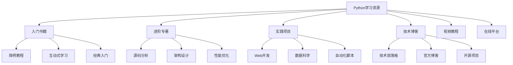
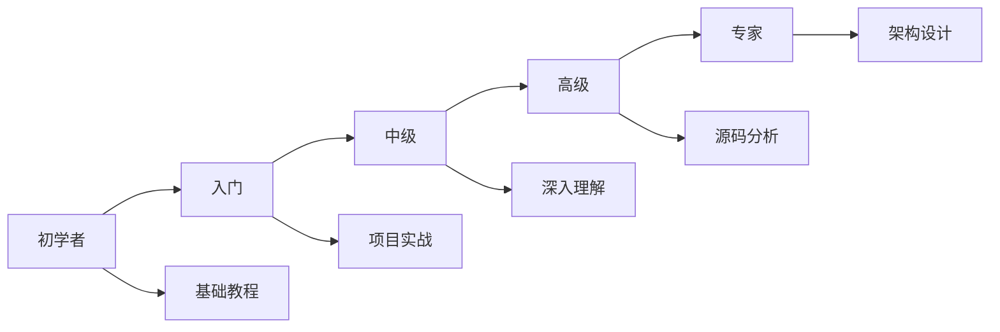

# 📖 推荐阅读清单

## 🎯 核心理念

优质的学习资源是"知识进步的梯子"。这份精心筛选的阅读清单，按照学习路径和难度分类，为不同阶段的Python学习者提供专业指导。

### 🌟 推荐资源分类

## 📚 精选书单

### 🌟 **入门阶段**（基础学习）

#### 📖 **必读经典**

1. **《Python编程：从入门到实践》**
   - 🎯 **适用人群**：零基础学习者
   - 📝 **核心内容**：语法基础、项目实战、最佳实践
   - 💡 **学习价值**：从基础语法到实际项目的完整路径
   - 🔗 **推荐理由**：理论与实践结合，项目驱动学习

2. **《Python Crash Course》**
   - 🎯 **适用人群**：有其他语言基础的开发者
   - 📝 **核心内容**：快速上手、核心概念、常用库
   - 💡 **学习价值**：快速建立Python编程思维
   - 🔗 **推荐理由**：内容精炼，学习曲线平缓

#### 📖 **互动式学习**

3. **《Automate the Boring Stuff with Python》**
   - 🎯 **适用人群**：自动化需求者
   - 📝 **核心内容**：文件操作、网页抓取、数据处理
   - 💡 **学习价值**：解决日常工作和生活问题
   - 🔗 **推荐理由**：实用性极强，学以致用

### 🚀 **进价阶段**（深度理解）

#### 📖 **大师级著作**

4. **《Python Cookbook》**
   - 🎯 **适用人群**：有一定基础的程序员
   - 📝 **核心内容**：高级技巧、最佳实践、问题解决
   - 💡 **学习价值**：提升编程技巧和代码质量
   - 🔗 **推荐理由**：O'Reilly出品，质量保证

5. **《Effective Python》**
   - 🎯 **适用人群**：Python中级开发者
   - 📝 **核心内容**：59个具体建议、高效编程技巧
   - 💡 **学习价值**：深度理解Python语言特性
   - 🔗 **推荐理由**：每个建议都有深刻的原理解释

6. **《Writing Idiomatic Python》**
   - 🎯 **适用人群**：追求Pythonic代码的开发者
   - 📝 **核心内容**：Python语言风格的深度解析
   - 💡 **学习价值**：写出更优雅、更地道的Python代码
   - 🔗 **推荐理由**：提升代码的可读性和维护性

#### 📖 **核心技术**

7. **《Fluent Python》**
   - 🎯 **适用人群**：想要精通Python的高级开发者
   - 📝 **核心内容**：数据结构、函数式编程、元编程
   - 💡 **学习价值**：理解Python的深层机制
   - 🔗 **推荐理由**：语言设计的深度剖析

8. **《Python in a Nutshell》**
   - 🎯 **适用人群**：Python工程师和技术专家
   - 📝 **核心内容**：语言参考、标准库、最佳实践
   - 💡 **学习价值**：全面的Python技术参考
   - 🔗 **推荐理由**：权威性技术指南

### 🔬 **专家阶段**（源码与架构）

#### 📖 **源码分析**

9. **《Python源码剖析》**
   - 🎯 **适用人群**：对Python内部机制感兴趣的开发者
   - 📝 **核心内容**：CPython源码分析、实现细节
   - 💡 **学习价值**：深入理解Python的运行机制
   - 🔗 **推荐理由**：为数不多的Python源码中文分析

10. **《Inside The Python Virtual Machine》**
    - 🎯 **适用人群**：Python解释器研究人员
    - 📝 **核心内容**：PVM工作机制、字节码执行
    - 💡 **学习价值**：理解Python虚拟机的运行原理
    - 🔗 **推荐理由**：技术深度极高

#### 📖 **高性能编程**

11. **《High Performance Python》**
    - 🎯 **适用人群**：性能敏感的Python开发者
    - 📝 **核心内容**：性能分析、优化技巧、并发编程
    - 💡 **学习价值**：解决性能瓶颈，提升程序效率
    - 🔗 **推荐理由**：实用性强，问题导向

12. **《Python并行编程手册》**
    - 🎯 **适用人群**：并发编程需求者
    - 📝 **核心内容**：多线程、多进程、异步编程
    - 💡 **学习价值**：并行计算的实战技巧
    - 🔗 **推荐理由**：涵盖多种并发技术

## 🎥 优质视频资源

### 📺 **在线课程**

1. **Python官方教程**
   - 🌟 **来源**：Python Software Foundation
   - 🎯 **特色**：权威性、官方标准
   - 🔗 **链接**：docs.python.org/tutorial/

2. **Coursera - Python for Everybody**
   - 🌟 **来源**：密歇根大学
   - 🎯 **特色**：结构化课程、项目导向
   - 🔗 **链接**：coursera.org/specializations/python

3. **edX - MIT Python课程**
   - 🌟 **来源**：麻省理工学院
   - 🎯 **特色**：学术严谨、理论基础扎实
   - 🔗 **链接**：edx.org/search?q=MIT+Python

### 📺 **技术演讲**

4. **PyCon会议视频**
   - 🌟 **来源**：全球Python开发者大会
   - 🎯 **特色**：前沿技术、实践经验
   - 🔗 **链接**：pyvideo.org

5. **Talk Python To Me**
   - 🌟 **来源**：Michael Kennedy
   - 🎯 **特色**：访谈式学习、行业洞察
   - 🔗 **链接**：talkpython.fm

## 🌐 优质网站与博客

### 📝 **技术博客**

1. **Real Python**
   - 🌟 **特色**：高质量教程、深度文章
   - 🎯 **适用**：持续学习、技能提升
   - 🔗 **链接**：realpython.com

2. **Python Software Foundation Blog**
   - 🌟 **特色**：官方资讯、技术动态
   - 🎯 **适用**：了解Python生态系统
   - 🔗 **链接**：blog.python.org

3. **Towards Data Science (Python部分)**
   - 🌟 **特色**：数据科学、ML应用
   - 🎯 **适用**：数据科学生态
   - 🔗 **链接**：towardsdatascience.com

### 💻 **代码仓库**

4. **Python官方示例**
   - 🌟 **特色**：官方代码样本
   - 🎯 **适用**：学习最佳实践
   - 🔗 **链接**：github.com/python/cpython

5. **awesome-python**
   - 🌟 **特色**：精选Python资源集合
   - 🎯 **适用**：发现优秀库和工具
   - 🔗 **链接**：github.com/vinta/awesome-python

## 🧪 实践项目推荐

### 🚀 **入门项目**

1. **简单计算器**
   - 🎯 **技术栈**：基础语法、函数、异常处理
   - 💡 **学习重点**：控制流、用户交互
   - 📝 **项目规模**：个人作业级别

2. **文本分析工具**
   - 🎯 **技术栈**：文件I/O、字符串处理、正则表达式
   - 💡 **学习重点**：数据处理、批量操作
   - 📝 **项目规模**：小型实用工具

### 🌟 **进阶项目**

3. **Web爬虫项目**
   - 🎯 **技术栈**：requests, beautifulsoup, scrapy
   - 💡 **学习重点**：网络编程、数据抓取
   - 📝 **项目规模**：中型项目

4. **数据可视化dashboard**
   - 🎯 **技术栈**：pandas, matplotlib/plotly, flask
   - 💡 **学习重点**：数据处理、可视化、Web开发
   - 🎯 **项目规模**：中型项目

### 🏆 **高级项目**

5. **机器学习模型部署平台**
   - 🎯 **技术栈**：scikit-learn/tensorflow, flask/fastapi, docker
   - 💡 **学习重点**：ML工程化、API设计、容器化
   - 📝 **项目规模**：大型项目

6. **实时数据处理系统**
   - 🎯 **技术栈**：asyncio, redis, kafka, sqlalchemy
   - 💡 **学习重点**：并发编程、数据流处理、系统架构
   - 📝 **项目规模**：企业级项目

## 👥 学习社区

### 🎯 **论坛与社区**

1. **Stack Overflow**
   - 🌟 **特色**：问题解答、技术交流
   - 🔗 **链接**：stackoverflow.com/questions/tagged/python

2. **Reddit r/Python**
   - 🌟 **特色**：社区讨论、资源分享
   - 🔗 **链接**：reddit.com/r/Python

3. **Python中国社区**
   - 🌟 **特色**：中文讨论、本土化资源
   - 🔗 **链接**：python.org.cn

### 💬 **技术社群**

4. **Python中文网论坛**
   - 🌟 **特色**：活跃的中文Python社区
   - 🎯 **适用**：中国开发者
   - 🔗 **链接**：python.org.cn/forums

## 📊 学习路径建议

### 🎯 **按能力等级**

### 📅 **按学习时间**

#### **短期冲刺（1-2个月）**
- 《Python Crash Course》
- Python官方教程
- 基础项目实战

#### **中期深入学习（3-6个月）**
- 《Fluent Python》
- PyCon视频
- 进阶项目开发

#### **长期专业发展（6个月以上）**
- 《Python源码剖析》
- 贡献开源项目
- 技术分享与写作

## 💡 学习建议

### 🎯 **阅读策略**

1. **理论与实践结合**
   - 每章理论学习后立即动手实践
   - 将书中的代码示例自己敲一遍

2. **做笔记与总结**
   - 使用Obsidian等工具记录学习笔记
   - 定期回顾和整理知识体系

3. **项目驱动学习**
   - 每完成一个学习阶段就做一个小项目
   - 在项目中应用新学的技术

### ⚡ **高效学习法**

4. **费曼技巧应用**
   - 尝试向他人解释你学的概念
   - 在论坛上回答相关问题

5. **刻意练习**
   - 针对薄弱环节进行专门训练
   - 设置阶段性目标和里程碑

6. **社区参与**
   - 积极参与技术讨论
   - 分享自己的学习心得和项目

## 🔗 资源获取建议

### 📖 **书籍获取**
- **图书馆**：公共图书馆科技分馆
- **数字图书馆**：如豆瓣阅读、微信读书
- **电子版**：在O'Reilly、Packt等平台订阅

### 🎥 **视频资源**
- **官方渠道**：YouTube官方频道
- **教育平台**：Coursera、edX、Udemy
- **专业社区**：极客时间、慕课网

### 🌐 **在线工具**
- **实践环境**：Google Colab、Jupyter Notebook
- **版本控制**：GitHub、GitLab
- **文档管理**：Obsidian、语雀

---

**记住：最好的学习资源不是你收集的，而是你实际使用的！** 🚀

选择适合自己当前水平的资源，坚持实践，才是学习Python的最佳路径。
