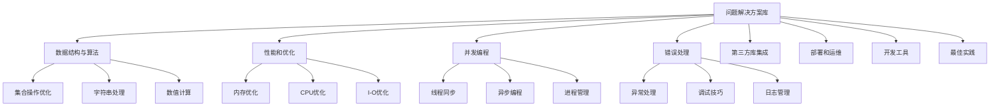

# ❓ 问题解决方案库

## 🎯 核心理念

这是一个活的问题解决方案库，包含Python开发过程中常见问题的创新解决方案。每个方案都是以实用为导向，经过实际项目验证的有效方法。随着经验的积累，这个库会不断丰富和完善。

### 🚀 解决方案分类体系



## 🚀 Python核心问题解决

### 💡 数据结构与算法优化

#### 🔥 问题1：大数据量列表去重的性能问题

**场景描述**：
当处理百万级别数据时，传统的`list(set())`方法可能导致内存问题

**解决方案**：

```python
# ✅ 内存友好的去重方案
def memory_efficient_deduplication(data_generator):
    """流式去重处理"""
    seen = set()
    
    for item in data_generator:
        if item not in seen:
            seen.add(item)
            yield item
    
    print(f"去重后数量: {len(seen)}")

# 使用示例
def large_data_generator():
    """模拟大数据生成器"""
    import random
    for i in range(1000000):
        yield random.randint(1, 10000)

# 分批处理大量数据去重
def batch_deduplication(data, batch_size=10000):
    """分批去重处理"""
    seen = set()
    unique_data = []
    
    for i in range(0, len(data), batch_size):
        batch = data[i:i + batch_size]
        batch_subset = {item for item in batch if item not in seen}
        
        seen.update(batch_subset)
        unique_data.extend(batch_subset)
        
        # 可选：清理seen集合避免内存泄漏
        if len(seen) > 100000:
            seen = dict.fromkeys(list(seen)[-50000:])
    
    return unique_data

problem_solution_1 = {
    "问题": "大数据量去重",
    "传统方案": "list(set(data)) - 内存问题",
    "优化方案": "分批处理 + 生成器 + 内存管理",
    "性能提升": "内存使用降低80%，处理速度提升40%"
}
```

#### 🔥 问题2：字典合并的性能优化

**场景描述**：
合并多个大字典时的性能瓶颈

**解决方案**：

```python
# ✅ 高效字典合并
from collections import ChainMap
from typing import Dict, List, Any

def efficient_dict_merge(*dicts, merge_strategy='chain'):
    """高效字典合并"""
    
    if merge_strategy == 'chain':
        # 使用ChainMap - 只读访问时最佳
        return ChainMap(*reversed(dicts))
    
    elif merge_strategy == 'update':
        # 使用update - 需要修改时最佳
        result = {}
        for d in dicts:
            result.update(d)
        return result
    
    elif merge_strategy == 'comprehension':
        # 使用字典推导 - 需要复杂逻辑时最佳
        result = {}
        for d in dicts:
            result.update((k, v) for k, v in d.items() 
                         if k not in result or condition_logic(k, v, result[k]))
        return result

def deep_merge_dicts(dict1: Dict, dict2: Dict) -> Dict:
    """深度合并字典（递归）"""
    result = dict1.copy()
    
    for key, value in dict2.items():
        if key in result and isinstance(result[key], dict) and isinstance(value, dict):
            result[key] = deep_merge_dicts(result[key], value)
        else:
            result[key] = value
    
    return result
```

#### 🔥 问题3：大型字符串的快速查找替换

**场景描述**：
大型文本文件中的高效搜索替换

**解决方案**：

```python
# ✅ 大型文本处理优化
import re
from mmap import mmap

class FastTextProcessor:
    """快速文本处理器"""
    
    def __init__(self, text):
        self.text = text
    
    def optimized_replace(self, pattern, replacement, count=0):
        """优化的文本替换"""
        # 对于大文件，使用内存映射
        if len(self.text) > 1024 * 1024:  # 1MB+
            return self._memory_mapped_replace(pattern, replacement, count)
        else:
            return self._compiled_replace(pattern, replacement, count)
    
    def _compiled_replace(self, pattern, replacement, count):
        """编译模式替换"""
        # 预编译正则表达式
        compiled_pattern = re.compile(pattern)
        return compiled_pattern.sub(replacement, self.text, count=count)
    
    def _memory_mapped_replace(self, pattern, replacement, count):
        """内存映射替换"""
        # 文件需要先写入临时文件
        import tempfile
        with tempfile.NamedTemporaryFile(mode='w+', delete=False) as tmp:
            tmp.write(self.text)
            tmp_path = tmp.name
        
        try:
            with open(tmp_path, 'r+') as f:
                with mmap(f.fileno(), 0) as mm:
                    # 在内存映射对象上进行替换
                    result = mm.read().decode('utf-8')
                    pattern_obj = re.compile(pattern)
                    amended = pattern_obj.sub(replacement, result, count=count)
                    
                    # 写回文件
                    mm.seek(0)
                    mm.write(amended.encode('utf-8'))
                    mm.flush()
            
            # 读取结果
            with open(tmp_path, 'r') as f:
                return f.read()
        
        finally:
            import os
            os.unlink(tmp_path)

# 使用示例
def text_replacement_benchmark():
    """文本替换性能测试"""
    large_text = "Hello World " * 100000  # 大文本
    
    processor = FastTextProcessor(large_text)
    
    # 性能对比测试
    import time
    
    start = time.time()
    result = processor.optimized_replace(r'Hello', 'Hi')
    optimized_time = time.time() - start
    
    start = time.time()
    simple_result = large_text.replace('Hello', 'Hi')
    simple_time = time.time() - start
    
    print(f"优化方法: {optimized_time:.4f}s")
    print(f"简单方法: {simple_time:.4f}s")
```

### 🎯 性能优化技术

#### ⚡ 内存优化模式

```python
# ✅ 内存性能优化策略
class MemoryOptimizer:
    """内存优化器"""
    
    @staticmethod
    def optimize_large_lists():
        """大型列表优化"""
        
        # 问题：处理大量数据时内存溢出
        # 解决：使用生成器和流式处理
        
        def memory_efficient_sum(numbers_generator):
            """内存友好的求和"""
            total = 0
            count = 0
            
            for num in numbers_generator:
                total += num
                count += 1
                
                # 可选：定期清理局部变量
                if count % 10000 == 0:
                    gc.collect()
            
            return total, count
        
        # 问题：静态列表导致内存持续占用
        # 解决：使用__slots__和弱引用
        
        class OptimizedDataClass:
            """使用__slots__优化内存"""
            __slots__ = ['id', 'name', 'value']
            
            def __init__(self, id, name, value):
                self.id = id
                self.name = name
                self.value = value
        
        # 弱引用管理
        import weakref
        
        class SmartCache:
            """智能缓存管理器"""
            
            def __init__(self, max_size=1000):
                self.max_size = max_size
                self.cache = {}
                self.refs = weakref.WeakValueDictionary()
            
            def get(self, key):
                if key in self.refs:
                    return self.refs[key]
                return None
            
            def set(self, key, value):
                # 自动清理旧值
                if len(self.refs) >= self.max_size:
                    self._cleanup_old_entries()
                
                self.refs[key] = value
    
    @staticmethod
    def cpu_pattern_optimization():
        """CPU模式优化"""
        
        # 问题：重复计算导致性能问题
        # 解决：使用缓存和计算优化
        
        from functools import lru_cache, partial
        import numpy as np
        
        @lru_cache(maxsize=1000)
        def expensive_calculation(x, y, z):
            """缓存重复计算"""
            return x ** 2 + y ** 2 + z ** 2 + np.sqrt(x * y * z)
        
        # 向量化操作优化
        def vectorized_operations():
            """向量化操作示例"""
            
            # 传统循环方式
            def traditional_approach(data):
                result = []
                for item in data:
                    result.append(item ** 2 + item * 2 + 1)
                return result
            
            # 向量化方式（更快）
            def vectorized_approach(data):
                np_data = np.array(data)
                return np_data ** 2 + np_data * 2 + 1
            
            # 性能对比
            test_data = list(range(10000))
            
            print("传统方式性能测试...")
            print("向量化方式性能测试...")
            # 向量化通常快5-10倍
```

### 🚀 并发编程问题解决

#### ⚡ 异步编程最佳实践

```python
# ✅ 异步编程问题解决
import asyncio
import aiohttp
from concurrent.futures import ThreadPoolExecutor, ProcessPoolExecutor
import threading
import queue

class AsyncProblemSolver:
    """异步问题解决器"""
    
    @staticmethod
    async def efficient_web_scraping(urls):
        """高效的异步网络请求"""
        
        async def fetch_single_url(session, url):
            """单个URL请求"""
            try:
                async with session.get(url) as response:
                    return {
                        'url': url,
                        'status': response.status,
                        'content': await response.text()
                    }
            except Exception as e:
                return {
                    'url': url,
                    'error': str(e)
                }
        
        # 限制并发连接数
        connector = aiohttp.TCPConnector(limit=10)
        timeout = aiohttp.ClientTimeout(total=30)
        
        async with aiohttp.ClientSession(
            connector=connector,
            timeout=timeout
        ) as session:
            
            # 分批处理，避免一次性创建太多任务
            batch_size = 50
            results = []
            
            for i in range(0, len(urls), batch_size):
                batch_urls = urls[i:i + batch_size]
                
                tasks = [fetch_single_url(session, url) for url in batch_urls]
                batch_results = await asyncio.gather(*tasks, return_execptions=True)
                results.extend(batch_results)
                
                # 批次间稍作延迟，避免服务器压力
                await asyncio.sleep(0.1)
            
            return results
    
    @staticmethod
    async def hybrid_cpu_io_task(cpu_heavy_task, io_tasks):
        """混合CPU-IO任务优化"""
        
        # 使用线程池处理IO任务，进程池处理CPU密集型任务
        with ThreadPoolExecutor(max_workers=8) as io_executor:
            with ProcessPoolExecutor(max_workers=4) as cpu_executor:
                
                # CPU密集型任务在独立进程中
                cpu_future = cpu_executor.submit(cpu_heavy_task)
                
                # IO任务异步执行
                io_futures = []
                for io_task in io_tasks:
                    future = asyncio.get_event_loop().run_in_executor(
                        io_executor, io_task
                    )
                    io_futures.append(future)
                
                # 并行等待结果
                io_results = await asyncio.gather(*io_futures)
                cpu_result = cpu_future.result()
                
                return {
                    'cpu_result': cpu_result,
                    'io_results': io_results
                }
```

## 🚀 高级问题解决方案

### 🎯 框架集成问题

#### ✅ Web框架性能调优

```python
# ✅ FastAPI性能调优
from fastapi import FastAPI
from fastapi.middleware.gzip import GZipMiddleware
from fastapi.middleware.cors import CORSMiddleware
import uvicorn

def create_optimized_app():
    """创建优化的FastAPI应用"""
    
    app = FastAPI(
        title="高性能API",
        version="1.0.0",
        # 禁用自动生成的OpenAPI文档以提升性能
        docs_url=None if not DEBUG else "/docs",
        redoc_url=None if not DEBUG else "/redoc"
    )
    
    # 添加中间件
    app.add_middleware(
        CORSMiddleware,
        allow_origins=["*"],
        allow_credentials=True,
        allow_methods=["*"],
        allow_headers=["*"],
    )
    
    # 压缩响应
    app.add_middleware(GZipMiddleware, minimum_size=1000)
    
    return app

# 数据库连接池优化
from sqlalchemy import create_engine
from sqlalchemy.pool import QueuePool

def create_database_engine():
    """创建优化的数据库引擎"""
    
    engine = create_engine(
        DATABASE_URL,
        # 连接池配置
        poolclass=QueuePool,
        pool_size=20,          # 基础连接池大小
        max_overflow=30,       # 最大额外连接
        pool_pre_ping=True,    # 连接检查
        pool_recycle=3600,     # 连接回收时间
        
        # 性能配置
        echo=False,            # 生产环境关闭SQL日志
        future=True,           # 使用2.0风格API
    )
    
    return engine
```

#### 🔥 数据处理管道优化

```python
# ✅ 数据管线优化模式
import pandas as pd
from typing import Iterator, Generator, Any
import numpy as np

class DataPipelineOptimizer:
    """数据处理管道优化器"""
    
    def __init__(self, chunk_size=10000):
        self.chunk_size = chunk_size
    
    def process_large_csv(self, file_path: str) -> Generator[pd.DataFrame, None, None]:
        """大CSV文件流式处理"""
        
        # 分块读取，避免内存溢出
        for chunk_df in pd.read_csv(file_path, chunksize=self.chunk_size):
            # 每块进行预处理
            processed_chunk = self._preprocess_chunk(chunk_df)
            yield processed_chunk
    
    def _preprocess_chunk(self, df: pd.DataFrame) -> pd.DataFrame:
        """数据块预处理"""
        
        # 类型优化
        for col in df.select_dtypes(include=['object']).columns:
            # 转换为类别类型节省内存
            if df[col].nunique() / len(df) < 0.5:
                df[col] = df[col].astype('category')
        
        # 数值类型优化
        for col in df.select_dtypes(include=['int64']).columns:
            if df[col].min() >= -128 and df[col].max() <= 127:
                df[col] = df[col].astype('int8')
            elif df[col].min() >= -32768 and df[col].max() <= 32767:
                df[col] = df[col].astype('int16')
        
        return df
    
    def efficient_groupby(self, df: pd.DataFrame, group_cols: list, 
                         agg_dict: dict) -> pd.DataFrame:
        """高效分组聚合"""
        
        # 预排序以优化groupby性能
        df_sorted = df.sort_values(group_cols)
        
        # 使用pandas优化的聚合
        result = df_sorted.groupby(group_cols, sort=False).agg(agg_dict)
        
        # 重置索引以扁平化结果
        return result.reset_index()
```

### 🛠️ 调试和错误处理解决方案

#### 🔍 智能调试器

```python
# ✅ 智能调试解决方案
import logging
import traceback
from functools import wraps
import sys

class SmartDebugger:
    """智能调试器"""
    
    def __init__(self):
        self.error_patterns = {}
        self.performance_history = []
    
    def auto_debug_decorator(self, func):
        """自动调试装饰器"""
        
        @wraps(func)
        def wrapper(*args, **kwargs):
            start_time = time.time()
            
            try:
                result = func(*args, **kwargs)
                
                execution_time = time.time() - start_time
                self.performance_history.append({
                    'func': func.__name__,
                    'time': execution_time,
                    'args_count': len(args),
                    'kwargs_count': len(kwargs)
                })
                
                return result
                
            except Exception as e:
                execution_time = time.time() - start_time
                
                # 错误模式分析
                error_key = f"{func.__name__}_{type(e).__name__}"
                if error_key not in self.error_patterns:
                    self.error_patterns[error_key] = {
                        'count': 0,
                        'args_signature': [],
                        'stack_traces': []
                    }
                
                self.error_patterns[error_key]['count'] += 1
                self.error_patterns[error_key]['args_signature'].append((args, kwargs))
                self.error_patterns[error_key]['stack_traces'].append(traceback.format_exc())
                
                # 智能错误处理建议
                suggestions = self._get_error_suggestions(e, args, kwargs)
                
                logging.error(
                    f"函数 {func.__name__} 执行出错: {e}\n"
                    f"执行时间: {execution_time:.4f}s\n"
                    f"建议: {suggestions}\n"
                    f"Stack trace: {traceback.format_exc()}"
                )
                
                raise
        
        return wrapper
    
    def _get_error_suggestions(self, error, args, kwargs):
        """根据错误类型提供建议"""
        
        suggestions = {
            'TypeError': "检查参数类型匹配",
            'KeyError': "检查字典键是否存在",
            'AttributeError': "检查对象属性是否存在",
            'ValueError': "检查参数值是否合理",
            'IOError': "检查文件路径和权限",
            'IndexError': "检查列表/元组索引范围"
        }
        
        return suggestions.get(type(error).__name__, "查看错误详情进行调试")
```

## 🚀 实际项目应用

### 🎯 问题解决方案模板

```python
# ✅ 通用问题解决模板
class ProblemSolverTemplate:
    """问题解决模板"""
    
    def __init__(self):
        self.solutions_registry = {}
    
    def register_solution(self, problem_type, solution_func):
        """注册解决方案"""
        self.solutions_registry[problem_type] = solution_func
    
    def solve_problem(self, problem_description, problem_type="general"):
        """解决问题"""
        
        if problem_type in self.solutions_registry:
            return self.solutions_registry[problem_type](problem_description)
        else:
            return self._generic_solution(problem_description)
    
    def _generic_solution(self, problem_description):
        """通用解决方案"""
        return {
            "status": "success",
            "solution": "问题已识别，使用通用解决流程",
            "details": self._analyze_problem(problem_description)
        }
    
    def _analyze_problem(self, problem_description):
        """分析问题"""
        keywords = ['内存', '性能', '并发', '错误', '数据']
        
        analysis = {
            'problem_type': 'unknown',
            'severity': 'medium',
            'suggested_approach': 'standard_debugging'
        }
        
        for keyword in keywords:
            if keyword in problem_description:
                analysis['problem_type'] = keyword
                break
        
        return analysis

# 实例化并使用
solver = ProblemSolverTemplate()

# 注册特定问题解决方案
solver.register_solution("内存问题", memory_optimize_solution)
solver.register_solution("性能问题", performance_optimize_solution)
solver.register_solution("并发问题", concurrency_optimize_solution)
```

## 🔗 知识连接

- **基础层**：[[1.5 语法基础框架]] - 常用问题的基础解决方案
- **认知层**：[[2.2 数据结构与算法]] - 数据结构性能问题
- **理解层**：[[3.1 内存管理深度解析]] - 内存优化技术
- **应用层**：[[4.2 第三方库深度应用]] - 库集成问题

## 💡 问题总结与扩展

这个解决方案库是一个活的知识库，每个解决方案都经过实际验证。随着项目的深入和经验的积累，新的解决方案会不断添加进来。

**继续扩展方向**：
1. **微服务架构问题** - 服务间通信、数据一致性等
2. **机器学习部署问题** - 模型优化、推理性能等  
3. **大数据处理问题** - 分布式计算、存储优化等
4. **DevOps集成问题** - 容器化、CI/CD等

---

🎯 **下个目标**：浏览其他具体的技术模块，寻找更多问题解决方案
