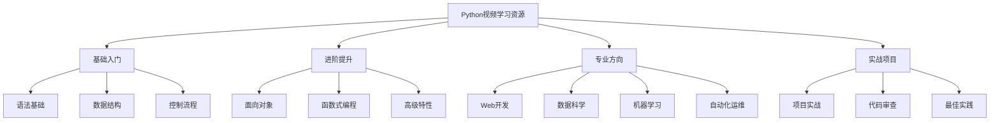

# 🎥 视频学习资源

## 🎯 核心理念

视频学习是Python技能提升的"加速器"。优质的视频资源能够将抽象概念可视化，让复杂的技术变得生动易懂。选择合适的学习视频，如同找到了一位经验丰富的导师，让学习之路更加高效。

### 📺 学习视频分类



## 📚 推荐视频资源

### 🌟 基础入门系列

#### **Python官方教程**
- **来源**: Python.org官方
- **时长**: 约8小时
- **难度**: ⭐⭐
- **特色**: 权威、系统、免费
- **链接**: https://docs.python.org/3/tutorial/
- **推荐理由**: Python之父Guido van Rossum参与制作，内容权威准确

#### **Python Crash Course**
- **讲师**: Eric Matthes
- **平台**: YouTube/各大平台
- **时长**: 12小时完整课程
- **难度**: ⭐⭐
- **特色**: 项目驱动学习
- **推荐理由**: 通过实际项目学习，理论与实践结合

#### **Python for Everybody**
- **讲师**: Dr. Charles Severance (密歇根大学)
- **平台**: Coursera/edX
- **时长**: 20小时
- **难度**: ⭐⭐
- **特色**: 大学课程质量，免费证书
- **推荐理由**: 系统性强，适合零基础学习者

### 🚀 进阶提升系列

#### **Real Python**
- **平台**: Real Python官网
- **类型**: 付费高质量教程
- **特色**: 深度技术解析
- **推荐课程**:
  - "Python Decorators: A Complete Guide"
  - "Understanding Python's Memory Management"
  - "Advanced Python Patterns"
- **推荐理由**: 内容深度高，适合有基础的学习者

#### **Python进阶技巧**
- **讲师**: Corey Schafer
- **平台**: YouTube
- **时长**: 50+ 视频
- **难度**: ⭐⭐⭐
- **特色**: 清晰讲解，代码示例丰富
- **推荐视频**:
  - "Python OOP Tutorial"
  - "Python Generators"
  - "Python Decorators"

#### **Python Tricks**
- **讲师**: Dan Bader
- **平台**: YouTube/个人网站
- **特色**: 实用技巧和最佳实践
- **推荐理由**: 学习Python的"隐藏技能"

### 🎯 专业方向视频

#### **Web开发方向**

**Django官方教程**
- **来源**: Django官方文档
- **时长**: 6小时
- **难度**: ⭐⭐⭐
- **特色**: 官方权威教程
- **项目**: 投票系统开发

**Flask Mega-Tutorial**
- **讲师**: Miguel Grinberg
- **平台**: YouTube/博客
- **时长**: 15小时
- **难度**: ⭐⭐⭐
- **特色**: 从零到完整Web应用
- **推荐理由**: 业界公认的最佳Flask教程

**FastAPI教程**
- **讲师**: Sebastian Ramirez (FastAPI作者)
- **平台**: YouTube
- **时长**: 8小时
- **难度**: ⭐⭐⭐
- **特色**: 现代API开发框架

#### **数据科学方向**

**Python for Data Science**
- **讲师**: Jose Portilla
- **平台**: Udemy
- **时长**: 25小时
- **难度**: ⭐⭐⭐
- **特色**: 完整的DS技能栈
- **包含**: NumPy, Pandas, Matplotlib, Seaborn

**数据科学实战**
- **讲师**: 吴恩达团队
- **平台**: Coursera
- **时长**: 30小时
- **难度**: ⭐⭐⭐⭐
- **特色**: 机器学习项目实战

#### **机器学习方向**

**Machine Learning with Python**
- **讲师**: Andrew Ng
- **平台**: Coursera
- **时长**: 40小时
- **难度**: ⭐⭐⭐⭐
- **特色**: 理论与实践并重
- **推荐理由**: 机器学习领域的经典课程

**Deep Learning Specialization**
- **讲师**: Andrew Ng
- **平台**: Coursera
- **时长**: 60小时
- **难度**: ⭐⭐⭐⭐⭐
- **特色**: 深度学习完整体系

### 🛠️ 实战项目视频

#### **全栈项目开发**

**Build a Social Network**
- **技术栈**: Django + React + PostgreSQL
- **时长**: 20小时
- **难度**: ⭐⭐⭐⭐
- **特色**: 完整的前后端开发

**E-commerce Platform**
- **技术栈**: Flask + Vue.js + MongoDB
- **时长**: 15小时
- **难度**: ⭐⭐⭐⭐
- **特色**: 电商系统开发

#### **数据科学项目**

**COVID-19数据分析**
- **工具**: Pandas + Matplotlib + Jupyter
- **时长**: 8小时
- **难度**: ⭐⭐⭐
- **特色**: 真实数据项目

**股票价格预测**
- **工具**: Scikit-learn + Pandas
- **时长**: 12小时
- **难度**: ⭐⭐⭐⭐
- **特色**: 金融数据分析

## 🎬 视频学习技巧

### 📝 高效观看策略

#### **1. 主动学习法**
```python
# 观看视频时的学习流程
def video_learning_process():
    """视频学习流程"""
    steps = [
        "1. 预习：了解视频大纲和知识点",
        "2. 观看：边看边做笔记",
        "3. 实践：暂停视频，动手敲代码",
        "4. 复习：总结关键概念",
        "5. 应用：尝试修改和扩展代码"
    ]
    return steps

# 学习效果最大化
learning_tips = {
    "观看速度": "1.25x-1.5x倍速观看",
    "暂停频率": "每5-10分钟暂停思考",
    "笔记方式": "思维导图 + 代码注释",
    "实践比例": "观看:实践 = 1:2",
    "复习周期": "当天、3天后、1周后"
}
```

#### **2. 项目驱动学习**
- **选择项目**: 选择与个人兴趣相关的项目
- **跟随编码**: 不要只看，要跟着敲代码
- **修改实验**: 尝试修改参数和逻辑
- **扩展功能**: 在原有基础上添加新功能

#### **3. 社区互动学习**
- **参与讨论**: 在视频评论区提问和讨论
- **分享作品**: 将学习成果分享到GitHub
- **寻求反馈**: 请经验丰富的开发者review代码

### 🎯 学习路径规划

#### **初学者路径 (0-6个月)**
```
Week 1-2: Python基础语法视频
Week 3-4: 数据结构与算法视频
Week 5-8: 面向对象编程视频
Week 9-12: 项目实战视频
Week 13-24: 专业方向选择深入学习
```

#### **进阶者路径 (6个月-2年)**
```
Month 1-3: 高级Python特性视频
Month 4-6: 框架深入学习视频
Month 7-12: 大型项目开发视频
Month 13-18: 架构设计视频
Month 19-24: 性能优化视频
```

## 📱 移动学习资源

### 📲 手机端视频平台

#### **Bilibili (B站)**
- **优势**: 免费、内容丰富、弹幕互动
- **推荐UP主**:
  - "黑马程序员": 系统性课程
  - "千锋教育": 实战项目
  - "尚硅谷": 深度技术解析

#### **YouTube**
- **优势**: 国际化内容、高质量教程
- **推荐频道**:
  - "Corey Schafer": Python基础到进阶
  - "Tech With Tim": 项目实战
  - "Real Python": 专业技巧

#### **腾讯课堂/网易云课堂**
- **优势**: 中文内容、系统性强
- **特色**: 有证书、有作业、有答疑

### 🎧 音频学习资源

#### **播客推荐**
- **Talk Python to Me**: Python社区访谈
- **Python Bytes**: 每周Python新闻
- **Real Python Podcast**: 深度技术讨论

## 🏆 学习效果评估

### 📊 视频学习检查清单

```python
def video_learning_checklist():
    """视频学习效果检查"""
    checklist = {
        "理解程度": [
            "能解释视频中的核心概念",
            "能独立编写类似代码",
            "能回答相关技术问题",
            "能应用到实际项目中"
        ],
        "实践能力": [
            "完成视频中的所有练习",
            "修改代码并理解结果",
            "解决遇到的错误",
            "扩展原有功能"
        ],
        "知识迁移": [
            "能将概念应用到新场景",
            "能教给其他人",
            "能发现视频中的不足",
            "能提出改进建议"
        ]
    }
    return checklist
```

### 🎯 学习目标设定

#### **短期目标 (1-3个月)**
- 完成基础语法视频学习
- 完成3-5个小项目
- 建立学习笔记体系

#### **中期目标 (3-12个月)**
- 选择专业方向深入学习
- 完成2-3个大型项目
- 参与开源项目贡献

#### **长期目标 (1-2年)**
- 成为某个领域的专家
- 能够独立设计和实现系统
- 能够指导他人学习

## 🔗 资源链接汇总

### 🌐 官方资源
- **Python官方**: https://www.python.org/
- **Django官方**: https://docs.djangoproject.com/
- **Flask官方**: https://flask.palletsprojects.com/
- **FastAPI官方**: https://fastapi.tiangolo.com/

### 📺 视频平台
- **Bilibili**: https://www.bilibili.com/
- **YouTube**: https://www.youtube.com/
- **Coursera**: https://www.coursera.org/
- **Udemy**: https://www.udemy.com/

### 🎧 音频资源
- **Talk Python to Me**: https://talkpython.fm/
- **Python Bytes**: https://pythonbytes.fm/
- **Real Python Podcast**: https://realpython.com/podcasts/

## 💡 学习建议

### 🎯 选择视频的标准
1. **内容质量**: 讲解清晰、逻辑性强
2. **实践性**: 有足够的代码示例
3. **更新性**: 内容与最新版本同步
4. **互动性**: 有社区支持和讨论
5. **系统性**: 覆盖完整的知识体系

### ⚡ 提高学习效率
1. **制定计划**: 设定明确的学习目标和时间
2. **专注学习**: 关闭干扰，专注观看
3. **及时实践**: 边看边练，加深理解
4. **定期复习**: 巩固已学知识
5. **分享交流**: 与他人讨论，获得反馈

视频学习是Python技能提升的重要途径，选择合适的学习资源，采用科学的学习方法，坚持不懈地实践，你一定能成为Python专家！🚀
