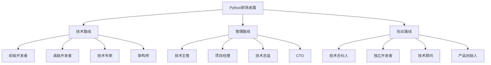

# 💼 Python职场进阶指南

## 🎯 核心理念

Python不仅是编程语言，更是职场发展的"加速器"。掌握Python技能，意味着拥有了在数字化时代立足的核心竞争力。从初级开发者到技术专家，从技术岗位到管理岗位，Python技能将伴随你的整个职业生涯，成为你职场成功的基石。

### 🚀 职场发展路径图



## 📈 职业发展阶段

### 🌱 初级阶段 (0-2年)

#### **技能要求**
```python
# 初级Python开发者技能清单
junior_skills = {
    "编程基础": [
        "Python语法掌握",
        "数据结构与算法基础",
        "面向对象编程",
        "异常处理",
        "文件操作"
    ],
    "开发工具": [
        "IDE使用 (PyCharm/VSCode)",
        "版本控制 (Git)",
        "调试技巧",
        "单元测试基础"
    ],
    "框架应用": [
        "Django/Flask基础",
        "数据库操作",
        "API开发基础",
        "前端基础 (HTML/CSS/JS)"
    ],
    "软技能": [
        "代码规范",
        "文档编写",
        "团队协作",
        "学习能力"
    ]
}
```

#### **薪资范围**
- **一线城市**: 8-15K
- **二线城市**: 6-12K
- **三线城市**: 5-10K

#### **典型岗位**
- Python开发工程师
- 后端开发工程师
- 数据分析师
- 自动化测试工程师

#### **成长建议**
1. **夯实基础**: 深入学习Python核心特性
2. **项目实践**: 完成3-5个完整项目
3. **代码质量**: 学习编写高质量代码
4. **技术社区**: 参与开源项目，建立技术影响力

### 🌿 中级阶段 (2-5年)

#### **技能要求**
```python
# 中级Python开发者技能清单
intermediate_skills = {
    "技术深度": [
        "高级Python特性",
        "设计模式应用",
        "性能优化",
        "并发编程",
        "内存管理"
    ],
    "系统设计": [
        "微服务架构",
        "分布式系统",
        "数据库设计",
        "缓存策略",
        "消息队列"
    ],
    "工程能力": [
        "CI/CD流程",
        "容器化部署",
        "监控与日志",
        "安全防护",
        "代码审查"
    ],
    "业务理解": [
        "需求分析",
        "技术选型",
        "架构设计",
        "团队协作",
        "项目管理"
    ]
}
```

#### **薪资范围**
- **一线城市**: 15-25K
- **二线城市**: 12-20K
- **三线城市**: 10-16K

#### **典型岗位**
- 高级Python开发工程师
- 技术负责人
- 全栈开发工程师
- 数据工程师

#### **成长建议**
1. **技术专精**: 选择1-2个技术方向深入
2. **系统思维**: 学习大型系统设计
3. **团队协作**: 提升沟通和协作能力
4. **业务理解**: 深入了解业务逻辑

### 🌳 高级阶段 (5-10年)

#### **技能要求**
```python
# 高级Python开发者技能清单
senior_skills = {
    "技术领导": [
        "技术架构设计",
        "技术选型决策",
        "团队技术指导",
        "技术难题解决",
        "创新技术探索"
    ],
    "系统架构": [
        "分布式架构",
        "高并发处理",
        "数据架构设计",
        "安全架构",
        "运维架构"
    ],
    "管理能力": [
        "团队管理",
        "项目管理",
        "技术规划",
        "人才培养",
        "跨部门协作"
    ],
    "商业思维": [
        "商业模式理解",
        "技术商业价值",
        "产品思维",
        "用户体验",
        "市场趋势"
    ]
}
```

#### **薪资范围**
- **一线城市**: 25-40K
- **二线城市**: 20-30K
- **三线城市**: 16-25K

#### **典型岗位**
- 技术专家
- 架构师
- 技术总监
- CTO

#### **成长建议**
1. **技术深度**: 成为某个领域的专家
2. **管理能力**: 学习团队管理和项目管理
3. **商业思维**: 理解技术和商业的结合
4. **行业影响**: 建立行业影响力

## 🎯 专业方向选择

### 🌐 Web开发方向

#### **技术栈**
```python
web_tech_stack = {
    "后端框架": ["Django", "Flask", "FastAPI", "Tornado"],
    "前端技术": ["React", "Vue.js", "Angular", "HTML/CSS/JS"],
    "数据库": ["PostgreSQL", "MySQL", "MongoDB", "Redis"],
    "部署运维": ["Docker", "Kubernetes", "Nginx", "AWS/Azure"],
    "监控工具": ["Prometheus", "Grafana", "ELK Stack"]
}
```

#### **职业发展路径**
- **初级**: Web开发工程师
- **中级**: 全栈开发工程师
- **高级**: 技术架构师
- **专家**: Web技术专家

#### **薪资前景**
- **市场需求**: ⭐⭐⭐⭐⭐
- **薪资水平**: ⭐⭐⭐⭐
- **发展空间**: ⭐⭐⭐⭐⭐

### 📊 数据科学方向

#### **技术栈**
```python
data_science_stack = {
    "数据处理": ["Pandas", "NumPy", "Dask"],
    "机器学习": ["Scikit-learn", "TensorFlow", "PyTorch"],
    "数据可视化": ["Matplotlib", "Seaborn", "Plotly"],
    "大数据": ["Spark", "Hadoop", "Kafka"],
    "数据库": ["PostgreSQL", "MongoDB", "ClickHouse"]
}
```

#### **职业发展路径**
- **初级**: 数据分析师
- **中级**: 数据科学家
- **高级**: 数据架构师
- **专家**: AI/ML专家

#### **薪资前景**
- **市场需求**: ⭐⭐⭐⭐⭐
- **薪资水平**: ⭐⭐⭐⭐⭐
- **发展空间**: ⭐⭐⭐⭐⭐

### 🤖 机器学习方向

#### **技术栈**
```python
ml_tech_stack = {
    "深度学习": ["TensorFlow", "PyTorch", "Keras"],
    "传统ML": ["Scikit-learn", "XGBoost", "LightGBM"],
    "数据处理": ["Pandas", "NumPy", "OpenCV"],
    "模型部署": ["Flask", "FastAPI", "Docker"],
    "云平台": ["AWS SageMaker", "Azure ML", "GCP AI"]
}
```

#### **职业发展路径**
- **初级**: 机器学习工程师
- **中级**: 算法工程师
- **高级**: AI技术专家
- **专家**: 首席AI科学家

#### **薪资前景**
- **市场需求**: ⭐⭐⭐⭐⭐
- **薪资水平**: ⭐⭐⭐⭐⭐
- **发展空间**: ⭐⭐⭐⭐⭐

### 🔧 自动化运维方向

#### **技术栈**
```python
devops_stack = {
    "自动化工具": ["Ansible", "SaltStack", "Chef"],
    "容器化": ["Docker", "Kubernetes", "Helm"],
    "CI/CD": ["Jenkins", "GitLab CI", "GitHub Actions"],
    "监控": ["Prometheus", "Grafana", "ELK"],
    "云平台": ["AWS", "Azure", "GCP", "阿里云"]
}
```

#### **职业发展路径**
- **初级**: 运维工程师
- **中级**: DevOps工程师
- **高级**: 平台架构师
- **专家**: 基础设施专家

#### **薪资前景**
- **市场需求**: ⭐⭐⭐⭐
- **薪资水平**: ⭐⭐⭐⭐
- **发展空间**: ⭐⭐⭐⭐

## 💰 薪资谈判技巧

### 🎯 薪资调研

#### **调研渠道**
```python
salary_research_channels = {
    "在线平台": [
        "拉勾网",
        "Boss直聘", 
        "智联招聘",
        "前程无忧"
    ],
    "专业网站": [
        "Stack Overflow Survey",
        "GitHub Salary",
        "Levels.fyi",
        "PayScale"
    ],
    "行业报告": [
        "CSDN开发者报告",
        "InfoQ技术报告",
        "各公司薪资报告"
    ],
    "人脉网络": [
        "技术社区",
        "行业聚会",
        "同事朋友",
        "猎头顾问"
    ]
}
```

#### **薪资影响因素**
```python
salary_factors = {
    "技术因素": {
        "技能水平": "权重30%",
        "项目经验": "权重25%",
        "技术深度": "权重20%"
    },
    "市场因素": {
        "城市等级": "权重15%",
        "行业类型": "权重10%",
        "公司规模": "权重10%"
    },
    "个人因素": {
        "学历背景": "权重5%",
        "软技能": "权重5%",
        "谈判能力": "权重5%"
    }
}
```

### 💬 谈判策略

#### **谈判准备**
1. **市场调研**: 了解同岗位薪资范围
2. **价值梳理**: 总结个人技能和贡献
3. **底线设定**: 确定最低可接受薪资
4. **替代方案**: 准备其他福利要求

#### **谈判技巧**
```python
negotiation_tips = {
    "开场策略": [
        "表达对职位的兴趣",
        "强调个人价值",
        "提出合理期望"
    ],
    "讨论过程": [
        "基于市场数据",
        "强调技能匹配",
        "展示项目成果",
        "提出成长空间"
    ],
    "收尾技巧": [
        "总结双方共识",
        "确认具体细节",
        "设定回复期限",
        "保持友好关系"
    ]
}
```

## 🏢 公司选择指南

### 🎯 公司类型分析

#### **互联网大厂**
```python
big_tech_companies = {
    "优势": [
        "技术先进",
        "薪资丰厚",
        "成长空间大",
        "技术影响力"
    ],
    "劣势": [
        "工作强度大",
        "竞争激烈",
        "压力较大",
        "个人时间少"
    ],
    "适合人群": [
        "技术追求者",
        "快速成长需求",
        "抗压能力强",
        "年轻开发者"
    ]
}
```

#### **传统企业**
```python
traditional_companies = {
    "优势": [
        "工作稳定",
        "压力较小",
        "福利完善",
        "工作生活平衡"
    ],
    "劣势": [
        "技术相对落后",
        "薪资增长慢",
        "创新空间小",
        "晋升周期长"
    ],
    "适合人群": [
        "追求稳定",
        "家庭责任重",
        "技术更新慢",
        "经验丰富者"
    ]
}
```

#### **创业公司**
```python
startup_companies = {
    "优势": [
        "成长空间大",
        "技术自由度大",
        "股权激励",
        "快速晋升"
    ],
    "劣势": [
        "风险较高",
        "资源有限",
        "工作强度大",
        "不确定性"
    ],
    "适合人群": [
        "风险承受能力强",
        "追求快速成长",
        "技术全栈能力",
        "年轻有冲劲"
    ]
}
```

### 🔍 公司评估维度

#### **技术环境**
- **技术栈**: 是否使用主流技术
- **技术氛围**: 是否有技术分享文化
- **创新程度**: 是否鼓励技术创新
- **技术投入**: 是否有足够的技术投入

#### **团队文化**
- **协作氛围**: 团队协作是否顺畅
- **学习环境**: 是否有学习成长机会
- **管理风格**: 管理方式是否合适
- **价值观**: 公司价值观是否匹配

#### **发展前景**
- **行业前景**: 所在行业是否有前景
- **公司发展**: 公司是否有发展潜力
- **个人成长**: 是否有个人成长空间
- **晋升通道**: 是否有清晰的晋升通道

## 📚 持续学习策略

### 🎯 学习规划

#### **年度学习计划**
```python
annual_learning_plan = {
    "Q1": {
        "目标": "技术深度提升",
        "重点": "深入学习1-2个技术方向",
        "成果": "完成技术认证或项目"
    },
    "Q2": {
        "目标": "软技能提升",
        "重点": "沟通、管理、领导力",
        "成果": "参与团队管理或项目"
    },
    "Q3": {
        "目标": "行业趋势学习",
        "重点": "新技术、新框架",
        "成果": "技术分享或文章"
    },
    "Q4": {
        "目标": "综合能力提升",
        "重点": "业务理解、商业思维",
        "成果": "业务项目或创业"
    }
}
```

#### **学习资源**
```python
learning_resources = {
    "在线课程": [
        "Coursera",
        "edX", 
        "Udemy",
        "极客时间"
    ],
    "技术社区": [
        "GitHub",
        "Stack Overflow",
        "掘金",
        "CSDN"
    ],
    "技术会议": [
        "PyCon",
        "QCon",
        "ArchSummit",
        "DevOps大会"
    ],
    "书籍推荐": [
        "《Python核心编程》",
        "《设计模式》",
        "《系统设计》",
        "《技术管理》"
    ]
}
```

### 🎯 技能提升路径

#### **技术技能**
1. **深度技能**: 选择1-2个技术方向深入
2. **广度技能**: 了解相关技术栈
3. **前沿技能**: 关注新技术趋势
4. **实践技能**: 通过项目验证技能

#### **软技能**
1. **沟通能力**: 提升表达和倾听能力
2. **协作能力**: 学会团队合作
3. **领导能力**: 学习管理和指导
4. **学习能力**: 保持持续学习习惯

#### **商业技能**
1. **业务理解**: 深入了解业务逻辑
2. **产品思维**: 从用户角度思考
3. **商业思维**: 理解技术和商业结合
4. **创新思维**: 培养创新意识

## 🌟 职场成功秘诀

### 🎯 成功要素

#### **技术能力**
- **扎实基础**: 掌握核心技术
- **持续学习**: 跟上技术发展
- **实践能力**: 能够解决实际问题
- **创新思维**: 能够提出创新方案

#### **软技能**
- **沟通表达**: 能够清晰表达想法
- **团队协作**: 能够有效协作
- **问题解决**: 能够分析解决问题
- **学习适应**: 能够快速学习适应

#### **职业素养**
- **责任心**: 对工作负责
- **主动性**: 主动承担任务
- **专业性**: 保持专业水准
- **诚信度**: 诚实守信

### 🚀 加速成长策略

#### **快速提升技巧**
1. **项目驱动**: 通过项目学习技术
2. **导师指导**: 寻找经验丰富的导师
3. **社区参与**: 积极参与技术社区
4. **知识分享**: 通过分享巩固知识

#### **职业发展加速器**
1. **技术认证**: 获得权威技术认证
2. **开源贡献**: 参与开源项目
3. **技术分享**: 在会议或社区分享
4. **行业影响**: 建立行业影响力

## 💡 职场建议

### 🎯 给初入职场者的建议
1. **夯实基础**: 不要急于求成，先打好基础
2. **多实践**: 理论结合实践，多做项目
3. **多交流**: 与同事和社区多交流学习
4. **保持学习**: 技术更新快，要保持学习

### 🎯 给中级开发者的建议
1. **选择方向**: 选择1-2个技术方向深入
2. **提升软技能**: 技术之外也要提升软技能
3. **承担更多责任**: 主动承担更多工作
4. **建立影响力**: 在团队和社区建立影响力

### 🎯 给高级开发者的建议
1. **技术领导**: 成为技术团队的领导者
2. **业务理解**: 深入理解业务需求
3. **人才培养**: 培养和指导团队成员
4. **创新驱动**: 推动技术创新和业务发展

Python职场发展是一个长期的过程，需要持续学习、实践和成长。选择合适的发展方向，制定清晰的学习计划，不断提升技术能力和软技能，你一定能在Python职场中取得成功！🚀
