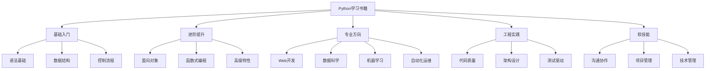

# 📖 推荐阅读清单

## 🎯 核心理念

阅读是Python技能提升的"智慧源泉"。优秀的书籍能够提供系统性的知识体系，深入的技术洞察，以及经过时间验证的最佳实践。选择合适的学习书籍，如同找到了一位经验丰富的导师，让学习之路更加系统化和深入化。

### 📚 学习书籍分类



## 🌟 必读经典书籍

### 📖 基础入门系列

#### **《Python核心编程》(Core Python Programming)**
- **作者**: Wesley J. Chun
- **难度**: ⭐⭐
- **页数**: 800+
- **推荐指数**: ⭐⭐⭐⭐⭐
- **适合人群**: Python初学者
- **核心内容**:
  - Python语法基础
  - 数据类型和结构
  - 面向对象编程
  - 异常处理
  - 文件操作
- **推荐理由**: 内容全面，讲解详细，是Python学习的经典教材

#### **《Python学习手册》(Learning Python)**
- **作者**: Mark Lutz
- **难度**: ⭐⭐
- **页数**: 1600+
- **推荐指数**: ⭐⭐⭐⭐⭐
- **适合人群**: 有编程基础的初学者
- **核心内容**:
  - Python语言特性
  - 内置数据类型
  - 语句和语法
  - 函数和模块
  - 类和OOP
- **推荐理由**: 内容深入，适合系统学习Python

#### **《Python编程：从入门到实践》(Python Crash Course)**
- **作者**: Eric Matthes
- **难度**: ⭐⭐
- **页数**: 500+
- **推荐指数**: ⭐⭐⭐⭐⭐
- **适合人群**: 零基础学习者
- **核心内容**:
  - 基础语法
  - 项目实战
  - 数据可视化
  - Web应用开发
- **推荐理由**: 项目驱动学习，理论与实践结合

### 🚀 进阶提升系列

#### **《流畅的Python》(Fluent Python)**
- **作者**: Luciano Ramalho
- **难度**: ⭐⭐⭐⭐
- **页数**: 700+
- **推荐指数**: ⭐⭐⭐⭐⭐
- **适合人群**: 有Python基础的开发者
- **核心内容**:
  - Python数据模型
  - 数据结构
  - 函数作为对象
  - 面向对象惯用法
  - 控制流程
  - 元编程
- **推荐理由**: 深入理解Python的高级特性，提升代码质量

#### **《Effective Python》(Effective Python)**
- **作者**: Brett Slatkin
- **难度**: ⭐⭐⭐⭐
- **页数**: 300+
- **推荐指数**: ⭐⭐⭐⭐⭐
- **适合人群**: 中级Python开发者
- **核心内容**:
  - Python最佳实践
  - 常见陷阱避免
  - 性能优化技巧
  - 代码质量提升
- **推荐理由**: 59个具体建议，提升Python编程水平

#### **《Python Cookbook》**
- **作者**: David Beazley & Brian K. Jones
- **难度**: ⭐⭐⭐⭐
- **页数**: 700+
- **推荐指数**: ⭐⭐⭐⭐⭐
- **适合人群**: 有经验的Python开发者
- **核心内容**:
  - 数据结构算法
  - 字符串和文本
  - 数字、日期和时间
  - 迭代器和生成器
  - 文件和I/O
  - 数据编码与处理
  - 函数
  - 类与对象
  - 元编程
  - 模块和包
  - 网络和Web编程
  - 并发
  - 实用脚本和系统管理
  - 测试、调试以及异常
  - C语言扩展
- **推荐理由**: 实用的代码示例，解决实际开发问题

### 🎯 专业方向书籍

#### **Web开发方向**

**《Django实战》(Two Scoops of Django)**
- **作者**: Daniel Roy Greenfeld & Audrey Roy Greenfeld
- **难度**: ⭐⭐⭐⭐
- **推荐指数**: ⭐⭐⭐⭐⭐
- **核心内容**:
  - Django最佳实践
  - 项目结构设计
  - 安全考虑
  - 性能优化
- **推荐理由**: Django开发的权威指南

**《Flask Web开发》(Flask Web Development)**
- **作者**: Miguel Grinberg
- **难度**: ⭐⭐⭐
- **推荐指数**: ⭐⭐⭐⭐⭐
- **核心内容**:
  - Flask框架深入
  - Web应用开发
  - 数据库集成
  - 用户认证
- **推荐理由**: Flask学习的经典教程

**《FastAPI实战》(FastAPI: Modern Python Web APIs)**
- **作者**: Bill Lubanovic
- **难度**: ⭐⭐⭐
- **推荐指数**: ⭐⭐⭐⭐
- **核心内容**:
  - FastAPI框架
  - API设计
  - 异步编程
  - 数据验证
- **推荐理由**: 现代Python Web API开发

#### **数据科学方向**

**《利用Python进行数据分析》(Python for Data Analysis)**
- **作者**: Wes McKinney
- **难度**: ⭐⭐⭐
- **推荐指数**: ⭐⭐⭐⭐⭐
- **核心内容**:
  - Pandas数据处理
  - NumPy数值计算
  - 数据清洗
  - 数据可视化
- **推荐理由**: 数据分析的经典教材，Pandas作者编写

**《Python数据科学手册》(Python Data Science Handbook)**
- **作者**: Jake VanderPlas
- **难度**: ⭐⭐⭐⭐
- **推荐指数**: ⭐⭐⭐⭐⭐
- **核心内容**:
  - NumPy和Pandas
  - Matplotlib可视化
  - Scikit-learn机器学习
  - Jupyter Notebook
- **推荐理由**: 数据科学完整技能栈

**《统计学习方法》**
- **作者**: 李航
- **难度**: ⭐⭐⭐⭐⭐
- **推荐指数**: ⭐⭐⭐⭐⭐
- **核心内容**:
  - 统计学习理论
  - 机器学习算法
  - 数学推导
  - 算法实现
- **推荐理由**: 机器学习理论基础

#### **机器学习方向**

**《机器学习实战》(Hands-On Machine Learning)**
- **作者**: Aurélien Géron
- **难度**: ⭐⭐⭐⭐
- **推荐指数**: ⭐⭐⭐⭐⭐
- **核心内容**:
  - 机器学习基础
  - Scikit-learn应用
  - TensorFlow深度学习
  - 项目实战
- **推荐理由**: 理论与实践并重，代码示例丰富

**《深度学习》(Deep Learning)**
- **作者**: Ian Goodfellow, Yoshua Bengio, Aaron Courville
- **难度**: ⭐⭐⭐⭐⭐
- **推荐指数**: ⭐⭐⭐⭐⭐
- **核心内容**:
  - 深度学习理论
  - 神经网络
  - 优化算法
  - 应用领域
- **推荐理由**: 深度学习领域的权威教材

**《Python机器学习》(Python Machine Learning)**
- **作者**: Sebastian Raschka
- **难度**: ⭐⭐⭐⭐
- **推荐指数**: ⭐⭐⭐⭐⭐
- **核心内容**:
  - 机器学习算法
  - Scikit-learn应用
  - 数据预处理
  - 模型评估
- **推荐理由**: 机器学习实践指南

### 🛠️ 工程实践书籍

#### **代码质量与设计**

**《代码整洁之道》(Clean Code)**
- **作者**: Robert C. Martin
- **难度**: ⭐⭐⭐⭐
- **推荐指数**: ⭐⭐⭐⭐⭐
- **核心内容**:
  - 代码规范
  - 函数设计
  - 类设计
  - 错误处理
  - 单元测试
- **推荐理由**: 编写高质量代码的经典指南

**《重构：改善既有代码的设计》(Refactoring)**
- **作者**: Martin Fowler
- **难度**: ⭐⭐⭐⭐
- **推荐指数**: ⭐⭐⭐⭐⭐
- **核心内容**:
  - 重构原则
  - 重构技巧
  - 代码异味识别
  - 重构实践
- **推荐理由**: 改善代码质量的实用指南

**《设计模式》(Design Patterns)**
- **作者**: Gang of Four
- **难度**: ⭐⭐⭐⭐⭐
- **推荐指数**: ⭐⭐⭐⭐⭐
- **核心内容**:
  - 23种设计模式
  - 面向对象设计原则
  - 模式应用场景
  - 代码示例
- **推荐理由**: 软件设计的经典教材

#### **架构与系统设计**

**《架构整洁之道》(Clean Architecture)**
- **作者**: Robert C. Martin
- **难度**: ⭐⭐⭐⭐⭐
- **推荐指数**: ⭐⭐⭐⭐⭐
- **核心内容**:
  - 软件架构原则
  - 依赖管理
  - 组件设计
  - 架构模式
- **推荐理由**: 软件架构设计的权威指南

**《微服务设计》(Microservices)**
- **作者**: Sam Newman
- **难度**: ⭐⭐⭐⭐
- **推荐指数**: ⭐⭐⭐⭐⭐
- **核心内容**:
  - 微服务架构
  - 服务拆分
  - 数据管理
  - 部署策略
- **推荐理由**: 微服务架构实践指南

**《系统设计面试》(System Design Interview)**
- **作者**: Alex Xu
- **难度**: ⭐⭐⭐⭐
- **推荐指数**: ⭐⭐⭐⭐⭐
- **核心内容**:
  - 系统设计原则
  - 常见系统设计
  - 面试准备
  - 案例分析
- **推荐理由**: 系统设计面试必备

#### **测试与质量保证**

**《测试驱动开发》(Test-Driven Development)**
- **作者**: Kent Beck
- **难度**: ⭐⭐⭐⭐
- **推荐指数**: ⭐⭐⭐⭐⭐
- **核心内容**:
  - TDD原则
  - 单元测试
  - 重构技巧
  - 实践案例
- **推荐理由**: TDD方法的经典教材

**《Python测试驱动开发》(Test-Driven Development with Python)**
- **作者**: Harry Percival
- **难度**: ⭐⭐⭐⭐
- **推荐指数**: ⭐⭐⭐⭐⭐
- **核心内容**:
  - Python TDD实践
  - Django测试
  - Selenium测试
  - 持续集成
- **推荐理由**: Python TDD实践指南

### 🧠 软技能书籍

#### **沟通与协作**

**《非暴力沟通》(Nonviolent Communication)**
- **作者**: Marshall B. Rosenberg
- **难度**: ⭐⭐⭐
- **推荐指数**: ⭐⭐⭐⭐⭐
- **核心内容**:
  - 沟通技巧
  - 情绪管理
  - 冲突解决
  - 团队协作
- **推荐理由**: 提升沟通能力的经典书籍

**《关键对话》(Crucial Conversations)**
- **作者**: Kerry Patterson, Joseph Grenny, Ron McMillan, Al Switzler
- **难度**: ⭐⭐⭐
- **推荐指数**: ⭐⭐⭐⭐⭐
- **核心内容**:
  - 关键对话技巧
  - 情绪控制
  - 观点表达
  - 共识达成
- **推荐理由**: 处理重要对话的实用指南

#### **项目管理**

**《敏捷软件开发》(Agile Software Development)**
- **作者**: Robert C. Martin
- **难度**: ⭐⭐⭐⭐
- **推荐指数**: ⭐⭐⭐⭐⭐
- **核心内容**:
  - 敏捷原则
  - 软件开发实践
  - 团队协作
  - 项目管理
- **推荐理由**: 敏捷开发的理论基础

**《Scrum敏捷软件开发》(Succeeding with Agile)**
- **作者**: Mike Cohn
- **难度**: ⭐⭐⭐
- **推荐指数**: ⭐⭐⭐⭐⭐
- **核心内容**:
  - Scrum框架
  - 敏捷实践
  - 团队管理
  - 项目管理
- **推荐理由**: Scrum实践的实用指南

#### **技术管理**

**《技术领导力》(The Manager's Path)**
- **作者**: Camille Fournier
- **难度**: ⭐⭐⭐⭐
- **推荐指数**: ⭐⭐⭐⭐⭐
- **核心内容**:
  - 技术管理
  - 团队建设
  - 职业发展
  - 领导力
- **推荐理由**: 技术管理者的成长指南

**《人月神话》(The Mythical Man-Month)**
- **作者**: Frederick P. Brooks Jr.
- **难度**: ⭐⭐⭐⭐
- **推荐指数**: ⭐⭐⭐⭐⭐
- **核心内容**:
  - 软件工程管理
  - 项目管理
  - 团队协作
  - 软件开发
- **推荐理由**: 软件工程管理的经典著作

## 📖 阅读策略与技巧

### 🎯 阅读方法

#### **SQ3R阅读法**
```python
def sq3r_reading_method():
    """SQ3R阅读法"""
    steps = {
        "Survey": "浏览全书，了解结构",
        "Question": "提出问题，明确目标",
        "Read": "仔细阅读，理解内容",
        "Recite": "复述内容，检验理解",
        "Review": "复习回顾，巩固记忆"
    }
    return steps
```

#### **主题阅读法**
```python
def thematic_reading():
    """主题阅读法"""
    process = {
        "选择主题": "确定学习主题",
        "收集书籍": "收集相关书籍",
        "制定计划": "制定阅读计划",
        "对比阅读": "对比不同观点",
        "总结归纳": "形成自己的理解"
    }
    return process
```

### 📝 读书笔记

#### **笔记方法**
1. **思维导图**: 用思维导图整理知识结构
2. **代码笔记**: 记录重要的代码示例
3. **实践笔记**: 记录实践中的问题和解决方案
4. **总结笔记**: 定期总结学习成果

#### **笔记工具**
```python
note_taking_tools = {
    "数字工具": [
        "Notion",
        "Obsidian", 
        "Typora",
        "Markdown"
    ],
    "传统工具": [
        "纸质笔记本",
        "便签纸",
        "高亮笔",
        "标签贴"
    ]
}
```

### 🔄 复习策略

#### **遗忘曲线复习**
```python
def spaced_repetition_schedule():
    """间隔复习计划"""
    schedule = {
        "第1天": "学习后立即复习",
        "第3天": "3天后复习",
        "第7天": "1周后复习", 
        "第15天": "2周后复习",
        "第30天": "1个月后复习",
        "第90天": "3个月后复习"
    }
    return schedule
```

## 📚 推荐阅读计划

### 🎯 初学者阅读计划 (6个月)

#### **第1-2个月: 基础入门**
- 《Python编程：从入门到实践》
- 《Python学习手册》(前8章)

#### **第3-4个月: 进阶提升**
- 《Python学习手册》(后8章)
- 《Python核心编程》(选读)

#### **第5-6个月: 实践应用**
- 《Python Cookbook》(选读)
- 选择专业方向书籍

### 🎯 中级开发者阅读计划 (12个月)

#### **第1-3个月: 深度理解**
- 《流畅的Python》
- 《Effective Python》

#### **第4-6个月: 专业方向**
- 根据专业方向选择2-3本书
- 《Python Cookbook》

#### **第7-9个月: 工程实践**
- 《代码整洁之道》
- 《重构》
- 《设计模式》

#### **第10-12个月: 软技能**
- 《非暴力沟通》
- 《关键对话》
- 技术管理相关书籍

### 🎯 高级开发者阅读计划 (18个月)

#### **第1-6个月: 架构设计**
- 《架构整洁之道》
- 《微服务设计》
- 《系统设计面试》

#### **第7-12个月: 技术管理**
- 《技术领导力》
- 《人月神话》
- 《敏捷软件开发》

#### **第13-18个月: 前沿技术**
- 最新技术书籍
- 行业报告
- 技术论文

## 💡 阅读建议

### 🎯 选择书籍的标准
1. **内容质量**: 内容准确、深入、实用
2. **作者权威**: 作者在该领域有权威性
3. **更新程度**: 内容与最新技术同步
4. **评价口碑**: 业界评价和推荐度高
5. **适合程度**: 符合当前学习水平

### ⚡ 提高阅读效率
1. **制定计划**: 设定明确的阅读目标和时间
2. **专注阅读**: 选择安静环境，专注阅读
3. **主动思考**: 边读边思考，提出问题
4. **及时实践**: 阅读后及时实践验证
5. **定期复习**: 定期复习巩固记忆

### 📖 阅读习惯培养
1. **每日阅读**: 每天至少阅读30分钟
2. **笔记习惯**: 养成做读书笔记的习惯
3. **分享交流**: 与他人分享阅读心得
4. **应用实践**: 将书中知识应用到实际项目
5. **持续学习**: 保持终身学习的习惯

阅读是Python技能提升的重要途径，选择合适的学习书籍，采用科学的阅读方法，坚持不懈地学习，你一定能成为Python专家！📚🚀
