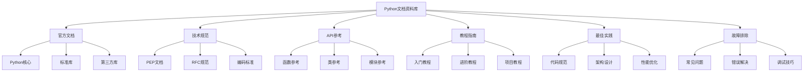

# 📚 文档资料库

## 🎯 核心理念

文档是Python技能提升的"知识宝库"。优质的文档资料能够提供权威的技术参考，详细的使用说明，以及丰富的示例代码。建立完善的文档资料库，如同拥有了一个随时可查阅的技术顾问，让学习和开发过程更加高效和准确。

### 📋 文档资料分类



## 🌟 官方文档资源

### 📖 Python核心文档

#### **Python官方文档**
- **网址**: https://docs.python.org/3/
- **语言**: 中文/英文
- **更新频率**: 随版本更新
- **内容覆盖**:
  - Python语言参考
  - 标准库参考
  - 语言教程
  - 扩展和嵌入
  - Python/C API参考
- **推荐理由**: 最权威的Python技术文档

#### **Python语言参考**
- **网址**: https://docs.python.org/3/reference/
- **内容**:
  - 词法分析
  - 数据模型
  - 执行模型
  - 表达式
  - 简单语句
  - 复合语句
  - 顶层组件
- **适用场景**: 深入理解Python语言机制

#### **Python标准库**
- **网址**: https://docs.python.org/3/library/
- **内容**:
  - 内置函数
  - 内置常量
  - 内置类型
  - 内置异常
  - 文本处理服务
  - 二进制数据服务
  - 数据类型
  - 数值和数学模块
  - 函数式编程模块
  - 文件和目录访问
  - 数据持久化
  - 数据压缩和存档
  - 文件格式
  - 加密服务
  - 通用操作系统服务
  - 并发执行
  - 进程间通信和网络
  - 互联网数据处理
  - 结构化标记处理工具
  - 互联网协议和支持
  - 多媒体服务
  - 国际化
  - 程序框架
  - 图形用户界面
  - 开发工具
  - 调试和分析
  - 软件打包和分发
  - Python运行时服务
  - 自定义Python解释器
  - 导入系统
  - 语言服务
  - 其他服务
- **适用场景**: 查找标准库函数和模块用法

### 🎯 技术规范文档

#### **PEP文档 (Python Enhancement Proposals)**
- **网址**: https://peps.python.org/
- **内容**:
  - PEP 8: Python代码风格指南
  - PEP 20: Python之禅
  - PEP 257: 文档字符串约定
  - PEP 484: 类型提示
  - PEP 526: 变量注释语法
  - PEP 557: 数据类
  - PEP 585: 内置泛型类型
  - PEP 604: 联合类型的新语法
- **推荐PEP**:
  ```python
  important_peps = {
      "PEP 8": "代码风格指南 - 必读",
      "PEP 20": "Python设计哲学 - 必读", 
      "PEP 257": "文档字符串规范 - 重要",
      "PEP 484": "类型提示 - 重要",
      "PEP 557": "数据类 - 实用",
      "PEP 585": "内置泛型 - 实用"
  }
  ```

#### **Python编码标准**
- **PEP 8**: Python代码风格指南
- **PEP 257**: 文档字符串约定
- **PEP 484**: 类型提示规范
- **PEP 526**: 变量注释语法
- **适用场景**: 编写符合Python规范的代码

### 🔧 框架文档

#### **Web开发框架**

**Django官方文档**
- **网址**: https://docs.djangoproject.com/
- **版本**: 4.2 LTS
- **内容**:
  - 入门教程
  - 模型和数据库
  - 视图和模板
  - 表单
  - 用户认证
  - 管理界面
  - 安全
  - 性能优化
  - 部署
- **特色**: 完整的Web开发解决方案

**Flask官方文档**
- **网址**: https://flask.palletsprojects.com/
- **版本**: 2.3.x
- **内容**:
  - 快速开始
  - 应用设置
  - 请求处理
  - 响应处理
  - 模板
  - 静态文件
  - 蓝图
  - 扩展
- **特色**: 轻量级Web框架

**FastAPI官方文档**
- **网址**: https://fastapi.tiangolo.com/
- **版本**: 0.104.x
- **内容**:
  - 快速开始
  - 路径参数
  - 查询参数
  - 请求体
  - 响应模型
  - 依赖注入
  - 安全
  - 中间件
- **特色**: 现代高性能API框架

#### **数据科学框架**

**NumPy官方文档**
- **网址**: https://numpy.org/doc/
- **内容**:
  - 用户指南
  - API参考
  - 开发者指南
  - 示例
- **特色**: 数值计算基础库

**Pandas官方文档**
- **网址**: https://pandas.pydata.org/docs/
- **内容**:
  - 用户指南
  - API参考
  - 开发者指南
  - 示例
- **特色**: 数据分析核心库

**Matplotlib官方文档**
- **网址**: https://matplotlib.org/stable/
- **内容**:
  - 用户指南
  - API参考
  - 示例库
  - 教程
- **特色**: 数据可视化库

**Scikit-learn官方文档**
- **网址**: https://scikit-learn.org/stable/
- **内容**:
  - 用户指南
  - API参考
  - 示例
  - 教程
- **特色**: 机器学习库

## 📖 教程指南文档

### 🎯 入门教程

#### **Python官方教程**
- **网址**: https://docs.python.org/3/tutorial/
- **内容**:
  - 开胃菜
  - 使用Python解释器
  - Python的非正式介绍
  - 更多控制流工具
  - 数据结构
  - 模块
  - 输入和输出
  - 错误和异常
  - 类
  - 标准库简介
  - 标准库简介 II
  - 虚拟环境和包
- **特色**: 官方权威教程

#### **Real Python教程**
- **网址**: https://realpython.com/
- **内容**:
  - Python基础
  - 中级Python
  - 高级Python
  - Web开发
  - 数据科学
  - 机器学习
- **特色**: 高质量付费教程

#### **Python.org教程**
- **网址**: https://www.python.org/about/gettingstarted/
- **内容**:
  - 初学者指南
  - 安装Python
  - 第一个程序
  - 学习资源
- **特色**: 官方入门指南

### 🚀 进阶教程

#### **Python进阶教程**
- **网址**: https://docs.python.org/3/tutorial/classes.html
- **内容**:
  - 面向对象编程
  - 装饰器
  - 生成器
  - 上下文管理器
  - 元编程
- **特色**: 深入Python高级特性

#### **Python性能优化**
- **网址**: https://docs.python.org/3/library/profile.html
- **内容**:
  - 性能分析
  - 内存优化
  - 算法优化
  - 并发优化
- **特色**: 性能调优指南

## 🛠️ API参考文档

### 📚 核心API

#### **内置函数**
```python
# 常用内置函数文档
builtin_functions = {
    "abs()": "返回数字的绝对值",
    "all()": "判断可迭代对象中所有元素是否为真",
    "any()": "判断可迭代对象中是否有元素为真",
    "bin()": "将整数转换为二进制字符串",
    "bool()": "返回布尔值",
    "chr()": "返回Unicode码点对应的字符",
    "dict()": "创建字典",
    "dir()": "返回对象的属性列表",
    "divmod()": "返回除法的商和余数",
    "enumerate()": "返回枚举对象",
    "eval()": "执行字符串表达式",
    "exec()": "执行字符串代码",
    "filter()": "过滤可迭代对象",
    "float()": "转换为浮点数",
    "format()": "格式化字符串",
    "frozenset()": "创建不可变集合",
    "getattr()": "获取对象属性",
    "globals()": "返回全局变量字典",
    "hasattr()": "检查对象是否有属性",
    "hash()": "返回对象的哈希值",
    "help()": "显示帮助信息",
    "hex()": "转换为十六进制字符串",
    "id()": "返回对象的内存地址",
    "input()": "获取用户输入",
    "int()": "转换为整数",
    "isinstance()": "检查对象类型",
    "issubclass()": "检查类继承关系",
    "iter()": "创建迭代器",
    "len()": "返回对象长度",
    "list()": "创建列表",
    "locals()": "返回局部变量字典",
    "map()": "对可迭代对象应用函数",
    "max()": "返回最大值",
    "min()": "返回最小值",
    "next()": "获取迭代器下一个元素",
    "oct()": "转换为八进制字符串",
    "open()": "打开文件",
    "ord()": "返回字符的Unicode码点",
    "pow()": "幂运算",
    "print()": "打印输出",
    "range()": "创建数字序列",
    "repr()": "返回对象的字符串表示",
    "reversed()": "返回反向迭代器",
    "round()": "四舍五入",
    "set()": "创建集合",
    "setattr()": "设置对象属性",
    "slice()": "创建切片对象",
    "sorted()": "返回排序后的列表",
    "str()": "转换为字符串",
    "sum()": "求和",
    "tuple()": "创建元组",
    "type()": "返回对象类型",
    "vars()": "返回对象的__dict__属性",
    "zip()": "将多个可迭代对象打包"
}
```

#### **内置类型**
```python
# 内置类型文档
builtin_types = {
    "数字类型": ["int", "float", "complex"],
    "序列类型": ["str", "list", "tuple", "range"],
    "集合类型": ["set", "frozenset"],
    "映射类型": ["dict"],
    "其他类型": ["bool", "NoneType", "bytes", "bytearray"]
}
```

### 🔧 标准库API

#### **常用模块**
```python
# 标准库常用模块
standard_modules = {
    "os": "操作系统接口",
    "sys": "系统特定参数和函数",
    "json": "JSON数据处理",
    "datetime": "日期和时间处理",
    "re": "正则表达式",
    "math": "数学函数",
    "random": "随机数生成",
    "collections": "特殊容器类型",
    "itertools": "迭代器函数",
    "functools": "高阶函数",
    "operator": "操作符函数",
    "pathlib": "面向对象的文件系统路径",
    "urllib": "URL处理",
    "http": "HTTP协议",
    "email": "电子邮件处理",
    "csv": "CSV文件处理",
    "xml": "XML处理",
    "sqlite3": "SQLite数据库",
    "threading": "线程",
    "multiprocessing": "多进程",
    "asyncio": "异步I/O",
    "logging": "日志记录",
    "unittest": "单元测试",
    "pdb": "调试器",
    "profile": "性能分析",
    "timeit": "时间测量",
    "trace": "程序跟踪",
    "gc": "垃圾回收",
    "weakref": "弱引用",
    "copy": "浅拷贝和深拷贝",
    "pickle": "对象序列化",
    "shelve": "持久化字典",
    "dbm": "数据库接口",
    "zlib": "数据压缩",
    "gzip": "GZIP文件处理",
    "bz2": "BZ2文件处理",
    "tarfile": "TAR文件处理",
    "zipfile": "ZIP文件处理",
    "hashlib": "安全哈希",
    "hmac": "HMAC算法",
    "secrets": "安全随机数",
    "uuid": "UUID生成",
    "base64": "Base64编码",
    "binascii": "二进制和ASCII转换",
    "struct": "字节打包和解包",
    "array": "数组",
    "memoryview": "内存视图",
    "ctypes": "C类型",
    "locale": "国际化",
    "gettext": "国际化",
    "codecs": "编解码器",
    "unicodedata": "Unicode数据库",
    "string": "字符串处理",
    "textwrap": "文本包装",
    "difflib": "差异比较",
    "pprint": "美化打印",
    "reprlib": "替代repr()",
    "enum": "枚举",
    "numbers": "数字抽象基类",
    "decimal": "十进制浮点运算",
    "fractions": "分数",
    "statistics": "统计函数",
    "fileinput": "文件输入",
    "tempfile": "临时文件和目录",
    "glob": "文件名模式匹配",
    "fnmatch": "Unix文件名模式匹配",
    "linecache": "随机访问文本行",
    "shutil": "高级文件操作",
    "macpath": "Mac路径操作",
    "ntpath": "Windows路径操作",
    "posixpath": "POSIX路径操作",
    "genericpath": "通用路径操作",
    "pathlib": "面向对象的文件系统路径",
    "filecmp": "文件和目录比较",
    "stat": "文件状态",
    "fileinput": "文件输入",
    "tempfile": "临时文件和目录",
    "glob": "文件名模式匹配",
    "fnmatch": "Unix文件名模式匹配",
    "linecache": "随机访问文本行",
    "shutil": "高级文件操作"
}
```

## 🎯 最佳实践文档

### 📝 代码规范

#### **PEP 8代码风格指南**
- **网址**: https://peps.python.org/pep-0008/
- **内容**:
  - 代码布局
  - 字符串引号
  - 表达式和语句中的空白
  - 注释
  - 版本标注
  - 命名约定
  - 编程建议
- **工具支持**:
  ```python
  pep8_tools = {
      "flake8": "代码检查工具",
      "black": "代码格式化工具",
      "isort": "导入排序工具",
      "autopep8": "自动修复PEP8问题"
  }
  ```

#### **PEP 257文档字符串约定**
- **网址**: https://peps.python.org/pep-0257/
- **内容**:
  - 文档字符串格式
  - 多行文档字符串
  - 单行文档字符串
  - 文档字符串处理
- **示例**:
  ```python
  def example_function(param1, param2):
      """
      这是一个示例函数。
      
      Args:
          param1 (str): 第一个参数
          param2 (int): 第二个参数
          
      Returns:
          bool: 返回值说明
          
      Raises:
          ValueError: 当参数无效时抛出
      """
      pass
  ```

### 🏗️ 架构设计

#### **Python架构模式**
- **分层架构**: 表现层、业务层、数据层
- **MVC模式**: Model-View-Controller
- **微服务架构**: 服务拆分、独立部署
- **事件驱动架构**: 异步处理、消息队列
- **插件架构**: 可扩展性、模块化

#### **设计原则**
```python
design_principles = {
    "SOLID原则": {
        "S": "单一职责原则",
        "O": "开闭原则", 
        "L": "里氏替换原则",
        "I": "接口隔离原则",
        "D": "依赖倒置原则"
    },
    "DRY原则": "不要重复自己",
    "KISS原则": "保持简单愚蠢",
    "YAGNI原则": "你不会需要它"
}
```

## 🔧 故障排除文档

### ❓ 常见问题

#### **Python常见错误**
```python
common_errors = {
    "SyntaxError": "语法错误",
    "IndentationError": "缩进错误",
    "NameError": "名称错误",
    "TypeError": "类型错误",
    "ValueError": "值错误",
    "AttributeError": "属性错误",
    "KeyError": "键错误",
    "IndexError": "索引错误",
    "ImportError": "导入错误",
    "ModuleNotFoundError": "模块未找到错误",
    "FileNotFoundError": "文件未找到错误",
    "PermissionError": "权限错误",
    "OSError": "操作系统错误",
    "RuntimeError": "运行时错误",
    "RecursionError": "递归错误",
    "MemoryError": "内存错误",
    "OverflowError": "溢出错误",
    "ZeroDivisionError": "除零错误",
    "AssertionError": "断言错误",
    "NotImplementedError": "未实现错误",
    "StopIteration": "停止迭代错误",
    "GeneratorExit": "生成器退出错误",
    "SystemExit": "系统退出错误",
    "KeyboardInterrupt": "键盘中断错误"
}
```

#### **调试技巧**
```python
debugging_techniques = {
    "print调试": "使用print语句输出变量值",
    "pdb调试": "使用Python调试器",
    "logging调试": "使用日志记录调试信息",
    "断点调试": "在IDE中设置断点",
    "单元测试": "编写测试用例验证代码",
    "代码审查": "请他人审查代码",
    "性能分析": "使用cProfile分析性能",
    "内存分析": "使用memory_profiler分析内存"
}
```

### 🛠️ 工具文档

#### **开发工具**
```python
development_tools = {
    "IDE": {
        "PyCharm": "JetBrains Python IDE",
        "VSCode": "Microsoft Visual Studio Code",
        "Sublime Text": "轻量级文本编辑器",
        "Vim": "命令行文本编辑器",
        "Emacs": "可扩展文本编辑器"
    },
    "调试器": {
        "pdb": "Python内置调试器",
        "ipdb": "增强版pdb",
        "pudb": "全屏调试器",
        "PyCharm Debugger": "PyCharm内置调试器"
    },
    "性能分析": {
        "cProfile": "Python内置性能分析器",
        "line_profiler": "行级性能分析器",
        "memory_profiler": "内存分析器",
        "py-spy": "Python采样分析器"
    },
    "代码质量": {
        "flake8": "代码检查工具",
        "black": "代码格式化工具",
        "isort": "导入排序工具",
        "mypy": "静态类型检查工具",
        "pylint": "代码分析工具"
    }
}
```

## 📊 文档使用策略

### 🎯 文档查找技巧

#### **快速定位**
1. **官方文档**: 优先查看官方文档
2. **API参考**: 查找具体的函数和类
3. **示例代码**: 参考官方示例
4. **社区资源**: 查看Stack Overflow等社区
5. **版本兼容**: 注意版本兼容性

#### **文档阅读方法**
```python
def document_reading_strategy():
    """文档阅读策略"""
    strategy = {
        "快速浏览": "了解整体结构和内容",
        "重点阅读": "深入理解关键概念",
        "实践验证": "通过代码验证理解",
        "笔记整理": "整理重要知识点",
        "定期复习": "定期回顾和巩固"
    }
    return strategy
```

### 📚 文档管理

#### **个人文档库**
```python
personal_doc_library = {
    "书签管理": {
        "浏览器书签": "分类保存重要文档链接",
        "RSS订阅": "订阅技术博客和文档更新",
        "文档工具": "使用Notion、Obsidian等工具"
    },
    "本地存储": {
        "PDF文档": "下载重要文档到本地",
        "代码示例": "保存有用的代码片段",
        "笔记整理": "整理学习笔记和心得"
    },
    "版本管理": {
        "Git仓库": "使用Git管理文档版本",
        "备份策略": "定期备份重要文档",
        "同步更新": "保持文档的时效性"
    }
}
```

## 💡 文档使用建议

### 🎯 高效使用文档
1. **建立索引**: 为常用文档建立索引
2. **分类管理**: 按主题分类管理文档
3. **定期更新**: 定期更新文档版本
4. **实践结合**: 结合实践使用文档
5. **分享交流**: 与他人分享有用的文档

### ⚡ 提高文档效率
1. **快速查找**: 掌握文档搜索技巧
2. **重点标记**: 标记重要内容
3. **笔记整理**: 整理学习笔记
4. **实践验证**: 通过代码验证理解
5. **定期复习**: 定期回顾重要文档

文档资料库是Python技能提升的重要资源，建立完善的文档管理体系，高效利用各种文档资源，你一定能成为Python专家！📚🚀
