# 🔧 工具集锦

## 🎯 核心理念

工具是Python技能提升的"效率倍增器"。合适的开发工具能够显著提高编程效率，简化复杂操作，加速学习进程。掌握一套完整的工具链，如同拥有了专业的"武器库"，让Python开发之路更加顺畅和高效。

### 🛠️ 工具分类体系

```mermaid
graph TD
    A[Python工具集锦] --> B[开发环境]
    A --> C[代码编辑]
    A --> D[版本控制]
    A --> E[包管理]
    A --> F[测试工具]
    A --> G[调试工具]
    A --> H[性能分析]
    A --> I[部署工具]
    A --> J[监控工具]
    A --> K[文档工具]
    A --> L[协作工具]
    B --> M[Python解释器]
    B --> N[虚拟环境]
    B --> O[IDE配置]
    C --> P[代码编辑器]
    C --> Q[语法高亮]
    C --> R[代码补全]
    D --> S[Git工具]
    D --> T[代码托管]
    D --> U[分支管理]
    E --> V[包安装]
    E --> W[依赖管理]
    E --> X[环境隔离]
    F --> Y[单元测试]
    F --> Z[集成测试]
    F --> AA[性能测试]
    G --> BB[断点调试]
    G --> CC[日志分析]
    G --> DD[错误追踪]
    H --> EE[性能监控]
    H --> FF[内存分析]
    H --> GG[CPU分析]
    I --> HH[容器化]
    I --> II[云部署]
    I --> JJ[CI/CD]
    J --> KK[应用监控]
    J --> LL[系统监控]
    J --> MM[日志聚合]
    K --> NN[文档生成]
    K --> OO[API文档]
    K --> PP[技术写作]
    L --> QQ[项目管理]
    L --> RR[代码审查]
    L --> SS[团队协作]
```



## 💻 开发环境工具

### 🐍 Python解释器

#### **官方Python**
- **官网**: https://www.python.org/
- **版本**: 3.11+ (推荐)
- **特色**: 官方版本，稳定可靠
- **安装方式**:
  ```bash
  # Windows
  # 从官网下载安装包
  
  # macOS
  brew install python
  
  # Linux
  sudo apt install python3 python3-pip
  ```

#### **Anaconda**
- **官网**: https://www.anaconda.com/
- **特色**: 数据科学完整环境
- **包含**: Python + 数据科学包 + Jupyter
- **适用场景**: 数据科学、机器学习

#### **Miniconda**
- **官网**: https://docs.conda.io/en/latest/miniconda.html
- **特色**: 轻量级Conda环境
- **优势**: 按需安装，占用空间小

### 🌍 环境管理工具

#### **pyenv**
- **用途**: Python版本管理
- **安装**:
  ```bash
  # macOS
  brew install pyenv
  
  # Linux
  curl https://pyenv.run | bash
  ```
- **使用**:
  ```bash
  pyenv install 3.11.0
  pyenv global 3.11.0
  pyenv local 3.10.0
  ```

#### **virtualenv**
- **用途**: 虚拟环境创建
- **安装**: `pip install virtualenv`
- **使用**:
  ```bash
  virtualenv myenv
  source myenv/bin/activate  # Linux/macOS
  myenv\Scripts\activate      # Windows
  ```

#### **venv**
- **用途**: Python内置虚拟环境
- **使用**:
  ```bash
  python -m venv myenv
  source myenv/bin/activate  # Linux/macOS
  myenv\Scripts\activate      # Windows
  ```

#### **conda**
- **用途**: 包和环境管理
- **使用**:
  ```bash
  conda create -n myenv python=3.11
  conda activate myenv
  conda install numpy pandas
  ```

## 📝 代码编辑工具

### 🎯 集成开发环境 (IDE)

#### **PyCharm**
- **官网**: https://www.jetbrains.com/pycharm/
- **版本**: Community (免费) / Professional (付费)
- **特色**:
  - 智能代码补全
  - 强大的调试器
  - 集成版本控制
  - 数据库工具
  - 科学计算支持
- **适用场景**: 专业Python开发

#### **Visual Studio Code**
- **官网**: https://code.visualstudio.com/
- **特色**: 免费、轻量、可扩展
- **Python扩展**:
  - Python (Microsoft)
  - Python Debugger
  - Pylance
  - Python Docstring Generator
- **推荐配置**:
  ```json
  {
    "python.defaultInterpreterPath": "python",
    "python.linting.enabled": true,
    "python.linting.pylintEnabled": true,
    "python.formatting.provider": "black",
    "python.sortImports.args": ["--profile", "black"]
  }
  ```

#### **Sublime Text**
- **官网**: https://www.sublimetext.com/
- **特色**: 快速、轻量、可定制
- **Python插件**:
  - Anaconda
  - Python Improved
  - SublimeREPL

### 📄 文本编辑器

#### **Vim/Neovim**
- **特色**: 命令行编辑器，高效操作
- **Python配置**:
  ```vim
  " Python插件
  Plug 'davidhalter/jedi-vim'
  Plug 'python-mode/python-mode'
  Plug 'vim-syntastic/syntastic'
  ```

#### **Emacs**
- **特色**: 可扩展的编辑器
- **Python模式**: python-mode, elpy

## 🔄 版本控制工具

### 📚 Git工具

#### **Git**
- **官网**: https://git-scm.com/
- **安装**:
  ```bash
  # Windows: 下载Git for Windows
  # macOS: brew install git
  # Linux: sudo apt install git
  ```

#### **GitHub Desktop**
- **官网**: https://desktop.github.com/
- **特色**: 图形化Git客户端

#### **SourceTree**
- **官网**: https://www.sourcetreeapp.com/
- **特色**: Atlassian出品的Git客户端

#### **GitKraken**
- **官网**: https://www.gitkraken.com/
- **特色**: 强大的Git图形化工具

### 🌐 代码托管平台

#### **GitHub**
- **网址**: https://github.com/
- **特色**: 全球最大的代码托管平台
- **功能**: 代码托管、协作、CI/CD

#### **GitLab**
- **网址**: https://gitlab.com/
- **特色**: 完整的DevOps平台
- **功能**: 代码托管、CI/CD、项目管理

#### **Bitbucket**
- **网址**: https://bitbucket.org/
- **特色**: Atlassian生态集成
- **功能**: 代码托管、Jira集成

## 📦 包管理工具

### 🐍 Python包管理

#### **pip**
- **用途**: Python包安装
- **常用命令**:
  ```bash
  pip install package_name
  pip install -r requirements.txt
  pip freeze > requirements.txt
  pip list
  pip show package_name
  ```

#### **pip-tools**
- **用途**: 依赖管理
- **安装**: `pip install pip-tools`
- **使用**:
  ```bash
  pip-compile requirements.in
  pip-sync requirements.txt
  ```

#### **poetry**
- **官网**: https://python-poetry.org/
- **特色**: 现代Python依赖管理
- **使用**:
  ```bash
  poetry init
  poetry add numpy
  poetry install
  poetry run python script.py
  ```

#### **pipenv**
- **官网**: https://pipenv.pypa.io/
- **特色**: Pipfile + Pipfile.lock
- **使用**:
  ```bash
  pipenv install
  pipenv install numpy
  pipenv shell
  ```

### 📋 依赖分析工具

#### **pipdeptree**
- **用途**: 依赖关系可视化
- **安装**: `pip install pipdeptree`
- **使用**: `pipdeptree`

#### **pip-audit**
- **用途**: 安全漏洞检查
- **安装**: `pip install pip-audit`
- **使用**: `pip-audit`

## 🧪 测试工具

### 🔬 测试框架

#### **pytest**
- **官网**: https://pytest.org/
- **特色**: 简洁的测试框架
- **安装**: `pip install pytest`
- **使用**:
  ```python
  def test_function():
      assert 1 + 1 == 2
  
  # 运行测试
  pytest test_file.py
  ```

#### **unittest**
- **特色**: Python内置测试框架
- **使用**:
  ```python
  import unittest
  
  class TestClass(unittest.TestCase):
      def test_method(self):
          self.assertEqual(1 + 1, 2)
  
  if __name__ == '__main__':
      unittest.main()
  ```

#### **nose2**
- **官网**: https://nose2.readthedocs.io/
- **特色**: unittest的扩展

### 📊 测试覆盖率

#### **coverage.py**
- **官网**: https://coverage.readthedocs.io/
- **安装**: `pip install coverage`
- **使用**:
  ```bash
  coverage run -m pytest
  coverage report
  coverage html
  ```

#### **pytest-cov**
- **用途**: pytest的覆盖率插件
- **安装**: `pip install pytest-cov`
- **使用**: `pytest --cov=myproject`

### 🎭 测试替身

#### **unittest.mock**
- **特色**: Python内置Mock库
- **使用**:
  ```python
  from unittest.mock import Mock, patch
  
  mock_obj = Mock()
  mock_obj.method.return_value = 'mocked'
  ```

#### **pytest-mock**
- **用途**: pytest的Mock插件
- **安装**: `pip install pytest-mock`

## 🐛 调试工具

### 🔍 调试器

#### **pdb**
- **特色**: Python内置调试器
- **使用**:
  ```python
  import pdb
  pdb.set_trace()  # 设置断点
  ```

#### **ipdb**
- **特色**: 增强版pdb
- **安装**: `pip install ipdb`
- **使用**: `ipdb.set_trace()`

#### **pudb**
- **官网**: https://pudb.readthedocs.io/
- **特色**: 全屏调试器
- **安装**: `pip install pudb`

### 📝 日志工具

#### **logging**
- **特色**: Python内置日志模块
- **使用**:
  ```python
  import logging
  
  logging.basicConfig(level=logging.INFO)
  logger = logging.getLogger(__name__)
  logger.info("This is an info message")
  ```

#### **loguru**
- **官网**: https://loguru.readthedocs.io/
- **特色**: 更简单的日志库
- **安装**: `pip install loguru`

### 🔍 错误追踪

#### **Sentry**
- **官网**: https://sentry.io/
- **特色**: 错误监控和追踪
- **安装**: `pip install sentry-sdk`

#### **Rollbar**
- **官网**: https://rollbar.com/
- **特色**: 实时错误监控

## ⚡ 性能分析工具

### 📊 性能分析器

#### **cProfile**
- **特色**: Python内置性能分析器
- **使用**:
  ```python
  import cProfile
  cProfile.run('your_function()')
  ```

#### **line_profiler**
- **官网**: https://github.com/pyutils/line_profiler
- **特色**: 行级性能分析
- **安装**: `pip install line_profiler`

#### **memory_profiler**
- **官网**: https://pypi.org/project/memory-profiler/
- **特色**: 内存使用分析
- **安装**: `pip install memory-profiler`

#### **py-spy**
- **官网**: https://github.com/benfred/py-spy
- **特色**: Python采样分析器
- **安装**: `pip install py-spy`

### 📈 性能监控

#### **psutil**
- **官网**: https://psutil.readthedocs.io/
- **特色**: 系统和进程监控
- **安装**: `pip install psutil`

#### **py-cpuinfo**
- **官网**: https://github.com/workhorsy/py-cpuinfo
- **特色**: CPU信息获取

## 🚀 部署工具

### 🐳 容器化

#### **Docker**
- **官网**: https://www.docker.com/
- **特色**: 容器化平台
- **Python Dockerfile示例**:
  ```dockerfile
  FROM python:3.11-slim
  
  WORKDIR /app
  COPY requirements.txt .
  RUN pip install -r requirements.txt
  
  COPY . .
  CMD ["python", "app.py"]
  ```

#### **Docker Compose**
- **特色**: 多容器应用编排
- **docker-compose.yml示例**:
  ```yaml
  version: '3.8'
  services:
    web:
      build: .
      ports:
        - "5000:5000"
    db:
      image: postgres:13
      environment:
        POSTGRES_DB: myapp
  ```

### ☁️ 云平台

#### **AWS**
- **服务**: EC2, Lambda, ECS, EKS
- **工具**: AWS CLI, boto3

#### **Azure**
- **服务**: App Service, Functions, AKS
- **工具**: Azure CLI, azure-sdk

#### **Google Cloud**
- **服务**: Compute Engine, Cloud Functions, GKE
- **工具**: gcloud CLI, google-cloud-python

### 🔄 CI/CD工具

#### **GitHub Actions**
- **特色**: GitHub集成的CI/CD
- **配置示例**:
  ```yaml
  name: Python CI
  on: [push, pull_request]
  jobs:
    test:
      runs-on: ubuntu-latest
      steps:
      - uses: actions/checkout@v2
      - name: Set up Python
        uses: actions/setup-python@v2
        with:
          python-version: 3.11
      - name: Install dependencies
        run: pip install -r requirements.txt
      - name: Run tests
        run: pytest
  ```

#### **GitLab CI/CD**
- **特色**: GitLab集成的CI/CD
- **配置示例**:
  ```yaml
  stages:
    - test
    - deploy
  
  test:
    stage: test
    script:
      - pip install -r requirements.txt
      - pytest
  ```

#### **Jenkins**
- **官网**: https://www.jenkins.io/
- **特色**: 开源CI/CD平台

## 📊 监控工具

### 📈 应用监控

#### **Prometheus**
- **官网**: https://prometheus.io/
- **特色**: 监控和告警系统

#### **Grafana**
- **官网**: https://grafana.com/
- **特色**: 数据可视化平台

#### **New Relic**
- **官网**: https://newrelic.com/
- **特色**: 应用性能监控

#### **Datadog**
- **官网**: https://www.datadoghq.com/
- **特色**: 基础设施监控

### 📝 日志聚合

#### **ELK Stack**
- **组件**: Elasticsearch, Logstash, Kibana
- **用途**: 日志收集、处理、可视化

#### **Fluentd**
- **官网**: https://www.fluentd.org/
- **特色**: 数据收集器

## 📚 文档工具

### 📖 文档生成

#### **Sphinx**
- **官网**: https://www.sphinx-doc.org/
- **特色**: Python文档生成器
- **使用**:
  ```bash
  pip install sphinx
  sphinx-quickstart
  make html
  ```

#### **MkDocs**
- **官网**: https://www.mkdocs.org/
- **特色**: 基于Markdown的文档生成器

#### **GitBook**
- **官网**: https://www.gitbook.com/
- **特色**: 在线文档平台

### 🔌 API文档

#### **Swagger/OpenAPI**
- **工具**: Swagger UI, ReDoc
- **Python库**: flask-restx, fastapi

#### **Postman**
- **官网**: https://www.postman.com/
- **特色**: API开发和测试平台

## 🤝 协作工具

### 📋 项目管理

#### **Jira**
- **官网**: https://www.atlassian.com/software/jira
- **特色**: 项目管理和问题跟踪

#### **Trello**
- **官网**: https://trello.com/
- **特色**: 看板式项目管理

#### **Asana**
- **官网**: https://asana.com/
- **特色**: 任务和项目管理

### 👥 团队协作

#### **Slack**
- **官网**: https://slack.com/
- **特色**: 团队沟通平台

#### **Microsoft Teams**
- **官网**: https://teams.microsoft.com/
- **特色**: 企业协作平台

#### **Discord**
- **官网**: https://discord.com/
- **特色**: 社区交流平台

### 🔍 代码审查

#### **GitHub Pull Requests**
- **特色**: GitHub集成的代码审查

#### **GitLab Merge Requests**
- **特色**: GitLab集成的代码审查

#### **Phabricator**
- **官网**: https://www.phacility.com/
- **特色**: 代码审查平台

## 🎯 工具选择策略

### 📊 工具评估维度

```python
tool_evaluation_criteria = {
    "功能完整性": {
        "权重": 30,
        "评估": "是否满足所有需求"
    },
    "易用性": {
        "权重": 25,
        "评估": "学习成本和使用便利性"
    },
    "性能": {
        "权重": 20,
        "评估": "运行效率和资源占用"
    },
    "社区支持": {
        "权重": 15,
        "评估": "文档质量和社区活跃度"
    },
    "成本": {
        "权重": 10,
        "评估": "免费或付费，性价比"
    }
}
```

### 🎯 工具组合推荐

#### **初学者工具包**
```python
beginner_toolkit = {
    "IDE": "VSCode + Python扩展",
    "版本控制": "Git + GitHub",
    "包管理": "pip + venv",
    "测试": "pytest",
    "调试": "VSCode内置调试器",
    "文档": "Markdown + GitHub"
}
```

#### **专业开发者工具包**
```python
professional_toolkit = {
    "IDE": "PyCharm Professional",
    "版本控制": "Git + GitLab",
    "包管理": "poetry + pip-tools",
    "测试": "pytest + coverage",
    "调试": "PyCharm调试器 + Sentry",
    "CI/CD": "GitLab CI + Docker",
    "监控": "Prometheus + Grafana",
    "文档": "Sphinx + MkDocs"
}
```

#### **数据科学工具包**
```python
data_science_toolkit = {
    "环境": "Anaconda + Jupyter",
    "IDE": "VSCode + Jupyter扩展",
    "包管理": "conda + pip",
    "测试": "pytest + hypothesis",
    "调试": "Jupyter调试器",
    "可视化": "Matplotlib + Plotly",
    "部署": "Docker + Kubernetes"
}
```

## 💡 工具使用建议

### 🎯 工具学习策略
1. **循序渐进**: 从基础工具开始学习
2. **实践为主**: 通过项目实践掌握工具
3. **持续更新**: 关注工具的新版本和功能
4. **社区参与**: 参与工具社区讨论
5. **分享经验**: 与他人分享工具使用经验

### ⚡ 提高工具效率
1. **快捷键**: 掌握常用快捷键
2. **插件扩展**: 使用合适的插件和扩展
3. **配置优化**: 根据需求优化工具配置
4. **自动化**: 使用脚本自动化重复操作
5. **定期维护**: 定期更新和维护工具

### 🔧 工具故障排除
1. **官方文档**: 查看官方文档和FAQ
2. **社区支持**: 在社区论坛寻求帮助
3. **版本兼容**: 注意工具版本兼容性
4. **环境检查**: 检查系统环境和依赖
5. **日志分析**: 分析错误日志定位问题

工具集锦是Python技能提升的重要支撑，选择合适的工具组合，掌握高效的使用技巧，你一定能成为Python开发专家！🛠️🚀
